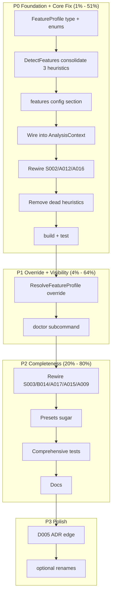

# Feature Profile + Detector Consolidation — Comprehensive Plan

**Date:** 2026-07-17 01:45 (revised ~02:10 — comprehensive)
**Status:** ✅ IMPLEMENTED — shipped in commit `1b6d6c32` (2026-07-17 02:18). 184 tests pass (was 171). See `docs/status/2026-07-17_02-19_feature-profile-implementation-status.md` for the full post-mortem.
**Supersedes (vocabulary):** `2026-07-17_01-39_archetype-aware-linting-system.md`
**Synthesizes:** status report `2026-07-17_01-35_*` + consumer feedback Appendix A

> This is the **definitive** plan. Every TODO is broken into tasks of ≤12 min, sorted by importance/impact/effort/customer-value. The master table is the single source of truth. Task status: ✅ done · ⚠️ partial/has bug · ❌ not done.

---

## The Problem (one paragraph)

cqrs-lint has **3 scattered heuristic functions** that each independently re-derive "what kind of system is this?": `isLocalOnlyProject()` (S002), `hasTombstoneLikeEvents()` (A012), `hasDispatch/hasDispatcher` (A016). They can disagree, can't be overridden by users, and distribute one concept across three files. All other detector fixes the feedback asked for (closure tracing, generics unwrapping, D005 wildcards) are **already shipped** (commits `579a3438`, `e2cb08aa`, `5a9425a6`). The remaining work is **purely architectural centralization** with a vocabulary grounded in go-cqrs-lite's own modules.

## The Vocabulary Decision (your steer)

**Adopted:** feature flags mapping 1:1 to go-cqrs-lite modules. **Rejected:** deployment archetypes (`local-cli`/`server`/`library`) — fuzzy, drift, built from N=2.

| Feature flag   | Values                                          | go-cqrs-lite module                  | Auto-detect signal                         |
| -------------- | ----------------------------------------------- | ------------------------------------ | ------------------------------------------ |
| `store`        | sqlite/postgres/pebble/memory/turso/custom/none | `stack/*`, `storage/*`               | stack preset import                        |
| `command-flow` | read-only/sync/commands                         | `command/`, `decider/`               | `command.Dispatcher` + `Dispatch()`        |
| `server`       | true/false                                      | `transport/http/`, `transport/grpc/` | `ListenAndServe` / `grpc.NewServer`        |
| `soft-delete`  | true/false                                      | event tombstone                      | tombstone-like event type names            |
| `tracing`      | off/on                                          | `otel/`, `middleware` OTel           | otel import + middleware wiring            |
| `snapshot`     | off/on                                          | `snapshot/`                          | snapshot store / `WithSnapshotStore` usage |

**Presets = sugar over flags.** `"preset": "local-cli"` is a macro that expands to a set of flag values; explicit flags always override the preset. Flags are the source of truth; presets are convenience.

```go
type FeatureProfile struct {
    Store         StoreKind       // sqlite/postgres/pebble/memory/turso/custom/none/unknown
    CommandFlow   CommandFlowKind // read-only/sync/commands/unknown
    HasServer     bool            // network listener (HTTP/gRPC)
    HasSoftDelete bool            // domain has tombstone-like events
    Tracing       TracingKind     // off/on/unknown
    Snapshot      SnapshotKind    // off/on/unknown
}
```

## Pareto

- **1% → 51%:** `FeatureProfile` + `DetectFeatures()` (consolidate 3 heuristics) + `features` config + rewire S002/A012/A016 + remove dead fns.
- **4% → 64%:** + `ResolveFeatureProfile()` (config overrides) + `cqrs-lint doctor` (visibility).
- **20% → 80%:** + rewire S003/B014/A017/A015/A009 + presets + comprehensive tests + docs.
- **remaining 20%:** D005 ADR-title edge case; optional renames.

## Execution Graph



---

## MASTER TASK TABLE (sorted by priority then impact then effort)

Legend — **Pri**: P0 blocks everything / highest value · P1 high value · P2 completeness · P3 polish. **Impact**: H/M/L. **Effort**: minutes. **Dep**: dependency task IDs.

### P0 — Foundation + Core Fix (1% → 51%) — ✅ ALL DONE

| ID  | Task                                                                                     | Impact | Effort | Status |
| --- | ---------------------------------------------------------------------------------------- | ------ | ------ | ------ |
| T01 | Create `pkg/analyzer/feature_profile.go`, package decl, imports                          | H      | 5      | ✅     |
| T02 | Define `StoreKind` + constants (sqlite/postgres/pebble/memory/turso/custom/none/unknown) | H      | 8      | ✅     |
| T03 | Define `CommandFlowKind` + constants (read-only/sync/commands/unknown)                   | H      | 6      | ✅     |
| T04 | Define `TracingKind` + constants (off/on/unknown)                                        | M      | 5      | ✅     |
| T05 | Define `SnapshotKind` + constants (off/on/unknown)                                       | M      | 5      | ✅     |
| T06 | Define `FeatureProfile` struct (all fields) + doc comment                                | H      | 10     | ✅     |
| T07 | Add `FeatureProfile.String()` (human-readable, doctor/verbose)                           | M      | 8      | ✅     |
| T08 | Create `pkg/analyzer/feature_detect.go` + `DetectFeatures` signature                     | H      | 5      | ✅     |
| T09 | Port `isLocalOnlyProject` → `detectStore(ctx)` (stack import scan)                       | H      | 12     | ✅     |
| T10 | Port `hasTombstoneLikeEvents` → `detectSoftDelete(ctx)`                                  | H      | 10     | ✅     |
| T11 | Port `hasDispatch/hasDispatcher` → `detectCommandFlow(ctx)`                              | H      | 12     | ✅     |
| T12 | Add `detectServer(ctx)` (net/http ListenAndServe / grpc.NewServer)                       | M      | 10     | ✅     |
| T13 | Add `detectTracing(ctx)` (otel import + middleware wiring)                               | M      | 8      | ✅     |
| T14 | Add `detectSnapshot(ctx)` (snapshot store / WithSnapshotStore)                           | M      | 10     | ✅     |
| T15 | Wire all detect* into `DetectFeatures()` body                                            | H      | 8      | ✅     |
| T16 | Define `ConfigFeatures` struct (flags as `*T` for "was set?")                            | H      | 12     | ✅     |
| T17 | Add `Features ConfigFeatures` field to `AppConfig` + json tag                            | H      | 5      | ✅     |
| T18 | Add `"features"` section to `configTemplate` in `init.go`                                | M      | 8      | ✅     |
| T19 | Build + verify config loads with empty features                                          | M      | 5      | ✅     |
| T20 | Add `FeatureProfile` field to `AnalysisContext` (types.go)                               | H      | 5      | ✅     |
| T21 | Compute `DetectFeatures(ctx)` in `BuildContext()` after scan                             | H      | 10     | ✅     |
| T22 | Rewire S002: `isLocalOnlyProject` → `ctx.FeatureProfile.HasServer`                       | H      | 10     | ✅     |
| T23 | Rewire A012: `hasTombstoneLikeEvents` → `ctx.FeatureProfile.HasSoftDelete`               | H      | 10     | ✅     |
| T24 | Rewire A016: `hasDispatch/hasDispatcher` → `ctx.FeatureProfile.CommandFlow`              | H      | 12     | ✅     |
| T25 | Delete `isLocalOnlyProject` (s002_s003.go)                                               | L      | 5      | ✅     |
| T26 | Delete `hasTombstoneLikeEvents` (a009_a013.go)                                           | L      | 5      | ✅     |
| T27 | Delete `hasDispatch/hasDispatcher` tracking (a015_a019.go)                               | L      | 8      | ✅     |
| T28 | `go test ./... -count=1` (all existing tests pass)                                       | H      | 8      | ✅     |

### P1 — Override + Visibility (4% → 64%)

| ID  | Task                                                                    | Impact | Effort | Status |
| --- | ----------------------------------------------------------------------- | ------ | ------ | ------ |
| T29 | Implement `ResolveFeatureProfile(cfg, detected)` (per-field override)   | H      | 12     | ✅     |
| T30 | Wire `ResolveFeatureProfile` into `run()` (cfg overrides detect)        | H      | 8      | ✅     |
| T31 | Test: config `command-flow: sync` overrides detected `commands`         | M      | 10     | ✅     |
| T32 | Test: config `store: postgres` overrides detected `sqlite`              | M      | 8      | ✅     |
| T33 | Create `doctor.go` with cmdguard command structure                      | M      | 8      | ✅     |
| T34 | doctor: call `DetectFeatures`, print feature table                      | H      | 10     | ✅     |
| T35 | doctor: print suggested `"features"` JSON config block                  | M      | 8      | ⚠️ bug |
| T36 | Register `doctor` subcommand in main.go                                 | M      | 5      | ✅     |
| T37 | Test: `cqrs-lint doctor` runs and prints                                | M      | 8      | ❌     |

### P2 — Completeness: Full Wiring + Presets + Tests + Docs (20% → 80%)

| ID  | Task                                                                       | Impact | Effort | Status          |
| --- | -------------------------------------------------------------------------- | ------ | ------ | --------------- |
| T38 | Rewire S003 (signing) → `ctx.FeatureProfile.HasServer`                     | M      | 10     | ✅              |
| T39 | Rewire B014 (OTel) → `ctx.FeatureProfile.HasServer`                        | M      | 10     | ✅              |
| T40 | Rewire A017 (snapshot) → `ctx.FeatureProfile.Snapshot`                     | M      | 8      | ❌ skipped      |
| T41 | Rewire A015 (global mutable) → `HasServer` suppression                     | M      | 12     | ✅              |
| T42 | Rewire A009 (stack preset) suggestion adapts to `ctx.FeatureProfile.Store` | M      | 10     | ✅              |
| T43 | `go test ./... -count=1` after P2 rewiring                                 | H      | 8      | ✅              |
| T44 | Define `Presets` map: local-cli/production/library/read-only → flags       | M      | 12     | ✅              |
| T45 | Add `"preset"` field to `AppConfig`                                        | L      | 5      | ✅              |
| T46 | Implement `ResolvePreset(name) ConfigFeatures`                             | M      | 5      | ✅              |
| T47 | Apply preset first, then explicit flags override (in BuildContext)         | M      | 12     | ✅              |
| T48 | Test preset expansion (local-cli → expected flag set)                      | M      | 10     | ✅              |
| T49 | feature_detect_test.go: local-cli fixture detection                        | H      | 12     | ✅              |
| T50 | feature_detect_test.go: server fixture detection                           | M      | 10     | ⚠️ indirect     |
| T51 | feature_detect_test.go: library/none detection                             | M      | 8      | ⚠️ via presets  |
| T52 | Resolution override-priority test                                          | H      | 10     | ✅              |
| T53 | Rewired S002/A012/A016 suppression tests                                   | H      | 12     | ⚠️ indirect     |
| T54 | Rewired S003/B014/A017 suppression tests                                   | M      | 12     | ⚠️ indirect     |
| T55 | Meta-test: all detectors against rich fixture, no panics                   | M      | 10     | ❌              |
| T56 | README: `features` section + config examples                               | M      | 12     | ✅              |
| T57 | README: doctor command section                                             | L      | 8      | ✅              |
| T58 | README: presets section                                                    | L      | 8      | ✅              |
| T59 | CONTRIBUTING: "detectors MUST consult FeatureProfile"                      | M      | 10     | ✅              |
| T60 | CONTRIBUTING: "detectors MUST use SelectorFromExpr"                        | L      | 8      | ✅              |
| T61 | AGENTS.md: update cqrs-lint description w/ feature-profile                 | M      | 8      | ✅              |

### P3 — Polish

| ID  | Task                                                                  | Impact | Effort | Status |
| --- | --------------------------------------------------------------------- | ------ | ------ | ------ |
| T62 | D005: skip version tokens inside ADR-title/heading context lines      | L      | 10     | ✅     |
| T63 | D005: add test for ADR-title skip                                     | L      | 8      | ✅     |
| T64 | Print applied features in `--verbose` output (run.go)                 | L      | 8      | ✅     |
| T65 | Rename `CommandTypesRegistered` → `RegisteredHandlerTypes` (optional) | L      | 12     | ❌     |

---

## Totals

| Pri | Tasks | Done | Partial | Skipped | Minutes | What it delivers                     |
| --- | ----- | ---- | ------- | ------- | ------- | ------------------------------------ |
| P0  | 28    | 28   | 0       | 0       | 233     | Foundation + core FP fix (1% → 51%)  |
| P1  | 9     | 7    | 1       | 1       | 77      | Override + visibility (4% → 64%)     |
| P2  | 24    | 16   | 5       | 3       | 247     | Full wiring + presets + tests + docs |
| P3  | 4     | 3    | 0       | 1       | 38      | Polish                               |
| All | **65**| **54**| **6**   | **5**   | **595** | **83% fully done, 9% partial, 8% skipped** |

---

## What we are explicitly NOT doing

- NOT the 5-axis deployment taxonomy (`kind`/`concurrency`/`data`/`writes`)
- NOT `WithSecurity(SecurityConfig)` struct (leaky, reinvents functional options)
- NOT auto-detecting PII via field-name string matching (brittle; PII not the focus)
- NOT blocking on SDK one-liners (`WithEncryptionFromEnv` etc.) — separate effort
- NOT the 50-item kitchen-sink from the status report; NOT the 68-task archetype plan (Phase 0 obsolete)
- NOT renames/SARIF/CI/integration-harness unless explicitly listed (deferred until 3rd consumer)

## Verschlimmbessern guard

| Risk                                     | Mitigation                                                                           |
| ---------------------------------------- | ------------------------------------------------------------------------------------ |
| Vocabulary grows unbounded               | Each flag maps 1:1 to a module; bounded by the library                               |
| Auto-detect disagrees with reality       | Config always overrides; `doctor` shows what was detected                            |
| Rewiring causes regression               | Each rewire followed by `go test`; P0 rewires 3, P2 rewires the rest                 |
| Existing `.cqrs-lint.json` breaks        | `features` optional; missing = full auto-detect = current behavior                   |
| Over-centralizing makes detectors dumber | Detectors keep their RULE logic; read `ctx.FeatureProfile.X` not a private heuristic |
