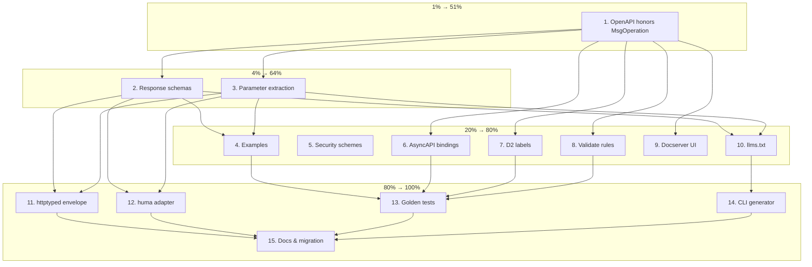

# Make Catalog Fantastic — Pareto Execution Plan

> **Scope:** `go-cqrs-lite/catalog` module (v4)  
> **Date:** 2026-07-17 04:26  
> **Context:** After a deep-dive audit of `go-cqrs-lite/catalog` usage in DiscordSync and a comparison with Huma, this plan closes the highest-leverage gaps while keeping catalog framework-agnostic. The single biggest finding: `catalog.Message.Operation` (`Method`, `Path`, `StatusCodes`) is stored but **ignored by the OpenAPI exporter**.

---

## 1. Pareto Breakdown

| Tier | Effort share | Value delivered | Theme | Keys to success |
|---|---|---|---|---|
| **1%** | ~1% of total effort | **51%** of the value | **Honest OpenAPI for REST** | Make `MsgOperation` actually render in OpenAPI. Today it is a write-only field; fixing this turns catalog from an event-only doc generator into a real REST API documenter. |
| **4%** | ~4% cumulative effort | **64%** cumulative value | **Typed request/response contracts** | Add response body schemas and extract `query`/`path`/`header`/`cookie` parameters from struct tags. This is what Huma does from handler reflection; catalog can do it from explicit registrations. |
| **20%** | ~20% cumulative effort | **80%** cumulative value | **Professional docs surface** | Security schemes, examples, AsyncAPI/D2 operation bindings, docserver UI improvements, validation rules. |
| **80%** | ~80% cumulative effort | **100%** value | **Ecosystem integration** | Optional `catalog/huma` adapter, `catalog/httptyped` envelope, CLI generator, golden tests, migration guides. |

> **Bottom line:** The first three tiers (20% of the effort) make catalog genuinely competitive with Huma for documentation; the remaining 80% make it ecosystem-friendly without coupling to any framework.

---

## 2. Comprehensive Plan (30–100 min tasks)

15 tasks. Sorted by impact, then by safe execution order (dependencies first).

| # | Task | Est. | Impact | Effort | Pareto tier | Dependencies | Deliverable |
|---|---|---:|---|---:|---|---|---|
| 1 | **OpenAPI exporter honors `MsgOperation` (`Method`, `Path`, `StatusCodes`)** | 90m | Critical | Medium | 1% | — | `openapi/exporter.go` uses `msg.Operation` when present; auto-derived path is fallback. |
| 2 | **Add typed response body schemas per status code** | 90m | High | Medium | 4% | #1 design | New `Response` type on `Message` + OpenAPI exporter renders response `$ref`s. |
| 3 | **Extract query/path/header/cookie params from struct tags** | 90m | High | Medium | 4% | #1, #2 | `catalog` schema tags gain `query`, `header`, `path`, `cookie` locations; OpenAPI `parameters` populated. |
| 4 | **Operation-level examples support** | 60m | Medium | Low | 20% | #2 | `Message.Examples` + per-response `Examples`; rendered in OpenAPI/AsyncAPI/EventCatalog. |
| 5 | **Security scheme support** | 60m | Medium | Low | 20% | #1 | `SecurityScheme` type on catalog + OpenAPI exporter; `Security` on message/service. |
| 6 | **AsyncAPI `Operation` metadata from `MsgOperation`** | 60m | Medium | Low | 20% | #1 | AsyncAPI builder copies HTTP method/path into operation `bindings`/`tags`. |
| 7 | **D2 diagram operation/HTTP labels** | 60m | Medium | Low | 20% | #1 | D2 exporter shows HTTP method + path on command/query nodes. |
| 8 | **`Catalog.Validate` operation-path conflict rules** | 60m | Medium | Low | 20% | #1 | Detect duplicate `(Method, Path)` tuples, empty `Operation.Path`, missing response schemas. |
| 9 | **Docserver route registration + UI navigation** | 60m | Medium | Low | 20% | #1 | `RegisterRoutes` exposes operation-bound docs; Scalar UI links to operations. |
| 10 | **`llms.txt` generation from docserver** | 60m | Medium | Low | 20% | #2, #3 | Standalone `GenerateLLMsTxt(cat, dir)` including operations and parameters. |
| 11 | **`catalog/httptyped` envelope (optional)** | 90m | Medium | High | 80% | #2, #3 | Generic `Request[In, Out]` / `Response[Out]` structs for consumers who want typed envelopes without a framework. |
| 12 | **`catalog/huma` adapter sketch (optional)** | 90m | Medium | High | 80% | #1–#3 | Adapter that introspects a Huma router and emits catalog registrations; proves ecosystem compatibility without forcing Huma on all users. |
| 13 | **Golden tests for OpenAPI/AsyncAPI output** | 60m | High | Medium | 80% | #1–#8 | `testdata/golden/` files + `-update` flag; prevents regressions in docs output. |
| 14 | **CLI `go-cqrs-lite-catalog` generator** | 90m | Medium | High | 80% | #10 | `go-cqrs-lite-catalog generate` command that writes OpenAPI/AsyncAPI/EventCatalog/llms.txt from a Go package that exports a `*catalog.Catalog`. |
| 15 | **README/examples/migration notes** | 60m | Medium | Low | 80% | #1–#14 | Updated docs, working examples, `v4.1` migration guide. |

**Total rough wall-clock estimate:** ~17 hours (15 tasks × ~70 min average).

---

## 3. Detailed Breakdown (max 12 min each)

Each comprehensive task is split into 12-minute-or-finer steps. ~70 steps total. Steps are ordered by dependency; steps with the same `#` belong to the same parent task.

| # | Step | Est. | Parent | Notes |
|---|------|---:|---|-------|
| 1.1 | Read `openapi/exporter.go` and map every place `msg.Operation` is ignored | 10m | #1 | Document current behavior in comments. |
| 1.2 | Define path-resolution precedence: explicit `Operation.Path` > auto-derived > basePath fallback | 10m | #1 | Write decision in an ADR or commit message. |
| 1.3 | Modify `addCommand` to use `Operation.Method`/`Path` when present; keep POST default | 12m | #1 | Preserve backward compatibility. |
| 1.4 | Modify `addQuery` to use `Operation.Method`/`Path` when present; keep GET default | 12m | #1 | Query default is GET. |
| 1.5 | Modify `addEvent` to use `Operation.Path` when present (optional webhook path) | 10m | #1 | Events rarely need this, but the field exists. |
| 1.6 | Wire `Operation.StatusCodes` into the OpenAPI response map | 10m | #1 | Empty status codes default to current behavior. |
| 1.7 | Add unit tests for `MsgOperation` override in `openapi/exporter_test.go` | 12m | #1 | At least command + query + event. |
| 1.8 | Update `simple/builder_test.go` if expectations changed | 10m | #1 | Verify simple builder still works. |
| 2.1 | Design `Response` type: status code, body schema, description, examples | 10m | #2 | Keep it optional on `Message`. |
| 2.2 | Add `Responses []Response` to `Message` struct + builder option `WithResponse` | 12m | #2 | `Response` type goes in `types_helpers.go` or new `types_responses.go`. |
| 2.3 | Add `Response[T any](status, description string) MessageOption` helper | 12m | #2 | Generic body schema auto-derived. |
| 2.4 | Update OpenAPI `addCommand` to render `Responses` array | 12m | #2 | `200` still default if no `Responses` provided. |
| 2.5 | Update OpenAPI `addQuery` to render `Responses` array | 12m | #2 | Use response body `$ref` for success. |
| 2.6 | Add tests for response schemas in `openapi/exporter_test.go` | 12m | #2 | Verify `$ref` and `description`. |
| 2.7 | Propagate `Responses` to EventCatalog frontmatter | 10m | #2 | Frontmatter already has operation section. |
| 3.1 | Extend schema reflection to read `query`, `header`, `path`, `cookie` struct tags | 12m | #3 | Schema tag parser in `schema/` package. |
| 3.2 | Add `Parameter` metadata to `catalog.Schema.Property` or separate param extraction | 10m | #3 | Decide representation; avoid breaking `Schema` JSON shape. |
| 3.3 | Implement `extractParameters(path, schema, locations...)` in OpenAPI exporter | 12m | #3 | Path params from `path` tag; query from `query` tag; etc. |
| 3.4 | Remove/extend `extractIDParameter` to use generic param extraction | 10m | #3 | Keep backward compatibility for `_id` suffix convention. |
| 3.5 | Add `WithParam`/`WithQuery`/`WithHeader` message options as alternatives | 12m | #3 | Convenience for users not using struct tags. |
| 3.6 | Add OpenAPI tests for parameters in `query`, `header`, `path`, `cookie` | 12m | #3 | Include required vs optional. |
| 3.7 | Update `simple` builder to support operation-bound query params | 10m | #3 | Ensure facade stays useful. |
| 4.1 | Add `Examples` field to `Message` and `Response` | 10m | #4 | Type: `[]jsontext.Value` or `[]any`. |
| 4.2 | Add `WithExample` / `WithResponseExample` message options | 10m | #4 | Accept JSON-encoded bytes or `any`. |
| 4.3 | Render examples in OpenAPI request body and responses | 10m | #4 | Use `example` or `examples` field. |
| 4.4 | Render examples in AsyncAPI message payloads | 10m | #4 | AsyncAPI supports `examples` array. |
| 4.5 | Add examples to EventCatalog frontmatter | 10m | #4 | YAML frontmatter examples. |
| 4.6 | Add tests for example serialization | 10m | #4 | Round-trip JSON. |
| 5.1 | Add `SecurityScheme` and `SecurityRequirement` types to catalog | 10m | #5 | Mirror OpenAPI 3.0 subset (http bearer, apiKey, oauth2). |
| 5.2 | Add `ServiceSecurity` and `MsgSecurity` options | 10m | #5 | Attach to service or message. |
| 5.3 | Render `securitySchemes` in OpenAPI components | 10m | #5 | Map catalog types to OpenAPI. |
| 5.4 | Render `security` per operation/path | 10m | #5 | Service-level applies to all; message-level overrides. |
| 5.5 | Add security tests | 10m | #5 | Bearer + API key. |
| 6.1 | Add `bindings.http` to AsyncAPI operation when `Operation.Method` is set | 10m | #6 | AsyncAPI 3.0 HTTP binding. |
| 6.2 | Add operation `tags` with HTTP method/path info | 10m | #6 | Improves AsyncAPI discoverability. |
| 6.3 | Add AsyncAPI tests for operation bindings | 10m | #6 | Golden or assertion. |
| 7.1 | Update D2 exporter to read `msg.Operation` | 10m | #7 | D2 already has `Command`/`Query`/`Event` nodes. |
| 7.2 | Append `GET /things` label under node name | 10m | #7 | D2 label supports multi-line. |
| 7.3 | Add D2 tests for operation labels | 10m | #7 | Golden tests. |
| 8.1 | Add `Validate` rule: duplicate `(Method, Path)` across messages | 10m | #8 | Warn/error with path. |
| 8.2 | Add `Validate` rule: empty `Operation.Path` when `Operation.Method` set | 10m | #8 | Catches incomplete registrations. |
| 8.3 | Add `Validate` rule: response schemas present for 2xx codes | 10m | #8 | Encourages typed responses. |
| 8.4 | Add `Validate` tests | 10m | #8 | Use `catalog_test.go` or `validate_test.go`. |
| 9.1 | Update `docserver.RegisterRoutes` to register `GET /docs/operations` | 10m | #9 | Returns HTML list of operation-bound paths. |
| 9.2 | Update Scalar HTML template to include operation links | 10m | #9 | Static template change. |
| 9.3 | Add `CatalogJSON` endpoint to `RegisterRoutes` (already exists but not wired) | 10m | #9 | Verify. |
| 9.4 | Add docserver tests for `RegisterRoutes` | 10m | #9 | Table-driven route assertions. |
| 10.1 | Extract `writeLLMsTxt` logic to public `GenerateLLMsTxt(cat, dir)` | 10m | #10 | Currently internal in `eventcatalog/writer_llms.go`. |
| 10.2 | Include operation method/path in `llms.txt` output | 10m | #10 | Under each service section. |
| 10.3 | Include parameters and responses in `llms.txt` | 10m | #10 | Makes it useful for AI consumers. |
| 10.4 | Add `llms.txt` test | 10m | #10 | Snapshot. |
| 11.1 | Design `httptyped.Request[In, Out]` and `httptyped.Response[Out]` | 10m | #11 | Optional package, no breaking changes. |
| 11.2 | Implement request/response structs | 12m | #11 | Generic schemas via `SchemaFromType`. |
| 11.3 | Add helper to register typed request/response in builder | 12m | #11 | `httptyped.Command[In, Out](b, ...)` style. |
| 11.4 | Add tests | 10m | #11 | Round-trip. |
| 12.1 | Define `catalog/huma` adapter interface | 10m | #12 | Takes `huma.API` or `[]huma.Operation`. |
| 12.2 | Implement reflection over Huma operations to catalog messages | 12m | #12 | Map Huma input/output to catalog request/response. |
| 12.3 | Add minimal test using a mock Huma router | 12m | #12 | No real Huma dependency in core. |
| 12.4 | Document adapter as experimental | 10m | #12 | README note. |
| 13.1 | Create `testdata/golden/openapi/` and `testdata/golden/asyncapi/` | 10m | #13 | Directory structure. |
| 13.2 | Add `TestExporterGolden` with `-update` flag | 12m | #13 | Standard pattern. |
| 13.3 | Generate initial golden files | 10m | #13 | Run once. |
| 13.4 | Add CI check that golden files are up to date | 10m | #13 | `nix` or `go test` check. |
| 14.1 | Create `cmd/go-cqrs-lite-catalog/` main.go | 10m | #14 | CLI entry. |
| 14.2 | Implement `generate` subcommand with format flags | 12m | #14 | `--format=openapi,asyncapi,eventcatalog,llms`. |
| 14.3 | Implement package loading via `go/packages` | 12m | #14 | Find catalog variable. |
| 14.4 | Add CLI tests | 12m | #14 | Integration with small module. |
| 14.5 | Wire CLI into `flake.nix` apps | 10m | #14 | `nix run .#go-cqrs-lite-catalog`. |
| 15.1 | Update `catalog/README.md` with REST/operation examples | 12m | #15 | Show `MsgOperation` + `Response`. |
| 15.2 | Add `catalog/example/rest` working example | 12m | #15 | Runnable code. |
| 15.3 | Write `v4.1` migration guide (additive changes only) | 10m | #15 | No breaking changes if possible. |
| 15.4 | Update `CHANGELOG.md` | 10m | #15 | Summarize all additions. |

---

## 4. Execution Graph (Mermaid)

---

## 5. Why This Plan (Not Huma)

Huma is an **enforcement + runtime validation** framework. Catalog is a **documentation + DDD modeling** library. They are peers, not replacements.

The gaps that made DiscordSync consider Huma are actually **catalog bugs/omissions**:

| Perceived Huma advantage | Catalog fix in this plan |
|---|---|
| OpenAPI generated from handlers | OpenAPI generated from `Command[T]`/`Query[T]` + `MsgOperation` (already the design intent; the exporter just ignores it) |
| Typed request/response schemas | Add `Response[T]` and parameter tags |
| Validation | Out of scope for catalog. Apps can layer `httptyped` + their own validator. |
| Framework integration | Optional `catalog/huma` adapter, not a core dependency. |

**Core principle:** Catalog stays framework-agnostic. Any framework bridge lives in an optional sub-package.

---

## 6. Risks & Mitigations

| Risk | Mitigation |
|---|---|
| Breaking existing OpenAPI output for consumers relying on auto-derived paths | Keep auto-derived path as the fallback; only override when `Operation` is explicitly set. |
| Bloating the core `catalog` package with REST features | Put optional REST-specific helpers in `catalog/httptyped`; keep core `Message` additions minimal. |
| Huma adapter becomes a maintenance burden | Mark `catalog/huma` experimental; don't guarantee stability until a second consumer asks for it. |
| Golden tests become noisy on every minor formatting change | Use `-update` workflow; normalize JSON before comparison. |
| CLI depends on `go/packages` and Go toolchain | Make CLI a separate module or optional build; don't add to core `go.mod`. |

---

## 7. Success Criteria

- [ ] Existing `catalog` tests pass without modification (backward compatibility).
- [ ] DiscordSync can register its 25 REST endpoints with `Command[T]`/`Query[T]` + `MsgOperation` and see them in `/api/docs`.
- [ ] OpenAPI output includes response body schemas and query/path parameters for registered operations.
- [ ] AsyncAPI output includes HTTP operation bindings when `Operation.Method` is set.
- [ ] D2 diagram shows operation method/path on relevant nodes.
- [ ] `Catalog.Validate()` catches duplicate operation paths and missing response schemas.
- [ ] Golden tests exist for OpenAPI and AsyncAPI output.
- [ ] README includes a working REST example.

---

## 8. Next Immediate Action (12 minutes)

**Step 1.1:** Read `catalog/openapi/exporter.go` and map every place `msg.Operation` is currently ignored. This is the 1% action that unlocks 51% of the value.

---

*Plan generated 2026-07-17 04:26. Reviewed against go-cqrs-lite catalog v4.0.0 local source and Huma v2 documentation at https://huma.rocks/.*
