# Timezone Handling Strategy: Pareto Execution Plan

**Date:** 2026-07-18
**Author:** Crush (Parakletos)
**Status:** Proposed
**Scope:** go-cqrs-lite + 22 consumer projects
**Trigger:** v4 CBOR migration revealed silent `time.Time` data corruption

---

## 1. Executive Summary

The v4 migration switched go-cqrs-lite's default event payload codec from JSON to CBOR.
The CBOR codec uses `fxamacker/cbor`'s `CanonicalEncOptions()` **without configuring the
`Time` field**, which defaults to `TimeUnix` — encoding `time.Time` as **epoch seconds**.

This causes **two forms of silent data corruption** in every event payload that contains
a `time.Time` field:

1. **Precision loss:** Sub-second values (nanoseconds) are truncated to whole seconds
2. **Timezone loss:** Epoch integers carry no timezone; decoded values reconstruct in
   the server's local timezone (`time.Local`), not UTC

The event **envelope** (`OccurredAt`) is unaffected — it is stored as `int64` UnixNano.
Only **payloads** (user-defined structs with `time.Time` fields) are corrupted.

**Root cause:** One missing config line in `codec/cbor.go:28` and `codec/cbor_compact.go:39`.
**Fix:** Set `opts.Time = cbor.TimeUnixDynamic` before `EncMode()`.

---

## 2. Empirical Evidence

Test: encode `2026-07-17T14:30:45.123456789Z` through three CBOR time modes:

| Mode                         | Bytes               | Decoded Value           | Nano Preserved?        | TZ Preserved?     |
| ---------------------------- | ------------------- | ----------------------- | ---------------------- | ----------------- |
| `TimeUnix` (current default) | `1a6a5a3c95` (5B)   | `16:30:45 +0200 CEST`   | **NO** (loses 789M ns) | **NO** (local TZ) |
| `TimeRFC3339`                | `74...34355a` (21B) | `14:30:45 +0000 UTC`    | **NO** (no fractional) | **YES** (offset)  |
| `TimeUnixDynamic`            | `fb41da...b8` (9B)  | `16:30:45.123457 +0200` | **~YES** (165ns drift) | **NO** (local TZ) |

**Conclusion:** No built-in option is perfect. `TimeUnixDynamic` is the best default
(preserves nanos, compact). Timezone must be handled by convention (`.UTC()` for instants,
explicit types for wall-clocks).

Timezone reconstruction test (`America/New_York` input):

| Mode              | Decoded Location                  | Offset Preserved?                      |
| ----------------- | --------------------------------- | -------------------------------------- |
| `TimeRFC3339`     | `-0400` (fixed offset, not named) | **Partial** (offset yes, IANA name no) |
| `TimeUnixDynamic` | `Local` (server TZ)               | **NO**                                 |

---

## 3. Affected Projects Audit

### Tier A: HIGH RISK — Wall-clock / Deadline semantics (timezone matters critically)

| Project                 | File                                         | Field(s)                                                                          | Semantics                             |
| ----------------------- | -------------------------------------------- | --------------------------------------------------------------------------------- | ------------------------------------- |
| **Standup-Killer**      | `domain/cqrs/events.go`                      | `Schedule.ReminderTime` (HHMM), `Schedule.ReportTime` (HHMM), `Schedule.Timezone` | Recurring schedule                    |
| **Standup-Killer**      | `domain/cqrs/events.go`                      | `CheckinSubmittedPayload.Date`                                                    | Calendar date                         |
| **website-holger-hahn** | `internal/domain/events.go`                  | `ExperienceCreatedEvent.StartDate`, `ExperienceEndedEvent.EndDate`                | Employment dates                      |
| **SwettySwipperWeb**    | `services/domain-types/metadata/metadata.go` | `EXIF.DateTaken *time.Time`                                                       | Photo capture (notoriously ambiguous) |
| **KeyCountdown**        | `internal/domain/lock/events.go`             | `TargetTimeSetPayload.TargetTime`                                                 | Lock deadline                         |
| **KeyCountdown**        | `internal/domain/lock/events.go`             | `SexRecordedPayload.SexDate`, `LastSexRecordedEvent.LastSexDate`                  | Calendar date                         |
| **KeyCountdown**        | `internal/domain/lock/events.go`             | `LockStartedPayload.StartTime`                                                    | Session anchor                        |
| **reports**             | `app/internal/timeentry/domain/events.go`    | `TimeEntryStarted.StartedAt`, `TimeEntryStopped.EndedAt`                          | Timesheet clock-in/out                |
| **ChastityAPI**         | `internal/es/events.go`                      | `UserSessionStartedEvent.ExpiresAt`                                               | Session expiry deadline               |
| **DiscordSync**         | `internal/events/payloads.go`                | `MemberJoinedPayload.CommunicationDisabledUntil`                                  | Timeout deadline                      |
| **DiscordSync**         | `internal/events/payloads.go`                | `PollPayload.Expiry`                                                              | Poll expiry deadline                  |
| **StopTube**            | `internal/domain/events.go`                  | `BlockStateChangedEvent.BlockedAt`                                                | Block start                           |

### Tier B: MEDIUM RISK — Instant fields (precision loss, timezone less critical)

| Project               | Fields                                                                                                                     | Count |
| --------------------- | -------------------------------------------------------------------------------------------------------------------------- | ----- |
| **crush-daily**       | `CollectedAt`, `GeneratedAt` (x3)                                                                                          | 4     |
| **SEC**               | `OccurredAt`, `PlayedAt` (x2), `RestartedAt`, `WipedAt`, `AbandonedAt`, `StartedAt`, `SelectedAt`, `ResolvedAt`, `EndedAt` | 10+   |
| **Zlota44**           | `DiscoveredAt`, `CheckedAt`, `FailedAt`                                                                                    | 3     |
| **github-local-sync** | `CreatedAt`, `DeletedAt`, `PushedAt`, `Timestamp`                                                                          | 4     |
| **Kernovia**          | `PluginMetadata.OccurredAt`, `UnifiedEvent.Timestamp`                                                                      | 3+    |
| **SwettySwipperWeb**  | `CreatedAt` (x3), `VotedAt`, `ForwardedAt`                                                                                 | 5+    |
| **Standup-Killer**    | `CreatedAt` (x3)                                                                                                           | 3     |

### Tier C: NOT AFFECTED — Already correct

| Project                          | Strategy                          | Why Safe                   |
| -------------------------------- | --------------------------------- | -------------------------- |
| **bank-sync**                    | RFC3339 `string` fields           | No `time.Time` in payloads |
| **go-localsync**                 | `int64` UnixNano with helpers     | Explicit integer encoding  |
| **accountability-system**        | `string` for `TargetDate`         | No `time.Time`             |
| **InboxClean**                   | No time fields in payloads        | Clean                      |
| **cqrs-htmx**                    | Deliberately excludes `CreatedAt` | Clean                      |
| **standard-bug-tracking-schema** | Strings in event payloads         | Clean                      |
| **nobletary**                    | Only event-type constants         | Clean                      |

---

## 4. Architecture Decision: How to Handle Time

### The Two Kinds of Time

|               | **Instant**                                | **Wall-clock**                                |
| ------------- | ------------------------------------------ | --------------------------------------------- |
| **Question**  | "When did this happen?"                    | "9am, for whom?"                              |
| **Examples**  | `created_at`, `occurred_at`, log timestamp | Meeting schedule, business hours, appointment |
| **Semantics** | One unique physical moment                 | A time-of-day tied to a location              |
| **DST-safe?** | Immune (UTC)                               | **Fatal if converted to UTC**                 |
| **Storage**   | `int64` UnixNano or `.UTC()` `time.Time`   | Components + IANA tz name                     |
| **API input** | RFC3339 with offset (`...Z`, `...-05:00`)  | Wall time + explicit `timezone` field         |

### Recommended Approach

1. **CBOR codec:** Set `Time = TimeUnixDynamic` (preserves nanos, compact, deterministic)
2. **Instant convention:** All `time.Time` in event payloads MUST be `.UTC()` before encoding
3. **Wall-clock rule:** NEVER use `time.Time` for wall-clocks. Use:
   - `string` (RFC3339Nano with offset) for one-off local times
   - `WallTime` struct (hour, minute, IANA tz name) for recurring schedules
4. **Envelope deserialization:** `time.Unix(0, nanos).UTC()` — always reconstruct as UTC
5. **API boundary:** Reject timezone-naive timestamps; require offset or IANA tz field

### Why Not TimeRFC3339?

`TimeRFC3339` preserves timezone offset but loses sub-second precision (no nanos).
`TimeUnixDynamic` preserves ~nanos but loses timezone. Since the convention mandates
`.UTC()` for instants (the only valid use of raw `time.Time` in payloads), timezone
preservation is irrelevant — UTC is UTC everywhere. For wall-clocks, we use explicit
types, not `time.Time`.

---

## 5. Pareto Breakdown

### Tier 1: The 1% That Delivers 51%

**STOP THE BLEEDING — Fix the root cause in go-cqrs-lite.**

Two configuration changes and one test. If nothing else is done, this alone stops all
ongoing data corruption for every consumer project.

| Task                                                                    | Impact                                | Effort |
| ----------------------------------------------------------------------- | ------------------------------------- | ------ |
| Set `opts.Time = cbor.TimeUnixDynamic` in `cbor.go` + `cbor_compact.go` | Stops precision loss for ALL payloads | 6min   |
| Fix `time.Unix(0, nanos).UTC()` in pebble `serialization.go`            | Fixes envelope TZ on read path        | 3min   |
| Add codec test: sub-second precision round-trip                         | Prevents regression                   | 10min  |

### Tier 2: The 4% That Delivers 64%

**DOCUMENT & LOCK IN — Make the fix permanent and understood.**

Without documentation, the next developer will put `time.Time` in a payload and hit
the same wall. This tier makes the convention explicit and discoverable.

| Task                                           | Impact                       | Effort |
| ---------------------------------------------- | ---------------------------- | ------ |
| Write `docs/TIMEZONE_HANDLING.md` (full guide) | Prevents future bugs         | 60min  |
| Update stale ADR-0019 (`time.Time` → `int64`)  | Prevents confusion           | 15min  |
| Add codec README note about time handling      | Discoverable at point of use | 10min  |

### Tier 3: The 20% That Delivers 80%

**FIX HIGH-RISK DATA — Audit and repair wall-clock fields in 8 consumer projects.**

These are the fields where timezone corruption causes **business-critical bugs**:
wrong meeting times, expired sessions, shifted deadlines.

| Task                                           | Impact                                | Effort |
| ---------------------------------------------- | ------------------------------------- | ------ |
| Fix Standup-Killer Schedule (recurring times)  | Prevents broken standup schedules     | 30min  |
| Fix KeyCountdown deadlines + remove workaround | Prevents corrupted lock release times | 30min  |
| Fix website-holger-hahn StartDate/EndDate      | Prevents wrong employment dates       | 20min  |
| Fix SwettySwipperWeb EXIF.DateTaken            | Prevents wrong photo timestamps       | 25min  |
| Fix reports timesheet times                    | Prevents wrong billing data           | 25min  |
| Fix ChastityAPI/DiscordSync/StopTube deadlines | Prevents wrong expiry/timeout         | 25min  |

### Tier 4: The Remaining 20% to Reach 100%

**POLISH & HARDEN — Fix instant fields, add type safety, prevent recurrence.**

| Task                                               | Impact                                  | Effort |
| -------------------------------------------------- | --------------------------------------- | ------ |
| Add `.UTC()` to instant fields in 7 projects       | Corrects precision for instant payloads | 55min  |
| Add `WallTime` type to go-cqrs-lite                | Type-safe wall-clocks for all consumers | 45min  |
| Add `Instant` wrapper type                         | Makes UTC convention compile-time       | 30min  |
| Create lint analyzer: flag `time.Time` in payloads | Prevents future occurrences forever     | 50min  |
| Run full verification across all 22 consumers      | Ensures no regressions                  | 30min  |
| Write consumer migration guide                     | Helps consumers adopt the fix           | 20min  |

---

## 6. Comprehensive Plan (30–100min Tasks)

Sorted by Impact/Effort ratio (descending). Dependencies noted in `Depends On` column.

| #   | Task                                                                                                                                                   | Tier | Impact   | Effort | I/E  | Depends On |
| --- | ------------------------------------------------------------------------------------------------------------------------------------------------------ | ---- | -------- | ------ | ---- | ---------- |
| 1   | **Configure CBOR codec** `Time=TimeUnixDynamic` in `cbor.go` + `cbor_compact.go`                                                                       | 1    | CRITICAL | 30min  | 10.0 | —          |
| 2   | **Fix pebble deserialization** `.UTC()` in `serialization.go`                                                                                          | 1    | HIGH     | 30min  | 8.0  | —          |
| 3   | **Write `docs/TIMEZONE_HANDLING.md`** — Instant vs Wall-clock, UTC convention, API boundary rules, CBOR encoding explanation, consumer migration guide | 2    | HIGH     | 90min  | 4.0  | 1          |
| 4   | **Fix Standup-Killer** Schedule fields (HHMM+Timezone) — verify they encode correctly or convert to explicit types                                     | 3    | CRITICAL | 45min  | 5.0  | 1          |
| 5   | **Fix KeyCountdown** deadline fields + remove CBOR→JSON workaround in `LiteToDomainEvent`                                                              | 3    | CRITICAL | 60min  | 5.0  | 1          |
| 6   | **Fix website-holger-hahn** StartDate/EndDate — convert to string or ensure `.UTC()`                                                                   | 3    | HIGH     | 30min  | 5.3  | 1          |
| 7   | **Fix reports** timesheet times — StartedAt/EndedAt need `.UTC()` or string                                                                            | 3    | HIGH     | 45min  | 4.4  | 1          |
| 8   | **Fix ChastityAPI + DiscordSync + StopTube** deadline fields                                                                                           | 3    | HIGH     | 45min  | 4.4  | 1          |
| 9   | **Fix SwettySwipperWeb** EXIF.DateTaken — hardest case, ambiguous offsets                                                                              | 3    | HIGH     | 60min  | 4.0  | 1          |
| 10  | **Update ADR-0019** — fix stale `time.Time` → `int64` mismatch                                                                                         | 2    | MEDIUM   | 30min  | 4.0  | —          |
| 11  | **Fix instant fields** in crush-daily, SEC, Zlota44 — add `.UTC()` before encoding                                                                     | 4    | MEDIUM   | 45min  | 3.5  | 1          |
| 12  | **Fix instant fields** in github-local-sync, Kernovia, SwettySwipperWeb — add `.UTC()`                                                                 | 4    | MEDIUM   | 45min  | 3.5  | 1          |
| 13  | **Run full test suite** across all 22 consumers after codec change                                                                                     | ALL  | CRITICAL | 60min  | 5.0  | 1          |
| 14  | **Add `WallTime` type** to go-cqrs-lite — `hour`, `minute`, `location string` with CBOR marshaler                                                      | 4    | MEDIUM   | 60min  | 2.7  | 3          |
| 15  | **Add `Instant` type** — wraps `time.Time`, enforces UTC at construction                                                                               | 4    | MEDIUM   | 45min  | 2.7  | 3          |
| 16  | **Create lint analyzer** — flag `time.Time` fields in event payload structs                                                                            | 4    | HIGH     | 90min  | 2.2  | 3          |
| 17  | **Add codec README + event doc.go** notes about time handling convention                                                                               | 2    | LOW      | 30min  | 2.0  | 3          |
| 18  | **Run `go vet` + `golangci-lint`** across all 22 consumers                                                                                             | 4    | MEDIUM   | 45min  | 2.3  | 13         |
| 19  | **Write consumer migration guide** — step-by-step: audit payloads, add `.UTC()`, convert wall-clocks                                                   | 2    | MEDIUM   | 30min  | 3.0  | 3          |
| 20  | **Integration test** — cross-codec time round-trip (CBOR encode → JSON decode → verify)                                                                | 4    | MEDIUM   | 45min  | 2.3  | 1          |

**Total estimated effort:** ~990min (~16.5 hours)

---

## 7. Detailed Breakdown (max 12min per task)

Sorted by phase, then by impact within phase.

### Phase 1: Root Cause Fix (go-cqrs-lite codec + storage)

| #    | Task                                                                                                                      | Effort | Depends On |
| ---- | ------------------------------------------------------------------------------------------------------------------------- | ------ | ---------- |
| 1.1  | Read `codec/cbor.go`, identify `canonicalEncMode` at line 27                                                              | 2min   | —          |
| 1.2  | Add `opts := cbor.CanonicalEncOptions(); opts.Time = cbor.TimeUnixDynamic` before `EncMode()`                             | 3min   | 1.1        |
| 1.3  | Read `codec/cbor_compact.go`, identify `compactEncMode` at line 38                                                        | 2min   | —          |
| 1.4  | Add `opts.Time = cbor.TimeUnixDynamic` to compact codec (note: `CoreDetEncOptions` returns value, need to capture to var) | 4min   | 1.3        |
| 1.5  | Add test: encode `time.Date(..., 45, 123456789, UTC)` through `CBORCodec`, decode, verify `UnixNano()` matches within 1us | 10min  | 1.2        |
| 1.6  | Add test: encode `time.Time` with `America/New_York` location, verify round-trip preserves instant (UTC equivalent)       | 8min   | 1.2        |
| 1.7  | Add test: verify `CBORCompactCodec` has same time behavior                                                                | 5min   | 1.4        |
| 1.8  | Run codec tests: `GOWORK=off GOEXPERIMENT=jsonv2 go test ./codec/...`                                                     | 3min   | 1.5        |
| 1.9  | Read `storage/pebble/serialization.go:97`, confirm `time.Unix(0, s.OccurredAt)`                                           | 2min   | —          |
| 1.10 | Fix: `time.Unix(0, s.OccurredAt)` → `time.Unix(0, s.OccurredAt).UTC()`                                                    | 3min   | 1.9        |
| 1.11 | Audit transport layers for same pattern: check `transport/grpc/`, `watermill/protocol.go`, `signing/payload.go`           | 10min  | —          |
| 1.12 | Fix any transport layer TZ issues found in 1.11                                                                           | 5min   | 1.11       |
| 1.13 | Add test: pebble envelope `OccurredAt` round-trips as UTC                                                                 | 8min   | 1.10       |
| 1.14 | Run full go-cqrs-lite test suite: `GOEXPERIMENT=jsonv2 go test ./...`                                                     | 5min   | 1.13       |

### Phase 2: Documentation

| #    | Task                                                                                                                                         | Effort | Depends On |
| ---- | -------------------------------------------------------------------------------------------------------------------------------------------- | ------ | ---------- |
| 2.1  | Create `docs/TIMEZONE_HANDLING.md` with title and section headers                                                                            | 5min   | —          |
| 2.2  | Write "The Two Kinds of Time" section (Instant vs Wall-clock table)                                                                          | 10min  | 2.1        |
| 2.3  | Write "UTC Convention for Instants" section — `.UTC()` before encode, `time.Unix(0,n).UTC()` on decode                                       | 8min   | 2.1        |
| 2.4  | Write "Wall-clock Modeling" section — use `string` or `WallTime`, never `time.Time`                                                          | 10min  | 2.1        |
| 2.5  | Write "API Boundary Validation" section — reject naked timestamps, require offset or IANA tz                                                 | 10min  | 2.1        |
| 2.6  | Write "CBOR Time Encoding" technical section — TimeUnixDynamic, precision characteristics, why not TimeRFC3339                               | 8min   | 2.1        |
| 2.7  | Write "Consumer Migration Guide" section — step-by-step audit + fix instructions                                                             | 10min  | 2.1        |
| 2.8  | Update ADR-0019: change `OccurredAt time.Time cbor:"occurredAt"` → `OccurredAt int64 json:"occurred_at"` to match actual `serializableEvent` | 8min   | —          |
| 2.9  | Add note to `codec/README.md` about `TimeUnixDynamic` and `.UTC()` convention                                                                | 5min   | 1.2        |
| 2.10 | Add note to `event/doc.go` or `event/options.go` about time handling in payloads                                                             | 5min   | 1.2        |

### Phase 3: High-Risk Consumer Audit & Fix

| #    | Task                                                                                                            | Effort | Depends On |
| ---- | --------------------------------------------------------------------------------------------------------------- | ------ | ---------- |
| 3.1  | Standup-Killer: read `domain/cqrs/events.go`, identify all `time.Time` and time-like fields                     | 5min   | 1.14       |
| 3.2  | Standup-Killer: determine if `Schedule` (HHMM string + Timezone) needs changes — likely already safe as strings | 8min   | 3.1        |
| 3.3  | Standup-Killer: fix `CreatedAt` instant fields with `.UTC()` before `event.New()`                               | 5min   | 3.1        |
| 3.4  | Standup-Killer: fix `CheckinSubmittedPayload.Date` — verify `domain.Date` handles TZ                            | 8min   | 3.1        |
| 3.5  | KeyCountdown: read `internal/domain/lock/events.go`, identify `TargetTime`, `StartTime`, `SexDate`              | 5min   | 1.14       |
| 3.6  | KeyCountdown: add `.UTC()` to `TargetTime`/`StartTime` before event creation                                    | 8min   | 3.5        |
| 3.7  | KeyCountdown: fix `SexDate`/`LastSexDate` — calendar dates, consider `string` or `.UTC()`                       | 10min  | 3.5        |
| 3.8  | KeyCountdown: remove CBOR→JSON workaround in `internal/cqrs/event_adapter.go` `LiteToDomainEvent`               | 8min   | 1.14       |
| 3.9  | KeyCountdown: verify `.UTC()` calls in `lock_decider.go` are still needed or can be simplified                  | 5min   | 3.6        |
| 3.10 | KeyCountdown: run tests, verify all pass                                                                        | 5min   | 3.8        |
| 3.11 | website-holger-hahn: read `internal/domain/events.go`, identify `StartDate`/`EndDate`                           | 5min   | 1.14       |
| 3.12 | website-holger-hahn: convert `StartDate`/`EndDate` to `.UTC()` or `string` (RFC3339Nano)                        | 10min  | 3.11       |
| 3.13 | website-holger-hahn: run tests                                                                                  | 3min   | 3.12       |
| 3.14 | SwettySwipperWeb: read `metadata.go`, identify `EXIF.DateTaken *time.Time`                                      | 5min   | 1.14       |
| 3.15 | SwettySwipperWeb: determine EXIF encoding strategy — EXIF times are offset-laden, use string with offset        | 10min  | 3.14       |
| 3.16 | SwettySwipperWeb: apply fix to `EXIF.DateTaken`                                                                 | 12min  | 3.15       |
| 3.17 | reports: read `events.go`, identify `StartedAt`/`EndedAt`                                                       | 5min   | 1.14       |
| 3.18 | reports: add `.UTC()` to timesheet times before event creation                                                  | 10min  | 3.17       |
| 3.19 | ChastityAPI: fix `ExpiresAt` with `.UTC()`                                                                      | 8min   | 1.14       |
| 3.20 | DiscordSync: fix `CommunicationDisabledUntil` and `PollPayload.Expiry`                                          | 10min  | 1.14       |
| 3.21 | StopTube: fix `BlockedAt` with `.UTC()`                                                                         | 5min   | 1.14       |

### Phase 4: Instant Field Fixes (Lower-Risk Consumers)

| #   | Task                                                                                           | Effort | Depends On |
| --- | ---------------------------------------------------------------------------------------------- | ------ | ---------- |
| 4.1 | crush-daily: add `.UTC()` to `CollectedAt`, `GeneratedAt` (x3) in event payloads               | 8min   | 1.14       |
| 4.2 | SEC: add `.UTC()` to all payload timestamp fields in `decider/events.go` + `islands/events.go` | 10min  | 1.14       |
| 4.3 | Zlota44: add `.UTC()` to `DiscoveredAt`, `CheckedAt`, `FailedAt`                               | 5min   | 1.14       |
| 4.4 | github-local-sync: add `.UTC()` to `CreatedAt`, `DeletedAt`, `PushedAt`, `Timestamp`           | 8min   | 1.14       |
| 4.5 | Kernovia: add `.UTC()` to `PluginMetadata.OccurredAt`, `UnifiedEvent.Timestamp`                | 8min   | 1.14       |
| 4.6 | SwettySwipperWeb: add `.UTC()` to instant fields (`CreatedAt` x3, `VotedAt`, `ForwardedAt`)    | 10min  | 1.14       |
| 4.7 | Standup-Killer: add `.UTC()` to `CreatedAt` fields (if not done in 3.3)                        | 3min   | 3.3        |

### Phase 5: Type Safety (go-cqrs-lite)

| #   | Task                                                                                         | Effort | Depends On |
| --- | -------------------------------------------------------------------------------------------- | ------ | ---------- |
| 5.1 | Design `WallTime` struct API: `Hour int`, `Minute int`, `Location string` (IANA name)        | 10min  | 3          |
| 5.2 | Implement `WallTime.MarshalCBOR()` / `UnmarshalCBOR()`                                       | 12min  | 5.1        |
| 5.3 | Implement `WallTime.ToTime(date time.Time) time.Time` — resolves to instant for a given date | 8min   | 5.1        |
| 5.4 | Implement `WallTime.InUTC(date time.Time) time.Time` — for storage as instant                | 5min   | 5.3        |
| 5.5 | Add `WallTime` tests: round-trip, DST edge cases, invalid IANA name                          | 10min  | 5.2        |
| 5.6 | Design `Instant` type: wraps `time.Time`, constructor enforces `.UTC()`                      | 8min   | 3          |
| 5.7 | Implement `Instant` with `MarshalCBOR`/`UnmarshalCBOR`                                       | 10min  | 5.6        |
| 5.8 | Add `Instant` tests                                                                          | 8min   | 5.7        |

### Phase 6: Lint & Prevention

| #   | Task                                                                               | Effort | Depends On |
| --- | ---------------------------------------------------------------------------------- | ------ | ---------- |
| 6.1 | Check existing cqrs-lint analyzer structure (`docs/planning/cqrs-lint-*.md`)       | 5min   | —          |
| 6.2 | Create analyzer stub: detect `time.Time` fields in structs passed to `event.New()` | 10min  | 6.1        |
| 6.3 | Implement AST traversal: find payload structs with `time.Time` fields              | 12min  | 6.2        |
| 6.4 | Add exception mechanism: `//cqrs-lint:allow-time-time` comment pragma              | 8min   | 6.3        |
| 6.5 | Add analyzer tests                                                                 | 10min  | 6.3        |
| 6.6 | Document lint rule in `docs/TIMEZONE_HANDLING.md`                                  | 3min   | 6.3        |

### Phase 7: Verification & Release

| #   | Task                                                                                                     | Effort | Depends On |
| --- | -------------------------------------------------------------------------------------------------------- | ------ | ---------- |
| 7.1 | Tag go-cqrs-lite with codec fix (after Phase 1 passes)                                                   | 5min   | 1.14       |
| 7.2 | Update consumer `go.mod` files to new go-cqrs-lite version                                               | 10min  | 7.1        |
| 7.3 | Run `/tmp/test_all_projects.sh` across all 22 consumers                                                  | 10min  | 7.2        |
| 7.4 | Run `go vet` across all projects                                                                         | 8min   | 7.3        |
| 7.5 | Run `golangci-lint` across all projects                                                                  | 10min  | 7.4        |
| 7.6 | Create integration test: encode event with `time.Time` via CBOR, decode via JSON, verify instant matches | 12min  | 1.14       |
| 7.7 | Update `docs/status/` with completion report                                                             | 8min   | 7.5        |

**Total detailed tasks:** 67
**Total estimated effort:** ~580min (~9.7 hours)

---

## 8. Execution Graph

```mermaid
graph TD
    %% Phase 1: Root Cause (BLOCKING - everything depends on this)
    subgraph P1["Phase 1: Root Cause Fix (1% to 51%)"]
        A1["Set TimeUnixDynamic<br/>in cbor.go"] --> A2["Set TimeUnixDynamic<br/>in cbor_compact.go"]
        A1 --> A3["Add precision tests"]
        A1 --> A4["Fix pebble .UTC()"]
        A4 --> A5["Audit transport layers"]
        A2 --> A6["Run full test suite"]
    end

    %% Phase 2: Documentation (can start after Phase 1)
    subgraph P2["Phase 2: Documentation (4% to 64%)"]
        B1["Write TIMEZONE_HANDLING.md"] --> B2["Update ADR-0019"]
        B1 --> B3["Update codec README"]
        B1 --> B4["Write migration guide"]
    end

    %% Phase 3: High-Risk Consumer Fixes (PARALLEL after Phase 1)
    subgraph P3["Phase 3: High-Risk Fixes (20% to 80%)"]
        C1["Standup-Killer<br/>Schedule + Dates"]
        C2["KeyCountdown<br/>Deadlines + Remove Workaround"]
        C3["website-holger-hahn<br/>Start/EndDate"]
        C4["SwettySwipperWeb<br/>EXIF.DateTaken"]
        C5["reports<br/>Timesheet Times"]
        C6["ChastityAPI<br/>DiscordSync<br/>StopTube"]
    end

    %% Phase 4: Instant Field Fixes (PARALLEL after Phase 1)
    subgraph P4["Phase 4: Instant Fixes (remaining 20%)"]
        D1["crush-daily .UTC()"]
        D2["SEC .UTC()"]
        D3["Zlota44 .UTC()"]
        D4["github-local-sync .UTC()"]
        D5["Kernovia .UTC()"]
        D6["SwettySwipperWeb .UTC()"]
    end

    %% Phase 5: Type Safety (after Phase 2 docs)
    subgraph P5["Phase 5: Type Safety"]
        E1["WallTime type"] --> E2["WallTime tests"]
        E3["Instant type"] --> E4["Instant tests"]
    end

    %% Phase 6: Lint (after Phase 2 docs)
    subgraph P6["Phase 6: Lint & Prevention"]
        F1["Create analyzer"] --> F2["Add tests"]
        F2 --> F3["Document rule"]
    end

    %% Phase 7: Verification (after everything)
    subgraph P7["Phase 7: Verification & Release"]
        G1["Tag go-cqrs-lite"] --> G2["Update consumer go.mod"]
        G2 --> G3["Run all tests"]
        G3 --> G4["Run go vet + lint"]
        G4 --> G5["Integration test"]
        G5 --> G6["Status report"]
    end

    %% Dependencies between phases
    A6 --> B1
    A6 --> C1
    A6 --> C2
    A6 --> C3
    A6 --> C4
    A6 --> C5
    A6 --> C6
    A6 --> D1
    A6 --> D2
    A6 --> D3
    A6 --> D4
    A6 --> D5
    A6 --> D6
    B1 --> E1
    B1 --> E3
    B1 --> F1

    C2 -.->|"removes workaround<br/>only after codec fix"| A6

    %% Verification depends on everything
    C1 & C2 & C3 & C4 & C5 & C6 --> G3
    D1 & D2 & D3 & D4 & D5 & D6 --> G3

    %% Styling
    classDef critical fill:#ff6b6b,stroke:#c92a2a,color:#fff
    classDef high fill:#ffd43b,stroke:#f08c00,color:#000
    classDef medium fill:#69db7c,stroke:#2f9e44,color:#000
    classDef low fill:#74c0fc,stroke:#1971c2,color:#000

    class A1,A2,A3,A4,A5,A6 critical
    class B1,C1,C2,C3,C4,C5,C6 high
    class B2,B3,B4,D1,D2,D3,D4,D5,D6,E1,E3 medium
    class F1,F2,F3,G1,G2,G4,G5,G6 low
```

---

## 9. Decision Matrix: CBOR Time Mode Options

| Criteria                    | TimeUnix (current) | TimeUnixDynamic    | TimeRFC3339        | Custom Encoder  |
| --------------------------- | ------------------ | ------------------ | ------------------ | --------------- |
| **Nano precision**          | NO (seconds)       | ~YES (165ns drift) | NO (no fractional) | YES (exact)     |
| **Timezone preserved**      | NO                 | NO                 | YES (offset only)  | YES (if wanted) |
| **Wire size**               | 5 bytes            | 9 bytes            | 21 bytes           | ~25 bytes       |
| **Canonical/deterministic** | YES                | YES                | YES*               | Depends         |
| **Backward compatible**     | —                  | Decodes old data   | Decodes old data   | Needs migration |
| **Complexity**              | None               | 1 line             | 1 line             | Custom type     |

*RFC3339 is deterministic for the same input `time.Time` value.

**Recommendation:** `TimeUnixDynamic` — best precision/size ratio, and timezone is handled
by the `.UTC()` convention. For wall-clocks, use explicit types (not `time.Time`).

---

## 10. Risk Assessment

| Risk                                                         | Probability | Impact | Mitigation                                                                                   |
| ------------------------------------------------------------ | ----------- | ------ | -------------------------------------------------------------------------------------------- |
| Codec change breaks existing stored payloads                 | LOW         | MEDIUM | CBOR decoder handles tag 1 regardless of precision; old data has lower precision but decodes |
| Consumer misses a `time.Time` field                          | MEDIUM      | LOW    | Lint analyzer (Phase 6) catches future occurrences; audit covers known projects              |
| Wall-clock field silently corrupted before fix deployed      | HIGH        | HIGH   | This is the CURRENT state — every day unfixed is more corrupted data                         |
| `TimeUnixDynamic` float64 drift accumulates over re-encoding | LOW         | LOW    | 165ns per round-trip; negligible for event timestamps; signing uses RFC3339Nano string       |
| Transport layer (gRPC, watermill) has same TZ bug            | MEDIUM      | MEDIUM | Phase 1 task 1.11 audits all transport paths                                                 |

---

## 11. Key Files Reference

| File                                      | Role                                    | Needs Change?               |
| ----------------------------------------- | --------------------------------------- | --------------------------- |
| `codec/cbor.go:27-34`                     | `canonicalEncMode` — CBOR codec config  | **YES** (add `Time` option) |
| `codec/cbor_compact.go:38-45`             | `compactEncMode` — compact codec config | **YES** (add `Time` option) |
| `storage/pebble/serialization.go:97`      | `time.Unix(0, s.OccurredAt)`            | **YES** (add `.UTC()`)      |
| `storage/pebble/serialization.go:111-120` | `serializableEvent` struct              | NO (already `int64`)        |
| `codec/json.go`                           | JSON codec                              | NO (RFC3339 by default)     |
| `event/event.go:57`                       | `ImmutableEvent.occurredAt`             | NO (in-memory only)         |
| `event/event_new.go`                      | `event.New()` — marshals payload        | NO (uses codec)             |
| `transport/grpc/proto/cqrs.pb.go:311`     | `OccurredAtUnixNano int64`              | Verify                      |
| `watermill/protocol.go:206`               | RFC3339Nano string                      | Verify                      |
| `signing/payload.go:27`                   | RFC3339Nano string                      | NO (already correct)        |
| `docs/adr/0019-cbor-envelope-format.md`   | Documents envelope format               | **YES** (stale)             |

---

## 12. What NOT to Do (Anti-Patterns)

1. **Do NOT use `time.Time` for wall-clock/recurring times in event payloads.** The CBOR
   epoch encoding destroys timezone. Use `string` (RFC3339Nano) or `WallTime` struct.

2. **Do NOT rely on `time.Local` for any stored timestamp.** Server timezone can change
   between deploys, Docker images, or NixOS generations. Always `.UTC()`.

3. **Do NOT convert wall-clock times to UTC for storage.** "9am Tuesday meeting" stored as
   `07:00Z` (winter) silently becomes `08:00Z` (summer after DST flip). Store the local
   time + IANA timezone name.

4. **Do NOT accept naked timestamps at API boundaries.** `2026-07-17T09:00:00` without
   an offset is ambiguous. Reject with 400, require `...Z` or `...+02:00` or explicit
   `timezone` field.

5. **Do NOT use `TimeRFC3339` as the CBOR default.** It loses nanosecond precision.
   `TimeUnixDynamic` is better for instants; wall-clocks should use explicit types.

6. **Do NOT skip the lint analyzer.** Without enforcement, the next developer will put
   `time.Time` in a payload and recreate the same bug. The convention must be machine-checked.
