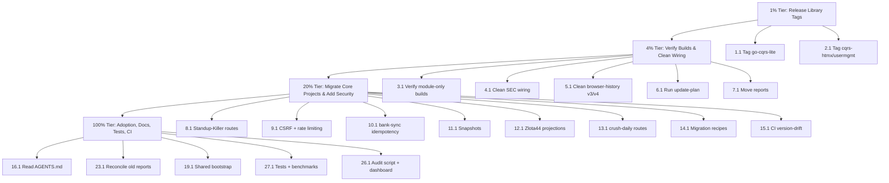

# CQRS Ecosystem Execution Plan

**Date:** 2026-07-23 13:57  
**Scope:** Move the `go-cqrs-lite` / `cqrs-htmx` ecosystem from a 58/100 adoption score to production-grade, consistent usage.  
**Owner:** LarsArtmann engineering  
**Status:** Plan — ready for execution

---

## 1. Context & Goal

A full ecosystem audit (see `docs/research/2026-07-23_go-cqrs-lite-cqrs-htmx-ecosystem-deep-dive.html` and `docs/status/2026-07-23_13-24_cqrs-ecosystem-audit-status.html`) found that:

- **Core CQRS patterns are adopted well** in `bank-sync`, `Standup-Killer`, `Zlota44`, `github-local-sync`, `browser-history`, `go-localsync`, and others.
- **`cqrs-htmx` is used mostly as middleware**; its declarative `app.Command` / `app.Query` routing is underused.
- **The biggest risk is dependency wiring**, not bad code: published `go-cqrs-lite` tags are incompatible with each other, and `cqrs-htmx/usermgmt/v4 v4.3.0` still depends on `go-cqrs-lite` v3.7.4.
- **All 22 direct consumers now compile** in their intended build mode after a verification run (see Section 7).

**Goal:** make the ecosystem buildable outside the monorepo, standardize on declarative HTTP routing, harden security boundaries, and close capability gaps.

---

## 2. Pareto Breakdown

### 2.1 The 1% that delivers 51% of the result

These two tasks unblock every other piece of work. Until they are done, consumers cannot reliably build with published dependencies.

1. **Release / tag `go-cqrs-lite`** — current `master` is 26 commits ahead of `origin` and contains symbols (`event.MultiBatchEntry`, `event.MultiSink`, `otel.AttrAggregateCount`) that `storage/v4` already references but are not in any published tag.
2. **Release / tag `cqrs-htmx/usermgmt`** — the `v4.3.0` tag still depends on `go-cqrs-lite` v3.7.4, which breaks any consumer that imports `usermgmt` together with `go-cqrs-lite` v4.

### 2.2 The 4% that delivers 64% of the result

Add the next three high-leverage tasks:

3. Verify all 22 consumers build in **module-only mode** (no workspace, no local replaces).
4. Clean up `SEC` and `browser-history` dependency wiring so they are no longer monorepo-only.
5. Run the ecosystem-wide `project-dependency-graph update-plan` and apply the 48 recommended bumps.

### 2.3 The 20% that delivers 80% of the result

Add the security and routing template work:

6. Migrate `Standup-Killer` HTTP routes to `app.Command` / `app.Query` as the canonical template.
7. Add CSRF + rate-limiting middleware to every `cqrs-htmx` web project with state-changing routes.
8. Add idempotency to financial / state-changing command paths (start with `bank-sync`).
9. Add snapshots to event-sourced projects that lack them.
10. Build a projection / read-model layer for `Zlota44`.
11. Extend `crush-daily` routes to `app.Command` / `app.Query` beyond `/api/collect`.
12. Create copy-paste migration recipes for `app.Command`, `app.Query`, CSRF, rate limiting, and idempotency.
13. Set up a CI check that fails on `project-dependency-graph version-conflicts`.

### 2.4 The remaining 80% to get to 100%

14. Add observability, signing, encryption, and projection infrastructure.
15. Reconcile old CQRS review files and produce a v2/v3 → v4 delta report.
16. Add tests, benchmarks, property tests, and load tests.
17. Remove dead / duplicate implementations and document per-project HTTP-framework decisions.
18. Build reusable bootstrap packages, test fixtures, and audit scripts.

---

## 3. Current State After Verification Run

| What | Status |
| --- | --- |
| All 22 direct consumers build in intended mode | ✅ Done |
| `InboxClean` vendor inconsistency | ✅ Fixed via `go work vendor` |
| `DiscordSync` vendor inconsistency | ✅ Fixed via `go mod vendor` |
| `SEC` `go mod tidy` warning | ✅ Resolved |
| `browser-history` v3/v4 split in `cmd/server` | ⚠️ Only builds inside workspace |
| Published `go-cqrs-lite` tag incompatibility | ⚠️ Needs release |
| `cqrs-htmx/usermgmt/v4.3.0` still on `go-cqrs-lite` v3 | ⚠️ Needs release |
| `prison/scripts/go.mod` parse error | ℹ️ Unrelated, but invalid syntax |

---

## 4. Medium-Granularity Execution Plan (30–100 min tasks)

Sorted by **Pareto tier → priority score (Impact × CustomerValue / Effort)**.

| # | Task | Tier | Impact | Effort | Customer Value | Priority | Time |
| --- | --- | --- | --- | --- | --- | --- | --- |
| 1 | Release / tag `go-cqrs-lite` current master | 1% | 5 | 3 | 5 | 8.3 | 90 min |
| 2 | Release / tag `cqrs-htmx/usermgmt` v4 migration | 1% | 5 | 3 | 5 | 8.3 | 60 min |
| 3 | Verify all 22 consumers build in module-only mode | 4% | 5 | 3 | 4 | 6.7 | 60 min |
| 4 | Clean up `SEC` replace / pseudo-version strategy | 4% | 5 | 2 | 4 | 10.0 | 45 min |
| 5 | Clean up `browser-history` v3/v4 split | 4% | 5 | 3 | 4 | 6.7 | 60 min |
| 6 | Run ecosystem `update-plan` and apply 48 dependency bumps | 4% | 5 | 3 | 3 | 5.0 | 45 min |
| 7 | Decide report long-term home and move reports | 4% | 4 | 1 | 3 | 12.0 | 30 min |
| 8 | Migrate `Standup-Killer` routes to `app.Command` / `app.Query` | 20% | 5 | 3 | 4 | 6.7 | 90 min |
| 9 | Add CSRF + rate limiting to all `cqrs-htmx` web projects | 20% | 5 | 3 | 4 | 6.7 | 90 min |
| 10 | Add idempotency to `bank-sync` financial commands | 20% | 5 | 3 | 4 | 6.7 | 60 min |
| 11 | Add snapshots to event-sourced projects without them | 20% | 4 | 2 | 4 | 8.0 | 45 min |
| 12 | Build projection / read-model layer for `Zlota44` | 20% | 4 | 3 | 4 | 5.3 | 75 min |
| 13 | Extend `crush-daily` routes to `app.Command` / `app.Query` | 20% | 4 | 3 | 3 | 4.0 | 60 min |
| 14 | Create copy-paste migration recipes | 20% | 4 | 2 | 4 | 8.0 | 60 min |
| 15 | Set up CI version-drift check | 20% | 4 | 3 | 3 | 4.0 | 60 min |
| 16 | Replace hand-rolled read models + add `projectionhost` / `listing` / `graph` | 100% | 4 | 3 | 3 | 4.0 | 90 min |
| 17 | Add scheduling + catalog docs + scenario tests | 100% | 3 | 3 | 3 | 3.0 | 75 min |
| 18 | Add OTel + event signing + at-rest encryption | 100% | 4 | 3 | 3 | 4.0 | 90 min |
| 19 | Create shared bootstrap package + test fixture + recipes | 100% | 4 | 3 | 3 | 4.0 | 90 min |
| 20 | Standardize auth + add `usermgmt` WebAuthn / OAuth2 / TOTP | 100% | 4 | 3 | 3 | 4.0 | 75 min |
| 21 | Decide `KeyHolderAI` / `overview` / `PapDashboard` HTTP strategy | 100% | 4 | 2 | 3 | 6.0 | 60 min |
| 22 | Remove dead / duplicate implementations | 100% | 4 | 2 | 3 | 6.0 | 60 min |
| 23 | Reconcile old CQRS review files + produce v2/v3 → v4 delta | 100% | 4 | 2 | 3 | 6.0 | 75 min |
| 24 | Generate D2/SVG ecosystem dependency diagram | 100% | 3 | 1 | 2 | 6.0 | 30 min |
| 25 | Read `AGENTS.md` + verify top-10 recommendations with file:line | 100% | 4 | 3 | 3 | 4.0 | 90 min |
| 26 | Set up reusable audit script + adoption-score dashboard | 100% | 3 | 3 | 2 | 2.0 | 60 min |
| 27 | Run test suites + property tests + benchmarks + load tests | 100% | 4 | 3 | 3 | 4.0 | 90 min |

**Total estimated time:** ~1,750 min ≈ **29 hours** of focused engineering work.

---

## 5. Fine-Granularity Execution Plan (≤15 min subtasks)

Each medium task is broken into 15-minute or smaller steps. Subtasks are ordered by dependency and can be parallelized where noted.

### Task 1: Release / tag `go-cqrs-lite` current master (90 min)

1.1. Review diff between last tag and `master` for breaking changes. *(15 min)*  
1.2. Decide tag versions per submodule (most likely patch or minor bump). *(15 min)*  
1.3. Update `CHANGELOG.md` with release notes. *(15 min)*  
1.4. Tag each submodule with its new version. *(15 min)*  
1.5. Push tags and verify `go list -m` resolves them. *(15 min)*  
1.6. Run `go build ./...` on the library with `GOWORK=off`. *(15 min)*

### Task 2: Release / tag `cqrs-htmx/usermgmt` v4 migration (60 min)

2.1. Verify `cqrs-htmx/usermgmt` currently depends on `go-cqrs-lite` v4. *(15 min)*  
2.2. Decide next submodule tag version. *(15 min)*  
2.3. Tag `cqrs-htmx/usermgmt` and push. *(15 min)*  
2.4. Verify a fresh consumer module can import `usermgmt/v4` + `go-cqrs-lite/event/v4` without type mismatch. *(15 min)*

### Task 3: Verify all 22 consumers build in module-only mode (60 min)

3.1. Run `GOWORK=off GOEXPERIMENT=jsonv2 go build ./...` on each of the 22 consumers. *(30 min)*  
3.2. Record pass/fail/why in a verification table. *(15 min)*  
3.3. Open follow-up tasks for any new failures. *(15 min)*

### Task 4: Clean up `SEC` replace / pseudo-version strategy (45 min)

4.1. Read `SEC/go.mod` and `SEC/go.work` to understand current replace matrix. *(15 min)*  
4.2. Decide whether `SEC` should be workspace-only or portable. *(15 min)*  
4.3. If portable, remove pseudo-version requires and replace directives; if monorepo-only, document the decision in `SEC/AGENTS.md`. *(15 min)*

### Task 5: Clean up `browser-history` v3/v4 split (60 min)

5.1. Identify every `go-cqrs-lite` v3 import in `browser-history`. *(15 min)*  
5.2. Update all v3 imports to v4 in each submodule. *(15 min)*  
5.3. Run `go mod tidy` in each submodule. *(15 min)*  
5.4. Verify `cmd/server` builds with `GOWORK=off`. *(15 min)*

### Task 6: Run ecosystem `update-plan` and apply 48 dependency bumps (45 min)

6.1. Run `project-dependency-graph update-plan go-cqrs-lite cqrs-htmx --dir ~/projects`. *(15 min)*  
6.2. Review generated plan for risky upgrades. *(15 min)*  
6.3. Apply safe bumps and run builds. *(15 min)*

### Task 7: Decide report long-term home and move reports (30 min)

7.1. Choose canonical repository (`go-cqrs-lite`, `cqrs-htmx`, or dedicated docs repo). *(15 min)*  
7.2. Move `docs/research/...` and `docs/status/...` HTML reports and update any internal links. *(15 min)*

### Task 8: Migrate `Standup-Killer` routes to `app.Command` / `app.Query` (90 min)

8.1. Read `Standup-Killer/api/server.go` and existing handlers. *(15 min)*  
8.2. Replace one command route with `app.Command`. *(15 min)*  
8.3. Replace one query route with `app.Query`. *(15 min)*  
8.4. Add middleware chain (recovery, security headers, CSRF, rate limiter). *(15 min)*  
8.5. Migrate remaining routes. *(15 min)*  
8.6. Run tests and update documentation. *(15 min)*

### Task 9: Add CSRF + rate limiting to all `cqrs-htmx` web projects (90 min)

9.1. Identify which projects have state-changing routes. *(15 min)*  
9.2. Add `cqrs-htmx` CSRF middleware to each. *(30 min)*  
9.3. Add `cqrs-htmx` rate-limiter middleware to each. *(30 min)*  
9.4. Verify with builds and happy-path tests. *(15 min)*

### Task 10: Add idempotency to `bank-sync` financial commands (60 min)

10.1. Read `bank-sync/internal/cqrs/infrastructure.go` and command wiring. *(15 min)*  
10.2. Add `go-cqrs-lite/idempotency/v4` to command pipeline. *(15 min)*  
10.3. Wire `idempotency/kvstore` backend. *(15 min)*  
10.4. Add test for duplicate command rejection. *(15 min)*

### Task 11: Add snapshots to event-sourced projects without them (45 min)

11.1. Identify which event-sourced consumers lack snapshots. *(15 min)*  
11.2. Add `go-cqrs-lite/snapshot/v4` to one representative project. *(15 min)*  
11.3. Apply the same pattern to remaining projects. *(15 min)*

### Task 12: Build projection / read-model layer for `Zlota44` (75 min)

12.1. Read `Zlota44` domain and current read paths. *(15 min)*  
12.2. Add `go-cqrs-lite/projection/v4` + `projectionhost/v4` infrastructure. *(15 min)*  
12.3. Implement one projection handler. *(15 min)*  
12.4. Wire projector into server startup. *(15 min)*  
12.5. Add test. *(15 min)*

### Task 13: Extend `crush-daily` routes to `app.Command` / `app.Query` (60 min)

13.1. Read `crush-daily/internal/server/server.go`. *(15 min)*  
13.2. Migrate `/api/collect` and additional routes to declarative handlers. *(30 min)*  
13.3. Run tests. *(15 min)*

### Task 14: Create copy-paste migration recipes (60 min)

14.1. Write recipe for `app.Command` handler. *(15 min)*  
14.2. Write recipe for `app.Query` handler. *(15 min)*  
14.3. Write recipe for CSRF + rate-limit middleware chain. *(15 min)*  
14.4. Write recipe for idempotency wiring. *(15 min)*

### Task 15: Set up CI version-drift check (60 min)

15.1. Add `project-dependency-graph version-conflicts` step to one repo's CI. *(15 min)*  
15.2. Add `who-uses` + `health` check. *(15 min)*  
15.3. Replicate to other active repos. *(15 min)*  
15.4. Verify CI fails on drift. *(15 min)*

### Task 16: Replace hand-rolled read models + add `projectionhost` / `listing` / `graph` (90 min)

16.1. Audit hand-rolled read models in `bank-sync`, `crush-daily`, `github-local-sync`. *(15 min)*  
16.2. Replace one with `projectionhost` + checkpoints. *(30 min)*  
16.3. Add `listing` module for aggregate status lists. *(15 min)*  
16.4. Add `graph` module where traversal-heavy. *(15 min)*  
16.5. Document trade-offs. *(15 min)*

### Task 17: Add scheduling + catalog docs + scenario tests (75 min)

17.1. Add `go-cqrs-lite/scheduling/v4` to one project with delayed commands. *(30 min)*  
17.2. Generate event catalog docs with `go-cqrs-lite/catalog/v4`. *(15 min)*  
17.3. Add scenario tests with `go-cqrs-lite/scenario/v4`. *(15 min)*  
17.4. Verify. *(15 min)*

### Task 18: Add OTel + event signing + at-rest encryption (90 min)

18.1. Add `go-cqrs-lite/otel/v4` to `crush-daily` or `github-local-sync`. *(30 min)*  
18.2. Add `go-cqrs-lite/signing/v4` to `bank-sync` for tamper-proof events. *(30 min)*  
18.3. Add `go-cqrs-lite/encryption/v4` to a PII project. *(15 min)*  
18.4. Verify metrics / traces. *(15 min)*

### Task 19: Create shared bootstrap package + test fixture + recipes (90 min)

19.1. Design a reusable `cqrs-bootstrap` package interface. *(15 min)*  
19.2. Implement memory-stack bootstrap. *(15 min)*  
19.3. Implement sqlite-stack bootstrap. *(15 min)*  
19.4. Create shared test fixture for consumer projects. *(15 min)*  
19.5. Migrate one project to use the bootstrap package. *(15 min)*  
19.6. Document. *(15 min)*

### Task 20: Standardize auth + add `usermgmt` WebAuthn / OAuth2 / TOTP (75 min)

20.1. Document current auth approach per project. *(15 min)*  
20.2. Add `cqrs-htmx/usermgmt/totp/v4` where TOTP is needed. *(15 min)*  
20.3. Add `cqrs-htmx/usermgmt/webauthn/v4` where passkeys are needed. *(15 min)*  
20.4. Add `cqrs-htmx/usermgmt/oauth2/v4` where OAuth2 is needed. *(15 min)*  
20.5. Verify integration. *(15 min)*

### Task 21: Decide `KeyHolderAI` / `overview` / `PapDashboard` HTTP strategy (60 min)

21.1. Read current routing in each project. *(15 min)*  
21.2. Decide per project: migrate to `cqrs-htmx` routing, keep current framework (Gin / Huma), or drop `cqrs-htmx`. *(15 min)*  
21.3. Document decisions in each `AGENTS.md`. *(15 min)*  
21.4. Execute the smallest migration for one project if decided. *(15 min)*

### Task 22: Remove dead / duplicate implementations (60 min)

22.1. Run dependency graph and grep to find duplicate helper code. *(15 min)*  
22.2. Identify dead imports of `cqrs-htmx` or `go-cqrs-lite`. *(15 min)*  
22.3. Remove or consolidate duplicates in 2–3 projects. *(15 min)*  
22.4. Verify builds. *(15 min)*

### Task 23: Reconcile old CQRS review files + produce v2/v3 → v4 delta (75 min)

23.1. Read `CQRS_SDK_PROJECT_REVIEW.md`, `CQRS_SDK_PROJECT_REVIEW_FINAL.md`, `CQRS_SDK_PROJECT_REVIEW_V2.md`, `CROSS_PROJECT_CONSOLIDATION_PLAN.md`, and v3→v4 update report. *(15 min)*  
23.2. List what changed, what is still true, and what is resolved. *(15 min)*  
23.3. Write a delta report. *(15 min)*  
23.4. Update old files with non-destructive annotations. *(15 min)*  
23.5. Link new HTML reports to old files. *(15 min)*

### Task 24: Generate D2/SVG ecosystem dependency diagram (30 min)

24.1. Design the D2 graph of library → consumer relationships. *(15 min)*  
24.2. Generate SVG and add to research report. *(15 min)*

### Task 25: Read `AGENTS.md` + verify top-10 recommendations with file:line (90 min)

25.1. Read `AGENTS.md` for all 22 consumers. *(30 min)*  
25.2. Verify the top-10 audit recommendations with exact file:line citations. *(45 min)*  
25.3. Update audit report with corrected / sharpened recommendations. *(15 min)*

### Task 26: Set up reusable audit script + adoption-score dashboard (60 min)

26.1. Write a script that runs `who-uses`, `health`, `version-conflicts`, and `update-plan`. *(15 min)*  
26.2. Add adoption-score computation. *(15 min)*  
26.3. Generate a simple HTML dashboard. *(15 min)*  
26.4. Wire into CI or cron. *(15 min)*

### Task 27: Run test suites + property tests + benchmarks + load tests (90 min)

27.1. Run `go test ./...` on the 5 most critical projects. *(30 min)*  
27.2. Add property-based tests for one decider. *(15 min)*  
27.3. Benchmark hot paths in `bank-sync` and `crush-daily`. *(15 min)*  
27.4. Add load tests for `cqrs-htmx` endpoints. *(15 min)*  
27.5. Document results and open issues for regressions. *(15 min)*

---

## 6. Execution Graph (Mermaid)

---

## 7. Risks & Blockers

| Risk | Probability | Impact | Mitigation |
| --- | --- | --- | --- |
| New `go-cqrs-lite` tags break existing consumers | Medium | High | Tag as minor / patch carefully; run module-only build matrix before announcing. |
| `cqrs-htmx/usermgmt` v4 tag is not cut correctly | Medium | High | Verify with a fresh module outside the monorepo before finalizing. |
| `browser-history` v3/v4 migration touches many files | Medium | Medium | Do it in one focused session; use `go mod graph` to find v3 paths. |
| Some "production" projects are actually experiments | Medium | Low | Answer Q3 before committing large migrations. |
| `go-cqrs-lite` uncommitted signing changes are not ready to release | Medium | High | Review and commit or revert those changes before tagging. |

---

## 8. Success Criteria

1. Every direct consumer builds with `GOWORK=off` and published dependencies.
2. `project-dependency-graph health` returns 100/100 with zero version conflicts.
3. At least one representative web project uses `app.Command` / `app.Query` as a documented template.
4. All state-changing web routes have CSRF and rate limiting.
5. `bank-sync` commands are idempotent.
6. The ecosystem adoption score moves from 58/100 to ≥80/100.
7. Reports live in a durable, version-controlled location and old review files are reconciled.

---

## 9. Open Questions (Answer Before Execution)

1. **Where should the audit reports live long-term?** (`go-cqrs-lite`, `cqrs-htmx`, or a dedicated docs repo?)
2. **What is the relationship to the five existing CQRS review files?** (supersede, annotate, or coexist?)
3. **Which projects are production vs. experiments?** (so we prioritize migrations correctly.)

---

## 10. Immediate Next Step

Start with **Task 1** (release `go-cqrs-lite`) and **Task 2** (release `cqrs-htmx/usermgmt`) in parallel. Until those tags exist, all downstream consumer work is built on shifting sand.
