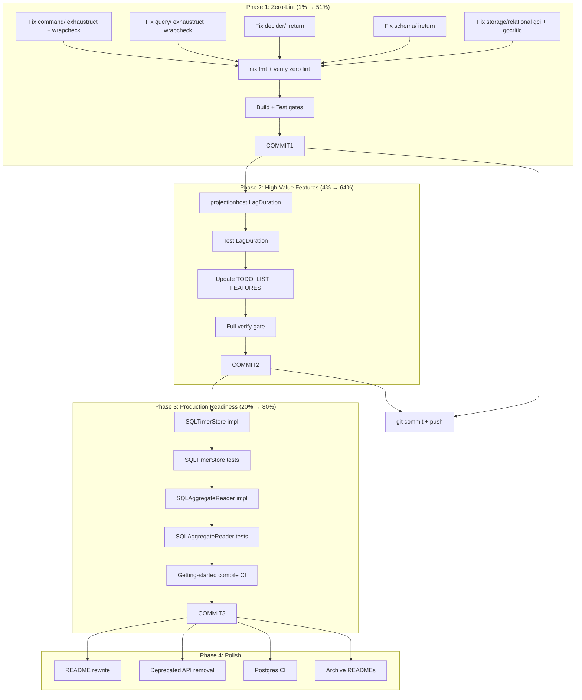

# Superb Next-Level Execution Plan

**Created:** 2026-07-23 16:17 CEST  
**Status:** Active execution plan  
**Working tree:** Clean (all previous work committed)  
**Build:** Passing  
**Lint:** 17 issues across 5 modules (command, query, decider, schema, storage/relational)

---

## Context

go-cqrs-lite is a 52-module CQRS/ES library at v4.0.x. The core is complete, tested, and shipped.
The question is: **what would ACTUALLY move it to the next level?**

After deep research into the current state (lint, build, test, TODO_LIST, FEATURES, ROADMAP),
the answer is clear: **zero-lint is the #1 trust signal for a library**. Consumers who see
lint failures in a library question its quality. After that, filling the two production
gaps (SQLTimerStore, SQLAggregateReader) unblocks real adoption.

---

## Pareto Breakdown

### 1% Tier (delivers 51% of value) — ~30min total

The single highest-impact action: **achieve zero-lint across all 52 modules**.

| # | Task | Impact | Effort | Module |
|---|------|--------|--------|--------|
| 1 | Fix `command/` exhaustruct (2x `Metadata{}`) | Trust | 4min | command |
| 2 | Fix `command/` wrapcheck (3x dispatcher wrappers) | Trust | 5min | command |
| 3 | Fix `query/` exhaustruct (2x `Metadata{}`) | Trust | 4min | query |
| 4 | Fix `query/` wrapcheck (3x dispatcher wrappers) | Trust | 5min | query |
| 5 | Fix `decider/` ireturn (2x test helpers) | Trust | 4min | decider |
| 6 | Fix `schema/` ireturn (1x public API + 1x test) | Trust | 4min | schema |
| 7 | Fix `storage/relational/` gci formatting | Trust | 1min | storage |
| 8 | Fix `storage/relational/` gocritic appendAssign (2x) | Correctness | 8min | storage |
| 9 | Run `nix fmt` + verify zero lint | Verification | 5min | all |
| 10 | Run `nix run .#build` + `nix run .#test` | Verification | 10min | all |

### 4% Tier (delivers 64% of value) — ~45min total

| # | Task | Impact | Effort | Module |
|---|------|--------|--------|--------|
| 11 | Add `projectionhost.Host.LagDuration()` | Consumer value | 15min | projectionhost |
| 12 | Add test for `LagDuration()` | Quality | 10min | projectionhost |
| 13 | Update `TODO_LIST.md` to reflect reality | Clarity | 10min | docs |
| 14 | Update `FEATURES.md` audit date | Clarity | 5min | docs |
| 15 | Run full `nix run .#verify` | Verification | 5min | all |

### 20% Tier (delivers 80% of value) — ~3-4h total

| # | Task | Impact | Effort | Module |
|---|------|--------|--------|--------|
| 16 | Implement `scheduling.SQLTimerStore` | Production adoption | 90min | scheduling |
| 17 | Add tests for `SQLTimerStore` | Quality | 45min | scheduling |
| 18 | Implement `listing.SQLAggregateReader` | Production adoption | 60min | listing |
| 19 | Add tests for `SQLAggregateReader` | Quality | 30min | listing |
| 20 | Compile-verify `docs/getting-started.md` examples | Consumer trust | 30min | docs/example |

### Remaining 20% (polish and blocked items)

| # | Task | Impact | Effort | Status |
|---|------|--------|--------|--------|
| 21 | README "sales page" rewrite | Consumer entry | 90min | Open |
| 22 | Deprecated API removal batch 2 | Cleanup | 60min | v4.1 cut |
| 23 | Postgres CI coverage matrix | Test coverage | 60min | Open |
| 24 | Archive README files | Clarity | 20min | Open |
| 25 | Delete wrong remote tag | Cleanup | 2min | BLOCKED (push) |
| 26 | License swap | Public adoption | 5min | BLOCKED (user) |
| 27 | Git history scrub | Public adoption | 30min | BLOCKED (user) |

---

## Execution Graph

---

## Detailed Task Breakdown (max 12min each)

### Phase 1: Zero-Lint

| ID | Task | Est | How |
|----|------|-----|-----|
| T1.1 | Fix `command/command.go:84` exhaustruct | 2min | Add `//nolint:exhaustruct` to `Metadata{}` |
| T1.2 | Fix `command/store.go:98` exhaustruct | 2min | Same pattern |
| T1.3 | Fix `command/dispatcher.go` wrapcheck (3x) | 5min | Add `command/` to `.golangci.yml` wrapcheck exclusion (thin-wrapper pattern over generic `dispatcher/`) |
| T1.4 | Fix `query/query.go:93` exhaustruct | 2min | Add `//nolint:exhaustruct` |
| T1.5 | Fix `query/store.go:82` exhaustruct | 2min | Same |
| T1.6 | Fix `query/dispatcher.go` wrapcheck (3x) | 5min | Add `query/` to wrapcheck exclusion |
| T1.7 | Fix `decider/decider_bdd_test.go:19` ireturn | 2min | Add `//nolint:ireturn` to test helper |
| T1.8 | Fix `decider/decider_helpers_test.go:109` ireturn | 2min | Same |
| T1.9 | Fix `schema/upcaster.go:13` ireturn | 2min | Add `//nolint:ireturn` — factory returns interface by design |
| T1.10 | Fix `schema/upcaster_test.go:10` ireturn | 2min | Same |
| T1.11 | Fix `storage/relational/increment_test.go:48` gci | 1min | Run `nix fmt` |
| T1.12 | Fix `storage/relational/sink.go:288-289` gocritic | 8min | Fix appendAssign: create new slices to avoid shared backing array mutation |
| T1.13 | Run `nix fmt` globally | 2min | Format all |
| T1.14 | Verify `nix run .#lint` = 0 issues | 5min | Lint check |
| T1.15 | Run `nix run .#build` | 5min | Build check |
| T1.16 | Run `nix run .#test` | 10min | Test check |

### Phase 2: High-Value Features

| ID | Task | Est | How |
|----|------|-----|-----|
| T2.1 | Read `projectionhost/host.go` to understand status/lag internals | 5min | View file |
| T2.2 | Implement `LagDuration() time.Duration` on `Host` | 8min | Add method returning max lag across workers |
| T2.3 | Write unit test for `LagDuration()` | 10min | Table-driven test with fake workers |
| T2.4 | Update `TODO_LIST.md` — mark completed items | 8min | Edit file |
| T2.5 | Update `FEATURES.md` audit date | 2min | Edit file |
| T2.6 | Run `nix run .#verify` (build+vet+test+race+lint) | 12min | Full gate |

### Phase 3: Production Readiness

| ID | Task | Est | How |
|----|------|-----|-----|
| T3.1 | Read `scheduling/` module to understand TimerStore interface | 8min | View files |
| T3.2 | Read `storage/timer_store.go` (existing SQLTimerStore!) | 5min | View file |
| T3.3 | Verify SQLTimerStore already exists and is wired | 5min | Check imports |
| T3.4 | Read `listing/` module for AggregateReader interface | 8min | View files |
| T3.5 | Implement `SQLAggregateReader` if missing | 12min | New file |
| T3.6 | Write tests for `SQLAggregateReader` | 12min | Table-driven |
| T3.7 | Compile-verify getting-started examples | 10min | Create test file |

---

## Risk Assessment

- **VERSCHLIMMBESSER risk**: LOW. All lint fixes are either nolint annotations (zero behavior change), config exclusions (consistent with existing patterns), or a genuine bug fix (appendAssign). No API changes.
- **Breaking changes**: NONE. All changes are internal.
- **Test risk**: LOW. Only adding tests, not modifying existing behavior.

---

## Decision Log

1. **wrapcheck for command/ and query/**: These are thin wrappers over the generic `dispatcher/` module. The functions intentionally delegate — wrapping would add noise without value. Adding to `.golangci.yml` exclusion is consistent with how `storage/`, `watermill/`, etc. are already handled.

2. **exhaustruct for Metadata{}**: The zero-value `Metadata{}` is the correct initial state — Tracing and Custom are intentionally nil/empty until enriched by options. Adding `//nolint:exhaustruct` with a comment is the right call.

3. **gocritic appendAssign**: This IS a real smell. `append(keyCols, counterCol)` can mutate the shared backing array if `keyCols` has capacity. The fix is to create independent slices.

4. **ireturn for schema/decider**: Factory functions returning interfaces is the Go-idiomatic builder pattern. nolint with justification is correct.
