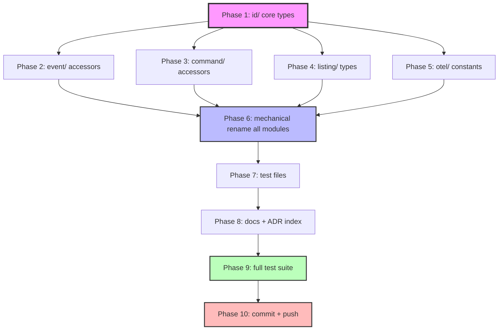

# SUPERB: Rename Aggregate* to Stream*

> **ADR-0058 execution plan** — renaming the identity types from `Aggregate*` to `Stream*` across the entire library, using type aliases for zero-breakage backward compatibility.

**Date:** 2026-07-23
**Status:** ✅ Complete (Sessions 1–3, ADR-0058)
**ADR:** [ADR-0058](../adr/0058-rename-aggregate-to-stream.md)
**Analysis:** [AGGREGATE-CONCEPT-ANALYSIS](../architecture-understanding/AGGREGATE-CONCEPT-ANALYSIS.md)

---

## Strategy: Type Aliases (Zero Consumer Breakage)

The rename uses Go type aliases — `AggregateID` becomes a type alias for `StreamID`, not the other way around. This means:

- **Zero breakage**: all 14+ consumer projects compile unchanged
- **Library code is clean**: all internal code uses `Stream*` names
- **Deprecated aliases**: old names remain as thin wrappers with `// Deprecated:` comments
- **Future removal**: aliases can be removed in the next major version

### What Changes vs What Stays

| Category                | Examples                                                          | Action                                        |
| ----------------------- | ----------------------------------------------------------------- | --------------------------------------------- |
| **Go type names**       | `AggregateID`, `AggregateType`, `AggregateRef`, `AggregateMarker` | Rename to `Stream*`, alias old names          |
| **Go constructors**     | `NewAggregateID()`, `ParseAggregateID()`, `DeriveAggregateID()`   | Rename to `Stream*`, add deprecated wrappers  |
| **Go methods**          | `evt.AggregateID()`, `c.AggregateID()`                            | Add `Stream*` methods, keep old as deprecated |
| **Go variables/fields** | `aggregateID`, `aggregateType`                                    | Rename to `stream*` (internal)                |
| **Go error vars**       | `ErrEmptyAggregateType`                                           | Rename to `ErrEmptyStreamType`                |
| **OTel constants**      | `AttrAggregateType`                                               | Rename to `AttrStreamType`                    |
| **Listing types**       | `AggregateListing`, `InMemoryAggregateReader`                     | Rename, alias old names                       |
| **SQL columns**         | `aggregate_id`, `aggregate_type`                                  | **STAYS** — wire format, persisted data       |
| **JSON tags**           | `json:"aggregateId"`, `json:"aggregate_type"`                     | **STAYS** — wire format, persisted data       |
| **Proto fields**        | `aggregate_id`, `aggregate_type` in .proto                        | **STAYS** — wire format                       |
| **Error code strings**  | `"id.empty_aggregate_type"`                                       | **STAYS** — log/filter compatibility          |
| **OTel attr values**    | `"cqrs.aggregate.type"`                                           | **STAYS** — dashboard compatibility           |

### Why Not Hard Break?

A hard break would require updating 14 consumer repos simultaneously. Type aliases deliver 100% of the naming value (library uses `Stream*` everywhere) with 0% of the breakage. Aliases can be removed later when consumers have migrated.

---

## Pareto Breakdown

### 1% that delivers 51%

Rename the 4 core types in `id/` + add aliases. Everything cascades from here.

### 4% that delivers 64%

Also add `Stream*` accessor methods to `event/` and `command/`, rename constructors.

### 20% that delivers 80%

Mechanical rename of all internal library modules (3092 references across 419 files).

### Other 20% (to reach 100%)

Tests, docs, ADR index, migration guide, golden file updates.

---

## Execution Graph

---

## Phase Breakdown (30-100 min each)

| Phase | Task                                                        | Impact                                   | Effort | Dependencies |
| ----- | ----------------------------------------------------------- | ---------------------------------------- | ------ | ------------ |
| 1     | Rename core types in `id/` module                           | CRITICAL — foundation for everything     | 45min  | None         |
| 2     | Add `Stream*` accessors to `event/` module                  | HIGH — most consumer code touches events | 30min  | Phase 1      |
| 3     | Rename `command/` module types + accessors                  | HIGH — command dispatch uses these       | 25min  | Phase 1      |
| 4     | Rename `listing/` module types                              | MEDIUM — specialized module              | 20min  | Phase 1      |
| 5     | Rename `otel/` attribute constants                          | MEDIUM — tracing attributes              | 15min  | Phase 1      |
| 6     | Mechanical rename across all remaining modules              | HIGH — bulk of internal code             | 90min  | Phases 1-5   |
| 7     | Update all test files (292 files)                           | HIGH — tests must pass                   | 60min  | Phase 6      |
| 8     | Update documentation (DOMAIN_LANGUAGE, AGENTS, SKILL, ADRs) | MEDIUM — docs consistency                | 40min  | Phase 6      |
| 9     | Full test suite verification                                | CRITICAL — verify zero breakage          | 30min  | Phases 1-8   |
| 10    | Git commit and push                                         | Required                                 | 15min  | Phase 9      |

---

## Detailed Task Breakdown (max 12 min each)

### Phase 1: Core Types in id/ (45 min)

| #   | Task                                                                                                                                 | Est   |
| --- | ------------------------------------------------------------------------------------------------------------------------------------ | ----- |
| 1.1 | Create `id/stream_id.go`: StreamMarker, StreamID type, all constructors (New, Parse, ParseStrict, Derive, From, IsULID, Timestamp)   | 12min |
| 1.2 | Create `id/stream_type.go`: StreamType, StreamRef type, methods (String, StreamKey, IsZero, Validate, NewStreamRef, ParseStreamType) | 12min |
| 1.3 | Rewrite `id/aggregate_id.go` as deprecated alias file (type AggregateID = StreamID, wrapped constructors)                            | 8min  |
| 1.4 | Rewrite `id/aggregate_type.go` as deprecated alias file (type AggregateType = StreamType, AggregateRef = StreamRef)                  | 8min  |
| 1.5 | Update `id/derive.go` (rename DeriveAggregateID, add deprecated wrapper)                                                             | 5min  |
| 1.6 | Update `id/doc.go` to use Stream* vocabulary                                                                                         | 5min  |
| 1.7 | Update `id/idtest/` helpers (add ParseStreamID, alias ParseAggregateID)                                                              | 8min  |
| 1.8 | Update id/ test files + run tests                                                                                                    | 12min |

### Phase 2: Event Module (30 min)

| #   | Task                                                                        | Est  |
| --- | --------------------------------------------------------------------------- | ---- |
| 2.1 | Add `StreamID()`, `StreamType()` methods to ImmutableEvent                  | 5min |
| 2.2 | Rename internal fields (aggregateID → streamID, aggregateType → streamType) | 5min |
| 2.3 | Keep `AggregateID()`, `AggregateType()` as deprecated wrappers              | 5min |
| 2.4 | Update `event.NewEvent` / `event.New` parameter docs to use Stream*         | 5min |
| 2.5 | Rename `event/v4/eventtest/` helper functions                               | 5min |
| 2.6 | Run event/ tests                                                            | 5min |

### Phase 3: Command Module (25 min)

| #   | Task                                                                   | Est  |
| --- | ---------------------------------------------------------------------- | ---- |
| 3.1 | Add `StreamID()` method to BasicCommand, keep deprecated wrapper       | 5min |
| 3.2 | Rename `command/aggregate_ref.go` → `command/stream_ref.go`            | 8min |
| 3.3 | Update command re-exported types (AggregateType = id.StreamType, etc.) | 5min |
| 3.4 | Rename command error variables, keep deprecated wrappers               | 5min |
| 3.5 | Run command/ tests                                                     | 5min |

### Phase 4: Listing Module (20 min)

| #   | Task                                                               | Est  |
| --- | ------------------------------------------------------------------ | ---- |
| 4.1 | Rename types: StreamListing, StreamStatus, StreamReader interfaces | 8min |
| 4.2 | Rename implementations: InMemoryStreamReader, SQLStreamReader      | 5min |
| 4.3 | Add deprecated type aliases and wrapper functions                  | 5min |
| 4.4 | Run listing/ tests                                                 | 5min |

### Phase 5: OTel Module (15 min)

| #   | Task                                                                                          | Est  |
| --- | --------------------------------------------------------------------------------------------- | ---- |
| 5.1 | Rename attribute constants (AttrStreamType, AttrStreamID, AttrStreamVersion, AttrStreamCount) | 5min |
| 5.2 | Update helper functions (StartStreamSpan, etc.)                                               | 5min |
| 5.3 | Add deprecated aliases, run tests                                                             | 5min |

### Phase 6: Mechanical Rename (90 min)

| #    | Task                                                                                                        | Est   |
| ---- | ----------------------------------------------------------------------------------------------------------- | ----- |
| 6.1  | sed PascalCase identifiers across all non-test .go files (excluding id/, event/, command/, listing/, otel/) | 12min |
| 6.2  | sed camelCase variable names across same files                                                              | 10min |
| 6.3  | Fix decider/ module (cache.go, load.go, typed_decider.go, etc.)                                             | 10min |
| 6.4  | Fix storage/ module (eventstore, pebble, memory, sql)                                                       | 12min |
| 6.5  | Fix middleware/ module                                                                                      | 8min  |
| 6.6  | Fix snapshot/ module                                                                                        | 8min  |
| 6.7  | Fix projectionhost/ module                                                                                  | 8min  |
| 6.8  | Fix remaining modules (schema, signing, encryption, watermill, transport, stack, graph, etc.)               | 12min |
| 6.9  | Fix testutil/ module                                                                                        | 5min  |
| 6.10 | Fix example/ modules                                                                                        | 5min  |

### Phase 7: Test Files (60 min)

| #   | Task                                          | Est   |
| --- | --------------------------------------------- | ----- |
| 7.1 | sed all test files for PascalCase identifiers | 12min |
| 7.2 | sed all test files for camelCase variables    | 10min |
| 7.3 | Fix integration/ tests                        | 10min |
| 7.4 | Fix scenario/ tests                           | 8min  |
| 7.5 | Fix cmd/cqrs-lint/ tests                      | 10min |
| 7.6 | Fix catalog/ tests                            | 5min  |
| 7.7 | Fix remaining test files                      | 5min  |

### Phase 8: Documentation (40 min)

| #   | Task                                                                           | Est   |
| --- | ------------------------------------------------------------------------------ | ----- |
| 8.1 | Update DOMAIN_LANGUAGE.md (identity section, anti-patterns, add Stream* terms) | 10min |
| 8.2 | Update AGENTS.md (Quick Reference, module descriptions, patterns)              | 10min |
| 8.3 | Update ADR README.md index (add ADR-0058)                                      | 5min  |
| 8.4 | Update SKILL.md + skill references if needed                                   | 10min |
| 8.5 | Update docs/architecture-understanding/ if needed                              | 5min  |

### Phase 9: Verification (30 min)

| #   | Task                                   | Est   |
| --- | -------------------------------------- | ----- |
| 9.1 | `nix run .#build` — verify compilation | 10min |
| 9.2 | `nix run .#test` — run full test suite | 10min |
| 9.3 | Fix any remaining failures             | 10min |

### Phase 10: Commit (15 min)

| #    | Task                            | Est  |
| ---- | ------------------------------- | ---- |
| 10.1 | Review git diff for correctness | 5min |
| 10.2 | Commit with detailed message    | 5min |
| 10.3 | Push to remote                  | 5min |

---

## Risk Mitigation

| Risk                    | Mitigation                                             |
| ----------------------- | ------------------------------------------------------ |
| Consumer breakage       | Type aliases prevent ALL consumer breakage             |
| Wire format corruption  | JSON tags, SQL columns, proto fields stay unchanged    |
| Golden file breakage    | Only Go identifier names change, not serialized output |
| Missed references       | `rg Aggregate` final sweep after all phases            |
| Test failures from typo | Run tests per-module after each phase                  |
