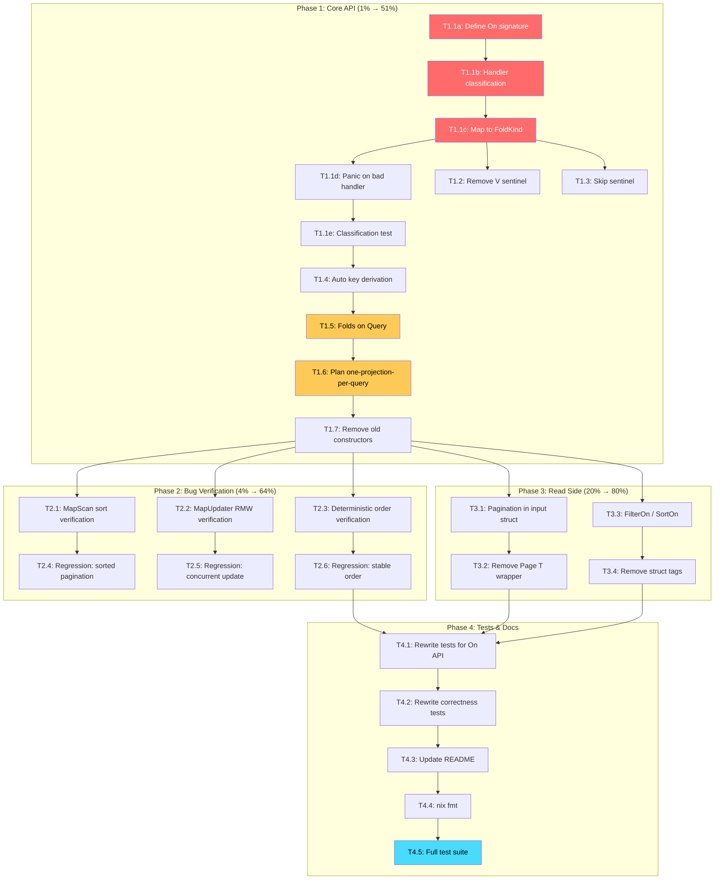

# Metaengine: Plan Alignment — From Divergent Prototype to Design Doc Vision

> **Goal:** Align the metaengine API with the Event-Query Model design doc
> (`docs/planning/event-query-model.md`) while fixing 3 critical correctness bugs.
> Pareto-driven: nail the 1% that delivers 51% first.

**Created:** 2026-07-23
**Status:** Active Execution Plan

---

## Context

The metaengine prototype diverges from `docs/planning/event-query-model.md` in 8 significant ways.
The design doc is THE specification — the prototype must conform to it, not vice versa.

### Current State (committed at `281ca0f2`)

- 3 critical bugs ALREADY FIXED in committed code: MapScan full-scan-sort, MapUpdater atomic RMW, deterministic tiebreaker
- 10 tests pass with `-race`, 76% coverage
- Zero external dependencies (stdlib only)
- **But:** the developer-facing API diverges fundamentally from the plan

### The 8 Divergences

| #   | Divergence                 | Plan Says                                       | Code Does                                    | Impact                                      |
| --- | -------------------------- | ----------------------------------------------- | -------------------------------------------- | ------------------------------------------- |
| 1   | Fold declaration           | Single `On(sample, fn)` — return type = ADT     | Split: `OnInsert`/`OnUpdate`/`OnRemove`/etc. | **Critical** — this IS the core abstraction |
| 2   | Remove/Skip sentinels      | `Remove[V]()` + `Skip` type                     | Deleted as "dead code"                       | **Critical** — part of `On` API             |
| 3   | Per-query projections      | Each query owns its folds, own projection       | ReadModel dedup (shared projections)         | **Critical** — opposite architecture        |
| 4   | Filter/sort declaration    | `FilterOn(fn)` / `SortOn(fn)` typed accessors   | Struct tags `metaengine:"sort"`              | Medium — works but less idiomatic           |
| 5   | Pagination location        | In domain input struct: `Limit`, `After`        | Via `ExecOption`: `WithLimit`, `After`       | Medium — works but not domain-native        |
| 6   | Metadata in folds          | `func(e, md Metadata) (K,V)` — optional 2nd arg | Not supported                                | High for audit/observability vision         |
| 7   | Domain result types        | `CheckEmailResult{Taken bool}`                  | Raw `bool`, `map[string]int64`, `[]any`      | Low — cosmetic                              |
| 8   | Key extraction for updates | Implicit (type-matched from insert fold)        | Explicit `keyFn` parameter                   | Medium — more boilerplate                   |

---

## Pareto Analysis

### 1% that delivers 51%

**Unified `On` API + folds on Query + Remove/Skip sentinels.**

This is THE developer-facing abstraction. Without it, nothing else matters.
The plan's central principle: "The fold return type IS the ADT." A single `On` function
classifies the handler by its Go signature:

```
func(e) (K, V)     → Map insert
func(e, prev) V    → Map update
func(e) K          → Set add
func(e) Delta      → Counter
func(e) Edge       → Graph edge
Remove[V]()        → Delete sentinel
func(e) Skip       → No-op
```

### 4% that delivers 64%

All of the above PLUS:

- **Automatic key derivation** for update/remove folds (type-matched from insert fold's key type)
- **Bug fix verification** (already committed — just need to confirm with new API)

### 20% that delivers 80%

All of the above PLUS:

- **FilterOn/SortOn** typed accessors (plan section 6, Decision 1 → Option B)
- **Pagination in domain structs** (plan section 6: `Limit int`, `After *Cursor` in input)

### Remaining 20% (deferred to future sessions)

- Metadata parameter in folds (plan section 8) — requires `Apply(ctx, eventType, payload, metadata)` signature change
- Domain result types in tests (cosmetic improvement)
- Streaming support (plan section 15, Decision 2)
- Cursor serialization (`String()` / `ParseCursor`)
- Hot-reload / re-plannable planner (plan section 14)

---

## Phase Breakdown

### Phase 1: Core API Realignment (THE 1% → 51%)

This phase transforms the developer experience. After this, the API matches the plan's vision.

| Task | Description                                                                                              | Impact   | Effort | Dependencies |
| ---- | -------------------------------------------------------------------------------------------------------- | -------- | ------ | ------------ |
| T1.1 | Implement `On[E](sample, handler)` unified constructor with reflection-based handler classification      | CRITICAL | 45min  | None         |
| T1.2 | Implement `Remove[V]()` sentinel type                                                                    | HIGH     | 15min  | T1.1         |
| T1.3 | Implement `Skip` sentinel type                                                                           | HIGH     | 10min  | T1.1         |
| T1.4 | Implement automatic key derivation (type-match key from insert fold onto update/remove event types)      | HIGH     | 30min  | T1.1         |
| T1.5 | Remove `ReadModel` type — folds go directly on `Query` as variadic args                                  | CRITICAL | 30min  | T1.1-T1.4    |
| T1.6 | Update `Plan()` — one projection per query (no model dedup), write-amp as diagnostic                     | HIGH     | 20min  | T1.5         |
| T1.7 | Remove old `OnInsert`/`OnUpdate`/`OnRemove`/`OnCount`/`OnEdge`/`OnSet` constructors (superseded by `On`) | MEDIUM   | 10min  | T1.5         |

### Phase 2: Bug Fix Verification (THE 4% → 64%)

The 3 critical bugs are already fixed in committed code (`281ca0f2`). This phase verifies they
still work after the API realignment.

| Task | Description                                                                            | Impact   | Effort | Dependencies |
| ---- | -------------------------------------------------------------------------------------- | -------- | ------ | ------------ |
| T2.1 | Verify MapScan full-scan-sort-truncate correctness (bug #1)                            | CRITICAL | 10min  | T1.5         |
| T2.2 | Verify MapUpdater atomic RMW for FoldUpdate (bug #2)                                   | CRITICAL | 10min  | T1.5         |
| T2.3 | Verify deterministic sort tiebreaker (bug #3)                                          | HIGH     | 10min  | T1.5         |
| T2.4 | Write regression test: paginated sorted scan returns correct items past limit boundary | HIGH     | 15min  | T2.1         |
| T2.5 | Write regression test: concurrent FoldUpdate doesn't lose updates                      | HIGH     | 15min  | T2.2         |
| T2.6 | Write regression test: repeated scan returns identical order                           | HIGH     | 10min  | T2.3         |

### Phase 3: Read Side Alignment (THE 20% → 80%)

| Task | Description                                                                                                           | Impact | Effort | Dependencies |
| ---- | --------------------------------------------------------------------------------------------------------------------- | ------ | ------ | ------------ |
| T3.1 | Move pagination into domain input struct (detect `Limit int` + `After *Cursor` fields)                                | MEDIUM | 25min  | T1.5         |
| T3.2 | Remove `Page[T]` generic wrapper — result types are domain structs with `Items []T` + `Next *Cursor`                  | MEDIUM | 20min  | T3.1         |
| T3.3 | Implement `FilterOn(field string)` and `SortOn(field string)` as QueryOption overrides                                | LOW    | 20min  | T1.5         |
| T3.4 | Remove struct tags `metaengine:"key"` / `metaengine:"sort"` (replaced by explicit declarations + field-type matching) | LOW    | 10min  | T3.3         |

### Phase 4: Tests & Documentation

| Task | Description                                                                           | Impact   | Effort | Dependencies |
| ---- | ------------------------------------------------------------------------------------- | -------- | ------ | ------------ |
| T4.1 | Rewrite `metaengine_test.go` for `On` API — all 5 query types                         | CRITICAL | 30min  | T1-T3        |
| T4.2 | Rewrite `correctness_test.go` for `On` API — race + sort + filter + encoded           | HIGH     | 20min  | T1-T3        |
| T4.3 | Update README for `On` API                                                            | HIGH     | 20min  | T1-T3        |
| T4.4 | Run `nix fmt` on all metaengine files                                                 | LOW      | 5min   | T4.1-T4.3    |
| T4.5 | Run full test suite: `GOWORK=off GOEXPERIMENT=jsonv2 go test -race -count=1 -v ./...` | CRITICAL | 5min   | T4.4         |

### Phase 5: Deferred (Future Sessions)

| Task | Description                                                  | Impact          | Effort |
| ---- | ------------------------------------------------------------ | --------------- | ------ |
| T5.1 | Metadata parameter in fold handlers (`func(e, md Metadata)`) | HIGH            | 45min  |
| T5.2 | Cursor serialization (`String()` / `ParseCursor`)            | MEDIUM          | 20min  |
| T5.3 | Streaming results (`iter.Seq2[R, error]`)                    | MEDIUM          | 30min  |
| T5.4 | Domain result types in examples                              | LOW             | 15min  |
| T5.5 | Hot-reload / re-plannable planner                            | FUTURE          | 2h+    |
| T5.6 | Resolve go.sum checksum issues for `event/` dependency       | PREREQ for T5.1 | 30min  |

---

## Detailed Task Breakdown (max 12min each)

### T1.1: Implement `On` unified constructor — broken into sub-tasks

| Sub-task | Description                                                                                                                                                                        | Time  |
| -------- | ---------------------------------------------------------------------------------------------------------------------------------------------------------------------------------- | ----- |
| T1.1a    | Define `On[E any](sample E, handler any) Fold` signature in `fold.go`                                                                                                              | 5min  |
| T1.1b    | Implement handler classification via `reflect.TypeOf(handler)`: check sentinel types first (Remove, Skip), then function signature shape (param count, return count, return types) | 10min |
| T1.1c    | Map each pattern to FoldKind + store handler in appropriate Fold field                                                                                                             | 10min |
| T1.1d    | Panic with clear message on unclassifiable handler                                                                                                                                 | 5min  |
| T1.1e    | Write unit test: `TestOn_Classification` — verify each handler shape produces correct FoldKind                                                                                     | 10min |

### T1.2: Implement `Remove[V]()` sentinel

| Sub-task | Description                                                              | Time |
| -------- | ------------------------------------------------------------------------ | ---- |
| T1.2a    | Define `type removeSignal struct{ valueType reflect.Type }` in `fold.go` | 3min |
| T1.2b    | Implement `func Remove[V any]() removeSignal`                            | 3min |
| T1.2c    | Handle `removeSignal` in `On` classification → FoldRemove                | 5min |

### T1.3: Implement `Skip` sentinel

| Sub-task | Description                                                         | Time |
| -------- | ------------------------------------------------------------------- | ---- |
| T1.3a    | Define `type Skip struct{}` in `types.go`                           | 2min |
| T1.3b    | Handle `func(e) Skip` return type in `On` classification → FoldSkip | 5min |

### T1.4: Automatic key derivation

| Sub-task | Description                                                                       | Time |
| -------- | --------------------------------------------------------------------------------- | ---- |
| T1.4a    | At `Query` construction: find the insert fold → extract key type K via reflection | 8min |
| T1.4b    | For each update/remove fold: scan event struct for fields of type K               | 8min |
| T1.4c    | Auto-generate keyExtractor closure if exactly one matching field found            | 5min |
| T1.4d    | Error if zero or multiple matching fields (ambiguous)                             | 5min |

### T1.5: Remove ReadModel, folds on Query

| Sub-task | Description                                                                | Time |
| -------- | -------------------------------------------------------------------------- | ---- |
| T1.5a    | Change `Query[Q,R]` signature: accept `...any` (mix of Fold + QueryOption) | 8min |
| T1.5b    | Separate Folds from QueryOptions by type assertion                         | 5min |
| T1.5c    | Remove `ReadModel` type, `Model()`, `MustModel()` from `readmodel.go`      | 5min |
| T1.5d    | Move `classifyADT` + `EventTypes` logic into Query construction            | 8min |
| T1.5e    | Store folds + ADT directly on `QueryDecl`                                  | 5min |

### T1.6: Update Plan() — one projection per query

| Sub-task | Description                                                            | Time |
| -------- | ---------------------------------------------------------------------- | ---- |
| T1.6a    | Remove `modelRuntime`, `models` map from `Store`                       | 5min |
| T1.6b    | Change to `queryRuntimes` — each query has its own engine + collection | 8min |
| T1.6c    | Remove model dedup logic from `Plan()`                                 | 5min |
| T1.6d    | Update `Apply` to iterate queries (not models)                         | 5min |

### T1.7: Remove old constructors

| Sub-task | Description                                                                                       | Time |
| -------- | ------------------------------------------------------------------------------------------------- | ---- |
| T1.7a    | Remove `OnInsert`, `OnUpdate`, `OnRemove`, `OnCount`, `OnCountTyped`, `OnEdge`, `OnSet`, `OnSkip` | 5min |
| T1.7b    | Keep `classifyADT` (internal, reused by `On`)                                                     | 2min |
| T1.7c    | Verify no references to old constructors remain                                                   | 3min |

---

## Execution Graph



---

## Design Decisions

### D1: `On` uses `any` handler — type safety trade-off

The plan's `On(sample, fn)` accepts any function shape. Go can't express "function with 1 param
and 2 returns" as a generic constraint. So `handler any` + runtime reflection classification.

**Mitigation:** `On` panics at init time (package-level var declarations) on bad handlers.
This is the same pattern as `template.Must`, `regexp.MustCompile`.

**Trade-off accepted:** Runtime classification vs compile-time safety. The plan prioritizes
developer ergonomics (one `On` function) over compile-time guarantees (6 typed constructors).

### D2: Keep typed constructors as internal helpers

`OnInsert`/`OnUpdate`/etc. become unexported helpers that `On` dispatches to internally.
They're not removed — just unexported. This keeps the classification logic clean and testable.

Actually no — T1.7 removes them entirely. `On` stores the raw handler and classifies directly.
The old constructors were creating coupling. Clean break.

### D3: Key derivation by type matching (not field name)

For `OnUpdate` and `Remove[V]()`, the key is derived by:

1. Finding the insert fold → extracting key type K (e.g., `UserID`)
2. Scanning the event struct for fields of type K
3. Using the first match as the key field

**Why type matching, not name convention:** Two events might name the user ID field differently
(`ID` vs `UserID` vs `Subject`). Type matching is more robust. If ambiguous, error with a clear
message telling the developer to use `On(Event{}, OnWith(keyFn, handler))`.

### D4: FilterOn/SortOn deferred to Phase 3

Struct tags work for the prototype. The plan's typed accessors are a refinement.
Phase 1 focuses on the core `On` API + folds-on-Query.
