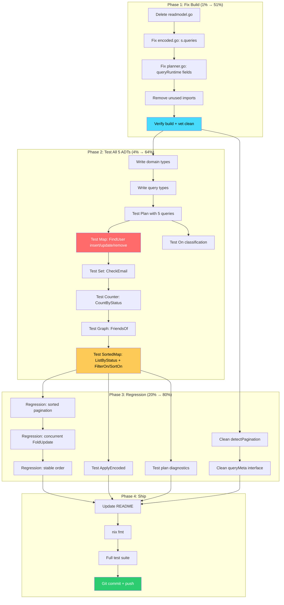

# Meta-Engine Build Plan: Event-Query Model Implementation

> **Goal:** A working, tested meta-engine where the developer declares Events + Queries + Folds
> via `On`, the operator provides Engines, and the planner derives everything else.

**Created:** 2026-07-23 22:17
**Status:** Active Execution Plan
**Design doc:** `docs/planning/event-query-model.md` (THE specification)

---

## The Three Roles

| Role | Provides | Receives |
|------|----------|----------|
| **Developer** | Event types, Query types (input+result), Fold functions via `On` | `Store` to `Apply`/`Execute` against |
| **Operator** | Engines (Memory, SQL, Pebble) with cost profiles | A `PlanResult` showing assignments + diagnostics |
| **Meta-Engine** | Derives ADTs, read patterns, engine assignments, projection handlers | The bridge between developer intent and operator infrastructure |

## The Core Relationships

```
EVENTS ────── On(fold) ──────▶ PROJECTION ◀────── Execute(query) ──── QUERIES
                                  │                                       │
                              ADT from                             Read pattern from
                              fold return type                     query input shape
```

- Fold return type `(K,V)` → Map ADT
- Fold return type `K` → Set ADT
- Fold return type `Delta` → Counter ADT
- Fold return type `Edge` → Graph ADT
- Fold return type `Remove[V]()` → Delete signal
- Fold return type `Skip` → No-op

---

## Pareto Analysis

### 1% that delivers 51%

**Fix the build + prove the declaration API compiles and runs.**

The `On` constructor, `Query[Q,R]`, and `Plan()` are already implemented with correct design.
They just have 4 compilation errors from the per-query architecture rewrite. Fix those,
write ONE test that declares a query, applies an event, and executes — and the entire
model is proven end-to-end.

### 4% that delivers 64%

**All 5 ADT types working end-to-end with tests.**

Map (point lookup), Set (membership), Counter (aggregate), Graph (traversal), and
SortedMap (filtered scan). Plus Remove/Skip sentinels and auto key derivation.
This proves the model handles every pattern from the design doc.

### 20% that delivers 80%

**FilterOn/SortOn typed closures + pagination from input struct + regression tests
for the 3 critical bug fixes + ApplyEncoded + plan diagnostics + README.**

### Remaining 20% (deferred)

- Real engines (SQLite wrapping `storage/view/SQLViewStore`, Pebble wrapping `storage/pebble/`)
- SQL pushdown for filter/sort (field-path extraction from closures — Open Design Decision 1)
- Hot-reload (re-plannable planner)
- Streaming results (`iter.Seq2`)
- Cursor serialization (`String()` / `ParseCursor`)
- Metadata parameter in fold handlers (`func(e, md Metadata)`)
- Integration with `event.Event`, `projection.Projection`, `projectionhost.Host`

---

## Current State Assessment

### What's Already Done (Salvageable)

| Component | Status | Lines |
|-----------|--------|-------|
| `On[E](sample, handler)` constructor | DONE — classifies all 7 patterns via reflection | fold.go:382 |
| `Remove[V]()` sentinel | DONE — type-safe deletion signal | fold.go |
| `Skip` sentinel type | DONE — no-op signal | types.go, fold.go |
| Auto key derivation | DONE — type-matches key K from insert fold onto update/remove events | fold.go |
| `Query[Q,R](name, ...args)` | DONE — accepts mix of Fold + QueryOption | query.go:229 |
| `FilterOn(func(r R) T)` / `SortOn(func(r R) T)` | DONE — typed closures, no strings | query.go |
| Per-query projections | DONE structurally — each query owns its folds/ADT/collection | planner.go, store.go |
| `MemoryEngine` | DONE — implements all backends, bug fixes preserved | engine.go:485 |
| `MapUpdater` atomic RMW | DONE — concurrency-safe FoldUpdate | engine.go |
| Full-scan-sort-truncate | DONE — MapScan collects all, sorts, then truncates | engine.go |
| Deterministic tiebreaker | DONE — secondary sort by map key as string | engine.go |
| Pagination from input struct | DONE — detects `Limit int` + `After *Cursor` | reflect.go |
| Collection result reconstruction | DONE — detects `[]T` + `*Cursor` fields by shape | reflect.go |
| `ApplyEncoded` for JSON | PARTIALLY DONE — broken (references removed `s.models`) | encoded.go:89 |

### What's Broken

| Issue | Fix |
|-------|-----|
| `encoded.go:30,73` — `s.models` undefined | Replace with `s.queries` iteration |
| `planner.go:229-231` — unknown fields on `queryRuntime` | Remove `filters`, `sortField`, `isPaginated` from struct literal |
| `readmodel.go` — 67 lines of dead `ReadModel` code | Delete file |
| Tests — all use old API (`OnInsert`, `MustModel`, `Page[T]`) | Full rewrite |

---

## Phase Breakdown (30-100min tasks)

### Phase 1: Fix Build & Clean Slate (1% → 51%) — 45min

| Task | Description | Impact | Effort | Deps |
|------|-------------|--------|--------|------|
| P1 | Fix 4 compilation errors + delete dead code | CRITICAL | 30min | None |
| P2 | Verify clean build + go vet | CRITICAL | 15min | P1 |

### Phase 2: Test All 5 ADT Types (4% → 64%) — 100min

| Task | Description | Impact | Effort | Deps |
|------|-------------|--------|--------|------|
| P3 | Write test domain types + helpers matching design doc examples | HIGH | 30min | P2 |
| P4 | Write tests: Map (FindUser), Set (CheckEmail), Counter (CountByStatus), Graph (FriendsOf) | CRITICAL | 40min | P3 |
| P5 | Write test: SortedMap (ListByStatus with FilterOn/SortOn + pagination) | HIGH | 30min | P3 |

### Phase 3: Regression & Polish (20% → 80%) — 60min

| Task | Description | Impact | Effort | Deps |
|------|-------------|--------|--------|------|
| P6 | Write regression tests: sorted pagination, concurrent update, stable order | HIGH | 30min | P4 |
| P7 | Write ApplyEncoded test + plan diagnostics test | MEDIUM | 15min | P4 |
| P8 | Clean up code quality (detectPagination, unused imports, queryMeta interface) | MEDIUM | 15min | P2 |

### Phase 4: Documentation & Ship — 45min

| Task | Description | Impact | Effort | Deps |
|------|-------------|--------|--------|------|
| P9 | Update README for On API | HIGH | 30min | P4-P5 |
| P10 | nix fmt + full test suite + commit + push | CRITICAL | 15min | P6-P9 |

**Total: ~250min**

---

## Detailed Sub-Task Breakdown (max 12min each)

### Phase 1: Fix Build (P1 + P2)

| ID | Description | Time |
|----|-------------|------|
| 1.1 | Delete `readmodel.go` entirely | 2min |
| 1.2 | Fix `encoded.go`: iterate `s.queries` instead of `s.models` | 10min |
| 1.3 | Fix `planner.go`: remove `filters`, `sortField`, `isPaginated` from `queryRuntime` literal | 10min |
| 1.4 | Remove any unused imports across all files | 5min |
| 1.5 | Run `go build ./...` — verify clean | 3min |
| 1.6 | Run `go vet ./...` — verify clean | 3min |

### Phase 2: Test All 5 ADT Types (P3 + P4 + P5)

| ID | Description | Time |
|----|-------------|------|
| 2.1 | Write domain event types: `UserCreated`, `UserSuspended`, `UserDeleted`, `Friendship` | 10min |
| 2.2 | Write query types: `FindUser/Result`, `CheckEmail/Result`, `ListByStatus/Result`, `CountByStatus/Result`, `FriendsOf/Result` | 12min |
| 2.3 | Write `TestPlan_AllFiveQueries` — Plan with all 5, verify assignments | 10min |
| 2.4 | Write `TestMap_FindUser` — Apply UserCreated + Execute FindUser | 10min |
| 2.5 | Extend Map test: Apply UserSuspended (FoldUpdate via On) + verify status change | 10min |
| 2.6 | Extend Map test: Apply UserDeleted (Remove sentinel) + verify deletion | 8min |
| 2.7 | Write `TestSet_CheckEmail` — Apply UserCreated, membership test | 10min |
| 2.8 | Write `TestCounter_CountByStatus` — Apply events, verify counts | 10min |
| 2.9 | Write `TestGraph_FriendsOf` — Apply Friendship, verify traversal | 10min |
| 2.10 | Write `TestFilteredScan_ListByStatus` — FilterOn + SortOn + pagination | 12min |
| 2.11 | Write `TestOnClassification` — verify each handler shape → correct FoldKind | 12min |

### Phase 3: Regression & Polish (P6 + P7 + P8)

| ID | Description | Time |
|----|-------------|------|
| 3.1 | Write regression: paginated sorted scan returns correct items past limit boundary | 12min |
| 3.2 | Write regression: concurrent FoldUpdate doesn't lose updates (MapUpdater) | 12min |
| 3.3 | Write regression: repeated scan returns identical order (deterministic tiebreaker) | 10min |
| 3.4 | Write `TestApplyEncoded` — JSON payload decode + Apply + Execute | 10min |
| 3.5 | Write `TestPlanDiagnostics` — degradation warnings for graph on scan engine | 10min |
| 3.6 | Clean up `detectPagination` — remove duplicate logic, dead `_ = limitType` | 8min |
| 3.7 | Clean up `queryMeta` interface — remove fields not needed with typed closures | 10min |
| 3.8 | Remove `reflect` import from `engine.go` if unused after `matchesFilters` deletion | 5min |

### Phase 4: Documentation & Ship (P9 + P10)

| ID | Description | Time |
|----|-------------|------|
| 4.1 | Rewrite README: three-role model, On API, all 5 examples from design doc | 12min |
| 4.2 | Add FilterOn/SortOn section to README | 10min |
| 4.3 | Add ApplyEncoded + projection adapter section to README | 8min |
| 4.4 | Run `nix fmt` on all metaengine files | 5min |
| 4.5 | Run full test suite: `GOWORK=off GOEXPERIMENT=jsonv2 go test -race -count=1 -v ./...` | 5min |
| 4.6 | Fix any test failures | 12min |
| 4.7 | Git commit with detailed message | 5min |
| 4.8 | Git push | 3min |

---

## Execution Graph



---

## Architecture Notes

### What Stays As-Is (Working Correctly)

- `On[E](sample, handler)` reflection-based classification — 7 patterns
- `Remove[V]()` sentinel — type-safe deletion
- `Skip` type — no-op signal
- Auto key derivation by type matching — no field name strings
- Per-query projections — each query owns its folds/ADT/collection
- `MemoryEngine` with all backends — valid for testing/CI deployments
- `MapUpdater` atomic RMW — concurrency-safe FoldUpdate
- Full-scan-sort-truncate — correct pagination past limit boundary
- Deterministic tiebreaker — stable order despite Go map randomization

### What Changes

- `encoded.go` — iterate `s.queries` not `s.models`
- `planner.go` — `queryRuntime` gets `config QueryConfig` field instead of separate `filters`/`sortField`/`isPaginated`
- `readmodel.go` — deleted entirely
- Tests — full rewrite for `On` API
- README — full rewrite for `On` API

### What's Deferred (and Why)

- **SQL pushdown for FilterOn/SortOn** — Go can't inspect closure bodies. Memory engine uses runtime closure invocation. SQL engine will need field-path extraction (code generation or different mechanism). Design doc lists this as Open Decision 1.
- **Real engines** — SQLite wrapping `storage/view/SQLViewStore`, Pebble wrapping `storage/pebble/`. These are separate modules.
- **Hot-reload** — Re-plannable planner with background replay + atomic cutover. Design doc section 14.
- **Streaming** — `iter.Seq2[T, error]` for unbounded results. Design doc Decision 2.
- **Metadata in folds** — `func(e, md Metadata)` optional 2nd parameter. Requires `Apply(ctx, eventType, payload, metadata)` signature change.
- **Cursor serialization** — `Cursor.String()` / `ParseCursor()` for HTTP pagination.

### The FilterOn/SortOn Closure Question

The current approach: `FilterOn(func(r R) T { return r.Status })` — the closure is called
at runtime on each result item. The filter value is extracted from the query input by TYPE
matching (find the input field whose Go type matches the closure's return type T).

This works for in-memory engines. For SQL engines, the closure can't be translated to
`WHERE status = ?` because Go reflection can't inspect closure bodies.

**Resolution for now:** Memory engine uses closures (proven, works). SQL pushback is deferred
to when we build a real SQL engine. At that point, we'll solve field-path extraction
(code generation, named field descriptors, or a different declaration mechanism).

The design doc acknowledges this as an open question (Section 15, Decision 1).
