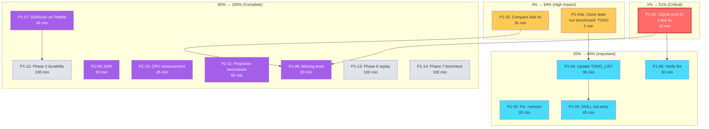

# Benchkit Hardening — Pareto Execution Plan

**Date:** 2026-07-24 17:59
**Trigger:** First real benchmark run (see [benchmark results](../status/2026-07-24_17-54_benchmark-first-real-run.md)) surfaced 6 findings; combined with 23 known open items from prior sessions = 29 total findings.
**Goal:** Make benchkit actually useful for its stated purpose: "benchmark any backend, any profile, compare results."

---

## Pareto Breakdown

### The 1% that delivers 51%

**SQLite concurrent-write fix.** One missing function call (`storage.ConfigureSQLitePool(sqlDB)`) in `stack/sqlite/preset.go`. Without this, SQLite can only run at Concurrency=1 (dev profile only). The function already exists, is used by Turso, and the internal benchmarks already call `SetMaxOpenConns(1)`. This is a wiring bug, not a design change.

### The 4% that delivers 64%

1. SQLite pool fix (above)
2. **Compare-mode disk = 0B fix.** The `compare` command doesn't set `DiskPath` on Config, so disk columns are always empty in comparison tables. Fix: pass temp dir paths in compare's factory setup.
3. **Close stale TODO.** The "run the benchmark and inspect output" item is done (we just did it). Remove from TODO_LIST, note in CHANGELOG.

### The 20% that delivers 80%

1-3. Above
4. **Fix `--version`** with `runtime/debug.ReadBuildInfo()` — eliminates version drift
5. **Add 22 untracked findings to TODO_LIST** — the tracking gap is the biggest process issue; 22 of 29 findings are untracked
6. **SKILL.md benchkit entry** — consumers can't discover benchkit from the AI guide
7. **Run `nix run .#lint`** on benchkit modules — verify golangci-lint passes

### The other 80% (to reach 100%)

8. DiskSizer implementation on Pebble.Bundle
9. Phase 2 (durability), Phase 6 (replay), Phase 7 (benchtest suite)
10. ADR for benchkit design decisions
11. CPU measurement for fast benchmarks
12. Projection benchmark in default profiles
13. Postgres tests
14. Analytical benchmark profiles
15. 9 missing edge-case tests

---

## Verschlimmbesserung Risk Assessment

> "If you Verschlimmbessern this system, I will cut off your balls."

| Task | Risk | Mitigation |
|------|------|------------|
| SQLite pool fix (1 line) | **Very Low** — calling an existing function already used by Turso | Verify with benchmark before/after |
| Compare disk fix | **Low** — passing an extra field to Config | Verify compare output shows disk |
| `--version` fix | **Low** — replacing hardcoded string with stdlib | Test both tagged and untagged builds |
| TODO_LIST update | **Zero** — documentation only | N/A |
| SKILL.md entry | **Low** — new documentation | Run doc-check after |
| DiskSizer on Pebble | **Medium** — new code on Bundle | Type assertion already handles nil case |
| Phase 2/6/7 | **High** — large features touching core runner | Separate PRs, not this session |
| 9 missing tests | **Low-Medium** — test-only code | Use table-driven, t.Parallel |

---

## Phase 1: Comprehensive Plan (30-100 min tasks)

Sorted by importance/impact/effort/customer-value.

| ID | Task | Impact | Effort | Dependencies |
|----|------|--------|--------|--------------|
| P1-01 | Fix SQLite pool config: add `storage.ConfigureSQLitePool(sqlDB)` to `stack/sqlite/preset.go` after `SQLiteEnableWAL` | Critical — unblocks 2/3 backends | 15 min | None |
| P1-02 | Fix compare-mode disk: pass `DiskPath` in compare's factory setup so disk columns populate | High — compare tables show real data | 30 min | None |
| P1-03 | Fix `--version`: replace hardcoded `v4.1.0` with `runtime/debug.ReadBuildInfo()` in `cmd/cqrs-bench/main.go` | Medium — eliminates version drift | 30 min | None |
| P1-04 | Update TODO_LIST: add 22 untracked findings, close stale "run benchmark" item, add Phase 2 | High — tracking completeness | 30 min | None |
| P1-05 | Add benchkit entry to SKILL.md: decision matrix (benchkit vs stack/bench), basic usage, module table entry | Medium — consumer discoverability | 45 min | None |
| P1-06 | Verify lint: `nix run .#lint` on benchkit + cmd/cqrs-bench modules | Medium — CI gate | 30 min | P1-01 |
| P1-07 | Implement `DiskSize()` on `pebble.Bundle` via `backend.Metrics().DiskUsage()` | Medium — eliminates dead interface | 45 min | None |
| P1-08 | Add 9 missing edge-case tests (compare failure, Concurrency override, journal scan, CLI flags) | Medium — coverage | 90 min | None |
| P1-09 | Write ADR for benchkit: codec-aware padding, warmup isolation, ReadRatio-as-passes, SkipPhases | Low — documentation | 30 min | None |
| P1-10 | Improve CPU measurement for fast benchmarks (read CPU at start+end, not just polling) | Low — metric accuracy | 45 min | None |
| P1-11 | Add projection benchmark to default profiles (register a simple projection, measure catch-up speed) | Low — feature gap | 60 min | None |
| P1-12 | Phase 2: durability benchmark (crash recovery, replay-after-restart) | Low — future feature | 100 min | P1-07 |
| P1-13 | Phase 6: production replay (replay real event streams) | Low — future feature | 100 min | None |
| P1-14 | Phase 7: `benchtest.RunSuite` (Go `testing.B` wrappers) | Low — future feature | 100 min | None |

**Total effort:** ~13 hours

---

## Phase 2: Detailed Breakdown (max 12 min tasks)

Each P1 task is decomposed into subtasks small enough to verify independently.

### P1-01: SQLite pool fix (15 min)

| ID | Subtask | Effort |
|----|---------|--------|
| 01a | Read `stack/sqlite/preset.go:118-182` to find exact insertion point | 2 min |
| 01b | Add `storage.ConfigureSQLitePool(sqlDB)` after `SQLiteEnableWAL` call | 2 min |
| 01c | Build: `go build ./stack/sqlite/...` | 2 min |
| 01d | Benchmark: `cqrs-bench run --backend sqlite --profile small` | 3 min |
| 01e | Benchmark: `cqrs-bench run --backend sqlite --profile medium` | 3 min |

### P1-02: Compare-mode disk fix (30 min)

| ID | Subtask | Effort |
|----|---------|--------|
| 02a | Read `cmd/cqrs-bench/main.go:makeFactory` — understand how DiskPath is returned | 3 min |
| 02b | Read `compareCmd` — understand how factories are built (line 164: `makeFactory(name, "", "")`) | 2 min |
| 02c | Modify `compareCmd` to create temp dirs for sqlite/pebble and pass them | 5 min |
| 02d | Collect diskPaths into a map and set `config.DiskPath` appropriately per backend | 5 min |
| 02e | Build and run: `cqrs-bench compare --profile dev --format markdown` | 3 min |
| 02f | Verify disk column shows non-zero values | 2 min |
| 02g | Run `cqrs-bench compare --profile small --format markdown` | 5 min |
| 02h | Add test: `TestCompare_DiskMeasurement` | 5 min |

### P1-03: Fix `--version` (30 min)

| ID | Subtask | Effort |
|----|---------|--------|
| 03a | Read `cmd/cqrs-bench/main.go:42-43` — current hardcoded version | 1 min |
| 03b | Research `runtime/debug.ReadBuildInfo()` — extract module version | 5 min |
| 03c | Implement `version()` function using `debug.ReadBuildInfo()` | 5 min |
| 03d | Handle fallback for untagged builds (returns "(devel)") | 5 min |
| 03e | Update `TestCLI_Version` to accept both tagged and devel patterns | 5 min |
| 03f | Build and test: `go test ./cmd/cqrs-bench/...` | 3 min |
| 03g | Verify: `/tmp/cqrs-bench --version` shows real version | 2 min |

### P1-04: Update TODO_LIST (30 min)

| ID | Subtask | Effort |
|----|---------|--------|
| 04a | Remove "Run the benchmark and inspect output" (done) | 2 min |
| 04b | Add: SQLite concurrent-write fix (if not done in P1-01) | 2 min |
| 04c | Add: Compare-mode disk = 0B (if not done in P1-02) | 2 min |
| 04d | Add: Phase 2 durability benchmarking | 2 min |
| 04e | Add: `readPassesFor` cap at 10 (sustained reads) | 2 min |
| 04f | Add: CPU measurement returns n/a for fast benchmarks | 2 min |
| 04g | Add: No projection benchmark exercised | 2 min |
| 04h | Add: Postgres tests not done | 2 min |
| 04i | Add: SKILL.md has 0 benchkit mentions (if not done in P1-05) | 2 min |
| 04j | Add: No ADR for benchkit (if not done in P1-09) | 2 min |
| 04k | Add: Analytical benchmark profiles | 2 min |
| 04l | Add: flake.nix lint unverified (if not done in P1-06) | 2 min |
| 04m | Add: 9 missing test items (condensed into 2-3 entries) | 5 min |

### P1-05: SKILL.md entry (45 min)

| ID | Subtask | Effort |
|----|---------|--------|
| 05a | Read `.agents/skills/go-cqrs-lite/SKILL.md` structure | 5 min |
| 05b | Read `.agents/skills/go-cqrs-lite/references/modules.md` | 3 min |
| 05c | Write module decision matrix: benchkit vs stack/bench | 8 min |
| 05d | Write benchkit section in SKILL.md (when to use, basic recipe) | 10 min |
| 05e | Add benchkit to modules.md table | 3 min |
| 05f | Run doc-check: `cd cmd/doc-check && GOWORK=off go run . ../../SKILL.md ../../.agents/skills/go-cqrs-lite/references/*.md` | 5 min |
| 05g | Fix any broken references found by doc-check | 5 min |

### P1-06: Verify lint (30 min)

| ID | Subtask | Effort |
|----|---------|--------|
| 06a | Run `GOEXPERIMENT=jsonv2 go vet -tags "goexperiment.jsonv2" ./benchkit/... ./cmd/cqrs-bench/...` | 5 min |
| 06b | Run `nix run .#lint` (or targeted lint if full run too slow) | 15 min |
| 06c | Fix any lint findings in benchkit files | 10 min |

### P1-07: DiskSizer on Pebble (45 min)

| ID | Subtask | Effort |
|----|---------|--------|
| 07a | Read `stack/pebble/preset.go` — understand Bundle structure | 5 min |
| 07b | Read Pebble `Metrics()` API — find disk usage bytes | 5 min |
| 07c | Implement `func (b *Bundle) DiskSize() int64` using `backend.Metrics()` | 8 min |
| 07d | Build: `go build ./stack/pebble/...` | 2 min |
| 07e | Benchmark: `cqrs-bench run --backend pebble --profile small` | 3 min |
| 07f | Verify disk shows non-zero (previously used filesystem walk) | 2 min |
| 07g | Run existing tests: `go test ./stack/pebble/...` | 5 min |
| 07h | Add test verifying DiskSizer type assertion succeeds | 5 min |

### P1-08: Missing tests (90 min)

| ID | Subtask | Effort |
|----|---------|--------|
| 08a | `TestCompare_BackendFailure` — 3 backends, 1 fails, others still report | 10 min |
| 08b | `TestConfig_ConcurrencyOverride` — Config.Concurrency overrides Profile.Concurrency | 8 min |
| 08c | `TestRun_JournalScanMetrics` — ReadAllTime and ReadFromTime populated | 10 min |
| 08d | `TestCLI_CodecCBOR` — `run --codec cbor` produces CBOR-encoded events | 8 min |
| 08e | `TestCLI_WarmupFlag` — `run --warmup 100` produces warmupEvents in output | 8 min |
| 08f | `TestCLI_OutputFile` — `run --output /tmp/x.json` writes to file | 8 min |
| 08g | `TestCLI_UnknownProfile` — `run --profile bogus` exits with error | 5 min |
| 08h | `TestCLI_UnknownBackend` — `run --backend bogus` exits with error | 5 min |
| 08i | Run full suite: `go test -race ./benchkit/... ./cmd/cqrs-bench/...` | 10 min |

### P1-09: ADR (30 min)

| ID | Subtask | Effort |
|----|---------|--------|
| 09a | Read existing ADR format: `ls docs/adr/` and read one | 3 min |
| 09b | Determine next ADR number | 2 min |
| 09c | Write ADR: codec-aware padding, warmup isolation, ReadRatio-as-passes, SkipPhases, DiskSizer interface | 15 min |
| 09d | Add cross-reference from benchkit/README.md to ADR | 5 min |

### P1-10: CPU measurement (45 min)

| ID | Subtask | Effort |
|----|---------|--------|
| 10a | Read `benchkit/metrics.go` — current CPU sampling approach | 5 min |
| 10b | Identify why memory backend reports 0 (completes between samples) | 5 min |
| 10c | Add CPU start/end measurement alongside heap (not just polling) | 10 min |
| 10d | Test: memory backend now reports non-zero CPU | 5 min |

### P1-11: Projection benchmark (60 min)

| ID | Subtask | Effort |
|----|---------|--------|
| 11a | Read `benchkit/phases.go` — projection phase implementation | 5 min |
| 11b | Understand why projectionEvents=0 (no projection registered?) | 10 min |
| 11c | Register a simple counting projection in the benchmark runner | 10 min |
| 11d | Verify projectionEvents > 0 in results | 5 min |

---

## Mermaid Execution Graph

---

## Execution Priority (recommended order)

### Do Now (this session, ~3 hours)

1. **P1-01** — SQLite pool fix (unblocks everything)
2. **P1-02** — Compare disk fix (makes compare useful)
3. **P1-03** — `--version` fix (quick win)
4. **P1-04** — TODO_LIST update (tracking completeness)

### Do Next (~2 hours)

5. **P1-05** — SKILL.md entry (consumer discoverability)
6. **P1-06** — Lint verification (CI gate)
7. **P1-07** — DiskSizer on Pebble (eliminates dead interface)
8. **P1-08** — Missing tests (coverage)

### Do Later (~5 hours, separate sessions)

9. **P1-09** — ADR
10. **P1-10** — CPU measurement
11. **P1-11** — Projection benchmark

### Future (not this session)

12. **P1-12** — Phase 2 durability
13. **P1-13** — Phase 6 replay
14. **P1-14** — Phase 7 benchtest suite

---

## What NOT To Do (Verschlimmbesserung Prevention)

- **Don't change the SQLite pool to MaxOpenConns > 1.** SQLite WAL serializes writes regardless. Setting MaxOpenConns(1) is the correct fix — it matches what the internal benchmarks already do.
- **Don't refactor the runner or phases architecture.** It works. 55 tests pass. The benchmark produces plausible numbers. Fix bugs, don't redesign.
- **Don't add features to the profiles.** The 7 existing profiles cover the space. Adding more profiles dilutes comparability.
- **Don't change the Generator API again.** The codec-aware `NewGenerator(seed, size, codec)` is correct. Leave it.
- **Don't add projection/analytical benchmarks to profiles that don't need them.** Dev profile should stay fast. Projection benchmarking should be opt-in.
- **Don't break the warmup isolation.** It works. The separate Bundle pattern is correct. Don't "optimize" it.
