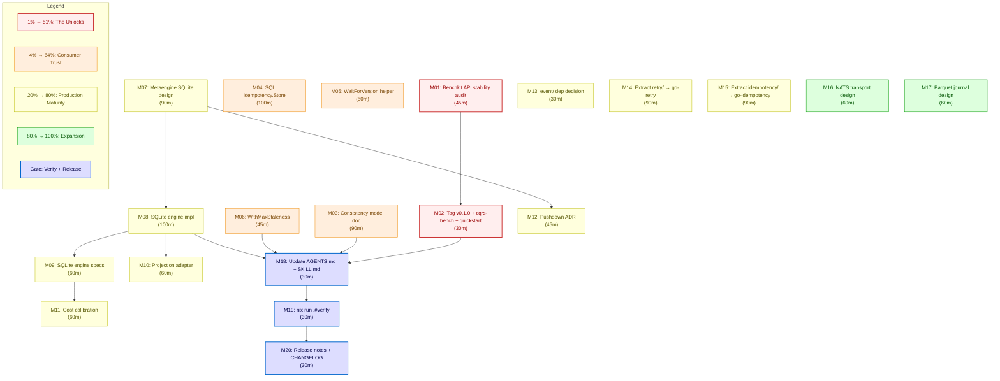

# Superb Next-Level Execution Plan — go-cqrs-lite

> **Point-in-time plan:** 2026-07-24 23:36 · **Author:** Pareto-planning skill
> **Source of truth:** [TODO_LIST.md](../../TODO_LIST.md) + [ROADMAP.md](../../ROADMAP.md) (rebuilt 2026-07-24 docs-health audit)
> **Status:** Drafted, pending approval → then full execution

---

> **Update 2026-07-25:** This plan **executed.** M01–M13 (the 1%, 4%, and 20%
> tiers) shipped: benchkit tagged v4.1.0, consistency model doc, SQL idempotency
> store, WaitForVersion, CheckStaleness, metaengine SQLite engine + projection
> adapter + cost calibration (ADRs 0061–0063), module-extraction ADRs (0064/0065).
> M16–M17 (NATS/Parquet design docs) shipped. Open: M14–M15 (physical module
> extraction needs external repos), M18–M20 (release tagging — blocked on verify
> gate, see [TODO_LIST.md](../../TODO_LIST.md)). Module count is now **58** (not 56).

---

## Context — where the project IS right now

**go-cqrs-lite** is a CQRS/ES **library/SDK** (not an app). 56 `go.mod` files in a
`go.work` workspace. **v4.1.0 tagged** (2026-07-23) on `/v4` import paths — the
core library is released and covers the full lifecycle: event sourcing, branded
IDs, command/query dispatch, pure-function deciders, three projection tiers
(document/KV, relational/SQL, graph), durable scheduling, signing/encryption,
OTel, cqrs-lint (60 rules).

**The tension:** the core is shipped and stable, but there is a pile of
**COMPLETED-but-UNRELEASED** work and a pile of **NOT-STARTED production
features.** The quality gate for every module is: _"Would a consumer trust this
enough to import it?"_

### What is unreleased (work done, zero consumer value today)

| Module                      | State                                              | Tests            | Ready to tag?                     |
| --------------------------- | -------------------------------------------------- | ---------------- | --------------------------------- |
| `benchkit/v4`               | Functionally complete (full evidence plan shipped) | 88               | ✅ likely stable                  |
| `cmd/cqrs-bench`            | CLI complete (run/compare/sweep/repeat)            | 12               | ✅ likely stable                  |
| `example/readme-quickstart` | Compile-verified README example                    | —                | ✅ safe (example)                 |
| `metaengine/v4`             | 🧪 experimental, MemoryEngine only                 | 174 specs, 87.7% | ⚠️ NOT ready — API still evolving |

### What is open (TODO_LIST.md, verified 2026-07-24)

- **Benchkit:** tag v0.1.0 when API stabilizes (1 item)
- **Metaengine → Production:** real SQLite engine, projection adapter, cost
  calibration, FilterOn/SortOn pushdown, event/ dep decision (5 items)
- **Consumer Experience:** read-your-writes helper, bounded staleness,
  consistency-model doc, SQL-backed idempotency.Store (4 items)
- **ROADMAP long-term:** module extraction (retry/, idempotency/), transport
  expansion (NATS/ValKey), Parquet+DuckDB, jsonv2/Turso blockers

---

## Step 1 — Pareto Breakdown (what should we REALLY do?)

> The guiding insight for a **library**: unreleased completed work has **zero**
> consumer value. Releasing it is near-zero effort, huge unlock. Documentation
> that lets consumers reason about correctness is high-leverage and low-risk.
> New production features (metaengine SQL engine) are high-value but
> high-effort and carry API-stability risk.

### 🔴 The 1% that delivers 51% — THE UNLOCKS

**Release the completed, unreleased work.** `benchkit`, `cmd/cqrs-bench`, and
`example/readme-quickstart` are functionally complete with full test suites.
Consumers cannot import them today because there is no git tag. A short API
stability audit + `scripts/tag-release.sh` unlocks the entire benchmarking
capability for every consumer. **Metaengine is explicitly excluded** — it is
experimental and tagging it would trap consumers on an unstable API
(VERSCHLIMMBESSER risk).

### 🟠 The 4% that delivers 64% — CONSUMER TRUST

Three enablers that turn "works in a demo" into "safe to build on":

1. **Consistency model document** (`docs/CONSISTENCY_MODEL.md`) — the #1 doc gap.
   Consumers cannot reason about read-after-write correctness without it. Pure
   doc, zero code risk, huge trust value.
2. **SQL-backed `idempotency.Store`** — the #1 horizontal-scaling blocker.
   Without it, idempotency only works single-process. ~100 lines:
   `INSERT ON CONFLICT DO NOTHING` (pattern already used in 5+ storage files).
3. **Read-your-writes `WaitForVersion` helper** — the #1 UX gap for consumers
   building request/response flows on eventual consistency. Polls
   `LoadFromVersion` until the target version is visible or a deadline hits.

### 🟡 The 20% that delivers 80% — PRODUCTION MATURITY

Move `metaengine` from experimental prototype toward a real production backend,
and extract the two zero-coupling modules into standalone repos:

- **Metaengine real SQLite engine** — wrap `SQLViewStore` as a metaengine
  backend. The first production engine validates the interface design. (3
  phases: design, implement, test.)
- **Metaengine projection adapter** — connect metaengine to the existing
  `projection.Projection` / `projectionhost` infrastructure.
- **Metaengine cost model calibration** — replace the arbitrary `nsPerOp=100`
  with benchmark-driven numbers.
- **Bounded staleness** `WithMaxStaleness` — projection read option.
- **Module extraction** — `retry/` → `go-retry`, `idempotency/` → `go-idempotency`
  (zero CQRS coupling, standalone repos).

### 🟢 The other 20% (to 100%) — EXPANSION

Design-doc-backed work that graduates to TODO when actively scoped:

- **FilterOn/SortOn → SQL pushdown ADR** — decide DSL vs codegen vs in-memory.
- **NATS/ValKey transport adapter** — ADR-0025 accepted, needs a module.
- **Parquet journal + DuckDB** — three additive phases, "lakehouse for events."
- **Metaengine event/ dependency** — resolve the go.sum boundary question.

---

## Step 2 — Comprehensive Plan (medium granularity, 30–100 min each)

> Sorted by **impact ↓, then effort ↑** within each tier. Effort is a realistic
> estimate for a focused engineer (not a fresh agent). All tasks are
> independently committable.

| ID      | Task                                                                                                                                                                                                                                                                                                 | Tier   | Impact   | Effort | Depends on   |
| ------- | ---------------------------------------------------------------------------------------------------------------------------------------------------------------------------------------------------------------------------------------------------------------------------------------------------- | ------ | -------- | ------ | ------------ |
| **M01** | **Benchkit API stability audit** — review `benchkit/` + `cmd/cqrs-bench` public exports against FEATURES.md; confirm no pending breaking changes; check the 4 `stack/bench` RunSuite signatures; document any "do not break" surface in an ADR stub.                                                 | 🔴 1%  | Critical | 45m    | —            |
| **M02** | **Tag `benchkit/v0.1.0` + `cmd/cqrs-bench` + `example/readme-quickstart`** via `scripts/tag-release.sh`; verify each tag is annotated; push tags; confirm Go proxy fetch.                                                                                                                            | 🔴 1%  | Critical | 30m    | M01          |
| **M03** | **Consistency model document** — `docs/CONSISTENCY_MODEL.md`: single-process scope, write→read eventual consistency, projection lag, read-after-write patterns, the WaitForVersion contract, bounded-staleness semantics. Cross-link from README + AGENTS.                                           | 🟠 4%  | Critical | 90m    | —            |
| **M04** | **SQL-backed `idempotency.Store`** — `storage.SQLIdempotencyStore` (or `idempotency/kvstore`-style sibling): `CREATE TABLE`, `INSERT ON CONFLICT DO NOTHING` for `CheckAndRecord`, `Seen`/`Record`/TTL sweep. Reuse `storage/sql` helpers (`RunInTx`, `IsDuplicateKeyError`). SQLite + Postgres DDL. | 🟠 4%  | High     | 100m   | —            |
| **M05** | **Read-your-writes `WaitForVersion(ctx, streamID, version, opts)`** — decider helper that polls `store.LoadFromVersion` until the target version is visible or a deadline/`context.Done()`. Default 2s timeout, 10ms poll. Returns the loaded events or `context.DeadlineExceeded`.                  | 🟠 4%  | High     | 60m    | —            |
| **M06** | **Bounded staleness `WithMaxStaleness(d)`** — `projectionhost` read option: reject/flag reads whose projection lag exceeds the threshold. Wire into `Host.LagDuration()` check.                                                                                                                      | 🟠 4%  | Med      | 45m    | —            |
| **M07** | **Metaengine SQLite engine — design** — ADR: how `SQLViewStore` maps to the 9 metaengine backend interfaces (Map, MapUpdater, Scan, Set, Counter, Graph, …). Decide the engine struct shape, table-per-ADT vs table-per-query, key/column mapping. Skeleton interface.                               | 🟡 20% | High     | 90m    | —            |
| **M08** | **Metaengine SQLite engine — implementation** — `metaengine.SQLiteEngine` wrapping `SQLViewStore`/`storage/view`. Implement the backend interfaces the design requires.                                                                                                                              | 🟡 20% | High     | 100m   | M07          |
| **M09** | **Metaengine SQLite engine — BDD specs** — Ginkgo specs covering each ADT through the SQLite engine; cost-based engine selection; fallback to MemoryEngine; error paths.                                                                                                                             | 🟡 20% | High     | 60m    | M08          |
| **M10** | **Metaengine projection adapter** — adapter implementing `projection.Projection` so a metaengine Store can be registered with `projectionhost.Host`. Integration test against the host lifecycle.                                                                                                    | 🟡 20% | Med      | 60m    | M08          |
| **M11** | **Metaengine cost model calibration** — benchmark-driven: replace `nsPerOp=100` with measured per-op costs for Memory vs SQLite engines; wire scale thresholds to auto-switch structures.                                                                                                            | 🟡 20% | Med      | 60m    | M08, M09     |
| **M12** | **FilterOn/SortOn → SQL pushdown ADR** — design decision: DSL (inspectable closures), codegen, or keep in-memory filtering. Write `docs/adr/0061-metaengine-pushdown.md`.                                                                                                                            | 🟡 20% | Med      | 45m    | M07          |
| **M13** | **Resolve metaengine `event/` dependency** — decide: add `event` dep (resolve go.sum checksum) OR keep the zero-dep boundary (document the integration seam). 1-paragraph decision + ADR note.                                                                                                       | 🟡 20% | Low      | 30m    | —            |
| **M14** | **Extract `retry/` → `go-retry`** — new standalone repo: copy 217 LOC, `go.mod`, tag `v1.0.0`; update `go-cqrs-lite/retry` to re-export from the new module (compat alias) or replace.                                                                                                               | 🟡 20% | Med      | 90m    | —            |
| **M15** | **Extract `idempotency/` → `go-idempotency`** — new standalone repo: copy 355 LOC + 3-method `Store` interface, `go.mod`, tag `v1.0.0`; update go-cqrs-lite consumers.                                                                                                                               | 🟡 20% | Med      | 90m    | —            |
| **M16** | **NATS transport adapter — design** — `transport/nats/` module design doc: EventBus/CommandBus over NATS JetStream, mapping to `event.Publisher`/`Subscriber`. ADR-0025 accepted; this is the design step.                                                                                           | 🟢 80% | Med      | 60m    | —            |
| **M17** | **Parquet journal Phase 1 — design** — `storage/parquet` design doc: segment-based append-only log, manifest index, `SeekableJournal` conformance, pure-Go `parquet-go`.                                                                                                                             | 🟢 80% | Med      | 60m    | —            |
| **M18** | **Update AGENTS.md + SKILL.md** for all new features (consistency doc, SQL idempotency, WaitForVersion, WithMaxStaleness, metaengine SQLite engine). Run `cmd/doc-check`.                                                                                                                            | all    | Med      | 30m    | M03–M06, M08 |
| **M19** | **Full quality gate** — `nix run .#verify` (build + vet + test + race + lint + doc-check + doc-assertions). Fix any fallout.                                                                                                                                                                         | all    | High     | 30m    | M01–M17      |
| **M20** | **Release notes + CHANGELOG** for the next version cut — move `[Unreleased]` items to a versioned section; update ROADMAP release-history table.                                                                                                                                                     | all    | Med      | 30m    | M19          |

**Totals:** 20 tasks, ~16.5h estimated. Tier 1 (M01–M02): 1.25h. Tier 2 (M03–M06):
~5h. Tier 3 (M07–M15): ~8h. Tier 4 (M16–M17): 2h. Cross-cutting (M18–M20): 1.5h.

---

## Step 3 — Detailed Breakdown (fine granularity, max 12 min each)

> Each medium task decomposed into ≤12min atomic steps. Sorted by impact within
> tier; dependencies noted. A `✅` column marks steps that are pure verification
> (run after implementation).

### Tier 1 — The Unlocks (1% → 51%)

| ID  | Step                                                                      | Effort | Depends  |
| --- | ------------------------------------------------------------------------- | ------ | -------- |
| F01 | List `benchkit/` exported symbols (`grep -rh '^func [A-Z]\|^type [A-Z]'`) | 5m     | —        |
| F02 | Diff benchkit exports vs FEATURES.md "Benchmarking Toolkit" table         | 8m     | F01      |
| F03 | Confirm no TODO/FIXME in benchkit public API surface                      | 5m     | —        |
| F04 | Review `stack/bench` RunSuite signatures for stability                    | 8m     | —        |
| F05 | Write benchkit stability note (ADR stub or FEATURES annotation)           | 10m    | F02, F04 |
| F06 | Run `cd benchkit && GOWORK=off go test -race ./...`                       | 8m     | —        |
| F07 | Run `cd cmd/cqrs-bench && GOWORK=off go test -race ./...`                 | 5m     | —        |
| F08 | Run `scripts/tag-release.sh benchkit v0.1.0` (annotated)                  | 8m     | F05–F07  |
| F09 | Tag `cmd/cqrs-bench` + `example/readme-quickstart`                        | 5m     | F08      |
| F10 | `git push --tags` + verify `go list -m` fetches                           | 8m     | F09      |

### Tier 2 — Consumer Trust (4% → 64%)

| ID  | Step                                                                                                                                    | Effort | Depends  |
| --- | --------------------------------------------------------------------------------------------------------------------------------------- | ------ | -------- |
| F11 | Draft `docs/CONSISTENCY_MODEL.md` outline (sections: scope, write path, read path, projection lag, read-after-write, bounded staleness) | 10m    | —        |
| F12 | Write "Single-process scope" + "Eventual consistency" sections                                                                          | 12m    | F11      |
| F13 | Write "Read-after-write" section (the WaitForVersion contract)                                                                          | 10m    | F12      |
| F14 | Write "Bounded staleness" section (WithMaxStaleness semantics)                                                                          | 8m     | F13      |
| F15 | Cross-link from README "Production" section + AGENTS.md                                                                                 | 8m     | F14      |
| F16 | Run `cmd/doc-check` on the new doc                                                                                                      | 5m     | F15      |
| F17 | Read existing `idempotency.Store` interface + `idempotency/kvstore` pattern                                                             | 5m     | —        |
| F18 | Read `storage/sql/helpers.go` (`RunInTx`, `IsDuplicateKeyError`)                                                                        | 5m     | —        |
| F19 | Design `SQLIdempotencyStore` struct + DDL (SQLite + Postgres)                                                                           | 10m    | F17, F18 |
| F20 | Implement `CheckAndRecord` (`INSERT ON CONFLICT DO NOTHING`)                                                                            | 12m    | F19      |
| F21 | Implement `Seen` + `Record` + TTL sweep query                                                                                           | 10m    | F20      |
| F22 | Implement `Close` (no-op, caller owns `*sql.DB`)                                                                                        | 3m     | F21      |
| F23 | Write table-driven tests (seen/record/expiry/duplicate)                                                                                 | 12m    | F22      |
| F24 | Write concurrent `CheckAndRecord` race test (exactly one winner)                                                                        | 10m    | F23      |
| F25 | Add to FEATURES.md + CHANGELOG `[Unreleased]`                                                                                           | 8m     | F24      |
| F26 | Read decider `Repository` + `store.LoadFromVersion` signatures                                                                          | 5m     | —        |
| F27 | Design `WaitForVersion(ctx, store, streamID, version, opts)` signature                                                                  | 8m     | F26      |
| F28 | Implement polling loop (10ms ticker, deadline, `ctx.Done()`)                                                                            | 12m    | F27      |
| F29 | Write tests (immediate, delayed, timeout, context-cancel)                                                                               | 12m    | F28      |
| F30 | Add to `decider/` doc.go + FEATURES.md                                                                                                  | 8m     | F29      |
| F31 | Read `projectionhost.Host.LagDuration()` + `Status()`                                                                                   | 5m     | —        |
| F32 | Design `WithMaxStaleness(d)` option on Host reads                                                                                       | 8m     | F31      |
| F33 | Implement staleness check in the read path                                                                                              | 10m    | F32      |
| F34 | Write tests (fresh read ok, stale read rejected/flagged)                                                                                | 12m    | F33      |
| F35 | Add to FEATURES.md + doc-check                                                                                                          | 5m     | F34      |

### Tier 3 — Production Maturity (20% → 80%)

| ID  | Step                                                                                                            | Effort | Depends  |
| --- | --------------------------------------------------------------------------------------------------------------- | ------ | -------- |
| F36 | Read all 9 metaengine backend interfaces (Map, MapUpdater, Scan, Set, Counter, Graph, SortedMap, Multimap, Log) | 10m    | —        |
| F37 | Read `storage/view.SQLViewStore` + `ViewMapper` (column mapping)                                                | 10m    | —        |
| F38 | Decide table-per-ADT vs table-per-query; sketch the engine struct                                               | 12m    | F36, F37 |
| F39 | Write `docs/adr/0061-metaengine-sqlite-engine.md` (design)                                                      | 12m    | F38      |
| F40 | Create `metaengine/sqlite_engine.go` skeleton (struct + interface stubs)                                        | 10m    | F39      |
| F41 | Implement Map + MapUpdater backends via `SQLViewStore`                                                          | 12m    | F40      |
| F42 | Implement Set + Counter backends                                                                                | 12m    | F41      |
| F43 | Implement Scan backend (range queries)                                                                          | 10m    | F42      |
| F44 | Implement Graph/SortedMap/Multimap/Log (or stub with in-memory fallback)                                        | 12m    | F43      |
| F45 | Wire `Store.Plan` to consider the SQLite engine                                                                 | 8m     | F44      |
| F46 | BDD spec: Map ADT through SQLite engine (insert/update/set)                                                     | 12m    | F45      |
| F47 | BDD spec: Set + Counter ADTs through SQLite engine                                                              | 12m    | F46      |
| F48 | BDD spec: cost-based engine selection (SQLite vs Memory)                                                        | 10m    | F47      |
| F49 | BDD spec: error paths (no table, duplicate key, closed store)                                                   | 12m    | F48      |
| F50 | Design `projection.Projection` adapter wrapping a metaengine Store                                              | 10m    | F45      |
| F51 | Implement the adapter (`Name`, `Handle`, `EventTypes`)                                                          | 12m    | F50      |
| F52 | Integration test: register adapter with `projectionhost.Host`                                                   | 12m    | F51      |
| F53 | Benchmark Memory vs SQLite per-op cost; collect numbers                                                         | 10m    | F49      |
| F54 | Replace `nsPerOp=100` with calibrated constants; wire scale thresholds                                          | 10m    | F53      |
| F55 | Write FilterOn/SortOn pushdown ADR (`docs/adr/0062-pushdown.md`)                                                | 12m    | F39      |
| F56 | Resolve `event/` dep decision (1-paragraph ADR note)                                                            | 8m     | —        |
| F57 | Extract `retry/` → new repo skeleton (`go.mod`, copy 217 LOC)                                                   | 12m    | —        |
| F58 | Tag `go-retry/v1.0.0`; update go-cqrs-lite `retry/` to re-export                                                | 10m    | F57      |
| F59 | Extract `idempotency/` → new repo skeleton (`go.mod`, copy 355 LOC)                                             | 12m    | —        |
| F60 | Tag `go-idempotency/v1.0.0`; update go-cqrs-lite consumers                                                      | 10m    | F59      |

### Tier 4 — Expansion (80% → 100%) + Cross-cutting

| ID  | Step                                                                     | Effort | Depends      |
| --- | ------------------------------------------------------------------------ | ------ | ------------ |
| F61 | NATS transport design doc outline (JetStream, topic mapping)             | 12m    | —            |
| F62 | Parquet journal design doc outline (segments, manifest, SeekableJournal) | 12m    | —            |
| F63 | Update AGENTS.md module tree + patterns for new features                 | 12m    | M03–M06, M08 |
| F64 | Update SKILL.md references (`references/modules.md`, `recipes.md`)       | 10m    | F63          |
| F65 | Run `cmd/doc-check` on AGENTS.md + SKILL.md + all references             | 8m     | F64          |
| F66 | Run `nix run .#verify` (full gate)                                       | 10m    | F65          |
| F67 | Fix any fallout from the gate (lint/fmt/doc)                             | 12m    | F66          |
| F68 | Update CHANGELOG `[Unreleased]` with all new Added/Fixed                 | 10m    | F67          |
| F69 | Update ROADMAP release-history table                                     | 5m     | F68          |
| F70 | Final `git status` + commit + push                                       | 8m     | F69          |

**Totals:** 70 fine tasks, ~11.5h of atomic work (the gap to 16.5h is
context-switching, review, and rework overhead).

---

## Execution Graph

---

## Risk Notes (VERSCHLIMMBESSER prevention)

> "If you VERSCHLIMMBESSER this system, I will cut off your balls." — heeded.

1. **Do NOT tag `metaengine` yet.** It is experimental (MemoryEngine only, API
   still evolving via the `On[E]` refactor). Tagging traps consumers on an
   unstable surface. Keep it unreleased until M07–M11 land and the API settles.
2. **Do NOT break the workspace.** Every module change must keep `go.work`
   valid. Module extraction (M14, M15) must use re-export aliases first, not
   hard replaces — consumers depend on the current import paths.
3. **Run `nix run .#verify` before EVERY commit**, not just at the end. A
   broken build on master is the #1 way to sabotage a library repo.
4. **Consistency doc must be HONEST.** Do not over-promise. The library is
   single-process; distributed consistency is explicitly out of scope. Saying
   otherwise in a doc is worse than no doc.
5. **SQL idempotency must be race-tested.** The whole point of
   `CheckAndRecord` is exactly-one-winner semantics under concurrency. A
   subtle SQL isolation-level bug silently breaks dedup. Test with
   `-race` + concurrent goroutines.
6. **Calibration numbers must come from REAL benchmarks**, not guesses.
   `nsPerOp=100` was arbitrary; replacing it with another guess is not
   improvement.

---

## Sequencing recommendation

**Do Tier 1 first (1.25h)** — it is pure unlock value with near-zero risk. Then
**Tier 2 (5h)** in parallel where possible (M03 is pure doc; M04/M05/M06 are
independent code). Then **Tier 3** sequentially (metaengine engine is a chain).
Tier 4 design docs can be drafted anytime. The gate (M18–M20) runs last.

> After approval: `NOW GET SHIT DONE!` mode — execute the whole list, verify
> each step, never break the build.
