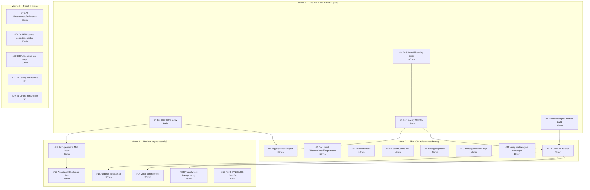

# Superb Pareto Execution Plan — 2026-07-26

> **Created:** 2026-07-26 20:10
> **Source:** `docs/status/2026-07-26_20-07_docs-health-and-update-old-docs-session.md`
> section f (50 items) + `TODO_LIST.md` (15 open items) + `ROADMAP.md` themes.
> **Total unique tasks:** 48 (deduplicated across all sources).

---

## Pareto Breakdown

### The 1% that delivers 51%

**Fix the 5 benchkit timing tests.** This single action makes `nix run .#verify`
GREEN end-to-end, which unblocks the v4.2.0 release (260 lines of unreleased
CHANGELOG), restores CI confidence, and makes the published module graph
trustworthy. Every release-related task is downstream of a green gate.

### The 4% that delivers 64%

| # | Task | Impact |
|---|------|--------|
| 1 | Fix 5 benchkit timing tests (RaceEnabled thresholds) | Makes #verify GREEN → unblocks releases |
| 2 | Fix ADR-0069 index gap | Eliminates ghost reference misleading every ADR reader |
| 3 | Fix benchkit per-module build (stale storage/pebble tag) | Fixes broken published module reference |
| 4 | Tag metaengine/projectionadapter/v4.0.0 | 57/58 → 58/58 modules tagged — complete module graph |

### The 20% that delivers 80%

All Tier-1 + Tier-2 tasks below (items 1–18 in the Phase-1 table).

### The other 20% (to reach 100%)

All Tier-3 + Tier-4 tasks below (items 19–48 in the Phase-2/3 table). These are
polish, deeper testing, documentation, and future architecture work.

---

## Phase 1: Comprehensive Task Plan (30–100min tasks)

> Sorted by impact (P0 highest), then effort within impact tier.
> `Phase` = execution wave (1 = do first, 4 = do last).
> All effort estimates include verification time.

| # | Phase | Task | Impact | Effort | Source |
|---|-------|------|--------|--------|--------|
| 1 | 1 | **Fix ADR-0069 index gap** — add row to docs/README.md + docs/adr/README.md | P0 Critical | 5min | Status d.1 |
| 2 | 1 | **Fix 5 benchkit timing tests** — add `testutil.RaceEnabled` thresholds to TestRunSoak_Memory, TestRunSoak_TrendsPopulated, TestWriteSoakJSON_RoundTrip, TestSnapshotPhase_SQLite, TestRun_AnalyticalJournalScans | P0 Critical | 60min | TODO_LIST |
| 3 | 1 | **Run `nix run .#verify` GREEN end-to-end** — confirm after #2, fix any remaining red | P0 Critical | 15min | TODO_LIST |
| 4 | 1 | **Fix benchkit per-module build** — re-tag storage/pebble or update benchkit go.mod to reference renamed Snapshot fields | P0 Critical | 30min | TODO_LIST |
| 5 | 2 | **Tag metaengine/projectionadapter/v4.0.0** — remove local replace directive, pin metaengine/v4.1.1, tag via tag-release.sh | P1 High | 30min | TODO_LIST |
| 6 | 2 | **Document `otel.WithoutGlobalRegistration()`** — add to AGENTS.md OTel section + skill references/core.md | P1 High | 15min | TODO_LIST |
| 7 | 2 | **Fix `#vulncheck` nix app** — change stdin to `./...` patterns | P1 High | 10min | TODO_LIST |
| 8 | 2 | **Fix dead Codec test code** — replace soak_test.go:283 dead branch with dedicated TestConfig_CodecRoundTrip | P1 High | 15min | TODO_LIST |
| 9 | 2 | **Real gocognit fix** — extract `assertMessageRow` helper from TestSinkUpsert | P1 High | 20min | TODO_LIST |
| 10 | 2 | **Investigate v4.0.4 tag-at-commit** — verify codec/event/watermill v4.0.4 tree content | P1 High | 15min | TODO_LIST |
| 11 | 2 | **Verify metaengine coverage** — run `go test -cover`, update FEATURES.md if drifted | P1 High | 10min | Status d.3 |
| 12 | 2 | **Cut v4.2.0 release** — flush [Unreleased] CHANGELOG, tag all modules, push | P1 High | 45min | Status f.17 |
| 13 | 3 | **Property test for idempotency.Store** — rapid-based Record/Seen/CheckAndRecord across memory/kv/sql | P2 Medium | 45min | TODO_LIST |
| 14 | 3 | **Move 3-way contract test to integration/** — relocate from idempotency/kvstore | P2 Medium | 30min | TODO_LIST |
| 15 | 3 | **Audit tag-release.sh** — pipefail traps, --dry-run mode, single-module scoping | P2 Medium | 30min | TODO_LIST |
| 16 | 3 | **Annotate remaining ~10 historical files** — stale openings without resolution notes | P2 Medium | 45min | Status c.1 |
| 17 | 3 | **Auto-generate ADR index** — script from docs/adr/ filenames + frontmatter | P2 Medium | 45min | Status e.1 |
| 18 | 3 | **Update CHANGELOG "56" → "58"** — README rewrite entry has stale module count | P2 Medium | 5min | Status f.22 |
| 19 | 4 | **Recurring lint-sweep** — gate daemon commits behind `nix fmt` or scheduled sweep | P3 Low | 20min | TODO_LIST |
| 20 | 4 | **Triage daemon commit messages** — revisit "leave as-is" decision | P3 Low | 15min | TODO_LIST |
| 21 | 4 | **nix fmt scoped invocation guidance** — add to AGENTS.md | P3 Low | 10min | Status f.42 |
| 22 | 4 | **Run `#check-layers`** — dependency budget verification | P3 Low | 5min | Status f.50 |
| 23 | 4 | **Run `#check-arch` / `#check-isolation`** — architecture/isolation checks | P3 Low | 10min | Status f.47 |
| 24 | 4 | **Hand-edit 2 HTML dashboards** — PARETO-EXECUTION-STATUS.html, cqrs-ecosystem-audit.html | P3 Low | 30min | Status c.2 |
| 25 | 4 | **Document 75→72 clone reduction** — which groups extracted, which accepted | P3 Low | 15min | Status f.48 |
| 26 | 4 | **storage/internal/errwrap audit** — evaluate shared error-wrap package (likely decline) | P3 Low | 15min | Status f.49 |
| 27 | 4 | **Investigate dependabot alert** `security/dependabot/10` | P3 Low | 15min | Status f.28 |
| 28 | 4 | **Fix release-fix doc location** — move docs/release-fix-2026-07-25.md → docs/status/ | P3 Low | 5min | Status f.23 |
| 29 | 4 | **Annotate SKILL-RESTRUCTURE-BRUTAL report** — stale open items | P3 Low | 10min | Status f.21 |
| 30 | 4 | **Concurrent FoldUpdate + ExecuteTyped test** — `-race`, ADR-0067 coverage | P3 Low | 30min | Status f.30 |
| 31 | 4 | **Non-struct FoldUpdate test on SQLite** — cross-engine meta-test gap | P3 Low | 20min | Status f.29 |
| 32 | 4 | **Cursor round-trip test** for non-numeric keys | P3 Low | 20min | Status f.31 |
| 33 | 4 | **LogTail/GraphNeighbors cross-engine test** — both return []any, untested | P3 Low | 20min | Status f.32 |
| 34 | 4 | **Promote wrapInfraOrOK** to storage/sql, signing, codec (remaining modules) | P3 Low | 45min | Status f.33 |
| 35 | 4 | **spannedRead helper in pebble** — 4+ clone groups remain | P3 Low | 30min | Status f.35 |
| 36 | 4 | **filterDetectors extraction** in cqrs-lint — shared by multiple rules | P3 Low | 20min | Status f.36 |
| 37 | 4 | **Stack preset stackpreset builder** — parallel boilerplate across presets | P3 Low | 45min | Status f.37 |
| 38 | 4 | **Test infra helpers** — eventtest.NewTestStreamID, catalogtest, storagetest, codectest | P3 Low | 45min | Status f.38 |
| 39 | 4 | **art-dupl CI gate** — golden file + fail-on-new-groups | P3 Low | 45min | Status f.34 |
| 40 | 4 | **Split slow/fast test suites** — `testing.Short()` for benchkit soak in #verify | P3 Low | 30min | Status f.46 |
| 41 | 4 | **Parallel verify** — run independent module tests concurrently | P3 Low | 45min | Status f.47 |
| 42 | 4 | **Soak test metaengine SQLite** — multi-hour load test | P3 Low | 60min+ | Status f.39 |
| 43 | 4 | **cqrs-bench workload for metaengine** — end-to-end Apply → ExecuteTyped | P3 Low | 45min | Status f.40 |
| 44 | 4 | **Merge/rebase branch c9ccdd6e** — overlapping changes | P3 Low | 15min | Status f.41 |
| 45 | 4 | **Audit accepted clone groups** — verify 72 groups genuinely acceptable | P3 Low | 30min | Status f.42 |
| 46 | 4 | **--semantic -t 3 art-dupl run** — deeper duplication surface | P3 Low | 20min | Status f.43 |
| 47 | 4 | **Write TestTagContentMatchesChangelog** meta-test | P3 Low | 30min | Status f.27 |
| 48 | 4 | **Turso sync 4-way deep look** — accepted but may benefit from extraction | P3 Low | 30min | Status f.44 |

**Total estimated effort:** ~20 hours (Phase 1: 4h, Phase 2: 3h, Phase 3: 4h, Phase 4: 9h)

---

## Phase 2: Subtask Breakdown (≤12min each)

> Each Phase-1 task broken into concrete steps. Sorted by execution order.

### Wave 1 — The 1% + 4% (do these FIRST)

| Sub | Parent | Step | Effort |
|-----|--------|------|--------|
| 1.1 | #1 | Open docs/README.md, find the ADR table, add ADR-0069 row after 0068 | 2min |
| 1.2 | #1 | Open docs/adr/README.md, add ADR-0069 row after 0068 | 2min |
| 1.3 | #1 | Verify both tables now list 67 ADRs (0069 included) | 1min |
| 2.1 | #2 | Read benchkit/race_on.go + race_off.go to confirm the pattern exists | 2min |
| 2.2 | #2 | Read TestRunSoak_Memory — find the timing threshold assertion | 5min |
| 2.3 | #2 | Wrap threshold with `if benchkit.RaceEnabled { threshold = relaxed }` | 3min |
| 2.4 | #2 | Read TestRunSoak_TrendsPopulated — find threshold, apply same pattern | 5min |
| 2.5 | #2 | Read TestWriteSoakJSON_RoundTrip — find threshold, apply same pattern | 5min |
| 2.6 | #2 | Read TestSnapshotPhase_SQLite — investigate SnapshotColdLatency.Count=0 | 8min |
| 2.7 | #2 | Read TestRun_AnalyticalJournalScans — investigate 30s timeout | 8min |
| 2.8 | #2 | Run each test in isolation with `-race -count=1` to confirm pass | 5min |
| 2.9 | #2 | Run all 5 together with `-race -count=3` to confirm no flake | 5min |
| 3.1 | #3 | Run `nix run .#verify` end-to-end, capture output | 10min |
| 3.2 | #3 | If red: triage by module, fix or document as known-flaky | 5min |
| 4.1 | #4 | Read benchkit go.mod — find the storage/pebble/v4.0.3 reference | 3min |
| 4.2 | #4 | Check what storage/pebble/v4.0.3 exports vs what benchkit expects | 5min |
| 4.3 | #4 | Decision: re-tag storage/pebble or update benchkit go.mod to v4.0.4 | 2min |
| 4.4 | #4 | Apply fix: either `git tag` or edit go.mod + `go mod tidy` | 5min |
| 4.5 | #4 | Run `cd benchkit && GOWORK=off go build ./...` to confirm | 5min |
| 4.6 | #4 | Run `cd benchkit && GOWORK=off go test -count=1 ./...` | 5min |

### Wave 2 — The 20% (P1 high-impact)

| Sub | Parent | Step | Effort |
|-----|--------|------|--------|
| 5.1 | #5 | Read metaengine/projectionadapter/go.mod replace block | 2min |
| 5.2 | #5 | Remove replace directives, change metaengine require to v4.1.1 | 3min |
| 5.3 | #5 | Run `cd metaengine/projectionadapter && GOWORK=off go mod tidy` | 3min |
| 5.4 | #5 | Run `GOWORK=off go build ./... && go test -count=1 ./...` | 5min |
| 5.5 | #5 | Run `./scripts/tag-release.sh metaengine/projectionadapter v4.0.0 "..."` | 5min |
| 5.6 | #5 | Verify tag resolves: `GOWORK=off go mod download` from a temp dir | 5min |
| 6.1 | #6 | Read otel/setup.go WithoutGlobalRegistration() — understand the API | 3min |
| 6.2 | #6 | Write AGENTS.md OTel section addition (2-3 lines + code example) | 5min |
| 6.3 | #6 | Write skill references/core.md addition | 5min |
| 6.4 | #6 | Run doc-check on both files | 2min |
| 7.1 | #7 | Read flake.nix vulncheck app definition | 3min |
| 7.2 | #7 | Change govulncheck invocation from stdin to `./...` patterns | 3min |
| 7.3 | #7 | Run `nix run .#vulncheck` on one module to confirm | 5min |
| 8.1 | #8 | Read benchkit/soak_test.go:283 — identify dead Codec branch | 3min |
| 8.2 | #8 | Write dedicated TestConfig_CodecRoundTrip test | 8min |
| 8.3 | #8 | Remove dead branch from soak_test.go | 2min |
| 8.4 | #8 | Run `go test -count=1 -race ./...` in benchkit | 3min |
| 9.1 | #9 | Read TestSinkUpsert — find the high-complexity section | 3min |
| 9.2 | #9 | Design `assertMessageRow` helper signature | 3min |
| 9.3 | #9 | Extract helper, replace inline assertions | 8min |
| 9.4 | #9 | Remove `//nolint:gocognit`, run lint to confirm | 3min |
| 10.1 | #10 | `git diff 8285da41 dbddbed6 -- codec/ event/ watermill/` | 5min |
| 10.2 | #10 | Check if the tagged tree has the intended release content | 5min |
| 10.3 | #10 | Document finding in TODO_LIST (retag or accept) | 5min |
| 11.1 | #11 | Run `cd metaengine && go test -cover ./...` | 5min |
| 11.2 | #11 | Compare output to FEATURES.md "87.7%" claim | 3min |
| 11.3 | #11 | Update FEATURES.md if drifted | 2min |
| 12.1 | #12 | Verify #verify is GREEN (prerequisite) | 2min |
| 12.2 | #12 | Decide version: v4.2.0 (new features) vs v4.1.1 (patch) | 3min |
| 12.3 | #12 | Run `./scripts/tag-release.sh` for all 58 modules | 10min |
| 12.4 | #12 | Update CHANGELOG: move [Unreleased] → [v4.2.0] with date | 5min |
| 12.5 | #12 | Run doc-check + api-stability golden regen | 5min |
| 12.6 | #12 | `git push origin --tags` (requires user approval) | 5min |

### Wave 3 — Medium impact (P2)

| Sub | Parent | Step | Effort |
|-----|--------|------|--------|
| 13.1 | #13 | Design property test: which invariants to check (no-op on existing, TTL expiry, CheckAndRecord atomicity) | 8min |
| 13.2 | #13 | Write rapid-based state machine test | 12min |
| 13.3 | #13 | Run against all 3 impls (memory, kv, sql) | 5min |
| 14.1 | #14 | Read idempotency/kvstore contract test (the 3-way test) | 5min |
| 14.2 | #14 | Create integration/idempotency_contract_test.go | 8min |
| 14.3 | #14 | Remove from kvstore, update go.mod deps | 5min |
| 14.4 | #14 | Run both modules' tests to confirm | 5min |
| 15.1 | #15 | Read scripts/tag-release.sh end-to-end | 8min |
| 15.2 | #15 | Identify pipefail traps (grep -P, set -e interactions) | 5min |
| 15.3 | #15 | Add --dry-run flag | 8min |
| 15.4 | #15 | Add --module flag for single-module tagging | 8min |
| 16.1 | #16 | Read each of the ~10 unannotated files' openings (batch) | 12min |
| 16.2 | #16 | Classify each: ANNOTATE / SKIP / LEAVE ALONE | 5min |
| 16.3 | #16 | Write Resolution sections for ANNOTATE files | 12min |
| 16.4 | #16 | Verify no annotation is generic (passes "so what?" test) | 5min |
| 17.1 | #17 | Design ADR frontmatter schema (Status, Date, Title) | 8min |
| 17.2 | #17 | Write `scripts/gen-adr-index.sh` (or .go) reading docs/adr/0*.md | 12min |
| 17.3 | #17 | Add frontmatter to ADRs missing it (batch) | 12min |
| 17.4 | #17 | Generate index, diff against hand-maintained tables | 5min |
| 17.5 | #17 | Wire into #verify or pre-commit | 8min |
| 18.1 | #18 | Find the "56" reference in CHANGELOG.md README rewrite entry | 2min |
| 18.2 | #18 | Fix to "58" | 1min |

### Wave 4 — Lower impact (P3 polish)

| Sub | Parent | Step | Effort |
|-----|--------|------|--------|
| 19.1 | #19 | Design lint-sweep approach (pre-commit hook vs scheduled CI) | 8min |
| 19.2 | #19 | Implement `nix fmt` gate or scheduled sweep | 12min |
| 20.1 | #20 | Sample 20 recent daemon commits, assess readability | 8min |
| 20.2 | #20 | Write recommendation (fix daemon vs accept vs filter) | 8min |
| 21.1 | #21 | Add "Scoped nix fmt" section to AGENTS.md | 8min |
| 22.1 | #22 | Run `nix run .#check-layers`, capture output | 5min |
| 23.1 | #23 | Run `nix run .#check-arch` and `#check-isolation` | 10min |
| 24.1 | #24 | Read PARETO-EXECUTION-STATUS.html structure | 5min |
| 24.2 | #24 | Hand-edit stale hero section (inline, not banner) | 12min |
| 24.3 | #24 | Read cqrs-ecosystem-audit-status.html, same process | 12min |
| 25.1 | #25 | Cross-reference art-dupl reports (75→72), document each group | 12min |
| 26.1 | #26 | Evaluate storage/internal/errwrap tradeoff vs ADR-0069 decision | 12min |
| 27.1 | #27 | Read dependabot alert security/dependabot/10 | 8min |
| 27.2 | #27 | Fix or document as accepted risk | 8min |
| 28.1 | #28 | `git mv docs/release-fix-2026-07-25.md docs/status/` | 2min |
| 28.2 | #28 | Update any references to the old path | 3min |
| 29.1 | #29 | Read SKILL-RESTRUCTURE-BRUTAL report, identify stale claims | 5min |
| 29.2 | #29 | Write Resolution section | 5min |
| 30.1 | #30 | Write concurrent FoldUpdate + ExecuteTyped test with -race | 12min |
| 31.1 | #31 | Write non-struct FoldUpdate test on SQLite | 12min |
| 32.1 | #32 | Write cursor round-trip test with string/time keys | 12min |
| 33.1 | #33 | Write LogTail/GraphNeighbors cross-engine test | 12min |
| 34.1 | #34 | Identify modules with wrapInfraOrOK candidates (art-dupl groups) | 12min |
| 34.2 | #34 | Extract helpers per-module (ADR-0069 pattern) | 12min |
| 35.1 | #35 | Identify pebble spannedRead clone groups | 8min |
| 35.2 | #35 | Extract spannedRead(ctx, name, fn) helper | 12min |
| 36.1 | #36 | Identify filterDetectors duplication in cqrs-lint | 8min |
| 36.2 | #36 | Extract shared helper | 12min |
| 37.1 | #37 | Identify stack preset parallel boilerplate | 12min |
| 37.2 | #37 | Design stackpreset builder | 12min |
| 38.1 | #38 | Identify test infra duplication across modules | 12min |
| 38.2 | #38 | Extract eventtest/catalogtest/storagetest/codectest helpers | 12min |
| 39.1 | #39 | Design art-dupl CI gate (golden file approach) | 12min |
| 39.2 | #39 | Implement gate + exclusion file | 12min |
| 40.1 | #40 | Add `testing.Short()` skips to benchkit soak tests | 12min |
| 40.2 | #40 | Verify `#verify -short` runs fast | 5min |
| 41.1 | #41 | Evaluate parallelization options for #verify | 12min |
| 42.1 | #42 | Write metaengine SQLite soak test (long-running, tagged) | 12min |
| 43.1 | #43 | Design cqrs-bench metaengine workload profile | 12min |
| 44.1 | #44 | Check if branch c9ccdd6e still exists, assess overlap | 8min |
| 44.2 | #44 | Merge or document as superseded | 8min |
| 45.1 | #45 | Run art-dupl, audit each of 72 accepted groups | 12min |
| 46.1 | #46 | Run `art-dupl --semantic -t 3`, triage new groups | 12min |
| 47.1 | #47 | Design TestTagContentMatchesChangelog meta-test | 12min |
| 47.2 | #47 | Implement + verify | 12min |
| 48.1 | #48 | Deep-dive turso sync 4-way clone, assess extraction | 12min |

---

## Execution Graph

---

## What NOT to do (Verschlimmbesserung prevention)

- **Do NOT retag v4.0.4 without verifying tree content first** (#10). Both
  candidate commits share the same message. Blind retagging could move the tag
  to a WORSE commit.
- **Do NOT batch-annotate historical files with a script** (#16). The skill
  explicitly warns against this — each annotation must be hand-crafted and
  pass the "so what?" test.
- **Do NOT force-push tags** (#12). Use `--force-with-lease` ONLY if retagging
  is confirmed necessary AND user approves.
- **Do NOT auto-generate ADR frontmatter with sed** (#17). Read each ADR,
  write frontmatter by hand, then generate.
- **Do NOT split test suites without measuring impact first** (#40). A
  `testing.Short()` skip that hides real failures is worse than a slow gate.
- **Do NOT extract shared error-wrapping into a cross-module package** (#26).
  ADR-0069 explicitly decided per-module helpers. `storage/internal/errwrap`
  would violate multi-module isolation.

---

## Dependencies and blocking relationships

| Task | Blocked by | Blocks |
|------|-----------|--------|
| #3 (verify GREEN) | #2 (benchkit tests) | #12 (v4.2.0 release) |
| #4 (benchkit build) | nothing | #12 (v4.2.0 release) |
| #5 (projectionadapter tag) | #1 (ADR-0069 — no, independent) | nothing (completes 58/58) |
| #12 (v4.2.0) | #2, #3, #4 | nothing (but flushes CHANGELOG) |
| #17 (ADR index gen) | nothing | #1 becomes obsolete (automated) |
| #14 (move contract test) | nothing | nothing (smell fix) |
