# Post-Audit Pareto Execution Plan

> **Date:** 2026-07-27 21:17 CEST
> **Source:** Self-review from `docs/status/2026-07-27_21-14_docs-health-and-update-old-docs-audit-session.md`
> + current `TODO_LIST.md` (16 open items) + `ROADMAP.md` raw ideas
> **Total unique tasks:** 47 (deduplicated from 16 TODO_LIST + 50 self-review + 19 unannotated reports)
> **Status:** PLANNING — awaiting approval before execution

---

## Pareto Breakdown

### The 1% that delivers 51% of the result

Three tasks. If you do NOTHING else, do these. They establish truth, fix
consumer-facing lies, and undo the one inaccuracy I introduced this session.

| #   | Task                                | Why it's the 1%                                                                                       | Effort |
| --- | ----------------------------------- | ----------------------------------------------------------------------------------------------------- | ------ |
| P01 | Run `nix run .#verify` end-to-end   | Without this, EVERY doc claim in this session is unverified. The #1 fuckup I flagged.                 | 5 min  |
| P02 | Fix cqrs-lint README (C015/C016/D006) | 3 shipped rules are invisible to consumers. 5-min fix, consumer-facing credibility.                 | 5 min  |
| P03 | Fix or revert source-snippet count  | I changed "34 of 60" → "37 of 65" based on a file-count grep, not detector verification.              | 10 min |

### The 4% that delivers 64% of the result

Four tasks. High leverage, small effort. Security, consumer trust, and truth.

| #   | Task                                    | Why it's the 4%                                                                | Effort |
| --- | --------------------------------------- | ------------------------------------------------------------------------------ | ------ |
| P04 | Run `nix run .#vulncheck`               | Post-release vulnerability scan. Never run. v4.2.0 shipped without it.         | 5 min  |
| P05 | Verify v4.2.0 tags resolve (clean module) | If broken, NO consumer can `go get` any module.                               | 5 min  |
| P06 | Run cqrs-lint against real codebase     | C015/C016/D006 shipped with zero real-world testing. D006 could spew hundreds. | 10 min |
| P07 | Audit README.md (root)                  | Most consumer-facing doc. Prior session flagged "56" instead of "58".          | 15 min |

### The 20% that delivers 80% of the result

Eight tasks. Important completeness across living docs, code quality, and CI.

| #   | Task                                        | Why it matters                                                        | Effort  |
| --- | ------------------------------------------- | --------------------------------------------------------------------- | ------- |
| P08 | Audit DOMAIN_LANGUAGE.md + CONTRIBUTING.md  | Living docs never checked. May have stale 5-family or gate references | 20 min  |
| P09 | Re-verify coverage numbers (FEATURES.md)    | Metaengine 86.2%, benchkit 88 tests — trusted from prior reports      | 15 min  |
| P10 | Consolidate remaining 5 wrapClosed sites    | checkpoint.go (2) + store_load.go (3). Same proven pattern.           | 30 min  |
| P11 | Add SortedMap cross-engine parity test      | TODO said 4 ADTs; only 2 covered. Completeness gap.                   | 30 min  |
| P12 | Second-pass annotate 5 most-stale reports   | Opening claims actively mislead readers                               | 30 min  |
| P13 | Update AGENTS.md with dedup helper patterns | withWriteLock, parallelTimeoutCtx, etc — undocumented                 | 20 min  |
| P14 | Verify CI workflow (ci.yml gate list)       | TODO_LIST claims 11 gates; never opened the YAML                      | 10 min  |
| P15 | Update codec/README + check recipes/SKILL   | TranscodeToJSON shipped but README not updated                        | 15 min  |

### The remaining 20% to reach 100%

Everything else. Important for polish, completeness, and long-term health, but
not blocking consumers or truth.

| #   | Task                                        | Category             | Effort  |
| --- | ------------------------------------------- | -------------------- | ------- |
| P16 | Annotate remaining 14 old reports (batch 2) | Old docs             | 45 min  |
| P17 | Art-dupl --structural pass                  | Code quality         | 15 min  |
| P18 | Art-dupl --type-aware run                   | Code quality         | 15 min  |
| P19 | Audit accepted 19 clone groups              | Code quality         | 20 min  |
| P20 | Wire #verify-parallel into CI               | CI                   | 30 min  |
| P21 | Add #verify-fast pre-merge gate             | CI                   | 20 min  |
| P22 | Gate daemon commits behind nix fmt         | CI                   | 30 min  |
| P23 | Investigate dependabot alert               | Security             | 10 min  |
| P24 | Publish go-finding + go-must               | Release              | 20 min  |
| P25 | Consolidate CHANGELOG [v4.2.0] (if approved)| Docs                 | 20 min  |
| P26 | Write docs/performance.md                  | Docs                 | 60 min  |
| P27 | Document WithoutGlobalRegistration         | Docs                 | 10 min  |
| P28 | Idempotency property tests (all 3 impls)    | Testing              | 30 min  |
| P29 | Metaengine soak + cursor round-trip tests   | Testing              | 30 min  |
| P30 | CLI tests for cqrs-bench                   | Testing              | 30 min  |
| P31 | Verify api-stability modules list           | Module health        | 10 min  |
| P32 | Run check-layers + check-arch              | Module health        | 10 min  |
| P33 | Verify check-modules script (parent flaw)  | Module health        | 15 min  |
| P34 | Create TestFeatureCountMatchesRegister     | Release hygiene      | 20 min  |
| P35 | Document "stale GREEN" anti-pattern        | Release hygiene      | 15 min  |
| P36 | Verify docs/README.md links (orphans)      | Docs                 | 10 min  |
| P37 | Verify docs/SPAN_NAMING.md completeness    | Docs                 | 10 min  |
| P38 | Add benchmark for TranscodeToJSON          | Consumer experience  | 30 min  |
| P39 | Verify all module READMEs current          | Consumer experience  | 30 min  |
| P40 | Check recipes.md + SKILL.md for CBORToJSON | Consumer experience  | 10 min  |

**Blocked (need user decision):**

| #   | Task                                        | Blocker                                                     |
| --- | ------------------------------------------- | ----------------------------------------------------------- |
| B01 | Consolidate CHANGELOG [v4.2.0]              | Q1: append-only vs readability (released today)             |
| B02 | Revert vs verify source-snippet count       | Q2: leave estimate, soften claim, or verify precisely       |
| B03 | Second annotation pass completeness         | Q3: is 5 of 24 sufficient, or read all 19 individually?      |

---

## Step 2: Medium-Granularity Plan (27 tasks, 30-100 min each)

Sorted by impact × urgency ÷ effort.

| ID  | Task                                                       | Pareto | Impact | Effort   | Depends on |
| --- | ---------------------------------------------------------- | ------ | ------ | -------- | ---------- |
| M01 | Establish truth: run verify + vulncheck + tag resolution   | 1%+4%  | 10     | 20 min   | —          |
| M02 | Fix consumer-facing accuracy: cqrs-lint README + snippet   | 1%     | 9      | 15 min   | M01        |
| M03 | Test cqrs-lint rules against real codebase                 | 4%     | 8      | 15 min   | M01        |
| M04 | Audit remaining living docs (README, DOMAIN_LANG, CONTRIB) | 20%    | 7      | 30 min   | M01        |
| M05 | Re-verify coverage numbers in FEATURES.md                  | 20%    | 6      | 20 min   | M01        |
| M06 | Consolidate remaining 5 wrapClosed sites                   | 20%    | 6      | 30 min   | —          |
| M07 | Add SortedMap cross-engine parity test                     | 20%    | 5      | 30 min   | —          |
| M08 | Annotate batch 1: 5 most-stale old reports                 | 20%    | 5      | 30 min   | —          |
| M09 | Update AGENTS.md with dedup helper patterns                | 20%    | 5      | 20 min   | —          |
| M10 | Verify CI workflow + docs/README links + SPAN_NAMING       | 20%    | 4      | 30 min   | M01        |
| M11 | Update codec/README + recipes/SKILL for TranscodeToJSON    | 20%    | 4      | 20 min   | —          |
| M12 | Annotate batch 2: remaining 14 old reports                 | rem    | 3      | 45 min   | M08        |
| M13 | Art-dupl advanced passes (structural + type-aware + audit) | rem    | 4      | 45 min   | —          |
| M14 | CI improvements (verify-parallel, verify-fast, daemon gate)| rem    | 5      | 60 min   | M10        |
| M15 | Module health checks (api-stability, layers, arch)         | rem    | 4      | 30 min   | M01        |
| M16 | Idempotency property tests (all 3 impls)                   | rem    | 3      | 30 min   | —          |
| M17 | Metaengine soak + cursor round-trip tests                  | rem    | 3      | 30 min   | —          |
| M18 | CLI tests for cqrs-bench                                   | rem    | 3      | 30 min   | —          |
| M19 | Publish go-finding + go-must as tagged modules             | rem    | 4      | 20 min   | —          |
| M20 | Investigate dependabot alert                               | rem    | 3      | 10 min   | —          |
| M21 | Create TestFeatureCountMatchesRegister meta-test           | rem    | 4      | 20 min   | —          |
| M22 | Document "stale GREEN" anti-pattern in CONTRIBUTING        | rem    | 3      | 15 min   | —          |
| M23 | Document WithoutGlobalRegistration in AGENTS.md            | rem    | 2      | 10 min   | —          |
| M24 | Write docs/performance.md (stretch)                        | rem    | 2      | 60 min   | —          |
| M25 | Add benchmark for TranscodeToJSON                          | rem    | 2      | 30 min   | —          |
| M26 | Verify all module READMEs current                          | rem    | 2      | 30 min   | —          |
| M27 | Final verify gate + status report                          | all    | 10     | 15 min   | M01-M26    |

**Total estimated effort:** ~11.5 hours

---

## Step 3: Fine-Granularity Breakdown (max 12 min each)

Every medium task decomposed into subtasks that fit in a single focused sprint.

### M01: Establish truth (4 subtasks)

| ID    | Subtask                                           | Effort |
| ----- | ------------------------------------------------- | ------ |
| M01a  | Run `nix run .#verify` and capture output         | 5 min  |
| M01b  | If verify fails: diagnose and fix the failure     | 10 min |
| M01c  | Run `nix run .#vulncheck` and capture output      | 5 min  |
| M01d  | `go mod init test && go get ...@v4.2.0` in /tmp   | 5 min  |

### M02: Fix consumer-facing accuracy (3 subtasks)

| ID    | Subtask                                           | Effort |
| ----- | ------------------------------------------------- | ------ |
| M02a  | Add C015/C016/D006 to cmd/cqrs-lint/README.md     | 10 min |
| M02b  | Decide snippet count: verify or soften claim      | 10 min |
| M02c  | Run doc-check on README + FEATURES to verify      | 5 min  |

### M03: Test cqrs-lint rules (3 subtasks)

| ID    | Subtask                                           | Effort |
| ----- | ------------------------------------------------- | ------ |
| M03a  | Run `cd cmd/cqrs-lint && go run . ../../...`       | 5 min  |
| M03b  | Review C015/C016 findings for false positives     | 10 min |
| M03c  | Review D006 findings; tighten if spewing noise    | 10 min |

### M04: Audit remaining living docs (5 subtasks)

| ID    | Subtask                                           | Effort |
| ----- | ------------------------------------------------- | ------ |
| M04a  | Read + fix README.md (module counts, tables)      | 10 min |
| M04b  | Read + fix docs/DOMAIN_LANGUAGE.md (6-family)     | 10 min |
| M04c  | Read + fix CONTRIBUTING.md (quality gates)        | 10 min |
| M04d  | Cross-check all living docs for consistency       | 5 min  |
| M04e  | Run doc-check on all modified docs                | 5 min  |

### M05: Re-verify coverage numbers (3 subtasks)

| ID    | Subtask                                           | Effort |
| ----- | ------------------------------------------------- | ------ |
| M05a  | Run coverage on metaengine, benchkit, kv, codec   | 10 min |
| M05b  | Compare against FEATURES.md claims                | 5 min  |
| M05c  | Fix any drift in FEATURES.md                      | 5 min  |

### M06: Consolidate wrapClosed (4 subtasks)

| ID    | Subtask                                           | Effort |
| ----- | ------------------------------------------------- | ------ |
| M06a  | Convert checkpoint.go (2 sites, wrapClosedf)      | 10 min |
| M06b  | Convert store_load.go (3 sites, mixed)            | 10 min |
| M06c  | Run tests on storage/memory                       | 5 min  |
| M06d  | Re-run art-dupl to verify group count dropped     | 5 min  |

### M07: SortedMap parity test (3 subtasks)

| ID    | Subtask                                           | Effort |
| ----- | ------------------------------------------------- | ------ |
| M07a  | Study how SortedMap routes through MapBackend     | 5 min  |
| M07b  | Write SortedMap parity test in cross_engine_adt   | 10 min |
| M07c  | Run test with -race                               | 5 min  |

### M08: Annotate batch 1 (5 subtasks)

| ID    | Subtask                                           | Effort |
| ----- | ------------------------------------------------- | ------ |
| M08a  | Read + annotate 2026-07-25_04-08_benchkit-open    | 5 min  |
| M08b  | Read + annotate 2026-07-25_13-50_BENCHKIT-M14     | 5 min  |
| M08c  | Read + annotate 2026-07-25_14-19_72h-diff         | 5 min  |
| M08d  | Read + annotate 2026-07-25_17-32_brutal-self      | 5 min  |
| M08e  | Read + annotate 2026-07-26_10-17_dedup-session    | 5 min  |

### M09: Update AGENTS.md dedup patterns (3 subtasks)

| ID    | Subtask                                           | Effort |
| ----- | ------------------------------------------------- | ------ |
| M09a  | Document withWriteLock/withReadLock pattern       | 5 min  |
| M09b  | Document parallelTimeoutCtx/parallelViewStore     | 5 min  |
| M09c  | Document variadic NewTestRegistry pattern         | 5 min  |

### M10: Verify CI + docs links (5 subtasks)

| ID    | Subtask                                           | Effort |
| ----- | ------------------------------------------------- | ------ |
| M10a  | Read .github/workflows/ci.yml, list actual gates  | 5 min  |
| M10b  | Compare against TODO_LIST claim (11 gates)        | 5 min  |
| M10c  | Check docs/README.md links testing-guide etc     | 5 min  |
| M10d  | Check docs/SPAN_NAMING.md completeness           | 5 min  |
| M10e  | Fix any discrepancies                            | 5 min  |

### M11: Update codec/README + recipes (3 subtasks)

| ID    | Subtask                                           | Effort |
| ----- | ------------------------------------------------- | ------ |
| M11a  | Add TranscodeToJSON section to codec/README.md    | 5 min  |
| M11b  | Check recipes.md for CBORToJSONTransform          | 5 min  |
| M11c  | Check SKILL.md core.md for CBORToJSONTransform    | 5 min  |

### M12: Annotate batch 2 (7 subtasks)

| ID    | Subtask                                           | Effort |
| ----- | ------------------------------------------------- | ------ |
| M12a  | Read + annotate 2026-07-25_04-08_PARETO-COMPL    | 5 min  |
| M12b  | Read + annotate 2026-07-25_14-30_benchkit-foll    | 5 min  |
| M12c  | Read + annotate 2026-07-25_14-37_session-review   | 5 min  |
| M12d  | Read + annotate 2026-07-25_15-15_verify-green     | 5 min  |
| M12e  | Read + annotate 2026-07-25_19-00_self-review      | 5 min  |
| M12f  | Read + annotate 2026-07-25_19-35_self-review      | 5 min  |
| M12g  | Read + assess remaining 7 files (skip or annotate)| 10 min |

### M13: Art-dupl advanced (3 subtasks)

| ID    | Subtask                                           | Effort |
| ----- | ------------------------------------------------- | ------ |
| M13a  | Run art-dupl --structural -t 5, review output     | 10 min |
| M13b  | Run art-dupl --type-aware -t 2, review output     | 10 min |
| M13c  | Audit 19 accepted groups for false acceptance     | 10 min |

### M14: CI improvements (5 subtasks)

| ID    | Subtask                                           | Effort |
| ----- | ------------------------------------------------- | ------ |
| M14a  | Wire #verify-parallel into ci.yml                 | 10 min |
| M14b  | Add #verify-fast as pre-merge step               | 10 min |
| M14c  | Design daemon-commit gating strategy             | 10 min |
| M14d  | Implement daemon gate (hook or scheduled sweep)   | 10 min |
| M14e  | Test CI changes locally                          | 10 min |

### M15: Module health checks (3 subtasks)

| ID    | Subtask                                           | Effort |
| ----- | ------------------------------------------------- | ------ |
| M15a  | Run check-layers, check-arch, check-modules       | 10 min |
| M15b  | Verify api-stability includes idempotency/sqlstore| 5 min  |
| M15c  | Fix any issues found                              | 10 min |

### M16-M18: Testing improvements (9 subtasks)

| ID    | Subtask                                           | Effort |
| ----- | ------------------------------------------------- | ------ |
| M16a  | Write idempotency property test for KVStore       | 10 min |
| M16b  | Write idempotency property test for SQLiteStore   | 10 min |
| M16c  | Run all 3 impl property tests with -race         | 5 min  |
| M17a  | Write metaengine soak test (sustained writes)     | 10 min |
| M17b  | Write cursor round-trip test (string + time)      | 10 min |
| M17c  | Run new tests with -race                         | 5 min  |
| M18a  | Write CLI test: --skip-snapshot                  | 10 min |
| M18b  | Write CLI test: --soak --format json             | 10 min |
| M18c  | Write CLI test: compare --skip-journey           | 10 min |

### M19-M23: Release hygiene + docs (8 subtasks)

| ID    | Subtask                                           | Effort |
| ----- | ------------------------------------------------- | ------ |
| M19a  | Tag + publish go-finding v1.4.0                  | 10 min |
| M19b  | Tag + publish go-must v0.1.2                     | 10 min |
| M20a  | Investigate dependabot alert via gh api          | 10 min |
| M21a  | Write TestFeatureCountMatchesRegister meta-test  | 10 min |
| M21b  | Verify meta-test passes                          | 5 min  |
| M22a  | Write "stale GREEN" anti-pattern section         | 10 min |
| M23a  | Document WithoutGlobalRegistration in AGENTS.md   | 10 min |

### M24-M26: Stretch docs (6 subtasks)

| ID    | Subtask                                           | Effort |
| ----- | ------------------------------------------------- | ------ |
| M24a  | Gather benchmark numbers from prior reports       | 10 min |
| M24b  | Write docs/performance.md structure              | 10 min |
| M24c  | Fill in benchmark tables + analysis              | 10 min |
| M25a  | Write BenchmarkTranscodeToJSON test              | 10 min |
| M25b  | Run benchmark + record results                   | 5 min  |
| M26a  | Spot-check 5-10 module READMEs for staleness     | 10 min |

### M27: Final verification (3 subtasks)

| ID    | Subtask                                           | Effort |
| ----- | ------------------------------------------------- | ------ |
| M27a  | Run `nix run .#verify` final gate                 | 5 min  |
| M27b  | Run doc-check on all modified docs               | 5 min  |
| M27c  | Write completion status report                   | 10 min |

---

## Execution Graph

```mermaid
graph TD
    subgraph "1% — 51% of result"
        M01[M01: Establish truth<br/>verify + vulncheck + tags]
        M02[M02: Fix consumer accuracy<br/>cqrs-lint README + snippet]
    end

    subgraph "4% — 64% of result"
        M03[M03: Test cqrs-lint rules<br/>against real codebase]
        M04a[M04a: Audit README.md]
    end

    subgraph "20% — 80% of result"
        M04[M04: Audit living docs<br/>DOMAIN_LANG + CONTRIBUTING]
        M05[M05: Re-verify coverage]
        M06[M06: wrapClosed consolidation]
        M07[M07: SortedMap parity test]
        M08[M08: Annotate batch 1<br/>5 stale reports]
        M09[M09: AGENTS.md dedup patterns]
        M10[M10: Verify CI + doc links]
        M11[M11: codec/README + recipes]
    end

    subgraph "Remaining 20% to 100%"
        M12[M12: Annotate batch 2<br/>14 reports]
        M13[M13: Art-dupl advanced]
        M14[M14: CI improvements]
        M15[M15: Module health]
        M16[M16: Idempotency tests]
        M17[M17: Metaengine tests]
        M18[M18: CLI tests]
        M19[M19: Publish go-finding/go-must]
        M20[M20: Dependabot alert]
        M21[M21: FeatureCount meta-test]
        M22[M22: Stale GREEN docs]
        M23[M23: WithoutGlobalReg docs]
    end

    subgraph "Final gate"
        M27[M27: Final verify + report]
    end

    M01 --> M02
    M01 --> M03
    M01 --> M04
    M01 --> M05
    M01 --> M10
    M01 --> M15
    M02 --> M27
    M08 --> M12
    M10 --> M14
    M04 --> M27
    M06 --> M27
    M07 --> M27
    M11 --> M27
    M13 --> M27
    M14 --> M27
    M15 --> M27
    M16 --> M27
    M17 --> M27
    M18 --> M27
    M19 --> M27
    M21 --> M27
    M22 --> M27
    M23 --> M27
    M12 --> M27
    M20 --> M27
    M27 --> DONE[✅ ALL DONE]

    style M01 fill:#ff6b6b,color:#fff
    style M02 fill:#ff6b6b,color:#fff
    style M03 fill:#feca57,color:#333
    style M04a fill:#feca57,color:#333
    style M04 fill:#48dbfb,color:#333
    style M05 fill:#48dbfb,color:#333
    style M06 fill:#48dbfb,color:#333
    style M07 fill:#48dbfb,color:#333
    style M08 fill:#48dbfb,color:#333
    style M09 fill:#48dbfb,color:#333
    style M10 fill:#48dbfb,color:#333
    style M11 fill:#48dbfb,color:#333
    style M27 fill:#2ed573,color:#fff
    style DONE fill:#2ed573,color:#fff
```

---

## Blocked Items (need user decision)

| #   | Question                                                                                       | Options                                                                            |
| --- | ---------------------------------------------------------------------------------------------- | ---------------------------------------------------------------------------------- |
| B01 | Consolidate CHANGELOG `[v4.2.0]`? (6 session subsections → clean format)                      | A) Clean up (readability) B) Leave (append-only) C) Soft reorg                     |
| B02 | Source-snippet count in FEATURES.md? ("37 of 65" is unverified)                                | A) Verify precisely B) Soften to "most" C) Revert to old format                    |
| B03 | Is 5 of 24 annotated reports sufficient, or second-pass all 19?                                | A) 5 is enough B) Do batch 1 (5 more) C) Read all 19 individually                  |

---

## Summary Statistics

| Tier             | Tasks | Est. effort | % of value |
| ---------------- | ----- | ----------- | ---------- |
| 1% (51% value)   | 2     | 20 min      | 51%        |
| 4% (64% value)   | 2     | 25 min      | +13%       |
| 20% (80% value)  | 8     | ~3 hrs      | +16%       |
| Remaining 20%    | 15    | ~5 hrs      | +20%       |
| Final gate       | 1     | 15 min      | —          |
| **Total**        | **28**| **~8.5 hrs**| **100%**   |

Fine-grained subtasks: **97** (all ≤ 12 min each)
