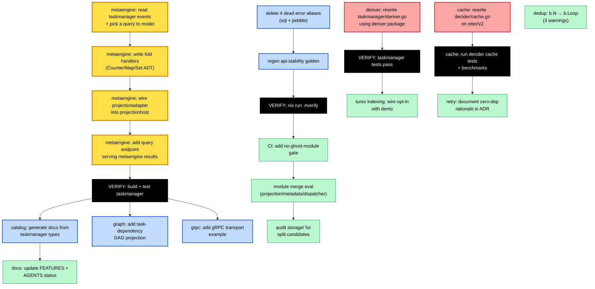

# SUPERB Integration-First Execution Plan

**Date:** 2026-07-28 15:51
**Born from:** The delete-vs-replace audit (`docs/status/2026-07-28_15-37_delete-vs-replace-audit.md`)
**Governing principle:** **Integration > Deletion.** Ghosts become integration projects; only truly dead code gets cut.

---

## Strategic Context

The audit identified ~16,500 LOC of functional-but-disconnected code. The owner
clarified: **metaengine is the future of the project** and **catalog is very
important**. This plan reframes every "ghost" as an **integration opportunity**.

The flagship example (`example/taskmanager/`) is the integration target. It
already demonstrates: event sourcing, CQRS, projections, OTel, signing, watermill,
SSE. What it does NOT demonstrate: **metaengine, catalog, graph, the real
deriver package** (it hand-rolls derivation instead).

### The integration thesis

Every ghost module exists because no example proves its value. Fix that ONCE
and the modules earn their keep. This is higher-leverage than extraction or
deletion because:

1. Examples are the marketing page for a library
2. Integration pressure surfaces real API friction (you find what's hard to use)
3. One example consumer unblocks every future external consumer

---

## Pareto Breakdown

### The 1% that delivers 51%

**Wire metaengine into `example/taskmanager`.** The taskmanager currently uses
`stack.Materialize[TaskView, TaskID]` (one document per key). Add a
metaengine-backed query — e.g. "count tasks by status" or "tasks assigned to
user X" — that uses the cost-based planner to infer the ADT (Counter / Map /
Set) and materialize it via `projectionadapter`. This single integration proves
"the future of the project" is real, not aspirational.

### The 4% that delivers 64%

| #   | Task                                                                                                                | Why it's here                                  |
| --- | ------------------------------------------------------------------------------------------------------------------- | ---------------------------------------------- |
| 1   | metaengine → taskmanager (the 1%)                                                                                   | Proves the future                              |
| 2   | **Fix deriver split-brain:** rewrite `taskmanager/deriver.go` to use the `deriver/` package instead of hand-rolling | Removes a split brain AND proves the package   |
| 3   | **Cache split-brain fix:** rewrite `decider/cache.go` on `maypok86/otter/v2` (already in dep graph)                 | One cache strategy, not two; policy compliance |

### The 20% that delivers 80%

| #   | Task                                                                                                                                                            |
| --- | --------------------------------------------------------------------------------------------------------------------------------------------------------------- |
| 4   | **catalog → taskmanager:** generate AsyncAPI/OpenAPI/EventCatalog docs from taskmanager types                                                                   |
| 5   | **graph → taskmanager:** add a task-dependency DAG projection (tasks block tasks)                                                                               |
| 6   | **Delete 4 dead error aliases** (`ErrAggregateTypeMismatch`/`ErrAggregateIDMismatch` in storage/sql + storage/pebble) — true deletion, not integration-eligible |
| 7   | **transport/grpc demo:** add a gRPC client/server path to taskmanager or a dedicated example                                                                    |

### The other 20% (to reach 100%)

| #   | Task                                                                                                |
| --- | --------------------------------------------------------------------------------------------------- |
| 8   | turso indexing wiring into `stack/turso` default path (or documented opt-in with a demo)            |
| 9   | Retry module: document the zero-dep + errorfamily rationale (keep as-is, close the policy question) |
| 10  | Documentation alignment: FEATURES.md + AGENTS.md status corrections for metaengine/catalog          |
| 11  | CI gate: "no new module without an example consumer or EXPERIMENTAL marker"                         |
| 12  | Modernize `dedup/ring_bench_test.go` (`b.N` → `b.Loop()`) — 3 gopls warnings                        |
| 13  | Module merge evaluation: projection/ (57 LOC), metadata/ (140 LOC), dispatcher/ (303 LOC)           |
| 14  | Audit `storage/` (15,404 LOC) for internal split candidates                                         |

---

## Mermaid Execution Graph



---

## Table 1: Comprehensive Plan — 100-30min tasks

Sorted by Pareto layer (impact/effort/customer-value).

| ID  | Layer   | Task                                                                                                                                                           | Effort | Impact      | Customer Value                        | Dependencies |
| --- | ------- | -------------------------------------------------------------------------------------------------------------------------------------------------------------- | ------ | ----------- | ------------------------------------- | ------------ |
| T1  | **1%**  | Research metaengine API: read `store.go`, `execute.go`, `fold.go`, `planner.go`. Understand `Register`, `On`, `Apply`, query execution                         | 30min  | Critical    | Unblocks T2-T4                        | None         |
| T2  | **1%**  | Design the metaengine query for taskmanager: pick "count tasks by status" (Counter ADT) — write fold handlers returning `metaengine.Delta`                     | 30min  | Critical    | Unblocks T3                           | T1           |
| T3  | **1%**  | Implement: create `taskmanager/metaengine_query.go`. Build a `metaengine.Store`, register the query, wire `projectionadapter.New()` into `projHost.Register()` | 60min  | Critical    | Proves the future                     | T2           |
| T4  | **1%**  | Add a query endpoint (`tasks.by_status` or similar) that reads from the metaengine Store instead of the kv read model                                          | 60min  | Critical    | End-to-end proof                      | T3           |
| T5  | **1%**  | **VERIFY:** `go build ./example/taskmanager/...` + `go test ./example/taskmanager/... -count=1` + manual smoke                                                 | 30min  | Critical    | Confidence                            | T4           |
| T6  | **4%**  | Rewrite `example/taskmanager/deriver.go` to use the `deriver/` package (`deriver.Then`, `deriver.AsHandler`) instead of hand-rolled `projection.NewProjection` | 30min  | High        | Removes split brain                   | None         |
| T7  | **4%**  | **VERIFY:** taskmanager tests pass after deriver rewrite                                                                                                       | 30min  | High        | Confidence                            | T6           |
| T8  | **4%**  | Rewrite `decider/cache.go`: replace the `container/list`+`sync.Mutex` LRU with `maypok86/otter/v2` (matches `kv/cache.go`)                                     | 60min  | High        | Policy compliance, one cache strategy | None         |
| T9  | **4%**  | **VERIFY:** `decider/cache_test.go` + `decider/decider_cache_test.go` pass + benchmark (confirm no regression)                                                 | 30min  | High        | Confidence                            | T8           |
| T10 | **20%** | catalog → taskmanager: write a small doc-gen setup that registers taskmanager commands/events and exports AsyncAPI + OpenAPI                                   | 90min  | Medium-High | Marketing surface for catalog         | T5           |
| T11 | **20%** | **VERIFY:** generated docs are valid (run catalog CLI, check YAML structure)                                                                                   | 30min  | Medium      | Confidence                            | T10          |
| T12 | **20%** | graph → taskmanager: add a `graph.GraphProjection` that builds a task-dependency DAG (BlockedBy edges)                                                         | 60min  | Medium      | Proves graph tier                     | T5           |
| T13 | **20%** | **VERIFY:** graph projection test — create blocking relationships, traverse the DAG                                                                            | 30min  | Medium      | Confidence                            | T12          |
| T14 | **20%** | Delete 4 dead deprecated error aliases in `storage/sql/errors.go` + `storage/pebble/errors.go`                                                                 | 30min  | Low-Medium  | Cleanup                               | None         |
| T15 | **20%** | Regen api-stability golden + **VERIFY:** `nix run .#verify` (or `go build ./...` + `go test ./...`)                                                            | 60min  | Medium      | Gate passes                           | T14          |
| T16 | **20%** | transport/grpc: add a gRPC server path to taskmanager (or a minimal dedicated example)                                                                         | 90min  | Medium      | Proves gRPC tier                      | None         |
| T17 | **20%** | **VERIFY:** gRPC client can dispatch commands/queries to the example                                                                                           | 30min  | Medium      | Confidence                            | T16          |
| T18 | **80%** | turso indexing: wire `WithAutoIndexing` into `stack/turso` as documented opt-in + add a demo line                                                              | 60min  | Low-Medium  | Proves the 2,462 LOC                  | None         |
| T19 | **80%** | Retry: write `docs/adr/XXXX-retry-zero-dep-rationale.md` explaining why hand-rolled > failsafe-go (zero-dep + errorfamily integration)                         | 30min  | Low         | Closes policy question                | None         |
| T20 | **80%** | Docs: update `FEATURES.md` — metaengine "STRATEGIC FUTURE", catalog "IMPORTANT — quality investment"                                                           | 30min  | Low         | Accuracy                              | T5, T10      |
| T21 | **80%** | Docs: update `AGENTS.md` module descriptions to reflect integration status                                                                                     | 30min  | Low         | Accuracy                              | T20          |
| T22 | **80%** | Docs: update `SKILL.md` routing table if metaengine/catalog get first-class documentation                                                                      | 30min  | Low         | AI consumer accuracy                  | T20          |
| T23 | **80%** | CI: add a meta-test "every module needs an example consumer OR EXPERIMENTAL marker"                                                                            | 60min  | Low-Medium  | Prevents future ghosts                | None         |
| T24 | **80%** | Modernize `dedup/ring_bench_test.go`: `b.N` → `b.Loop()` (3 gopls warnings)                                                                                    | 12min  | Trivial     | Cleanup                               | None         |
| T25 | **80%** | Module merge eval: read `projection/` (57 LOC), `metadata/` (140 LOC), `dispatcher/` (303 LOC) — recommend merge or keep                                       | 60min  | Low         | Architectural hygiene                 | None         |
| T26 | **80%** | Audit `storage/` (15,404 LOC): identify sub-packages that should split into their own modules                                                                  | 90min  | Low-Medium  | Maintainability                       | None         |

**Total: 26 tasks, ~19.5 hours of work**

---

## Table 2: Micro-Breakdown — max 12-min tasks

The high-impact tasks (T1-T9, the 4%) broken into 12-min execution units.

### metaengine integration (T1-T5 → M1-M15)

| ID  | Parent | Task                                                                                                      | Time  |
| --- | ------ | --------------------------------------------------------------------------------------------------------- | ----- |
| M1  | T1     | Read `metaengine/store.go`: `Store`, `Register`, `Apply`, `Plan`                                          | 10min |
| M2  | T1     | Read `metaengine/fold.go` + `fold_classify.go`: `On`, `Fold`, ADT inference                               | 10min |
| M3  | T1     | Read `metaengine/execute.go` + `query.go`: how queries execute against the Store                          | 10min |
| M4  | T1     | Read `metaengine/projectionadapter/adapter.go`: the projection bridge                                     | 10min |
| M5  | T1     | Read `metaengine/memory_engine.go` + `sqlite_engine.go`: backend choice                                   | 8min  |
| M6  | T2     | Design: "count tasks by status" → Counter ADT, fold returns `metaengine.Delta`                            | 10min |
| M7  | T2     | Design: "tasks by assignee" → Map ADT, fold returns `map[string][]string`                                 | 10min |
| M8  | T2     | Decide which query to implement first (recommend Counter — simplest, highest contrast with kv read model) | 5min  |
| M9  | T3     | Create `example/taskmanager/metaengine_query.go`: define event→fold handlers                              | 12min |
| M10 | T3     | Build the `metaengine.Store`: register query with `metaengine.On` folds                                   | 12min |
| M11 | T3     | Create the `projectionadapter.Adapter` with a typed `PayloadDecoder` for taskmanager events               | 12min |
| M12 | T3     | Wire `projHost.Register(metaengineAdapter)` in `setup.go` alongside the existing Materialize projection   | 10min |
| M13 | T3     | Add metaengine Store to the `Server` struct                                                               | 8min  |
| M14 | T4     | Add a query handler `TasksByStatusQuery` that reads from the metaengine Store                             | 12min |
| M15 | T4     | Register the query handler with the query dispatcher                                                      | 8min  |
| M16 | T5     | Run `go build -tags "goexperiment.jsonv2" ./example/taskmanager/...`                                      | 5min  |
| M17 | T5     | Run `go test -tags "goexperiment.jsonv2" ./example/taskmanager/... -count=1`                              | 10min |
| M18 | T5     | Manual smoke: start the server, create tasks, query by status, confirm counter increments                 | 12min |

### deriver split-brain fix (T6-T7 → D1-D5)

| ID  | Parent | Task                                                                                             | Time  |
| --- | ------ | ------------------------------------------------------------------------------------------------ | ----- |
| D1  | T6     | Read `deriver/deriver.go` + `deriver/doc.go`: `Then`, `Filter`, `Idempotent`, `AsHandler`        | 10min |
| D2  | T6     | Read current `example/taskmanager/deriver.go`: understand the hand-rolled logic                  | 5min  |
| D3  | T6     | Rewrite `newDeriverProjection` using `deriver.Then(evtTaskCreated).AsHandler(...)` or equivalent | 12min |
| D4  | T6     | Update `example/taskmanager/go.mod` to add `deriver/v4` dependency                               | 5min  |
| D5  | T7     | Run taskmanager tests, confirm auto-assign still works                                           | 10min |

### cache split-brain fix (T8-T9 → C1-C6)

| ID  | Parent | Task                                                                                                                                        | Time  |
| --- | ------ | ------------------------------------------------------------------------------------------------------------------------------------------- | ----- |
| C1  | T8     | Read `kv/cache.go`: how otter is constructed (`otter.Cache[string, *T]`, capacity, TTL)                                                     | 8min  |
| C2  | T8     | Read `decider/cache.go`: the `StateCache[State]` interface + `lruCache` impl                                                                | 8min  |
| C3  | T8     | Rewrite `decider/cache.go`: replace `lruCache` with otter-backed impl, keep the `StateCache[State]` interface                               | 12min |
| C4  | T8     | Handle the `Get` return signature (otter returns `(V, bool)`, interface returns `(State, Version, bool)` — may need a wrapper struct value) | 12min |
| C5  | T9     | Run `decider/cache_test.go` + `decider/decider_cache_test.go`                                                                               | 10min |
| C6  | T9     | Run `decider/benchmark_cache_test.go` — confirm otter is not slower than hand-rolled LRU                                                    | 10min |

### catalog integration (T10-T11 → CAT1-CAT5)

| ID   | Parent | Task                                                                             | Time  |
| ---- | ------ | -------------------------------------------------------------------------------- | ----- |
| CAT1 | T10    | Read `catalog/simple/builder.go` — the single-service facade                     | 10min |
| CAT2 | T10    | Read `catalog/example/rest/main.go` — the existing demo pattern                  | 8min  |
| CAT3 | T10    | Create `example/taskmanager/catalog.go`: register domain/service/commands/events | 12min |
| CAT4 | T10    | Add AsyncAPI + OpenAPI export (write to `example/taskmanager/docs/`)             | 12min |
| CAT5 | T11    | **VERIFY:** validate generated YAML structure + run catalog CLI if applicable    | 10min |

### graph integration (T12-T13 → G1-G4)

| ID  | Parent | Task                                                                                       | Time  |
| --- | ------ | ------------------------------------------------------------------------------------------ | ----- |
| G1  | T12    | Read `graph/graph_projection.go`: `GraphProjection`, `MergeNode`, `MergeEdge`, `GraphSink` | 10min |
| G2  | T12    | Read `graph/memory_driver.go`: `Query`, `Traverse`, `Neighbors`, `ShortestPath`            | 8min  |
| G3  | T12    | Create `example/taskmanager/graph_projection.go`: task nodes + BLOCKED_BY edges            | 12min |
| G4  | T13    | **VERIFY:** write a test that creates blocking relationships and traverses the DAG         | 12min |

### dead code deletion (T14-T15 → DEL1-DEL4)

| ID   | Parent | Task                                                                                         | Time |
| ---- | ------ | -------------------------------------------------------------------------------------------- | ---- |
| DEL1 | T14    | Delete `ErrAggregateTypeMismatch` + `ErrAggregateIDMismatch` from `storage/sql/errors.go`    | 5min |
| DEL2 | T14    | Delete `ErrAggregateTypeMismatch` + `ErrAggregateIDMismatch` from `storage/pebble/errors.go` | 5min |
| DEL3 | T15    | Regen api-stability golden: `cd cmd/api-stability && GOWORK=off go run main.go -update`      | 8min |
| DEL4 | T15    | **VERIFY:** `go build -tags "goexperiment.jsonv2" ./storage/...`                             | 5min |

---

## Verification Gates (NON-NEGOTIABLE)

After each Pareto layer, run the full gate. No "stale GREEN" claims.

```bash
# Fast feedback (per-task)
go build -tags "goexperiment.jsonv2" ./affected/...
go test -tags "goexperiment.jsonv2" ./affected/... -count=1

# Layer gate (after completing a Pareto tier)
nix run .#verify-fast

# Final gate (before declaring done)
nix run .#verify
```

---

## Anti-Verschlimmbesserung Checklist

Before merging ANY change, confirm:

- [ ] No test regressed (compare before/after)
- [ ] No benchmark regressed >10% (compare before/after)
- [ ] No public API removed without golden regen
- [ ] No new dependency added without budget check (`nix run .#check-layers`)
- [ ] The example still starts and serves requests manually
- [ ] AGENTS.md "stale GREEN" rule honored (re-ran verify this session)
