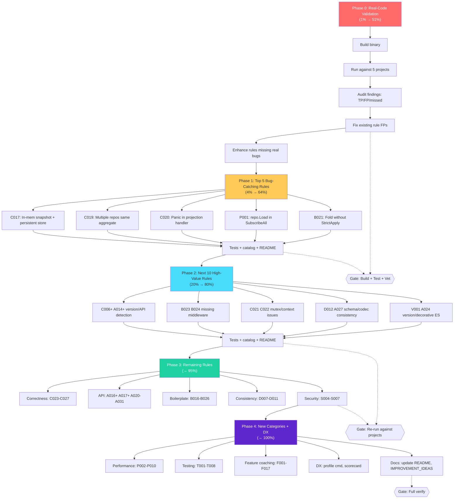

# cqrs-lint Superb Improvement Plan

> **Date:** 2026-07-30
> **Source:** [`cmd/cqrs-lint/IMPROVEMENT_IDEAS.md`](../../cmd/cqrs-lint/IMPROVEMENT_IDEAS.md) (170 ideas from 45 consumer projects)
> **Current state:** 65 rules, all tests green, build clean. Previous session fixed 8 bugs (C001 wrong auto-fix, A004 FP, B011 false claim, B001 substring FP, D006 perf, C016 dead code, B015 O(n²), loader panic guard).

---

## The Pareto Insight

A linter's value follows an extreme Pareto distribution because **trust is binary**: once users see false positives, they stop trusting ALL findings. Therefore:

> **The 1% that delivers 51%: VALIDATE AGAINST REAL CODE BEFORE ADDING ANYTHING NEW.**

We have 65 rules but have NEVER run them against real consumer projects and verified the output. We might be producing dozens of false positives (destroying trust) or missing dozens of real bugs (proving uselessness). This is the foundation everything builds on.

---

## Pareto Breakdown

### 1% → 51%: Real-Code Validation + Existing Rule Fixes

**What:** Run cqrs-lint against 5 key consumer projects. For every finding: is it a true positive? Is it actionable? Is the suggestion helpful? Fix every false positive. Enhance every rule that misses an obvious real-world bug.

**Why 51%:** Without this, new rules are built on sand. A linter that cries wolf is worse than no linter. This single activity determines whether the linter is trusted or ignored.

**Concrete deliverables:**

- cqrs-lint run output from Kernovia, Standup-Killer, bank-sync, cqrs-htmx, DiscordSync
- A categorized finding audit (TP / FP / missed) with actionable fixes
- Fixed false positives in existing rules
- Enhanced detection where rules miss real bugs

### 4% → 64%: Top 5 Bug-Catching Rules

**What:** Implement 5 new rules that each catch an ACTUAL BUG in an ACTUAL consumer project.

**Why the jump to 64%:** These rules prove the linter's value immediately. Each fires on a verified real-world bug. One demo run against the affected project → instant "this linter just found a bug I didn't know about" moment.

| Rule | Bug                                                               | Project         | Impact                            |
| ---- | ----------------------------------------------------------------- | --------------- | --------------------------------- |
| C017 | In-memory snapshot + persistent store → snapshots lost on restart | Kernovia        | Silent data loss on recovery      |
| C019 | Multiple NewRepository for same aggregate type                    | browser-history | Wasted singleflight/cache, memory |
| C020 | panic() in projection/bus handler                                 | Standup-Killer  | Projection host crash             |
| P001 | repo.Load inside SubscribeAll handler                             | timesheets      | O(N²) performance bomb            |
| B021 | Fold without StrictApply                                          | 6/8 projects    | Silently ignores unknown events   |

### 20% → 80%: Next 10 High-Value Rules

**What:** Rules that catch real patterns observed across MULTIPLE consumer projects.

| #   | Rule  | Pattern                                             | Projects affected                |
| --- | ----- | --------------------------------------------------- | -------------------------------- |
| 6   | C006+ | Version arithmetic `ver+1` in event creation        | Kernovia, Standup-Killer         |
| 7   | A014+ | event.NewEvent (deprecated) detection completeness  | Most projects                    |
| 8   | B023  | Missing command middleware (no recovery/logging)    | timesheets, go-localsync, storbi |
| 9   | B024  | Missing event bus recovery middleware               | Multiple projects                |
| 10  | C022  | `_ = ctx` in handler (context ignored)              | crush-daily                      |
| 11  | C021  | Mutex held during DecodePayloadAuto                 | crush-daily                      |
| 12  | D012  | Missing event.WithSchemaVersion                     | Most projects                    |
| 13  | A027  | Repeated event.WithCodec (should be centralized)    | crush-daily                      |
| 14  | V001  | v3/v4 module mixing in same project                 | go-plugin-mvp, go-appkit         |
| 15  | A024  | Decorative event sourcing (imports but never wires) | storbi                           |

### The remaining 20% → 100%: All Other Rules + DX

Everything else from the 170 ideas: remaining correctness rules, coaching rules, feature adoption suggestions, DX improvements (profile command, scorecard, incremental analysis), documentation updates.

---

## Execution Graph

---

## Phase 0: Real-Code Validation (1% → 51%)

> **THE FOUNDATION.** Nothing else matters if the linter produces noise.
> Estimated total: ~4-5 hours

### 0.1 Build cqrs-lint binary and verify it runs (10min)

| Subtask | Time | Description                                                                               |
| ------- | ---- | ----------------------------------------------------------------------------------------- |
| 0.1.1   | 3min | `cd cmd/cqrs-lint && GOWORK=off go build -tags "goexperiment.jsonv2" -o /tmp/cqrs-lint .` |
| 0.1.2   | 3min | Run `cqrs-lint --help` and `cqrs-lint rules` to verify CLI works                          |
| 0.1.3   | 3min | Run `cqrs-lint version` to verify version string                                          |

### 0.2 Run against Kernovia, collect all findings (30min)

| Subtask | Time  | Description                                                                                         |
| ------- | ----- | --------------------------------------------------------------------------------------------------- |
| 0.2.1   | 5min  | Run `/tmp/cqrs-lint /home/lars/projects/Kernovia --format json` and save output                     |
| 0.2.2   | 10min | Categorize each finding: TP (true positive) / FP (false positive) / Actionable?                     |
| 0.2.3   | 5min  | Note which rules produce the most noise                                                             |
| 0.2.4   | 5min  | Note which real bugs are MISSED (from the known anti-patterns: ver+1, json.Unmarshal in fold, etc.) |
| 0.2.5   | 5min  | Record findings in a structured format for cross-project comparison                                 |

### 0.3 Run against Standup-Killer, collect all findings (30min)

| Subtask | Time  | Description                                                                    |
| ------- | ----- | ------------------------------------------------------------------------------ |
| 0.3.1   | 5min  | Run linter, save JSON output                                                   |
| 0.3.2   | 10min | Categorize TP / FP / missed                                                    |
| 0.3.3   | 5min  | Cross-reference with known anti-patterns (version.Int()+1, panic in readmodel) |
| 0.3.4   | 5min  | Note noise patterns                                                            |
| 0.3.5   | 5min  | Record for comparison                                                          |

### 0.4 Run against bank-sync, collect all findings (30min)

| Subtask | Time  | Description                                                                |
| ------- | ----- | -------------------------------------------------------------------------- |
| 0.4.1   | 5min  | Run linter, save JSON output                                               |
| 0.4.2   | 10min | Categorize TP / FP / missed                                                |
| 0.4.3   | 5min  | This is the gold-standard project — verify linter recognizes good patterns |
| 0.4.4   | 5min  | Note any FPs on sophisticated code (encryption, upcasters, etc.)           |
| 0.4.5   | 5min  | Record for comparison                                                      |

### 0.5 Run against cqrs-htmx, collect all findings (30min)

| Subtask | Time  | Description                                  |
| ------- | ----- | -------------------------------------------- |
| 0.5.1   | 5min  | Run linter against cqrs-htmx root module     |
| 0.5.2   | 5min  | Run linter against cqrs-htmx/usermgmt module |
| 0.5.3   | 10min | Categorize TP / FP / missed                  |
| 0.5.4   | 5min  | Note FPs on framework code vs consumer code  |
| 0.5.5   | 5min  | Record for comparison                        |

### 0.6 Run against DiscordSync, collect all findings (30min)

| Subtask | Time  | Description                                                           |
| ------- | ----- | --------------------------------------------------------------------- |
| 0.6.1   | 5min  | Run linter, save JSON output                                          |
| 0.6.2   | 10min | Categorize TP / FP / missed                                           |
| 0.6.3   | 5min  | Note FPs on event-capture architecture (no decider by design)         |
| 0.6.4   | 5min  | Cross-reference with known patterns (manual retry, bit-shift backoff) |
| 0.6.5   | 5min  | Record for comparison                                                 |

### 0.7 Cross-project analysis: identify top FP sources and top missed bugs (60min)

| Subtask | Time  | Description                                                                                            |
| ------- | ----- | ------------------------------------------------------------------------------------------------------ |
| 0.7.1   | 10min | Aggregate all FP findings across 5 projects. Which rules produce the most FPs?                         |
| 0.7.2   | 10min | Rank rules by FP rate. The top 3-5 FP producers are the priority fixes.                                |
| 0.7.3   | 10min | Aggregate all "missed bug" observations. Which real bugs does the linter NOT catch?                    |
| 0.7.4   | 10min | Rank missed bugs by severity. These inform Phase 1-3 rule selection.                                   |
| 0.7.5   | 10min | Identify patterns where the linter should be SUPPRESSED (event-capture arch, cqrs-htmx framework code) |
| 0.7.6   | 10min | Write the validation report to `cmd/cqrs-lint/VALIDATION_REPORT.md`                                    |

### 0.8 Fix existing rule false positives (90min)

| Subtask | Time  | Description                                                        |
| ------- | ----- | ------------------------------------------------------------------ |
| 0.8.1   | 12min | Fix FP source #1 (identified in 0.7.2) — add suppression/filtering |
| 0.8.2   | 12min | Fix FP source #2                                                   |
| 0.8.3   | 12min | Fix FP source #3                                                   |
| 0.8.4   | 12min | Fix FP source #4 (if exists)                                       |
| 0.8.5   | 12min | Fix FP source #5 (if exists)                                       |
| 0.8.6   | 12min | Re-run against all 5 projects to verify FPs are gone               |
| 0.8.7   | 12min | Verify no new FPs introduced by the fixes                          |
| 0.8.8   | 6min  | Build + test + vet                                                 |

### 0.9 Enhance existing rules that miss real bugs (60min)

| Subtask | Time  | Description                                                                   |
| ------- | ----- | ----------------------------------------------------------------------------- |
| 0.9.1   | 12min | Verify C006 catches `ver+1` in event.NewEvent call (Kernovia pattern)         |
| 0.9.2   | 12min | Verify C006 catches `event.Version(version.Int()+1)` (Standup-Killer pattern) |
| 0.9.3   | 12min | Verify A014 catches ALL event.NewEvent calls, not just specific patterns      |
| 0.9.4   | 12min | Verify C005 catches json.Unmarshal in fold functions (Kernovia pattern)       |
| 0.9.5   | 12min | Fix any gaps found above, add regression tests                                |

---

## Phase 1: Top 5 Bug-Catching Rules (4% → 64%)

> Each rule catches a VERIFIED real bug in a REAL consumer project.
> Estimated total: ~5 hours

### 1.1 C017: In-memory snapshot store with persistent event store (45min)

**Bug:** Kernovia pairs SQLite event store with `memory.NewMemorySnapshotStore()` → snapshots lost on restart.

| Subtask | Time | Description                                                                                                                            |
| ------- | ---- | -------------------------------------------------------------------------------------------------------------------------------------- |
| 1.1.1   | 5min | Read the feature_detect.go store detection logic to understand how to determine store type                                             |
| 1.1.2   | 5min | Design the detection: feature profile has `Store == StoreSQLite/Postgres/Pebble` AND code constructs `memory.NewMemorySnapshotStore()` |
| 1.1.3   | 8min | Write the detector in `pkg/rules/correctness/c017.go`                                                                                  |
| 1.1.4   | 5min | Register in `register.go` and add to `catalog.go`                                                                                      |
| 1.1.5   | 8min | Write test: persistent store + memory snapshot → fires                                                                                 |
| 1.1.6   | 5min | Write test: persistent store + persistent snapshot → no finding                                                                        |
| 1.1.7   | 5min | Write test: memory store + memory snapshot → no finding (both in-memory is fine)                                                       |
| 1.1.8   | 4min | Build + test                                                                                                                           |

### 1.2 C019: Multiple NewRepository for same aggregate type (45min)

**Bug:** browser-history creates 3 `decider.NewRepository` instances for the same state type.

| Subtask | Time | Description                                                                                                                  |
| ------- | ---- | ---------------------------------------------------------------------------------------------------------------------------- |
| 1.2.1   | 5min | Study the scanner to understand how NewRepository calls are tracked                                                          |
| 1.2.2   | 5min | Design: count NewRepository calls per state type parameter across all files                                                  |
| 1.2.3   | 8min | Write the detector (needs cross-file analysis — scan all GoFiles for NewRepository calls, group by ExprString of type param) |
| 1.2.4   | 5min | Register in register.go and catalog.go                                                                                       |
| 1.2.5   | 8min | Write test: 2+ repos for same type → fires                                                                                   |
| 1.2.6   | 5min | Write test: 1 repo per type → no finding                                                                                     |
| 1.2.7   | 5min | Write test: different types → no finding                                                                                     |
| 1.2.8   | 4min | Build + test                                                                                                                 |

### 1.3 C020: Panic in projection/bus handler (30min)

**Bug:** Standup-Killer panics in readmodel.go:184 inside a SubscribeAll handler.

| Subtask | Time | Description                                                                                                                            |
| ------- | ---- | -------------------------------------------------------------------------------------------------------------------------------------- |
| 1.3.1   | 5min | Study how projection.Handle methods and bus subscribers are identified                                                                 |
| 1.3.2   | 5min | Design: find panic() calls inside functions that are (a) Projection.Handle implementations or (b) passed to bus.Subscribe/SubscribeAll |
| 1.3.3   | 8min | Write the detector in `pkg/rules/correctness/c020.go`                                                                                  |
| 1.3.4   | 5min | Register in register.go and catalog.go                                                                                                 |
| 1.3.5   | 5min | Write test: panic in handler → fires; panic in non-handler → no finding                                                                |
| 1.3.6   | 2min | Build + test                                                                                                                           |

### 1.4 P001: repo.Load inside SubscribeAll handler (30min)

**Bug:** timesheets calls repo.Load on every event in SubscribeAll → O(N²).

| Subtask | Time | Description                                                                                         |
| ------- | ---- | --------------------------------------------------------------------------------------------------- |
| 1.4.1   | 5min | Design: detect `repo.Load` or `repository.Load` call inside a function passed to `bus.SubscribeAll` |
| 1.4.2   | 8min | Write the detector in `pkg/rules/performance/p001.go` (new subpackage)                              |
| 1.4.3   | 5min | Register in register.go and catalog.go                                                              |
| 1.4.4   | 5min | Write test: repo.Load in SubscribeAll handler → fires                                               |
| 1.4.5   | 5min | Write test: repo.Load outside handler → no finding                                                  |
| 1.4.6   | 2min | Build + test                                                                                        |

### 1.5 B021: Fold without StrictApply (45min)

**Bug:** 6/8 projects use plain fold instead of StrictApply → unknown events silently ignored.

| Subtask | Time | Description                                                                                    |
| ------- | ---- | ---------------------------------------------------------------------------------------------- |
| 1.5.1   | 5min | Study how decider.Decider and its Fold field are tracked in the scanner                        |
| 1.5.2   | 5min | Design: detect `decider.Decider{Fold: someFunc}` where someFunc does NOT contain `StrictApply` |
| 1.5.3   | 8min | Write the detector in `pkg/rules/boilerplate/b021.go`                                          |
| 1.5.4   | 5min | Register in register.go and catalog.go                                                         |
| 1.5.5   | 8min | Write test: plain fold → fires; StrictApply fold → no finding                                  |
| 1.5.6   | 5min | Write test: TypedDecider with StrictApply → no finding                                         |
| 1.5.7   | 5min | Write test: decider with no Fold field → no finding                                            |
| 1.5.8   | 4min | Build + test                                                                                   |

### 1.6 Integration: tests, catalog, README for Phase 1 (60min)

| Subtask | Time  | Description                                                                                    |
| ------- | ----- | ---------------------------------------------------------------------------------------------- |
| 1.6.1   | 12min | Run all new rules against real projects — verify they fire on the intended bugs                |
| 1.6.2   | 12min | Verify NO new false positives on the 5 validation projects                                     |
| 1.6.3   | 12min | Update catalog.go with all 5 new rules (ID, Name, Category, Severity, Confidence, Description) |
| 1.6.4   | 12min | Update README.md rule tables with the 5 new rules                                              |
| 1.6.5   | 12min | Build + full test suite + vet                                                                  |

---

## Phase 2: Next 10 High-Value Rules (20% → 80%)

> Rules that catch real patterns across MULTIPLE consumer projects.
> Estimated total: ~8 hours

### 2.1 C006+ and A014+: Verify and fix version/API detection (60min)

| Subtask | Time  | Description                                                                         |
| ------- | ----- | ----------------------------------------------------------------------------------- |
| 2.1.1   | 12min | Test C006 against Kernovia's `ver+1` pattern — write failing test if it misses      |
| 2.1.2   | 12min | Test C006 against Standup-Killer's `event.Version(version.Int()+1)` — fix if needed |
| 2.1.3   | 12min | Test A014 against all event.NewEvent call sites in 5 projects — fix gaps            |
| 2.1.4   | 12min | Add the `marshalPayload` two-step detection to A002 (github-local-sync, InboxClean) |
| 2.1.5   | 12min | Build + test + re-run against projects to verify                                    |

### 2.2 B023 + B024: Missing middleware detection (60min)

| Subtask | Time | Description                                                                              |
| ------- | ---- | ---------------------------------------------------------------------------------------- |
| 2.2.1   | 5min | Design B023: command.Dispatcher with zero `.Use()` calls                                 |
| 2.2.2   | 8min | Write B023 detector + register + catalog                                                 |
| 2.2.3   | 8min | Write B023 tests (dispatcher with Use → no finding; without → fires)                     |
| 2.2.4   | 5min | Design B024: event.Bus / watermill.NewEventBus without EventRecovery/Recovery middleware |
| 2.2.5   | 8min | Write B024 detector + register + catalog                                                 |
| 2.2.6   | 8min | Write B024 tests                                                                         |
| 2.2.7   | 8min | Build + test + verify against projects (timesheets, go-localsync should fire)            |

### 2.3 C021 + C022: Mutex and context issues (45min)

| Subtask | Time | Description                                                                 |
| ------- | ---- | --------------------------------------------------------------------------- |
| 2.3.1   | 5min | Design C021: Lock() followed by DecodePayloadAuto/Unmarshal before Unlock() |
| 2.3.2   | 8min | Write C021 detector + register + catalog                                    |
| 2.3.3   | 8min | Write C021 tests                                                            |
| 2.3.4   | 5min | Design C022: `_ = ctx` inside a function with context.Context param         |
| 2.3.5   | 8min | Write C022 detector + register + catalog                                    |
| 2.3.6   | 8min | Write C022 tests                                                            |
| 2.3.7   | 3min | Build + test                                                                |

### 2.4 D012 + A027: Schema version and codec consistency (45min)

| Subtask | Time | Description                                                      |
| ------- | ---- | ---------------------------------------------------------------- |
| 2.4.1   | 5min | Design D012: event.New/NewEvent without WithSchemaVersion option |
| 2.4.2   | 8min | Write D012 detector + register + catalog                         |
| 2.4.3   | 8min | Write D012 tests                                                 |
| 2.4.4   | 5min | Design A027: event.WithCodec appearing 3+ times in same file     |
| 2.4.5   | 8min | Write A027 detector + register + catalog                         |
| 2.4.6   | 8min | Write A027 tests                                                 |
| 2.4.7   | 3min | Build + test                                                     |

### 2.5 V001 + A024: Version mixing and decorative ES (45min)

| Subtask | Time | Description                                                                                 |
| ------- | ---- | ------------------------------------------------------------------------------------------- |
| 2.5.1   | 5min | Design V001: both v3 and v4 go-cqrs-lite import paths in same go.mod                        |
| 2.5.2   | 8min | Write V001 detector — scans import paths in Packages for `/v3` and `/v4` coexistence        |
| 2.5.3   | 5min | Register + catalog V001 in a new `version` subpackage                                       |
| 2.5.4   | 8min | Write V001 tests                                                                            |
| 2.5.5   | 5min | Design A024: imports event/decider but zero event.New/NewEvent and zero NewRepository calls |
| 2.5.6   | 8min | Write A024 detector + register + catalog                                                    |
| 2.5.7   | 5min | Write A024 tests                                                                            |
| 2.5.8   | 1min | Build + test                                                                                |

### 2.6 Integration: catalog, README, verify (90min)

| Subtask | Time  | Description                                                                                       |
| ------- | ----- | ------------------------------------------------------------------------------------------------- |
| 2.6.1   | 12min | Update catalog.go with all 10 new rules                                                           |
| 2.6.2   | 12min | Update README.md rule tables                                                                      |
| 2.6.3   | 12min | Run full suite against all 5 validation projects — verify TP count increased, FP count still zero |
| 2.6.4   | 12min | Update the meta_test.go rule count assertion (if it checks total count)                           |
| 2.6.5   | 12min | Update IMPROVEMENT_IDEAS.md — mark implemented ideas as done                                      |
| 2.6.6   | 12min | Write VALIDATION_REPORT.md update showing before/after finding counts                             |
| 2.6.7   | 12min | Build + full test suite + vet                                                                     |
| 2.6.8   | 6min  | Final re-run against projects for confidence                                                      |

---

## Phase 3: Remaining Valuable Rules (→ 95%)

> The long tail of rules that catch real but less common patterns.
> Estimated total: ~12-15 hours

### 3.1 Remaining correctness rules C023-C027 (120min)

| Subtask | Time  | Description                                                                                |
| ------- | ----- | ------------------------------------------------------------------------------------------ |
| 3.1.1   | 12min | C023: Shutdown error ignored (`_ = host.Stop()` / `_ = bus.Close()`) — extends C015        |
| 3.1.2   | 12min | C024: Dual-write read model without rollback (in-memory mutation before SQL write)         |
| 3.1.3   | 12min | C025: fmt.Errorf without %w in CQRS-adjacent files (tighten D006 scope)                    |
| 3.1.4   | 12min | C026: Idempotency TTL constant mismatch (named constant differs from passed value)         |
| 3.1.5   | 12min | C027: Bus subscription + projectionhost for overlapping events (duplicate processing risk) |
| 3.1.6   | 12min | Write tests for C023-C027                                                                  |
| 3.1.7   | 12min | Register all in register.go + catalog.go                                                   |
| 3.1.8   | 12min | Build + test                                                                               |
| 3.1.9   | 12min | C018: Silent journal fallback to empty memory store                                        |
| 3.1.10  | 12min | C018 test + register                                                                       |

### 3.2 Remaining API rules A016+-A031 (120min)

| Subtask | Time  | Description                                                                   |
| ------- | ----- | ----------------------------------------------------------------------------- |
| 3.2.1   | 12min | A016+: Custom idempotency store instead of library module                     |
| 3.2.2   | 12min | A017+: WithSnapshotStore without WithSnapshotStrategy                         |
| 3.2.3   | 12min | A020: Custom event.Bus reimplementation                                       |
| 3.2.4   | 12min | A021: Custom event.Store reimplementation                                     |
| 3.2.5   | 12min | A022: Raw otel.Tracer() instead of cqrsotel                                   |
| 3.2.6   | 12min | A023: Custom in-memory snapshot store                                         |
| 3.2.7   | 12min | A025/A026/A028: CQRS-htmx-only / event-bus-only / no-CQRS patterns            |
| 3.2.8   | 12min | A029/A030/A031: UsePublish stub / in-mem checkpoint+DLQ with persistent store |
| 3.2.9   | 12min | Tests for A016-A031                                                           |
| 3.2.10  | 12min | Register + catalog + build + test                                             |

### 3.3 Remaining boilerplate rules B016-B026 (120min)

| Subtask | Time  | Description                                                                       |
| ------- | ----- | --------------------------------------------------------------------------------- |
| 3.3.1   | 12min | B016: Manual checkpoint replay table (reinvents projectionhost)                   |
| 3.3.2   | 12min | B017: Manual read model rebuild from scratch on startup                           |
| 3.3.3   | 12min | B018: Repeated bus.Subscribe boilerplate (3+ identical patterns)                  |
| 3.3.4   | 12min | B019: O(N²) read model via repo.Load (overlaps P001, make it the same or related) |
| 3.3.5   | 12min | B020: Manual legacy field upcasting instead of schema.Upcaster                    |
| 3.3.6   | 12min | B022: Custom correlation enricher instead of CommandCausalityEnricher             |
| 3.3.7   | 12min | B025: Missing state cache on repository                                           |
| 3.3.8   | 12min | B026: Missing event catalog (3+ event types, no catalog import)                   |
| 3.3.9   | 12min | Tests for B016-B026                                                               |
| 3.3.10  | 12min | Register + catalog + build + test                                                 |

### 3.4 Remaining consistency + security rules (90min)

| Subtask | Time  | Description                                                         |
| ------- | ----- | ------------------------------------------------------------------- |
| 3.4.1   | 12min | D007: Inconsistent event.New vs event.NewEvent in same project      |
| 3.4.2   | 12min | D008: Inconsistent codec usage (DecodePayload vs DecodePayloadAuto) |
| 3.4.3   | 12min | D010: Generic error code "internal"                                 |
| 3.4.4   | 12min | D011: Nil payload events                                            |
| 3.4.5   | 12min | S004: PII field names without encryption                            |
| 3.4.6   | 12min | S005: Signing configured but disabled                               |
| 3.4.7   | 12min | S007: In-memory session store in production server                  |
| 3.4.8   | 6min  | Tests + register + catalog + build                                  |

### 3.5 Architecture rules E008-E015 (90min)

| Subtask | Time  | Description                                                                                 |
| ------- | ----- | ------------------------------------------------------------------------------------------- |
| 3.5.1   | 12min | E008: cqrs-htmx primary path bypasses stack presets                                         |
| 3.5.2   | 12min | E013: Signing configured but disabled by default                                            |
| 3.5.3   | 12min | E014: No read-your-writes consistency (no waitForDrain)                                     |
| 3.5.4   | 12min | E012: Dual-write migration bus without completion criteria                                  |
| 3.5.5   | 12min | E015: Watermill EventBus without ordered delivery config                                    |
| 3.5.6   | 12min | E009/E010/E011: No HTTP integration / event capture without validation / excessive adapters |
| 3.5.7   | 12min | Tests + register + catalog                                                                  |
| 3.5.8   | 6min  | Build + test                                                                                |

---

## Phase 4: New Categories + DX (→ 100%)

> Performance, testing, feature coaching, and developer experience.
> Estimated total: ~10-12 hours

### 4.1 Performance rules P002-P010 (90min)

| Subtask | Time  | Description                                                                           |
| ------- | ----- | ------------------------------------------------------------------------------------- |
| 4.1.1   | 12min | P002: Full read model rebuild on every startup                                        |
| 4.1.2   | 12min | P003: Mutex held during decode (overlaps C021 — merge or differentiate)               |
| 4.1.3   | 12min | P004: Multiple repos for same aggregate (overlaps C019 — merge)                       |
| 4.1.4   | 12min | P005: No state cache on hot aggregate                                                 |
| 4.1.5   | 12min | P007: Manual retry loop with bitshift backoff                                         |
| 4.1.6   | 12min | P008/P009/P010: Batch size / JSON for large payloads / no snapshot on large aggregate |
| 4.1.7   | 12min | Tests + register + catalog                                                            |
| 4.1.8   | 6min  | Build + test                                                                          |

### 4.2 Testing rules T001-T008 (60min)

| Subtask | Time  | Description                                                         |
| ------- | ----- | ------------------------------------------------------------------- |
| 4.2.1   | 12min | T001: No scenario tests for deciders                                |
| 4.2.2   | 12min | T002: No scenario tests for projections                             |
| 4.2.3   | 12min | T006: Decider test without conflict-path test (ThenError)           |
| 4.2.4   | 12min | T007/T008: No event round-trip test / test imports production store |
| 4.2.5   | 12min | Tests + register + catalog + build                                  |

### 4.3 Feature adoption coaching F001-F017 (90min)

| Subtask | Time  | Description                                                            |
| ------- | ----- | ---------------------------------------------------------------------- |
| 4.3.1   | 12min | F001: No tombstone soft-delete (Delete* ops without MarkTombstone)     |
| 4.3.2   | 12min | F002: No catalog/documentation (3+ event types, no catalog import)     |
| 4.3.3   | 12min | F003/F004: No OTel/Prometheus in server-mode project                   |
| 4.3.4   | 12min | F005/F006: No schema upcasters / no encryption for sensitive data      |
| 4.3.5   | 12min | F007/F008: No idempotency / no CBOR for large payloads                 |
| 4.3.6   | 12min | F009/F011/F012: No scheduling / relational / graph projections         |
| 4.3.7   | 12min | F013-F017: transport modules / kv.Cache / listing / dedup / metaengine |
| 4.3.8   | 6min  | Tests + register + catalog + build                                     |

### 4.4 Version health rules V002-V006 (45min)

| Subtask | Time  | Description                                                  |
| ------- | ----- | ------------------------------------------------------------ |
| 4.4.1   | 12min | V002: Unpinned go-cqrs-lite version                          |
| 4.4.2   | 12min | V003: Version lag behind latest (2+ minor versions)          |
| 4.4.3   | 12min | V004/V005: Vendored copy / eventtest pseudo-version mismatch |
| 4.4.4   | 9min  | Tests + register + catalog + build                           |

### 4.5 DX: profile command + scorecard (90min)

| Subtask | Time  | Description                                                                                   |
| ------- | ----- | --------------------------------------------------------------------------------------------- |
| 4.5.1   | 12min | Design `cqrs-lint profile` subcommand — outputs module usage, feature adoption, anti-patterns |
| 4.5.2   | 12min | Implement profile command structure (cobra subcommand, reuse analyzer.BuildContext)           |
| 4.5.3   | 12min | Implement module usage detection (which go-cqrs-lite modules are imported)                    |
| 4.5.4   | 12min | Implement feature adoption scorecard (used vs missing features)                               |
| 4.5.5   | 12min | Write tests for profile command                                                               |
| 4.5.6   | 12min | Add `--scorecard` flag to main command (prints feature adoption alongside findings)           |
| 4.5.7   | 12min | Build + test + verify against a real project                                                  |
| 4.5.8   | 6min  | Update README with profile command docs                                                       |

### 4.6 Documentation + final verification (60min)

| Subtask | Time  | Description                                                              |
| ------- | ----- | ------------------------------------------------------------------------ |
| 4.6.1   | 12min | Update README.md with ALL new rules (complete rule tables)               |
| 4.6.2   | 12min | Update IMPROVEMENT_IDEAS.md — mark all implemented ideas                 |
| 4.6.3   | 12min | Update catalog.go — ensure all rules have complete metadata              |
| 4.6.4   | 12min | Run `nix run .#verify` (or equivalent: build + vet + test + race + lint) |
| 4.6.5   | 12min | Run linter against all 5 validation projects — final confidence check    |

---

## Summary: Task-Level Overview (100min-30min chunks)

| Phase | Task ID | Description                              | Est. Time | Impact    | Effort | Customer Value       |
| ----- | ------- | ---------------------------------------- | --------- | --------- | ------ | -------------------- |
| **0** | 0.1     | Build binary + verify CLI                | 10min     | Critical  | Low    | Foundation           |
| **0** | 0.2     | Run against Kernovia                     | 30min     | Critical  | Low    | Foundation           |
| **0** | 0.3     | Run against Standup-Killer               | 30min     | Critical  | Low    | Foundation           |
| **0** | 0.4     | Run against bank-sync                    | 30min     | Critical  | Low    | Foundation           |
| **0** | 0.5     | Run against cqrs-htmx                    | 30min     | Critical  | Low    | Foundation           |
| **0** | 0.6     | Run against DiscordSync                  | 30min     | Critical  | Low    | Foundation           |
| **0** | 0.7     | Cross-project FP/missed-bug analysis     | 60min     | Critical  | Medium | Foundation           |
| **0** | 0.8     | Fix existing rule false positives        | 90min     | Critical  | Medium | Immediate trust      |
| **0** | 0.9     | Enhance rules missing real bugs          | 60min     | Critical  | Medium | Immediate value      |
| **1** | 1.1     | C017: In-mem snapshot + persistent store | 45min     | Very High | Medium | Catches real bug     |
| **1** | 1.2     | C019: Multiple repos same aggregate      | 45min     | Very High | Medium | Catches real bug     |
| **1** | 1.3     | C020: Panic in projection handler        | 30min     | Very High | Low    | Catches real bug     |
| **1** | 1.4     | P001: repo.Load in SubscribeAll          | 30min     | Very High | Low    | Catches real bug     |
| **1** | 1.5     | B021: Fold without StrictApply           | 45min     | Very High | Medium | Catches real bug     |
| **1** | 1.6     | Integration: tests, catalog, README      | 60min     | High      | Low    | Completeness         |
| **2** | 2.1     | C006+ and A014+ detection fixes          | 60min     | High      | Low    | Catches real pattern |
| **2** | 2.2     | B023 + B024: Missing middleware          | 60min     | High      | Medium | Catches real risk    |
| **2** | 2.3     | C021 + C022: Mutex/context issues        | 45min     | Medium    | Low    | Catches real bug     |
| **2** | 2.4     | D012 + A027: Schema/codec consistency    | 45min     | Medium    | Low    | Catches real pattern |
| **2** | 2.5     | V001 + A024: Version/decorative ES       | 45min     | Medium    | Low    | Catches real issue   |
| **2** | 2.6     | Integration: catalog, README, verify     | 90min     | High      | Low    | Completeness         |
| **3** | 3.1     | C023-C027 correctness rules              | 120min    | Medium    | Medium | Edge case bugs       |
| **3** | 3.2     | A016-A031 API rules                      | 120min    | Medium    | High   | API misuse           |
| **3** | 3.3     | B016-B026 boilerplate rules              | 120min    | Medium    | Medium | Productivity         |
| **3** | 3.4     | D007-D011 + S004-S007                    | 90min     | Low-Med   | Medium | Consistency/security |
| **3** | 3.5     | E008-E015 architecture rules             | 90min     | Low-Med   | Medium | Architecture         |
| **4** | 4.1     | P002-P010 performance rules              | 90min     | Medium    | Medium | Performance          |
| **4** | 4.2     | T001-T008 testing rules                  | 60min     | Medium    | Low    | Test quality         |
| **4** | 4.3     | F001-F017 feature coaching               | 90min     | Low       | Medium | Adoption             |
| **4** | 4.4     | V002-V006 version rules                  | 45min     | Low       | Low    | Version health       |
| **4** | 4.5     | DX: profile + scorecard                  | 90min     | High      | High   | Developer experience |
| **4** | 4.6     | Documentation + final verify             | 60min     | High      | Low    | Completeness         |

**Total estimated effort: ~35-40 hours**

---

## What NOT to Do (Anti-Verschlimmbessern Checklist)

1. **Don't add rules without validating against real code** — a rule that fires on zero real projects is dead code
2. **Don't add rules with >10% false positive rate** — tune the heuristic or don't ship it
3. **Don't break existing tests** — if a new rule changes behavior, verify all 65 existing rules still pass
4. **Don't add rules that require type information the scanner doesn't have** — the linter is AST-based, not type-checker-based. If a rule needs `go/types`, it's too complex for this architecture
5. **Don't add complexity to the feature profile system without testing** — the profile affects ALL context-dependent rules
6. **Don't suppress rules globally to fix one FP** — use targeted suppression (package qualifier checks, feature profile gates)
7. **Don't add coaching rules (F-series) at Error/Warning severity** — they're Info at most. Users hate being nagged
8. **Don't forget to update catalog.go AND README.md for every new rule** — the meta_test enforces catalog completeness
