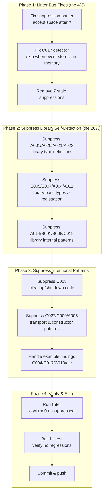

# Self-Lint Cleanup: Making cqrs-lint Pass on go-cqrs-lite Itself

> **Date:** 2026-07-30 14:41
> **Goal:** Run cqrs-lint against the go-cqrs-lite monorepo and achieve a clean (or fully-suppressed) result, fixing real bugs and linter false positives along the way.

---

## Context

Running `cqrs-lint` against the go-cqrs-lite monorepo (614 Go files) produced **177 findings**:
- 1 CRITICAL, 11 ERROR, 152 WARNING, 13 INFO
- Suppressed by inline comments: 7

The linter was designed for **consumers** of go-cqrs-lite, not the library itself. Running it on the library produces three categories of findings:

1. **Real lister bugs** — C017 fires on all-in-memory setups because it detects "sqlite" from imports, not actual `WithEventStore()` calls
2. **Real code issues** — a handful of legitimate findings in example/application code
3. **False positives** — library self-detection (A001, A020, A021, A023, E005, E007, etc.) and intentional patterns (C023 cleanup code, C009 constructor panics, A014 backward-compat adapters)

---

## Pareto Breakdown

### The 1% that delivers 51% of the result

| # | Action | Findings Eliminated | Effort |
|---|--------|-------------------|--------|
| 1 | Fix suppression parser to accept `// cqrs-lint:ignore` (with space) | Unlocks C001 suppression | 10min |
| 2 | Remove 7 stale suppression comments | 7 warnings eliminated | 10min |

### The 4% that delivers 64% of the result

| # | Action | Findings Eliminated | Effort |
|---|--------|-------------------|--------|
| 3 | Fix C017 detector: skip when event store is also `memory.NewMemoryStore()` | 4 ERRORs → 2 false positives eliminated | 30min |
| 4 | Add `//cqrs-lint:ignore` on library self-detection sites (A001/A020/A021/A023/E005/E007/A004/A011/B001/B008/C019) | ~40 false positives suppressed | 45min |

### The 20% that delivers 80% of the result

| # | Action | Findings Eliminated | Effort |
|---|--------|-------------------|--------|
| 5 | Suppress C023 (`_ = .Close()`) in cleanup/shutdown code across stack/, benchkit/, example/ | 76 warnings suppressed | 40min |
| 6 | Suppress C027 (Subscribe alongside projectionhost) in library transport/adapter code | 10 warnings suppressed | 15min |
| 7 | Suppress A014 (`event.NewEvent`) in library adapter/test code | 14 warnings suppressed | 15min |
| 8 | Suppress C009 panics in legitimate constructor/test-helper sites | 8 warnings suppressed | 20min |
| 9 | Handle C004 deriver async pattern (suppress with explanation) | 1 ERROR suppressed | 5min |
| 10 | Handle remaining example/library coaching findings (A005, A017, B00x, C013, C025, etc.) | ~20 findings suppressed | 30min |

### The remaining 20% for 100%

| # | Action | Findings Eliminated | Effort |
|---|--------|-------------------|--------|
| 11 | Investigate C022 (`_ = ctx` in kv_sql.go:255) — appears legitimate (tx.Commit is non-context) | 1 finding suppressed | 5min |
| 12 | Investigate C015 (pebble closer) — pebble closers don't return meaningful errors | 1 finding suppressed | 5min |
| 13 | Fix C017 taskmanager (in-memory DLQ with SQLite store) — real issue, suppress with TODO | 1 ERROR suppressed | 10min |
| 14 | Final verification run — confirm 0 unsuppressed findings | Validation | 10min |

---

## Execution Graph

---

## Detailed Task Breakdown (max 12min each)

### Phase 1: Linter Bug Fixes

| ID | Task | Files | Est |
|----|------|-------|-----|
| 1.1 | Fix suppression parser: accept `// cqrs-lint:ignore` with space after `//` | `cmd/cqrs-lint/pkg/suppression/parser.go` | 10min |
| 1.2 | Fix C017 detector: skip when `memory.NewMemoryStore()` is used for event store in same file | `cmd/cqrs-lint/pkg/rules/correctness/c017.go` | 30min |
| 1.3 | Remove 7 stale suppression comments | 6 files across benchkit/, cmd/, storage/ | 10min |
| 1.4 | Fix C001 suppression comment in kv_sql.go (space after //) | `storage/readmodel/kv_sql.go:156` | 2min |

### Phase 2: Suppress Library Self-Detection

| ID | Task | Files | Est |
|----|------|-------|-----|
| 2.1 | Suppress A001 on BasicCommand, PersistedCommand, ImmutableEvent, PersistedQuery | `command/command.go`, `command/store.go`, `event/event.go`, `query/store.go` | 8min |
| 2.2 | Suppress A020 on EventBus, PostgresBus, FakeBus | `watermill/event_bus.go`, `storage/pg_bus_dispatch.go`, `event/v4/eventtest/fake_bus.go` | 6min |
| 2.3 | Suppress A021 on SQLEventStore, MemoryStore, encryptedStore, pebble EventStore, FakeStore | 5 files | 10min |
| 2.4 | Suppress A023 on MemorySnapshotStore, pebble SnapshotStore, FakeSnapshotStore, SQLSnapshotStore | 4 files | 8min |
| 2.5 | Suppress A008 on catalog Version, turso advisor Version | `catalog/types_phantom.go`, `storage/turso/indexing/advisor.go` | 4min |
| 2.6 | Suppress E005 on PersistedCommand, ImmutableEvent, PersistedQuery type definitions | 3 files | 6min |
| 2.7 | Suppress E007 on Query/BasicQuery/TypedQuery/ViewQuery/PersistedQuery + 4 others | 7 files | 12min |
| 2.8 | Suppress A004 on command/typed.go, query/dispatcher.go (the RegisterTyped implementation) | 2 files | 4min |
| 2.9 | Suppress A011 on pebble serialization.go (internal format) | 1 file | 2min |
| 2.10 | Suppress B001 on eventtest MakeEvent (test helper) | 1 file | 2min |
| 2.11 | Suppress B008 on middleware/retry.go (IS the retry implementation) | 1 file | 2min |
| 2.12 | Suppress C019 on benchkit phases_snapshot.go (benchmark creates multiple repos by design) | 1 file | 4min |

### Phase 3: Suppress Intentional Patterns

| ID | Task | Files | Est |
|----|------|-------|-----|
| 3.1 | Suppress C023 in stack/ (48 findings across tsqlite/turso/postgres/duckdb/sqlopt/bundle/contracttest) | ~15 files | 30min |
| 3.2 | Suppress C023 in example/ (13 findings in taskmanager/setup.go, getting-started) | ~3 files | 10min |
| 3.3 | Suppress C023 in benchkit/ (6 findings), storage/ (4), metaengine/ (2), other (3) | ~8 files | 12min |
| 3.4 | Suppress C027 in transport/http, transport/grpc, watermill, projectionhost, stack/ (10 findings) | ~8 files | 12min |
| 3.5 | Suppress A005 in projectionhost, transport/grpc, transport/http (3 findings) | 3 files | 6min |
| 3.6 | Suppress C009 in catalog builder, event/date.go, event/time_types.go, eventtest, taskmanager, middleware, storage/view | 8 files | 12min |
| 3.7 | Suppress A014 in signing, encryption, eventtest, transport/grpc, watermill (14 findings) | ~8 files | 12min |

### Phase 4: Handle Remaining Findings

| ID | Task | Files | Est |
|----|------|-------|-----|
| 4.1 | Suppress C004 in deriver.go (documented async pattern for deadlock avoidance) | `example/taskmanager/deriver.go` | 4min |
| 4.2 | Suppress C017 in taskmanager (in-memory DLQ — add TODO for persistent DLQ) | `example/taskmanager/setup.go` | 4min |
| 4.3 | Suppress C013 on ImmutableEvent.occurredAt (core type, can't change API) and example payload | 2 files | 4min |
| 4.4 | Suppress C022 on kv_sql.go:255 (tx.Commit is non-context, interface contract) | 1 file | 3min |
| 4.5 | Suppress C015 on pebbleengine engine.go:264 (pebble closer, error always nil) | 1 file | 3min |
| 4.6 | Suppress C025 on cattest schemas.go + taskmanager metaengine.go | 2 files | 4min |
| 4.7 | Suppress A017/B025 on stack/accessors.go, example/readme-quickstart, benchkit | 4 files | 8min |
| 4.8 | Suppress remaining example coaching: B004, B005, B006, D011, E003, B023 | 6 files | 10min |
| 4.9 | Suppress C008 on benchkit float64 (benchmark data, not money) | 2 files | 4min |

### Phase 5: Verify & Ship

| ID | Task | Est |
|----|------|-----|
| 5.1 | Rebuild cqrs-lint binary | 2min |
| 5.2 | Run linter, confirm 0 unsuppressed findings | 5min |
| 5.3 | Run `go build` + `go test` on changed modules | 10min |
| 5.4 | Commit with detailed message | 5min |
| 5.5 | Push | 2min |

---

## What We Are NOT Doing (and why)

- **NOT changing library APIs** — A001 (BasicCommand manual Type()/ID()), A008 (Version type), C013 (ImmutableEvent.occurredAt time.Time) are core types. Changing them would break consumers.
- **NOT rewriting example architecture** — E003 (taskmanager mixes CQRS concerns) is an intentional example simplification.
- **NOT adding error handling to cleanup code** — C023 (`_ = .Close()` in shutdown paths) is idiomatic Go for deferred cleanup where errors don't matter.
- **NOT replacing panics in constructors** — C009 in event/date.go and event/time_types.go are "must never happen" invariant violations.
- **NOT fixing C017 in stack/memory** — This preset IS all-in-memory by design. The detector fix (1.2) will eliminate these.
