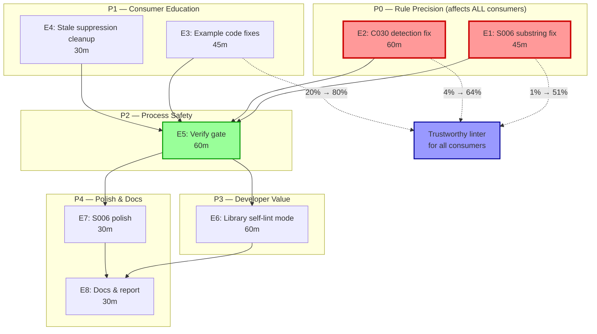

# cqrs-lint Self-Analysis: Precision Fixes & Cleanup

> **Date**: 2026-07-30
> **Trigger**: Ran `cqrs-lint` on the go-cqrs-lite monorepo itself
> **Result**: 66 unsuppressed findings, health score 0/100, 12 stale suppressions
> **Root cause**: Two rule-precision bugs (S006, C030) + self-referential noise (35 findings) + real example-code issues (6 findings) + stale suppressions (12)

---

## 1. Pareto Breakdown

### 1% → 51% of value

**Fix S006 substring matching bug.** Short STRONG indicators `pan` and `aba` match common English words via `strings.Contains`:

- `pan` (Primary Account Number) matches `panel` → false ERROR on `DetailsPanelConfig`
- `aba` (ABA routing number) matches `database` → false ERROR on `DiskStats.DatabaseBytes`

This hits **every consumer** with `Panel`, `Database`, `Japan`, `Panda`, `Abacus` etc. in struct/field names. ERROR severity false positives destroy trust in the linter.

**Fix**: Remove `pan` and `aba` from `strongFinancial` (the full forms `cardnumber` and `routingnumber` already cover the real use cases). Add `primaryaccountnumber` as an explicit long-form indicator.

### 4% → 64% of value

**Fix C030 detection gaps.** The rule only recognizes the literal expression `ctx.Done` (exact identifier name `ctx`, selector `.Done`). All 7 findings on the library are false positives:

| Pattern                           | Current             | Fix                                  | FP eliminated                     |
| --------------------------------- | ------------------- | ------------------------------------ | --------------------------------- |
| `.Done()` on any context variable | Missed (only `ctx`) | Match `.Done` on any receiver        | 2 (sse.go, wait_for_version.go)   |
| `ctx.Err()` cancellation check    | Missed entirely     | Recognize `.Err()` + return/break    | 2 (sse_replay.go, pg_listener.go) |
| Bounded loops with `break`        | Flagged as infinite | Skip loops containing `break`        | 1 (graph/memory_read.go)          |
| Custom stop channels              | Missed entirely     | Recognize `<-stop`/`<-done` patterns | 1 (benchkit/metrics.go)           |
| Blocking `stream.Recv()`          | Flagged             | Add nolint (idiomatic gRPC)          | 1 (grpc/event_client.go)          |

### 20% → 80% of value

**Fix example code quality + clean stale suppressions.** The examples are the first thing consumers copy. Discarded errors (`_ = RegisterTyped(...)`) teach bad practices. 12 stale `//cqrs-lint:ignore(...)` comments are dead code that confuses readers.

### Remaining 80% → 100%

- Library self-lint mode (auto-detect `go-cqrs-lite` module path, suppress consumer-only rules)
- Verify gate (`nix run .#verify-fast`, `cmd/doc-check`)
- Flaky benchkit soak test investigation
- S006 polish (max() builtin, edge-case tests)
- Status report & documentation

---

## 2. Comprehensive Plan (30–100 min tasks)

| #   | Epic                          | Scope                                                                                  | Impact                      | Effort  | Est | Risk     |
| --- | ----------------------------- | -------------------------------------------------------------------------------------- | --------------------------- | ------- | --- | -------- |
| E1  | **S006 precision fix**        | Remove `pan`/`aba`, add `primaryaccountnumber`, regression tests                       | CRITICAL (all consumers)    | Small   | 45m | None     |
| E2  | **C030 precision fix**        | 4 detection improvements + regression tests + 1 nolint                                 | HIGH (all consumers)        | Medium  | 60m | Low      |
| E3  | **Example code quality**      | Fix C028 (×4), C010 (×2), B027 (×4), D007 (×1) in examples + benchkit                  | MEDIUM (consumer education) | Small   | 45m | None     |
| E4  | **Stale suppression cleanup** | Remove 12 dead `//cqrs-lint:ignore(...)` across 6 modules                              | LOW (dead code)             | Trivial | 30m | None     |
| E5  | **Verify gate**               | Run `nix run .#verify-fast`, `cmd/doc-check`, investigate flaky tests                  | HIGH (process safety)       | Medium  | 60m | None     |
| E6  | **Library self-lint mode**    | Auto-detect module path, suppress A001/A008/A020/A021/A023/E005/E007 for library files | MEDIUM (developer value)    | Medium  | 60m | Moderate |
| E7  | **S006 polish**               | max() builtin, edge-case tests (db/gorm/sql tags, ctx.Packages path)                   | LOW (internal quality)      | Small   | 30m | None     |
| E8  | **Docs & status report**      | Write session status report, update IMPROVEMENT_IDEAS.md                               | LOW (record keeping)        | Small   | 30m | None     |

**Total estimated effort: ~5.5 hours**

---

## 3. Detailed Breakdown (≤12 min per task)

### Epic E1: S006 Precision Fix (45m)

| Task  | Description                                                                                                   | Est |
| ----- | ------------------------------------------------------------------------------------------------------------- | --- |
| E1.1  | Remove `pan` and `aba` from `strongFinancial` list in `s006.go`                                               | 3m  |
| E1.2  | Add `primaryaccountnumber` to `strongFinancial` list                                                          | 3m  |
| E1.3  | Add regression test: `DetailsPanelConfig` struct with `Sections []string json:"sections"` → must NOT fire     | 5m  |
| E1.4  | Add regression test: `DatabaseStats` struct with `DatabaseBytes int64 json:"databaseBytes"` → must NOT fire   | 5m  |
| E1.5  | Add regression test: `PrimaryAccountNumber string json:"pan"` → MUST fire (long-form indicator)               | 5m  |
| E1.6  | Verify existing S006 tests still pass (12 tests, `go test -race`)                                             | 5m  |
| E1.7  | Re-run `cqrs-lint --only S006` on library → 0 findings expected                                               | 3m  |
| E1.8  | Run `gofumpt -w` + `goimports -w` on modified files                                                           | 2m  |
| E1.9  | Update S006 test count if needed (meta_test.go)                                                               | 2m  |
| E1.10 | Verify `GOFLAGS="-tags=goexperiment.jsonv2" GOWORK=off golangci-lint run ./pkg/rules/security/...` → 0 issues | 5m  |

### Epic E2: C030 Precision Fix (60m)

| Task  | Description                                                                                         | Est |
| ----- | --------------------------------------------------------------------------------------------------- | --- |
| E2.1  | Read `c030.go` full implementation (confirm exact matching logic)                                   | 3m  |
| E2.2  | Fix `loopHasCtxDone`: match `.Done` on ANY receiver, not just `ctx`                                 | 8m  |
| E2.3  | Add `loopHasCtxErr`: detect `.Err()` call followed by `return` or `break`                           | 10m |
| E2.4  | Add `loopHasBreak`: detect `break` statement in loop body (bounded loop)                            | 8m  |
| E2.5  | Add `loopHasStopChannel`: detect `case <-<name>:` where name ends in `stop`/`done`/`quit`/`close`   | 10m |
| E2.6  | Update `loopHasCtxDone` to call all four check functions                                            | 3m  |
| E2.7  | Add regression test: `r.Context().Done()` in select → must NOT fire                                 | 5m  |
| E2.8  | Add regression test: `if ctx.Err() != nil { return }` → must NOT fire                               | 5m  |
| E2.9  | Add regression test: bounded loop `for { ...; if cond { break } }` → must NOT fire                  | 5m  |
| E2.10 | Add regression test: `case <-rs.stop: return` → must NOT fire                                       | 5m  |
| E2.11 | Add nolint for gRPC `stream.Recv()` blocking pattern (idiomatic, not fixable)                       | 3m  |
| E2.12 | Verify existing C030 tests still pass                                                               | 3m  |
| E2.13 | Re-run `cqrs-lint --only C030` on library → 1 finding (gRPC nolint'd, rest suppressed by detection) | 3m  |
| E2.14 | Run golangci-lint on c030.go → 0 issues                                                             | 3m  |

### Epic E3: Example Code Quality (45m)

| Task | Description                                                                           | Est |
| ---- | ------------------------------------------------------------------------------------- | --- |
| E3.1 | Fix C028 in `benchkit/benchmodel.go:157`: handle `RegisterTyped` error                | 5m  |
| E3.2 | Fix C028 in `benchkit/benchmodel.go:173`: handle `RegisterTyped` error                | 5m  |
| E3.3 | Fix C028 in `example/readme-quickstart/main.go:47`: handle `RegisterTyped` error      | 5m  |
| E3.4 | Fix C028 in `example/readme-quickstart/main.go:61`: handle `Dispatch` error           | 5m  |
| E3.5 | Fix C010 in `example/getting-started/main.go:99`: handle `DecodePayloadAuto` error    | 5m  |
| E3.6 | Fix C010 in `example/getting-started/main.go:105`: handle `DecodePayloadAuto` error   | 5m  |
| E3.7 | Fix B027 in `example/getting-started/main.go:53,119`: extract `"Counter"` to constant | 5m  |
| E3.8 | Fix B027 in `example/readme-quickstart/main.go:49,63`: extract `"User"` to constant   | 5m  |
| E3.9 | Verify examples compile: `go build` each example module                               | 5m  |

### Epic E4: Stale Suppression Cleanup (30m)

| Task  | Description                                                                                                                            | Est |
| ----- | -------------------------------------------------------------------------------------------------------------------------------------- | --- |
| E4.1  | Remove stale C008 suppression at `benchkit/artifacts.go:65`                                                                            | 2m  |
| E4.2  | Remove stale C008 suppression at `benchkit/generator.go:20`                                                                            | 2m  |
| E4.3  | Remove stale B006 suppression at `catalog/services.go:252`                                                                             | 2m  |
| E4.4  | Remove stale C027 suppression at `transport/event_client.go:35`                                                                        | 2m  |
| E4.5  | Remove stale C027 suppression at `transport/event_server.go:33`                                                                        | 2m  |
| E4.6  | Remove stale C027 suppression at `transport/sse.go:77`                                                                                 | 2m  |
| E4.7  | Remove 4 stale C027 suppressions in `watermill/` (bus_helpers.go, catchup_subscriber.go, command_subscriber_adapter.go, subscriber.go) | 5m  |
| E4.8  | Remove stale C027 at `projectionhost/worker_drain.go:160`                                                                              | 2m  |
| E4.9  | Remove stale C027 at `stack/run_projections.go:49`                                                                                     | 2m  |
| E4.10 | Verify each module still compiles and tests pass                                                                                       | 8m  |

### Epic E5: Verify Gate (60m)

| Task | Description                                                       | Est |
| ---- | ----------------------------------------------------------------- | --- |
| E5.1 | Run `nix run .#verify-fast` (build + vet + test + lint)           | 12m |
| E5.2 | If verify fails: read error, identify root cause                  | 10m |
| E5.3 | Run `cmd/doc-check` on edited docs                                | 5m  |
| E5.4 | If doc-check fails: fix invalid import paths/symbols              | 5m  |
| E5.5 | Investigate flaky benchkit soak tests (run with `-count=3 -race`) | 10m |
| E5.6 | Apply flaky test fix (testing.Short() skip or threshold raise)    | 8m  |
| E5.7 | Re-run verify-fast to confirm GREEN                               | 10m |

### Epic E6: Library Self-Lint Mode (60m)

| Task | Description                                                                                                                               | Est |
| ---- | ----------------------------------------------------------------------------------------------------------------------------------------- | --- |
| E6.1 | Add `IsLibrarySelf` field to `FeatureProfile` (auto-detect via `ModulePath` containing `go-cqrs-lite`)                                    | 10m |
| E6.2 | Wire detection in `feature_detect.go`: set `IsLibrarySelf = true` when any package path starts with `github.com/larsartmann/go-cqrs-lite` | 8m  |
| E6.3 | Add self-suppression to A001 detector: `if ctx.FeatureProfile.IsLibrarySelf { return nil }`                                               | 3m  |
| E6.4 | Add self-suppression to A008, A020, A021, A023 detectors                                                                                  | 5m  |
| E6.5 | Add self-suppression to E005, E007 detectors                                                                                              | 5m  |
| E6.6 | Add `--library` CLI flag as manual override (for non-go-cqrs-lite libraries)                                                              | 8m  |
| E6.7 | Add integration test: run linter on event/ module with library-mode → 0 architecture FP                                                   | 10m |
| E6.8 | Update README.md with library-mode documentation                                                                                          | 5m  |
| E6.9 | Run golangci-lint on modified files                                                                                                       | 3m  |

### Epic E7: S006 Polish (30m)

| Task | Description                                                             | Est |
| ---- | ----------------------------------------------------------------------- | --- |
| E7.1 | Replace `maxTier` helper with Go 1.21+ `max()` builtin                  | 3m  |
| E7.2 | Add edge-case test: `db:` tag serialization gate                        | 5m  |
| E7.3 | Add edge-case test: `gorm:` tag serialization gate                      | 5m  |
| E7.4 | Add edge-case test: `sql:` tag serialization gate                       | 5m  |
| E7.5 | Add edge-case test: multi-file `moduleHasEncryption` via `ctx.Packages` | 8m  |
| E7.6 | Run golangci-lint on s006.go → 0 issues                                 | 2m  |

### Epic E8: Documentation & Status Report (30m)

| Task | Description                                                                    | Est |
| ---- | ------------------------------------------------------------------------------ | --- |
| E8.1 | Write status report to `docs/status/`                                          | 10m |
| E8.2 | Update IMPROVEMENT_IDEAS.md: mark library-mode as done, update S006/C030 notes | 5m  |
| E8.3 | Update AGENTS.md with C030/S006 fix notes if needed                            | 5m  |
| E8.4 | Run `cmd/doc-check` on all edited docs                                         | 5m  |
| E8.5 | Final `cqrs-lint` self-run: confirm reduced findings                           | 5m  |

---

## 4. Execution Graph

## 5. Risk Assessment

| Risk                                                           | Mitigation                                                                                                                                      |
| -------------------------------------------------------------- | ----------------------------------------------------------------------------------------------------------------------------------------------- |
| C030 fixes make detection too lenient → real bugs slip through | Each new pattern requires a specific AST shape (not heuristic). Tests assert BOTH positive and negative cases.                                  |
| Library-mode hides real bugs in library source                 | Only suppress consumer-only rules (A001 "embed BasicCommand" makes no sense for BasicCommand itself). Correctness rules (C-series) stay active. |
| Example fixes break compilation                                | Each example module compiled individually after changes.                                                                                        |
| Stale suppression removal changes behavior                     | Stale = rule no longer fires at that location. Removal is purely cosmetic.                                                                      |

## 6. Definition of Done

- [ ] S006: 0 false positives when running on library source
- [ ] C030: ≤1 finding on library (gRPC nolint'd)
- [ ] Example code: 0 C028/C010 findings
- [ ] Stale suppressions: 0 stale warnings
- [ ] `nix run .#verify-fast` GREEN
- [ ] `cmd/doc-check` passes on edited docs
- [ ] Status report written
- [ ] Committed and pushed
