# cqrs-lint Improvement Ideas: Pareto Execution Plan

> **Date:** 2026-07-30
> **Scope:** 75 open items from `cmd/cqrs-lint/IMPROVEMENT_IDEAS.md` (Sections 11 + Extended Ideas 134-179)
> **Goal:** Turn an unmanaged backlog into a prioritized, actionable execution plan
>
> **Update 2026-07-31:** 17 items are ✅ DONE (see status column below). L1.14
> (`--self-lint` flag) was implemented differently as auto-detection via
> `IsLibrarySelfLint()` in the 23:22 hardening session — functionally equivalent.
> E010/E011/E013/E014 were rewritten with type-aware matching (hardening session),
> closing the "architecturally wrong" quality gap. C030/S006 were reviewed and found
> correct (no change needed). ~29 items remain open; the linter now has 175 rules.

---

## 1. Pareto Breakdown

### The Problem

The IMPROVEMENT_IDEAS.md backlog has **75 open items** spanning linter DX, new rules, infrastructure, and extended pattern-detection ideas. It has become a dumping ground for "wouldn't it be nice" suggestions alongside genuine bug fixes and high-value rule proposals. The unmanaged backlog is itself a problem — it creates decision paralysis and makes it impossible to see what actually matters.

### The 1% That Delivers 51% of the Result

| Item               | What                                       | Why It's #1                                                                                                                       |
| ------------------ | ------------------------------------------ | --------------------------------------------------------------------------------------------------------------------------------- |
| **130**            | Fix `extractRuleID` snippet fallback       | Real bug RIGHT NOW: comma-separated suppressions silently fail in test contexts. Makes the entire suppression system trustworthy. |
| **Prune 25 items** | Mark won't-implement with one-line reasons | Removes decision paralysis. An unmanaged backlog of 75 items is worse than a managed backlog of 50.                               |

### The 4% That Delivers 64% of the Result

Everything above PLUS:

| Item    | What                                                  | Why                                                                                                                                                      |
| ------- | ----------------------------------------------------- | -------------------------------------------------------------------------------------------------------------------------------------------------------- |
| **168** | Error swallowing in command handlers                  | `_ = dispatch.Dispatch(...)` or `if err != nil { return nil }` in `RegisterTyped` handlers. THE #1 handler bug across all 45 consumer projects.          |
| **169** | Error swallowing in projection handlers (extend C010) | C010 only catches `Decode`/`Unmarshal` swallowed errors. SQL errors (`Exec`, `Query`, `Scan`) are silently dropped.                                      |
| **102** | Domain-based severity calibration                     | Financial aggregates (bank-sync, timesheets) should get stricter rules than internal tools. Makes all 151 existing rules smarter instead of adding more. |

### The 20% That Delivers 80% of the Result

Everything above PLUS:

| Item    | What                           | Why                                                                |
| ------- | ------------------------------ | ------------------------------------------------------------------ |
| **164** | Missing health checks          | Kubernetes survival pattern for server-mode projects               |
| **165** | Missing graceful shutdown      | `bundle.GracefulClose` + `projectionhost.Stop` on SIGTERM          |
| **142** | Encryption/signing mismatch    | Bus encrypted but store cleartext = security theater               |
| **134** | Custom retry bitshift bug gap  | DiscordSync has a real `<< time.Duration` bug B008 should catch    |
| **140** | Unbounded in-memory growth     | `map[string]T` in SubscribeAll handler = OOM killer                |
| **129** | C017 trace WithEventStore      | Replace file-level band-aid with actual store-type tracing         |
| **150** | Money as float64 (extend C008) | Financial correctness — float64 for money is always wrong          |
| **131** | Self-lint flag                 | Reduce 181 inline suppressions to one CLI flag                     |
| **132** | CI self-lint job               | Gate regressions — new rules must not break the self-lint baseline |
| **139** | Context propagation gaps       | `context.Background()` in handler breaks tracing                   |

### The Remaining 20% (to get to 100%)

Everything above PLUS 25 more items: quality-of-life DX features (103, 104, 112, 113, 117, 121, 133), cross-module consistency rules (143-145), SQLite hardening rules (166-167), error/concurrency/data-model rules (135-138, 151-153, 170-179), and the ambitious new-category proposals (108-111).

---

## 2. Item Disposition (75 Items)

### Prune: 25 Items (Won't Implement)

| Item | Reason                                                                                         |
| ---- | ---------------------------------------------------------------------------------------------- |
| 99   | Adapter detection too niche — use `.cqrs-lint.json` profile flag instead                       |
| 100  | cqrs-htmx detection — config flag, not a detector rule                                         |
| 101  | Event-capture architecture — config flag, not a detector rule                                  |
| 105  | "Respect project conventions" is too fuzzy to implement reliably                               |
| 107  | Maturity-based confidence is heuristic noise — a bug is a bug at any codebase size             |
| 114  | Diff mode requires stateful caching of prior runs — different product scope                    |
| 115  | Fix-all is dangerous without review; C001 auto-fix works because it's surgical                 |
| 116  | Interactive suppression is a different product (interactive CLI UX)                            |
| 118  | `doctor` command already provides profile analysis                                             |
| 119  | Compare command is feature creep beyond linter scope                                           |
| 120  | Upgrade-check is feature creep beyond linter scope                                             |
| 122  | Incremental analysis is premature optimization for ~45-project ecosystem                       |
| 124  | Memory-bounded analysis is premature optimization — measure first                              |
| 146  | cqrs-htmx `journalFromStore` belongs in cqrs-htmx's own config                                 |
| 147  | cqrs-htmx DLQ concern belongs in cqrs-htmx's own config                                        |
| 148  | cqrs-htmx `waitForDrain` belongs in cqrs-htmx's own repo                                       |
| 149  | cqrs-htmx `ProjectionStatusEntry` duplication is a cqrs-htmx code issue                        |
| 156  | v3-to-v4 migration blockers — niche, all consumers are on v4                                   |
| 157  | Feature flag cleanup — niche, low frequency                                                    |
| 158  | "Suggest event storming docs" is a tutorial system, not a correctness tool (overlaps F-series) |
| 159  | "Suggest CQRS diagram" is a tutorial system (overlaps F-series)                                |
| 160  | "Suggest read model tier upgrade" is a tutorial system (overlaps F-series)                     |
| 161  | "Suggest snapshot strategy" is a tutorial system                                               |
| 162  | "Suggest StrictApply" is a DUPLICATE of B021                                                   |
| 163  | "Suggest BDD tests" is a DUPLICATE of T001                                                     |

### Will Implement: 50 Items

See Level 1 and Level 2 tables below.

---

## 3. LEVEL 1: Comprehensive Task Breakdown (30-100 min tasks)

> Sorted by **importance / impact / effort / customer-value**.
> Pareto tier marked: **[P1]** = 51% result, **[P4]** = 64% result, **[P20]** = 80% result, **[P80]** = remaining 20%.

### Phase 1: Triage & Bug Fixes

| #    | Task                                                                  | Items    | Pareto   | Impact                                    | Effort | Dependencies | Status  |
| ---- | --------------------------------------------------------------------- | -------- | -------- | ----------------------------------------- | ------ | ------------ | ------- |
| L1.1 | Fix `extractRuleID` snippet fallback (return all comma-separated IDs) | 130      | **[P1]** | Critical (suppression system correctness) | 30 min | None         | ✅ DONE |
| L1.2 | Prune 25 won't-implement items from IMPROVEMENT_IDEAS.md              | 25 items | **[P1]** | High (unblocks planning)                  | 30 min | None         | ✅ DONE |

### Phase 2: High-Value Rules (The 4%)

| #    | Task                                                                             | Items | Pareto   | Impact                              | Effort  | Dependencies | Status  |
| ---- | -------------------------------------------------------------------------------- | ----- | -------- | ----------------------------------- | ------- | ------------ | ------- |
| L1.3 | Implement error swallowing in command handlers (NEW rule C031)                   | 168   | **[P4]** | Critical (catches #1 handler bug)   | 90 min  | None         | ✅ DONE |
| L1.4 | Implement error swallowing in projection handlers (extend C010 to SQL errors)    | 169   | **[P4]** | Critical (extends existing rule)    | 90 min  | L1.3         | ✅ DONE |
| L1.5 | Implement domain-based severity calibration (add `DomainBias` to FeatureProfile) | 102   | **[P4]** | Strategic (makes all rules smarter) | 100 min | None         | Open    |

### Phase 3: Production Safety Rules (The 20%)

| #     | Task                                                                              | Items | Pareto    | Impact                            | Effort | Dependencies | Status         |
| ----- | --------------------------------------------------------------------------------- | ----- | --------- | --------------------------------- | ------ | ------------ | -------------- |
| L1.6  | Implement missing health checks detection (NEW rule E-series)                     | 164   | **[P20]** | High (K8s survival)               | 90 min | L1.5         | ✅ DONE (E016) |
| L1.7  | Implement missing graceful shutdown detection                                     | 165   | **[P20]** | High (K8s survival)               | 90 min | L1.6         | ✅ DONE (E017) |
| L1.8  | Implement encryption/signing mismatch detection (NEW rule S-series)               | 142   | **[P20]** | High (architectural security bug) | 90 min | None         | ✅ DONE (S010) |
| L1.9  | Fix C017: trace `WithEventStore()` call arguments instead of file-level heuristic | 129   | **[P20]** | Medium (removes band-aid)         | 90 min | None         | Open           |
| L1.10 | Extend C008 to detect money as float64/float32                                    | 150   | **[P20]** | High (financial correctness)      | 45 min | None         | ✅ DONE        |
| L1.11 | Extend B008 to catch bitshift backoff bug variant                                 | 134   | **[P20]** | Medium (real bug in DiscordSync)  | 60 min | None         | ✅ DONE        |
| L1.12 | Implement unbounded in-memory growth detection (NEW rule P-series)                | 140   | **[P20]** | Medium (OOM prevention)           | 90 min | None         | ✅ DONE (P011) |
| L1.13 | Implement context propagation gap detection (NEW rule C-series)                   | 139   | **[P20]** | Medium (tracing correctness)      | 90 min | None         | ✅ DONE (C032) |

### Phase 4: Infrastructure & DX

| #     | Task                                                                            | Items | Pareto    | Impact                          | Effort | Dependencies | Status |
| ----- | ------------------------------------------------------------------------------- | ----- | --------- | ------------------------------- | ------ | ------------ | ------ |
| L1.14 | Implement `--self-lint` flag (auto-exclude library module paths)                | 131   | **[P20]** | High (reduces 181 suppressions) | 90 min | None         | Open   |
| L1.15 | Add CI step: `cqrs-lint` self-lint must pass on own repo                        | 132   | **[P20]** | High (regression gate)          | 60 min | L1.14        | Open   |
| L1.16 | Implement migration paths in findings (add `Suggestion` / `FixHint` to Finding) | 103   | **[P80]** | Medium (DX quality)             | 90 min | None         | Open   |
| L1.17 | Implement doc links in findings (add `DocURL` to Finding + catalog entries)     | 104   | **[P80]** | Medium (DX quality)             | 60 min | L1.16        | Open   |
| L1.18 | Implement config inheritance (parent `.cqrs-lint.json` with local overrides)    | 121   | **[P80]** | Medium (monorepo support)       | 60 min | None         | Open   |
| L1.19 | Implement feature adoption scorecard (beyond health score)                      | 113   | **[P80]** | Medium (DX quality)             | 90 min | None         | Open   |
| L1.20 | Implement grouped output by aggregate/domain                                    | 112   | **[P80]** | Medium (DX quality)             | 90 min | None         | Open   |
| L1.21 | Add SARIF rule metadata (doc URL, severity, remediation in SARIF output)        | 117   | **[P80]** | Medium (GitHub Code Scanning)   | 60 min | L1.17        | Open   |
| L1.22 | Implement block-level suppression (`//cqrs-lint:ignore-start` / `ignore-end`)   | 133   | **[P80]** | Medium (DX quality)             | 90 min | L1.1         | Open   |
| L1.23 | Verify parallel rule safety + add linter benchmark suite                        | 123   | **[P80]** | Low (premature but cheap)       | 60 min | None         | Open   |

### Phase 5: Cross-Module & Integration Rules

| #     | Task                                                | Items | Pareto    | Impact                        | Effort | Dependencies | Status         |
| ----- | --------------------------------------------------- | ----- | --------- | ----------------------------- | ------ | ------------ | -------------- |
| L1.24 | Implement checkpoint/event store backend mismatch   | 144   | **[P80]** | Medium (replay correctness)   | 45 min | None         | Open           |
| L1.25 | Implement idempotency/event store backend mismatch  | 145   | **[P80]** | Medium (dedup correctness)    | 45 min | None         | Open           |
| L1.26 | Implement snapshot/event codec mismatch             | 143   | **[P80]** | Low (rare)                    | 60 min | None         | Open           |
| L1.27 | Implement missing WAL mode for SQLite detection     | 166   | **[P80]** | Medium (SQLite best practice) | 45 min | None         | ✅ DONE (P012) |
| L1.28 | Implement missing busy_timeout for SQLite detection | 167   | **[P80]** | Medium (SQLite best practice) | 45 min | None         | Open           |

### Phase 6: Deep Pattern Detection

| #     | Task                                                                | Items | Pareto    | Impact                     | Effort | Dependencies | Status |
| ----- | ------------------------------------------------------------------- | ----- | --------- | -------------------------- | ------ | ------------ | ------ |
| L1.29 | Implement event type string typo detection (cross-ref fold vs emit) | 135   | **[P80]** | Medium (silent event drop) | 90 min | None         | Open   |
| L1.30 | Implement orphaned event types detection (extend E006 for adapters) | 136   | **[P80]** | Low-medium                 | 90 min | None         | Open   |
| L1.31 | Implement orphaned commands detection (extend E005 for HTTP layer)  | 137   | **[P80]** | Low-medium                 | 60 min | None         | Open   |
| L1.32 | Extend D006: stricter error family detection in domain files        | 138   | **[P80]** | Medium (consistency)       | 60 min | None         | Open   |
| L1.33 | Implement goroutine leak in event handler detection                 | 141   | **[P80]** | Medium (resource leak)     | 60 min | None         | Open   |

### Phase 7: Domain & Data Model Rules

| #     | Task                                                         | Items | Pareto    | Impact                | Effort | Dependencies | Status         |
| ----- | ------------------------------------------------------------ | ----- | --------- | --------------------- | ------ | ------------ | -------------- |
| L1.34 | Extend C013: timestamp without timezone in projections       | 151   | **[P80]** | Medium (timezone bug) | 45 min | None         | Open           |
| L1.35 | Implement PII in event payloads without encryption/redaction | 152   | **[P80]** | Medium (compliance)   | 90 min | None         | Open           |
| L1.36 | Implement event payload struct size limit (>20 fields)       | 153   | **[P80]** | Low (maintainability) | 45 min | None         | Open           |
| L1.37 | Implement string IDs instead of branded IDs                  | 176   | **[P80]** | Medium (type safety)  | 45 min | None         | ✅ DONE (A032) |
| L1.38 | Implement event payload without json tags                    | 177   | **[P80]** | Low (convention)      | 30 min | None         | ✅ DONE (D014) |
| L1.39 | Implement branded ID misuse detection                        | 175   | **[P80]** | Low (hard to detect)  | 90 min | None         | Open           |
| L1.40 | Extend C013: embedded `time.Time` in payloads                | 178   | **[P80]** | Low (timezone)        | 45 min | None         | Open           |
| L1.41 | Implement nullable pointer fields in event payloads          | 179   | **[P80]** | Low (nil-deref)       | 45 min | None         | ✅ DONE (D015) |

### Phase 8: Error Handling & Concurrency Rules

| #     | Task                                                          | Items | Pareto    | Impact                 | Effort | Dependencies | Status         |
| ----- | ------------------------------------------------------------- | ----- | --------- | ---------------------- | ------ | ------------ | -------------- |
| L1.42 | Implement missing error wrapping detection                    | 171   | **[P80]** | Medium (debuggability) | 90 min | None         | ✅ DONE (C033) |
| L1.43 | Extend B011: panic in all marshal helpers                     | 170   | **[P80]** | Low (crash prevention) | 45 min | None         | Open           |
| L1.44 | Implement race condition in read model (map without mutex)    | 172   | **[P80]** | Medium (data race)     | 60 min | None         | Open           |
| L1.45 | Implement shared mutable state in event handler (extend A015) | 173   | **[P80]** | Low (overlaps A015)    | 45 min | None         | Open           |
| L1.46 | Implement goroutine without context cancellation              | 174   | **[P80]** | Medium (overlaps C030) | 60 min | None         | ✅ DONE (C034) |

### Phase 9: New Rule Categories (Ambitious)

| #     | Task                                                                     | Items | Pareto    | Impact                   | Effort  | Dependencies |
| ----- | ------------------------------------------------------------------------ | ----- | --------- | ------------------------ | ------- | ------------ |
| L1.47 | Implement DOC-series: missing docs, stale catalog, undocumented events   | 108   | **[P80]** | Ambitious (new category) | 100 min | All above    |
| L1.48 | Implement OBS-series: tracing spans, metrics, structured logging         | 109   | **[P80]** | Ambitious (new category) | 100 min | L1.5         |
| L1.49 | Implement RES-series: retry, circuit breaker, DLQ, graceful shutdown     | 110   | **[P80]** | Ambitious (new category) | 100 min | L1.6, L1.7   |
| L1.50 | Implement DI-series: optimistic concurrency, idempotency, tx consistency | 111   | **[P80]** | Ambitious (new category) | 100 min | None         |

### Phase 10: Stack Preset Awareness

| #     | Task                                                                     | Items | Pareto    | Impact                           | Effort | Dependencies |
| ----- | ------------------------------------------------------------------------ | ----- | --------- | -------------------------------- | ------ | ------------ |
| L1.51 | Implement stack preset boundary awareness (skip rules when stack/* used) | 106   | **[P80]** | Medium (reduces false positives) | 90 min | L1.5         |

---

## 4. LEVEL 2: Atomic Task Breakdown (max 12 min each)

> Each Level 1 task decomposed into micro-steps.
> Standard new-rule template applies to all detector implementations (L1.3-L1.13, L1.24-L1.46).

### Standard New-Rule Template (repeated ~30 times)

| Step | Action                                                                                                      | Time   |
| ---- | ----------------------------------------------------------------------------------------------------------- | ------ |
| S1   | Read 1-2 existing rule detectors in the same category for patterns                                          | 5 min  |
| S2   | Implement detector function (AST walk for target pattern)                                                   | 10 min |
| S3   | Write positive test (pattern that SHOULD trigger)                                                           | 8 min  |
| S4   | Write negative test (pattern that should NOT trigger)                                                       | 8 min  |
| S5   | Write suppression test (verify `//cqrs-lint:ignore(RULE)` works)                                            | 5 min  |
| S6   | Register detector in `register.go`                                                                          | 3 min  |
| S7   | Add catalog entry in `catalog_extra.go` (ID, Name, Category, Severity, Confidence)                          | 5 min  |
| S8   | Bump detector count in `meta_test.go`                                                                       | 3 min  |
| S9   | Update IMPROVEMENT_IDEAS.md (strike through item, add "done" note)                                          | 5 min  |
| S10  | Build + vet + test: `GOWORK=off go build -tags "goexperiment.jsonv2" ./... && go test -count=1 -race ./...` | 8 min  |
| S11  | Update summary table in IMPROVEMENT_IDEAS.md (rule count + open ideas count)                                | 5 min  |

**Total per new rule: ~65 min** (fits in one 90-min Level 1 slot with buffer)

### Standard Extension Template (extending existing rules, repeated ~8 times)

| Step | Action                                            | Time   |
| ---- | ------------------------------------------------- | ------ |
| E1   | Read the existing detector being extended         | 5 min  |
| E2   | Add new pattern to the detector's detection logic | 10 min |
| E3   | Write test for new pattern                        | 8 min  |
| E4   | Verify existing tests still pass (no regression)  | 5 min  |
| E5   | Update IMPROVEMENT_IDEAS.md                       | 5 min  |
| E6   | Build + vet + test                                | 8 min  |

**Total per extension: ~41 min**

### Standard Infrastructure Template (non-rule changes, repeated ~10 times)

| Step | Action                                                   | Time   |
| ---- | -------------------------------------------------------- | ------ |
| I1   | Read affected code (parser, CLI, output formatter, etc.) | 8 min  |
| I2   | Implement the feature/change                             | 10 min |
| I3   | Write test for the new behavior                          | 10 min |
| I4   | Verify existing tests pass                               | 5 min  |
| I5   | Update documentation/IMPROVEMENT_IDEAS.md                | 5 min  |
| I6   | Build + vet + test                                       | 8 min  |

**Total per infrastructure task: ~46 min**

---

### Specific Level 2 Breakdowns (Non-Standard Tasks)

#### L1.1: Fix extractRuleID (Item 130) — Bug Fix

| Step | Action                                                                                                                        | Time  |
| ---- | ----------------------------------------------------------------------------------------------------------------------------- | ----- |
| 1.1a | Read `parser.go:140-210` (`checkSuppressionInSnippet` + `extractRuleID`)                                                      | 5 min |
| 1.1b | Replace `extractRuleID` to return ALL comma-separated IDs (or replace `checkSuppressionInSnippet` to use `ParseSuppressions`) | 8 min |
| 1.1c | Write test: snippet with `ignore(A001,E005)` and finding for E005 must suppress                                               | 8 min |
| 1.1d | Build + test `pkg/suppression/...`                                                                                            | 5 min |

#### L1.2: Prune 25 Items — Documentation

| Step | Action                                                                                             | Time  |
| ---- | -------------------------------------------------------------------------------------------------- | ----- |
| 1.2a | Strike through items 99-101, 105, 107, 114-116, 118-120, 122, 124, 146-149 in IMPROVEMENT_IDEAS.md | 8 min |
| 1.2b | Strike through items 156-163 with one-line reasons                                                 | 8 min |
| 1.2c | Update summary table: reduce open item count                                                       | 5 min |
| 1.2d | Update header line 7 (total idea count stays, but open count drops)                                | 3 min |

#### L1.5: Domain Severity Calibration (Item 102) — Infrastructure

| Step | Action                                                                                                                       | Time   |
| ---- | ---------------------------------------------------------------------------------------------------------------------------- | ------ |
| 1.5a | Read `feature_profile.go` (FeatureProfile struct, detection logic)                                                           | 8 min  |
| 1.5b | Add `DomainBias` field + `DomainKind` enum (`unknown`, `financial`, `internal`, `security`)                                  | 10 min |
| 1.5c | Add detection: scan for financial keywords (`amount`, `balance`, `payment`, `invoice`, `salary`) in event/command type names | 10 min |
| 1.5d | Add `ConfigFeatures.DomainBias` mirror for config-file override                                                              | 5 min  |
| 1.5e | Wire domain bias into severity escalation (financial + S002/S005 → error)                                                    | 10 min |
| 1.5f | Write tests: financial project detected, internal project not escalated                                                      | 10 min |
| 1.5g | Build + test                                                                                                                 | 8 min  |

#### L1.9: Fix C017 WithEventStore Tracing (Item 129) — Bug Fix

| Step | Action                                                                                             | Time   |
| ---- | -------------------------------------------------------------------------------------------------- | ------ |
| 1.9a | Read `c017.go` and `fileUsesMemoryEventStore`                                                      | 5 min  |
| 1.9b | Implement `traceEventStoreType`: walk `WithEventStore(...)` call args, resolve to constructor name | 10 min |
| 1.9c | Replace `fileUsesMemoryEventStore` band-aid with `traceEventStoreType`                             | 8 min  |
| 1.9d | Update tests (multi-file scenario: store in file A, snapshot in file B)                            | 10 min |
| 1.9e | Build + test                                                                                       | 8 min  |

#### L1.14: Self-Lint Flag (Item 131) — Infrastructure

| Step  | Action                                                                                                 | Time   |
| ----- | ------------------------------------------------------------------------------------------------------ | ------ |
| 1.14a | Read CLI flag parsing (`run.go`, `main.go`)                                                            | 5 min  |
| 1.14b | Add `--self-lint` flag to CLI                                                                          | 5 min  |
| 1.14c | Implement path filter: when set, auto-suppress findings in files matching `go-cqrs-lite/` module paths | 10 min |
| 1.14d | Write test: library file finding auto-suppressed when flag set                                         | 8 min  |
| 1.14e | Build + test                                                                                           | 8 min  |

#### L1.15: CI Self-Lint Job (Item 132) — Infrastructure

| Step  | Action                                                        | Time   |
| ----- | ------------------------------------------------------------- | ------ |
| 1.15a | Read `.github/workflows/ci.yml`                               | 5 min  |
| 1.15b | Add job step: build cqrs-lint, run on repo with `--self-lint` | 8 min  |
| 1.15c | Verify job passes locally (dry run)                           | 10 min |
| 1.15d | Commit workflow change                                        | 5 min  |

#### L1.16-L1.17: Migration Paths + Doc Links (Items 103, 104) — Infrastructure

| Step  | Action                                                                  | Time   |
| ----- | ----------------------------------------------------------------------- | ------ |
| 1.16a | Add `Suggestion string` and `DocURL string` fields to `finding.Finding` | 5 min  |
| 1.16b | Add `Suggestion` and `DocURL` to catalog entry struct                   | 5 min  |
| 1.16c | Wire catalog suggestion/URL into finding creation                       | 8 min  |
| 1.16d | Update SARIF/JSON/markdown formatters to include new fields             | 8 min  |
| 1.16e | Add doc URLs to 5-10 high-value catalog entries as proof of concept     | 10 min |
| 1.16f | Write tests                                                             | 8 min  |
| 1.16g | Build + test                                                            | 8 min  |

---

## 5. Execution Graph

```mermaid
graph TD
    %% Phase 1: Triage
    L1_1["L1.1: Fix extractRuleID bug<br/>(item 130) — 30min"]
    L1_2["L1.2: Prune 25 items<br/>— 30min"]

    %% Phase 2: High-Value Rules
    L1_3["L1.3: Error swallowing in cmd handlers<br/>(item 168) — 90min"]
    L1_4["L1.4: Error swallowing in proj handlers<br/>(item 169) — 90min"]
    L1_5["L1.5: Domain severity calibration<br/>(item 102) — 100min"]

    %% Phase 3: Production Safety
    L1_6["L1.6: Missing health checks<br/>(item 164) — 90min"]
    L1_7["L1.7: Missing graceful shutdown<br/>(item 165) — 90min"]
    L1_8["L1.8: Encryption/signing mismatch<br/>(item 142) — 90min"]
    L1_9["L1.9: C017 trace WithEventStore<br/>(item 129) — 90min"]
    L1_10["L1.10: Money as float64<br/>(item 150) — 45min"]
    L1_11["L1.11: Bitshift backoff gap<br/>(item 134) — 60min"]
    L1_12["L1.12: Unbounded memory growth<br/>(item 140) — 90min"]
    L1_13["L1.13: Context propagation gaps<br/>(item 139) — 90min"]

    %% Phase 4: Infrastructure
    L1_14["L1.14: Self-lint flag<br/>(item 131) — 90min"]
    L1_15["L1.15: CI self-lint job<br/>(item 132) — 60min"]
    L1_16["L1.16: Migration paths in findings<br/>(item 103) — 90min"]
    L1_17["L1.17: Doc links in findings<br/>(item 104) — 60min"]
    L1_18["L1.18: Config inheritance<br/>(item 121) — 60min"]
    L1_19["L1.19: Adoption scorecard<br/>(item 113) — 90min"]
    L1_20["L1.20: Grouped output<br/>(item 112) — 90min"]
    L1_21["L1.21: SARIF metadata<br/>(item 117) — 60min"]
    L1_22["L1.22: Block-level suppression<br/>(item 133) — 90min"]
    L1_23["L1.23: Parallel safety + benchmarks<br/>(item 123) — 60min"]

    %% Phase 5-8: Value Rules
    L1_24["L1.24-28: Cross-module + SQLite rules<br/>(144,145,143,166,167) — 4x45-60min"]
    L1_29["L1.29-33: Deep pattern detection<br/>(135,136,137,138,141) — 5x60-90min"]
    L1_34["L1.34-41: Domain/data model rules<br/>(151-153,176-179,175) — 8x30-90min"]
    L1_42["L1.42-46: Error/concurrency rules<br/>(171,170,172-174) — 5x45-90min"]

    %% Phase 9: New Categories
    L1_47["L1.47: DOC-series<br/>(item 108) — 100min"]
    L1_48["L1.48: OBS-series<br/>(item 109) — 100min"]
    L1_49["L1.49: RES-series<br/>(item 110) — 100min"]
    L1_50["L1.50: DI-series<br/>(item 111) — 100min"]

    %% Phase 10: Stack awareness
    L1_51["L1.51: Stack preset awareness<br/>(item 106) — 90min"]

    %% Dependencies
    L1_1 --> L1_2
    L1_2 --> L1_3
    L1_2 --> L1_5
    L1_2 --> L1_8
    L1_2 --> L1_9
    L1_2 --> L1_10
    L1_2 --> L1_11

    L1_3 --> L1_4
    L1_5 --> L1_6
    L1_6 --> L1_7

    L1_1 --> L1_22

    L1_5 --> L1_48
    L1_6 --> L1_49
    L1_7 --> L1_49

    L1_14 --> L1_15
    L1_16 --> L1_17
    L1_17 --> L1_21

    %% Parallel tracks (no deps)
    L1_2 -.-> L1_24
    L1_2 -.-> L1_29
    L1_2 -.-> L1_34
    L1_2 -.-> L1_42

    %% Gate
    L1_24 --> L1_47
    L1_29 --> L1_47
    L1_42 --> L1_50
    L1_5 --> L1_51

    %% Styling
    classDef p1 fill:#f9d0c4,stroke:#c0392b,stroke-width:3px
    classDef p4 fill:#fdebd0,stroke:#e67e22,stroke-width:2px
    classDef p20 fill:#d5f5e3,stroke:#27ae60,stroke-width:2px
    classDef p80 fill:#d6eaf8,stroke:#2980b9,stroke-width:1px
    classDef future fill:#e8daef,stroke:#8e44ad,stroke-width:1px,stroke-dasharray:5 5

    class L1_1,L1_2 p1
    class L1_3,L1_4,L1_5 p4
    class L1_6,L1_7,L1_8,L1_9,L1_10,L1_11,L1_12,L1_13,L1_14,L1_15 p20
    class L1_16,L1_17,L1_18,L1_19,L1_20,L1_21,L1_22,L1_23,L1_24,L1_29,L1_34,L1_42 p80
    class L1_47,L1_48,L1_49,L1_50,L1_51 future
```

**Legend:**

- Red = P1 (51% result) — do first, no exceptions
- Orange = P4 (64% result) — do immediately after P1
- Green = P20 (80% result) — do next, high ROI
- Blue = P80 (remaining 20%) — do when bandwidth allows
- Purple dashed = Future (new categories, do last)

---

## 6. Summary Statistics

| Metric                            | Value                                                                     |
| --------------------------------- | ------------------------------------------------------------------------- |
| Total open items                  | 75                                                                        |
| Items to prune (won't implement)  | 25                                                                        |
| Items to implement                | 50                                                                        |
| Level 1 tasks                     | 51 (2 triage + 48 implementation + 1 stack-awareness)                     |
| Level 2 steps (standard template) | ~350 micro-steps                                                          |
| New rules to create               | ~15 (C031, S010, P011, E008-E015, DOC/OBS/RES/DI series)                  |
| Existing rules to extend          | ~10 (C008, C010, C013, C017, B008, B011, D006, E005, E006, A015)          |
| Infrastructure features           | ~10 (self-lint flag, CI job, migration paths, doc links, scorecard, etc.) |
| Estimated total effort            | ~55 hours                                                                 |

---

## 7. What NOT to Do (Anti-Verschlimmbesserung Checklist)

1. **Don't implement 158-163** — These are "suggest" rules (tutorial system), not "detect" rules. The linter is a correctness tool, not a coaching bot. F001-F017 already covers feature adoption coaching.

2. **Don't add items 114-116** — Diff mode, fix-all, and interactive suppression are different products. The linter should detect and report, not manage state or drive interactive workflows.

3. **Don't add items 118-120** — `doctor` already exists for profiling. Compare/upgrade-check are scope creep.

4. **Don't add items 122, 124** — Premature optimization. The linter targets ~45 projects, not million-LOC monorepos. Measure first, optimize if needed.

5. **Don't add items 146-149** — cqrs-htmx-specific rules belong in cqrs-htmx's own `.cqrs-lint.json` config, not in core detector rules. Core rules must be backend/framework-agnostic.

6. **Don't implement 162-163** — These are duplicates of existing rules B021 and T001.

7. **Don't rush new categories (108-111)** — 151 rules across 10 categories is already broad. Add new categories only after existing coverage is proven in CI (item 132).

---

## 8. Priority Execution Order (Top 15)

| Priority | Task                                          | Why First                                          |
| -------- | --------------------------------------------- | -------------------------------------------------- |
| 1        | L1.1: Fix extractRuleID (130)                 | Real bug, 30 min, makes suppression system correct |
| 2        | L1.2: Prune 25 items                          | 30 min, makes backlog manageable                   |
| 3        | L1.3: Error swallowing in cmd handlers (168)  | #1 handler bug across all consumers                |
| 4        | L1.4: Error swallowing in proj handlers (169) | Extends C010, high-value extension                 |
| 5        | L1.10: Money as float64 (150)                 | 45 min, financial correctness, extends C008        |
| 6        | L1.5: Domain severity calibration (102)       | Strategic — makes all rules smarter                |
| 7        | L1.8: Encryption/signing mismatch (142)       | Architectural security bug                         |
| 8        | L1.9: C017 trace WithEventStore (129)         | Removes band-aid, 90 min                           |
| 9        | L1.14: Self-lint flag (131)                   | Reduces 181 suppressions to 1 flag                 |
| 10       | L1.15: CI self-lint job (132)                 | Regression gate                                    |
| 11       | L1.6: Missing health checks (164)             | K8s survival                                       |
| 12       | L1.7: Missing graceful shutdown (165)         | K8s survival                                       |
| 13       | L1.11: Bitshift backoff gap (134)             | Real bug in DiscordSync                            |
| 14       | L1.12: Unbounded memory growth (140)          | OOM prevention                                     |
| 15       | L1.13: Context propagation gaps (139)         | Tracing correctness                                |
