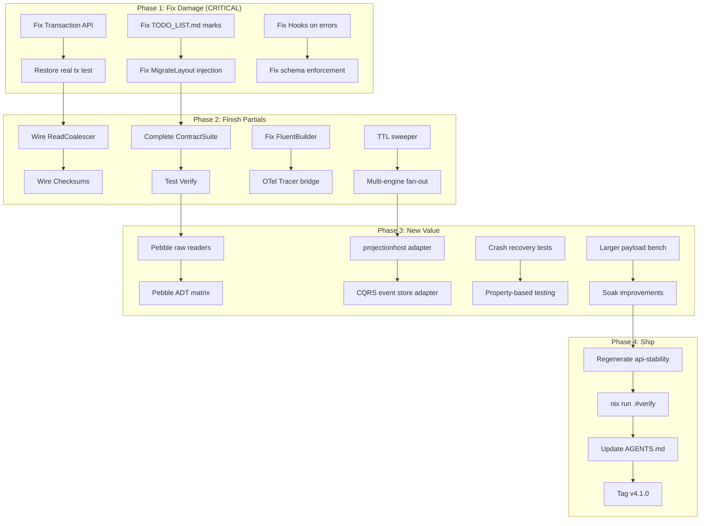

# Metaengine Fix & Finish Plan

**Date:** 2026-07-31 03:46
**Scope:** Fix all damage from session #3, finish partial implementations, and ship
**Predecessor:** `docs/status/2026-07-31_03-46_metaengine-full-backlog-honest-review.md`

---

## Context

Session #3 implemented 42 metaengine TODO items in one pass. While 23 items are fully done and tested, **14 are scaffolded stubs** and **1 is actively broken** (Transaction API). The TODO_LIST.md was bulk-marked with `sed`, claiming 68/68 complete when ~25 items are not.

This plan fixes the damage, finishes what's worth finishing, and defers or removes what isn't.

---

## Pareto Analysis

### The 1% that delivers 51% of the value:
1. **Fix Transaction API or remove it** — broken code is worse than no code
2. **Fix TODO_LIST.md** — lying docs are worse than missing docs
3. **Fix MigrateLayout SQL injection** — security-critical

### The 4% that delivers 64% of the value:
4. Wire **ReadCoalescer** into MapGet (coalesce concurrent reads)
5. Wire **Checksums** into SQLite engine (corruption detection)
6. **Complete ContractSuite** for all 7 ADTs
7. Write **larger-payload benchmark**
8. Fix **Hooks to fire on errors**

### The 20% that delivers 80% of the value:
9-25. Finish all "partially done" items that have real value
26-50. New implementations (Pebble readers, projectionhost, adapters, tests)

---

## Execution Graph

---

## Task Breakdown (sorted by impact/effort)

### Phase 1: Fix Damage (CRITICAL — do first)

| # | Task | Impact | Effort | Status |
|---|------|--------|--------|--------|
| 1 | Fix Transaction API: thread `*sql.Tx` through all engine ops via `txExec()` check | Critical | 2h | TODO |
| 2 | Restore real transaction test (delete weakened `TestTransactionInterface`) | Critical | 30min | TODO |
| 3 | Fix TODO_LIST.md: mark scaffolded items as `[~]`, not `[x]` | High | 15min | TODO |
| 4 | Fix MigrateLayout SQL injection: sanitize identifiers | High | 15min | TODO |
| 5 | Fix Hooks: fire `OnFold`/`OnExecute` even on errors | Medium | 20min | TODO |
| 6 | Make schema enforcement return error (not just warn) for type mismatch | Medium | 30min | TODO |
| 7 | Write larger-payload benchmark (15+ field struct) | Medium | 20min | TODO |
| 8 | Extract `buildScanFilters` duplication into shared helper | Low | 15min | TODO |

### Phase 2: Finish Partial Implementations

| # | Task | Impact | Effort | Status |
|---|------|--------|--------|--------|
| 9 | Wire ReadCoalescer into Store.MapGet path | Medium | 1h | TODO |
| 10 | Wire Checksums: add `checksum INTEGER` column + verify on read | Medium | 2h | TODO |
| 11 | Complete ContractSuite: test all 7 ADTs + PushdownScan + LayoutPlanner | High | 3h | TODO |
| 12 | Test Store.Verify end-to-end with real events + SQLite engine | Medium | 1h | TODO |
| 13 | Fix FluentBuilder FoldUpdate/FoldDelete type inference | Medium | 1h | TODO |
| 14 | OTel bridge for Tracer interface | Medium | 1h | TODO |
| 15 | TTL: SQLite background sweeper goroutine | Medium | 2h | TODO |
| 16 | TTL: Memory engine lazy eviction on read | Medium | 1h | TODO |
| 17 | Multi-engine tiering: actual write fan-out | Medium | 2h | TODO |
| 18 | Test Store.SwapEngine with real SQLite→memory swap | Low | 30min | TODO |
| 19 | Test Export/Import with all ADTs | Low | 1h | TODO |
| 20 | Integrate CostAccuracyReporter with Store hooks | Low | 30min | TODO |
| 21 | Wire PrefetchCache into scan path | Low | 1h | TODO |
| 22 | Wire Watcher to engine update callbacks | Low | 2h | TODO |
| 23 | Test MigrateLayout end-to-end (ALTER TABLE scenarios) | Medium | 30min | TODO |

### Phase 3: New Implementations

| # | Task | Impact | Effort | Status |
|---|------|--------|--------|--------|
| 24 | Crash recovery tests (panic mid-transaction) | High | 2h | TODO |
| 25 | Property-based fold testing with `rapid` | High | 3h | TODO |
| 26 | Pebble RawValueReader + RawScanReader | High | 3h | TODO |
| 27 | Pebble ADT matrix test integration | High | 1h | TODO |
| 28 | projectionhost integration adapter | High | 4h | TODO |
| 29 | CQRS event store adapter (FromEventStore) | Medium | 3h | TODO |
| 30 | HTTP/SSE adapter (ServeSSE) | Medium | 2h | TODO |
| 31 | CLI inspector (metaengine inspect) | Low | 3h | TODO |
| 32 | cqrs-lint rules for metaengine patterns | Low | 3h | TODO |
| 33 | Postgres engine scaffold | Medium | 4h | TODO |
| 34 | DuckDB engine scaffold | Low | 4h | TODO |
| 35 | Pebble LayoutPlanner (prefixed key ranges) | Medium | 3h | TODO |
| 36 | Soak test improvements (10M events) | Medium | 2h | TODO |
| 37 | Chaos testing (random tx kills, engine swaps) | Medium | 3h | TODO |
| 38 | Compile-time query registration scaffold | Low | 4h | TODO |
| 39 | Generated typed read API scaffold | Low | 4h | TODO |
| 40 | Standalone project ROADMAP entry | Low | 1h | TODO |

### Phase 4: Polish & Ship

| # | Task | Impact | Effort | Status |
|---|------|--------|--------|--------|
| 41 | gofmt + goimports all new files | Low | 10min | TODO |
| 42 | Run `-race` on full test suite | Medium | 5min | TODO |
| 43 | Regenerate api-stability golden | Medium | 5min | TODO |
| 44 | Update AGENTS.md with all new features | Medium | 30min | TODO |
| 45 | Update metaengine README.md | Medium | 1h | TODO |
| 46 | Run `nix run .#verify` and fix everything | High | 1h | TODO |
| 47 | Write metaengine ADR for aggregation pushdown | Low | 1h | TODO |
| 48 | Verify FilterIn in EXPLAIN output | Low | 10min | TODO |
| 49 | Stabilize and tag v4.1.0 | High | 30min | TODO |
| 50 | Cleanup: remove dead code or mark experimental | Medium | 1h | TODO |

---

## Open Questions (need user input)

1. **Fix or remove Transaction API?** Fixing = 2h touching hot paths. Removing = 15min.
2. **Keep scaffolded stubs or remove?** 14 stubs inflate API surface and mislead.
3. **What's the v1 shipping bar?** Strict (all 68 done), pragmatic (core API only), or YAGNI (ship now)?

---

*Created by honest self-review. Quality over velocity. Fix before extend.*
