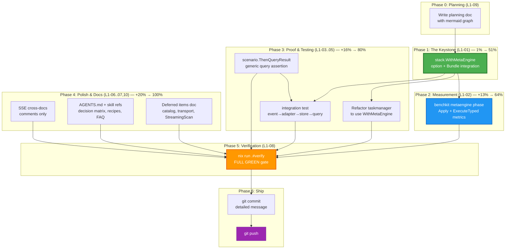
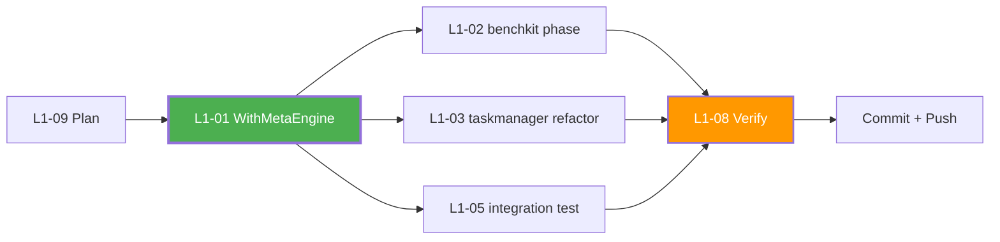

# Metaengine First-Class Integration — Master Plan

> **Date:** 2026-07-31 17:34
> **Status:** ~~PLANNING — not yet executed~~ **EXECUTED** — see
> [`docs/status/2026-07-31_18-45_metaengine-first-class-integration-execution.md`](../status/2026-07-31_18-45_metaengine-first-class-integration-execution.md)
> (all 8 tasks completed: WithMetaEngine, benchkit phase, taskmanager refactor,
> ThenQueryResult, integration test, docs).
> **Goal:** Make metaengine a first-class citizen of the stack composition layer, measured by benchkit, testable via scenario, and proven via integration tests + example refactoring.

---

## 1. Problem Statement

metaengine is described in `AGENTS.md` as _"THE STRATEGIC FUTURE of this project"_ — a cost-based storage planner with 7 ADTs, 3 fully-implemented engines, SSE streaming, cursor pagination, and layout planning. It is architecturally sound, substantially complete, and has ~52 test files.

**But it is a parallel island.** It has zero production dependencies on the rest of the library. It is consumed by exactly one bridge module (`projectionadapter`) and one example (`taskmanager`, manually wired). It is absent from:

| Layer                   | Integrated? | Evidence                                                                    |
| ----------------------- | ----------- | --------------------------------------------------------------------------- |
| `stack/` presets        | **NO**      | Zero `metaengine` references in `stack/`                                    |
| `benchkit/`             | **NO**      | Zero `metaengine` references in `benchkit/`                                 |
| `scenario/` testing DSL | **PARTIAL** | Works via `projection.Projection` interface, but no query-result assertions |
| `integration/` tests    | **NO**      | `integration/go.mod` has no metaengine dep                                  |
| `catalog/`              | **NO**      | Zero go-cqrs-lite deps                                                      |
| `cmd/cqrs-bench`        | **NO**      | No metaengine backend in the factory switch                                 |

Meanwhile, `benchkit` is mature (9 phases, 8 profiles, ~100 tests, zero TODOs) but benchmarks **only** the `stack.Bundle` layer — never the metaengine query planner, Apply throughput, or ExecuteTyped read latency.

**The core problem:** The library's composition story is strong _within_ the event-sourcing core, but the strategic future (metaengine) is disconnected from the composition hub (Bundle), the measurement layer (benchkit), and the testing DSL (scenario).

---

## 2. Design Constraints (Non-Negotiable)

These constraints protect the system from **verschlimmbessern** (well-intentioned destruction):

1. **metaengine stays zero-dep at its core.** All integration flows _toward_ metaengine via bridges/options, never the reverse. `metaengine/go.mod` must not gain production deps on `event/`, `command/`, `decider/`, etc.

2. **The dependency direction is stack → metaengine (Tier 5 → Tier 0).** This is a legal, clean dependency. stack/ already depends on Tier 0 modules (codec, kv).

3. **projectionadapter remains the sole bridge.** It is a separate Go module. The stack/ package does NOT import projectionadapter/ — the consumer creates the adapter and passes it to `RunProjections` (which already accepts `projection.Projection`).

4. **No breaking changes to existing APIs.** All new functionality is additive (new options, new fields, new methods).

5. **Options pattern is preserved.** `WithMetaEngine(store)` is a field setter, matching the existing `WithEventSink`, `WithPublisher`, etc. convention in `stack/options.go`.

6. **Close() lifecycle is the critical integration.** When the Bundle closes, the metaengine Store must close too (release SQLite connections, etc.). HealthCheck integration is deferred — the Store is in-process and the interface (`HealthChecker`) is optional.

---

## 3. Pareto Breakdown

### The 1% that delivers 51%

**`stack.WithMetaEngine(store *metaengine.Store)`** — ONE option function.

This single change makes metaengine available through the Bundle, which is the composition hub that ALL 6 presets (memory, sqlite, pebble, postgres, turso, duckdb) use. Without this, metaengine requires ~40 lines of manual setup (`example/taskmanager/metaengine.go:75-131`). With this, it's a one-liner in the preset constructor.

The implementation is minimal:

- Add `metaengine/v4` to `stack/go.mod` (zero deps, negligible binary impact)
- Add `metaEngine *metaengine.Store` private field to `Bundle`
- Add `WithMetaEngine(store)` Option that sets the field + registers the Store as a closer
- Add `Bundle.MetaEngine()` accessor

**Dependency cost:** `metaengine/v4` has ZERO production deps (stdlib + database/sql only). Adding it to `stack/go.mod` adds negligible weight — far lighter than any existing stack dep.

### The 4% that delivers 64%

1. `stack.WithMetaEngine()` (the keystone — 1% above)
2. **benchkit metaengine phase** — `phases_metaengine.go` benchmarks Apply throughput + ExecuteTyped read latency. The Factory already returns a Bundle; if `bundle.MetaEngine() != nil`, the phase opts in.
3. **Refactor taskmanager example** — replace the 40-line manual setup with `WithMetaEngine(store)`, proving the integration works end-to-end.

These three changes transform metaengine from "parallel island" to "first-class citizen that's wired, measured, and proven."

### The 20% that delivers 80%

1-3 above, plus:

4. **scenario.ThenQueryResult** — a generic assertion method on `ProjectionScenario` that takes a query function and expected result. Does NOT import metaengine (takes a `func() (any, error)`), so scenario/ keeps its lean deps.
5. **integration test** — a cross-module test in `integration/` exercising: event → projectionadapter → metaengine.Apply → ExecuteTyped query, through a real stack preset.
6. **AGENTS.md + skill reference updates** — document `WithMetaEngine` in patterns, decision matrix, recipes, modules, FAQ.

### The other 20% (to reach 100%)

7. **SSE cross-documentation** — NOT code consolidation. Add comments in both `metaengine/sse.go` and `transport/http/sse.go` pointing to each other and explaining why they're separate (collection-watch vs bus-to-client).
8. **Deferred items documentation** — catalog bridge, transport wiring convenience, Pebble StreamingScan are explicitly deferred with rationale (see Section 8).

---

## 4. Verschlimmbessern Risk Assessment

| Task                       | Risk                                            | Mitigation                                                                                                         | Verdict     |
| -------------------------- | ----------------------------------------------- | ------------------------------------------------------------------------------------------------------------------ | ----------- |
| `stack.WithMetaEngine()`   | Adds metaengine dep to stack                    | metaengine has ZERO production deps. Binary impact is negligible.                                                  | **SAFE**    |
| benchkit metaengine phase  | benchkit pulls metaengine + projectionadapter   | benchkit ALREADY imports projectionhost. metaengine adds zero deps. projectionadapter is already a transitive dep. | **SAFE**    |
| Refactor taskmanager       | Breaking the working example                    | Keep old code path as fallback; WithMetaEngine is additive. Run example tests.                                     | **SAFE**    |
| scenario.ThenQueryResult   | Expanding scenario deps                         | Takes `func() (any, error)`, NOT metaengine.Store. Zero new deps.                                                  | **SAFE**    |
| integration test           | New dep in integration module                   | integration/ is Tier 6 — depends on everything. Normal.                                                            | **SAFE**    |
| SSE cross-documentation    | Touching working SSE code                       | Comments ONLY. No logic changes.                                                                                   | **TRIVIAL** |
| ~~catalog bridge~~         | Creating unused module                          | No consumer needs it yet. Pure YAGNI.                                                                              | **DEFER**   |
| ~~stack.WithHTTPServer()~~ | Coupling stack to net/http                      | Consumers wire in 5 lines. Adding option adds complexity for marginal value.                                       | **DEFER**   |
| ~~SSE code consolidation~~ | Merging two different-layer SSE implementations | Different semantics (collection-watch vs bus-to-client). High risk, low value.                                     | **DEFER**   |
| ~~Pebble StreamingScan~~   | Complex iterator implementation                 | Real engineering work, not integration. Separate concern.                                                          | **DEFER**   |

---

## 5. Level 1 Task Breakdown (30-100min each)

> Sorted by importance/impact/effort/customer-value.

| #     | Task                                                                                                                                     | Phase           | Impact                                        | Effort | Priority | Depends On |
| ----- | ---------------------------------------------------------------------------------------------------------------------------------------- | --------------- | --------------------------------------------- | ------ | -------- | ---------- |
| L1-01 | **stack.WithMetaEngine() option** — Add metaengine/v4 to stack/go.mod, Bundle field, Option func, accessor, Close() wiring               | 1 (Keystone)    | Critical — enables everything                 | 45min  | P0       | —          |
| L1-02 | **benchkit metaengine phase** — phases_metaengine.go: Apply throughput + ExecuteTyped latency, Config flag, Result fields, runner wiring | 2 (Measurement) | High — validates performance claims           | 70min  | P1       | L1-01      |
| L1-03 | **Refactor taskmanager** — Replace manual setupMetaEngine with WithMetaEngine, prove end-to-end                                          | 3 (Proof)       | High — validates real-world usability         | 30min  | P1       | L1-01      |
| L1-04 | **scenario.ThenQueryResult** — Generic query-result assertion on ProjectionScenario, no metaengine dep                                   | 3 (Testing)     | Medium — enables BDD testing of query results | 30min  | P2       | —          |
| L1-05 | **integration test** — Cross-module: event→adapter→store→query through real stack preset                                                 | 3 (Testing)     | Medium — guards against bridge regressions    | 35min  | P2       | L1-01      |
| L1-06 | **SSE cross-documentation** — Comments in both sse.go files explaining the distinction                                                   | 4 (Polish)      | Low — prevents future confusion               | 15min  | P3       | —          |
| L1-07 | **AGENTS.md + skill references** — Update patterns, decision matrix, recipes, modules, FAQ                                               | 4 (Docs)        | High — discoverability for consumers          | 40min  | P1       | L1-01      |
| L1-08 | **Verify gate** — nix fmt, api-stability -update, doc-check, nix run .#verify                                                            | 4 (Gate)        | Critical — must pass before commit            | 25min  | P0       | All above  |
| L1-09 | **Write this planning document**                                                                                                         | Pre             | Critical — the plan itself                    | 30min  | P0       | —          |
| L1-10 | **Deferred items documentation** — Document catalog/transport/StreamingScan deferrals with rationale                                     | 4 (Polish)      | Low — prevents "why wasn't X done?" confusion | 15min  | P3       | —          |

**Total estimated effort: ~335min (~5.6h)**

---

## 6. Level 2 Task Breakdown (max 12min each)

> Every Level 1 task decomposed into sub-tasks small enough to execute and verify individually.

### L1-01: stack.WithMetaEngine() option (45min → 9 sub-tasks)

| #       | Sub-task                                                                                                                           | Est   | Verifies                    |
| ------- | ---------------------------------------------------------------------------------------------------------------------------------- | ----- | --------------------------- |
| L2-01.1 | Read stack/bundle.go Close() + registerCloser() pattern (lines 143-268)                                                            | 5min  | Understand existing pattern |
| L2-01.2 | Add `metaengine/v4` to `stack/go.mod` via `cd stack && GOWORK=off go get github.com/larsartmann/go-cqrs-lite/metaengine/v4@v4.2.0` | 3min  | `go mod tidy` succeeds      |
| L2-01.3 | Add `metaEngine *metaengine.Store` private field to `Bundle` struct in `bundle.go`                                                 | 3min  | Package compiles            |
| L2-01.4 | Write `WithMetaEngine(store *metaengine.Store) Option` in `options.go` — sets field + calls `b.registerCloser(store)`              | 5min  | `go build` passes           |
| L2-01.5 | Write `Bundle.MetaEngine() *metaengine.Store` accessor in `bundle.go`                                                              | 3min  | `go build` passes           |
| L2-01.6 | Write `stack/metaengine_test.go` — test WithMetaEngine sets field, Close() closes store, accessor returns correct value            | 10min | Test passes                 |
| L2-01.7 | Run `cd stack && GOWORK=off go test -tags "goexperiment.jsonv2" ./... -count=1`                                                    | 3min  | All stack tests pass        |
| L2-01.8 | Run `gofumpt -w stack/*.go && goimports -w stack/*.go`                                                                             | 2min  | Clean format                |
| L2-01.9 | Verify `go vet -tags "goexperiment.jsonv2" ./...` clean                                                                            | 2min  | Zero vet issues             |

### L1-02: benchkit metaengine phase (70min → 11 sub-tasks)

| #        | Sub-task                                                                                                          | Est   | Verifies                                             |
| -------- | ----------------------------------------------------------------------------------------------------------------- | ----- | ---------------------------------------------------- |
| L2-02.1  | Add `metaengine/v4` + `metaengine/projectionadapter/v4` to `benchkit/go.mod`                                      | 5min  | `go mod tidy` succeeds                               |
| L2-02.2  | Read `benchkit/phases_query.go` as the reference phase pattern                                                    | 5min  | Understand Config flag, Result fields, runner wiring |
| L2-02.3  | Design metaengine benchmark: build a Counter ADT store, Apply N events, ExecuteTyped read                         | 5min  | Design review                                        |
| L2-02.4  | Write `phases_metaengine.go` skeleton: function signature, skip-condition, nil check                              | 10min | Compiles                                             |
| L2-02.5  | Implement Apply throughput measurement: batch-apply events, measure latency + ops/sec                             | 10min | Produces metrics                                     |
| L2-02.6  | Implement ExecuteTyped read latency measurement: query the counter, measure p50/p99                               | 10min | Produces metrics                                     |
| L2-02.7  | Add `SkipMetaEngine bool` to `Config` struct in `benchkit.go`                                                     | 3min  | Field exists                                         |
| L2-02.8  | Add Result fields: `MetaEngineApplyLatency`, `MetaEngineQueryLatency`, `MetaEngineApplyThroughput` in `result.go` | 5min  | Fields exist                                         |
| L2-02.9  | Wire phase into `runner.go` runPhases() after projection phase                                                    | 5min  | Phase executes                                       |
| L2-02.10 | Write `phases_metaengine_test.go` — test with memory engine, verify metrics populated                             | 10min | Test passes                                          |
| L2-02.11 | Run `cd benchkit && GOWORK=off go test -tags "goexperiment.jsonv2" ./... -count=1`                                | 5min  | All benchkit tests pass                              |

### L1-03: Refactor taskmanager (30min → 6 sub-tasks)

| #       | Sub-task                                                                                      | Est  | Verifies                |
| ------- | --------------------------------------------------------------------------------------------- | ---- | ----------------------- |
| L2-03.1 | Read `taskmanager/setup.go` — understand current metaengine wiring (lines 20-40, 155-170)     | 5min | Understand current flow |
| L2-03.2 | Add `stack.WithMetaEngine(store)` to the `sqlite.New()` options in setup.go                   | 5min | Option applied          |
| L2-03.3 | Change `Server.MetaEngine` to use `bundle.MetaEngine()` instead of standalone variable        | 5min | Uses accessor           |
| L2-03.4 | Remove standalone `store.Close()` — Bundle.Close() now handles it                             | 3min | No double-close         |
| L2-03.5 | Run `cd example/taskmanager && GOWORK=off go test -tags "goexperiment.jsonv2" ./... -count=1` | 5min | All example tests pass  |
| L2-03.6 | Verify HTTP handler still works (TestMetaEngine_TaskCountsByStatus)                           | 5min | Test passes             |

### L1-04: scenario.ThenQueryResult (30min → 5 sub-tasks)

| #       | Sub-task                                                                                                                   | Est   | Verifies                |
| ------- | -------------------------------------------------------------------------------------------------------------------------- | ----- | ----------------------- |
| L2-04.1 | Read `scenario/dsl.go` ProjectionScenario (lines 196-247) — understand ThenNoError/ThenError patterns                      | 5min  | Understand pattern      |
| L2-04.2 | Design `ThenQueryResult(queryFn func() (any, error), expected any) *ProjectionScenario` — calls fn, compares result        | 5min  | Design review           |
| L2-04.3 | Write `ThenQueryResult` method in `dsl.go` — uses reflect.DeepEqual for comparison, reports mismatch                       | 5min  | Compiles                |
| L2-04.4 | Write test: create a simple counter store via metaengine, apply events via GivenProjection, ThenQueryResult asserts counts | 10min | Test passes             |
| L2-04.5 | Run `cd scenario && GOWORK=off go test -tags "goexperiment.jsonv2" ./... -count=1`                                         | 3min  | All scenario tests pass |

### L1-05: integration test (35min → 5 sub-tasks)

| #       | Sub-task                                                                                                 | Est   | Verifies                   |
| ------- | -------------------------------------------------------------------------------------------------------- | ----- | -------------------------- |
| L2-05.1 | Read `integration/` existing test patterns (e.g., integration/event_test.go)                             | 5min  | Understand structure       |
| L2-05.2 | Add `metaengine/v4` + `metaengine/projectionadapter/v4` to `integration/go.mod`                          | 5min  | go mod tidy succeeds       |
| L2-05.3 | Write `integration/metaengine_test.go` — Test 1: Counter ADT pipeline (event→adapter→Apply→ExecuteTyped) | 10min | Test 1 passes              |
| L2-05.4 | Write Test 2: Map ADT pipeline (multiple event types, key-based query)                                   | 10min | Test 2 passes              |
| L2-05.5 | Run `cd integration && GOWORK=off go test -tags "goexperiment.jsonv2" ./... -count=1`                    | 5min  | All integration tests pass |

### L1-06: SSE cross-documentation (15min → 3 sub-tasks)

| #       | Sub-task                                                                                                         | Est  | Verifies      |
| ------- | ---------------------------------------------------------------------------------------------------------------- | ---- | ------------- |
| L2-06.1 | Add cross-reference comment to `metaengine/sse.go` — "For event-bus-to-client SSE, see transport/http.SSEBroker" | 5min | Comment added |
| L2-06.2 | Add cross-reference comment to `transport/http/sse.go` — "For collection-watch SSE, see metaengine.ServeSSE"     | 5min | Comment added |
| L2-06.3 | Note the distinction in AGENTS.md patterns section                                                               | 5min | Doc updated   |

### L1-07: AGENTS.md + skill references (40min → 6 sub-tasks)

| #       | Sub-task                                                                                | Est   | Verifies            |
| ------- | --------------------------------------------------------------------------------------- | ----- | ------------------- |
| L2-07.1 | Update AGENTS.md Quick Reference modules table — note metaengine stack integration      | 3min  | Table updated       |
| L2-07.2 | Update AGENTS.md Key Patterns — add `WithMetaEngine` code example showing Bundle wiring | 10min | Example added       |
| L2-07.3 | Update `core.md` decision matrix — metaengine now in stack composition row              | 5min  | Matrix updated      |
| L2-07.4 | Update `recipes.md` — add "Metaengine + Stack Bundle Integration" recipe                | 10min | Recipe added        |
| L2-07.5 | Update `modules.md` — note metaengine's stack integration capability                    | 5min  | Description updated |
| L2-07.6 | Update `faq.md` — add "How do I integrate metaengine with my stack?" Q&A                | 5min  | FAQ added           |

### L1-08: Verify gate (25min → 4 sub-tasks)

| #       | Sub-task                                                                                                                   | Est   | Verifies                   |
| ------- | -------------------------------------------------------------------------------------------------------------------------- | ----- | -------------------------- |
| L2-08.1 | Run `nix fmt` (format entire repo)                                                                                         | 5min  | Clean format               |
| L2-08.2 | Run api-stability golden regen: `cd cmd/api-stability && GOWORK=off go run main.go -update`                                | 5min  | Golden matches new exports |
| L2-08.3 | Run doc-check: `cd cmd/doc-check && GOWORK=off go run . ../../AGENTS.md ../../.agents/skills/go-cqrs-lite/references/*.md` | 5min  | All references valid       |
| L2-08.4 | Run `nix run .#verify` (build + vet + test + race + lint + doc-check + api-stability)                                      | 10min | FULL GREEN                 |

### L1-09: Write planning document (30min → 4 sub-tasks)

| #       | Sub-task                                           | Est   | Verifies          |
| ------- | -------------------------------------------------- | ----- | ----------------- |
| L2-09.1 | Write Pareto analysis section (Sections 3-4 above) | 10min | Analysis complete |
| L2-09.2 | Write Level 1 task table (Section 5 above)         | 5min  | Table complete    |
| L2-09.3 | Write Level 2 task table (Section 6 above)         | 10min | Table complete    |
| L2-09.4 | Write mermaid execution graph (Section 7 below)    | 5min  | Graph renders     |

### L1-10: Deferred items documentation (15min → 2 sub-tasks)

| #       | Sub-task                                         | Est   | Verifies             |
| ------- | ------------------------------------------------ | ----- | -------------------- |
| L2-10.1 | Write Section 8 (deferred items) with rationale  | 10min | Rationale documented |
| L2-10.2 | Add deferred items to TODO_LIST.md or ROADMAP.md | 5min  | Items tracked        |

---

## 7. Execution Graph (Mermaid)



### Critical Path



---

## 8. Explicitly Deferred Items (Anti-Verschlimmbessern)

These items are **intentionally NOT in this plan.** Each has a clear rationale.

### 8.1 Catalog Bridge for Metaengine Queries

**What:** A `metaengine/catalogbridge/` module that feeds metaengine query collection schemas (ADT types, fold functions, query declarations) into the catalog for OpenAPI/AsyncAPI documentation.

**Why deferred:** YAGNI. No consumer needs this yet. The catalog is consumer-side registration — adding a bridge module with zero consumers is speculative architecture. Build it when a consumer asks for it.

**Risk of doing it now:** Creates an unused module that rots. Maintenance burden for zero value.

### 8.2 stack.WithHTTPServer() / WithGRPCServer() Convenience

**What:** One-call options that create an SSEBroker or gRPC server and wire it to the Bundle's Publisher/Subscriber.

**Why deferred:** The manual wiring is ~5 lines. Adding options adds complexity to the Bundle for marginal convenience. The transport modules are intentionally separate from stack/ — they're Tier 4, stack is Tier 5.

**Risk of doing it now:** Couples stack/ to `net/http` and `google.golang.org/grpc`. The stack package currently has zero transport deps. Adding them violates the clean separation.

### 8.3 SSE Code Consolidation

**What:** Extract a shared `sse` helper package from `metaengine/sse.go` and `transport/http/sse.go` to eliminate duplicated ring-buffer, drop-old, Last-Event-ID, and heartbeat infrastructure.

**Why deferred:** The two SSE implementations serve fundamentally different layers:

- `metaengine/sse.go` — **collection watch + replay** (watch a metaengine Store collection for changes, replay from journal)
- `transport/http/sse.go` — **event bus to client** (bridge an `event.Bus` to HTTP SSE clients)

They share implementation patterns but NOT semantics. Merging them risks creating a leaky abstraction. The duplicated code is ~80 lines of generic helpers (`forwardWithDropOld`, `sseMainLoop`) that were already extracted in metaengine/sse.go.

**Risk of doing it now:** High. Two different event models (collection mutations vs event bus messages) forced into one abstraction. Breaking either implementation.

### 8.4 Pebble StreamingScan

**What:** Implement the `StreamingScan` interface (OOM-safe lazy `iter.Seq2`) in the Pebble engine, matching SQLite's implementation at `metaengine/sqlite_engine.go:449`.

**Why deferred:** This is real engineering work (Pebble iterator wrapping, lazy decode, error handling), not integration. It belongs in a separate metaengine-focused sprint, not an integration plan.

**Risk of doing it now:** Scope creep. Mixing deep engine work with integration work.

---

## 9. Architecture Impact Summary

### Before (Current State)

```
                    ┌──────────────────┐
                    │   stack.Bundle   │
                    │ EventSink/Source │
                    │ Publisher/Sub    │
                    │ CmdStore/QStore  │
                    │ SnapStore/Cp     │
                    │ ReadModels (kv)  │
                    └────────┬─────────┘
                             │
            ┌────────────────┼────────────────┐
            │                │                │
     memory/sqlite/     pebble/postgres    turso/duckdb
         presets            presets          presets

    metaengine (ISLAND)          benchkit (only benchmarks Bundle)
         │                              │
    projectionadapter            phases (write/read/proj/query/snap)
    (sole bridge)                NO metaengine phase
```

### After (Target State)

```
                    ┌──────────────────────────────┐
                    │        stack.Bundle           │
                    │ EventSink/Source              │
                    │ Publisher/Sub                 │
                    │ CmdStore/QStore               │
                    │ SnapStore/Cp                  │
                    │ ReadModels (kv)               │
                    │ metaEngine *metaengine.Store  │ ← NEW
                    └──────┬─────────────────────────┘
                           │
        ┌──────────────────┼──────────────────┐
        │                  │                  │
  memory/sqlite/      pebble/postgres     turso/duckdb
      presets             presets            presets
                           │
                    bundle.MetaEngine()
                           │
              ┌────────────┴────────────┐
              │                         │
     projectionadapter          benchkit phases_metaengine
     (consumer creates +        (Apply throughput +
      passes to RunProjections)  ExecuteTyped latency)

    scenario.ThenQueryResult     integration/metaengine_test
    (generic query assertion)    (end-to-end pipeline)
```

---

## 10. Key Design Decision: Why WithMetaEngine Takes a *Store (Not Engines+Queries)

**Rejected alternative:** `WithMetaEngineFromPlan(engines []Engine, queries ...Query[any, any])` that calls `metaengine.Plan()` internally.

**Why rejected:** `metaengine.Query[Input, Output]` is a generic type. You cannot pass typed queries through an `any` constraint without losing type safety. The consumer MUST call `metaengine.Plan()` themselves because only they know the concrete `Input` and `Output` types. The Bundle's role is lifecycle management (Close, accessor), not construction.

**This matches the existing pattern:** `WithEventStore(s event.Store)` takes a pre-built store. `WithSnapshotStore(s snapshot.SnapshotStore)` takes a pre-built store. The consumer constructs, the Bundle manages lifecycle.

---

## 11. Files That Will Change

| File                                                                   | Change                                             | New?     |
| ---------------------------------------------------------------------- | -------------------------------------------------- | -------- |
| `stack/go.mod`                                                         | Add `metaengine/v4` require                        | Modified |
| `stack/bundle.go`                                                      | Add `metaEngine` field + accessor                  | Modified |
| `stack/options.go`                                                     | Add `WithMetaEngine()` option                      | Modified |
| `stack/metaengine_test.go`                                             | Test WithMetaEngine lifecycle                      | **NEW**  |
| `benchkit/go.mod`                                                      | Add `metaengine/v4` + `projectionadapter/v4`       | Modified |
| `benchkit/phases_metaengine.go`                                        | Apply + ExecuteTyped benchmark phase               | **NEW**  |
| `benchkit/benchkit.go`                                                 | Add `SkipMetaEngine` to Config                     | Modified |
| `benchkit/result.go`                                                   | Add metaengine Result fields                       | Modified |
| `benchkit/runner.go`                                                   | Wire metaengine phase into runPhases               | Modified |
| `benchkit/phases_metaengine_test.go`                                   | Test the new phase                                 | **NEW**  |
| `example/taskmanager/setup.go`                                         | Use `WithMetaEngine` in sqlite.New                 | Modified |
| `example/taskmanager/metaengine.go`                                    | Simplify (remove standalone Close)                 | Modified |
| `scenario/dsl.go`                                                      | Add `ThenQueryResult` method                       | Modified |
| `scenario/metaengine_test.go`                                          | Test ThenQueryResult with metaengine               | **NEW**  |
| `integration/go.mod`                                                   | Add metaengine + projectionadapter                 | Modified |
| `integration/metaengine_test.go`                                       | End-to-end pipeline test                           | **NEW**  |
| `metaengine/sse.go`                                                    | Cross-reference comment                            | Modified |
| `transport/http/sse.go`                                                | Cross-reference comment                            | Modified |
| `AGENTS.md`                                                            | Update patterns + modules list                     | Modified |
| `.agents/skills/go-cqrs-lite/references/core.md`                       | Decision matrix                                    | Modified |
| `.agents/skills/go-cqrs-lite/references/recipes.md`                    | Integration recipe                                 | Modified |
| `.agents/skills/go-cqrs-lite/references/modules.md`                    | Stack integration note                             | Modified |
| `.agents/skills/go-cqrs-lite/references/faq.md`                        | Integration FAQ                                    | Modified |
| `cmd/api-stability/main.go`                                            | Add `benchkit` + `scenario` if new modules created | Maybe    |
| `docs/planning/2026-07-31_17-34_metaengine-first-class-integration.md` | This file                                          | **NEW**  |

**Total: ~25 files (7 new, 18 modified)**

---

## 12. Verification Checklist

Before claiming done:

- [ ] `stack.WithMetaEngine` compiles and tests pass
- [ ] `benchkit phases_metaengine` benchmarks Apply + ExecuteTyped
- [ ] `taskmanager` example uses `WithMetaEngine` and all tests pass
- [ ] `scenario.ThenQueryResult` works with any query function
- [ ] `integration/metaengine_test.go` passes end-to-end
- [ ] SSE cross-references added (comments only)
- [ ] AGENTS.md + all 4 skill reference files updated
- [ ] `nix fmt` clean
- [ ] `cmd/api-stability -update` golden matches new exports
- [ ] `cmd/doc-check` validates all references
- [ ] `nix run .#verify` FULL GREEN
- [ ] git commit with detailed message
- [ ] git push

---

## 13. Questions Resolved by This Plan

1. **Should metaengine be in stack/ or a separate sub-package?**
   → In `stack/` directly. metaengine has zero deps. The cost is negligible. A sub-package adds module complexity for no benefit.

2. **Should WithMetaEngine call Plan() internally?**
   → No. The consumer calls `metaengine.Plan()` themselves (typed generics), then passes the `*Store` to `WithMetaEngine(store)`. Same pattern as `WithEventStore(s)`.

3. **Should HealthCheck cover metaengine?**
   → Not initially. The Store is in-process; health check is less meaningful than for remote DBs. Can add `HealthChecker` impl to Store later if needed.

4. **Should scenario import metaengine?**
   → No. `ThenQueryResult(fn func() (any, error), expected any)` takes a function, not a Store. Zero new deps for scenario/.

5. **Should the two SSE implementations be consolidated?**
   → No. Different layers, different semantics. Cross-document only.

6. **Should benchkit auto-discover metaengine or require a Config flag?**
   → Auto-discover via `bundle.MetaEngine() != nil` check, with `Config.SkipMetaEngine` override. Same pattern as the projection phase.
