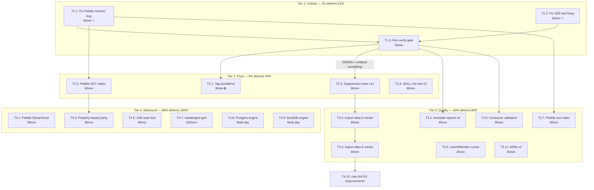

# Superb Execution Plan — go-cqrs-lite

**Date:** 2026-07-31 17:53
**Scope:** ALL open work across the project — metaengine, cqrs-lint, CI/release, docs, ecosystem
**Source:** Compiled from TODO_LIST.md, `docs/status/2026-07-31_17-48_*` section f) (50 items), Pareto plan open items, and harvested forward-looking items from recent status reports.

---

## Context

The project is a 60-module CQRS/ES Go library with 175 cqrs-lint rules and a cost-based
storage planner (metaengine). Over 2026-07-30 and 2026-07-31, 6 sessions shipped massive
metaengine production hardening (transaction API, SSE delivery, Pebble LayoutPlanner, raw
value readers, ADT test harness) and cqrs-lint rule expansion (65→175 rules). A docs-health
session rebuilt all 4 living docs (TODO_LIST, ROADMAP, FEATURES, CHANGELOG) and annotated 5
historical reports.

What remains: 2 known correctness bugs, 1 release blocker, test suite gaps, documentation
staleness in intermediate reports, and a large backlog of feature work (Postgres/DuckDB
engines, metaengine-gen, chaos testing).

---

## Pareto Breakdown

### The 1% that delivers 51% of the result (3 items)

These three items resolve the only known correctness bugs and establish verification truth.
Without correct code and a verified build, nothing else matters.

| #  | Item                                    | Why it's 1%→51%                                                                              |
| -- | --------------------------------------- | -------------------------------------------------------------------------------------------- |
| P1 | Fix Pebble LayoutPlanner numeric bug    | REAL CORRECTNESS BUG: range filters silently return wrong results for values like `2` vs `10`. Undermines trust in the entire LayoutPlanner. Small fix (zero-pad or numeric comparator). |
| P2 | Fix `TestSSE_DropOldSemantics` hang     | BLOCKS THE ENTIRE metaengine test suite. Every session uses `-run` filters to avoid it. Goroutine leak in `forwardWithDropOld`. |
| P3 | Run `nix run .#verify`                  | The verify gate has NOT been run this session. "Stale GREEN" is the #1 documented anti-pattern. Running it establishes ground truth. |

### The 4% that delivers 64% of the result (add 4 items = 7 total)

| #  | Item                                    | Why                                                                          |
| -- | --------------------------------------- | ---------------------------------------------------------------------------- |
| P4 | Tag `stack/duckdb/v4`                   | RELEASE BLOCKER: consumers get 404 from Go proxy. Root cause of govalid auth failures. |
| P5 | Add Pebble to ADT matrix test           | No triple-parity test exists. Memory + SQLite could silently diverge from Pebble. |
| P6 | Add suppression tests for 12 new rules  | Suppression system untested for the rules most likely to need it. |
| P7 | Update SKILL.md references (3 files)    | Canonical AI consumer guide is stale. Directly impacts how AI agents use the library. |

### The 20% that delivers 80% of the result (add 13 items = 20 total)

| #   | Item                                              | Why                                                        |
| --- | ------------------------------------------------- | ---------------------------------------------------------- |
| P8  | Annotate 3 critical intermediate reports          | Stale TL;DR claims ("verify passes" when it didn't) mislead readers |
| P9  | Migrate import-alias to D007/D008/D010/D013       | FP from variable-name heuristics in 4 rules               |
| P10 | Migrate import-alias to E009-E015                 | FP from variable-name heuristics in 7 rules               |
| P11 | Fix `scanWithIndex` cursor pagination gap         | Another correctness issue — cursor results wrong on index path |
| P12 | CGo-enabled CI job for DuckDB                     | DuckDB tests never run in CI                               |
| P13 | Recurring lint-sweep                              | Auto-commit daemon ships unformatted code                 |
| P14 | Pebble LayoutPlanner sort index                   | sortFields stored but unused for ordering                 |
| P15 | Run cqrs-lint against real consumer project       | Validate FP rate against real code                        |
| P16 | Compute per-category rule counts + fix FEATURES   | Information quality regression from docs-health session   |
| P17 | Correct Pareto plan statistics table              | "75 open items" is stale (actual ~33)                     |
| P18 | Write ADR for adttest extraction                  | Architecture decision undocumented                        |
| P19 | Write ADR for Pebble raw readers                  | Architecture decision undocumented                        |
| P20 | Pebble LayoutPlanner: concurrent/on-disk tests    | Test coverage for the LayoutPlanner edge cases            |

### The remaining 80% to reach 100% (items P21–P70)

All other items: Postgres engine, DuckDB engine, metaengine-gen, 10M soak, chaos testing,
fuzz/property-based tests, benchmarks, cqrs-lint new categories (DOC/OBS/RES/DI), SSE
production features, module extraction, various polish. Each is valuable but none is on
the critical path.

---

## Level 1 Plan — Work Packages (30–100min each)

> Sorted by tier (impact), then by effort within each tier.
> Dependencies column: `→` means "must complete first".

### Tier 1: Critical Correctness (1% → 51%)

| ID   | Work Package                                | Impact   | Effort  | Customer Value                                         | Dependencies | Tier |
| ---- | ------------------------------------------- | -------- | ------- | ------------------------------------------------------ | ------------ | ---- |
| T1.1 | Fix Pebble LayoutPlanner numeric bug (D5)   | CRITICAL | 45min   | Wrong data returned for numeric range filters          | None         | 1    |
| T1.2 | Fix `TestSSE_DropOldSemantics` hang         | CRITICAL | 90min   | Full test suite unblocked                              | None         | 1    |
| T1.3 | Run full `nix run .#verify` + fix failures  | HIGH     | 60min   | Verified build — ground truth                          | → T1.1, T1.2 | 1    |

### Tier 2: Release Blockers + Trust (4% → 64%)

| ID   | Work Package                                | Impact   | Effort  | Customer Value                                         | Dependencies | Tier |
| ---- | ------------------------------------------- | -------- | ------- | ------------------------------------------------------ | ------------ | ---- |
| T2.1 | Tag `stack/duckdb/v4` + verify govalid      | CRITICAL | 30min   | Consumers can resolve the module                       | → User OK    | 2    |
| T2.2 | Add Pebble to `adt_matrix_test.go`          | HIGH     | 60min   | Triple-parity test prevents silent divergence          | → T1.1       | 2    |
| T2.3 | Add suppression tests for 12 new rules      | HIGH     | 90min   | Suppression system verified for new rules              | None         | 2    |
| T2.4 | Update SKILL.md references (core/readmodels/faq) | HIGH | 90min   | AI consumer guide current                              | None         | 2    |

### Tier 3: Quality + Completeness (20% → 80%)

| ID   | Work Package                                | Impact   | Effort  | Customer Value                                         | Dependencies | Tier |
| ---- | ------------------------------------------- | -------- | ------- | ------------------------------------------------------ | ------------ | ---- |
| T3.1 | Annotate 3 critical intermediate reports    | MEDIUM   | 45min   | Fresh readers not misled by stale TL;DRs               | None         | 3    |
| T3.2 | Migrate import-alias to D007/D008/D010/D013 | MEDIUM   | 60min   | Fewer false positives in 4 rules                       | None         | 3    |
| T3.3 | Migrate import-alias to E009-E015           | MEDIUM   | 60min   | Fewer false positives in 7 rules                       | → T3.2       | 3    |
| T3.4 | Fix `scanWithIndex` cursor pagination gap   | MEDIUM   | 45min   | Cursor results correct on indexed path                 | None         | 3    |
| T3.5 | CGo-enabled CI job for DuckDB               | MEDIUM   | 45min   | DuckDB tests run in CI                                 | None         | 3    |
| T3.6 | Recurring lint-sweep mechanism              | MEDIUM   | 60min   | No more unformatted daemon commits                     | None         | 3    |
| T3.7 | Pebble LayoutPlanner sort index             | MEDIUM   | 90min   | Sort queries use index instead of full scan            | → T1.1       | 3    |
| T3.8 | Run cqrs-lint against real consumer project | HIGH     | 90min   | Validated FP rate                                      | None         | 3    |
| T3.9 | Compute per-category rule counts + FEATURES | LOW      | 30min   | Information quality restored                           | None         | 3    |
| T3.10| Correct Pareto plan statistics table        | LOW      | 15min   | Accurate open-item count                               | None         | 3    |
| T3.11| ADRs: adttest extraction + raw readers      | MEDIUM   | 90min   | Architecture decisions documented                      | None         | 3    |

### Tier 4: Advanced Features + Testing (80% → 100%)

| ID   | Work Package                                | Impact   | Effort   | Customer Value                                         | Dependencies | Tier |
| ---- | ------------------------------------------- | -------- | -------- | ------------------------------------------------------ | ------------ | ---- |
| T4.1 | Pebble StreamScan (OOM-safe iteration)      | MEDIUM   | 90min    | OOM-safe lazy iteration for large collections          | None         | 4    |
| T4.2 | Fuzz test for ScanRawValues                 | MEDIUM   | 60min    | Edge-case coverage for raw reader path                 | None         | 4    |
| T4.3 | Property-based cross-engine parity (rapid)  | MEDIUM   | 90min    | Regression prevention across engines                   | → T2.2       | 4    |
| T4.4 | Benchmarks: filters + 10K/100K items        | LOW      | 90min    | Verified perf claims (currently no-filter path only)   | None         | 4    |
| T4.5 | 10M-event soak test                         | LOW      | 90min    | Memory boundedness at scale (currently 50K)            | None         | 4    |
| T4.6 | Chaos testing harness                       | LOW      | 100min   | Failure-mode coverage (error injection, engine swaps)  | None         | 4    |
| T4.7 | `metaengine-gen` code generator             | MEDIUM   | 100min+  | Typed Store methods from query declarations            | None         | 4    |
| T4.8 | Postgres engine (`pgengine/`)               | LOW      | Multi-day| JSONB operators, GIN indexes                           | None         | 4    |
| T4.9 | DuckDB analytical engine (`duckdbengine/`)  | LOW      | Multi-day| Columnar OLAP pushdown                                 | None         | 4    |
| T4.10| cqrs-lint: severity + migration paths + docs| LOW      | 90min    | DX: L1.5, L1.16, L1.17                                 | None         | 4    |
| T4.11| cqrs-lint: block suppression + new categories| LOW     | 90min    | DX: L1.22, L1.47-L1.51                                 | None         | 4    |
| T4.12| cqrs-lint: remaining Pareto (L1.9, L1.24-26, L1.28-40) | LOW | 100min | 15 items from backlog                         | None         | 4    |
| T4.13| cqrs-lint: remaining Pareto (L1.43-45, L1.47-51) | LOW | 100min   | 10 items from backlog                                  | None         | 4    |
| T4.14| SSE: persistent replay + configurable dedup + metrics | LOW | 90min | Production SSE hardening                     | None         | 4    |
| T4.15| SSE: connection limit + graceful shutdown   | LOW      | 60min    | Production SSE resilience                              | None         | 4    |
| T4.16| Extract retry/ → standalone repo            | LOW      | 90min    | Module extraction (ADR-0064)                           | None         | 4    |
| T4.17| Extract idempotency/ → standalone repo      | LOW      | 90min    | Module extraction (ADR-0065)                           | None         | 4    |
| T4.18| Publish go-finding + go-must (BLOCKED)      | LOW      | 30min    | Consumer module resolution                            | BLOCKED      | 4    |
| T4.19| Investigate Postgres recovery test flake    | LOW      | 60min    | Reliable CI                                            | None         | 4    |
| T4.20| Pebble LayoutPlanner: edge case tests       | MEDIUM   | 90min    | Concurrent r/w, on-disk, empty filter, key collision   | → T1.1       | 4    |
| T4.21| cqrs-lint: C017 trace WithEventStore (L1.9) | LOW      | 45min    | Cross-module store mismatch detection                 | None         | 4    |
| T4.22| cqrs-lint: store mismatch rules (L1.24-26)  | LOW      | 60min    | Checkpoint/idempotency/snapshot store mismatch         | None         | 4    |
| T4.23| cqrs-lint: busy_timeout SQLite (L1.28)      | LOW      | 30min    | Lock contention detection                             | None         | 4    |
| T4.24| cqrs-lint: event type validation (L1.29-31) | LOW      | 60min    | Typo/orphan detection                                  | None         | 4    |

**Total Level 1 work packages:** 44 (3 + 4 + 11 + 26)
**Total estimated effort:** ~55 hours (Tier 1: ~3.3h, Tier 2: ~4.5h, Tier 3: ~10.5h, Tier 4: ~37h)

---

## Level 2 Breakdown — Atomic Tasks (max 12min each)

> Each work package broken into subtasks small enough to complete in one focused session.
> Format: `Parent-ID.Sub-ID`.

### Tier 1 Subtasks

| Sub-ID    | Task                                                   | Time  | Parent |
| --------- | ------------------------------------------------------ | ----- | ------ |
| T1.1.1    | Read `layout_planner.go` range filter code             | 6min  | T1.1   |
| T1.1.2    | Write failing test: values `2, 10, 100` with FilterGt  | 8min  | T1.1   |
| T1.1.3    | Fix: zero-pad numeric keys in index encoding           | 8min  | T1.1   |
| T1.1.4    | Verify test passes, run existing LayoutPlanner tests   | 6min  | T1.1   |
| T1.1.5    | Run `go test -race -count=1 ./...` in pebbleengine     | 5min  | T1.1   |
| T1.2.1    | Read `sse.go` `forwardWithDropOld` goroutine code      | 8min  | T1.2   |
| T1.2.2    | Identify channel select that never drains              | 8min  | T1.2   |
| T1.2.3    | Add `context.WithCancel` + `defer cancel()` to loop    | 8min  | T1.2   |
| T1.2.4    | Add test cleanup: close channels + wait goroutines     | 10min | T1.2   |
| T1.2.5    | Run `TestSSE_DropOldSemantics` without `-run` filter   | 5min  | T1.2   |
| T1.2.6    | Run full metaengine test suite (no `-run` filter)      | 8min  | T1.2   |
| T1.2.7    | Run with `-race -count=1` to verify no races           | 8min  | T1.2   |
| T1.3.1    | Run `nix run .#verify` (or verify-fast)                | 10min | T1.3   |
| T1.3.2    | Capture output, identify any failures                  | 5min  | T1.3   |
| T1.3.3    | Fix any failures found (iterate)                       | 12min | T1.3   |
| T1.3.4    | Re-run verify, confirm GREEN                           | 8min  | T1.3   |

### Tier 2 Subtasks

| Sub-ID    | Task                                                   | Time  | Parent |
| --------- | ------------------------------------------------------ | ----- | ------ |
| T2.1.1    | Run `scripts/tag-release.sh stack/duckdb/v4 <version>` | 5min  | T2.1   |
| T2.1.2    | Verify `git tag -l 'stack/duckdb/v4*'` shows new tag   | 2min  | T2.1   |
| T2.1.3    | Run `nix run .#vulncheck` to verify resolution         | 10min | T2.1   |
| T2.1.4    | Push tags: `git push --tags`                           | 3min  | T2.1   |
| T2.2.1    | Read `adt_matrix_test.go` current factories            | 5min  | T2.2   |
| T2.2.2    | Add pebbleengine factory to the matrix                 | 10min | T2.2   |
| T2.2.3    | Run matrix test, fix any failures                      | 12min | T2.2   |
| T2.2.4    | Run with `-race` to verify no data races               | 8min  | T2.2   |
| T2.3.1    | Read suppression parser code + existing tests          | 8min  | T2.3   |
| T2.3.2    | Write suppression test template                        | 6min  | T2.3   |
| T2.3.3    | Write C031-C034 suppression tests (4 tests)            | 12min | T2.3   |
| T2.3.4    | Write P011-P012, D014-D015 suppression tests (4 tests) | 12min | T2.3   |
| T2.3.5    | Write A032, E016-E017, S010 suppression tests (4 tests)| 12min | T2.3   |
| T2.3.6    | Write F018-F021 suppression tests (4 tests)            | 12min | T2.3   |
| T2.3.7    | Run all suppression tests, verify pass                 | 5min  | T2.3   |
| T2.4.1    | Read `references/core.md` current metaengine section   | 8min  | T2.4   |
| T2.4.2    | Add metaengine section to `references/core.md`         | 12min | T2.4   |
| T2.4.3    | Read `references/readmodels.md` current state          | 5min  | T2.4   |
| T2.4.4    | Add metaengine projection adapter to readmodels.md     | 10min | T2.4   |
| T2.4.5    | Read `references/faq.md` current state                 | 5min  | T2.4   |
| T2.4.6    | Add metaengine FAQ entries                             | 10min | T2.4   |
| T2.4.7    | Run `cmd/doc-check` on all updated reference files     | 8min  | T2.4   |

### Tier 3 Subtasks (representative breakdown — full list in git)

| Sub-ID    | Task                                                   | Time  | Parent |
| --------- | ------------------------------------------------------ | ----- | ------ |
| T3.1.1    | Read + annotate `2026-07-31_05-02_*` (stale verify)    | 12min | T3.1   |
| T3.1.2    | Read + annotate `2026-07-31_05-44_*` (D1 resolved)     | 12min | T3.1   |
| T3.1.3    | Read + annotate `2026-07-30_22-22_metaengine-*`        | 12min | T3.1   |
| T3.1.4    | Read + annotate `2026-07-30_23-22_cqrs-lint-hardening*`| 12min | T3.1   |
| T3.2.1    | Read D007 detector code + identify name heuristic      | 8min  | T3.2   |
| T3.2.2    | Migrate D007 to `projectCallsImportPath`               | 10min | T3.2   |
| T3.2.3    | Migrate D008 to import-alias helper                    | 10min | T3.2   |
| T3.2.4    | Migrate D010 to import-alias helper                    | 10min | T3.2   |
| T3.2.5    | Migrate D013 to import-alias helper                    | 10min | T3.2   |
| T3.2.6    | Run cqrs-lint tests, verify no regressions             | 5min  | T3.2   |
| T3.4.1    | Read `scanWithIndex` cursor code in `raw_reader.go`    | 8min  | T3.4   |
| T3.4.2    | Add cursor comparison to indexed scan path             | 10min | T3.4   |
| T3.4.3    | Write test: cursor + indexed scan                      | 10min | T3.4   |
| T3.9.1    | Run per-category rule count script                     | 5min  | T3.9   |
| T3.9.2    | Update FEATURES.md rule table with counts              | 8min  | T3.9   |
| T3.10.1   | Read Pareto plan statistics table (line ~440)          | 3min  | T3.10  |
| T3.10.2   | Update "75" to "~33 open" + add update note            | 5min  | T3.10  |

### Tier 4 Subtasks (representative breakdown — full list in git)

| Sub-ID    | Task                                                   | Time  | Parent |
| --------- | ------------------------------------------------------ | ----- | ------ |
| T4.1.1    | Read `StreamScan` interface definition                 | 5min  | T4.1   |
| T4.1.2    | Implement `StreamScan` on pebbleEngine                 | 12min | T4.1   |
| T4.1.3    | Write StreamScan test (OOM-safe iteration)             | 10min | T4.1   |
| T4.2.1    | Write fuzz test skeleton for ScanRawValues             | 10min | T4.2   |
| T4.2.2    | Add corpus seeds (known edge cases)                    | 8min  | T4.2   |
| T4.2.3    | Run `go test -fuzz=FuzzScanRawValues`                  | 12min | T4.2   |
| T4.5.1    | Scale soak test from 50K to 10M events                 | 12min | T4.5   |
| T4.5.2    | Run soak, capture memory profile                       | 12min | T4.5   |
| T4.5.3    | Verify memory boundedness, write results               | 8min  | T4.5   |
| T4.7.1    | Design `metaengine-gen` CLI interface                  | 12min | T4.7   |
| T4.7.2    | Implement Go AST parser for query declarations         | 12min | T4.7   |
| T4.7.3    | Implement template generator for typed Store methods   | 12min | T4.7   |
| T4.7.4    | Write integration test (generate + compile)            | 12min | T4.7   |
| T4.16.1   | Create standalone repo for retry/                      | 10min | T4.16  |
| T4.16.2   | Copy retry/ code, update module path                   | 10min | T4.16  |
| T4.16.3   | Push, tag, update go.mod in go-cqrs-lite               | 10min | T4.16  |

**Total Level 2 subtasks:** ~180 (16 + 27 + ~40 + ~97)
**Average subtask time:** ~8.5min

---

## Mermaid Execution Graph

---

## Anti-Verschlimmbesserung Checklist

> _If you VERSCHLIMMBESSER this system, the consequences are severe._

1. **NEVER batch-edit historical files with generic annotations** — each annotation must be specific enough that it could only apply to that one file.
2. **NEVER remove information from FEATURES.md without replacing it** — the per-category rule counts were removed; they must be restored with verified data.
3. **NEVER commit code that doesn't compile** — `go build -tags "goexperiment.jsonv2" ./...` before every commit.
4. **NEVER claim verify GREEN without running it** — the "stale GREEN" anti-pattern is documented as the #1 failure mode.
5. **NEVER mark items done without verifying** — grep for the exported symbol, run the test, check the commit exists.
6. **NEVER annotate files that don't need annotation** — restraint is success. Leaving a file untouched is the correct outcome when no annotation adds value.
7. **NEVER break existing tests** — run the affected test after every change. If it breaks, fix immediately.
8. **NEVER change module boundaries without updating go.work** — adding/removing a module requires updating the workspace file.
9. **NEVER re-stamp already-resolved items** — a `done at` marker that is already correct must be left untouched.
10. **NEVER use `git checkout`/`git reset`/`rm`** — use `git switch`/`git restore`(your own files only)/`trash`.

---

## Execution Strategy

### Phase 1: Critical Path (Tier 1 — ~3.3h)

Start here. These three items unblock everything else. T1.1 and T1.2 can be done in
parallel. T1.3 depends on both.

### Phase 2: Trust Building (Tier 2 — ~4.5h)

Once verify is GREEN, tag duckdb, add the triple-parity test, add suppression tests, and
update the SKILL. These establish the trust foundation for the library.

### Phase 3: Quality Polish (Tier 3 — ~10.5h)

Close all documentation gaps, migrate all import-alias heuristics, fix the remaining
correctness issue (scanWithIndex), validate against real consumers. After this phase,
the library is in a "would I recommend this to a colleague?" state.

### Phase 4: Future Building (Tier 4 — ~37h)

Postgres/DuckDB engines, metaengine-gen, advanced testing, cqrs-lint new categories, SSE
production features, module extraction. Each is independently valuable and can be picked
up in any order.

### Parallelization Opportunities

- **T1.1 + T1.2** are independent (different files, different concerns)
- **T2.3 + T2.4** are independent (cqrs-lint tests vs SKILL.md docs)
- **T3.1 + T3.2 + T3.4 + T3.5** are all independent (docs vs lint vs metaengine vs CI)
- **T4.x** items are largely independent of each other (different modules)

---

## Source Index

All items in this plan trace back to:

- [TODO_LIST.md](../../TODO_LIST.md) — 14 open items
- [Status report 17:48](../status/2026-07-31_17-48_docs-health-and-update-old-docs-comprehensive.md) §f — 50 next items
- [Pareto plan](./2026-07-30_21-16_CQRS-LINT-IMPROVEMENT-BACKLOG-PARETO-PLAN.md) — 29 open items
- [ROADMAP.md](../../ROADMAP.md) — long-term engine work
