# Backend Tradeoff Vocabulary, Optimization & Honest Benchmarks

> **Date:** 2026-07-31
> **Status:** ~~PLANNING — awaiting execution~~ **EXECUTED** — see
> [`docs/status/2026-07-31_19-58_backend-tradeoff-framework-execution-status.md`](../status/2026-07-31_19-58_backend-tradeoff-framework-execution-status.md)
> (18 of 29 tasks) +
> [`docs/status/2026-07-31_20-32_backend-tradeoff-bugfixes-and-verification.md`](../status/2026-07-31_20-32_backend-tradeoff-bugfixes-and-verification.md)
> (5 critical fixes, verify GREEN). Remaining: P10 Turso indexing, P19 warm/cold
> split, P23–P28 DuckDB options/benchmarks/metaengine CostEstimate.
> **Theme:** Make backend performance honest, comparable, and optimizable through a unified tradeoff framework.

## Context

We ran benchmarks across all 5 backends (memory, pebble, sqlite, duckdb, postgres) and discovered:

1. **Misleading numbers** — `BatchSize=1` on `dev`/`small` profiles makes every SQL backend look terrible (one fsync per event). Postgres at 47 writes/sec is actually 18,200/sec with `synchronous_commit=off` (387x difference).
2. **No mixed workload** — phases are sequential (write all, then read all). The real production question ("can the backend serve reads while writes hammer it?") is never asked.
3. **Orphaned optimizations** — Pebble ships with `&pebble.Options{}` (empty) despite `DefaultOptions()` (bloom filters + compaction) existing one import away. Turso has a full granular pragma API in `storage/turso/indexing/` that the preset never reaches. Postgres has zero pool tuning.
4. **No tradeoff vocabulary** — backends are compared at different durability levels with no shared language. "Strict" vs "Normal" durability means different things per backend but we have no word for it.
5. **Fragmented tradeoff docs** — performance numbers in `docs/performance.md`, access-pattern guidance in `INFRASTRUCTURE_RECOMMENDATIONS.md`, consistency guarantees in `CONSISTENCY_MODEL.md` — but no unified backend x dimension matrix.
6. **Metaengine already has a cost model** (`metaengine/cost.go:29-34`) but only optimizes for latency, ignoring durability, disk space, and write amplification.

## What Is At Stake

This is a **library/SDK**. Consumers import modules and trust them. Every change must be **additive and non-breaking**. The quality gate is: "Would a consumer trust this enough to import it?"

**Verschlimmbessern risks** (things that would make the system WORSE):

- Changing existing profile constants would invalidate historical benchmark comparisons
- Changing Pebble defaults could break consumers who depend on the current (empty) behavior — but bloom filters are transparent (data-compatible), so this is safe
- Adding a DurabilityTier that doesn't match real backend semantics would mislead consumers
- A mixed-workload phase with race conditions would produce flaky benchmarks

**Safe by design**: every proposed change is either (a) additive API (new option functions, new types), (b) documentation, or (c) internal default improvement (Pebble bloom filters).

---

## Pareto Analysis

### The 1% that delivers 51%

These are changes so small they're nearly free, yet so impactful they transform the baseline:

| ID     | Task                                         | Why it's 1%/51%                                                                                                                                                                                                                                                      |
| ------ | -------------------------------------------- | -------------------------------------------------------------------------------------------------------------------------------------------------------------------------------------------------------------------------------------------------------------------- |
| **P1** | Apply Pebble `DefaultOptions()` in preset    | `stack/pebble/preset.go:26` ships `&pebble.Options{}`. `storage/pebble/options.go:22` has `DefaultOptions()` with bloom filters (10 bits/key, ~1% FPR) and `MaxConcurrentCompactions=4`. One-line change. Immediate measurable improvement on every Pebble consumer. |
| **P2** | Document `BatchSize=1` semantics in profiles | Zero code change. Add clear comments to `profiles.go` explaining that `dev`/`small` profiles use `BatchSize=1` (worst-case: one fsync per event) and that `medium`+ use realistic batch sizes. Prevents misinterpretation of benchmark results.                      |

### The 4% that delivers 64%

These create the **shared vocabulary** and **honest tests** that make everything else meaningful:

| ID     | Task                                                 | Why it's 4%/64%                                                                                                                                                                                                                                                                                                                           |
| ------ | ---------------------------------------------------- | ----------------------------------------------------------------------------------------------------------------------------------------------------------------------------------------------------------------------------------------------------------------------------------------------------------------------------------------- |
| **P3** | `DurabilityTier` type + per-backend translation      | The unified vocabulary. Without this, "Postgres is slow" and "Pebble is fast" are meaningless — they're at different durability levels. `DurabilityStrict` / `DurabilityNormal` / `DurabilityRelaxed` with per-backend translation (Postgres `synchronous_commit`, SQLite `synchronous`, Pebble `syncWrites`). Lives in `stack/` package. |
| **P4** | Postgres: surface `synchronous_commit` + pool sizing | `stack/postgres/preset.go:148` calls bare `sql.Open("pgx", dsn)`. Zero tuning. Adding `WithSynchronousCommit(bool)`, `WithPoolSize(maxOpen, maxIdle int)` turns Postgres from worst (47/s) to competitive (18K/s).                                                                                                                        |
| **P5** | Mixed read-during-write benchmark phase              | The real production question. Currently phases are sequential. Add `mixedPhase` with N writer goroutines + M reader goroutines running concurrently against the same store. `ReadRatio` controls the W:R ratio. ~200 lines + test.                                                                                                        |
| **P6** | `docs/BACKEND_TRADEOFFS.md`                          | Single source of truth: backend x dimension matrix (write latency, read latency, durability, disk space, RAM, CGo, distributed, ops burden). Unifies scattered info from 6 docs. Customer-facing: "which backend should I choose?"                                                                                                        |

### The 20% that delivers 80%

| ID      | Task                                                                 | Why it matters                                                                                                                       |
| ------- | -------------------------------------------------------------------- | ------------------------------------------------------------------------------------------------------------------------------------ |
| **P7**  | SQLite: granular `synchronous`, `cache_size`, `busy_timeout` options | Currently all-or-nothing `WithOptimizations()`. Add `WithSynchronous(SyncLevel)`, `WithCacheSize(bytes)`, `WithBusyTimeout(d)`.      |
| **P8**  | Turso: wire `indexing.*` API into preset                             | `storage/turso/indexing/optimizations.go` has `SetCacheSize`, `SetMemoryMap`, `RunOptimize`, `Analyze` — none reachable from preset. |
| **P9**  | `Bundle.Capabilities()` method                                       | Machine-checkable tradeoff matrix. Returns `Capabilities{Persistent, Distributed, DurabilityRange, OLAP, CGoRequired}`.              |
| **P10** | cqrs-bench: add Turso factory                                        | `stack/turso/` exists, passes contract suite, but `cmd/cqrs-bench/factory.go` has no `case "turso"`.                                 |
| **P11** | Warm/cold read split in benchmarks                                   | First read pass is cold (page cache miss). Report separately from warm reads.                                                        |

### The remaining 20% to 100%

| ID      | Task                                              | Why it matters                                                                                                                                         |
| ------- | ------------------------------------------------- | ------------------------------------------------------------------------------------------------------------------------------------------------------ |
| **P12** | DuckDB: surface more config options               | Only `threads` + `memory_limit` exposed. Add `WithPreserveInsertionOrder`, `WithTempDirectory`.                                                        |
| **P13** | DuckDB analytical benchmark phase                 | Don't benchmark a columnar engine with single-row INSERTs. Bulk-load + aggregation scans.                                                              |
| **P14** | metaengine `CostEstimate` extension               | Add `Durability`, `DiskBytesEstimate`, `RAMBytesEstimate`, `WriteAmplification` fields.                                                                |
| **P15** | metaengine budget-based planning                  | `WithLatencyBudget`, `WithDiskBudget`, `WithRAMBudget`, `WithDurability`. Multi-constraint optimizer.                                                  |
| **P16** | Update existing docs with new vocabulary          | `performance.md`, `STORAGE_GUIDE.md`, `CONSISTENCY_MODEL.md`, `PRESETS.md` — cross-link to `BACKEND_TRADEOFFS.md` and use `DurabilityTier` vocabulary. |
| **P17** | Re-run full benchmark suite with all improvements | New comparison data in `docs/benchmarks/` with honest numbers.                                                                                         |

---

## Comprehensive Plan (30-100min tasks)

Sorted by impact (desc) > effort (asc) > customer-value (desc).

| #   | Task                                                              | Impact   | Effort | Customer Value                                                 | Phase               | Depends On |
| --- | ----------------------------------------------------------------- | -------- | ------ | -------------------------------------------------------------- | ------------------- | ---------- |
| 1   | Apply Pebble `DefaultOptions()` in preset + test                  | CRITICAL | 30min  | Every Pebble consumer gets faster reads/writes for free        | Quick Win           | —          |
| 2   | Design `DurabilityTier` type in `stack/` package                  | CRITICAL | 45min  | Unified vocabulary enables honest comparisons                  | Foundation          | —          |
| 3   | `DurabilityTier` translation: SQLite preset                       | HIGH     | 45min  | Consumers can pick `synchronous` level declaratively           | Foundation          | 2          |
| 4   | `DurabilityTier` translation: Pebble preset                       | HIGH     | 30min  | Consumers can pick sync vs async writes                        | Foundation          | 2          |
| 5   | `DurabilityTier` translation: Postgres preset                     | HIGH     | 45min  | The 387x lever becomes a one-liner                             | Foundation          | 2          |
| 6   | `DurabilityTier` translation: Turso preset                        | MEDIUM   | 30min  | Parity with SQLite                                             | Foundation          | 2          |
| 7   | Test `DurabilityTier` across all backends                         | HIGH     | 45min  | Verify translations are correct                                | Foundation          | 3,4,5,6    |
| 8   | Postgres: add `WithPoolSize`, `WithStatementTimeout`              | HIGH     | 45min  | Postgres goes from worst to competitive                        | Backend Surfacing   | 5          |
| 9   | SQLite: add `WithSynchronous`, `WithCacheSize`, `WithBusyTimeout` | HIGH     | 60min  | Granular control over the most common backend                  | Backend Surfacing   | 3          |
| 10  | Turso: wire `indexing.*` API into preset options                  | MEDIUM   | 60min  | Unlocks orphaned optimization API                              | Backend Surfacing   | 6          |
| 11  | Write `docs/BACKEND_TRADEOFFS.md`                                 | CRITICAL | 90min  | Single source of truth for "which backend?"                    | Documentation       | 7          |
| 12  | Design mixed read-during-write benchmark phase                    | HIGH     | 60min  | Tests the real production question                             | Benchmark           | —          |
| 13  | Implement `mixedWorkloadPhase` in benchkit                        | HIGH     | 90min  | Interleaved reads + writes with contention                     | Benchmark           | 12         |
| 14  | Test mixed-workload phase on memory + sqlite                      | HIGH     | 45min  | Verify no race conditions, sane numbers                        | Benchmark           | 13         |
| 15  | Add `--durability` flag to cqrs-bench                             | MEDIUM   | 30min  | Lets users benchmark at specific durability tiers              | Tooling             | 7          |
| 16  | Add Turso factory to cqrs-bench                                   | LOW      | 30min  | Turso benchmarkable from CLI                                   | Tooling             | —          |
| 17  | `Bundle.Capabilities()` method + per-preset impl                  | MEDIUM   | 60min  | Machine-checkable tradeoff matrix                              | Capability Metadata | —          |
| 18  | Add `Capabilities` to each preset                                 | MEDIUM   | 60min  | Each backend declares what it supports                         | Capability Metadata | 17         |
| 19  | Warm/cold read split in `readPhase`                               | LOW      | 45min  | More honest read latency numbers                               | Benchmark           | —          |
| 20  | Update `docs/performance.md` with optimized numbers               | MEDIUM   | 45min  | Current numbers reflect pre-optimization baselines             | Documentation       | 1,7,8,9    |
| 21  | Update `docs/STORAGE_GUIDE.md` with tradeoff vocabulary           | MEDIUM   | 45min  | Cross-link to `BACKEND_TRADEOFFS.md`, use `DurabilityTier`     | Documentation       | 11         |
| 22  | Update `docs/CONSISTENCY_MODEL.md` with per-backend durability    | MEDIUM   | 45min  | Tie consistency guarantees to backend choice                   | Documentation       | 11         |
| 23  | DuckDB: surface `WithPreserveInsertionOrder`, `WithTempDirectory` | LOW      | 45min  | More DuckDB config reachable                                   | Backend Surfacing   | —          |
| 24  | Design DuckDB analytical benchmark phase                          | LOW      | 45min  | Fair OLAP benchmark                                            | Benchmark           | —          |
| 25  | Implement DuckDB analytical phase in benchkit                     | LOW      | 60min  | Tests scans + GROUP BY, not point writes                       | Benchmark           | 24         |
| 26  | Extend `metaengine.CostEstimate` with durability/space dimensions | MEDIUM   | 60min  | Planner reasons beyond latency                                 | Metaengine          | 2          |
| 27  | Add budget-based planning to metaengine                           | MEDIUM   | 90min  | Multi-constraint optimizer (latency + disk + RAM + durability) | Metaengine          | 26         |
| 28  | Update `docs/benchmarks/` with new comparison data                | LOW      | 45min  | Honest numbers post-optimization                               | Documentation       | 14,20      |
| 29  | Final verification: all docs consistent, all tests pass           | HIGH     | 30min  | Ship-ready                                                     | Verification        | ALL        |

**Total estimated effort: ~22 hours**

---

## Detailed Breakdown (max 12min per task)

### Phase: Quick Win (P1)

| Micro-ID | Task                                                                                           | Est  | Depends |
| -------- | ---------------------------------------------------------------------------------------------- | ---- | ------- |
| 1.1      | Read `stack/pebble/preset.go:24-29` and `storage/pebble/options.go:22-39`                      | 3min | —       |
| 1.2      | Change `defaultConfig()` to use `cqrspebble.DefaultOptions()`                                  | 3min | 1.1     |
| 1.3      | Update `WithPebbleOptions` doc comment (no longer "empty Options{}")                           | 3min | 1.2     |
| 1.4      | Add test: verify bloom filter policy and compaction concurrency are set                        | 5min | 1.2     |
| 1.5      | Run `cd stack/pebble && GOWORK=off go test ./... -count=1`                                     | 3min | 1.4     |
| 1.6      | Run Pebble benchmark to confirm improvement: `cqrs-bench run --backend pebble --profile small` | 5min | 1.5     |

### Phase: DurabilityTier Foundation (P2-P7)

| Micro-ID | Task                                                                                                  | Est  | Depends |
| -------- | ----------------------------------------------------------------------------------------------------- | ---- | ------- |
| 2.1      | Decide placement: `stack/` package (importable by all presets + benchkit)                             | 3min | —       |
| 2.2      | Define `DurabilityTier` type + 3 constants (`Strict`, `Normal`, `Relaxed`)                            | 5min | 2.1     |
| 2.3      | Write doc comment explaining each tier's semantics per backend family                                 | 5min | 2.2     |
| 2.4      | Define `WithDurability(tier)` as `stack.Option`                                                       | 3min | 2.2     |
| 2.5      | Add `durability` field to `Bundle` struct                                                             | 2min | 2.4     |
| 2.6      | Add `Durability()` accessor on `Bundle`                                                               | 2min | 2.5     |
| 2.7      | Write test: `WithDurability` sets the field, `Durability()` returns it                                | 5min | 2.6     |
| 2.8      | Run stack tests: `cd stack && GOWORK=off go test ./... -count=1`                                      | 3min | 2.7     |
| 3.1      | Read `stack/sqlite/preset.go` `openBackend` and `storage/sqlite_helpers.go` pragma application        | 5min | 2.2     |
| 3.2      | Map `DurabilityStrict`→`synchronous=FULL`, `Normal`→`synchronous=NORMAL`, `Relaxed`→`synchronous=OFF` | 5min | 3.1     |
| 3.3      | Add `applyDurability(db, tier)` helper in sqlite preset                                               | 5min | 3.2     |
| 3.4      | Call `applyDurability` in `openBackend` after WAL setup                                               | 3min | 3.3     |
| 3.5      | Test: SQLite at each tier produces correct `PRAGMA synchronous` value                                 | 8min | 3.4     |
| 3.6      | Run sqlite preset tests                                                                               | 3min | 3.5     |
| 4.1      | Read `storage/pebble/store.go:39` (`WithAsyncWrites`) and backend wiring                              | 5min | 2.2     |
| 4.2      | Map `DurabilityStrict`→`syncWrites=true`, `Normal`→`syncWrites=false`, `Relaxed`→`asyncWrites=true`   | 5min | 4.1     |
| 4.3      | Apply durability to Pebble backend after `cqrspebble.Open`                                            | 5min | 4.2     |
| 4.4      | Test: Pebble at Strict has syncWrites, at Normal has async                                            | 8min | 4.3     |
| 4.5      | Run pebble preset tests                                                                               | 3min | 4.4     |
| 5.1      | Read `stack/postgres/preset.go:142-162` (`openBackend`)                                               | 5min | 2.2     |
| 5.2      | Map `DurabilityStrict`→`synchronous_commit=on`, `Normal/Relaxed`→`synchronous_commit=off`             | 5min | 5.1     |
| 5.3      | Add `SET synchronous_commit = ...` execution after pool open                                          | 5min | 5.2     |
| 5.4      | Test: Postgres at each tier has correct `SHOW synchronous_commit`                                     | 8min | 5.3     |
| 5.5      | Run postgres preset tests (skip if no DB available)                                                   | 3min | 5.4     |
| 6.1      | Read `stack/turso/preset.go` backend setup (reuses SQLite helpers)                                    | 5min | 2.2     |
| 6.2      | Map same as SQLite (Turso is libSQL = SQLite fork)                                                    | 3min | 6.1     |
| 6.3      | Apply durability via existing SQLite pragma path                                                      | 5min | 6.2     |
| 6.4      | Test: Turso durability applies correctly                                                              | 5min | 6.3     |
| 7.1      | Write cross-backend test: create bundles at each tier, verify no errors                               | 8min | 3,4,5,6 |
| 7.2      | Run all preset tests across all backends                                                              | 5min | 7.1     |

### Phase: Backend Option Surfacing (P8-P10)

| Micro-ID | Task                                                                         | Est  | Depends  |
| -------- | ---------------------------------------------------------------------------- | ---- | -------- |
| 8.1      | Add `WithPoolSize(maxOpen, maxIdle int)` to postgres preset                  | 5min | 5        |
| 8.2      | Call `db.SetMaxOpenConns` / `db.SetMaxIdleConns` in `openBackend`            | 5min | 8.1      |
| 8.3      | Add `WithStatementTimeout(d)` to postgres preset                             | 5min | 8.1      |
| 8.4      | Apply via `SET statement_timeout = ...` after connect                        | 5min | 8.3      |
| 8.5      | Test: pool size and statement timeout are applied                            | 8min | 8.4      |
| 9.1      | Read `storage/sqlite_helpers.go:78-107` (current hardcoded values)           | 5min | 3        |
| 9.2      | Add `WithCacheSize(bytes int64)` to sqlite preset                            | 5min | 9.1      |
| 9.3      | Add `WithBusyTimeout(d time.Duration)` to sqlite preset                      | 5min | 9.1      |
| 9.4      | Map these to PRAGMA execution in `openBackend`                               | 5min | 9.2, 9.3 |
| 9.5      | Test: custom cache_size and busy_timeout are applied                         | 8min | 9.4      |
| 10.1     | Read `storage/turso/indexing/optimizations.go` full API                      | 5min | 6        |
| 10.2     | Add `WithCacheSize`, `WithMemoryMap`, `WithOptimize` as turso preset options | 8min | 10.1     |
| 10.3     | Apply in turso backend init when options are set                             | 5min | 10.2     |
| 10.4     | Test: options are applied to the DB                                          | 8min | 10.3     |

### Phase: Tradeoff Documentation (P11)

| Micro-ID | Task                                                                         | Est   | Depends |
| -------- | ---------------------------------------------------------------------------- | ----- | ------- |
| 11.1     | Draft backend x dimension matrix table                                       | 10min | 7       |
| 11.2     | Write durability x speed x space decision framework section                  | 10min | 11.1    |
| 11.3     | Write "When to use X" selection guide section                                | 10min | 11.2    |
| 11.4     | Add metaengine section (how it automates tradeoffs)                          | 10min | 11.3    |
| 11.5     | Add per-backend deep-dive sections (SQLite, Pebble, Postgres, DuckDB, Turso) | 10min | 11.4    |
| 11.6     | Cross-link from `STORAGE_GUIDE.md`, `CONSISTENCY_MODEL.md`, `PRESETS.md`     | 5min  | 11.5    |
| 11.7     | Run `cmd/doc-check` to verify all Go paths/symbols are valid                 | 5min  | 11.6    |

### Phase: Mixed Workload Benchmark (P12-P14)

| Micro-ID | Task                                                                   | Est   | Depends |
| -------- | ---------------------------------------------------------------------- | ----- | ------- |
| 12.1     | Read `benchkit/runner_concurrent.go` to understand worker pool pattern | 5min  | —       |
| 12.2     | Design `MixedResult` struct (concurrent write + read latency)          | 10min | 12.1    |
| 12.3     | Design `mixedPhase` signature and Config fields (`SkipMixed`)          | 10min | 12.2    |
| 13.1     | Implement `mixedWorkloadPhase` — N writers + M readers concurrently    | 12min | 12.3    |
| 13.2     | Add writer/reader latency collectors (separate)                        | 10min | 13.1    |
| 13.3     | Add `MixedWorkload` to `Result` struct                                 | 5min  | 13.2    |
| 13.4     | Wire into `runPhases` (after projection, before query)                 | 5min  | 13.3    |
| 13.5     | Add `SkipMixed` to `Config`                                            | 3min  | 13.4    |
| 13.6     | Add mixed-workload section to text report format                       | 10min | 13.5    |
| 14.1     | Test: memory backend, verify no races with `-race`                     | 10min | 13.6    |
| 14.2     | Test: sqlite backend, verify no "database is locked"                   | 10min | 14.1    |
| 14.3     | Run 3x with `-count=3 -race` to check for flakes                       | 10min | 14.2    |

### Phase: Tooling (P15-P16)

| Micro-ID | Task                                                       | Est   | Depends |
| -------- | ---------------------------------------------------------- | ----- | ------- |
| 15.1     | Add `--durability` flag to `benchFlags`                    | 5min  | 7       |
| 15.2     | Pass `DurabilityTier` through to factory creation          | 5min  | 15.1    |
| 15.3     | Apply tier to each backend in `makeFactory`                | 10min | 15.2    |
| 16.1     | Read `stack/turso/preset.go` `New` signature               | 3min  | —       |
| 16.2     | Add `case "turso"` to `factory.go`                         | 5min  | 16.1    |
| 16.3     | Test: `cqrs-bench run --backend turso --profile dev` works | 5min  | 16.2    |

### Phase: Capability Metadata (P17-P18)

| Micro-ID | Task                                      | Est  | Depends |
| -------- | ----------------------------------------- | ---- | ------- |
| 17.1     | Design `Capabilities` struct in `stack/`  | 8min | —       |
| 17.2     | Add `capabilities` field to `Bundle`      | 2min | 17.1    |
| 17.3     | Add `WithCapabilities(caps)` option       | 3min | 17.2    |
| 17.4     | Add `Bundle.Capabilities()` accessor      | 3min | 17.3    |
| 17.5     | Test: `Capabilities()` returns set values | 5min | 17.4    |
| 18.1     | Set capabilities in `memory.New()`        | 3min | 17.4    |
| 18.2     | Set capabilities in `sqlite.New()`        | 5min | 17.4    |
| 18.3     | Set capabilities in `pebble.New()`        | 5min | 17.4    |
| 18.4     | Set capabilities in `postgres.New()`      | 5min | 17.4    |
| 18.5     | Set capabilities in `turso.New()`         | 5min | 17.4    |
| 18.6     | Set capabilities in `duckdb.New()`        | 5min | 17.4    |

### Phase: Benchmark Polish (P19)

| Micro-ID | Task                                                  | Est  | Depends |
| -------- | ----------------------------------------------------- | ---- | ------- |
| 19.1     | Read `phases_read.go:14-53` (current readPhase)       | 5min | —       |
| 19.2     | Split first pass latency from subsequent passes       | 8min | 19.1    |
| 19.3     | Add `ColdLoadLatency` and `WarmLoadLatency` to Result | 5min | 19.2    |
| 19.4     | Update report format to show both                     | 5min | 19.3    |

### Phase: Documentation Updates (P20-P22)

| Micro-ID | Task                                                              | Est   | Depends |
| -------- | ----------------------------------------------------------------- | ----- | ------- |
| 20.1     | Re-run benchmarks with Pebble defaults + Postgres sync_commit=off | 10min | 1,8     |
| 20.2     | Update `docs/performance.md` backend comparison table             | 10min | 20.1    |
| 20.3     | Update codec comparison if numbers changed                        | 5min  | 20.2    |
| 21.1     | Add `DurabilityTier` section to `STORAGE_GUIDE.md`                | 10min | 11      |
| 21.2     | Update preset table with durability column                        | 5min  | 21.1    |
| 22.1     | Add per-backend durability profile to `CONSISTENCY_MODEL.md`      | 10min | 11      |
| 22.2     | Update summary table with backend-specific durability             | 5min  | 22.1    |

### Phase: DuckDB (P23-P25)

| Micro-ID | Task                                                    | Est   | Depends |
| -------- | ------------------------------------------------------- | ----- | ------- |
| 23.1     | Add `WithPreserveInsertionOrder(bool)` to duckdb preset | 8min  | —       |
| 23.2     | Add `WithTempDirectory(path)` to duckdb preset          | 5min  | 23.1    |
| 23.3     | Test: options are applied to DSN                        | 5min  | 23.2    |
| 24.1     | Design analytical phase: bulk load + GROUP BY scans     | 10min | —       |
| 25.1     | Implement `analyticalPhase` in benchkit                 | 12min | 24.1    |
| 25.2     | Add to Config as opt-in (`WithAnalyticalPhase`)         | 5min  | 25.1    |
| 25.3     | Test on DuckDB in-memory                                | 8min  | 25.2    |

### Phase: Metaengine Extension (P26-P27)

| Micro-ID | Task                                                                    | Est   | Depends |
| -------- | ----------------------------------------------------------------------- | ----- | ------- |
| 26.1     | Add `Durability DurabilityTier` to `CostEstimate`                       | 3min  | 2       |
| 26.2     | Add `DiskBytesEstimate int64` to `CostEstimate`                         | 3min  | 26.1    |
| 26.3     | Add `RAMBytesEstimate int64` to `CostEstimate`                          | 3min  | 26.2    |
| 26.4     | Add `WriteAmplification float64` to `CostEstimate`                      | 3min  | 26.3    |
| 26.5     | Update `CostEstimate.String()` to include new fields                    | 3min  | 26.4    |
| 26.6     | Update `estimateCost` to populate new fields                            | 10min | 26.5    |
| 26.7     | Test: cost estimates include new dimensions                             | 8min  | 26.6    |
| 27.1     | Define `PlanBudget` struct (LatencyMs, DiskBytes, RAMBytes, Durability) | 8min  | 26.7    |
| 27.2     | Add `WithLatencyBudget`, `WithDiskBudget`, etc. to `Plan` options       | 8min  | 27.1    |
| 27.3     | Update `planQuery` to filter engines by budget constraints              | 12min | 27.2    |
| 27.4     | Add diagnostics: "engine rejected: exceeds disk budget"                 | 8min  | 27.3    |
| 27.5     | Test: budget constraints filter engines correctly                       | 10min | 27.4    |

### Phase: Final Verification (P28-P29)

| Micro-ID | Task                                                                            | Est   | Depends |
| -------- | ------------------------------------------------------------------------------- | ----- | ------- |
| 28.1     | Run full comparison: `cqrs-bench compare --profile small --backends mem,sq,peb` | 10min | ALL     |
| 28.2     | Run with `--durability normal` flag                                             | 5min  | 28.1    |
| 28.3     | Write new `docs/benchmarks/` report with honest numbers                         | 10min | 28.2    |
| 29.1     | Run `nix run .#verify-fast` or build+test all modules                           | 10min | ALL     |
| 29.2     | Run `cmd/doc-check` on all markdown files                                       | 5min  | 29.1    |
| 29.3     | Check api-stability golden regen if new exports added                           | 5min  | 29.2    |

---

## Execution Graph

```mermaid
graph TD
    %% Phase 1: Quick Win
    P1["P1: Pebble DefaultOptions<br/>(30min, CRITICAL)"]

    %% Phase 2: Foundation
    P2["P2: DurabilityTier Type<br/>(45min, CRITICAL)"]
    P3["P3: SQLite Translation<br/>(45min)"]
    P4["P4: Pebble Translation<br/>(30min)"]
    P5["P5: Postgres Translation<br/>(45min)"]
    P6["P6: Turso Translation<br/>(30min)"]
    P7["P7: Cross-backend Test<br/>(45min)"]

    %% Phase 3: Backend Surfacing
    P8["P8: Postgres Pool/Timeout<br/>(45min)"]
    P9["P9: SQLite Granular Options<br/>(60min)"]
    P10["P10: Turso Indexing API<br/>(60min)"]

    %% Phase 4: Documentation
    P11["P11: BACKEND_TRADEOFFS.md<br/>(90min, CRITICAL)"]
    P20["P20: Update performance.md<br/>(45min)"]
    P21["P21: Update STORAGE_GUIDE.md<br/>(45min)"]
    P22["P22: Update CONSISTENCY_MODEL.md<br/>(45min)"]

    %% Phase 5: Benchmark
    P12["P12: Design Mixed Phase<br/>(60min)"]
    P13["P13: Implement Mixed Phase<br/>(90min)"]
    P14["P14: Test Mixed Phase<br/>(45min)"]
    P15["P15: --durability Flag<br/>(30min)"]
    P16["P16: Turso Factory<br/>(30min)"]
    P19["P19: Warm/Cold Split<br/>(45min)"]

    %% Phase 6: Capabilities
    P17["P17: Bundle.Capabilities()<br/>(60min)"]
    P18["P18: Per-preset Caps<br/>(60min)"]

    %% Phase 7: DuckDB
    P23["P23: DuckDB Options<br/>(45min)"]
    P24["P24: Analytical Design<br/>(45min)"]
    P25["P25: Analytical Impl<br/>(60min)"]

    %% Phase 8: Metaengine
    P26["P26: CostEstimate Extension<br/>(60min)"]
    P27["P27: Budget Planning<br/>(90min)"]

    %% Phase 9: Verification
    P28["P28: Re-benchmark<br/>(45min)"]
    P29["P29: Final Verify<br/>(30min)"]

    %% Dependencies
    P1 --> P28
    P2 --> P3
    P2 --> P4
    P2 --> P5
    P2 --> P6
    P3 --> P7
    P4 --> P7
    P5 --> P7
    P6 --> P7
    P5 --> P8
    P3 --> P9
    P6 --> P10
    P7 --> P11
    P7 --> P15
    P1 --> P20
    P8 --> P20
    P9 --> P20
    P11 --> P21
    P11 --> P22
    P12 --> P13
    P13 --> P14
    P17 --> P18
    P2 --> P26
    P26 --> P27
    P14 --> P28
    P20 --> P28
    P28 --> P29
    P11 --> P29
    P27 --> P29

    %% Critical path highlight
    classDef critical fill:#ff6b6b,stroke:#c92a2a,color:#fff
    classDef high fill:#4dabf7,stroke:#1971c2,color:#fff
    classDef normal fill:#69db7c,stroke:#2f9e44,color:#fff
    class P1,P2,P11 critical
    class P3,P4,P5,P7,P8,P9,P12,P13,P14,P20 high
    class P6,P10,P15,P16,P17,P18,P19,P21,P22,P23,P24,P25,P26,P27,P28,P29 normal
```



## Critical Path

The critical path (longest dependency chain) is:

```
P2 (DurabilityTier) → P5 (Postgres) → P7 (Cross-test) → P11 (BACKEND_TRADEOFFS.md) → P29 (Verify)
```

**Total critical path: ~4.5 hours**

The Pebble quick win (P1) and mixed-workload phase (P12-P14) can run in parallel with the foundation phase — they have no dependency on `DurabilityTier`.

## Risk Mitigation

| Risk                                            | Mitigation                                                                            |
| ----------------------------------------------- | ------------------------------------------------------------------------------------- |
| Changing Pebble defaults breaks consumers       | Bloom filters are data-transparent (no format change). Test existing data roundtrips. |
| DurabilityTier doesn't match real semantics     | Test each backend's actual PRAGMA/setting after applying tier.                        |
| Mixed-workload phase has race conditions        | Test with `-race -count=3`. Use existing `runConcurrent` pattern.                     |
| Metaengine cost model changes produce bad plans | Keep existing latency-only path as default. Budget constraints are opt-in.            |
| API surface changes break api-stability golden  | Regenerate golden in same change: `cd cmd/api-stability && go run main.go -update`    |
| DuckDB CGo requirement                          | DuckDB changes are isolated to `stack/duckdb` module.                                 |
| Turso requires embedded sync engine             | Turso factory in cqrs-bench is optional — skip if libSQL unavailable.                 |

## What This Plan Does NOT Do

- Does NOT change existing profile constants (preserves historical baselines)
- Does NOT remove or rename existing options (purely additive)
- Does NOT change the event store schema or data format
- Does NOT change the metaengine planner's default behavior (budget constraints are opt-in)
- Does NOT add new module dependencies to `metaengine/` core (stays zero-dep)
- Does NOT change the Bundle struct layout (new fields are additive)

## Success Criteria

1. `cqrs-bench compare --profile small --backends mem,sq,peb` shows Pebble with bloom filters active
2. `cqrs-bench run --backend postgres --profile small --durability normal` shows 18K+ writes/sec
3. `cqrs-bench run --backend memory --profile small` shows a mixed-workload section
4. `docs/BACKEND_TRADEOFFS.md` exists and answers "which backend should I choose?"
5. Every preset has a `Capabilities()` declaration
6. `nix run .#verify` passes (or at minimum, all affected module tests pass)
7. `cmd/doc-check` passes on all markdown changes
