# Metaengine: Make the MVP Work & Make It Superb

> **Date:** 2026-07-31 19:30
> **Trigger:** Brutal self-review found 19,350 lines serving ONE counter. Ghost systems, split brains, vision debt.
> **Goal:** Prove the value (real read model) → Eliminate the lies → Make the DX superb.

---

## Pareto Breakdown

### The 1% that delivers 51%

**Migrate `handleListTasks` to metaengine.** This single endpoint does `mat.List()` + Go-side O(N) filter — EXACTLY what metaengine's FilterOnField + SQL pushdown is built to eliminate. Proving this one query validates the entire 19,350-line module.

### The 4% that delivers 64%

1. **Migrate `handleListTasks`** to metaengine Map ADT with FilterOnField (SQLite pushdown)
2. **Delete FluentBuilder** (dx.go:1-128) — zero consumers confirmed, broken doc example

### The 20% that delivers 80%

| #   | Task                           | Impact              | Why                                               |
| --- | ------------------------------ | ------------------- | ------------------------------------------------- |
| 1   | Migrate `handleListTasks`      | Proves value        | First real filtered-scan query                    |
| 2   | Migrate `handleGetTask`        | Completes migration | Point lookup via Map.Get                          |
| 3   | Remove dead `ReadModel` field  | Cleanup             | Assigned, never read by any handler               |
| 4   | Delete FluentBuilder           | Kill ghost          | Zero consumers, broken example                    |
| 5   | Fix SSE lying comments         | Trust               | Both files reference nonexistent ADR              |
| 6   | Fix TTL doc honesty            | Trust               | No engine honors it; comment implies otherwise    |
| 7   | Multi-engine distribution test | Prove headline      | "Different queries on different engines" untested |
| 8   | Graph reconciliation ADR       | Kill ghost          | GraphBackend reinvents graph/ module              |

### The other 20% (to reach 100%)

| #   | Task                               | Impact                                      |
| --- | ---------------------------------- | ------------------------------------------- |
| 9   | Query-layer direction ADR          | Unblock migration decisions                 |
| 10  | SSE consolidation ADR              | Document the split                          |
| 11  | Typed read API builder             | Superb DX — `store.ByStatus(ctx, "active")` |
| 12  | README: document Watcher/ServeSSE  | Discoverability                             |
| 13  | Preset end-to-end integration test | Close the claimed-but-untested gap          |
| 14  | Mark vision docs as aspirational   | Stop misleading readers                     |
| 15  | Regenerate api-stability golden    | After deletions                             |
| 16  | Tag + push                         | Publish                                     |

---

## Execution Graph

```mermaid
graph TD
    subgraph "Phase 1: Prove the Value (1% → 51%)"
        A[A1: Declare task_views Map query<br/>with FilterOnField in metaengine.go] --> B[A2: Wire SQLite engine<br/>from same DSN]
        B --> C[A3: Register task_views adapter<br/>with projectionhost]
        C --> D[A4: Migrate handleListTasks<br/>to metaengine reader.Scan]
        D --> E[A5: Migrate handleGetTask<br/>to metaengine reader.Get]
        E --> F[A6: Test: run taskmanager<br/>verify both endpoints]
    end

    subgraph "Phase 2: Kill Ghosts (4% → 64%)"
        F --> G[B1: Delete FluentBuilder<br/>dx.go lines 1-128]
        G --> H[B2: Remove dead ReadModel<br/>field from Server struct]
        H --> I[B3: Remove unused rmStore<br/>creation in setup.go]
    end

    subgraph "Phase 3: Fix the Lies (20% → 80%)"
        I --> J[C1: Fix SSE comments<br/>both files]
        J --> K[C2: Fix TTL doc comment<br/>mark advisory-only]
        K --> L[C3: Add multi-engine<br/>distribution test]
        L --> M[C4: Write graph<br/>reconciliation ADR]
    end

    subgraph "Phase 4: Superb DX (other 20%)"
        M --> N[D1: Typed read API<br/>builder pattern]
        N --> O[D2: Query-layer ADR]
        O --> P[D3: SSE consolidation ADR]
        P --> Q[D4: README updates]
        Q --> R[D5: Integration test<br/>through preset]
        R --> S[D6: Vision docs<br/>mark aspirational]
    end

    subgraph "Phase 5: Ship"
        S --> T[E1: Regenerate api-stability]
        T --> U[E2: nix run .#verify]
        U --> V[E3: Tag + push]
    end
```

---

## Level 1: Comprehensive Plan (30-100min tasks)

Sorted by impact ÷ effort (highest first).

| ID  | Task                                                                                   | Impact   | Effort (min) | Files                                        | Risk                                       |
| --- | -------------------------------------------------------------------------------------- | -------- | ------------ | -------------------------------------------- | ------------------------------------------ |
| A1  | Declare `task_views` Map query with FilterOnField for Status in metaengine.go          | CRITICAL | 45           | metaengine.go, projection.go                 | Low — additive                             |
| A2  | Wire SQLite engine (open *sql.DB from DSN for metaengine tables)                       | CRITICAL | 30           | setup.go                                     | Low — separate connection, separate tables |
| A3  | Register task_views projection adapter with projectionhost                             | HIGH     | 20           | setup.go                                     | Low — same pattern as counter adapter      |
| A4  | Migrate `handleListTasks` to metaengine reader.Scan with FilterOnField                 | CRITICAL | 30           | http.go                                      | Medium — read path change                  |
| A5  | Migrate `handleGetTask` to metaengine reader.Get                                       | HIGH     | 15           | http.go                                      | Medium — read path change                  |
| A6  | Run taskmanager tests, verify both endpoints work                                      | CRITICAL | 30           | integration_test.go                          | —                                          |
| B1  | Delete FluentBuilder code (dx.go:1-128), keep Watcher/PrefetchCache/TTL/MapUpdateTyped | HIGH     | 20           | dx.go                                        | Low — zero consumers confirmed             |
| B2  | Remove dead `ReadModel` field from Server struct                                       | MEDIUM   | 10           | setup.go                                     | Low — assigned but never read              |
| B3  | Remove unused `rmStore` creation (stack.ReadModel call)                                | MEDIUM   | 10           | setup.go                                     | Low — dead code                            |
| C1  | Fix SSE lying comments in both sse.go files                                            | HIGH     | 10           | sse.go, transport/http/sse.go                | None                                       |
| C2  | Fix TTL doc comment: mark as advisory-only, no engine enforces                         | MEDIUM   | 10           | dx.go                                        | None                                       |
| C3  | Add multi-engine distribution test (2 engines, assert split)                           | HIGH     | 45           | planner_test.go or new                       | Low — additive test                        |
| C4  | Write graph reconciliation ADR                                                         | HIGH     | 30           | docs/adr/00XX                                | None                                       |
| D1  | Typed read API builder pattern (TaskQuery with ByStatus method)                        | SUPERB   | 60           | new typed_query.go or dx.go                  | Medium — new API                           |
| D2  | Write query-layer direction ADR (replace vs coexist)                                   | HIGH     | 30           | docs/adr/00XX                                | None                                       |
| D3  | Write SSE consolidation ADR                                                            | MEDIUM   | 20           | docs/adr/00XX                                | None                                       |
| D4  | README: document Watcher, ServeSSE, optional interfaces                                | MEDIUM   | 30           | README.md                                    | None                                       |
| D5  | Preset end-to-end integration test (sqlite.New → WithMetaEngine → query)               | MEDIUM   | 45           | integration/                                 | Low — additive test                        |
| D6  | Mark vision docs as aspirational (not current API)                                     | MEDIUM   | 15           | meta-engine-design.md, project-definition.md | None                                       |
| E1  | Regenerate api-stability golden after all changes                                      | REQUIRED | 10           | cmd/api-stability                            | None                                       |
| E2  | Run `nix run .#verify` to FULL GREEN                                                   | REQUIRED | 60           | —                                            | —                                          |
| E3  | Tag new module versions + push                                                         | REQUIRED | 20           | git                                          | Low                                        |

**Total estimated effort: ~10.5 hours**

---

## Level 2: Detailed Breakdown (max 12min tasks)

Each Level 1 task decomposed into atomic steps. Sorted by execution order within each phase.

### Phase A: Migrate handleListTasks (the 1%)

| Sub-ID | Task                                                                                      | Parent | Max min | Verification                       |
| ------ | ----------------------------------------------------------------------------------------- | ------ | ------- | ---------------------------------- |
| A1.1   | Read fold.go to understand On() return-type → ADT mapping for Map create/update/delete    | A1     | 8       | Understand the delete fold pattern |
| A1.2   | Declare `listTasksInput` struct (empty, like taskCountsInput)                             | A1     | 3       | Compiles                           |
| A1.3   | Write fold handlers: TaskCreated → TaskView, TaskStarted → update, TaskCompleted → update | A1     | 10      | Compiles                           |
| A1.4   | Write fold handlers: TaskArchived → update, TaskDeleted → delete signal                   | A1     | 8       | Compiles                           |
| A1.5   | Add FilterOnField("Status", func(t TaskView) string { return string(t.Status) })          | A1     | 5       | Compiles                           |
| A1.6   | Add Volume(10_000) hint                                                                   | A1     | 2       | Compiles                           |
| A1.7   | Declare the Query[] with all args, verify Plan() accepts it                               | A1     | 8       | Plan() returns no error            |
| A2.1   | Read NewSQLiteEngine signature and table requirements                                     | A2     | 5       | Understand engine creation         |
| A2.2   | Open *sql.DB from the same DSN with busy_timeout pragma                                   | A2     | 8       | DB opens without error             |
| A2.3   | Create SQLite engine, pass to Plan() alongside Memory engine                              | A2     | 8       | Plan() assigns to SQLite           |
| A3.1   | Create projectionadapter for task_views collection                                        | A3     | 8       | Adapter created                    |
| A3.2   | Register task_views adapter with projHost                                                 | A3     | 5       | Register returns nil               |
| A3.3   | Verify both adapters (counter + task_views) registered                                    | A3     | 5       | Host.Status() shows both           |
| A4.1   | Read metaengine NewReader API and Scan options                                            | A4     | 5       | Understand WithFilter signature    |
| A4.2   | Create reader field on Server: `taskReader *metaengine.TypedReader[TaskView]`             | A4     | 5       | Compiles                           |
| A4.3   | Initialize reader in setup.go: NewReader[TaskView](meStore, "task_views")                 | A4     | 5       | Compiles                           |
| A4.4   | Rewrite handleListTasks: reader.Scan(ctx, WithFilter("Status", FilterEq, status))         | A4     | 10      | Compiles                           |
| A4.5   | Handle empty statusFilter case (no filter → Scan all)                                     | A4     | 5       | Compiles                           |
| A5.1   | Rewrite handleGetTask: reader.Get(ctx, taskID)                                            | A5     | 8       | Compiles                           |
| A5.2   | Handle tombstone case (Get returns found=false for deleted)                               | A5     | 5       | Compiles                           |
| A6.1   | Run `go build` in taskmanager                                                             | A6     | 3       | Builds clean                       |
| A6.2   | Run taskmanager integration tests                                                         | A6     | 10      | Tests pass                         |
| A6.3   | Manual smoke: create task, list with filter, get by ID                                    | A6     | 10      | Both endpoints return correct data |

### Phase B: Kill Ghosts (the 4%)

| Sub-ID | Task                                                                                                                      | Parent | Max min | Verification                  |
| ------ | ------------------------------------------------------------------------------------------------------------------------- | ------ | ------- | ----------------------------- |
| B1.1   | Verify zero FluentBuilder references outside dx.go (rg FluentBuilder)                                                     | B1     | 3       | Zero hits                     |
| B1.2   | Delete dx.go lines 1-128 (FluentBuilder + filterSpecBuilder + sortSpecBuilder + Build + toAnySlice + eventNameFromSample) | B1     | 8       | File still has Watcher onward |
| B1.3   | Check if eventNameFromSample is used elsewhere (keep if so)                                                               | B1     | 5       | Grep confirms                 |
| B1.4   | Run `go build` in metaengine                                                                                              | B1     | 3       | Builds clean                  |
| B2.1   | Remove `ReadModel` field from Server struct                                                                               | B2     | 3       | Compiles                      |
| B2.2   | Remove `ReadModel: rmStore` assignment                                                                                    | B2     | 3       | Compiles                      |
| B3.1   | Remove `rmStore` creation (stack.ReadModel call + error handling)                                                         | B3     | 8       | Compiles                      |
| B3.2   | Run taskmanager build + tests                                                                                             | B3     | 5       | Passes                        |

### Phase C: Fix the Lies (the 20%)

| Sub-ID | Task                                                                              | Parent | Max min | Verification          |
| ------ | --------------------------------------------------------------------------------- | ------ | ------- | --------------------- |
| C1.1   | Fix metaengine/sse.go:17-21 comment — remove "see ADR discussion", state honestly | C1     | 5       | Comment is accurate   |
| C1.2   | Fix transport/http/sse.go:27-32 comment — same fix                                | C1     | 5       | Comment is accurate   |
| C2.1   | Fix dx.go WithTTL doc comment: "advisory-only; no engine currently enforces TTL"  | C2     | 5       | Comment is honest     |
| C3.1   | Read planner_test.go to find existing Plan() test pattern                         | C3     | 8       | Understand test setup |
| C3.2   | Write test: Plan([memoryEngine, sqliteEngine], queryA, queryB)                    | C3     | 10      | Compiles              |
| C3.3   | Assert queryA assigned to cheapest engine, queryB to cheapest (different)         | C3     | 10      | Test passes           |
| C3.4   | Add degradation assertion (one query on suboptimal engine)                        | C3     | 8       | Test passes           |
| C4.1   | Read graph/ module README and GraphBackend code                                   | C4     | 10      | Understand both       |
| C4.2   | Write ADR: recommend deleting GraphBackend, delegating to graph/ driver           | C4     | 12      | ADR written           |
| C4.3   | Add ADR to docs/adr/ index if one exists                                          | C4     | 3       | Indexed               |

### Phase D: Superb DX (the other 20%)

| Sub-ID | Task                                                                                   | Parent | Max min | Verification   |
| ------ | -------------------------------------------------------------------------------------- | ------ | ------- | -------------- |
| D1.1   | Design TypedQueryBuilder API: wraps TypedReader with typed filter methods              | D1     | 12      | API sketched   |
| D1.2   | Implement TypedQueryBuilder[V] struct + constructor                                    | D1     | 10      | Compiles       |
| D1.3   | Implement ByField method (generic: column, op, value)                                  | D1     | 10      | Compiles       |
| D1.4   | Write test: TypedQueryBuilder with TaskView ByStatus                                   | D1     | 10      | Test passes    |
| D1.5   | Update taskmanager to use TypedQueryBuilder (optional)                                 | D1     | 10      | Compiles       |
| D2.1   | Write ADR: metaengine coexists with kv.ViewStore (parallel, not replacement yet)       | D2     | 12      | ADR written    |
| D3.1   | Write SSE consolidation ADR: two impls, different layers, document rationale           | D3     | 10      | ADR written    |
| D4.1   | Add README section: Watcher / reactive reads                                           | D4     | 10      | README updated |
| D4.2   | Add README section: ServeSSE / HTTP streaming                                          | D4     | 10      | README updated |
| D4.3   | Add README section: optional engine interfaces (MapBackend, RawValueReader, etc.)      | D4     | 10      | README updated |
| D5.1   | Write integration test: sqlite.New(dsn, sqlite.WithStack(stack.WithMetaEngine(store))) | D5     | 12      | Compiles       |
| D5.2   | Assert bundle.MetaEngine() returns the store                                           | D5     | 5       | Test passes    |
| D5.3   | Assert Apply + ExecuteTyped works through the preset path                              | D5     | 10      | Test passes    |
| D6.1   | Add "Status: Aspirational" header to meta-engine-design.md                             | D6     | 5       | Updated        |
| D6.2   | Add "Status: Aspirational" header to meta-engine-project-definition.md                 | D6     | 5       | Updated        |

### Phase E: Ship

| Sub-ID | Task                                                                   | Parent | Max min | Verification       |
| ------ | ---------------------------------------------------------------------- | ------ | ------- | ------------------ |
| E1.1   | Run `cd cmd/api-stability && GOWORK=off go run . -update`              | E1     | 10      | Golden regenerated |
| E2.1   | Run `nix run .#build`                                                  | E2     | 10      | Builds             |
| E2.2   | Run `nix run .#test` or go test ./metaengine/... ./stack/... etc.      | E2     | 12      | Tests pass         |
| E2.3   | Run `nix run .#lint`                                                   | E2     | 10      | Lint passes        |
| E2.4   | Run `nix fmt`                                                          | E2     | 5       | Formatted          |
| E2.5   | Run full `nix run .#verify`                                            | E2     | 12      | FULL GREEN         |
| E3.1   | Tag metaengine/v4, stack/v4, scenario/v4, benchkit/v4 with new exports | E3     | 10      | Tags created       |
| E3.2   | git commit with detailed message                                       | E3     | 5       | Committed          |
| E3.3   | git push                                                               | E3     | 5       | Pushed             |

---

## Safety Notes (Verschlimmbesser Prevention)

1. **Keep kv projection as fallback during migration** — don't remove `mat` registration until metaengine proves correct in tests. If metaengine has a fold bug, the old path still works.
2. **Don't remove eventNameFromSample if used elsewhere** — verify with grep before deleting.
3. **Don't break the TTL test** — the test verifies config value is SET correctly. Keep the function, fix the doc comment. Don't delete.
4. **SQLite engine opens SEPARATE connection** — same DSN, different tables (meta_map etc.). No conflict with CQRS tables. Use busy_timeout pragma.
5. **GraphBackend: write ADR first, delete code LATER** — don't delete in the same change as the ADR. Let the decision settle.
6. **Typed read API is ADDITIVE** — don't replace TypedReader, build on top of it. Zero risk to existing code.
7. **Never `git reset` or `git checkout`** — use `git switch` / `git restore` only.

---

## What This Plan Deliberately Ignores (Scope Creep Prevention)

- Auto-denormalization (NP-hard, zero consumers, research-grade)
- Operator YAML config (all Go code, fine for now)
- Plugin registry / init() registration (explicit []Engine is clearer)
- Per-collection sharding across engines (premature optimization)
- Postgres/DuckDB metaengine engines (not needed for proof)
- cqrs-lint rules for metaengine patterns (tooling, not core value)
- CLI inspector tool (nice-to-have, not value-proving)
