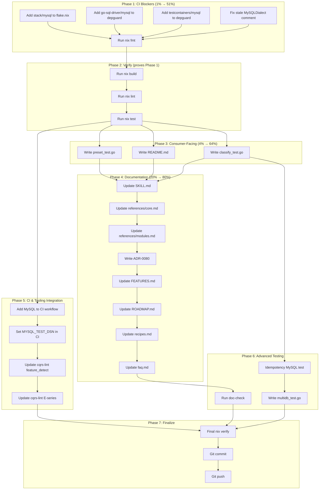

# MySQL/MariaDB Support: Polish & Completion Plan

**Date:** 2026-07-31 19:46
**Context:** MySQL support was implemented in the previous session (dialect interface expansion, upsert SQL refactor, error classification, stack/mysql preset module). Critical wiring gaps remain. This plan closes ALL gaps to production-ready status.

**Status report:** [`docs/status/2026-07-31_19-43_mysql-mariadb-support-status.md`](../status/2026-07-31_19-43_mysql-mariadb-support-status.md)

---

## Pareto Breakdown

### The 1% that delivers 51%

The CI/lint blockers. Without these, the feature is **invisible** to the entire Nix pipeline. `nix run .#build`, `.#test`, `.#lint` all skip the module. These are 3 one-line edits + 2 commands:

| #   | Task                                                                        | Effort    |
| --- | --------------------------------------------------------------------------- | --------- |
| 1   | Add `"stack/mysql"` to `flake.nix` testModules                              | 30 sec    |
| 2   | Add `github.com/go-sql-driver/mysql` to `.golangci.yml` depguard            | 30 sec    |
| 3   | Add `github.com/testcontainers/testcontainers-go/modules/mysql` to depguard | 30 sec    |
| 4   | Fix stale "event-store-only" comment on `MySQLDialect` (dialect.go:199)     | 10 sec    |
| 5   | `nix fmt` on all changed files                                              | 1 min     |
| 6   | Run `nix run .#verify` and fix any issues                                   | 10-15 min |

**Total: ~13 min. This is the difference between "invisible broken feature" and "CI-green feature".**

### The 4% that delivers 64%

Above + consumer-facing basics that make the feature usable and trustworthy:

| #   | Task                                                 | Effort |
| --- | ---------------------------------------------------- | ------ |
| 7   | Write `stack/mysql/README.md`                        | 10 min |
| 8   | Write `stack/mysql/preset_test.go` smoke test        | 10 min |
| 9   | Run `cmd/doc-check` to verify AGENTS.md import paths | 2 min  |

### The 20% that delivers 80%

Above + documentation + test coverage + CI integration:

| #   | Task                                                        | Effort |
| --- | ----------------------------------------------------------- | ------ |
| 10  | Update SKILL.md + references/core.md module decision matrix | 15 min |
| 11  | Write ADR-0080 for Dialect interface expansion              | 15 min |
| 12  | `classifyMySQLError` unit test with mock `mysqlNumberError` | 10 min |
| 13  | MySQL idempotency conditional-update test                   | 15 min |
| 14  | Add MySQL service container to CI workflow                  | 15 min |
| 15  | Update cqrs-lint E-series stack preset detection            | 10 min |
| 16  | Update FEATURES.md with MySQL entry                         | 5 min  |

### The other 20% (to get to 100%)

Full polish: all reference docs, advanced tests, release tags:

| #   | Task                                                                     | Effort |
| --- | ------------------------------------------------------------------------ | ------ |
| 17  | Update references/recipes.md with MySQL recipe                           | 10 min |
| 18  | Update references/modules.md with MySQL entry                            | 10 min |
| 19  | Update references/faq.md with MySQL FAQ                                  | 10 min |
| 20  | Write multidb_test.go (RunMultiDBSuite)                                  | 15 min |
| 21  | MySQL-specific upsert correctness tests (snapshot, KV, view, relational) | 20 min |
| 22  | ROADMAP.md update                                                        | 5 min  |
| 23  | doc-check verification of all SKILL references                           | 5 min  |
| 24  | Release tags (stack/mysql, storage, idempotency/sqlstore)                | 10 min |

---

## Comprehensive Plan: 10-30min Tasks

Sorted by: Impact (CI block > correctness > docs > polish), then Effort (ascending).

| ID  | Task                                                    | Impact   | Effort | Files                                                                                      |
| --- | ------------------------------------------------------- | -------- | ------ | ------------------------------------------------------------------------------------------ |
| T1  | Fix CI blockers: flake.nix + depguard + stale comment   | CRITICAL | 5 min  | `flake.nix`, `.golangci.yml`, `storage/sql/dialect.go`                                     |
| T2  | Run `nix fmt` on all changed files                      | CRITICAL | 2 min  | All changed `.go` files                                                                    |
| T3  | Run `nix run .#verify` and fix all issues               | CRITICAL | 15 min | TBD based on output                                                                        |
| T4  | Write `stack/mysql/preset_test.go` smoke test           | HIGH     | 10 min | `stack/mysql/preset_test.go`                                                               |
| T5  | Write `stack/mysql/README.md`                           | HIGH     | 10 min | `stack/mysql/README.md`                                                                    |
| T6  | Write `classifyMySQLError` unit test                    | HIGH     | 10 min | `storage/sql/classify_test.go`                                                             |
| T7  | Update SKILL.md + references/core.md decision matrix    | HIGH     | 15 min | `SKILL.md`, `.agents/skills/go-cqrs-lite/references/core.md`                               |
| T8  | Write ADR-0080: Dialect interface expansion             | MEDIUM   | 15 min | `docs/adr/0080-dialect-interface-upsert-methods.md`                                        |
| T9  | Add MySQL service container to CI workflow              | MEDIUM   | 15 min | `.github/workflows/ci.yml`                                                                 |
| T10 | Update cqrs-lint E-series + feature detection for MySQL | MEDIUM   | 10 min | `cmd/cqrs-lint/pkg/analyzer/feature_detect.go`, `cmd/cqrs-lint/pkg/rules/api/a009_a013.go` |
| T11 | Update FEATURES.md + ROADMAP.md                         | LOW      | 10 min | `FEATURES.md`, `ROADMAP.md`                                                                |
| T12 | Update references/recipes.md + modules.md + faq.md      | LOW      | 20 min | `.agents/skills/go-cqrs-lite/references/*.md`                                              |
| T13 | Write MySQL idempotency conditional-update test         | MEDIUM   | 15 min | `idempotency/sqlstore/store_mysql_test.go`                                                 |
| T14 | Run doc-check and fix any broken references             | MEDIUM   | 5 min  | `cmd/doc-check` output                                                                     |
| T15 | Write multidb_test.go for MySQL                         | LOW      | 15 min | `stack/mysql/multidb_test.go`                                                              |
| T16 | Final verify + commit + push                            | CRITICAL | 10 min | All                                                                                        |

**Estimated total: ~3.5 hours**

---

## Detailed Breakdown: Max 12min Tasks

Each task below is atomic and independently executable. Sorted by impact, then effort.

| Sub-ID | Parent | Task                                                                                             | Effort | Files                                               |
| ------ | ------ | ------------------------------------------------------------------------------------------------ | ------ | --------------------------------------------------- |
| S1     | T1     | Add `"stack/mysql"` to flake.nix testModules (after `"stack/postgres"`)                          | 1 min  | `flake.nix`                                         |
| S2     | T1     | Add `- github.com/go-sql-driver/mysql` to `.golangci.yml` depguard allow list                    | 1 min  | `.golangci.yml`                                     |
| S3     | T1     | Add `- github.com/testcontainers/testcontainers-go/modules/mysql` to depguard                    | 1 min  | `.golangci.yml`                                     |
| S4     | T1     | Fix `MySQLDialect` comment: remove "event-store-only support"                                    | 1 min  | `storage/sql/dialect.go`                            |
| S5     | T2     | Run `nix fmt` (or `gofumpt -w` + `goimports -w` on changed files)                                | 2 min  | All changed                                         |
| S6     | T3     | Run `nix run .#build` — fix compilation errors if any                                            | 3 min  | TBD                                                 |
| S7     | T3     | Run `nix run .#lint` — fix lint errors (depguard, etc.)                                          | 5 min  | TBD                                                 |
| S8     | T3     | Run `nix run .#test` — fix test failures if any                                                  | 5 min  | TBD                                                 |
| S9     | T4     | Write `stack/mysql/preset_test.go` — TestNewCreatesBundle, TestEventRoundtrip                    | 10 min | `stack/mysql/preset_test.go`                        |
| S10    | T5     | Write `stack/mysql/README.md` — quick start, DSN format, MariaDB note, multi-DB                  | 10 min | `stack/mysql/README.md`                             |
| S11    | T6     | Write `storage/sql/classify_test.go` — mock `mysqlNumberError` type, test 1062/1205/1213/unknown | 10 min | `storage/sql/classify_test.go`                      |
| S12    | T7     | Update SKILL.md routing table — add MySQL row to decision matrix                                 | 3 min  | `SKILL.md`                                          |
| S13    | T7     | Update references/core.md — add MySQL to decision matrix + quickstart                            | 10 min | `.agents/skills/go-cqrs-lite/references/core.md`    |
| S14    | T7     | Update references/modules.md — add `stack/mysql` entry                                           | 5 min  | `.agents/skills/go-cqrs-lite/references/modules.md` |
| S15    | T8     | Write ADR-0080: context, decision, consequences of 4 new Dialect methods                         | 12 min | `docs/adr/0080-dialect-interface-upsert-methods.md` |
| S16    | T9     | Add MySQL service container block to ci.yml (image, env, ports, health check)                    | 10 min | `.github/workflows/ci.yml`                          |
| S17    | T9     | Set `MYSQL_TEST_DSN` env var in CI test step                                                     | 2 min  | `.github/workflows/ci.yml`                          |
| S18    | T10    | Add `stack/mysql` to cqrs-lint feature_detect.go preset list                                     | 5 min  | `cmd/cqrs-lint/pkg/analyzer/feature_detect.go`      |
| S19    | T10    | Add MySQL to E-series stack preset detection in a009_a013.go                                     | 5 min  | `cmd/cqrs-lint/pkg/rules/api/a009_a013.go`          |
| S20    | T11    | Update FEATURES.md — add MySQL under DONE storage backends                                       | 3 min  | `FEATURES.md`                                       |
| S21    | T11    | Update ROADMAP.md — mark MySQL as done                                                           | 2 min  | `ROADMAP.md`                                        |
| S22    | T12    | Update references/recipes.md — add MySQL recipe example                                          | 10 min | `.agents/skills/go-cqrs-lite/references/recipes.md` |
| S23    | T12    | Update references/faq.md — add MySQL DSN parseTime gotcha                                        | 5 min  | `.agents/skills/go-cqrs-lite/references/faq.md`     |
| S24    | T13    | Write MySQL idempotency test — mock or real MySQL, test IF() reclaim                             | 12 min | `idempotency/sqlstore/store_mysql_test.go`          |
| S25    | T14    | Run doc-check on AGENTS.md + SKILL.md, fix broken import paths                                   | 5 min  | Docs                                                |
| S26    | T15    | Write multidb_test.go — RunMultiDBSuite for MySQL                                                | 12 min | `stack/mysql/multidb_test.go`                       |
| S27    | T16    | Final `nix run .#verify` — confirm GREEN                                                         | 5 min  | All                                                 |
| S28    | T16    | `git add` + `git commit` with detailed message                                                   | 5 min  | All                                                 |
| S29    | T16    | `git push`                                                                                       | 1 min  | All                                                 |

**Total: ~28 atomic tasks, ~3.5 hours estimated**

---

## Execution Graph

---

## Risk Assessment

| Risk                                                     | Probability | Impact         | Mitigation                                           |
| -------------------------------------------------------- | ----------- | -------------- | ---------------------------------------------------- |
| `nix run .#verify` surfaces unexpected failures          | Medium      | Delays Phase 2 | Fix issues as they appear, don't skip                |
| cqrs-lint feature_detect refactor breaks existing rules  | Low         | Breaks lint    | Test with `cqrs-lint doctor` after changes           |
| doc-check finds broken import paths in SKILL.md          | Low         | Docs drift     | Fix paths immediately, regenerate if needed          |
| MySQL contract tests need Docker (not available locally) | Known       | Tests skip     | Accept graceful skip; CI service container covers it |
| Depguard prefix matching for testcontainers sub-modules  | Low         | Lint failure   | Test with `nix run .#lint` after adding              |

---

## Out of Scope (Deliberately Deferred)

These are good ideas but NOT needed for production-ready MySQL support:

- MySQL `AS new` alias syntax (VALUES(col) works on all versions including MariaDB)
- Connection pool helper (`ConfigureMySQLPool`)
- `QuoteIdentifier` with reserved-word set (only `key`/`value` need quoting today)
- Advanced upsert correctness tests per-store (contract suite covers basics)
- Metaengine MySQL engine (separate future work)
- `OpenMySQL(dsn)` helper (consumers use `sql.Open("mysql", dsn)` directly)
- Benchmark MySQL vs SQLite vs Postgres
