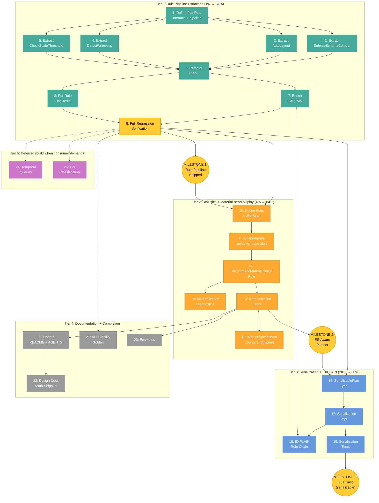

# SUPERB Metaengine Planner Evolution: From Structural Picker to ES-Aware Optimizer

**Date:** 2026-07-31 23:30
**Status:** Comprehensive Plan
**Related:** [DataFusion Lessons](2026-07-31_datafusion-lessons-for-metaengine.md),
[Project Definition](meta-engine-project-definition.md),
[Design/Vision](meta-engine-design.md),
[Assumptions & Query Planning](meta-engine-assumptions-and-query-planning.md)

---

## Context

### Where We Are Today

metaengine **works**. It ships 7 ADTs, 3 engines (Memory, SQLite, Pebble), `FilterOnField`/`SortOnField` pushdown, auto-layout via `LayoutPlanner`, a structural cost model (`cost.go`), write-amplification detection, scale-threshold warnings, cursor pagination, streaming (`StreamScan`), `TypedReader`, `RawValueReader`/`RawScanReader`, and SSE with replay. The `Engine`/backend interface split (ISP: `MapBackend`, `ScanBackend`, `SetBackend`, etc.) is clean and must NOT be touched.

But the **planner itself** (`planner.go`, 279 lines) is a monolith. It contains **4 inline decisions** that should be composable, independently testable rules:

| # | Inline decision | Location | Lines | What it does |
|---|---|---|---|---|
| A | Schema enforcement check | `planner.go:90-106` | ~17 | Warns when fold `valueType` ≠ result type |
| B | Auto-layout | `planner.go:113-143` | ~31 | Detects `LayoutPlanner`, builds `LayoutPlan`, applies DDL |
| C | Write-amplification detection | `plan_types.go:checkWriteAmplification` | ~22 | Warns when one event updates >N projections |
| D | Scale-threshold check | `cost.go:checkScaleThreshold` | ~22 | Warns when volume exceeds engine's `MaxItems` |

### What the Design Docs Already Envision

The canonical design docs ([assumptions-and-query-planning](meta-engine-assumptions-and-query-planning.md)) **already conceptualize** everything the DataFusion analysis recommends:

1. **Two-level optimization** (Section 2): Level 1 = engine assignment (≈ logical), Level 2 = within-engine layout (≈ physical). This IS the logical/physical split.
2. **"Don't Be Stupid" rules** (Section 6): Seven hard rules that are, structurally, optimizer rules.
3. **Runtime measurement as future** (Open Problem 4): "start conservative (unbounded), add runtime measurement in future iteration."
4. **Greedy heuristic, not ILP**: the practical planner is a fast greedy assignment, not the formal NP-hard model.

**The gap is not conceptual — it's that the CODE hasn't caught up to the DOCS.** The docs describe composable rules; the code has inline conditionals.

### What DataFusion Taught Us (Summary)

See [full analysis](2026-07-31_datafusion-lessons-for-metaengine.md). Key stealable patterns:

1. **Rule-composed optimizer** — optimizer is a list of rewrite passes, each testable in isolation
2. **Statistics-driven planning** — row counts/cardinality for cost decisions
3. **"Architecturally boring"** — proven patterns over clever tricks
4. **Extension over fork** — add traits/interfaces, never fork

### What Event Sourcing Adds Beyond DataFusion

ES makes the problem **strictly harder** than relational planning:

- **Materialization is a planning decision** — "should this projection exist?" (write/read ratio)
- **Temporal queries** — reconstruct state at any version/timestamp
- **Disposable projections** — rebuild from log, so aggressive layouts are safe
- **Idempotency constraints** — duplicate events must produce correct results
- **Schema evolution** — fold functions change, upcasters transform old events

The **materialize-vs-replay** decision is the single most valuable ES-specific capability. DataFusion cannot ask this question because its tables just *are*. metaengine can — if it has write/read statistics.

---

## Pareto Analysis

### The 1% That Delivers 51%: Rule Pipeline Extraction

**Extract the 4 inline decisions (A-D above) into composable rule types.** Pure refactor. Zero behavior change. All existing tests pass unchanged.

This is the **prerequisite for everything else**. Without it, every future addition (statistics, materialization, temporal queries) means hacking more inline logic into the monolithic `Plan()` function. With it, each addition is a new file implementing an interface.

**Why this is safe:** The logic doesn't change — we're moving code from inline blocks into named, testable functions/types. The existing test suite is the safety net. If any test breaks, the extraction was wrong.

**Why this is the 1%:** It's ~200 lines of code movement, takes half a day, and unlocks every subsequent phase. No new features, no new behavior, just structure.

### The 4% That Delivers 64%: Statistics + Materialize-vs-Replay

**Add optional write/read rate input and the materialize-vs-replay cost formula.** The planner gains the ability to RECOMMEND whether a projection should be materialized or computed on-demand via replay.

This is **THE ES-specific killer feature** that makes metaengine categorically different from DataFusion. No relational query engine can ask "should this table exist?" — because in their world, tables are deployment facts. In ES, projections are planning decisions.

The cost formula:

```
replay_cost(q)      = read_rate × avg_stream_length × fold_cost_per_event
materialize_cost(q) = write_rate × fold_cost_per_event + read_rate × query_cost

Materialize when: materialize_cost < replay_cost
⟺  read_rate / write_rate > fold_cost / (avg_stream_length × fold_cost - query_cost)
≈  read_rate / write_rate > 1 / avg_stream_length   (when fold_cost dominates)
```

**Why this is the 4%:** It's a small amount of code (one struct, one formula, one rule), but it delivers the highest-value ES-specific capability. It's the feature that makes consumers say "this planner understands my domain."

### The 20% That Delivers 80%: Plan Serialization + Enriched EXPLAIN

**Persist plan decisions for debugging, show the rule chain in EXPLAIN output, add per-rule unit tests.** Everything a consumer needs to trust and debug the planner.

A planner you can't debug is a planner you can't trust. `PlanResult.Report()` exists but doesn't show which rules fired or why. Plan serialization enables:
- "Why did the planner pick this engine?" → inspect serialized plan
- "Did the plan change after the last deploy?" → diff serialized plans
- "Pin this plan until we explicitly re-plan" → plan stability

### The Remaining 20% to Reach 100%

- **Documentation updates** — README, AGENTS.md, design docs (mark shipped features)
- **API stability golden regen** — required for any exported symbol change
- **Example code** — materialization recommendation, custom rule
- **Deferred features** — temporal queries, tier classification, advanced statistics (snapshot age, tombstone ratio). Build only when a consumer demands them.

---

## Comprehensive Plan (30-100min Tasks)

Sorted by Pareto tier, then by dependency, then by impact/effort ratio.

| # | Task | Tier | Impact (1-5) | Effort | Customer Value (1-5) | Depends On |
|---|------|------|-------------|--------|---------------------|------------|
| **1** | Define `PlanRule` interface, `PlanContext`, `RulePipeline` | T1 | 5 | 45min | 4 | — |
| **2** | Extract `EnforceSchemaCompatibility` rule | T1 | 3 | 30min | 3 | 1 |
| **3** | Extract `AutoLayout` rule | T1 | 4 | 45min | 3 | 1 |
| **4** | Extract `DetectWriteAmplification` rule | T1 | 3 | 30min | 3 | 1 |
| **5** | Extract `CheckScaleThreshold` rule | T1 | 3 | 30min | 3 | 1 |
| **6** | Refactor `Plan()` to use rule pipeline | T1 | 5 | 45min | 4 | 2,3,4,5 |
| **7** | Add rule chain to `Explain()`/`Report()` | T1 | 3 | 30min | 4 | 6 |
| **8** | Write per-rule isolated unit tests | T1 | 4 | 45min | 3 | 6 |
| **9** | Full regression test suite verification | T1 | 5 | 30min | 5 | 6,7,8 |
| **10** | Define `Stats` struct + `WithStats()` option | T2 | 4 | 30min | 4 | 9 |
| **11** | Implement materialize-vs-replay cost formula | T2 | 5 | 45min | 5 | 10 |
| **12** | Implement `RecommendMaterialization` rule | T2 | 5 | 45min | 5 | 11 |
| **13** | Add materialization diagnostics (INFO/WARN) | T2 | 3 | 30min | 4 | 12 |
| **14** | Write materialization recommendation tests | T2 | 4 | 30min | 3 | 12 |
| **15** | Wire `projectionhost` write/read counters | T2 | 3 | 60min | 4 | 14 |
| **16** | Define `SerializablePlan` type | T3 | 3 | 30min | 3 | 9 |
| **17** | Implement plan serialization/deserialization | T3 | 3 | 45min | 3 | 16 |
| **18** | Enrich EXPLAIN with full rule chain | T3 | 3 | 30min | 3 | 7,17 |
| **19** | Write serialization roundtrip tests | T3 | 3 | 30min | 2 | 17 |
| **20** | Update README + AGENTS.md | T4 | 3 | 45min | 4 | 9,14 |
| **21** | Regen API stability golden | T4 | 4 | 15min | 3 | 9 |
| **22** | Update design docs (mark shipped) | T4 | 2 | 30min | 2 | 20 |
| **23** | Add example: materialization recommendation | T4 | 2 | 45min | 4 | 14 |
| **24** | [DEFERRED] Temporal queries (`TemporalAnchor`) | T5 | 5 | 4h+ | 5 | 9 |
| **25** | [DEFERRED] Tier classification (`SelectTier` rule) | T5 | 3 | 2h+ | 3 | 9 |

**Total active effort:** ~16h (T1-T4)
**Deferred:** ~6h+ (T5, build when consumer demands)

---

## Micro-Tasks (Max 12min Each)

### Task 1: Define PlanRule Interface + Pipeline

| Sub | Description | Time |
|-----|-------------|------|
| 1.1 | Create `rules.go` with package doc comment | 2min |
| 1.2 | Define `PlanRule` interface: `Name() string`, `Apply(result *PlanResult, ctx PlanContext)` | 5min |
| 1.3 | Define `PlanContext` struct: `Engines []Engine`, `Store *Store`, `Options PlanOptions`, `Stats map[string]Stats` | 5min |
| 1.4 | Define `RulePipeline` type with `Apply(result *PlanResult, ctx PlanContext)` method (iterate rules) | 8min |
| 1.5 | Write doc comments explaining rule lifecycle (run after engine assignment, enrich not override) | 5min |
| 1.6 | Run `go build` to verify compilation | 2min |

### Task 2: Extract EnforceSchemaCompatibility Rule

| Sub | Description | Time |
|-----|-------------|------|
| 2.1 | Create `rule_schema.go` | 2min |
| 2.2 | Move fold `valueType` ≠ result type check from `planner.go:90-106` | 8min |
| 2.3 | Implement `PlanRule.Apply` — iterate `result.Queries`, add `DiagLevelWarn` | 5min |
| 2.4 | Remove inline code from `planner.go` | 3min |
| 2.5 | Run existing tests — zero behavior change | 3min |

### Task 3: Extract AutoLayout Rule

| Sub | Description | Time |
|-----|-------------|------|
| 3.1 | Create `rule_layout.go` | 2min |
| 3.2 | Move auto-layout block from `planner.go:113-143` | 10min |
| 3.3 | Handle `LayoutPlanner` engine capability check (`engine.(LayoutPlanner)`) | 5min |
| 3.4 | Handle `dryRun` option (skip `ApplyLayout` when dry) | 5min |
| 3.5 | Implement `PlanRule.Apply` — extract declarative fields, build plan, apply | 5min |
| 3.6 | Remove inline code from `planner.go` | 5min |
| 3.7 | Run existing tests — zero behavior change | 3min |

### Task 4: Extract DetectWriteAmplification Rule

| Sub | Description | Time |
|-----|-------------|------|
| 4.1 | Create `rule_writeamp.go` | 2min |
| 4.2 | Move `checkWriteAmplification` from `plan_types.go` | 8min |
| 4.3 | Implement `PlanRule.Apply` — call existing logic, append to `result.Diagnostics` | 5min |
| 4.4 | Remove inline call from `planner.go` (line 151) | 3min |
| 4.5 | Run existing tests — zero behavior change | 3min |

### Task 5: Extract CheckScaleThreshold Rule

| Sub | Description | Time |
|-----|-------------|------|
| 5.1 | Create `rule_scale.go` | 2min |
| 5.2 | Move `checkScaleThreshold` call logic into rule | 8min |
| 5.3 | Iterate `result.Queries`, check volume against `scaleThresholds()` table | 5min |
| 5.4 | Implement `PlanRule.Apply` | 5min |
| 5.5 | Run existing tests — zero behavior change | 3min |

### Task 6: Refactor Plan() to Use Rule Pipeline

| Sub | Description | Time |
|-----|-------------|------|
| 6.1 | Define `DefaultRules` slice: `[EnforceSchemaCompatibility{}, AutoLayout{}, CheckScaleThreshold{}, DetectWriteAmplification{}]` | 5min |
| 6.2 | Replace inline diagnostic/layout calls with `pipeline.Apply(&result, ctx)` | 8min |
| 6.3 | Handle per-query rules (schema, layout, scale) vs global rules (write-amp) distinction | 10min |
| 6.4 | Ensure `PlanResult` enrichment flows correctly through pipeline | 5min |
| 6.5 | Run existing tests — zero behavior change | 3min |

### Task 7: Add Rule Chain to Explain/Report

| Sub | Description | Time |
|-----|-------------|------|
| 7.1 | Add `AppliedRules []string` field to `PlanResult` | 3min |
| 7.2 | Populate `AppliedRules` during pipeline execution | 5min |
| 7.3 | Update `Report()` to list applied rules section | 8min |
| 7.4 | Run existing tests — update any snapshot tests | 5min |

### Task 8: Per-Rule Isolated Unit Tests

| Sub | Description | Time |
|-----|-------------|------|
| 8.1 | Test `EnforceSchemaCompatibility`: mismatched types → WARN diagnostic | 8min |
| 8.2 | Test `AutoLayout`: engine with `LayoutPlanner` → layout plan generated | 10min |
| 8.3 | Test `DetectWriteAmplification`: event touching 5 projections → WARN | 8min |
| 8.4 | Test `CheckScaleThreshold`: volume > MaxItems → DEGRADED diagnostic | 8min |
| 8.5 | Test `RulePipeline` ordering: rules fire in declared order | 5min |

### Task 9: Full Regression Verification

| Sub | Description | Time |
|-----|-------------|------|
| 9.1 | `cd metaengine && GOWORK=off go test ./... -count=1` | 5min |
| 9.2 | `cd metaengine && GOWORK=off go vet ./...` | 2min |
| 9.3 | `gofumpt -w metaengine/` + `goimports -w metaengine/` | 3min |
| 9.4 | Verify zero behavior change: diff PlanResult before/after | 10min |
| 9.5 | Final confidence check | 5min |

### Task 10: Define Stats + WithStats

| Sub | Description | Time |
|-----|-------------|------|
| 10.1 | Define `Stats` struct: `WriteRatePerSec`, `ReadRatePerSec`, `AvgStreamLength` (all optional, zero=unknown) | 5min |
| 10.2 | Define `WithStats(stats map[string]Stats) planOption` | 5min |
| 10.3 | Add `Stats` to `PlanContext` | 3min |
| 10.4 | Write doc comments explaining zero-stats = structural fallback | 5min |
| 10.5 | Run `go build` | 2min |

### Task 11: Materialize-vs-Replay Cost Formula

| Sub | Description | Time |
|-----|-------------|------|
| 11.1 | Implement `replayCost(stats Stats, foldCostPerEvent float64) float64` | 8min |
| 11.2 | Implement `materializeCost(stats Stats, foldCostPerEvent, queryCost float64) float64` | 8min |
| 11.3 | Implement `shouldMaterialize(stats Stats) (recommend bool, ratio float64)` | 5min |
| 11.4 | Write formula doc comments with the full derivation | 5min |
| 11.5 | Write formula unit tests (high ratio → true, low ratio → false, zero stats → false) | 10min |

### Task 12: RecommendMaterialization Rule

| Sub | Description | Time |
|-----|-------------|------|
| 12.1 | Create `rule_materialize.go` | 2min |
| 12.2 | Implement `PlanRule.Apply` — iterate queries, compute ratio, emit diagnostic | 10min |
| 12.3 | Handle zero-stats fallback (no recommendation, structural cost only) | 5min |
| 12.4 | Add to `DefaultRules` slice | 3min |
| 12.5 | Write materialization rule tests | 10min |

### Task 13: Materialization Diagnostics

| Sub | Description | Time |
|-----|-------------|------|
| 13.1 | Add INFO diagnostic: "read/write ratio X exceeds threshold Y — materialized projection recommended" | 5min |
| 13.2 | Add WARN diagnostic: "read/write ratio X below threshold — compute-on-demand recommended (avoid materialization)" | 5min |
| 13.3 | Test diagnostic formatting | 5min |

### Task 14: Materialization Tests

| Sub | Description | Time |
|-----|-------------|------|
| 14.1 | Test: high read rate, low write rate → recommend materialize | 8min |
| 14.2 | Test: low read rate, high write rate → recommend replay | 5min |
| 14.3 | Test: zero stats → no recommendation (structural fallback) | 5min |
| 14.4 | Test: varying stream lengths affect threshold | 5min |

### Task 15: Wire projectionhost Counters (Optional — Separate PR)

| Sub | Description | Time |
|-----|-------------|------|
| 15.1 | Add `eventsProcessed` counter to `projectionhost.Worker` | 10min |
| 15.2 | Add `queriesExecuted` counter to `Store` | 10min |
| 15.3 | Add `Stats() map[string]Stats` method to `Host` | 5min |
| 15.4 | Wire stats into `metaengine.Plan()` re-planning | 10min |
| 15.5 | Test counter accuracy with integration test | 10min |

### Task 16: SerializablePlan Type

| Sub | Description | Time |
|-----|-------------|------|
| 16.1 | Define `SerializablePlan` struct: version, timestamp, queries, rules, stats, cost | 5min |
| 16.2 | Add `MarshalJSON`/`UnmarshalJSON` | 8min |
| 16.3 | Add `Serialize() SerializablePlan` method to `PlanResult` | 5min |

### Task 17: Plan Serialization Implementation

| Sub | Description | Time |
|-----|-------------|------|
| 17.1 | Implement `Serialize()` — capture full plan state | 10min |
| 17.2 | Implement `DeserializePlan(data []byte) (*SerializablePlan, error)` | 10min |
| 17.3 | Handle version field for forward/backward compat | 5min |
| 17.4 | Write roundtrip test | 8min |

### Task 18: Enrich EXPLAIN with Rule Chain

| Sub | Description | Time |
|-----|-------------|------|
| 18.1 | Format rule chain in `Report()`: show each rule name + diagnostics it produced | 5min |
| 18.2 | Add timing per rule if feasible (`AppliedRules []RuleTrace`) | 8min |
| 18.3 | Test EXPLAIN output format | 5min |

### Task 19: Serialization Tests

| Sub | Description | Time |
|-----|-------------|------|
| 19.1 | Test full plan serialization roundtrip | 8min |
| 19.2 | Test version field handling | 5min |
| 19.3 | Test nil/empty fields | 5min |

### Tasks 20-23: Documentation + Examples

| Sub | Description | Time |
|-----|-------------|------|
| 20.1 | Update `metaengine/README.md`: rule pipeline section | 10min |
| 20.2 | Update `AGENTS.md` metaengine description | 5min |
| 20.3 | Update DataFusion lessons doc: mark shipped items | 10min |
| 21.1 | Run `cd cmd/api-stability && GOWORK=off go run main.go -update` | 5min |
| 21.2 | Verify diff is expected | 5min |
| 22.1 | Mark rule pipeline + statistics as shipped in design docs | 5min |
| 22.2 | Update "what exists" sections | 10min |
| 23.1 | Create example: `WithStats()` + materialization recommendation | 10min |
| 23.2 | Create example: custom `PlanRule` implementation | 10min |
| 23.3 | Verify examples compile | 5min |

---

## Mermaid Execution Graph



---

## VERSCHLIMMBESSER Risk Analysis

| # | Risk | Severity | Mitigation |
|---|------|----------|------------|
| 1 | **Breaking existing behavior during rule extraction** | CRITICAL | Extract ONE rule at a time. Run full test suite after each extraction. If any test breaks, the extraction is wrong — revert and retry. The existing test suite is the contract. |
| 2 | **Over-abstracting the rule interface** | HIGH | Start with the minimal interface: `Name() string` + `Apply(result *PlanResult, ctx PlanContext)`. Don't add generics, hooks, or middleware until a consumer needs them. YAGNI. |
| 3 | **Auto-layout rule needs engine access, not just PlanResult** | MEDIUM | The rule needs the assigned `Engine` to check `LayoutPlanner` capability. Solution: pass engines in `PlanContext`, or store engine reference in `QueryAssignment`. Use `PlanContext.Engines` — don't change `QueryAssignment`'s public API. |
| 4 | **Per-query vs global rule distinction adds complexity** | MEDIUM | Don't create two rule types. Each rule iterates `result.Queries` as needed. Global rules (write-amp) just iterate all queries; per-query rules (schema, layout) iterate and filter. One interface, simpler. |
| 5 | **Statistics misleading consumers** | MEDIUM | Statistics are ADVISORY (INFO/WARN diagnostics), never enforced. Always show the ratio and threshold in the message. Fall back to structural cost when stats are zero/unknown. Never block planning on missing stats. |
| 6 | **Materialization recommendation formula is wrong** | MEDIUM | The formula is a first-order approximation (documented as such, matching `cost.go`'s honesty note). Start conservative: only recommend materialization when the ratio is 10x the threshold. Better to miss a recommendation than give a wrong one. |
| 7 | **Plan serialization creates a false sense of stability** | LOW | SerializablePlan includes a version field. Plans are snapshots, not contracts. Document that re-planning may produce different results as engines/stats change. |
| 8 | **Touching the Engine or backend interfaces** | CRITICAL | DO NOT modify `Engine`, `MapBackend`, `ScanBackend`, `PushdownScan`, `LayoutPlanner`, `RawValueReader`, `RawScanReader`, `SetBackend`, `CounterBackend`, `GraphBackend`, `MultimapBackend`, `LogBackend`, or `MapUpdater`. These are the public API surface. The rule pipeline is ABOVE these interfaces, not below them. |
| 9 | **Changing the cost model formulas** | HIGH | Do NOT change `estimateCost`, `effectiveReadComplexity`, `scaleThresholds`, or `complexityRank`. These are existing behavior. The materialize-vs-replay formula is NEW and ADDITIVE — it doesn't replace existing cost estimates. |
| 10 | **Auto-commit daemon interfering with refactor** | LOW | The daemon commits working tree changes. If it commits mid-refactor, the commit history will show intermediate states. This is fine — each commit should compile and pass tests. Don't rely on the daemon; commit deliberately after each task. |

---

## Alignment with Canonical Design Docs

This plan does NOT introduce new concepts. It makes the CODE catch up to what the DOCS already envision:

| Design doc concept | Where in docs | What this plan does |
|---|---|---|
| Two-level optimization (engine assignment + within-engine layout) | [assumptions-and-query-planning](meta-engine-assumptions-and-query-planning.md) Section 2 | The rule pipeline makes Level 2 (layout) composable. `AutoLayout` rule = Level 2 optimization extracted into a testable unit. |
| "Don't Be Stupid" rules | Section 6 | Each inline check (schema enforcement, write amplification, scale threshold) becomes a named rule. The "don't be stupid" philosophy IS the rule pipeline. |
| Runtime measurement as future enhancement | Open Problem 4 | Tier 2 (Statistics) implements exactly what the doc envisions: "start conservative (unbounded), add runtime measurement in future iteration." |
| Greedy heuristic, not ILP | [project-definition](meta-engine-project-definition.md) | The core `planQuery` greedy assignment stays unchanged. Rules are post-assignment enrichments. |
| Declaration-time planner | [assumptions-and-query-planning](meta-engine-assumptions-and-query-planning.md) Assumption 2 | Statistics are OPTIONAL inputs at declaration time. The planner remains declaration-time, not runtime. `WithStats()` is a `Plan()` option, not a runtime query hook. |
| "We do not re-implement query planning" | [assumptions-and-query-planning](meta-engine-assumptions-and-query-planning.md) Section 2 | The rule pipeline plans PHYSICAL LAYOUT (tables, indexes, materialization). It does NOT reimplement per-query execution. The engine's own query planner handles that. |

---

## What This Plan Explicitly Does NOT Do

Being explicit about scope prevents VERSCHLIMMBESSER:

1. **Does NOT change the `Engine` interface** or any backend interface
2. **Does NOT change existing cost formulas** (`estimateCost`, `effectiveReadComplexity`, `scaleThresholds`)
3. **Does NOT change the public `Query`/`FilterOnField`/`SortOnField` API**
4. **Does NOT add new dependencies**
5. **Does NOT add SQL parsing** (DataFusion has this; metaengine doesn't need it)
6. **Does NOT add Arrow/columnar format** (CBOR/JSON is correct for CQRS)
7. **Does NOT add distributed execution** (single-process is the niche)
8. **Does NOT build temporal queries or tier classification** (deferred until consumer demands)
9. **Does NOT change `planQuery`'s greedy assignment algorithm** (rules enrich AFTER assignment)
10. **Does NOT add ILP or constraint solving** (greedy heuristic stays)

---

## Execution Checklist

Before starting ANY task:

- [ ] Read the target file(s) completely before editing
- [ ] Identify the exact lines to extract/modify
- [ ] Run existing tests to establish a green baseline
- [ ] Make ONE change at a time
- [ ] Run tests after EVERY change
- [ ] If tests break: STOP, revert, re-read, try again
- [ ] Never edit multiple rules simultaneously
- [ ] Commit after each completed task (not mid-task)

The auto-commit daemon is active. Commit deliberately after each task to maintain clean history.

---

## Summary: What to Actually Do

```
TODAY:   Tasks 1-9  (Rule pipeline extraction — pure refactor, zero risk, half a day)
NEXT:    Tasks 10-14 (Statistics + materialize-vs-replay — the ES killer feature)
LATER:   Tasks 15-19 (Serialization + EXPLAIN — consumer trust)
FINISH:  Tasks 20-23 (Docs + examples — library polish)
DEFER:   Tasks 24-25 (Temporal + tier — when a consumer asks)
```

**The single most important deliverable:** After Tasks 1-14, metaengine can answer the question no relational query engine can ask: **"Should this projection exist at all?"** — with a cost-based recommendation grounded in actual write/read patterns. That is the ES-specific research contribution.
