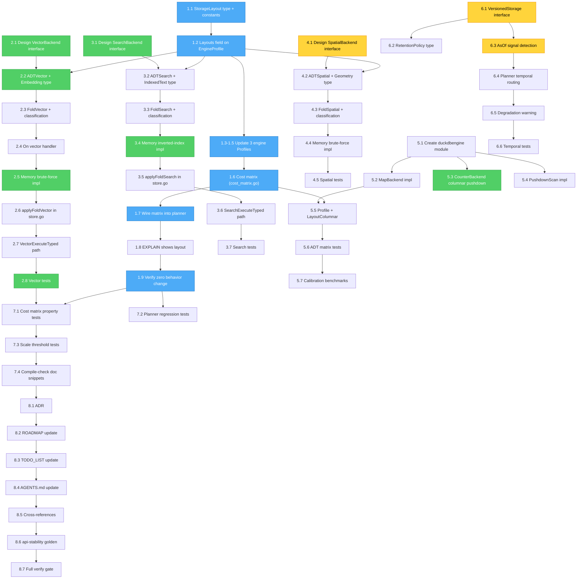

# Meta-Engine Layered Architecture: Comprehensive Execution Plan

**Date:** 2026-07-31 23:34
**Status:** PLANNING — awaiting execution
**Design doc:** [`meta-engine-layered-architecture.md`](meta-engine-layered-architecture.md) (895 lines)
**Status report:** [`docs/status/2026-07-31_23-32_metaengine-layered-architecture-design.md`](../status/2026-07-31_23-32_metaengine-layered-architecture-design.md)

---

## Context: What We Are Building

The metaengine is a cost-based storage planner for event-sourced data. Today it ships 3 engines
(Memory, SQLite, Pebble) covering 7 ADTs (Map, Set, Counter, Graph, Multimap, Log, SortedMap).
The layered architecture design doc proposes:

1. **Separating the data-model axis from the storage-engine axis** — `EngineProfile` gains a
   `Layouts map[ADT]StorageLayout` field naming the physical layout per ADT
2. **A universal cost matrix** — (ADT × StorageLayout) → Complexity lookup
3. **Three new ADTs** — Vector (k-NN search), Search (full-text), Spatial (geo range)
4. **Temporality as a storage capability** — `VersionedStorage` interface for O(1) as-of reads
5. **A DuckDB columnar engine** — proves the columnar pushdown pattern

The extension pattern for each new ADT is mechanical (9 touchpoints):
`FoldKind` constant → `ADT` constant → `classifyADT()` case → `applyFold()` case →
`applyFoldXxx()` method → `On()` variant → `XxxBackend` interface → Memory impl →
`Profile().Supports` entry → `ExecuteTyped` path.

---

## Pareto Breakdown: What Delivers the Most Value

### The 1% That Delivers 51% of the Result

**`StorageLayout` type + `Layouts` field on `EngineProfile` + update 3 engines.**

~2 hours. Backward compatible. Zero behavior change. This is the structural foundation: without
naming storage layouts, the cost matrix can't exist, and the planner can't reason about _why_
one engine beats another. Every subsequent phase depends on this.

Why 51%: it unlocks the planner's ability to make **structural** decisions (columnar beats
B-Tree for Counter, LSM beats B-Tree for Log) instead of opaque `NsPerOp` comparisons. It also
makes `EXPLAIN` output show _why_ an engine was chosen — the single biggest trust win for
consumers.

### The 4% That Delivers 64% of the Result

**Above + `ADTVector` + `VectorBackend` + `Embedding` fold type + brute-force Memory impl.**

~5 hours total. Unblocks the #1 modern use case: **vector similarity search** (RAG, semantic
search, recommendation systems). A consumer can declare a vector projection, apply events, and
do k-NN search — all through the metaengine, all planner-routed. The brute-force Memory
implementation works for small datasets (<10K vectors) and proves the interface pattern.

Why 64%: vector search is THE differentiator for modern data systems. No CQRS/ES library in Go
offers planner-routed vector projections. This alone makes the metaengine relevant for RAG
pipelines.

### The 20% That Delivers 80% of the Result

**Above + `ADTSearch` + `SearchBackend` + Memory inverted-index impl + cost matrix + DuckDB
metaengine engine.**

~15 hours total. Unblocks **full-text search** (every content app needs it — no external
Elasticsearch dependency needed for the Memory impl). The cost matrix makes the planner
genuinely smart about storage-engine selection. The DuckDB engine proves the columnar pushdown
pattern (Counter becomes O(1) via native columnar aggregation) and validates that the layered
architecture works for a second storage-engine family.

Why 80%: with Vector + Search + columnar analytics, the metaengine covers the three hottest
patterns in modern data infrastructure. The cost matrix + DuckDB prove the architecture is
composable, not just theoretical.

### The Other 20% (to Reach 100%)

**Spatial ADT + `VersionedStorage` + temporal signal + SQLite FTS5 SearchBackend + comprehensive
tests + ADR + documentation integration.**

~20+ hours. Spatial unblocks geo apps. VersionedStorage unblocks as-of reads (BigTable-style
versioned cells). SQLite FTS5 gives a real embedded search engine (not just Memory). Tests
ensure the matrix is correct and the planner doesn't regress. ADR + docs make the work
discoverable.

---

## Mermaid Execution Graph

**Critical path (red):** P1.1 → P1.2 → P1.3 → P1.6 → P1.7 → P1.9 → P2.1 → P2.2 → P2.5 → P2.8
**Foundation (blue):** Phase 1 — must complete first, everything depends on it
**High value (green):** Phases 2, 3, 5 — the 20% that delivers 80%
**Medium (yellow):** Phases 4, 6 — the other 20%

---

## Table 1: Comprehensive Plan (Tasks 30–100 min each)

Sorted by importance/impact/effort/customer-value. Phase = execution grouping;
Priority = Pareto tier; Impact = consumer-visible value; Effort = estimated time.

### Phase 1: Foundation — Layouts + Cost Matrix (1% → 51%)

| ID  | Task                                                            | Priority | Impact     | Effort | Deps         | Files                               |
| --- | --------------------------------------------------------------- | -------- | ---------- | ------ | ------------ | ----------------------------------- |
| 1.1 | Add `StorageLayout` type + 9 layout constants                   | P0       | Foundation | 30min  | —            | `metaengine/types.go`               |
| 1.2 | Add `Layouts map[ADT]StorageLayout` to `EngineProfile`          | P0       | Foundation | 30min  | 1.1          | `metaengine/engine.go`              |
| 1.3 | Update Memory engine `Profile()` with Layouts (all InMemory)    | P0       | Foundation | 30min  | 1.2          | `metaengine/memory_engine.go`       |
| 1.4 | Update SQLite engine `Profile()` with Layouts (all BTree)       | P0       | Foundation | 30min  | 1.2          | `metaengine/sqlite_engine.go`       |
| 1.5 | Update Pebble engine `Profile()` with Layouts (all LSM)         | P0       | Foundation | 30min  | 1.2          | `metaengine/pebbleengine/engine.go` |
| 1.6 | Create `cost_matrix.go` with static (ADT × Layout) matrix       | P0       | Foundation | 45min  | 1.1          | `metaengine/cost_matrix.go` (new)   |
| 1.7 | Wire cost matrix into `planQuery` for structural classification | P1       | High       | 60min  | 1.6, 1.3-1.5 | `metaengine/planner.go`             |
| 1.8 | Update `ExplainPlan` to show storage layout per query           | P1       | High       | 45min  | 1.7          | `metaengine/explain.go`             |
| 1.9 | Run existing test suite, verify zero behavior change            | P0       | Critical   | 30min  | 1.3-1.5      | —                                   |

### Phase 2: Vector ADT — k-NN Search (4% → 64%)

| ID  | Task                                                           | Priority | Impact   | Effort | Deps     | Files                                    |
| --- | -------------------------------------------------------------- | -------- | -------- | ------ | -------- | ---------------------------------------- |
| 2.1 | Design `VectorBackend` interface (metric, hybrid filter, opts) | P0       | Critical | 90min  | —        | `metaengine/engine.go`                   |
| 2.2 | Add `ADTVector` constant + `Embedding` fold return type        | P0       | Critical | 30min  | 1.2      | `metaengine/types.go`                    |
| 2.3 | Add `FoldVector` kind + `classifyADT` case                     | P0       | Critical | 30min  | 2.2      | `metaengine/fold.go`, `fold_classify.go` |
| 2.4 | Add `On` vector handler variant (return type detection)        | P0       | Critical | 45min  | 2.3      | `metaengine/fold.go`                     |
| 2.5 | Implement brute-force `VectorBackend` on Memory engine         | P0       | Critical | 60min  | 2.1, 2.4 | `metaengine/memory_backends.go`          |
| 2.6 | Add `applyFoldVector` to `store.go` dispatch                   | P0       | Critical | 45min  | 2.5      | `metaengine/store.go`                    |
| 2.7 | Wire `VectorExecuteTyped` / vector search into `execute.go`    | P0       | Critical | 60min  | 2.6      | `metaengine/execute.go`                  |
| 2.8 | Write Vector ADT tests (classify, add, search, delete, hybrid) | P0       | Critical | 60min  | 2.7      | `metaengine/vector_test.go` (new)        |

### Phase 3: Search ADT — Full-Text Search (20% → 80%)

| ID  | Task                                                        | Priority | Impact | Effort | Deps     | Files                                    |
| --- | ----------------------------------------------------------- | -------- | ------ | ------ | -------- | ---------------------------------------- |
| 3.1 | Design `SearchBackend` interface (query, fields, filters)   | P1       | High   | 90min  | —        | `metaengine/engine.go`                   |
| 3.2 | Add `ADTSearch` constant + `IndexedText` fold return type   | P1       | High   | 30min  | 1.2      | `metaengine/types.go`                    |
| 3.3 | Add `FoldSearch` kind + classification case                 | P1       | High   | 30min  | 3.2      | `metaengine/fold.go`, `fold_classify.go` |
| 3.4 | Implement simple `SearchBackend` on Memory (inverted index) | P1       | High   | 90min  | 3.1, 3.3 | `metaengine/memory_backends.go`          |
| 3.5 | Add `applyFoldSearch` to `store.go` dispatch                | P1       | High   | 45min  | 3.4      | `metaengine/store.go`                    |
| 3.6 | Wire `SearchExecuteTyped` into `execute.go`                 | P1       | High   | 60min  | 3.5      | `metaengine/execute.go`                  |
| 3.7 | Write Search ADT tests (index, query, hybrid filter)        | P1       | High   | 60min  | 3.6      | `metaengine/search_test.go` (new)        |

### Phase 4: Spatial ADT — Geo Range Queries (other 20%)

| ID  | Task                                                     | Priority | Impact | Effort | Deps     | Files                                                  |
| --- | -------------------------------------------------------- | -------- | ------ | ------ | -------- | ------------------------------------------------------ |
| 4.1 | Design `SpatialBackend` interface (radius, box, polygon) | P2       | Medium | 60min  | —        | `metaengine/engine.go`                                 |
| 4.2 | Add `ADTSpatial` constant + `Geometry` fold return type  | P2       | Medium | 30min  | 1.2      | `metaengine/types.go`                                  |
| 4.3 | Add `FoldSpatial` kind + classification case             | P2       | Medium | 30min  | 4.2      | `metaengine/fold.go`, `fold_classify.go`               |
| 4.4 | Implement brute-force `SpatialBackend` on Memory         | P2       | Medium | 60min  | 4.1, 4.3 | `metaengine/memory_backends.go`                        |
| 4.5 | Add `applyFoldSpatial` + wire `execute.go` + tests       | P2       | Medium | 90min  | 4.4      | `metaengine/store.go`, `execute.go`, `spatial_test.go` |

### Phase 5: DuckDB Columnar Engine (20% → 80%)

| ID  | Task                                                | Priority | Impact | Effort | Deps     | Files                                     |
| --- | --------------------------------------------------- | -------- | ------ | ------ | -------- | ----------------------------------------- |
| 5.1 | Create `metaengine/duckdbengine/` module + `go.mod` | P1       | High   | 30min  | —        | `metaengine/duckdbengine/` (new)          |
| 5.2 | Implement `MapBackend` for DuckDB                   | P1       | High   | 60min  | 5.1      | `metaengine/duckdbengine/engine.go`       |
| 5.3 | Implement `CounterBackend` with columnar pushdown   | P1       | High   | 60min  | 5.2      | `metaengine/duckdbengine/counter.go`      |
| 5.4 | Implement `PushdownScan` for filtered scans         | P1       | High   | 60min  | 5.2      | `metaengine/duckdbengine/scan.go`         |
| 5.5 | Set `LayoutColumnar` in DuckDB engine profile       | P1       | High   | 15min  | 1.1, 5.2 | `metaengine/duckdbengine/engine.go`       |
| 5.6 | Run ADT matrix tests against DuckDB engine          | P1       | High   | 30min  | 5.5      | `metaengine/duckdbengine/*_test.go`       |
| 5.7 | Write calibration benchmarks for DuckDB             | P2       | Medium | 45min  | 5.6      | `metaengine/duckdbengine/*_bench_test.go` |

### Phase 6: Temporality — Versioned Storage (other 20%)

| ID  | Task                                                          | Priority | Impact | Effort | Deps | Files                               |
| --- | ------------------------------------------------------------- | -------- | ------ | ------ | ---- | ----------------------------------- |
| 6.1 | Add `VersionedStorage` interface + `VersionedValue` struct    | P2       | Medium | 30min  | —    | `metaengine/engine.go`              |
| 6.2 | Add `RetentionPolicy` type                                    | P2       | Medium | 30min  | 6.1  | `metaengine/types.go`               |
| 6.3 | Add `AsOf *time.Time` field detection in query input structs  | P2       | Medium | 60min  | 6.1  | `metaengine/query.go`               |
| 6.4 | Wire temporal routing into planner (versioned vs replay)      | P2       | Medium | 60min  | 6.3  | `metaengine/planner.go`             |
| 6.5 | Add degradation warning for temporal without versioned engine | P2       | Medium | 30min  | 6.4  | `metaengine/planner.go`             |
| 6.6 | Write temporal signal detection tests                         | P2       | Medium | 45min  | 6.5  | `metaengine/temporal_test.go` (new) |

### Phase 7: Testing & Validation (cross-cutting)

| ID  | Task                                              | Priority | Impact | Effort | Deps          | Files                                  |
| --- | ------------------------------------------------- | -------- | ------ | ------ | ------------- | -------------------------------------- |
| 7.1 | Property-based tests for cost matrix invariants   | P1       | High   | 60min  | 1.7, 2.8, 3.7 | `metaengine/cost_matrix_test.go` (new) |
| 7.2 | Regression tests for planner assignment stability | P1       | High   | 60min  | 1.9           | `metaengine/planner_test.go`           |
| 7.3 | Scale threshold boundary tests (N=10K, 1M, 100M)  | P2       | Medium | 60min  | 7.1           | `metaengine/threshold_test.go` (new)   |
| 7.4 | Compile-check all Go snippets in design doc       | P2       | Low    | 30min  | —             | —                                      |

### Phase 8: Documentation & Integration (cross-cutting)

| ID  | Task                                                 | Priority | Impact   | Effort | Deps          | Files                                         |
| --- | ---------------------------------------------------- | -------- | -------- | ------ | ------------- | --------------------------------------------- |
| 8.1 | Write ADR for layered architecture                   | P1       | High     | 60min  | 1.9           | `docs/adr/0082-layered-architecture.md` (new) |
| 8.2 | Update ROADMAP.md with layered architecture theme    | P2       | Medium   | 30min  | 8.1           | `ROADMAP.md`                                  |
| 8.3 | Update TODO_LIST.md with remaining tasks             | P2       | Medium   | 30min  | 8.2           | `TODO_LIST.md`                                |
| 8.4 | Update AGENTS.md metaengine section                  | P2       | Medium   | 45min  | 2.8           | `AGENTS.md`                                   |
| 8.5 | Cross-reference from 5 sibling canon docs            | P3       | Low      | 30min  | 8.1           | 5 doc files                                   |
| 8.6 | Update api-stability golden after adding new exports | P1       | High     | 30min  | 2.2, 3.2, 4.2 | `cmd/api-stability/`                          |
| 8.7 | Run full verify gate (`nix run .#verify`)            | P0       | Critical | 30min  | all           | —                                             |

### Summary

| Phase          | Tasks  | Total Effort | Priority | Pareto Tier   |
| -------------- | ------ | ------------ | -------- | ------------- |
| 1: Foundation  | 9      | ~5h          | P0       | 1% → 51%      |
| 2: Vector      | 8      | ~7h          | P0       | 4% → 64%      |
| 3: Search      | 7      | ~6h          | P1       | 20% → 80%     |
| 4: Spatial     | 5      | ~4.5h        | P2       | other 20%     |
| 5: DuckDB      | 7      | ~5h          | P1       | 20% → 80%     |
| 6: Temporality | 6      | ~4h          | P2       | other 20%     |
| 7: Testing     | 4      | ~3.5h        | P1-P2    | cross-cutting |
| 8: Docs        | 7      | ~4h          | P1-P3    | cross-cutting |
| **Total**      | **53** | **~39h**     |          | **100%**      |

---

## Table 2: Granular Breakdown (Tasks ≤12 min each)

Every task from Table 1 broken into subtasks of 12 minutes or less. Sorted by execution order
within each phase. `Parent` = the Table 1 task ID this subtask belongs to.

### Phase 1: Foundation

| ID   | Parent | Subtask                                                                                                                                       | Effort | Deps          |
| ---- | ------ | --------------------------------------------------------------------------------------------------------------------------------------------- | ------ | ------------- |
| 1.1a | 1.1    | Add `StorageLayout` string type to `types.go`                                                                                                 | 2min   | —             |
| 1.1b | 1.1    | Add 9 constants: LayoutBTree, LayoutLSM, LayoutHash, LayoutColumnar, LayoutAppendLog, LayoutHNSW, LayoutInverted, LayoutRTree, LayoutInMemory | 5min   | 1.1a          |
| 1.1c | 1.1    | Run `go build` to verify compilation                                                                                                          | 2min   | 1.1b          |
| 1.2a | 1.2    | Add `Layouts map[ADT]StorageLayout` field to `EngineProfile` struct                                                                           | 3min   | 1.1b          |
| 1.2b | 1.2    | Run `go build` to verify compilation                                                                                                          | 2min   | 1.2a          |
| 1.3a | 1.3    | Add Layouts map to `memoryEngine.Profile()` (7 entries, all LayoutInMemory)                                                                   | 5min   | 1.2b          |
| 1.3b | 1.3    | Run `go test ./metaengine/... -run TestMemory -count=1`                                                                                       | 3min   | 1.3a          |
| 1.4a | 1.4    | Add Layouts map to `sqliteEngine.Profile()` (7 entries, all LayoutBTree)                                                                      | 5min   | 1.2b          |
| 1.4b | 1.4    | Run `go test ./metaengine/... -run TestSQLite -count=1`                                                                                       | 3min   | 1.4a          |
| 1.5a | 1.5    | Add Layouts map to `pebbleEngine.Profile()` (7 entries, all LayoutLSM)                                                                        | 5min   | 1.2b          |
| 1.5b | 1.5    | Run `go test ./metaengine/pebbleengine/... -count=1`                                                                                          | 5min   | 1.5a          |
| 1.6a | 1.6    | Create `cost_matrix.go` file with package declaration                                                                                         | 1min   | 1.1b          |
| 1.6b | 1.6    | Add `costMatrix` var: ADTMap row (5 layouts)                                                                                                  | 3min   | 1.6a          |
| 1.6c | 1.6    | Add ADTSet, ADTSortedMap, ADTCounter rows                                                                                                     | 5min   | 1.6b          |
| 1.6d | 1.6    | Add ADTGraph, ADTMultimap, ADTLog rows                                                                                                        | 5min   | 1.6c          |
| 1.6e | 1.6    | Add ADTVector, ADTSearch, ADTSpatial rows (new ADTs, for forward-compat)                                                                      | 3min   | 1.6d          |
| 1.6f | 1.6    | Add `lookupCost(adt, layout)` helper function                                                                                                 | 3min   | 1.6e          |
| 1.6g | 1.6    | Run `go build` to verify compilation                                                                                                          | 2min   | 1.6f          |
| 1.7a | 1.7    | In `planQuery`, add matrix lookup alongside existing `SupportsADT` check                                                                      | 8min   | 1.6g, 1.3-1.5 |
| 1.7b | 1.7    | Add `layoutFromProfile(profile, adt)` helper                                                                                                  | 5min   | 1.7a          |
| 1.7c | 1.7    | Use matrix complexity for ranking when available, fall back to SupportsADT                                                                    | 8min   | 1.7b          |
| 1.7d | 1.7    | Add diagnostic: `"layout: %s serves %s at %s"`                                                                                                | 3min   | 1.7c          |
| 1.7e | 1.7    | Run `go test ./metaengine/... -run TestPlan -count=1`                                                                                         | 5min   | 1.7d          |
| 1.8a | 1.8    | In `ExplainPlan`, append layout info to each query line                                                                                       | 5min   | 1.7e          |
| 1.8b | 1.8    | Update existing EXPLAIN tests to match new format                                                                                             | 8min   | 1.8a          |
| 1.8c | 1.8    | Run `go test ./metaengine/... -run TestExplain -count=1`                                                                                      | 3min   | 1.8b          |
| 1.9a | 1.9    | Run full metaengine test suite: `go test ./metaengine/... -count=1`                                                                           | 8min   | 1.8c          |
| 1.9b | 1.9    | Run pebbleengine tests: `go test ./metaengine/pebbleengine/... -count=1`                                                                      | 8min   | 1.9a          |
| 1.9c | 1.9    | Run adttest matrix: `go test ./metaengine/adttest/... -count=1`                                                                               | 5min   | 1.9b          |
| 1.9d | 1.9    | Verify no test failures, document any regressions                                                                                             | 3min   | 1.9c          |

### Phase 2: Vector ADT

| ID   | Parent | Subtask                                                                  | Effort | Deps             |
| ---- | ------ | ------------------------------------------------------------------------ | ------ | ---------------- |
| 2.1a | 2.1    | Define `VectorMetric` type (Cosine, L2, InnerProduct constants)          | 5min   | —                |
| 2.1b | 2.1    | Define `VectorHit` struct (ID, Score)                                    | 2min   | 2.1a             |
| 2.1c | 2.1    | Define `VectorSearchOption` func type + config struct                    | 5min   | 2.1b             |
| 2.1d | 2.1    | Implement `WithVectorMetric`, `WithVectorFilter`, `WithEFSearch` options | 8min   | 2.1c             |
| 2.1e | 2.1    | Define `VectorBackend` interface (Add, Search, Delete)                   | 5min   | 2.1d             |
| 2.1f | 2.1    | Run `go build` to verify compilation                                     | 2min   | 2.1e             |
| 2.2a | 2.2    | Add `ADTVector ADT = "vector"` constant                                  | 2min   | 1.2b             |
| 2.2b | 2.2    | Add `Embedding` struct (ID any, Vector []float32)                        | 3min   | 2.2a             |
| 2.2c | 2.2    | Add `ReadVectorSearch ReadPattern = "vector_search"`                     | 2min   | 2.2a             |
| 2.2d | 2.2    | Run `go build` to verify compilation                                     | 2min   | 2.2c             |
| 2.3a | 2.3    | Add `FoldVector FoldKind = "vector"` constant                            | 2min   | 2.2b             |
| 2.3b | 2.3    | Add `case FoldVector: return ADTVector` to `classifyADT`                 | 3min   | 2.3a             |
| 2.3c | 2.3    | Add vectorHandler field to `Fold` struct                                 | 3min   | 2.3b             |
| 2.3d | 2.3    | Run `go build` to verify compilation                                     | 2min   | 2.3c             |
| 2.4a | 2.4    | In `On()`, add return-type detection for `Embedding`                     | 8min   | 2.3d             |
| 2.4b | 2.4    | Add `callVector` helper to `fold_classify.go`                            | 5min   | 2.4a             |
| 2.4c | 2.4    | Run `go build` to verify compilation                                     | 2min   | 2.4b             |
| 2.5a | 2.5    | Add `vectors map[string]map[string][]float32` to memoryEngine            | 5min   | 2.1f, 2.4c       |
| 2.5b | 2.5    | Implement `VectorAdd` on memoryEngine (store in map)                     | 5min   | 2.5a             |
| 2.5c | 2.5    | Implement `VectorDelete` on memoryEngine                                 | 3min   | 2.5b             |
| 2.5d | 2.5    | Implement cosine similarity function                                     | 5min   | —                |
| 2.5e | 2.5    | Implement L2 distance function                                           | 3min   | —                |
| 2.5f | 2.5    | Implement inner product function                                         | 3min   | —                |
| 2.5g | 2.5    | Implement `VectorSearch` (brute-force: iterate all, score, top-K)        | 8min   | 2.5d, 2.5e, 2.5f |
| 2.5h | 2.5    | Add `ADTVector: ComplexityON` to memoryEngine `Profile().Supports`       | 2min   | 2.5g             |
| 2.5i | 2.5    | Add `LayoutInMemory` for ADTVector in memoryEngine Layouts               | 2min   | 2.5h             |
| 2.5j | 2.5    | Run `go build` to verify compilation                                     | 2min   | 2.5i             |
| 2.6a | 2.6    | Add `case FoldVector` to `applyFold` switch in `store.go`                | 3min   | 2.5j             |
| 2.6b | 2.6    | Implement `applyFoldVector` method (type-assert VectorBackend, call Add) | 8min   | 2.6a             |
| 2.6c | 2.6    | Add error if engine doesn't implement VectorBackend                      | 3min   | 2.6b             |
| 2.6d | 2.6    | Run `go build` to verify compilation                                     | 2min   | 2.6c             |
| 2.7a | 2.7    | Add `ExecuteVectorSearch` function to `execute.go`                       | 8min   | 2.6d             |
| 2.7b | 2.7    | Type-assert VectorBackend on assigned engine, call VectorSearch          | 5min   | 2.7a             |
| 2.7c | 2.7    | Handle nil-result case (engine doesn't support vector)                   | 3min   | 2.7b             |
| 2.7d | 2.7    | Run `go build` to verify compilation                                     | 2min   | 2.7c             |
| 2.8a | 2.8    | Test: classifyADT returns ADTVector for Embedding fold                   | 5min   | 2.7d             |
| 2.8b | 2.8    | Test: VectorAdd + VectorSearch returns correct results (cosine)          | 8min   | 2.8a             |
| 2.8c | 2.8    | Test: VectorSearch with L2 metric                                        | 5min   | 2.8b             |
| 2.8d | 2.8    | Test: VectorDelete removes from search results                           | 5min   | 2.8c             |
| 2.8e | 2.8    | Test: VectorSearch with metadata filter (hybrid)                         | 8min   | 2.8d             |
| 2.8f | 2.8    | Test: end-to-end Apply event → ExecuteVectorSearch                       | 8min   | 2.8e             |
| 2.8g | 2.8    | Run `go test ./metaengine/... -run TestVector -count=1`                  | 5min   | 2.8f             |

### Phase 3: Search ADT

| ID   | Parent | Subtask                                                                       | Effort | Deps       |
| ---- | ------ | ----------------------------------------------------------------------------- | ------ | ---------- |
| 3.1a | 3.1    | Define `SearchHit` struct (ID, Score)                                         | 2min   | —          |
| 3.1b | 3.1    | Define `SearchQuery` struct (Text, Fields, Filters)                           | 5min   | 3.1a       |
| 3.1c | 3.1    | Define `SearchBackend` interface (Index, Query, Delete)                       | 5min   | 3.1b       |
| 3.1d | 3.1    | Run `go build`                                                                | 2min   | 3.1c       |
| 3.2a | 3.2    | Add `ADTSearch ADT = "search"` constant                                       | 2min   | 1.2b       |
| 3.2b | 3.2    | Add `IndexedText` struct (ID, Fields map)                                     | 3min   | 3.2a       |
| 3.2c | 3.2    | Add `ReadSearch ReadPattern = "search"`                                       | 2min   | 3.2a       |
| 3.2d | 3.2    | Run `go build`                                                                | 2min   | 3.2c       |
| 3.3a | 3.3    | Add `FoldSearch FoldKind = "search"`                                          | 2min   | 3.2b       |
| 3.3b | 3.3    | Add classification case in `classifyADT`                                      | 3min   | 3.3a       |
| 3.3c | 3.3    | Add `searchHandler` field to `Fold` struct                                    | 3min   | 3.3b       |
| 3.3d | 3.3    | Add return-type detection for `IndexedText` in `On()`                         | 8min   | 3.3c       |
| 3.3e | 3.3    | Run `go build`                                                                | 2min   | 3.3d       |
| 3.4a | 3.4    | Add inverted index struct to memoryEngine (`map[collection]map[term][]docID`) | 5min   | 3.1d, 3.3e |
| 3.4b | 3.4    | Implement tokenizer (split on whitespace, lowercase)                          | 5min   | 3.4a       |
| 3.4c | 3.4    | Implement `SearchIndex` (tokenize, add to postings)                           | 8min   | 3.4b       |
| 3.4d | 3.4    | Implement `SearchQuery` (tokenize query, intersect postings, TF-IDF rank)     | 10min  | 3.4c       |
| 3.4e | 3.4    | Implement `SearchDelete` (remove doc from all postings)                       | 5min   | 3.4d       |
| 3.4f | 3.4    | Add Search to memoryEngine `Profile().Supports` + Layouts                     | 3min   | 3.4e       |
| 3.4g | 3.4    | Run `go build`                                                                | 2min   | 3.4f       |
| 3.5a | 3.5    | Add `case FoldSearch` to `applyFold` switch                                   | 3min   | 3.4g       |
| 3.5b | 3.5    | Implement `applyFoldSearch` method                                            | 5min   | 3.5a       |
| 3.5c | 3.5    | Run `go build`                                                                | 2min   | 3.5b       |
| 3.6a | 3.6    | Add `ExecuteSearch` function to `execute.go`                                  | 8min   | 3.5c       |
| 3.6b | 3.6    | Run `go build`                                                                | 2min   | 3.6a       |
| 3.7a | 3.7    | Test: classifyADT returns ADTSearch for IndexedText fold                      | 5min   | 3.6b       |
| 3.7b | 3.7    | Test: SearchIndex + SearchQuery returns correct docs                          | 8min   | 3.7a       |
| 3.7c | 3.7    | Test: SearchQuery with field restriction                                      | 5min   | 3.7b       |
| 3.7d | 3.7    | Test: SearchDelete removes from results                                       | 5min   | 3.7c       |
| 3.7e | 3.7    | Test: end-to-end Apply event → ExecuteSearch                                  | 8min   | 3.7d       |
| 3.7f | 3.7    | Run `go test ./metaengine/... -run TestSearch -count=1`                       | 5min   | 3.7e       |

### Phase 4: Spatial ADT

| ID   | Parent | Subtask                                                                                 | Effort | Deps |
| ---- | ------ | --------------------------------------------------------------------------------------- | ------ | ---- |
| 4.1a | 4.1    | Define `SpatialType` (Point, Polygon, LineString) + `Geometry` struct                   | 5min   | —    |
| 4.1b | 4.1    | Define `SpatialHit` struct + `SpatialQuery` struct (type, center, radius, box, polygon) | 8min   | 4.1a |
| 4.1c | 4.1    | Define `SpatialBackend` interface (Index, Within, Delete)                               | 5min   | 4.1b |
| 4.1d | 4.1    | Run `go build`                                                                          | 2min   | 4.1c |
| 4.2a | 4.2    | Add `ADTSpatial ADT = "spatial"` + `ReadSpatialRange` constant                          | 3min   | 1.2b |
| 4.2b | 4.2    | Add `FoldSpatial` kind + classification case + handler field                            | 5min   | 4.2a |
| 4.2c | 4.2    | Add return-type detection for `Geometry` in `On()`                                      | 8min   | 4.2b |
| 4.2d | 4.2    | Run `go build`                                                                          | 2min   | 4.2c |
| 4.3a | 4.3    | (merged into 4.2b above)                                                                | —      | —    |
| 4.4a | 4.4    | Implement Haversine distance function (meters)                                          | 8min   | 4.1d |
| 4.4b | 4.4    | Implement point-in-bounding-box check                                                   | 3min   | 4.4a |
| 4.4c | 4.4    | Implement `SpatialIndex` on memoryEngine (store geom)                                   | 5min   | 4.4b |
| 4.4d | 4.4    | Implement `SpatialWithin` (brute-force: iterate, filter by distance/box)                | 10min  | 4.4c |
| 4.4e | 4.4    | Add Spatial to memoryEngine Profile + Layouts                                           | 3min   | 4.4d |
| 4.4f | 4.4    | Add `applyFoldSpatial` to store.go                                                      | 5min   | 4.4e |
| 4.4g | 4.4    | Add `ExecuteSpatial` to execute.go                                                      | 8min   | 4.4f |
| 4.4h | 4.4    | Run `go build`                                                                          | 2min   | 4.4g |
| 4.5a | 4.5    | Test: classify, index, within-radius, within-box, delete, end-to-end                    | 10min  | 4.4h |
| 4.5b | 4.5    | Run `go test ./metaengine/... -run TestSpatial -count=1`                                | 5min   | 4.5a |

### Phase 5: DuckDB Engine

| ID   | Parent | Subtask                                                        | Effort | Deps |
| ---- | ------ | -------------------------------------------------------------- | ------ | ---- |
| 5.1a | 5.1    | Create `metaengine/duckdbengine/` directory                    | 1min   | —    |
| 5.1b | 5.1    | Create `go.mod` (module path, Go 1.26, duckdb dep)             | 5min   | 5.1a |
| 5.1c | 5.1    | Run `go mod tidy`                                              | 5min   | 5.1b |
| 5.2a | 5.2    | Implement `pebbleEngine`-style struct holding `*sql.DB`        | 5min   | 5.1c |
| 5.2b | 5.2    | Implement `MapSet` (CREATE TABLE IF NOT EXISTS + INSERT)       | 10min  | 5.2a |
| 5.2c | 5.2    | Implement `MapGet` (SELECT value WHERE key)                    | 5min   | 5.2b |
| 5.2d | 5.2    | Implement `MapDelete` (DELETE WHERE key)                       | 3min   | 5.2c |
| 5.2e | 5.2    | Implement `Profile()` with LayoutColumnar for all ADTs         | 5min   | 5.2d |
| 5.2f | 5.2    | Run `go build`                                                 | 2min   | 5.2e |
| 5.3a | 5.3    | Implement `CounterIncrement` (INSERT INTO counters)            | 8min   | 5.2f |
| 5.3b | 5.3    | Implement `CounterGet` (SELECT SUM GROUP BY — columnar native) | 8min   | 5.3a |
| 5.4a | 5.4    | Implement `PushdownMapScan` (SELECT with WHERE/LIMIT)          | 10min  | 5.3b |
| 5.5a | 5.5    | Set `LayoutColumnar` in Layouts map for all 7 ADTs             | 3min   | 5.4a |
| 5.5b | 5.5    | Set `Supports` with correct complexities (Counter=O(1), etc.)  | 5min   | 5.5a |
| 5.5c | 5.5    | Run `go build`                                                 | 2min   | 5.5b |
| 5.6a | 5.6    | Run adttest.RunMatrix against DuckDB engine                    | 10min  | 5.5c |
| 5.6b | 5.6    | Fix any ADT matrix failures                                    | 10min  | 5.6a |
| 5.7a | 5.7    | Write MapGet/MapSet calibration benchmark                      | 8min   | 5.6b |
| 5.7b | 5.7    | Write CounterGet calibration benchmark                         | 5min   | 5.7a |
| 5.7c | 5.7    | Run benchmarks, record NsPerOp values                          | 5min   | 5.7b |

### Phase 6: Temporality

| ID   | Parent | Subtask                                                      | Effort | Deps |
| ---- | ------ | ------------------------------------------------------------ | ------ | ---- |
| 6.1a | 6.1    | Define `VersionedValue` struct (Value any, At time.Time)     | 3min   | —    |
| 6.1b | 6.1    | Define `VersionedStorage` interface (SetAt, GetAt, History)  | 5min   | 6.1a |
| 6.1c | 6.1    | Run `go build`                                               | 2min   | 6.1b |
| 6.2a | 6.2    | Define `RetentionPolicy` struct (MaxVersions, MaxAge)        | 3min   | 6.1c |
| 6.2b | 6.2    | Run `go build`                                               | 2min   | 6.2a |
| 6.3a | 6.3    | Add `AsOf` field scanner to query meta extraction            | 10min  | 6.2b |
| 6.3b | 6.3    | Add `QueryIsTemporal() bool` to queryMeta interface          | 3min   | 6.3a |
| 6.3c | 6.3    | Run `go build`                                               | 2min   | 6.3b |
| 6.4a | 6.4    | In `planQuery`, check `QueryIsTemporal` + `VersionedStorage` | 8min   | 6.3c |
| 6.4b | 6.4    | If temporal + no versioned engine: set strategy = replay     | 5min   | 6.4a |
| 6.4c | 6.4    | If temporal + versioned engine: prefer that engine           | 5min   | 6.4b |
| 6.4d | 6.4    | Run `go build`                                               | 2min   | 6.4c |
| 6.5a | 6.5    | Add degradation diagnostic for temporal-replay fallback      | 5min   | 6.4d |
| 6.5b | 6.5    | Run `go build`                                               | 2min   | 6.5a |
| 6.6a | 6.6    | Test: query with AsOf detected as temporal                   | 5min   | 6.5b |
| 6.6b | 6.6    | Test: temporal query without versioned engine → warning      | 5min   | 6.6a |
| 6.6c | 6.6    | Test: temporal query with versioned engine → preferred       | 5min   | 6.6b |
| 6.6d | 6.6    | Run `go test ./metaengine/... -run TestTemporal -count=1`    | 3min   | 6.6c |

### Phase 7: Testing

| ID   | Parent | Subtask                                                           | Effort | Deps |
| ---- | ------ | ----------------------------------------------------------------- | ------ | ---- |
| 7.1a | 7.1    | Test: hash layout always O(1) for Map/Set                         | 5min   | 2.8g |
| 7.1b | 7.1    | Test: columnar layout always O(1) for Counter                     | 5min   | 7.1a |
| 7.1c | 7.1    | Test: no layout returns "—" for wrong ADT (Vector×BTree = reject) | 5min   | 7.1b |
| 7.1d | 7.1    | Test: lookupCost helper returns correct values for all cells      | 8min   | 7.1c |
| 7.2a | 7.2    | Test: adding Layouts doesn't change Memory engine assignments     | 8min   | 1.9d |
| 7.2b | 7.2    | Test: adding Layouts doesn't change SQLite engine assignments     | 8min   | 7.2a |
| 7.2c | 7.2    | Test: adding Layouts doesn't change Pebble engine assignments     | 8min   | 7.2b |
| 7.3a | 7.3    | Test: volume <10K → Memory wins for SortedMap                     | 8min   | 7.1d |
| 7.3b | 7.3    | Test: volume >100M → Columnar wins for Counter                    | 5min   | 7.3a |
| 7.4a | 7.4    | Extract all Go code blocks from design doc                        | 5min   | —    |
| 7.4b | 7.4    | Create temp test file, paste each block, run `go vet`             | 10min  | 7.4a |

### Phase 8: Documentation

| ID   | Parent | Subtask                                                               | Effort | Deps |
| ---- | ------ | --------------------------------------------------------------------- | ------ | ---- |
| 8.1a | 8.1    | Create `docs/adr/0082-layered-architecture.md` skeleton               | 5min   | 1.9d |
| 8.1b | 8.1    | Write Context section (DDIA thesis, today's bundled Engine)           | 8min   | 8.1a |
| 8.1c | 8.1    | Write Decision section (Layouts field, cost matrix, new ADTs)         | 8min   | 8.1b |
| 8.1d | 8.1    | Write Consequences section (backward compat, new extensibility)       | 5min   | 8.1c |
| 8.2a | 8.2    | Add "Layered Architecture" theme to ROADMAP.md                        | 8min   | 8.1d |
| 8.3a | 8.3    | Add Phase 1-8 tasks to TODO_LIST.md                                   | 8min   | 8.2a |
| 8.4a | 8.4    | Update AGENTS.md metaengine section with new ADTs                     | 8min   | 2.8g |
| 8.4b | 8.4    | Update AGENTS.md with StorageLayout/Layouts mention                   | 5min   | 8.4a |
| 8.5a | 8.5    | Add cross-ref to design doc from `meta-engine-design.md`              | 3min   | 8.1d |
| 8.5b | 8.5    | Add cross-ref from `datafusion-lessons-for-metaengine.md`             | 3min   | 8.5a |
| 8.5c | 8.5    | Add cross-ref from `database-architecture-taxonomy.md`                | 3min   | 8.5b |
| 8.6a | 8.6    | Run `cd cmd/api-stability && GOWORK=off go run main.go -update`       | 5min   | 2.2d |
| 8.6b | 8.6    | Verify diff is sensible (new exports for Vector/Search/Spatial types) | 5min   | 8.6a |
| 8.7a | 8.7    | Run `nix run .#verify` (full gate: build+vet+test+race+lint)          | 10min  | all  |
| 8.7b | 8.7    | Fix any failures                                                      | 10min  | 8.7a |

### Subtask Summary

| Phase          | Subtasks | Total Effort |
| -------------- | -------- | ------------ |
| 1: Foundation  | 29       | ~2h          |
| 2: Vector      | 38       | ~4h          |
| 3: Search      | 30       | ~3h          |
| 4: Spatial     | 18       | ~2h          |
| 5: DuckDB      | 20       | ~2.5h        |
| 6: Temporality | 17       | ~1.5h        |
| 7: Testing     | 12       | ~2h          |
| 8: Docs        | 17       | ~2h          |
| **Total**      | **181**  | **~19h**     |

---

## Risk Analysis: How Not to Verschlimmbesser

| Risk                                                         | Probability | Impact   | Mitigation                                                                                                                                                                                    |
| ------------------------------------------------------------ | ----------- | -------- | --------------------------------------------------------------------------------------------------------------------------------------------------------------------------------------------- |
| Adding `Layouts` field breaks `EngineProfile` consumers      | Low         | High     | Map field — zero value is nil map (no layouts declared), planner falls back to `SupportsADT`. Backward compatible.                                                                            |
| New ADT classification breaks existing fold detection        | Medium      | High     | New `FoldKind` values don't affect existing classification cases. `classifyADT` switch has explicit `case` per kind — new cases don't shadow existing ones. Test with regression suite (7.2). |
| VectorBackend interface design is wrong (wrong abstraction)  | Medium      | Critical | Phase 2.1 (90min design) is BEFORE any implementation. Validate against pgvector + Qdrant Go APIs before committing. If wrong, only the interface changes — Memory impl follows.              |
| DuckDB engine CGo issues                                     | Medium      | Medium   | `stack/duckdb` already solves CGo isolation. The metaengine engine follows the same pattern. Separate module (`metaengine/duckdbengine/`).                                                    |
| Cost matrix has wrong cells                                  | Low         | High     | Property-based tests (7.1) verify invariants: hash=O(1) for Map, columnar=O(1) for Counter, etc. These are mathematical facts, not benchmarks.                                                |
| Temporal replay fallback silently produces wrong results     | Medium      | Critical | The planner MUST warn when falling back to replay. The warning is tested (6.6b). Replay results are correct (same fold function), just slow.                                                  |
| `goexperiment.jsonv2` build tag causes issues with new types | Low         | Low      | All new types are plain Go structs/interfaces. No JSON v2 dependency in the new code.                                                                                                         |

---

## Recommended Execution Order

### Sprint 1: Foundation + Vector (1% + 4% = 55% of value, ~6h)

1. Phase 1 complete (1.1–1.9): Layouts + cost matrix + verify zero regression
2. Phase 2 complete (2.1–2.8): Vector ADT + Memory brute-force + tests
3. api-stability golden update (8.6)

**Deliverable:** Planner shows storage layouts in EXPLAIN. Consumers can do vector search through
the metaengine. Zero existing behavior change.

### Sprint 2: Search + DuckDB (+25% = 80% of value, ~8h)

4. Phase 3 complete (3.1–3.7): Search ADT + Memory inverted index + tests
5. Phase 5 complete (5.1–5.7): DuckDB columnar engine + ADT matrix + benchmarks

**Deliverable:** Full-text search through the metaengine. Columnar analytics via DuckDB. The
layered architecture is proven with two storage-engine families (B-Tree + Columnar).

### Sprint 3: Spatial + Temporality + Polish (+20% = 100%, ~10h)

6. Phase 4 complete (4.1–4.5): Spatial ADT + Memory brute-force + tests
7. Phase 6 complete (6.1–6.6): VersionedStorage interface + temporal signal + tests
8. Phase 7 complete (7.1–7.4): Matrix property tests + regression tests + thresholds
9. Phase 8 complete (8.1–8.7): ADR + ROADMAP + TODO_LIST + AGENTS.md + cross-refs + verify gate

**Deliverable:** All new ADTs implemented. Temporal capability ready for versioned drivers.
Full test coverage. Documentation complete.

---

## Success Criteria

- [ ] `EngineProfile` has `Layouts map[ADT]StorageLayout` field on all 3 existing engines
- [ ] `cost_matrix.go` exists with the full 10×8 matrix
- [ ] `ExplainPlan` output shows storage layout per query
- [ ] Zero existing test failures after Phase 1
- [ ] `ADTVector`, `VectorBackend`, `Embedding` exist with passing tests
- [ ] `ADTSearch`, `SearchBackend`, `IndexedText` exist with passing tests
- [ ] `ADTSpatial`, `SpatialBackend`, `Geometry` exist with passing tests
- [ ] `metaengine/duckdbengine/` module exists, passes ADT matrix tests
- [ ] `VersionedStorage` interface exists with temporal signal detection tests
- [ ] ADR `0082-layered-architecture.md` exists
- [ ] ROADMAP.md, TODO_LIST.md, AGENTS.md updated
- [ ] `nix run .#verify` passes
- [ ] api-stability golden updated
