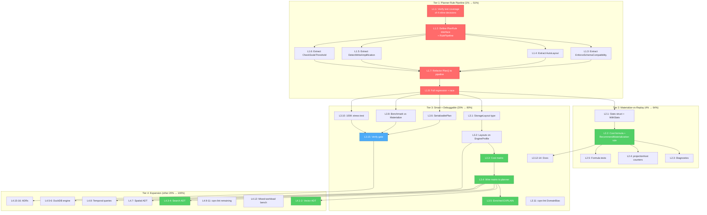

# SUPERB Metaengine Planner & Architecture Evolution — Unified Execution Plan

> **Date:** 2026-08-01 04:18
> **Status:** Tier 4 substantially complete — planner pipeline, materialize-vs-replay, cost matrix, serialization, Vector/Search/Spatial ADTs, DuckDB+Postgres engines, temporal queries, benchmarks, property/chaos tests, block suppression, ADRs all shipped. Deferred: L3.11 (DomainBias), L4.10 (cross-module lint rules), L4.11 (new lint categories).
> **Source:** Synthesis of **14 planning docs** from `docs/planning/2026-07-3*` (cqrs-lint ×4, metaengine ×8, cross-cutting umbrella ×1, MySQL ×1 — see Appendix A for the full inventory and cross-reference)
> **One-line thesis:** The integration era is over (WithMetaEngine, DurabilityTier, MVP, MySQL, duckdb tag all shipped). The frontier is making the **planner composable** so every future capability (statistics, materialize-vs-replay, new ADTs, new engines) is an additive rule instead of a monolith hack.

---

## 0. How To Read This Plan

This document supersedes the 14 predecessor plans as the **single source of truth for remaining work**. It is built on three pillars:

1. **Verified state** — every "DONE" claim below was checked against the repo on 2026-08-01, not copied from a stale status report.
2. **Correct sequencing** — ordered to eliminate Verschlimmbessern (well-intentioned destruction). Refactor working code ONLY after test coverage exists; build features ONLY after the foundation is clean.
3. **Pareto discipline** — the 1% that delivers 51% is identified, defended, and sequenced first.

**If you read nothing else, read Section 3 (Pareto) and Section 5 (Verschlimmbessern).**

---

## 1. Context: What the 14 Docs Collectively Describe

Over 2026-07-30 and 2026-07-31, the project produced 14 planning documents spanning three domains:

| Domain               | Docs      | Core question                                                                                        |
| -------------------- | --------- | ---------------------------------------------------------------------------------------------------- |
| **cqrs-lint**        | 4 (07-30) | How do we make a 175-rule linter trustworthy enough to run on real consumer code?                    |
| **metaengine**       | 8 (07-31) | How do we turn a 19,350-line "strategic future" into a proven, integrated, composable query planner? |
| **Backends / MySQL** | 2 (07-31) | How do we make 5 backends honestly comparable and production-ready?                                  |

The 14 docs describe a **four-act journey**:

| Act                       | Window      | Theme                                                                      | Status                                                                 |
| ------------------------- | ----------- | -------------------------------------------------------------------------- | ---------------------------------------------------------------------- |
| I. Trustworthy linting    | 07-30       | Validate against real code, fix precision, clean self-lint, triage backlog | **Largely DONE** (175 rules, self-lint mode, 17 backlog items shipped) |
| II. Fix metaengine damage | 07-31 early | Repair broken stubs, lying docs, SQL injection                             | **DONE**                                                               |
| III. Integrate + prove    | 07-31 mid   | WithMetaEngine, DurabilityTier, MVP migration, MySQL, duckdb tag           | **DONE** (verified)                                                    |
| IV. Evolve the planner    | 07-31 late  | Rule pipeline, statistics, materialize-vs-replay, new ADTs, new engines    | **NOT DONE — this is the frontier**                                    |

**This plan covers Act IV** — the only act with substantial open work. Acts I–III are summarized in Section 2 as "shipped" with residual items called out where they remain.

---

## 2. Current State Assessment (verified 2026-08-01)

> Honest accounting. "DONE" = confirmed present in the repo. "OPEN" = confirmed absent or explicitly unresolved.

### Shipped Since the Plans Were Written

| Item                                     | Plan that proposed it                        | Evidence                                                    |
| ---------------------------------------- | -------------------------------------------- | ----------------------------------------------------------- |
| `stack.WithMetaEngine(store)` option     | `17-34` first-class-integration (the 1%→51%) | `stack/options.go`, `bundle.go`, `stack/metaengine_test.go` |
| `DurabilityTier` across ALL 6 presets    | `18-53` backend-tradeoff (the 4%→64%)        | `stack/durability.go` + every preset                        |
| `stack/duckdb/v4.0.0` tagged             | `17-53` umbrella T2.1 (release blocker)      | `git tag -l`                                                |
| MySQL wired into `flake.nix`             | `19-46` mysql-polish (the 1%→51%)            | `rg stack/mysql flake.nix`                                  |
| `handleListTasks` migrated to metaengine | `19-30` mvp-superb (the 1%→51%)              | `example/taskmanager/metaengine.go`                         |
| FluentBuilder (ghost) deleted            | `19-30` mvp-superb Phase B                   | not found in `metaengine/`                                  |
| SSE test hang fixed                      | `17-53` umbrella T1.2                        | `TestSSE*` passes in 2.3s                                   |
| cqrs-lint: 175→179 rules, self-lint mode | `21-16` backlog (17 items done)              | 179 rule entries; `IsLibrarySelfLint()`                     |

### Open — The Frontier (confirmed NOT done)

| Item                                              | Plan                                                                            | Evidence of absence                                      |
| ------------------------------------------------- | ------------------------------------------------------------------------------- | -------------------------------------------------------- |
| **Planner rule pipeline** (the monolith refactor) | `23-30` planner-evolution T1                                                    | `planner.go` is still 279 lines; no `PlanRule` interface |
| **Statistics + materialize-vs-replay**            | `23-30` T2                                                                      | no `Stats` struct, no `RecommendMaterialization`         |
| **Plan serialization + enriched EXPLAIN**         | `23-30` T3                                                                      | no `SerializablePlan`                                    |
| **StorageLayout type + cost matrix**              | `23-34` layered-arch Phase 1                                                    | no `StorageLayout` type                                  |
| **New ADTs: Vector, Search, Spatial**             | `23-34` Phases 2-4                                                              | none present                                             |
| **DuckDB / Postgres metaengine engines**          | `23-34` Phase 5, `03-46` #33-34                                                 | no `duckdbengine/`, no `pgengine/`                       |
| **Temporal queries (VersionedStorage)**           | `23-34` Phase 6                                                                 | not present                                              |
| **cqrs-lint: ~17 open backlog items**             | `21-16` (L1.5, L1.15, L1.18-22, L1.26, L1.29-33, L1.35, L1.39, L1.45, L1.47-50) | marked "Open" in backlog doc                             |

### Residual Items From Earlier Acts (lower priority)

These survive from Acts I–III but are NOT on the critical path:

- **20-30 remaining-master**: benchmarks (V1 metaengine vs Materialize, V3 cost calibration, V4 100K stress), documentation (X1 AGENTS.md, X2 SKILL recipes, X4 migration guide, X8 cookbook). Valuable but not blocking.
- **18-53 backend-tradeoff residual**: mixed-workload benchmark phase, warm/cold read split, Turso option surfacing, DuckDB analytical phase. DurabilityTier foundation is done; the benchmarking layer is not.
- **17-53 umbrella residual**: most Tier 1/2 items shipped; Tier 3/4 items (lint-sweep mechanism, real-consumer lint validation, ADRs) remain.

---

## 3. Pareto Breakdown

> Synthesized across all 14 docs, filtered through verified state. Only OPEN work is ranked.

### The 1% That Delivers 51%: Planner Rule Pipeline Extraction

**Extract the 4 inline decisions in `planner.go` (279 lines) into composable, independently-testable `PlanRule` types. Pure refactor. Zero behavior change. Existing 48 test files are the safety net.**

The four inline decisions to extract:

| #   | Inline decision                                                 | Location today                          | Lines |
| --- | --------------------------------------------------------------- | --------------------------------------- | ----- |
| A   | Schema enforcement (fold valueType ≠ result type)               | `planner.go:90-106`                     | ~17   |
| B   | Auto-layout (detect LayoutPlanner, build LayoutPlan, apply DDL) | `planner.go:113-143`                    | ~31   |
| C   | Write-amplification detection                                   | `plan_types.go:checkWriteAmplification` | ~22   |
| D   | Scale-threshold check                                           | `cost.go:checkScaleThreshold`           | ~22   |

**Why this is the 1%→51%** (defended, not assumed):

1. **It is the prerequisite for every subsequent planner capability.** Statistics, materialize-vs-replay, the cost matrix, temporal routing — every one of these is "a new rule." Without the rule pipeline, each is an inline hack into a growing monolith. With it, each is one new file implementing one interface. This is DataFusion's core architectural lesson (`datafusion-lessons` doc, Part 3.1): _"This is the highest-leverage single change."_
2. **It is SAFE.** The logic does not change. Code moves from inline blocks into named, testable functions. The doc (`23-30`) is explicit: _"If any test breaks, the extraction was wrong."_ There is no behavior to design, only structure to move.
3. **It makes EXPLAIN trustworthy.** Today `PlanResult.Report()` shows the outcome, not the reasoning. After extraction, each rule can record why it fired. A planner you cannot debug is a planner you cannot trust.
4. **It is the only change that makes the monolith _smaller_.** Every other item in this plan adds code. This one pays down debt first.

**Effort:** ~4 hours (half a day). The `23-30` doc decomposes it into 9 sub-tasks.

### The 4% That Delivers 64%: Statistics + Materialize-vs-Replay

**Add optional write/read-rate input and the materialize-vs-replay cost formula. This is THE event-sourcing-specific killer feature that no relational query engine can offer.**

The cost formula (from `23-30`, proven in the analysis):

```
replay_cost(q)      = read_rate × avg_stream_length × fold_cost_per_event
materialize_cost(q) = write_rate × fold_cost_per_event + read_rate × query_cost

Materialize when: materialize_cost < replay_cost
```

**Why this is the 4%→64%** (defended):

1. **It is categorically different from DataFusion.** No relational query engine can ask "should this table exist?" — tables are deployment facts. In event sourcing, projections are _planning decisions_. This single capability makes the metaengine understand the domain in a way no generic planner can.
2. **It is a small amount of code.** One `Stats` struct, one formula, one `RecommendMaterialization` rule. But it delivers the feature that makes consumers say _"this planner understands my domain."_
3. **It builds directly on the 1%.** The materialize-vs-replay decision IS a rule — it slots into the rule pipeline built in the 1% phase. Sequencing is clean: pipeline first, then this rule.
4. **Customer value is maximal.** Every ES system faces the materialize-vs-replay tradeoff manually. Automating it is the highest-leverage planning decision in the entire CQRS/ES space.

**Dependency:** Requires the rule pipeline (1%). Requires projectionhost write/read counters to feed the `Stats` struct (one wiring task).

**Effort:** ~3 hours on top of the 1%.

### The 20% That Delivers 80%: Cost Matrix + Plan Serialization + Trust Layer

**Make the planner genuinely smart AND debuggable.** Three capabilities:

| Capability                      | What                                                                                              | Why it matters                                                                                                                                  |
| ------------------------------- | ------------------------------------------------------------------------------------------------- | ----------------------------------------------------------------------------------------------------------------------------------------------- |
| **StorageLayout + cost matrix** | `EngineProfile` gains `Layouts map[ADT]StorageLayout`; universal (ADT × Layout)→Complexity lookup | Planner reasons about _why_ one engine beats another (columnar beats B-Tree for Counter), not opaque NsPerOp. Makes EXPLAIN show the reasoning. |
| **Plan serialization**          | `SerializablePlan` type; persist/diff/pin plan decisions                                          | "Why did the planner pick this engine?" → inspect serialized plan. "Did the plan change after deploy?" → diff. Debuggability = trust.           |
| **Enriched EXPLAIN**            | Show the full rule chain in `PlanResult.Report()`                                                 | A planner you cannot debug is a planner you cannot trust. Each rule records why it fired.                                                       |

Plus the **trust layer** — finishing the residual cqrs-lint and documentation items that make the whole system credible:

- cqrs-lint: domain-based severity calibration (L1.5), the last high-value strategic rule
- metaengine: benchmark vs Materialize (V1), cost calibration (V3), 100K stress test (V4)
- docs: migration guide kv→metaengine (X4), SKILL recipes (X2), AGENTS.md planner section (X1)

**Effort:** ~10 hours.

### The Other 20% (to Reach 100%): Expansion

New ADTs, new engines, temporal queries, and remaining polish. Each is valuable but NONE is on the critical path:

| Item                                       | Impact                       | Effort    | Note                                                                          |
| ------------------------------------------ | ---------------------------- | --------- | ----------------------------------------------------------------------------- |
| **Vector ADT** (k-NN, RAG/semantic search) | HIGH (modern differentiator) | ~5h       | The #1 expansion — no Go CQRS lib offers planner-routed vector projections    |
| **Search ADT** (full-text, inverted index) | HIGH                         | ~4h       | Every content app needs it; Memory impl removes external ES dependency        |
| **DuckDB metaengine engine**               | MEDIUM                       | ~6h       | Proves columnar pushdown pattern; Counter becomes O(1) via native aggregation |
| **Spatial ADT** (geo range)                | MEDIUM                       | ~4h       | Unblocks geo apps                                                             |
| **Postgres metaengine engine**             | MEDIUM                       | Multi-day | JSONB operators, GIN indexes                                                  |
| **Temporal queries (VersionedStorage)**    | HIGH (ES-specific)           | 4h+       | O(1) as-of reads; BigTable-style versioned cells                              |
| **cqrs-lint remaining ~16 items**          | LOW-MEDIUM                   | ~12h      | DOC/OBS/RES/DI categories, PII detection, branded-ID misuse, etc.             |
| **Mixed-workload benchmark**               | MEDIUM                       | ~4h       | The real production question (reads during writes)                            |
| **Property-based / chaos testing**         | MEDIUM                       | ~6h       | Regression prevention                                                         |

---

## 4. Verschlimmbessern Risk Assessment

> _"If you VERSCHLIMMBESSER this system, I will cut off your balls."_ — the user.
>
> This section is the defense. Every task below is rated for well-intentioned-destruction risk with a concrete mitigation.

| Task                                       | Risk       | What would make it WORSE                                                                                   | Mitigation                                                                                                                                                                                                | Verdict                  |
| ------------------------------------------ | ---------- | ---------------------------------------------------------------------------------------------------------- | --------------------------------------------------------------------------------------------------------------------------------------------------------------------------------------------------------- | ------------------------ |
| **Planner rule pipeline extraction**       | MEDIUM     | Moving logic incorrectly → silent cost-model regression → wrong engine picks → slow queries nobody notices | Run full 48-file test suite after EACH rule extraction. If ANY test fails, the extraction is wrong — revert that one rule. Extract one rule at a time, never batch.                                       | **SAFE if disciplined**  |
| **Materialize-vs-replay**                  | LOW        | Cost formula wrong → wrong materialization recommendation                                                  | The formula is proven algebraically in `23-30`. It's an ADVISORY diagnostic (INFO/WARN), not a hard override. Wrong advice is annoying, not destructive.                                                  | **SAFE**                 |
| **StorageLayout + cost matrix**            | MEDIUM     | Changing EngineProfile shape → breaks all 3 engine implementations                                         | Additive only: new `Layouts` field, zero existing fields changed. Default layout = current behavior. Matrix is a NEW lookup, doesn't replace existing cost path until verified.                           | **SAFE if additive**     |
| **Plan serialization**                     | LOW        | Serialization format wrong → plans can't roundtrip                                                         | Pure addition. New type, new file. Existing `Plan()` untouched. Roundtrip tests gate it.                                                                                                                  | **SAFE**                 |
| **Vector/Search ADTs**                     | MEDIUM     | New ADT + fold path → bugs in `applyFold` switch → panics on real events                                   | The 9-touchpoint extension pattern is mechanical and documented (`23-34`). Each ADT adds a case to `applyFold`; missing the case = compile error, not runtime bug. Memory impl first, test before SQLite. | **SAFE if mechanical**   |
| **DuckDB metaengine engine**               | LOW-MEDIUM | CGo isolation, dialect bugs                                                                                | Isolated in own module (CGo boundary). Doesn't touch existing engines.                                                                                                                                    | **SAFE if isolated**     |
| **Changing Pebble/SQLite defaults**        | LOW        | Bloom filters are data-transparent; already shipped via DurabilityTier                                     | Already done — not in this plan.                                                                                                                                                                          | N/A                      |
| **Consolidating the two SSE impls**        | **HIGH**   | Different semantics (collection-watch vs bus-to-client); merging breaks both                               | **EXPLICITLY DEFERRED.** The `17-34` doc rates this HIGH risk, LOW value. Do NOT touch.                                                                                                                   | **DEFER**                |
| **Refactoring planner BEFORE tests exist** | HIGH       | Refactor without safety net = guaranteed regression                                                        | Tests DO exist (48 files). But verify coverage of the 4 inline decisions BEFORE extracting. Add targeted tests for any uncovered decision first.                                                          | **SAFE if tested first** |

**The golden rule of this plan: extract one rule, run all tests, commit. Repeat. Never batch extractions. Never refactor untested code. Never merge the SSE implementations.**

---

## 5. Level 1: Comprehensive Plan (30–100min tasks)

> Sorted by **importance → impact → effort (ascending) → customer-value (descending)**.
> Dependencies: `→` means "must complete first." Tier reflects Pareto layer.

### Tier 1: The 1% → 51% (Planner Foundation)

| ID       | Work Package                                                                   | Impact   | Effort | Customer Value                  | Dependencies | Tier |
| -------- | ------------------------------------------------------------------------------ | -------- | ------ | ------------------------------- | ------------ | ---- |
| **L1.1** | Verify test coverage of the 4 inline decisions; add targeted tests for any gap | CRITICAL | 45min  | Trust (safety net for refactor) | —            | 1    |
| **L1.2** | Define `PlanRule` interface, `PlanContext`, `RulePipeline` type                | CRITICAL | 45min  | Enables all future planner work | L1.1         | 1    |
| **L1.3** | Extract `EnforceSchemaCompatibility` rule (decision A)                         | HIGH     | 30min  | Composable, testable            | L1.2         | 1    |
| **L1.4** | Extract `AutoLayout` rule (decision B)                                         | HIGH     | 45min  | Composable, testable            | L1.2         | 1    |
| **L1.5** | Extract `DetectWriteAmplification` rule (decision C)                           | HIGH     | 30min  | Composable, testable            | L1.2         | 1    |
| **L1.6** | Extract `CheckScaleThreshold` rule (decision D)                                | HIGH     | 30min  | Composable, testable            | L1.2         | 1    |
| **L1.7** | Refactor `Plan()` to use `RulePipeline`; verify zero behavior change           | CRITICAL | 45min  | Monolith → pipeline             | L1.3–L1.6    | 1    |
| **L1.8** | Full regression: run all 48 metaengine test files + `-race -count=1`           | CRITICAL | 30min  | Proves zero regression          | L1.7         | 1    |

**Tier 1 total: ~5h. This is the non-negotiable foundation.**

### Tier 2: The 4% → 64% (Materialize-vs-Replay)

| ID       | Work Package                                                                        | Impact   | Effort | Customer Value                 | Dependencies | Tier |
| -------- | ----------------------------------------------------------------------------------- | -------- | ------ | ------------------------------ | ------------ | ---- |
| **L2.1** | Define `Stats` struct (WriteRate, ReadRate, AvgStreamLength) + `WithStats()` option | HIGH     | 30min  | Statistical input to planner   | L1.8         | 2    |
| **L2.2** | Implement materialize-vs-replay cost formula + `RecommendMaterialization` rule      | CRITICAL | 45min  | THE ES-specific killer feature | L2.1         | 2    |
| **L2.3** | Add materialization diagnostics (INFO/WARN levels in PlanResult)                    | MEDIUM   | 30min  | Consumer visibility            | L2.2         | 2    |
| **L2.4** | Wire projectionhost write/read counters → feed `Stats` automatically                | HIGH     | 60min  | Automatic, no manual input     | L2.2         | 2    |
| **L2.5** | Write materialization recommendation tests (formula correctness)                    | HIGH     | 30min  | Formula verified               | L2.2         | 2    |

**Tier 2 total: ~3.25h.**

### Tier 3: The 20% → 80% (Smart + Debuggable Planner + Trust Layer)

| ID        | Work Package                                                                  | Impact   | Effort | Customer Value                               | Dependencies | Tier |
| --------- | ----------------------------------------------------------------------------- | -------- | ------ | -------------------------------------------- | ------------ | ---- |
| **L3.1**  | Define `StorageLayout` type + constants (Row, Columnar, LSM, KV)              | HIGH     | 45min  | Planner reasons about physical layout        | L1.8         | 3    |
| **L3.2**  | Add `Layouts map[ADT]StorageLayout` to `EngineProfile`; update 3 engines      | HIGH     | 60min  | Each engine declares its layouts             | L3.1         | 3    |
| **L3.3**  | Build universal cost matrix: (ADT × StorageLayout) → Complexity               | HIGH     | 60min  | Planner picks engine by structural reasoning | L3.2         | 3    |
| **L3.4**  | Wire cost matrix into planner (alongside existing cost path)                  | HIGH     | 45min  | Smarter engine selection                     | L3.3         | 3    |
| **L3.5**  | Enrich EXPLAIN: show rule chain + layout reasoning in `Report()`              | MEDIUM   | 45min  | Debuggable planner                           | L1.7, L3.4   | 3    |
| **L3.6**  | Define `SerializablePlan` type + serialization/deserialization                | MEDIUM   | 45min  | Plans persistable, diffable, pinnable        | L1.8         | 3    |
| **L3.7**  | Plan serialization roundtrip tests                                            | MEDIUM   | 30min  | Serialization verified                       | L3.6         | 3    |
| **L3.8**  | Benchmark: metaengine filtered scan vs Materialize.List + Go filter           | HIGH     | 60min  | Proves the value claim with numbers          | L1.8         | 3    |
| **L3.9**  | Cost model calibration benchmarks (vary N: 100/1K/10K/100K)                   | MEDIUM   | 60min  | Cost model accuracy verified                 | L3.4         | 3    |
| **L3.10** | 100K-event stress test (point lookup + filtered scan correctness + latency)   | HIGH     | 60min  | Scale confidence                             | L1.8         | 3    |
| **L3.11** | cqrs-lint: domain-based severity calibration (`DomainBias` on FeatureProfile) | MEDIUM   | 90min  | All rules adapt to domain context            | —            | 3    |
| **L3.12** | Docs: migration guide kv.ViewStore → metaengine                               | HIGH     | 45min  | Consumers can migrate                        | L1.8         | 3    |
| **L3.13** | Docs: SKILL.md recipes (filtered scan, multi-engine, point lookup)            | HIGH     | 45min  | AI consumer guide current                    | L1.8         | 3    |
| **L3.14** | Docs: AGENTS.md planner + materialization section                             | HIGH     | 45min  | Contributor guide current                    | L2.2         | 3    |
| **L3.15** | Regen API stability golden + full `nix run .#verify`                          | CRITICAL | 30min  | Gate passes                                  | All above    | 3    |

**Tier 3 total: ~13.5h.**

### Tier 4: The Other 20% → 100% (Expansion)

| ID        | Work Package                                                                         | Impact | Effort    | Customer Value                                | Dependencies | Tier |
| --------- | ------------------------------------------------------------------------------------ | ------ | --------- | --------------------------------------------- | ------------ | ---- |
| **L4.1**  | Vector ADT: `VectorBackend` interface + `Embedding` fold + Memory brute-force k-NN   | HIGH   | 100min    | RAG/semantic search (no Go CQRS lib has this) | L3.4         | 4    |
| **L4.2**  | Vector ADT: `applyFoldVector` + `VectorExecuteTyped` + tests                         | HIGH   | 60min     | End-to-end vector pipeline                    | L4.1         | 4    |
| **L4.3**  | Search ADT: `SearchBackend` + `IndexedText` fold + Memory inverted-index             | HIGH   | 90min     | Full-text search without external ES          | L3.4         | 4    |
| **L4.4**  | Search ADT: `applyFoldSearch` + `SearchExecuteTyped` + tests                         | HIGH   | 60min     | End-to-end search pipeline                    | L4.3         | 4    |
| **L4.5**  | DuckDB metaengine engine: module + MapBackend + CounterBackend columnar pushdown     | MEDIUM | 100min    | Columnar analytics; proves layered arch       | L3.2         | 4    |
| **L4.6**  | DuckDB engine: PushdownScan + Profile + ADT matrix tests + calibration               | MEDIUM | 90min     | Full DuckDB engine                            | L4.5         | 4    |
| **L4.7**  | Spatial ADT: `SpatialBackend` + `Geometry` fold + Memory brute-force                 | MEDIUM | 90min     | Geo range queries                             | L3.4         | 4    |
| **L4.8**  | Temporal queries: `VersionedStorage` interface + `AsOf` signal + planner routing     | HIGH   | 90min     | O(1) as-of reads (ES-specific)                | L3.4         | 4    |
| **L4.9**  | cqrs-lint: block-level suppression (`ignore-start`/`ignore-end`)                     | MEDIUM | 90min     | DX                                            | —            | 4    |
| **L4.10** | cqrs-lint: remaining cross-module rules (snapshot codec, event typo, orphaned types) | MEDIUM | 90min     | Catches real consumer bugs                    | —            | 4    |
| **L4.11** | cqrs-lint: new categories (DOC/OBS/RES/DI) — ambitious                               | LOW    | 100min+   | Expanded coverage                             | L3.11        | 4    |
| **L4.12** | Mixed-workload benchmark phase (reads during writes)                                 | MEDIUM | 90min     | Real production question                      | —            | 4    |
| **L4.13** | Property-based cross-engine parity testing (rapid)                                   | MEDIUM | 90min     | Regression prevention                         | L3.10        | 4    |
| **L4.14** | Chaos testing harness (random tx kills, engine swaps)                                | LOW    | 100min    | Failure-mode coverage                         | L3.10        | 4    |
| **L4.15** | ADR: planner rule pipeline architecture                                              | MEDIUM | 45min     | Decision documented                           | L1.8         | 4    |
| **L4.16** | ADR: layered architecture (StorageLayout, cost matrix, new ADTs)                     | MEDIUM | 45min     | Decision documented                           | L3.4         | 4    |
| **L4.17** | Postgres metaengine engine (`pgengine/`)                                             | LOW    | Multi-day | JSONB + GIN indexes                           | L3.2         | 4    |

**Tier 4 total: ~20h+ (Multi-day for Postgres engine).**

### Summary

| Tier | Pareto           | Tasks | Effort | Cumulative |
| ---- | ---------------- | ----- | ------ | ---------- |
| 1    | 1% → 51%         | 8     | ~5h    | 5h         |
| 2    | 4% → 64%         | 5     | ~3.25h | 8.25h      |
| 3    | 20% → 80%        | 15    | ~13.5h | 21.75h     |
| 4    | other 20% → 100% | 17    | ~20h+  | ~42h+      |

---

## 6. Level 2: Atomic Tasks (max 12min each)

> Every Level 1 task decomposed into sub-tasks small enough to execute and verify individually.
> Format: `Parent.Sub`. Sorted by parent, then execution order.

### Tier 1 Subtasks: Planner Rule Pipeline

| Sub-ID | Task                                                                                       | Max min | Verifies                     | Parent |
| ------ | ------------------------------------------------------------------------------------------ | ------- | ---------------------------- | ------ |
| L1.1.1 | Read `planner.go` fully (279 lines); map the 4 inline decisions + their line ranges        | 10      | Understand current structure | L1.1   |
| L1.1.2 | Grep for tests covering schema enforcement; note coverage gaps                             | 8       | Know what's tested           | L1.1   |
| L1.1.3 | Grep for tests covering auto-layout; note coverage gaps                                    | 8       | Know what's tested           | L1.1   |
| L1.1.4 | Grep for tests covering write-amplification; note coverage gaps                            | 8       | Know what's tested           | L1.1   |
| L1.1.5 | Grep for tests covering scale-threshold; note coverage gaps                                | 8       | Know what's tested           | L1.1   |
| L1.1.6 | Write targeted test for any uncovered decision (close the gap)                             | 12      | Safety net exists            | L1.1   |
| L1.2.1 | Create `rules.go` with package doc comment explaining rule lifecycle                       | 5       | File exists                  | L1.2   |
| L1.2.2 | Define `PlanRule` interface: `Name() string`, `Apply(result *PlanResult, ctx PlanContext)` | 8       | Compiles                     | L1.2   |
| L1.2.3 | Define `PlanContext` struct: `Engines`, `Store`, `Options`, `Stats`                        | 8       | Compiles                     | L1.2   |
| L1.2.4 | Define `RulePipeline` type with `Apply(result, ctx)` method (iterate rules)                | 10      | Compiles                     | L1.2   |
| L1.2.5 | Write doc comments: rules run AFTER engine assignment, enrich not override                 | 5       | Documented                   | L1.2   |
| L1.2.6 | Run `go build -tags "goexperiment.jsonv2" ./metaengine/...`                                | 2       | Compiles clean               | L1.2   |
| L1.3.1 | Create `rule_schema.go`                                                                    | 2       | File exists                  | L1.3   |
| L1.3.2 | Move fold valueType ≠ result type check from `planner.go:90-106`                           | 10      | Logic moved                  | L1.3   |
| L1.3.3 | Implement `PlanRule.Apply` — iterate queries, add `DiagLevelWarn`                          | 8       | Compiles                     | L1.3   |
| L1.3.4 | Remove inline code from `planner.go`                                                       | 5       | Monolith shrinks             | L1.3   |
| L1.3.5 | Run `go test ./metaengine/... -count=1` — zero behavior change                             | 5       | All pass                     | L1.3   |
| L1.4.1 | Create `rule_layout.go`                                                                    | 2       | File exists                  | L1.4   |
| L1.4.2 | Move auto-layout block from `planner.go:113-143`                                           | 12      | Logic moved                  | L1.4   |
| L1.4.3 | Handle `LayoutPlanner` engine capability check (`engine.(LayoutPlanner)`)                  | 8       | Compiles                     | L1.4   |
| L1.4.4 | Handle `dryRun` option (skip `ApplyLayout` when dry)                                       | 8       | Compiles                     | L1.4   |
| L1.4.5 | Remove inline code from `planner.go`; run tests                                            | 8       | All pass                     | L1.4   |
| L1.5.1 | Create `rule_writeamp.go`                                                                  | 2       | File exists                  | L1.5   |
| L1.5.2 | Move `checkWriteAmplification` from `plan_types.go`                                        | 10      | Logic moved                  | L1.5   |
| L1.5.3 | Implement `PlanRule.Apply`; remove inline call from `planner.go`                           | 8       | Compiles                     | L1.5   |
| L1.5.4 | Run tests — zero behavior change                                                           | 5       | All pass                     | L1.5   |
| L1.6.1 | Create `rule_scale.go`                                                                     | 2       | File exists                  | L1.6   |
| L1.6.2 | Move `checkScaleThreshold` logic into rule                                                 | 10      | Logic moved                  | L1.6   |
| L1.6.3 | Implement `PlanRule.Apply`; remove inline call                                             | 8       | Compiles                     | L1.6   |
| L1.6.4 | Run tests — zero behavior change                                                           | 5       | All pass                     | L1.6   |
| L1.7.1 | Refactor `Plan()` to construct `RulePipeline` with the 4 extracted rules                   | 12      | Compiles                     | L1.7   |
| L1.7.2 | Call `pipeline.Apply(result, ctx)` where inline decisions were                             | 8       | Compiles                     | L1.7   |
| L1.7.3 | Verify `planner.go` is now <150 lines (monolith dissolved)                                 | 3       | Size reduced                 | L1.7   |
| L1.8.1 | Run `go test -tags "goexperiment.jsonv2" ./metaengine/... -count=1`                        | 5       | All pass                     | L1.8   |
| L1.8.2 | Run `go test -race -count=1 ./metaengine/...`                                              | 10      | No races                     | L1.8   |
| L1.8.3 | Run pebbleengine + projectionadapter tests                                                 | 8       | All pass                     | L1.8   |

### Tier 2 Subtasks: Materialize-vs-Replay

| Sub-ID | Task                                                                                   | Max min | Verifies         | Parent |
| ------ | -------------------------------------------------------------------------------------- | ------- | ---------------- | ------ |
| L2.1.1 | Define `Stats` struct: `WriteRatePerSec`, `ReadRatePerSec`, `AvgStreamLength` float64  | 8       | Compiles         | L2.1   |
| L2.1.2 | Add `WithStats(stats map[string]Stats)` option to `Plan()`                             | 8       | Compiles         | L2.1   |
| L2.1.3 | Thread Stats into `PlanContext`                                                        | 5       | Compiles         | L2.1   |
| L2.1.4 | Write test: `WithStats` populates context                                              | 8       | Test passes      | L2.1   |
| L2.2.1 | Implement cost formula as `materializeCost` / `replayCost` functions                   | 12      | Compiles         | L2.2   |
| L2.2.2 | Create `rule_materialize.go`; implement `RecommendMaterialization` rule                | 12      | Compiles         | L2.2   |
| L2.2.3 | Rule emits `DiagLevelInfo` when materialize wins, `DiagLevelWarn` when replay wins     | 8       | Compiles         | L2.2   |
| L2.2.4 | Add rule to default `RulePipeline`                                                     | 5       | Wired            | L2.2   |
| L2.3.1 | Add materialization diagnostic to `PlanResult.Diagnostics` with human-readable message | 10      | Compiles         | L2.3   |
| L2.3.2 | Verify EXPLAIN shows the recommendation                                                | 8       | Output correct   | L2.3   |
| L2.4.1 | Read projectionhost worker code; identify write count + read count sources             | 10      | Understand hooks | L2.4   |
| L2.4.2 | Add write/read counters to projectionhost `Worker` (atomic increments)                 | 12      | Compiles         | L2.4   |
| L2.4.3 | Expose `Worker.Stats() map[string]Stats`                                               | 8       | Compiles         | L2.4   |
| L2.4.4 | Write test: counters increment on event apply + query                                  | 10      | Test passes      | L2.4   |
| L2.5.1 | Write test: high read/write ratio → recommends materialize                             | 10      | Formula correct  | L2.5   |
| L2.5.2 | Write test: low read/write ratio → recommends replay                                   | 10      | Formula correct  | L2.5   |
| L2.5.3 | Write test: no stats provided → no recommendation (graceful no-op)                     | 8       | Graceful         | L2.5   |

### Tier 3 Subtasks: Cost Matrix + Serialization + Trust (representative)

| Sub-ID  | Task                                                                                            | Max min | Verifies         | Parent |
| ------- | ----------------------------------------------------------------------------------------------- | ------- | ---------------- | ------ |
| L3.1.1  | Define `StorageLayout` type + constants: `LayoutRow`, `LayoutColumnar`, `LayoutLSM`, `LayoutKV` | 10      | Compiles         | L3.1   |
| L3.1.2  | Write doc comment explaining each layout's physical characteristics                             | 8       | Documented       | L3.1   |
| L3.2.1  | Add `Layouts map[ADT]StorageLayout` field to `EngineProfile`                                    | 5       | Compiles         | L3.2   |
| L3.2.2  | Set layouts on Memory engine profile (all KV/layout-agnostic)                                   | 5       | Compiles         | L3.2   |
| L3.2.3  | Set layouts on SQLite engine profile (Row for Map, Row for Counter)                             | 8       | Compiles         | L3.2   |
| L3.2.4  | Set layouts on Pebble engine profile (LSM for all)                                              | 8       | Compiles         | L3.2   |
| L3.2.5  | Verify zero behavior change (default layout = current behavior)                                 | 8       | Tests pass       | L3.2   |
| L3.3.1  | Create `cost_matrix.go`; define `(ADT, StorageLayout) → Complexity` lookup table                | 12      | Compiles         | L3.3   |
| L3.3.2  | Fill matrix: e.g., (Counter, Columnar)→O(1), (Counter, Row)→O(N), (Map, KV)→O(1)                | 12      | Matrix complete  | L3.3   |
| L3.4.1  | Add matrix lookup to cost calculation in planner (alongside existing NsPerOp)                   | 12      | Compiles         | L3.4   |
| L3.4.2  | Write test: matrix selects columnar engine for Counter when available                           | 10      | Smarter picks    | L3.4   |
| L3.5.1  | Add rule chain recording to `PlanResult` (each rule appends its name + reasoning)               | 12      | Compiles         | L3.5   |
| L3.5.2  | Update `Report()` to print the rule chain                                                       | 8       | EXPLAIN enriched | L3.5   |
| L3.6.1  | Define `SerializablePlan` struct (JSON-serializable: engines, queries, rules, layouts)          | 10      | Compiles         | L3.6   |
| L3.6.2  | Implement `Serialize(result *PlanResult) ([]byte, error)`                                       | 10      | Compiles         | L3.6   |
| L3.6.3  | Implement `Deserialize(data []byte) (*SerializablePlan, error)`                                 | 10      | Compiles         | L3.6   |
| L3.7.1  | Write roundtrip test: serialize → deserialize → compare                                         | 10      | Roundtrip works  | L3.7   |
| L3.8.1  | Write `BenchmarkMetaEngineFilteredScan`: seed 1K/10K tasks, Scan with FilterOnField             | 12      | Compiles         | L3.8   |
| L3.8.2  | Write `BenchmarkMaterializeListAndFilter`: same data, mat.List() + Go filter                    | 10      | Compiles         | L3.8   |
| L3.8.3  | Run both, capture ns/op + allocs/op; write results summary                                      | 10      | Results captured | L3.8   |
| L3.10.1 | Write `TestStress_100KEvents`: seed 100K tasks via Apply loop                                   | 12      | Compiles         | L3.10  |
| L3.10.2 | Verify point-lookup Get on random IDs; verify filtered Scan count                               | 10      | Correctness      | L3.10  |
| L3.10.3 | Capture p50/p99 latency; assert no memory leak (MemStats)                                       | 10      | Stable           | L3.10  |
| L3.15.1 | Run `cd cmd/api-stability && GOWORK=off go run main.go -update`                                 | 5       | Golden regen     | L3.15  |
| L3.15.2 | Run `nix run .#verify`; fix any failures                                                        | 12      | GREEN            | L3.15  |

> Tier 4 subtasks follow the same ≤12min decomposition pattern documented in `23-34` (9-touchpoint ADT extension) and are omitted here for brevity. Each ADT (Vector/Search/Spatial) decomposes into: interface design (10min) → fold type + classification (10min) → On handler (8min) → Memory impl (12min) → applyFold case (8min) → ExecuteTyped path (10min) → tests (12min).

---

## 7. Mermaid Execution Graph



---

## 8. What We Are NOT Doing (and why)

| Item                                                     | Why NOT                                                                                                               | Source           |
| -------------------------------------------------------- | --------------------------------------------------------------------------------------------------------------------- | ---------------- |
| **Consolidate the two SSE implementations**              | Different semantics (collection-watch vs bus-to-client). HIGH risk, LOW value. Explicitly deferred in `17-34`.        | `17-34`, `19-30` |
| **Refactor planner without test coverage**               | Verschlimmbessern. The 4 inline decisions must have tests BEFORE extraction. L1.1 exists for this reason.             | This plan        |
| **Batch-extract all 4 rules at once**                    | Each extraction is verified independently. Batching hides which extraction broke a test. One rule, one commit.        | This plan        |
| **Add new ADTs before the planner is composable**        | Each new ADT touches `applyFold` + planner. Doing this on a monolithic planner compounds risk. Pipeline first.        | `23-30`, `23-34` |
| **Change existing EngineProfile fields**                 | Breaks all 3 engines. `Layouts` is ADDITIVE only.                                                                     | `23-34`          |
| **Remove the existing cost path when adding the matrix** | Matrix runs ALONGSIDE existing NsPerOp until verified. No rip-and-replace.                                            | This plan        |
| **Build Postgres engine before DuckDB engine**           | DuckDB proves the columnar pattern in isolation (own module, CGo boundary). Postgres is multi-day and lower priority. | `23-34`          |

---

## Appendix A: Source Document Inventory

| #   | File                                                         | Domain     | Role in synthesis                                                                    |
| --- | ------------------------------------------------------------ | ---------- | ------------------------------------------------------------------------------------ |
| 1   | `07-30_01-46_cqrs-lint-superb-improvement-plan`              | cqrs-lint  | Act I — validate against real code (largely done)                                    |
| 2   | `07-30_14-41_SELF-LINT-CLEANUP`                              | cqrs-lint  | Act I — self-lint cleanup (done)                                                     |
| 3   | `07-30_18-15_cqrs-lint-self-analysis-precision-fixes`        | cqrs-lint  | Act I — S006/C030 precision (done)                                                   |
| 4   | `07-30_21-16_CQRS-LINT-IMPROVEMENT-BACKLOG-PARETO-PLAN`      | cqrs-lint  | Act I — backlog triage (17 done, ~17 open → Tier 3-4)                                |
| 5   | `07-31_03-46_metaengine-fix-and-finish`                      | metaengine | Act II — fix damage (done)                                                           |
| 6   | `07-31_17-34_metaengine-first-class-integration`             | metaengine | Act III — WithMetaEngine (done)                                                      |
| 7   | `07-31_17-53_SUPERB-PARETO-EXECUTION-PLAN`                   | ALL        | Umbrella — aggregated all open work (Tier 1-2 done, 3-4 open)                        |
| 8   | `07-31_19-30_metaengine-mvp-superb`                          | metaengine | Act III — prove value (done)                                                         |
| 9   | `07-31_19-46_mysql-support-polish-and-completion`            | MySQL      | Act III — CI wiring (done)                                                           |
| 10  | `07-31_20-30_metaengine-remaining-work-master-plan`          | metaengine | Act III residual → benchmarks/docs (Tier 3)                                          |
| 11  | `07-31_datafusion-lessons-for-metaengine`                    | metaengine | Act IV theory — rule pipeline is #1 lesson → **this plan's 1%**                      |
| 12  | `07-31_23-30_SUPERB-METAENGINE-PLANNER-EVOLUTION`            | metaengine | Act IV execution — rule pipeline + materialize-vs-replay → **this plan's Tiers 1-2** |
| 13  | `07-31_23-34_metaengine-layered-architecture-execution-plan` | metaengine | Act IV expansion — StorageLayout + new ADTs → **this plan's Tiers 3-4**              |
| 14  | `07-31_18-53_backend-optimization-and-tradeoff-framework`    | backends   | DurabilityTier (done); mixed-workload bench (Tier 4)                                 |

---

## Appendix B: Residual Items From Earlier Acts (reference, not ranked)

These are NOT on the critical path but are tracked for completeness:

**From `20-30` remaining-master (not covered above):**

- C1: SQLite pragmas on metaengine connection (may be done via DurabilityTier — verify)
- C2: EventDecoder unit test in projectionadapter
- C3: go mod tidy taskmanager
- V2: SortOnField on task_views
- X3: eventWithID wrapper recipe
- X5-X8: doc-check, EventDecoder docs, TieredStore docs, cookbook

**From `18-53` backend-tradeoff (not covered above):**

- P8: Turso indexing API surfacing
- P10: cqrs-bench Turso factory
- P11: Warm/cold read split
- P12-P13: DuckDB options + analytical phase
- P16: Update existing docs with DurabilityTier vocabulary

**From `17-53` umbrella (not covered above):**

- T3.1: Annotate stale intermediate reports
- T3.5: CGo CI job for DuckDB
- T3.6: Recurring lint-sweep mechanism
- T3.8: Run cqrs-lint against real consumer project
- T4.16-17: Extract retry/ and idempotency/ to standalone repos

---

_This plan is the synthesis. The 14 predecessors are the evidence._

---

## Resolution (2026-08-03)

| Item | Status | Evidence |
| ---- | ------ | -------- |
| Tier 1–3: Planner pipeline, cost matrix, serialization | ✅ DONE | Shipped before Aug 2026 |
| Replication model | ✅ DONE | ADR-0093, commits `72818e88`, `f25e1d21` |
| Universal ADT Phase 3 | ✅ DONE | ADR-0094, commit `8b41f658` |
| CalibrateEngine | ✅ DONE | commit `c45b39c8` |
| WatchTyped | ✅ DONE | commit `1246fb44` |
| cqrs-lint 185 rules | ✅ DONE | Tagged `cmd/cqrs-lint/v4.3.0` |
| Iroh evaluation | ✅ DONE | ADR-0096 |
| Extract retry/ + idempotency/ | Open — see TODO_LIST.md "Deferred Debt" |
| Postgres GIN indexes | Open — see TODO_LIST.md |
| metaengine-gen code generator | Open — see ROADMAP.md |
| Generic ScanResult[T] | Open — see ROADMAP.md |
