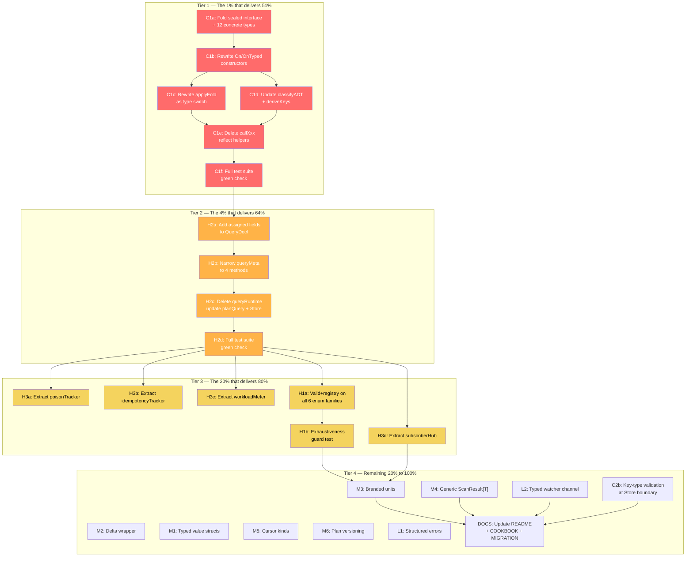

# Metaengine Data Model Refactor — Pareto Execution Plan

> **Created:** 2026-08-01 19:40
> **Module:** `go-cqrs-lite/metaengine/v4` (71 source files, 79 test files, ~15K LOC)
> **Source review:** [docs/reviews/2026-08-01_metaengine-data-model.html](../reviews/2026-08-01_metaengine-data-model.html)
> **Status:** PLANNING — not yet started

---

## Context

The data-model review identified **2 critical, 3 high, 6 medium, 2 low** issues across the
metaengine package. The fold-return-type-IS-the-ADT inference is genuinely elegant and MUST be
preserved — the problem is the internal representation (god-structs, `any` erasure, split-brain
twin types), not the inference design.

**Golden rule: do NOT change the public `On()` / `Query[Q,R]` / `Execute` API signatures.**
External consumers (`benchkit`, `example/taskmanager`, `DiscordSync`) depend on these. All
refactoring is internal. The sealed union is an implementation detail invisible to callers.

**Anti-verschlimmbessering guardrails:**
1. Every step compiles + passes tests before the next step starts.
2. The public API (`On`, `OnTyped`, `Query`, `Plan`, `Execute`, `ExecuteTyped`) is frozen.
3. No new public types without a documented consumer use case.
4. Reflection for inference at declaration time = fine. Reflection on the hot apply path = kill.
5. If a step breaks a consumer test, STOP and reassess — consumer breakage means the API changed.

---

## Pareto Breakdown

### The 1% that delivers 51%

| Issue | Why it dominates |
|-------|------------------|
| **C1: Sealed Fold interface union** | Eliminates the nil-panic class (11 `any` handler fields → 0). Removes all `reflect.ValueOf` from the hot apply path. Makes kind/handler consistency structural, not conventional. Public `On()` API unchanged → **zero consumer breakage**. Blast radius: `fold.go`, `fold_classify.go`, `store.go` (applyFold), `query.go` (classifyADT/deriveKeys). |

### The 4% that delivers 64%

| Issue | Synergy with C1 |
|-------|-----------------|
| **C1** + **H2: Collapse queryRuntime into QueryDecl** | Removes the split-brain twin types (`queryRuntime` vs `QueryDecl[Q,R]`). Kills the 9-method `queryMeta` interface (→ 4 methods). Eliminates the hand-maintained field-copy in `planQuery()`. Together: the two most dangerous structural debtors are gone. |

### The 20% that delivers 80%

| Issue | What it adds |
|-------|-------------|
| **C1** + **H2** + **H3: Store composition** | Extract `poisonTracker`, `idempotencyTracker`, `workloadMeter`, `subscriberHub` → each testable alone, each nil-safe to disable. Store fields: 17 → ~9. |
| **+ H1: Enum validation** | Add `Valid()` + registries to all 6 enum families (`ADT`, `ReadPattern`, `FoldKind`, `Complexity`, `StorageLayout`, `FilterOp`). Catch typos at `Plan()` time instead of silent O(N) fallthrough. |

### The remaining 20% to get to 100%

| Issue | Polish |
|-------|--------|
| **M1**: Typed value structs (`Edge[K]`, `MultiEntry[K,V]`) | Type safety for graph/multimap payloads |
| **M2**: `Delta` struct wrapper + constructor | Nil-safe counter deltas |
| **M3**: Branded units (`Nanoseconds`, `RatePerSecond`) | Compile-time unit safety in cost model |
| **M4**: Generic `ScanResult[T]` | Remove parallel `ScanResult`/`RawScanResult` duplication |
| **M5**: Cursor kind discrimination | Pagination safety (keyset vs point-lookup) |
| **M6**: Plan versioning (`Version`, `ComputedAt`) | Drift detection without full re-plan |
| **L1**: Structured `ApplyError` type | Rich error context (query, fold, key) |
| **L2**: Typed watcher notification channel | Remove internal `any` in `watcherEntry.ch` |

---

## Execution Graph (Mermaid)

---

## Medium-Granularity Plan (30–100min tasks)

Sorted by: impact (critical→low) → effort (low→high) → customer value (high→low).

| # | Task ID | Description | Files touched | Impact | Effort | Customer value |
|---|---------|-------------|---------------|--------|--------|----------------|
| 1 | C1a | Create `Fold` sealed interface + 12 concrete fold types (insertFold, updateFold, removeFold, countFold, edgeFold, setFold, multiInsertFold, appendFold, vectorFold, searchFold, spatialFold, skipFold). Each carries exactly its own typed handler — zero nil slots. | `fold.go` (new section) | Critical | 90min | Eliminates nil-panic class |
| 2 | C1b | Rewrite `On()` / `OnTyped()` to return concrete fold types. Public signatures UNCHANGED — the return type widens from the struct to the interface. Capture E,K,V in a pre-bound `invoke` closure at construction time. | `fold.go` | Critical | 45min | Preserves public API, kills per-event reflection |
| 3 | C1c | Rewrite `applyFold` as a type switch on the sealed union. Each case calls the typed `invoke` closure — zero `reflect.ValueOf` on the hot path. | `store.go` (applyFold) | Critical | 60min | Hot-path performance + safety |
| 4 | C1d | Update `classifyADT` and `deriveKeys` to type-assert on concrete fold types instead of inspecting the `Kind` string field. | `fold_classify.go`, `query.go` | High | 45min | Consistency |
| 5 | C1e | Delete the 11 `callXxx()` reflect helpers (`callInsert`, `callUpdate`, `callKey`, `callCount`, `callEdge`, `callSet`, `callMultiInsert`, `callAppend`, `callVector`, `callSearch`, `callSpatial`). Dead code after C1c. | `fold_classify.go` | High | 30min | Dead code removal |
| 6 | C1f | Run full metaengine test suite (54 test files, 78 `On()` call sites). Fix any compile/test failures. This is the verification gate for Tier 1. | tests | Critical | 60min | Verify zero regressions |
| 7 | H2a | Add assigned fields (`engine`, `complexity`, `foldByEvent`) to `QueryDecl[Q,R]`. Create the narrow `plannerQuery` interface (4 methods, not 9). | `query.go` | High | 60min | Single source of truth |
| 8 | H2b | Delete `queryRuntime` struct. Update `Store.queries` to `map[string]*QueryDecl` (type-erased via interface). Update `planQuery` to assign directly. Delete `queryMeta`. | `store.go`, `planner.go` | High | 60min | Remove split-brain |
| 9 | H2c | Run full test suite. Fix failures. Verification gate for Tier 2. | tests | High | 45min | Verify |
| 10 | H3a | Extract `poisonTracker` struct from Store. Typed `map[string]error` (not `sync.Map[string]any`). Methods: `Poison(col, err)`, `Check(col) error`. Inject into Store. | `store.go` + new `poison.go` | High | 45min | Testable, typed quarantine |
| 11 | H3b | Extract `idempotencyTracker` from Store. Wraps the `appliedEvent sync.Map` with typed API. | `store.go` + new `idempotency.go` | Medium | 30min | Testable dedup |
| 12 | H3c | Extract `workloadMeter` from Store. Wraps `writeCount`/`readCount`/`startTime`. | `store.go` + new `meter.go` | Medium | 30min | Testable metering |
| 13 | H3d | Extract `subscriberHub` from Store. Wraps `watcherMu`/`watchers`/`replays`. Most complex extraction — 3 fields + 4 methods. | `store.go` + new `subscribers.go` | Medium | 60min | Testable subscriptions |
| 14 | H1a | Add `Valid()` method to all 6 enum families: `ADT`, `ReadPattern`, `FoldKind`, `Complexity`, `StorageLayout`, `FilterOp`. Add package-level registry slices. | `types.go`, `fold.go`, `engine.go`, `cost.go`, `layout_type.go` | High | 45min | Catch typos at Plan() |
| 15 | H1b | Write `TestEnumExhaustiveness` guard test. Asserts every switch in the package handles every registered value. Grep-driven, like existing guard tests. | new `enum_guard_test.go` | Medium | 30min | Prevent silent fallthrough |
| 16 | M3 | Define branded unit types: `Nanoseconds float64`, `RatePerSecond float64`, `ItemCount int64`. Update `cost.go` + `materialize.go` to use them. | `cost.go`, `materialize.go`, `engine.go` | Medium | 30min | Compile-time unit safety |
| 17 | M4 | Define `ScanResult[T any]` generic. Alias `ScanResult[any]` / `ScanResult[[]byte]` at call sites. Delete `RawScanResult`. | `engine.go` + call sites | Medium | 30min | Remove duplication |
| 18 | M2 | Define `Delta` as a struct wrapper with `NewDelta()` constructor + `Add(key, n)` method. Update all `Delta` usages (fold handlers, counter backend). | `types.go`, `store.go`, engines | Medium | 30min | Nil-safe deltas |
| 19 | M1 | Define typed value structs: `Edge[K any]`, `MultiEntry[K, V any]`, `Append[V any]`. Update fold classification + backend interfaces. | `types.go`, `fold.go`, `engine.go` | Medium | 45min | Graph/multimap type safety |
| 20 | M5 | Define cursor kind discrimination: `KeysetCursor` vs `PointCursor` as distinct types. Update `Cursor.Encode`/`ParseCursor`. | `types.go`, `cursor.go` | Medium | 45min | Pagination safety |
| 21 | M6 | Add `Version int` + `ComputedAt time.Time` to `PlanResult`. Update `Plan()` to stamp them. | `plan_types.go`, `planner.go` | Low | 30min | Drift detection |
| 22 | C2b | Add key-type validation in `Store.Execute`/`ExecuteTyped`: validate extracted key's `reflect.Type` against `query.keyType` before dispatch. Return `ErrKeyTypeMismatch`. | `execute.go` | Medium | 45min | Catch silent type mismatches |
| 23 | L1 | Define `ApplyError{Query, EventType, Fold, Cause error}` structured error type. Update error wrapping in `applyFold`. | `errors.go`, `store.go` | Low | 30min | Rich error context |
| 24 | L2 | Define typed notification channel for `watcherEntry`. Replace `chan any` with `chan V` (already generic in `Watcher[V]`). | `dx.go` | Low | 30min | Type safety in watcher internals |
| 25 | DOCS | Update `README.md`, `COOKBOOK.md`, `MIGRATION.md` to document the sealed union internals + new enum validation. | docs | Medium | 45min | Consumer-facing docs |

**Total estimated effort: ~19.5 hours**

---

## Fine-Granularity Breakdown (max 12min per task)

Each task is independently completable and verifiable. Sorted by dependency order within each tier.

### Tier 1 — C1: Sealed Fold Union (tasks F1–F24)

| # | Task | Detail | Est | Depends on |
|---|------|--------|-----|------------|
| F1 | Write Fold interface | `type Fold interface { fold(); EventType() string; EventSample() any }` — sealed via unexported `fold()` method | 10min | — |
| F2 | Write insertFold type | `type insertFold struct { eventType string; sample any; keyType reflect.Type; invoke func(any) (any, any) }` + `fold()`, `EventType()`, `EventSample()` methods | 10min | F1 |
| F3 | Write updateFold type | `type updateFold struct { ...; invoke func(event, prev any) any; keyExtractor func(any) any }` | 10min | F1 |
| F4 | Write removeFold type | `type removeFold struct { eventType string; sample any; valueType reflect.Type; keyExtractor func(any) any }` | 8min | F1 |
| F5 | Write countFold type | `type countFold struct { ...; invoke func(any) Delta }` | 8min | F1 |
| F6 | Write edgeFold type | `type edgeFold struct { ...; invoke func(any) Edge }` | 8min | F1 |
| F7 | Write setFold type | `type setFold struct { ...; invoke func(any) any }` | 8min | F1 |
| F8 | Write multiInsertFold type | `type multiInsertFold struct { ...; invoke func(any) MultiEntry }` | 8min | F1 |
| F9 | Write appendFold type | `type appendFold struct { ...; invoke func(any) Append }` | 8min | F1 |
| F10 | Write vectorFold type | `type vectorFold struct { ...; invoke func(any) Embedding }` | 8min | F1 |
| F11 | Write searchFold type | `type searchFold struct { ...; invoke func(any) IndexedText }` | 8min | F1 |
| F12 | Write spatialFold type | `type spatialFold struct { ...; invoke func(any) Point }` | 8min | F1 |
| F13 | Write skipFold type | `type skipFold struct { eventType string; sample any }` | 5min | F1 |
| F14 | Rewrite `On()` constructor | Switch dispatch: `handler.(removeSignal)` → removeFold; `numIn==1 && numOut==2` → insertFold; `numIn==2` → updateFold; `classifySingleReturn` → type-specific fold. Capture E,K,V into pre-bound `invoke` closure. | 12min | F2–F13 |
| F15 | Rewrite `OnTyped()` | Same logic as `On()` but with explicit event-type string | 8min | F14 |
| F16 | Update `classifySingleReturn` | Type-assert fold is one of the concrete types; map to ADT | 10min | F14 |
| F17 | Rewrite `classifyADT` | Iterate `[]Fold`, type-switch each to determine ADT | 10min | F14 |
| F18 | Update `deriveKeys` | Type-assert for insertFold to get keyType; type-switch updateFold/removeFold for key extraction | 10min | F14 |
| F19 | Rewrite `applyFold` dispatch | Type switch replacing the `switch fold.Kind` block. Each case calls `fold.invoke(payload)` directly — no reflect | 12min | F14 |
| F20 | Delete `callInsert`/`callUpdate`/etc. | Remove all 11 `callXxx` methods from `fold_classify.go` | 5min | F19 |
| F21 | Remove `FoldKind` usage from apply path | The `Kind` field + `FoldKind` constants are no longer needed for dispatch (may keep for diagnostics) | 8min | F19 |
| F22 | Compile check | `go build ./...` — fix all compile errors from the type changes | 12min | F14–F21 |
| F23 | Run tests + fix | `go test ./...` — fix failures. Most tests should pass unchanged since `On()` API is preserved | 12min | F22 |
| F24 | Lint check | `golangci-lint run` — fix any lint issues from unused fields/types | 10min | F23 |

### Tier 2 — H2: Collapse queryRuntime (tasks F25–F33)

| # | Task | Detail | Est | Depends on |
|---|------|--------|-----|------------|
| F25 | Add fields to QueryDecl | Add unexported `engine Engine`, `complexity Complexity`, `foldByEvent map[string]int` to `QueryDecl[Q,R]` | 8min | F24 |
| F26 | Create plannerQuery interface | `type plannerQuery interface { QueryName() string; QueryADT() ADT; QueryReadPattern() ReadPattern; QueryConfig() QueryConfig }` — 4 methods, not 9 | 8min | F25 |
| F27 | Update `Plan()` signature | Accept `[]any`, type-assert to `plannerQuery` (was `queryMeta`) | 10min | F26 |
| F28 | Update `planQuery()` | Assign engine/complexity/foldByEvent directly to `QueryDecl` fields. Return `*QueryDecl` (type-erased) | 12min | F27 |
| F29 | Delete `queryRuntime` | Remove the struct definition entirely | 5min | F28 |
| F30 | Update Store methods | Change `queries map[string]queryRuntime` → `map[string]plannerQuery`. Update all methods that read `q.engine`, `q.folds`, etc. | 12min | F29 |
| F31 | Delete `queryMeta` interface | Remove the 9-method interface | 5min | F30 |
| F32 | Compile + test | `go build && go test` — fix failures | 12min | F31 |
| F33 | Verify external consumers | Build `benchkit` + `example/taskmanager` — confirm no breakage | 10min | F32 |

### Tier 3 — H3: Store Composition + H1: Enum Validation (tasks F34–F52)

| # | Task | Detail | Est | Depends on |
|---|------|--------|-----|------------|
| F34 | Create `poisonTracker` struct | `type poisonTracker struct { mu sync.RWMutex; m map[string]error }` + `Poison()`, `Check()` methods | 10min | F33 |
| F35 | Wire poisonTracker into Store | Replace `poisoned sync.Map` field with `poison *poisonTracker`. Update `IsPoisoned()` + all `s.poisoned.Store/Load` sites | 8min | F34 |
| F36 | Compile + test poisonTracker | `go test -run Poison` | 8min | F35 |
| F37 | Create `idempotencyTracker` struct | `type idempotencyTracker struct { applied sync.Map }` + `Check(eventID) bool` method | 10min | F36 |
| F38 | Wire idempotencyTracker | Replace `appliedEvent sync.Map`. Update `ApplyIdempotent()` | 8min | F37 |
| F39 | Create `workloadMeter` struct | `type workloadMeter struct { write/read atomic.Int64; start time.Time }` + `IncWrite()`, `IncRead()`, `Stats()` | 10min | F38 |
| F40 | Wire workloadMeter | Replace `writeCount`/`readCount`/`startTime`. Update `ObservedWorkloadStats()` | 8min | F39 |
| F41 | Create `subscriberHub` struct | `type subscriberHub struct { mu sync.Mutex; watchers map[string][]*watcherEntry; replays map[string]replayRecorder }` + register/unregister/notify methods | 12min | F40 |
| F42 | Wire subscriberHub | Replace `watcherMu`/`watchers`/`replays`. Update `notifyWatchers()`, `registerWatcher()`, `registerReplay()`, `unregisterReplay()` | 12min | F41 |
| F43 | Compile + test Store composition | `go build && go test ./...` | 12min | F42 |
| F44 | Add `Valid()` to `ADT` | Method + registry slice `allADTs` | 5min | F43 |
| F45 | Add `Valid()` to `ReadPattern` | Method + registry | 5min | F44 |
| F46 | Add `Valid()` to `FoldKind` | Method + registry | 5min | F45 |
| F47 | Add `Valid()` to `Complexity` | Method + registry | 5min | F46 |
| F48 | Add `Valid()` to `StorageLayout` | Method + registry | 5min | F47 |
| F49 | Add `Valid()` to `FilterOp` | Method + registry | 5min | F48 |
| F50 | Call `Valid()` at `Plan()` entry | Validate ADT before engine assignment | 5min | F49 |
| F51 | Write exhaustiveness guard test | Grep for all `switch` on enum types, assert no `default` fallthrough or all cases covered | 12min | F50 |
| F52 | Compile + test enums | `go test -run Enum` | 8min | F51 |

### Tier 4 — Polish (tasks F53–F71)

| # | Task | Detail | Est | Depends on |
|---|------|--------|-----|------------|
| F53 | Define branded unit types | `type Nanoseconds float64`, `type RatePerSecond float64`, `type ItemCount int64` + `Millis()` helper | 8min | F52 |
| F54 | Update `cost.go` with branded types | Change `nsPerOp float64` → `Nanoseconds`, `EstimatedLatencyMs` → computed from `Nanoseconds` | 12min | F53 |
| F55 | Update `materialize.go` with branded types | `WriteRatePerSec` → `RatePerSecond`, `AvgStreamLength` → `ItemCount` | 8min | F54 |
| F56 | Update `EngineProfile` fields | `NsPerOp`/`NsPerRead`/`NsPerWrite` → `Nanoseconds` | 8min | F55 |
| F57 | Define `ScanResult[T]` generic | `type ScanResult[T any] struct { Items []T; HasMore bool }` | 5min | F52 |
| F58 | Replace `ScanResult` usages | Alias `ScanResult[any]` at engine interfaces | 8min | F57 |
| F59 | Replace `RawScanResult` | Alias `ScanResult[[]byte]`. Delete `RawScanResult` | 5min | F58 |
| F60 | Define `Delta` struct wrapper | `type Delta struct { counts map[string]int64 }` + `NewDelta()`, `Add(key, n)`, `Get(key)` | 8min | F52 |
| F61 | Update `Delta` usages | Fold handlers + `CounterBackend` + `CounterIncrement` | 10min | F60 |
| F62 | Define typed value structs | `Edge[K any]`, `MultiEntry[K, V any]`, `Append[V any]` | 10min | F52 |
| F63 | Update value struct usages | Fold classification + backend interfaces + concrete fold types | 10min | F62 |
| F64 | Define cursor kinds | `type KeysetCursor struct { Value any }`, `type PointCursor struct { Key any }` — or discriminated `Cursor` with `Kind CursorKind` | 10min | F52 |
| F65 | Update `Cursor.Encode`/`ParseCursor` | Handle both cursor kinds | 10min | F64 |
| F66 | Add versioning to PlanResult | `Version int`, `ComputedAt time.Time` fields + stamp in `Plan()` | 5min | F52 |
| F67 | Define `ApplyError` | `type ApplyError struct { Query, EventType string; Fold Fold; Cause error }` + `Error()`, `Unwrap()` | 10min | F52 |
| F68 | Update error wrapping in `applyFold` | Wrap with `ApplyError` context | 8min | F67 |
| F69 | Add key-type validation in Execute | Validate `reflect.TypeOf(key)` against `query.keyType` before dispatch | 10min | F33 |
| F70 | Define typed watcher channel | Change `watcherEntry.ch` from `chan any` to typed `chan V` inside `Watcher[V]` | 10min | F52 |
| F71 | Update watcher internals | Remove `unwrapWatcherValue` type-assertion shims | 8min | F70 |

### Tier 5 — Documentation (tasks F72–F74)

| # | Task | Detail | Est | Depends on |
|---|------|--------|-----|------------|
| F72 | Update `README.md` | Document sealed union internals, enum validation, branded units | 12min | F53–F71 |
| F73 | Update `COOKBOOK.md` | Add examples of typed folds, validated enums | 8min | F72 |
| F74 | Update `MIGRATION.md` | Document the internal changes for consumers tracking HEAD | 8min | F73 |

---

## Risk Assessment

| Risk | Likelihood | Impact | Mitigation |
|------|-----------|--------|------------|
| Sealed union breaks consumer code | Low | High | `On()` return type widens (struct → interface). Consumers calling `metaengine.On(...)` get a `Fold` interface — already the case since `QueryDecl.Folds` is `[]Fold`. Verify with `benchkit` + `example/taskmanager` builds. |
| `classifyADT` type-assertion panics | Medium | Medium | The existing `switch f.Kind` logic maps 1:1 to type assertions. Each `FoldKind` constant maps to exactly one concrete type. Exhaustive test coverage already exists. |
| Store composition breaks race detector | Medium | High | Each extracted collaborator preserves the exact same locking semantics. Run `go test -race` after each extraction. The `subscriberHub` is the riskiest (3 fields + channel notifications). |
| Generic `ScanResult[T]` breaks engine implementors | Low | Medium | Engines implement `ScanBackend`/`PushdownScan` which return `ScanResult`. Changing to `ScanResult[any]` is a type alias — compiles identically. |
| Delta struct wrapper breaks fold handlers | Medium | Low | `Delta` is returned by user fold functions. Changing from `map[string]int64` to a struct wrapper IS a public API change. **Decision: defer M2 until a major version bump, or keep map alias + add constructor.** |

---

## Success Criteria

- [ ] `go build ./...` passes in metaengine + all consumer packages
- [ ] `go test ./...` passes (54 test files, zero failures)
- [ ] `go test -race ./...` passes (no new race conditions from Store composition)
- [ ] No `reflect.ValueOf` calls remain on the hot apply path (grep guard)
- [ ] No `FoldKind` string discriminator in dispatch (type switch replaces it)
- [ ] `queryRuntime` struct deleted (grep guard)
- [ ] `queryMeta` interface deleted (grep guard)
- [ ] All enum families have `Valid()` method
- [ ] Exhaustiveness guard test passes
- [ ] `benchkit` + `example/taskmanager` build without modification
- [ ] Public API (`On`, `OnTyped`, `Query`, `Plan`, `Execute`, `ExecuteTyped`) signatures unchanged
