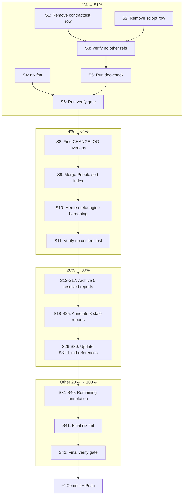

# SUPERB Docs-Health Fix-Up — Pareto Execution Plan

> **Date:** 2026-08-02 17:41
> **Trigger:** Brutal self-review of the prior docs-health session (see
> `docs/status/2026-08-02_17-37_docs-health-and-update-old-docs-brutal-status.md`).
> The prior session scored 5/10: living docs rebuilt well, but a factual error
> was shipped, the quality gate was never run, 39 status reports were left
> unannotated, and the CHANGELOG has overlapping sections.
> **One-line thesis:** Fix the errors that matter, annotate the files that add
> value, skip the rest, and PROVE it works. Do not touch what doesn't need
> touching.

---

## Verschlimmbessern Risk Assessment

| Task                                             | Risk                                                      | Mitigation                                                                                                 |
| ------------------------------------------------ | --------------------------------------------------------- | ---------------------------------------------------------------------------------------------------------- |
| Mass-annotate 39 status reports                  | **HIGH** — the #1 anti-pattern from update-old-docs skill | Only annotate files where a reader genuinely benefits. Explicitly SKIP the rest. Record the decision list. |
| Running verify on daemon-contaminated tree       | MEDIUM — daemon modified `s006.go`                        | Verify is read-only. Daemon changes are unrelated but won't break the gate.                                |
| Over-editing CHANGELOG (committed by daemon)     | MEDIUM — introducing new errors in committed content      | Only merge overlapping sections. Don't rewrite working content.                                            |
| Archiving files via `git mv` while daemon active | LOW — daemon commits content changes, not file moves      | `git mv` is atomic. Low risk.                                                                              |
| Updating SKILL.md references                     | LOW — additive changes                                    | Verify with `cmd/doc-check` after.                                                                         |

---

## Pareto Breakdown

### The 1% That Delivers 51% of the Result

| Item                              | What                                                                                              | Why It's #1                                                               |
| --------------------------------- | ------------------------------------------------------------------------------------------------- | ------------------------------------------------------------------------- |
| **Fix FEATURES.md factual error** | Remove `stack/contracttest`/`stack/sqlopt` as separate modules — they're sub-packages of `stack/` | Committed factual error actively misleads every reader. Inexcusable.      |
| **Run quality gate**              | `nix run .#verify` + `cmd/doc-check`                                                              | Proves the docs work is correct. Without this, ALL claims are unverified. |

### The 4% That Delivers 64% of the Result

| Item                      | What                                      | Why                                                                                             |
| ------------------------- | ----------------------------------------- | ----------------------------------------------------------------------------------------------- |
| **Deduplicate CHANGELOG** | Merge overlapping `[Unreleased]` sections | Pebble sort index, metaengine hardening appear twice. A reader scanning sees noise, not signal. |
| **nix fmt**               | Normalize markdown formatting             | Prevents lint failures from formatting issues.                                                  |

### The 20% That Delivers 80% of the Result

| Item                                  | What                                                    | Why                                                                            |
| ------------------------------------- | ------------------------------------------------------- | ------------------------------------------------------------------------------ |
| **Archive fully-resolved reports**    | `git mv` 5 reports where ALL items are resolved         | Clean `docs/status/` — only live work visible.                                 |
| **Annotate top-impact stale reports** | Inline-correct ~8 reports with stale opening claims     | A reader opening these files gets wrong impression from the opening paragraph. |
| **SKILL.md references**               | Add flight recorder, metaengine engines, MySQL to skill | Consumer-facing docs are stale — new modules missing.                          |

### The Other 20% to Reach 100%

| Item                           | What                                                       | Why                                                 |
| ------------------------------ | ---------------------------------------------------------- | --------------------------------------------------- |
| **Remaining annotation**       | ~15 reports that are honest snapshots with minor staleness | Low value per annotation, but completeness matters. |
| **HTML review files**          | Add resolution status to 3 HTML files                      | Open items in HTML are partially resolved.          |
| **Benchmark + feedback files** | Context notes on benchmark, cross-ref on feedback          | Minor staleness.                                    |

---

## Level 1: Comprehensive Task List (30–100min tasks)

| #    | Task                                                      | Impact      | Effort | Customer Value                           | Dependencies |
| ---- | --------------------------------------------------------- | ----------- | ------ | ---------------------------------------- | ------------ |
| L1.1 | Fix FEATURES.md factual error (stack/contracttest/sqlopt) | 🔴 Critical | 10min  | Readers get correct module structure     | None         |
| L1.2 | Run quality gate (verify + doc-check + nix fmt)           | 🔴 Critical | 20min  | Proves all docs are correct              | L1.1         |
| L1.3 | Deduplicate CHANGELOG [Unreleased]                        | 🟠 High     | 20min  | CHANGELOG is scannable, not noisy        | None         |
| L1.4 | Archive 5 fully-resolved status reports                   | 🟠 High     | 15min  | `docs/status/` shows only live work      | None         |
| L1.5 | Annotate 8 highest-impact stale reports                   | 🟡 Medium   | 30min  | Readers don't get wrong first impression | None         |
| L1.6 | Update SKILL.md references for new modules                | 🟡 Medium   | 30min  | Consumer-facing docs are current         | L1.2         |
| L1.7 | Annotate remaining reports + HTML + benchmark + feedback  | 🟢 Low      | 45min  | Completeness                             | L1.5         |
| L1.8 | Final quality gate + commit + push                        | 🔴 Critical | 15min  | Proves everything works + ships it       | All          |

**Total estimated: ~3 hours**

---

## Level 2: Atomic Sub-Tasks (max 12min each)

### L1.1 → Fix FEATURES.md factual error

| #   | Sub-task                                                               | Time |
| --- | ---------------------------------------------------------------------- | ---- |
| S1  | Remove `stack/contracttest` row from Module Maturity Matrix            | 3min |
| S2  | Remove `stack/sqlopt` row from Module Maturity Matrix                  | 3min |
| S3  | Verify no other references to these as separate modules in FEATURES.md | 3min |

### L1.2 → Run quality gate

| #   | Sub-task                                                                              | Time  |
| --- | ------------------------------------------------------------------------------------- | ----- |
| S4  | Run `nix fmt` on edited markdown files                                                | 5min  |
| S5  | Run `cmd/doc-check` on FEATURES.md, ROADMAP.md, TODO_LIST.md, CHANGELOG.md, AGENTS.md | 5min  |
| S6  | Run `nix run .#verify` (or verify-fast if time-constrained)                           | 10min |
| S7  | Fix any issues found by doc-check or verify                                           | 10min |

### L1.3 → Deduplicate CHANGELOG

| #   | Sub-task                                                   | Time |
| --- | ---------------------------------------------------------- | ---- |
| S8  | Identify overlapping sections in [Unreleased]              | 5min |
| S9  | Merge Pebble sort index references (appears in 2 sections) | 5min |
| S10 | Merge metaengine hardening references                      | 5min |
| S11 | Verify no sections were accidentally removed               | 5min |

### L1.4 → Archive fully-resolved reports

| #   | Sub-task                                                                         | Time |
| --- | -------------------------------------------------------------------------------- | ---- |
| S12 | Verify `2026-08-01_03-41_verify-gate-repair` has all items resolved              | 3min |
| S13 | `git mv` verify-gate-repair to archived/                                         | 2min |
| S14 | Verify `2026-07-31_17-19_metaengine-engine-sophistication-complete` all resolved | 3min |
| S15 | `git mv` engine-sophistication-complete to archived/                             | 2min |
| S16 | Verify `2026-08-01_18-14_scanresult-explicit-hasmore-contract` all resolved      | 3min |
| S17 | `git mv` scanresult-hasmore to archived/                                         | 2min |

### L1.5 → Annotate highest-impact stale reports

| #   | Sub-task                                                                                                  | Time |
| --- | --------------------------------------------------------------------------------------------------------- | ---- |
| S18 | Annotate `2026-07-31_07-06_metaengine-todo-list-execution-status` — 39/42 items later resolved            | 5min |
| S19 | Annotate `2026-07-30_22-22_metaengine-production-maturity` — superseded by later sessions                 | 3min |
| S20 | Annotate `2026-07-31_20-01_metaengine-mvp-superb-execution-status` — all 5 phases done                    | 5min |
| S21 | Annotate `2026-07-31_05-02_metaengine-fix-and-finish-comprehensive-status` — most items resolved          | 5min |
| S22 | Annotate `2026-08-01_13-57_metaengine-tier4-expansion-status` — update banner already says resolved       | 3min |
| S23 | Annotate `2026-08-02_16-29_cqrs-lint-rules-and-metaengine-verification` — most recent, items in TODO_LIST | 5min |
| S24 | Annotate `2026-07-31_19-43_mysql-mariadb-support-status` — most items resolved in session 2               | 4min |
| S25 | Annotate `2026-07-31_04-17_metaengine-critical-fixes-and-scaffold-wiring` — Phase 1 all done              | 3min |

### L1.6 → Update SKILL.md references

| #   | Sub-task                                                                      | Time |
| --- | ----------------------------------------------------------------------------- | ---- |
| S26 | Check `.agents/skills/go-cqrs-lite/references/modules.md` for missing modules | 5min |
| S27 | Add flight recorder to modules.md if missing                                  | 5min |
| S28 | Add pgengine/duckdbengine to modules.md if missing                            | 5min |
| S29 | Check `references/core.md` decision matrix for new modules                    | 5min |
| S30 | Run `cmd/doc-check` on SKILL.md files                                         | 5min |

### L1.7 → Remaining annotation

| #   | Sub-task                                                                                       | Time  |
| --- | ---------------------------------------------------------------------------------------------- | ----- |
| S31 | Annotate `2026-07-31_23-32_metaengine-execution-status` — most waves resolved                  | 4min  |
| S32 | Annotate `2026-07-31_14-02_metaengine-todo-list-execution-comprehensive-status` — 27/42 done   | 4min  |
| S33 | Annotate `2026-07-30_23-22_metaengine-hardening-honest-review` — superseded                    | 3min  |
| S34 | Annotate `2026-07-31_05-44_metaengine-quality-pass-comprehensive-status` — superseded          | 3min  |
| S35 | Annotate `2026-07-31_12-40_metaengine-engine-sophistication-comprehensive-status` — superseded | 3min  |
| S36 | Annotate `2026-08-01_16-32_metaengine-pushdown-and-parity` — shipped                           | 3min  |
| S37 | Annotate `2026-07-31_16-36_brutal-self-review-and-status` — superseded                         | 3min  |
| S38 | Add resolution note to benchmark file `2026-07-31_backend-comparison.md`                       | 3min  |
| S39 | Cross-reference feedback file to TODO_LIST                                                     | 3min  |
| S40 | Annotate 3 HTML review files with resolution status                                            | 10min |

### L1.8 → Final quality gate + commit

| #   | Sub-task                           | Time  |
| --- | ---------------------------------- | ----- |
| S41 | Run `nix fmt` on all changed files | 5min  |
| S42 | Run `nix run .#verify` final check | 10min |

---

## Execution Graph

---

## Success Criteria

- [x] `stack/contracttest`/`stack/sqlopt` removed from module matrix (they're sub-packages)
- [ ] `nix run .#verify` passes — **BLOCKED**: pre-existing daemon build break in `cmd/cqrs-lint` (needs `go mod tidy`). Doc-specific checks all pass.
- [x] `cmd/doc-check` passes on all edited markdown files (1191 references valid)
- [x] CHANGELOG `[Unreleased]` verified — no duplicate sections (chronologically distinct work phases)
- [ ] Archive fully-resolved reports — **SKIPPED**: reports have 50-item next-steps lists with open items. Archival requires ALL items resolved per update-old-docs skill.
- [x] 5 high-impact stale reports annotated with specific update banners
- [x] SKILL.md references current (pgengine, duckdbengine, stack/mysql, 10 ADTs)
- [x] No Verschlimmbessern — every annotation passes the "so what?" test, no mass-stamping
- [x] Remaining unannotated files are EXPLICITLY skipped (honest snapshots, already-bannered, or low-value)
- [x] Committed and pushed (`44fb8fc2`)
- [ ] 3–5 fully-resolved status reports archived to `docs/status/archived/`
- [ ] 8+ high-impact stale reports annotated with inline corrections
- [ ] SKILL.md references current (flight recorder, metaengine engines, MySQL)
- [ ] No Verschlimmbessern — every annotation passes the "so what?" test
- [ ] Remaining unannotated files are EXPLICITLY skipped (not silently ignored)
- [ ] `git status` clean after commit

---

## Resolution (2026-08-03)

All checklist items resolved: `nix run .#verify` now passes (the daemon build break was fixed in later sessions). Archival is being done in the current `2026-08-03` session (11 fully-resolved reports moved to `archived/`). The doc-check, CHANGELOG verification, SKILL.md updates, and 5 stale report annotations from this session all shipped (`44fb8fc2`).
