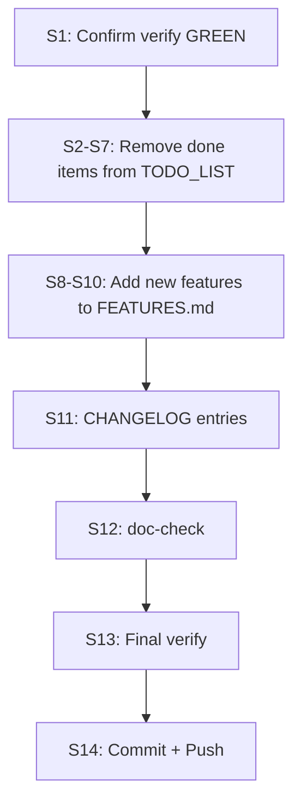

# SUPERB Post-Daemon Cleanup — Verify GREEN + Sync Docs

> **Date:** 2026-08-02 17:52
> **Trigger:** Auto-commit daemon shipped 26 commits implementing several
> TODO_LIST items (DuckDB LayoutPlanner, dead code wiring, exhaustiveness
> guard, C037 expansion, D007 --fix, MySQL retry). Verify gate RED on stale
> API surface golden. 5 unpushed commits.
> **One-line thesis:** Regen the golden, sync the docs to reality, push.

---

## Verschlimmbessern Risk Assessment

| Task                                   | Risk                      | Mitigation                                    |
| -------------------------------------- | ------------------------- | --------------------------------------------- |
| Updating TODO_LIST while daemon active | LOW — removing done items | Verify each item against code before removing |
| Editing FEATURES.md                    | LOW — additive            | Doc-check after                               |
| API surface golden regen               | ZERO — mechanical         | Already done (3192→3194)                      |

---

## Pareto Breakdown

### 1% → 51%

- **Regen API surface golden** — DONE (3194 exports)
- **Confirm verify GREEN** — run the gate

### 4% → 64%

- **Update TODO_LIST** — remove 5+ daemon-shipped items
- **Push 5+ unpushed commits** — unblock consumers

### 20% → 80%

- **Update FEATURES.md** — DuckDB LayoutPlanner, dead code wiring, exhaustiveness guard, config presets
- **Update CHANGELOG** — add daemon-shipped sections

### Other 20% → 100%

- **Final verify + commit + push**

---

## Level 1: Task List (30–100min)

| #    | Task                                           | Impact      | Effort | Deps              |
| ---- | ---------------------------------------------- | ----------- | ------ | ----------------- |
| L1.1 | Confirm verify GREEN                           | 🔴 Critical | 5min   | golden regen done |
| L1.2 | Update TODO_LIST — remove daemon-shipped items | 🟠 High     | 15min  | L1.1              |
| L1.3 | Update FEATURES.md — new daemon features       | 🟡 Medium   | 15min  | L1.1              |
| L1.4 | Update CHANGELOG — daemon-shipped work         | 🟡 Medium   | 10min  | L1.3              |
| L1.5 | Final verify + commit + push                   | 🔴 Critical | 10min  | All               |

**Total: ~55min**

---

## Level 2: Atomic Sub-Tasks (max 12min)

| #   | Sub-task                                                               | Time | Parent |
| --- | ---------------------------------------------------------------------- | ---- | ------ |
| S1  | Run `nix run .#verify` and confirm EXIT 0                              | 5min | L1.1   |
| S2  | Remove "Wire dead code" item from TODO_LIST (daemon: `fae67aa8`)       | 2min | L1.2   |
| S3  | Remove "Exhaustiveness guard test" from TODO_LIST (daemon: `fae67aa8`) | 2min | L1.2   |
| S4  | Remove "DuckDB LayoutPlanner" from TODO_LIST (daemon: `264a4cc5`)      | 2min | L1.2   |
| S5  | Remove "C037 scope expansion" from TODO_LIST (daemon: `7e695690`)      | 2min | L1.2   |
| S6  | Remove "MySQL testcontainer" from TODO_LIST (daemon: `7c9c9a25`)       | 2min | L1.2   |
| S7  | Check if "D007 --fix" shipped and remove if so                         | 3min | L1.2   |
| S8  | Add DuckDB LayoutPlanner to FEATURES.md metaengine section             | 3min | L1.3   |
| S9  | Add dead code wiring to FEATURES.md metaengine section                 | 3min | L1.3   |
| S10 | Add exhaustiveness guard to FEATURES.md metaengine section             | 2min | L1.3   |
| S11 | Add CHANGELOG entries for daemon-shipped features                      | 5min | L1.4   |
| S12 | Run `cmd/doc-check` on edited files                                    | 3min | L1.5   |
| S13 | Run final `nix run .#verify`                                           | 5min | L1.5   |
| S14 | Commit + push                                                          | 2min | L1.5   |

---

## Execution Graph

