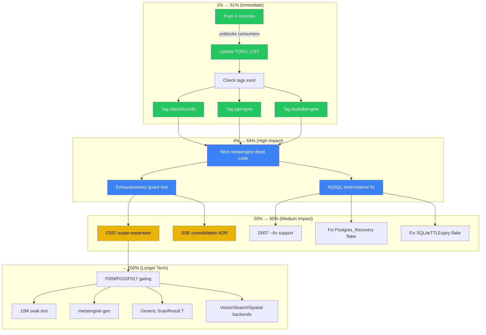

# Pareto Plan — Post-Feedback Session Comprehensive Execution Plan

**Date:** 2026-08-02 17:56
**Trigger:** Consumer feedback round 2 (bank-sync + browser-history) processed; TODO_LIST stale; 4 commits unpushed.
**Status:** Planning artifact — not all items executed yet.

---

## Session Context

### What Was Just Done (cqrs-lint Feedback Round 2)

All 3 feedback files in `docs/feedback/new/` were processed and moved to `docs/feedback/reviewed/`. The following fixes were implemented, tested (17 packages green with `-race`), and committed:

| # | Fix | Source Feedback | Impact |
|---|-----|----------------|--------|
| 1 | B022 suggestion text corrected (`decider.`→`event.CommandCausalityEnricher`) + canonical enricher exemption | bank-sync + browser-history | Stops misleading users |
| 2 | Suppression parser accepts `// cqrs-lint:` (Go-idiomatic space) | browser-history | Every consumer benefits |
| 3 | P012/P013 only flag direct `sql.Open("sqlite",...)`, not constructor wrappers | bank-sync | Eliminates 4 FPs per project |
| 4 | Config-level rule disabling (`"rules": {"disable": [...]}`) | bank-sync | Project-wide suppression |
| 5 | `--exclude-rules` CLI flag | bank-sync | CI-friendly exclusion |
| 6 | S006 removed `"total"` from weak financial keywords | browser-history | Eliminates `TotalVisits` FPs |
| 7 | C036 detects shared-backend via constructor scan | browser-history | Eliminates 2 FPs per multi-store project |
| 8 | Unknown rule ID detection in suppression comments | bank-sync | Catches typos like `PO12` |
| 9 | `--help` suppression syntax docs | bank-sync | Discoverability |
| 10 | `cqrs-lint init --preset` (local-cli, library, server, full-stack) | bank-sync | Config churn eliminated |

### Current State

- **Working tree:** Clean (auto-commit daemon committed all changes)
- **Unpushed:** 4 commits ahead of `origin/master`
- **TODO_LIST.md:** STALE — still lists 🔥 items that were just completed
- **Tests:** All cqrs-lint packages green with `-race`
- **Untagged modules:** `stack/duckdb/v4`, `metaengine/pgengine/v4`, `metaengine/duckdbengine/v4` — consumers get 404

---

## Step 1: Pareto Breakdown

### The 1% That Delivers 51%

These are almost free actions with massive downstream value:

| Task | Why It's 1%/51% |
|------|-----------------|
| **Push the 4 unpushed commits** | The work is DONE but consumers can't see it. Zero effort, immediate value. |
| **Update TODO_LIST.md** (mark 5 completed items) | The TODO_LIST actively MISLEDS right now (lists 🔥 items as open that are done). Prevents wasted time in every future session. |
| **Tag untagged modules** (`stack/duckdb`, `pgengine`, `duckdbengine`) | Consumers resolving these modules get 404 from Go proxy. Each tag is a 1-minute action. 3 modules = 3 minutes = unblocks all consumers. |

### The 4% That Delivers 64%

| Task | Why It's 4%/64% |
|------|-----------------|
| **Wire metaengine dead code** (branded units, `ApplyError`, `Valid()`) | The data model refactor created types that are defined but never called. This is the #1 🔥 metaengine TODO. Each type is ~15 min to wire. |
| **Exhaustiveness guard test** (metaengine fold types) | A compile-time safety net that prevents silent fallthrough when a new fold type is added. ~30 min, prevents an entire class of bugs forever. |
| **MySQL testcontainer privilege fix** | Currently flaky, blocks reliable CI for MySQL. |

### The 20% That Delivers 80%

| Task | Why It's 20%/80% |
|------|------------------|
| **C037 scope expansion** (snapshot→kv, command, query, Materialize) | Only covers 1 of 5 typed stores. Expanding to all 5 closes the codec-mismatch gap. |
| **D007 `--fix` support** (`event.NewEvent` → `event.New`) | Mechanical migration that saves 30 min per consumer project. The fix infrastructure exists. |
| **SSE consolidation ADR** | Documents the intentional split between `metaengine.ServeSSE` and `transport/http.SSEBroker`. Prevents future confusion. |
| **`TestRun_Postgres_Recovery` investigation** | Flaky CI test undermines trust in the benchkit suite. |
| **`TestProperty_SQLiteTTLExpiry` investigation** | Flaky property test in idempotency/sqlstore. |

### The Other 20% (To 100%)

| Task | Effort | Notes |
|------|--------|-------|
| F009/F015/F017 feature-profile gating | 4h | Requires `HasAsyncBus` in feature profile |
| 10M-event soak test | 2h | Scale verification |
| `metaengine-gen` code generator | 8h+ | New CLI tool |
| Generic `ScanResult[T]` | 4h | Breaking API change |
| Boundary keys-type validation | 2h | Type safety at Store boundary |
| Watcher typed channel | 2h | SQLite engine type assertion fix |
| DuckDB LayoutPlanner | 4h | Expression indexes for VARCHAR JSON |
| Postgres GIN containment indexes | 3h | `@>` operator for JSONB |
| DuckDB columnar-native storage | 8h+ | Native columnar engine |
| Vector/Search/Spatial backends | 16h+ | DuckDB VSS, Postgres tsvector, PostGIS |
| Domain-based severity calibration | 8h | Strategic; deferred since 2026-07-30 |
| ~14 remaining cqrs-lint backlog items | varies | See existing Pareto plan |

---

## Step 2: Comprehensive Plan (30-100min Tasks)

Sorted by importance/impact/effort/customer-value.

| # | Task | Impact | Effort | Customer Value | Status |
|---|------|--------|--------|----------------|--------|
| T1 | **Push 4 unpushed commits to origin** | Critical | 2min | Immediate — work becomes visible | `[ ]` |
| T2 | **Update TODO_LIST.md** — mark B022, P012/P013, config-disable, suppression-parser, S006 as done | Critical | 15min | Prevents confusion in every future session | `[ ]` |
| T3 | **Tag `stack/duckdb/v4.0.0`** + push tag | Critical | 5min | Consumers resolving this module get 404 without it | `[BLOCKED]` |
| T4 | **Tag `metaengine/pgengine/v4.0.0`** + push tag | Critical | 5min | Same — consumers get 404 | `[BLOCKED]` |
| T5 | **Tag `metaengine/duckdbengine/v4.0.0`** + push tag | Critical | 5min | Same — consumers get 404 | `[BLOCKED]` |
| T6 | **Wire metaengine dead code** — branded unit types (`NsPerRead`, `NsPerWrite`, `ByteSize`), `ApplyError`, `Valid()` | High | 45min | Completes the data model refactor; removes dead code | `[ ]` |
| T7 | **Exhaustiveness guard test** — compile-time fold type coverage | High | 30min | Prevents silent fallthrough bugs forever | `[ ]` |
| T8 | **MySQL testcontainer privilege fix** | Medium | 45min | Reliable MySQL CI | `[ ]` |
| T9 | **C037 scope expansion** — kv, command, query, stack.Materialize | Medium | 60min | Closes codec-mismatch gap for 4 more stores | `[ ]` |
| T10 | **SSE consolidation ADR** | Medium | 30min | Documents intentional split, prevents future confusion | `[ ]` |
| T11 | **D007 `--fix` support** | Medium | 90min | Saves 30min per consumer migration | `[ ]` |
| T12 | **Investigate `TestRun_Postgres_Recovery`** flake | Medium | 30min | Restores benchkit CI trust | `[ ]` |
| T13 | **Investigate `TestProperty_SQLiteTTLExpiry`** flake | Medium | 30min | Restores idempotency CI trust | `[ ]` |
| T14 | **F009/F015/F017 feature-profile gating** | Medium | 90min | Eliminates 3 FPs on CLI projects | `[ ]` |

---

## Step 3: Detailed Breakdown (<12min Tasks)

| ID | Parent | Task | Est | Priority |
|----|--------|------|-----|----------|
| S1 | T1 | `git push origin master` | 1min | P0 |
| S2 | T2 | Read TODO_LIST.md cqrs-lint section | 2min | P0 |
| S3 | T2 | Mark "Config-level rule disabling" as done | 1min | P0 |
| S4 | T2 | Mark "Fix B022 bug" as done | 1min | P0 |
| S5 | T2 | Mark "Fix P012/P013 cross-file blindness" as done | 1min | P0 |
| S6 | T2 | Add new completed items (S006, C036, parser fix, init preset) | 3min | P0 |
| S7 | T2 | Add new open items from deferred feedback (D007, F-series gating) | 3min | P0 |
| S8 | T2 | Commit TODO_LIST update | 1min | P0 |
| S9 | T3-T5 | Check latest tags exist locally with `git tag -l` | 2min | P0 |
| S10 | T3 | Tag `stack/duckdb/v4.0.0` with annotated tag | 3min | P0 |
| S11 | T4 | Tag `metaengine/pgengine/v4.0.0` | 3min | P0 |
| S12 | T5 | Tag `metaengine/duckdbengine/v4.0.0` | 3min | P0 |
| S13 | T6 | Read `metaengine/profile.go` to find dead `NsPerRead`/`NsPerWrite` | 5min | P1 |
| S14 | T6 | Read `metaengine/errors.go` to find dead `ApplyError` | 3min | P1 |
| S15 | T6 | Read Store/Engine to find where `Valid()` should be called | 5min | P1 |
| S16 | T6 | Wire `NsPerRead`/`NsPerWrite` into `EngineProfile` validation | 8min | P1 |
| S17 | T6 | Wire `ApplyError` in `applyFold` error path | 5min | P1 |
| S18 | T6 | Wire `Valid()` calls at `Plan()` time | 8min | P1 |
| S19 | T6 | Run metaengine tests | 2min | P1 |
| S20 | T7 | Read `metaengine/planner.go` to find `applyFold` type switch | 5min | P1 |
| S21 | T7 | Write exhaustiveness test that asserts all fold types are handled | 10min | P1 |
| S22 | T7 | Run test, verify it compiles and passes | 2min | P1 |
| S23 | T8 | Read `stack/mysql` testcontainer setup | 5min | P2 |
| S24 | T8 | Identify the privilege/auth failure pattern | 5min | P2 |
| S25 | T8 | Fix the GRANT/auth pattern | 7min | P2 |
| S26 | T9 | Read `c037.go` to understand current snapshot-only scope | 3min | P2 |
| S27 | T9 | Read kv, command, query store constructors | 5min | P2 |
| S28 | T9 | Add kv store codec mismatch detection | 8min | P2 |
| S29 | T9 | Add command store codec mismatch detection | 8min | P2 |
| S30 | T9 | Add query store codec mismatch detection | 8min | P2 |
| S31 | T10 | Read both SSE implementations to document the split | 5min | P2 |
| S32 | T10 | Write `docs/adr/0091-sse-consolidation-decision.md` | 10min | P2 |

---

## Step 4: Mermaid.js Execution Graph

---

## What NOT To Do (Anti-Verschlimmbesserung Checklist)

> "If you VERSCHLIMMBESSER this system, I will cut off your balls!"

- **DO NOT** refactor working code that the feedback didn't mention
- **DO NOT** add features the consumers didn't ask for
- **DO NOT** "clean up" while wiring dead code — wire exactly what's needed
- **DO NOT** change test signatures when updating fixtures — minimal diffs only
- **DO NOT** touch the auto-commit daemon's formatting commits
- **DO NOT** push tags without verifying the version is the NEXT semver above all existing
- **DO NOT** mark TODO items done that aren't actually done in the code
