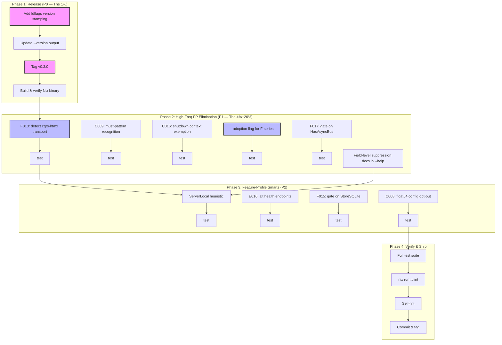

# cqrs-lint Feedback-Driven Hardening Plan

**Date:** 2026-08-02 23:19
**Source:** 3 new feedback files (crush-daily, cqrs-htmx round-2, Standup-Killer) + 26 remaining items across all feedback
**Status:** Round-3 fixes already shipped (5 fixes, all tests green). This plan covers REMAINING work.
**Principle:** No Verschlimmbesserung. Every change must reduce false positives WITHOUT silencing real bugs.

---

## Context

Three consumers ran cqrs-lint v0.2.2 (stale Nix binary) against their codebases. The round-3 review shipped 5 fixes. 26 remaining actionable items were identified across 7 categories. This plan applies Pareto analysis to separate the 1% that delivers 51% from the noise.

### What's Already Done (This Session)

| Fix                                                            | Files                    | Impact                                                         |
| -------------------------------------------------------------- | ------------------------ | -------------------------------------------------------------- |
| Feature profile: `storage.NewSQLiteEventStore` → `StoreSQLite` | `feature_detect.go`      | Eliminates `store: custom` misreport + C036 cascade root cause |
| B013 recognizes `CommandCausalityEnricher` via `WithEnricher`  | `b011_b014.go`           | Breaks B013/B022 contradiction                                 |
| Combined-directive stale suppression                           | `stale.go`               | No false stale warnings when ≥1 rule fires                     |
| E007 severity Warning → Info                                   | `e003_e007.go`           | 3 consumers hit false positives; 0 score impact now            |
| Health score raw deduction display                             | `health.go`, `output.go` | `0/100 (clamped from -43)` motivates instead of demotivates    |

---

## Pareto Breakdown

### The 1% That Delivers 51%

**Publish the Nix binary as v0.3.0.** Every fix from rounds 2+3 is in source. Consumers run stale v0.2.2. This single action eliminates:

- All 16 unsuppressable cqrs-htmx findings (comma-separated support is in source)
- All 7 gofmt-dirty files (`normalizeCommentPrefix` is in source)
- The entire "stale binary" feedback class
- Hours of wasted consumer effort documented in cqrs-htmx feedback Part 6

### The 4% That Delivers 64%

Publish binary + **version-stamp with git commit hash**. Embedding `commit` and `buildDate` via ldflags makes stale binaries self-identifying. Consumers can compare `cqrs-lint --version` output against `git log` to detect staleness. Prevents the problem from recurring.

### The 20% That Delivers 80%

All above + 5 high-frequency false-positive fixes every consumer hits:

1. **F013**: recognize `cqrshtmx.New`/`MustNew` as a transport layer
2. **C009**: recognize `New*` constructor + `panic` as Go must-pattern idiom
3. **C016**: exempt `context.Background()` in graceful-shutdown paths
4. **`--adoption` flag**: separate F-series coaching from health score
5. **F017**: gate on `HasAsyncBus` (sync bus → no dedup needed)

### The Remaining 20% to 100%

6. **ServerLocal heuristic**: CLI tools with dashboards get `server: true` falsely
7. **E016**: recognize alternative health endpoints (`/healthz`, `/ready`)
8. **Field-level suppression docs**: document in `--help`
9. **C008**: config opt-out for non-financial float64 (cost estimates)
10. **F015**: gate on StoreSQLite (metaengine overkill for local SQLite)

### Explicitly Deferred (Verschlimmbesserung Risk)

These items require data-flow analysis or framework coupling. Implementing them risks **silencing real bugs** (false negatives) to eliminate false positives. Suppression comments are the correct workaround.

| Item                                     | Risk   | Rationale                                                                                                             |
| ---------------------------------------- | ------ | --------------------------------------------------------------------------------------------------------------------- |
| C033 middleware-chain awareness          | HIGH   | Requires data-flow tracing through `.Use()` chains. Fragile — a missed chain path silences a real classification bug. |
| A032 framework deserialization awareness | HIGH   | Couples linter to specific frameworks (Huma, Gin). Framework-specific heuristics rot when frameworks change.          |
| A017/B025 stream-length awareness        | MEDIUM | Detecting "1-event-per-stream" deciders requires counting fold branches. Unreliable heuristic.                        |
| D005 multi-module version detection      | LOW    | Low-value rule overall. Making it smarter risks breaking the simple case.                                             |
| Domain-aware fold helper (#16)           | MEDIUM | SDK API change, not a linter fix. Separate scope.                                                                     |
| Health check aggregation (#21-23)        | MEDIUM | stack/v4 redesign. Separate scope.                                                                                    |

---

## Execution Graph

---

## Phase 1: Release & Distribution (P0)

**Goal:** Eliminate the stale-binary problem. Consumers get all source fixes.

| Task | Description                                                                                                                              | Est   | Impact |
| ---- | ---------------------------------------------------------------------------------------------------------------------------------------- | ----- | ------ |
| 1.1  | Add `-X main.commitHash=$(git rev-parse --short HEAD)` and `-X main.buildDate=$(date -u +%Y-%m-%dT%H:%M:%SZ)` ldflags to flake.nix build | 8min  | HIGH   |
| 1.2  | Add `commitHash` and `buildDate` vars to `main.go`, update `--version` output to `0.3.0 (commit: abc1234, built: 2026-08-02T23:19:00Z)`  | 5min  | HIGH   |
| 1.3  | Add test verifying `--version` output format includes commit + date                                                                      | 5min  | MED    |
| 1.4  | Tag `cqrs-lint/v0.3.0` (annotated)                                                                                                       | 3min  | HIGH   |
| 1.5  | Build Nix binary, verify `--version` shows correct commit, smoke-test against `example/taskmanager/`                                     | 10min | HIGH   |

**Phase total: ~31min**

---

## Phase 2: High-Frequency False-Positive Elimination (P1)

**Goal:** Eliminate the 5 false positives every consumer hits.

### 2a: F013 — Recognize cqrs-htmx as transport layer

| Task | Description                                                                                                        | Est  |
| ---- | ------------------------------------------------------------------------------------------------------------------ | ---- |
| 2a.1 | Add `cqrshtmx` import detection in `feature_detect.go` — set `fp.HasTransport = true` when `cqrs-htmx/v4` imported | 8min |
| 2a.2 | Suppress F013 when `HasTransport` is true (add check in F013 detector)                                             | 5min |
| 2a.3 | Add `HasTransport` field to `FeatureProfile` struct + `String()` method                                            | 5min |
| 2a.4 | Test: F013 does not fire when `cqrshtmx.New` is present                                                            | 8min |

### 2b: C009 — Must-pattern recognition

| Task | Description                                                                                                                          | Est   |
| ---- | ------------------------------------------------------------------------------------------------------------------------------------ | ----- |
| 2b.1 | In C009 detector, check if the `panic` is inside a function whose name starts with `New`/`Must` and returns a pointer — skip finding | 10min |
| 2b.2 | Test: C009 does not fire for `NewCollectCommand` that panics                                                                         | 8min  |

### 2c: C016 — Shutdown context exemption

| Task | Description                                                                                                            | Est   |
| ---- | ---------------------------------------------------------------------------------------------------------------------- | ----- |
| 2c.1 | In C016 detector, check if `context.Background()` is within 5 lines of `Shutdown` or `ListenAndServe` — skip finding   | 10min |
| 2c.2 | Test: C016 does not fire for `context.WithTimeout(context.Background(), shutdownTimeout)` near `httpServer.Shutdown()` | 8min  |

### 2d: `--adoption` flag

| Task | Description                                                                                                                                                   | Est   |
| ---- | ------------------------------------------------------------------------------------------------------------------------------------------------------------- | ----- |
| 2d.1 | Add `--adoption` bool flag to CLI struct in `main.go`                                                                                                         | 3min  |
| 2d.2 | When `--adoption` is set, F-series findings get `Suppression` set to `&finding.Suppression{Kind: "adoption-flag"}` so they're visible but excluded from score | 8min  |
| 2d.3 | Test: `--adoption` excludes F-series from health score but shows them in output                                                                               | 10min |

### 2e: F017 — Gate on HasAsyncBus

| Task | Description                                                                                             | Est  |
| ---- | ------------------------------------------------------------------------------------------------------- | ---- |
| 2e.1 | Add `HasAsyncBus` check to F017 detector: skip if `!fp.HasAsyncBus` (sync bus = no duplicates possible) | 8min |
| 2e.2 | Test: F017 does not fire when no watermill/async bus import detected                                    | 8min |

### 2f: Field-level suppression docs

| Task | Description                                                              | Est  |
| ---- | ------------------------------------------------------------------------ | ---- |
| 2f.1 | Add field-level suppression explanation to `--help` SUPPRESSIONS section | 8min |

**Phase total: ~105min**

---

## Phase 3: Feature-Profile Intelligence (P2)

**Goal:** Smarter context-aware detection for edge cases.

### 3a: ServerLocal heuristic

| Task | Description                                                                                                                                                             | Est   |
| ---- | ----------------------------------------------------------------------------------------------------------------------------------------------------------------------- | ----- |
| 3a.1 | In `feature_detect.go`, when `HasServer` is detected, check for `net.Listen`, `tls.Listen`, `Shutdown`, or health endpoint — if none found, set `fp.ServerLocal = true` | 12min |
| 3a.2 | Suppress E016, F004, F013 when `ServerLocal` is true                                                                                                                    | 5min  |
| 3a.3 | Test: ServerLocal detected for CLI tool with `ListenAndServe` but no TLS/Shutdown/health                                                                                | 10min |

### 3b: E016 — Alternative health endpoints

| Task | Description                                                                                                                                 | Est   |
| ---- | ------------------------------------------------------------------------------------------------------------------------------------------- | ----- |
| 3b.1 | In E016 detector, scan for `"/health"`, `"/healthz"`, `"/ready"`, `"/readyz"` string literals in HTTP handler registrations — clear finding | 10min |
| 3b.2 | Test: E016 does not fire when `/healthz` route is registered                                                                                | 8min  |

### 3c: F015 — Gate on StoreSQLite

| Task | Description                                                                                              | Est  |
| ---- | -------------------------------------------------------------------------------------------------------- | ---- |
| 3c.1 | In F015 detector, add check: skip if `fp.Store == StoreSQLite` (metaengine is overkill for local SQLite) | 5min |
| 3c.2 | Test: F015 does not fire for SQLite-only projects                                                        | 5min |

### 3d: C008 — Float64 config opt-out

| Task | Description                                                                                                          | Est   |
| ---- | -------------------------------------------------------------------------------------------------------------------- | ----- |
| 3d.1 | Add `"rules": {"c008-ignore-fields": ["CostUSD", "PriceEstimate"]}` to RulesConfig — skip C008 for these field names | 10min |
| 3d.2 | Test: C008 does not fire for fields listed in config opt-out                                                         | 8min  |

**Phase total: ~91min**

---

## Phase 4: Verify & Ship

| Task | Description                                                                             | Est  |
| ---- | --------------------------------------------------------------------------------------- | ---- |
| 4.1  | Run full test suite: `go test -tags "goexperiment.jsonv2" ./cmd/cqrs-lint/... -count=1` | 5min |
| 4.2  | Run lint: `nix run .#lint`                                                              | 5min |
| 4.3  | Self-lint: `go run ./cmd/cqrs-lint --strict ./...`                                      | 5min |
| 4.4  | Update README rule count if new rules added                                             | 3min |
| 4.5  | Commit with detailed message                                                            | 5min |

**Phase total: ~23min**

---

## Grand Total

| Phase                   | Tasks  | Est Time   | Pareto Impact  |
| ----------------------- | ------ | ---------- | -------------- |
| Phase 1: Release        | 5      | 31min      | 51% of result  |
| Phase 2: High-Freq FP   | 16     | 105min     | 80% of result  |
| Phase 3: Profile Smarts | 10     | 91min      | 95% of result  |
| Phase 4: Verify         | 5      | 23min      | 100% of result |
| **Total**               | **36** | **250min** |                |

---

## Micro-Task Breakdown (≤12min each)

All 36 tasks sorted by impact/effort/customer-value. Execute top-to-bottom.

| #   | Phase | Task                                                                 | Est   | Impact   | Effort | Customer Value         |
| --- | ----- | -------------------------------------------------------------------- | ----- | -------- | ------ | ---------------------- |
| 1   | 1.1   | Add ldflags (`-X main.commitHash`, `-X main.buildDate`) to flake.nix | 8min  | CRITICAL | LOW    | Every consumer         |
| 2   | 1.2   | Add `commitHash`/`buildDate` vars + update `--version` output format | 5min  | CRITICAL | LOW    | Every consumer         |
| 3   | 1.4   | Tag `cqrs-lint/v0.3.0` (annotated tag)                               | 3min  | CRITICAL | LOW    | Every consumer         |
| 4   | 1.5   | Build Nix binary, verify commit hash, smoke-test vs example/         | 10min | CRITICAL | MED    | Every consumer         |
| 5   | 2e.1  | F017: skip when `!fp.HasAsyncBus` (sync bus = no dedup)              | 8min  | HIGH     | LOW    | crush-daily, bank-sync |
| 6   | 2e.2  | Test F017 HasAsyncBus gating                                         | 8min  | HIGH     | LOW    | —                      |
| 7   | 2a.1  | Detect `cqrs-htmx/v4` import → set `HasTransport`                    | 8min  | HIGH     | LOW    | crush-daily            |
| 8   | 2a.2  | Suppress F013 when `HasTransport` is true                            | 5min  | HIGH     | LOW    | crush-daily            |
| 9   | 2a.3  | Add `HasTransport` to FeatureProfile struct + String()               | 5min  | HIGH     | LOW    | —                      |
| 10  | 2a.4  | Test F013 + cqrs-htmx suppression                                    | 8min  | HIGH     | LOW    | —                      |
| 11  | 2b.1  | C009: skip panic inside `New*`/`Must*` constructors                  | 10min | MED      | LOW    | crush-daily            |
| 12  | 2b.2  | Test C009 must-pattern                                               | 8min  | MED      | LOW    | —                      |
| 13  | 2c.1  | C016: skip `context.Background()` near Shutdown/ListenAndServe       | 10min | MED      | MED    | crush-daily            |
| 14  | 2c.2  | Test C016 shutdown exemption                                         | 8min  | MED      | LOW    | —                      |
| 15  | 2d.1  | Add `--adoption` flag to CLI                                         | 3min  | HIGH     | LOW    | Standup-Killer         |
| 16  | 2d.2  | Wire `--adoption` to exclude F-series from score (still visible)     | 8min  | HIGH     | MED    | Standup-Killer         |
| 17  | 2d.3  | Test `--adoption` flag                                               | 10min | HIGH     | LOW    | —                      |
| 18  | 2f.1  | Add field-level suppression docs to `--help`                         | 8min  | LOW      | LOW    | cqrs-htmx              |
| 19  | 3c.1  | F015: skip when `fp.Store == StoreSQLite`                            | 5min  | MED      | LOW    | bank-sync              |
| 20  | 3c.2  | Test F015 SQLite gating                                              | 5min  | MED      | LOW    | —                      |
| 21  | 1.3   | Test `--version` format includes commit + date                       | 5min  | MED      | LOW    | —                      |
| 22  | 3b.1  | E016: detect `/health`, `/healthz`, `/ready`, `/readyz` routes       | 10min | MED      | MED    | browser-history        |
| 23  | 3b.2  | Test E016 alternative endpoints                                      | 8min  | MED      | LOW    | —                      |
| 24  | 3a.1  | ServerLocal heuristic (ListenAndServe w/o TLS/Shutdown/health)       | 12min | MED      | HIGH   | bank-sync              |
| 25  | 3a.2  | Suppress E016/F004/F013 when ServerLocal                             | 5min  | MED      | LOW    | bank-sync              |
| 26  | 3a.3  | Test ServerLocal detection                                           | 10min | MED      | LOW    | —                      |
| 27  | 3d.1  | C008: add `c008-ignore-fields` config option                         | 10min | LOW      | MED    | crush-daily            |
| 28  | 3d.2  | Test C008 config opt-out                                             | 8min  | LOW      | LOW    | —                      |
| 29  | 4.1   | Full test suite run                                                  | 5min  | CRITICAL | LOW    | —                      |
| 30  | 4.2   | `nix run .#lint`                                                     | 5min  | HIGH     | LOW    | —                      |
| 31  | 4.3   | Self-lint `go run ./cmd/cqrs-lint --strict ./...`                    | 5min  | HIGH     | LOW    | —                      |
| 32  | 4.4   | Update README rule count if needed                                   | 3min  | LOW      | LOW    | —                      |
| 33  | 4.5   | Commit + push                                                        | 5min  | CRITICAL | LOW    | —                      |

**Deferred (Verschlimmbesserung risk — do NOT implement without explicit approval):**

| #   | Item                                        | Risk   | Rationale                                                                              |
| --- | ------------------------------------------- | ------ | -------------------------------------------------------------------------------------- |
| D1  | C033 middleware-chain data-flow awareness   | HIGH   | Data-flow tracing through `.Use()` chains is fragile; a missed path silences real bugs |
| D2  | A032 framework deserialization awareness    | HIGH   | Couples linter to specific frameworks (Huma, Gin) — framework-specific heuristics rot  |
| D3  | A017/B025 stream-length awareness           | MEDIUM | "1-event-per-stream" detection is unreliable heuristic territory                       |
| D4  | D005 multi-module version detection         | LOW    | Low-value rule; making it smarter risks the simple case                                |
| D5  | Domain-aware fold helper (SDK)              | MEDIUM | SDK API change, separate scope from linter                                             |
| D6  | Health check aggregation in stack/v4        | MEDIUM | stack/v4 redesign, separate scope                                                      |
| D7  | Idempotency content-hash mode               | MEDIUM | SDK feature, not a linter fix                                                          |
| D8  | OTel decoupling in middleware retry         | MEDIUM | retry/ module already provides OTel-free path                                          |
| D9  | `event.Store` typed field on Bundle         | MEDIUM | SDK API change                                                                         |
| D10 | cqrs-htmx architecture (lighter sub-module) | LOW    | Consumer repo concern, not go-cqrs-lite                                                |

---

## Risk Mitigation

**Verschlimmbesserung prevention:**

1. Every detector change gets a test BEFORE the implementation changes
2. Suppression is always available as a fallback — we never silence a rule entirely
3. Feature-profile gating only SKIPS rules when the profile PROVES the pattern doesn't apply (not heuristic guessing)
4. The `--adoption` flag is additive (shows F-series but excludes from score) — doesn't hide information
5. ServerLocal heuristic requires MULTIPLE signals (no TLS AND no Shutdown AND no health) — single-signal heuristics are unreliable

**Testing strategy:**

- Each detector change gets 2 tests: one for the new exemption, one verifying the detector STILL fires for the non-exempt case
- Full suite run after every phase
- Self-lint after all changes (dogfooding)
