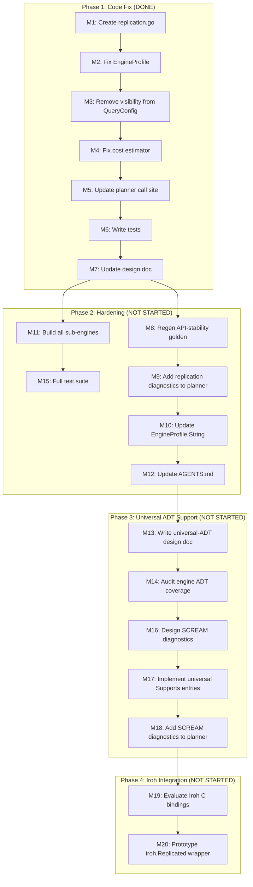

# SUPERB: Metaengine Distributed Engine Foundation — Replication Model, Universal ADTs, and the Path to Iroh

> **Date:** 2026-08-03 00:51 (rewritten for superbness)
> **Status:** Phase 1 (correction) DONE. Phases 2–6 (hardening, Iroh, universal ADT) NOT STARTED.
> **Owner:** Lars
> **Related docs:**
>
> - Design exploration: [`meta-engine-eventual-consistency-and-iroh.md`](meta-engine-eventual-consistency-and-iroh.md) — concepts, tradeoffs, rationale
> - Session status: [`../status/2026-08-03_00-46_metaengine-iroh-eventual-consistency-design.md`](../status/2026-08-03_00-46_metaengine-iroh-eventual-consistency-design.md) — what went wrong
> - Canonical meta-engine design: [`meta-engine-design.md`](meta-engine-design.md)
> - ADR-0084: [`../adr/0084-metaengine-layered-architecture.md`](../adr/0084-metaengine-layered-architecture.md)

---

## Executive Summary

The metaengine planner is the strategic future of go-cqrs-lite. It currently supports 5 single-node engines (Memory, SQLite, Pebble, DuckDB, Postgres) with cost-based routing across 10 ADTs. This plan establishes the foundation for **distributed engines** (Iroh, CockroachDB, Cloud Spanner) without breaking any existing behavior.

The foundation has three pillars:

1. **Replication model** (DDIA Ch5) — engine profiles declare how data propagates across processes. All current engines default to `ReplicationNone`. Future engines declare their mode.
2. **Network cost separation** (DDIA Ch1) — network RTT is an additive fixed cost, distinct from compute cost (which scales with volume). This prevents the cost model from wildly overestimating remote scans.
3. **Universal ADT support** — every engine supports every ADT, with honest cost signals instead of silent skipping. This eliminates the "ADT not supported" dead-end and makes the planner's routing space continuous rather than fragmented.

---

## The Naming Crisis — What Happened and Why

### The Journey

The initial implementation (commit `31f26b8c`) proposed a `VisibilityModel` with `VisibilityLocal` / `VisibilityGlobal`. Through five rounds of Socratic questioning, this was proven wrong:

| Round | Challenge                                | Discovery                                                                                                       |
| ----- | ---------------------------------------- | --------------------------------------------------------------------------------------------------------------- |
| 1     | "VisibilityGlobal is a bad name"         | "Global" is vague — global what?                                                                                |
| 2     | "Is Visibility the right prefix?"        | "Visibility" is temporal in DDIA (MVCC, visibility lag), but I was using it for a spatial/topological question  |
| 3     | "Does this query need network access?"   | I was conflating two orthogonal dimensions: replication topology and network latency                            |
| 4     | "Why is WithReplicationMode on a query?" | Replication is an engine property, not a query property — queries declare what to compute, not where data lives |
| 5     | "How would DDIA call it?"                | The canonical terms are: Replication (Ch5), Replication Lag (Ch5), Network RTT (Ch1)                            |

### The Root Cause

**Research terminology BEFORE naming types.** I proposed `Visibility` without checking what it means in distributed systems literature. Five question rounds could have been avoided by 10 minutes of DDIA reference.

### What Was Done (Phase 1 — COMPLETE)

| What                                                                             | Commit     | Status |
| -------------------------------------------------------------------------------- | ---------- | ------ |
| Created `replication.go` with `Replication` type (4 modes)                       | `72818e88` | Done   |
| Added `Replication` + `ReplicationLag` + `NetworkRTT` to `EngineProfile`         | `72818e88` | Done   |
| Removed wrong `visibility` field from `QueryConfig`                              | `72818e88` | Done   |
| Fixed `estimateCost` to accept `NetworkRTT` as additive cost                     | `72818e88` | Done   |
| Updated planner call site (`planner.go:167`)                                     | `72818e88` | Done   |
| 6 tests pinning the model (zero-value defaults, RTT additive, no volume scaling) | `72818e88` | Done   |
| Design doc updated to DDIA-canonical naming                                      | `72818e88` | Done   |
| Deleted `visibility.go`                                                          | `72818e88` | Done   |

### What Was NOT Done

| What                                                                      | Why It Matters                                                                                                                      | Priority |
| ------------------------------------------------------------------------- | ----------------------------------------------------------------------------------------------------------------------------------- | -------- |
| Planner emits diagnostics when `IsReplicated()` + `ReplicationLag > 0`    | Users need to see "routed to engine with 5s replication lag" warnings                                                               | P1       |
| `NetworkRTT` calibration helper (like existing `Calibrate()` for nsPerOp) | RTT depends on deployment topology, not engine type — user must be able to set or measure it                                        | P1       |
| `EngineProfile.String()` includes replication info                        | Debugging visibility — you can't debug what you can't print                                                                         | P2       |
| `CollectionInfo` exposes replication to consumers                         | Consumers querying `store.Collections()` should know if a collection is replicated                                                  | P2       |
| API-stability golden regenerated                                          | New exported types (`Replication`, `IsReplicated`, `EffectiveReplicationLag`, `EffectiveNetworkRTT`) changed the public API surface | P1       |
| AGENTS.md updated with the replication model                              | Future sessions need to know this exists                                                                                            | P2       |
| External engine profiles (Pebble, DuckDB, Postgres) verified to compile   | They inherit zero-value defaults, but explicit verification + CI gate is missing                                                    | P2       |

---

## The Three Pillars — Design Space

### Pillar 1: Replication Model (P0 — foundation DONE)

```go
// replication.go (ALREADY IMPLEMENTED)
type Replication string
const (
    ReplicationNone         Replication = ""               // zero value
    ReplicationSingleLeader Replication = "single-leader"
    ReplicationMultiLeader  Replication = "multi-leader"
    ReplicationLeaderless   Replication = "leaderless"
)

// EngineProfile (ALREADY IMPLEMENTED)
Replication    Replication     // DDIA Ch5: how data propagates
ReplicationLag time.Duration   // DDIA Ch5: how stale
NetworkRTT     time.Duration   // DDIA Ch1: how far
```

**Key design decisions (locked):**

- `Replication` is engine-only. `QueryConfig` has ZERO new fields. Queries declare what to compute.
- `ReplicationLag` is NOT part of latency estimation. Staleness is freshness, not performance.
- `NetworkRTT` IS part of latency estimation: `total = (ops × nsPerRead / 1e6) + NetworkRTT`. RTT is additive (doesn't scale with volume).
- `ReplicationNone = ""` so zero-value IS none — every existing engine profile defaults to single-node automatically.

**What's still open:** Should `NetworkRTT` be on EngineProfile (set at construction) or auto-calibrated? See Open Question 1.

### Pillar 2: Universal ADT Support (P2 — NOT STARTED)

**Current behavior:** Engines silently skip ADTs they don't implement. If no engine supports an ADT, `planQuery` returns `errADTNotSupported`. The planner's routing space is fragmented — DuckDB doesn't support Graph, Pebble doesn't support Vector, etc.

**Proposed behavior:** Every engine declares complexity for EVERY ADT (via `Supports` map). The Memory engine already does this (brute-force everything). The pattern extends to all engines:

| Engine   | Currently skips                                    | Universal fallback strategy          |
| -------- | -------------------------------------------------- | ------------------------------------ |
| Memory   | Nothing (already universal)                        | N/A — brute-force is the native impl |
| SQLite   | Vector, Search, Spatial                            | O(N) scan + in-memory computation    |
| Pebble   | Vector, Search, Spatial, Graph (partial)           | Prefix scan + in-memory computation  |
| DuckDB   | Graph, Vector, Search, Spatial, Set, Multimap, Log | Full-table scan + SQL aggregation    |
| Postgres | Same as DuckDB + pg_trgm for search                | Full-table scan + SQL aggregation    |

**The planner's job changes from:**

```
"Which engines support this ADT?" → rank by cost
```

**To:**

```
"Every engine supports this ADT — rank by cost, SCREAM warnings about non-native fallbacks"
```

**The SCREAM diagnostics:**

```
WARN: 3 Graph queries routed to Pebble — O(N) scan, no native graph support
      Estimated 4.2s at 10K nodes. A native GraphBackend would be O(degree^depth).
      Affected queries: user_traversal, message_replies, role_hierarchy

WARN: 2 Vector queries routed to SQLite — brute-force cosine similarity
      Estimated 800ms at 10K embeddings. DuckDB VSS extension would be sub-ms.
      Affected queries: similar_items, semantic_search
```

**Why this matters:**

1. Eliminates the "ADT not supported" dead-end — the planner always finds an engine
2. Makes the routing space continuous (every engine is a candidate for every query)
3. Honest cost signals replace silent failures — consumers see the tradeoff explicitly
4. Enables gradual adoption — start with brute-force, upgrade to native when available

**Design decision needed:** Do engines need actual fallback implementations (brute-force Vector in SQLite), or is the `Supports` map + SCREAM diagnostics sufficient (the engine declares the cost but may not have the backend interface)? See Open Question 2.

### Pillar 3: Iroh Integration (P3 — NOT STARTED)

The strategic end-goal. Iroh's `iroh-docs` CRDT key-value store becomes a `ReplicationLeaderless` engine. Two integration levels:

| Level                        | Description                                                                                  | Tradeoff                                                                                 |
| ---------------------------- | -------------------------------------------------------------------------------------------- | ---------------------------------------------------------------------------------------- |
| Level 1: Standalone engine   | Iroh implements MapBackend, SetBackend, CounterBackend, MultimapBackend, LogBackend directly | Limited — no pushdown, no scan, no indexes. Planner rarely picks it over local engines.  |
| Level 2: Replication wrapper | `iroh.Replicated(pebbleEngine)` — local engine handles reads/writes, Iroh syncs underneath   | Full query power retained (pushdown, columnar, indexes) + CRDT convergence. Recommended. |
| Hybrid                       | Wrapper for Map/Set/Multimap/Log, standalone for Counter (PN-Counter IS the implementation)  | Best fit per ADT. Most complex to build.                                                 |

**The Rust/Go bridge challenge (deferred):** Iroh is Rust. No official Go SDK. Three paths: CGo FFI (matches stack/duckdb precedent), sidecar process, pure-Go reimplementation. Decision deferred until Iroh's C binding maturity is evaluated.

**CALM theorem guarantee:** The metaengine's fold operations are monotonic for 5 of 7 ADTs (Map, Set, Counter, Multimap, Log). This means CRDT convergence is mathematically guaranteed — no coordination needed. The planner doesn't need to reason about consistency because monotonicity proves eventual consistency.

---

## Cost Model — The Three Orthogonal Dimensions

| Dimension             | DDIA grounding         | Field                      | Type            | Scales with volume?     | Used for                     |
| --------------------- | ---------------------- | -------------------------- | --------------- | ----------------------- | ---------------------------- |
| Compute cost          | Ch1: Performance       | `NsPerRead` / `NsPerWrite` | `float64`       | Yes (multiply by ops)   | Latency estimation           |
| Network cost          | Ch1: RTT               | `NetworkRTT`               | `time.Duration` | **No (additive fixed)** | Latency estimation           |
| Replication staleness | Ch5: Replication lag   | `ReplicationLag`           | `time.Duration` | No                      | Diagnostics / freshness      |
| Replication topology  | Ch5: Replication modes | `Replication`              | `enum`          | N/A                     | Diagnostics / future routing |

**The formula:**

```
estimated_latency = (ops × nsPerRead / 1e6) + NetworkRTT
```

**Why RTT must be separate from NsPerRead:**

| Approach                             | Point lookup (1 op)      | Scan (10K ops)        | Problem                                                        |
| ------------------------------------ | ------------------------ | --------------------- | -------------------------------------------------------------- |
| RTT baked into NsPerRead (500,000ns) | 0.5ms                    | 5000s                 | Wildly overestimates scans                                     |
| RTT additive (separate)              | 0.0005ms + 0.5ms = 0.5ms | 30ms + 0.5ms = 30.5ms | Correct — RTT dominates point lookups, compute dominates scans |

---

## Open Questions (Need Human Input)

### Q1: Should NetworkRTT be on EngineProfile or auto-calibrated?

**Context:** RTT depends on deployment topology, not engine type. A Pebble engine is always in-process (RTT=0). But a shared Postgres might be on localhost (RTT=0.1ms) or across the country (RTT=50ms). The same engine binary has wildly different RTT depending on where it's deployed.

**Options:**

- **(a)** Field on EngineProfile, set at construction time (consumer calibrates it). Simple, explicit, no magic.
- **(b)** Auto-calibrated via a `Calibrate()` method (like the existing calibration for nsPerOp in `reliability.go`). More magic, but matches existing pattern.
- **(c)** Both — field defaults to zero, `Calibrate()` can measure and fill it.

**Recommendation:** (a). RTT is a deployment property, not an engine property. The consumer knows their topology. The planner just uses whatever is declared.

### Q2: Universal ADT support — does "support" mean actual implementation or just declared cost?

**Context:** If every engine declares complexity for every ADT, but DuckDB doesn't implement `GraphBackend`, what happens when the planner routes a Graph query to DuckDB?

**Options:**

- **(a)** Engines need actual fallback implementations (brute-force graph in DuckDB via recursive CTE, brute-force Vector in SQLite via scan). High effort.
- **(b)** The `Supports` map declares cost, but the planner still type-asserts the backend interface at execution time. If the engine doesn't implement the backend, the query fails at runtime — but the SCREAM diagnostics warned about it at plan time. Lower effort, slightly surprising (plan-time warning, runtime error).
- **(c)** The Memory engine is the universal fallback. If no engine with the actual backend interface is available, the planner routes to Memory with a DEGRADED diagnostic. Memory always works, but it's not persistent.

**Recommendation:** (b) first, then (a) incrementally. The SCREAM diagnostics at plan time are the key value — they surface the tradeoff explicitly. Runtime failure is acceptable when the warning was ignored.

### Q3: Should the committed `31f26b8c` (the wrong Visibility commit) be cleaned up?

**Context:** Commit `31f26b8c` added the wrong `Visibility` model. The daemon then committed `72818e88` which corrected it. The wrong code is in git history.

**Options:**

- **(a)** Leave it. Forward-only history. The correction commit explains what happened.
- **(b)** Interactive rebase to squash `31f26b8c` into `72818e88`. Cleaner history, but rewrites shared history (if pushed).

**Recommendation:** (a). The project convention favors forward-only. The history is instructive — it shows the naming journey.

---

## Comprehensive Plan — 30min Tasks

Sorted by importance / impact / effort / customer-value.

| #   | Task                                                | Pillar | Impact    | Effort | Customer Value                    | Status      |
| --- | --------------------------------------------------- | ------ | --------- | ------ | --------------------------------- | ----------- |
| T1  | ~~Create `replication.go` with `Replication` type~~ | P1     | Critical  | 10min  | Correct foundation                | DONE        |
| T2  | ~~Fix EngineProfile: 3 new fields~~                 | P1     | Critical  | 10min  | Honest cost model                 | DONE        |
| T3  | ~~Remove visibility from QueryConfig~~              | P1     | Critical  | 5min   | Clean query API                   | DONE        |
| T4  | ~~Fix cost estimator: NetworkRTT additive~~         | P1     | Critical  | 10min  | Correct latency                   | DONE        |
| T5  | ~~Update planner call site~~                        | P1     | Critical  | 5min   | Planner uses correct costs        | DONE        |
| T6  | ~~6 replication model tests~~                       | P1     | High      | 15min  | Model is pinned                   | DONE        |
| T7  | ~~Update design doc~~                               | P1     | High      | 20min  | Contributors see correct model    | DONE        |
| T8  | Regenerate API-stability golden                     | P1     | Critical  | 10min  | Public API surface is tracked     | NOT STARTED |
| T9  | Add replication diagnostics to planner              | P1     | High      | 20min  | Users see lag/staleness warnings  | NOT STARTED |
| T10 | Update `EngineProfile.String()` with replication    | P1     | Medium    | 10min  | Debugging visibility              | NOT STARTED |
| T11 | Update AGENTS.md metaengine section                 | P2     | Medium    | 15min  | Future sessions know the model    | NOT STARTED |
| T12 | Verify external engine modules compile              | P1     | High      | 10min  | Pebble/DuckDB/PG don't break      | NOT STARTED |
| T13 | Add `CalibrateRTT()` helper (if Q1 = option c)      | P2     | Medium    | 20min  | Deployment-aware calibration      | NOT STARTED |
| T14 | Write universal-ADT design exploration doc          | P2     | High      | 30min  | Design direction for pillar 2     | NOT STARTED |
| T15 | Audit which engines skip which ADTs                 | P2     | High      | 15min  | Baseline for universal support    | NOT STARTED |
| T16 | Design SCREAM diagnostic format                     | P2     | High      | 20min  | Honest cost signals for fallbacks | NOT STARTED |
| T17 | Implement universal ADT `Supports` entries          | P2     | High      | 30min  | Every engine declares every ADT   | NOT STARTED |
| T18 | Add SCREAM diagnostics to planner                   | P2     | High      | 25min  | Warnings surface tradeoffs        | NOT STARTED |
| T19 | Evaluate Iroh C binding maturity                    | P3     | High      | 30min  | Go/no-go for CGo approach         | NOT STARTED |
| T20 | Prototype `iroh.Replicated(engine)` wrapper         | P3     | Strategic | 60min+ | CRDT convergence POC              | NOT STARTED |

## Micro-Tasks — 12min max each

Sorted by importance / impact / effort / customer-value.

| #   | Task                                                                                                   | Parent | Est   | Status      |
| --- | ------------------------------------------------------------------------------------------------------ | ------ | ----- | ----------- |
| M1  | ~~Create `replication.go`~~                                                                            | T1     | 8min  | DONE        |
| M2  | ~~Fix EngineProfile fields~~                                                                           | T2     | 8min  | DONE        |
| M3  | ~~Remove visibility from QueryConfig~~                                                                 | T3     | 3min  | DONE        |
| M4  | ~~Fix `estimateCost` signature~~                                                                       | T4     | 8min  | DONE        |
| M5  | ~~Update planner call site~~                                                                           | T5     | 3min  | DONE        |
| M6  | ~~Write replication tests~~                                                                            | T6     | 10min | DONE        |
| M7  | ~~Update design doc~~                                                                                  | T7     | 12min | DONE        |
| M8  | Run `cd cmd/api-stability && GOWORK=off go run main.go -update`                                        | T8     | 5min  | NOT STARTED |
| M9  | Add `replicationRule` to `defaultRules()` in `rules.go` — emit INFO diagnostic when `IsReplicated()`   | T9     | 10min | NOT STARTED |
| M10 | Add replication mode + lag to `EngineProfile.String()` output                                          | T10    | 5min  | NOT STARTED |
| M11 | Build pebbleengine + duckdbengine + pgengine with new EngineProfile                                    | T12    | 5min  | NOT STARTED |
| M12 | Add replication model section to AGENTS.md under metaengine                                            | T11    | 10min | NOT STARTED |
| M13 | Write `docs/planning/meta-engine-universal-adt-support.md` skeleton                                    | T14    | 10min | NOT STARTED |
| M14 | Grep all engine Profile() constructors, tabulate which ADTs each skips                                 | T15    | 8min  | NOT STARTED |
| M15 | Run full test suite (`go test -tags "goexperiment.jsonv2" ./... -count=1`) to verify everything passes | T12    | 10min | NOT STARTED |

---

## Validation Criteria (Definition of Done)

Before this plan is considered complete (Phases 1–2):

- [x] `metaengine` builds with `-tags "goexperiment.jsonv2"` — no errors
- [x] All 6 replication tests pass
- [x] All existing metaengine tests pass (no regressions)
- [x] Zero references to `Visibility`/`TypicalLag`/`estimateCostWithLag` in `.go` files
- [x] Design doc uses DDIA-canonical naming throughout
- [ ] `pebbleengine`, `duckdbengine`, `pgengine` all build — no errors
- [ ] API-stability golden regenerated — new exported symbols tracked
- [ ] Planner emits INFO diagnostic when routing to a replicated engine with non-zero lag
- [ ] `EngineProfile.String()` includes replication info
- [ ] AGENTS.md updated with replication model summary
- [ ] Full `go test` suite passes across all modules

Before Phase 3 (universal ADT) is considered complete:

- [ ] Every engine Profile() declares complexity for all 10 ADTs
- [ ] Planner emits SCREAM diagnostics for non-native fallbacks
- [ ] No query returns `errADTNotSupported` when any engine is available

---

## Risk Assessment

| Risk                                                                                      | Likelihood | Impact | Mitigation                                                                                                                                                                           |
| ----------------------------------------------------------------------------------------- | ---------- | ------ | ------------------------------------------------------------------------------------------------------------------------------------------------------------------------------------ |
| External engine modules (Pebble/DuckDB/PG) break from EngineProfile struct change         | Low        | High   | Fields default to zero — struct literals don't break. But MUST verify by building all modules.                                                                                       |
| API-stability golden drift — new exported symbols not tracked                             | High       | Medium | Regenerate golden in the same commit as the code change. The meta-test `TestEveryGoModDirIsInModulesList` will catch drift but not missing symbols.                                  |
| Cost model change (NetworkRTT additive) breaks existing test thresholds                   | Low        | Low    | Only `cost_validation_test.go` calls `estimateCost` — already updated. Existing thresholds compare relative rankings, not absolute values.                                           |
| Universal ADT support creates false expectations (engine declares cost but can't execute) | Medium     | Medium | SCREAM diagnostics at plan time must be clear: "This engine does NOT implement GraphBackend — query will fail at runtime." The cost declaration is advisory, not a capability claim. |
| Iroh C bindings are immature or unstable                                                  | Medium     | High   | Defer bridge decision until Q3 (C binding evaluation). Don't commit to CGo until the binding is proven stable.                                                                       |
| `ReplicationLag` is set but never surfaced to the user                                    | Medium     | Low    | Planner diagnostic (T9) surfaces it. If skipped, the field is dead. T9 is P1 to prevent this.                                                                                        |

---

## Mermaid Execution Graph



---

## References

- [Designing Data-Intensive Applications](https://dataintensive.net/) — Kleppmann, Ch1 (RTT, performance), Ch5 (replication modes, replication lag)
- [CALM Theorem](https://link.springer.com/chapter/10.1007/978-3-642-04243-6_27) — Consistency As Logical Monotonicity (why monotonic folds are CRDT-safe)
- [Iroh GitHub](https://github.com/n0-computer/iroh) — "Dial keys, not IPs"
- [Iroh Docs — Documents Protocol](https://docs.iroh.computer/protocols/documents) — CRDT key-value store
- [`meta-engine-eventual-consistency-and-iroh.md`](meta-engine-eventual-consistency-and-iroh.md) — full design exploration
- [`meta-engine-design.md`](meta-engine-design.md) — canonical metaengine design
- [ADR-0084](../adr/0084-metaengine-layered-architecture.md) — layered architecture
