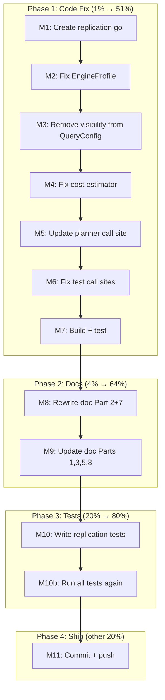

# SUPERB: Metaengine Replication Model Correction

> **Date:** 2026-08-03 00:51
> **Status:** Ready to execute
> **Context:** Commit `31f26b8c` shipped a `VisibilityModel` that was proven wrong through Socratic questioning. This plan replaces it with the DDIA-canonical `Replication` + `NetworkRTT` + `ReplicationLag` model — all engine-only, zero query changes.

---

## What Went Wrong

Commit `31f26b8c` added:

- `VisibilityModel` type (wrong name — conflates spatial and temporal)
- `Visibility VisibilityModel` on EngineProfile (wrong concept — "visibility" is temporal in DDIA)
- `TypicalLag time.Duration` on EngineProfile (wrong: conflates replication lag with network RTT)
- `visibility VisibilityModel` on QueryConfig (**fundamentally wrong** — replication is an engine property, not a query property)
- `estimateCostWithLag` in cost.go (**has a bug** — accepts `lag` param but never uses it in the latency calculation)

## The Correct Model

```go
// replication.go
type Replication string
const (
    ReplicationNone         Replication = ""               // zero value = no replication
    ReplicationSingleLeader Replication = "single-leader"  // Postgres streaming
    ReplicationMultiLeader  Replication = "multi-leader"   // CockroachDB, Spanner
    ReplicationLeaderless   Replication = "leaderless"     // Iroh CRDT, Dynamo
)

// EngineProfile (three new fields, replacing Visibility + TypicalLag)
Replication    Replication     // DDIA Ch5: replication mode
ReplicationLag time.Duration   // DDIA Ch5: expected staleness (0 for local/primary)
NetworkRTT     time.Duration   // DDIA Ch1: round-trip time (0 for in-process)

// QueryConfig: ZERO new fields. Replication is engine-only.

// Cost model: latency = (ops × nsPerRead / 1e6) + NetworkRTT
//   - NetworkRTT is additive (doesn't scale with volume)
//   - ReplicationLag is NOT part of latency — it's a freshness property for diagnostics
```

---

## Pareto Breakdown

### 1% → 51%: Fix the code (correct naming + model)

| Task                                                  | Impact   | Effort |
| ----------------------------------------------------- | -------- | ------ |
| Rewrite visibility.go → replication.go                | Critical | 8min   |
| Fix EngineProfile fields                              | Critical | 8min   |
| Remove visibility from QueryConfig                    | Critical | 3min   |
| Fix cost estimator (add NetworkRTT, remove dead code) | Critical | 8min   |
| Update planner call site                              | Critical | 3min   |
| Fix test call sites                                   | High     | 3min   |
| Build + test                                          | Critical | 5min   |

### 4% → 64%: Update the design doc

| Task                                                     | Impact | Effort |
| -------------------------------------------------------- | ------ | ------ |
| Rewrite doc to use Replication/NetworkRTT/ReplicationLag | High   | 15min  |

### 20% → 80%: Tests + planner integration

| Task                                   | Impact | Effort |
| -------------------------------------- | ------ | ------ |
| Write replication model tests          | High   | 10min  |
| Add replication diagnostics to planner | Medium | 8min   |

### Other 20%: Plan doc + commit

| Task                             | Impact | Effort |
| -------------------------------- | ------ | ------ |
| Write this plan doc with mermaid | Medium | 10min  |
| Commit + push                    | Medium | 5min   |

---

## Comprehensive Plan (30min tasks)

| #   | Task                                                       | Impact   | Effort | Customer Value                                  |
| --- | ---------------------------------------------------------- | -------- | ------ | ----------------------------------------------- |
| T1  | Replace visibility.go with replication.go                  | Critical | 10min  | Correct foundation for distributed engines      |
| T2  | Fix EngineProfile: remove wrong fields, add correct fields | Critical | 10min  | Honest cost model                               |
| T3  | Remove visibility from QueryConfig                         | Critical | 5min   | Clean query API — replication is engine concern |
| T4  | Fix cost estimator: NetworkRTT additive, remove dead code  | Critical | 10min  | Correct latency estimation for remote engines   |
| T5  | Update planner to pass NetworkRTT to cost estimator        | Critical | 5min   | Planner uses correct costs                      |
| T6  | Fix cost_validation_test.go call sites                     | High     | 5min   | Tests compile                                   |
| T7  | Build + test metaengine core                               | Critical | 5min   | Verify nothing breaks                           |
| T8  | Update design doc with corrected model                     | High     | 20min  | Future contributors see correct model           |
| T9  | Write replication model tests                              | High     | 15min  | Pin the model with tests                        |
| T10 | Commit + push                                              | Medium   | 5min   | Lock the fix                                    |

## Micro-Tasks (12min max each)

| #   | Task                                                                                                                 | Parent | Est   |
| --- | -------------------------------------------------------------------------------------------------------------------- | ------ | ----- |
| M1  | Delete visibility.go, create replication.go with Replication type (none="", single-leader, multi-leader, leaderless) | T1     | 8min  |
| M2  | Remove Visibility+TypicalLag from EngineProfile, add Replication+ReplicationLag+NetworkRTT                           | T2     | 8min  |
| M3  | Remove `visibility VisibilityModel` from QueryConfig struct                                                          | T3     | 3min  |
| M4  | Replace estimateCostWithLag: change estimateCost to accept networkRTT, add RTT to latency, remove dead function      | T4     | 8min  |
| M5  | Update planner.go:167 call: add profile.NetworkRTT as 4th arg                                                        | T5     | 3min  |
| M6  | Update cost_validation_test.go:52-53: add `0` as 4th arg                                                             | T6     | 3min  |
| M7  | Run `go build -tags "goexperiment.jsonv2" ./...` + `go test`                                                         | T7     | 5min  |
| M8  | Rewrite design doc Part 2 (EngineProfile section) + Part 7 (cost model)                                              | T8     | 8min  |
| M9  | Update design doc Parts 1,3,5,8: remove all Visibility references                                                    | T8     | 8min  |
| M10 | Write replication_test.go: test ReplicationNone zero value, test cost with NetworkRTT                                | T9     | 10min |
| M11 | Commit with detailed message + push                                                                                  | T10    | 5min  |

---

## Mermaid Execution Graph



---

## Risk Assessment

| Risk                                      | Mitigation                                                                     |
| ----------------------------------------- | ------------------------------------------------------------------------------ |
| Removing fields breaks external consumers | All fields are NEW (added in `31f26b8c`, same session). No consumer uses them. |
| Cost model change breaks existing tests   | Only `cost_validation_test.go` calls `estimateCost` — updating 2 lines.        |
| `ReplicationNone = ""` is non-obvious     | Document clearly: zero value IS none, same pattern as Go's `io.SeekStart = 0`. |
| Design doc rewrite introduces errors      | Only update naming + model sections, don't rewrite Iroh analysis.              |
