# SUPERB PLAN: Metaengine Phase 3 (Universal ADT) + Verification Foundation + Replication Polish

> **Date:** 2026-08-03 04:18
> **Scope:** Everything from the replication Phase 2 completion through Phase 3 (Universal ADT), verification gate hardening, TODO_LIST backlog, and Iroh evaluation.
> **Related:** [Replication design](meta-engine-eventual-consistency-and-iroh.md), [Universal ADT design](meta-engine-universal-adt-support.md), [ADR-0093](../adr/0093-metaengine-replication-model.md)

---

## Context: Where We Are

### Phase 2 (Replication Model) — COMPLETE

- `EngineProfile` has `Replication`, `ReplicationLag`, `NetworkRTT` fields (DDIA-canonical)
- Cost estimator: `NetworkRTT` additive, `ReplicationLag` diagnostic-only
- `replicationRule` emits INFO diagnostic in planner pipeline
- `CollectionInfo` exposes `Replication`/`ReplicationLagMs`/`NetworkRTTMs`
- `ExplainPlan()` shows replication suffix; `Doctor()` has `--- Replication ---` section
- 6 replication tests + 3 Explain/Doctor tests, all pass under `-race`
- Latest tag: ~~`metaengine/v4.2.0` — Phase 2 work is unreleased~~
  `metaengine/v4.4.0` tagged (`6f7c8838` then force-moved to v4.4.0 after
  Universal ADT + replication polish)

### Phase 3 (Universal ADT) — ~~NOT STARTED~~ DONE

> **Update 2026-08-03 (commit `8b41f658`):** `DegradedADTs` shipped, all 5
> engines extended to 10/10 ADTs, `degradedADTRule` SCREAM diagnostics wired,
> `errADTNotSupported` eliminated. ADR-0094 written. metaengine v4.4.0 tagged.

- Design doc exists: [`meta-engine-universal-adt-support.md`](meta-engine-universal-adt-support.md)
- `DegradedADTs` field: does NOT exist in `EngineProfile`
- `errADTNotSupported`: still returned by `planQuery` when no engine supports the ADT
- `degradedADTRule`: does NOT exist in `defaultRules()`
- Engine coverage: Memory 10/10, SQLite 7/10, Pebble 7/10, DuckDB 3/10, Postgres 3/10

### Verification Gate — ~~PARTIALLY BROKEN~~ FIXED

> **Update 2026-08-03 (commit `d4dbebbd`):** `nix run .#verify` now includes
> `check-layers`, `check-duplication`, `check-coverage`. The three-session gap
> is closed.

- `nix run .#verify` exits 0 (build/vet/test/race/lint/api-stability/doc-check — all GREEN)
- BUT `verify` does NOT include `check-layers`, `check-duplication`, `check-coverage`
- Three consecutive sessions (03-14, 03-34, 03-58) missed these three checks
- This is a **systemic gap** — the verify gate's name implies completeness

### Design Doc Inaccuracy

- `meta-engine-eventual-consistency-and-iroh.md` says "The planner emits a WARN diagnostic when a query's fold includes MapUpdate and routes it to a ReplicationLeaderless/MultiLeader engine" — **this code does not exist**. It's a design recommendation written as shipped behavior.

---

## Step 1: Pareto Breakdown

### The 1% That Delivers 51% of the Result

**Task P1: Extend `nix run .#verify` to include `check-layers`, `check-duplication`, `check-coverage`**

This is a SINGLE flake.nix edit (~3 lines). It closes a gap that has plagued three consecutive sessions. Without this, no quality claim is trustworthy — every "GREEN" is potentially a "STALE GREEN" (the documented anti-pattern from AGENTS.md). One edit, permanent payoff, every future session automatically gets the complete gate.

**Why this is 1%/51%:** Quality verification is the foundation of everything else. You cannot ship Phase 3 if you cannot verify it. Three sessions proved this: each one claimed GREEN while skipping three checks. The fix is 5 minutes. The payoff is permanent trust in the verify gate.

### The 4% That Delivers 64% of the Result

**Task P2: Tag `metaengine/v4.3.0`** — Phase 2 replication work is unreleased. Consumers resolving `metaengine/v4` get v4.2.0 — no replication fields, no CollectionInfo exposure. Without a tag, none of the last 3 sessions' work reaches consumers. 30 minutes.

**Task P3: Implement Universal ADT (Phase 3)** — Transforms the planner from "can't do that" (`errADTNotSupported`) to "can do that, but here's the cost tradeoff" (SCREAM diagnostics). This is the single highest-impact feature for the metaengine. The design doc exists, the pattern is proven (5 engines already implement some ADTs), and it eliminates the dead-end UX. ~6 hours.

**Task P4: Fix the design doc MapUpdate lie** — Change "emits" to "should emit." Prevents future implementers from believing a feature exists when it doesn't. 10 minutes.

### The 20% That Delivers 80% of the Result

**Task P5: Replication model polish** — `WithReplication()` / `WithNetworkRTT()` Plan options, `SerializablePlan` replication info, `ReplicationMode()` accessor, implement the MapUpdate WARN diagnostic. Completes Phase 2. ~3 hours.

**Task P6: TODO_LIST backlog** — 10M soak test hardening, watcher typed-channel, SSE+SQLite reconnect test, boundary key-type validation, Postgres GIN indexes, DuckDB LayoutPlanner follow-ups. These are documented gaps with evidence links. ~6 hours.

**Task P7: Push 12 unpushed commits** — Branch is 12 commits ahead of origin. 1 minute.

### The Other 20% (to 100%)

**Task P8: Iroh integration evaluation** — Assess CGo FFI vs sidecar, write ADR for bridge decision. No implementation, just research + decision. ~1 hour.

**Task P9: cqrs-lint validation + cleanup** — Run against real consumer projects, fix 6 gopls infertypeargs hints, address ~14 backlog items. ~4 hours.

---

## Step 2: Comprehensive Plan (30-100min tasks)

> Sorted by Impact (1-5) × Customer Value (1-5) / Effort (hours). Higher score = do first.

| #   | Task                                                                                                             | Impact | Cust.Val | Effort(h) | Score | Tier  | Depends On |
| --- | ---------------------------------------------------------------------------------------------------------------- | ------ | -------- | --------- | ----- | ----- | ---------- |
| T1  | **Extend verify gate**: add check-layers + check-duplication + check-coverage to `nix run .#verify` in flake.nix | 5      | 4        | 0.5       | 40.0  | 1%    | —          |
| T2  | **Fix design doc lie**: MapUpdate "emits" → "should emit" in `meta-engine-eventual-consistency-and-iroh.md`      | 3      | 3        | 0.25      | 36.0  | 4%    | —          |
| T3  | **Push unpushed commits**: `git push` (12 commits ahead)                                                         | 3      | 4        | 0.1       | 120.0 | 4%    | —          |
| T4  | **Tag `metaengine/v4.3.0`**: cut release with replication model + explain/doctor                                 | 5      | 5        | 0.5       | 25.0  | 4%    | T1         |
| T5  | **Add `DegradedADTs` field** to `EngineProfile` + update `SupportsADT`/planner                                   | 5      | 4        | 0.75      | 26.7  | 20%   | T1         |
| T6  | **Extend SQLite Supports** to 10 ADTs (add Vector/Search/Spatial as O(N) degraded)                               | 4      | 4        | 0.75      | 21.3  | 20%   | T5         |
| T7  | **Extend Pebble Supports** to 10 ADTs (add Vector/Search/Spatial as O(N) degraded)                               | 4      | 4        | 0.5       | 32.0  | 20%   | T5         |
| T8  | **Extend DuckDB Supports** to 10 ADTs (add Set/Graph/Log/Multimap/Vector/Search/Spatial)                         | 4      | 4        | 1.0       | 16.0  | 20%   | T5         |
| T9  | **Extend Postgres Supports** to 10 ADTs (same set as DuckDB)                                                     | 4      | 4        | 1.0       | 16.0  | 20%   | T5         |
| T10 | **Implement `degradedADTRule`**: SCREAM diagnostics when ADT is in DegradedADTs                                  | 5      | 4        | 0.75      | 26.7  | 20%   | T5         |
| T11 | **Eliminate `errADTNotSupported`**: change `planQuery` to route to best degraded engine                          | 5      | 5        | 0.75      | 33.3  | 20%   | T6-T9      |
| T12 | **Integration tests for universal ADT**: every ADT routes to some engine, SCREAM for degraded                    | 4      | 4        | 0.75      | 21.3  | 20%   | T11        |
| T13 | **Write ADR-0094**: Universal ADT Support — formalize DegradedADTs design                                        | 3      | 3        | 1.0       | 9.0   | 20%   | T12        |
| T14 | **Implement `WithReplication()` Plan option**: consumer override at plan time                                    | 3      | 3        | 0.75      | 12.0  | 20%   | T1         |
| T15 | **Implement `WithNetworkRTT(d)` Plan option**: deployment-specific RTT override                                  | 3      | 3        | 0.5       | 18.0  | 20%   | T14        |
| T16 | **Add replication to `SerializablePlan`**: for plan pinning/diffing                                              | 3      | 3        | 0.5       | 18.0  | 20%   | T14        |
| T17 | **Implement `ReplicationMode()` accessor** on Store                                                              | 2      | 3        | 0.33      | 18.2  | 20%   | T14        |
| T18 | **Implement MapUpdate WARN diagnostic**: the footgun guard from design doc                                       | 4      | 4        | 0.75      | 21.3  | 20%   | T1         |
| T19 | **10M soak test hardening**: 100K smoke variant, MemStats, 3× race variance                                      | 3      | 3        | 1.5       | 6.0   | Other | —          |
| T20 | **Watcher typed-channel design**: eliminate `chan any` + runtime type assertion                                  | 4      | 3        | 1.5       | 5.3   | Other | —          |
| T21 | **SSE+SQLite reconnect test**: end-to-end `ServeSSE` replay with `WatchWithSeq`                                  | 3      | 3        | 0.5       | 18.0  | Other | —          |
| T22 | **Boundary key-type validation**: `ErrKeyTypeMismatch` at Store.Execute boundary                                 | 3      | 3        | 0.75      | 12.0  | Other | —          |
| T23 | **Postgres GIN containment indexes**: `@>` operator for JSONB path queries                                       | 3      | 3        | 1.0       | 9.0   | Other | —          |
| T24 | **DuckDB LayoutPlanner follow-ups**: explainScan, centralize helpers, benchmark, adttest matrix                  | 3      | 3        | 1.5       | 6.0   | Other | —          |
| T25 | **Evaluate Iroh bridge**: CGo FFI vs sidecar assessment, write ADR for decision                                  | 4      | 4        | 1.0       | 16.0  | Other | T12        |
| T26 | **gopls hint cleanup**: 6 infertypeargs + 1 writestring in cmd/cqrs-lint                                         | 1      | 2        | 0.5       | 4.0   | Other | —          |
| T27 | **Run cqrs-lint against real consumer projects**: validate false-positive rates                                  | 4      | 5        | 1.0       | 20.0  | Other | —          |

**Total estimated effort: ~24.5 hours**

---

## Step 3: Detailed Breakdown (max 12min tasks)

> Each task broken into atomic subtasks. Sorted by execution dependency order within each tier.

### Tier: 1% (51%)

| Sub# | Parent | Task                                          | Est  | Verified By              |
| ---- | ------ | --------------------------------------------- | ---- | ------------------------ |
| S1.1 | T1     | Read flake.nix verify app (lines 884-898)     | 2min | view output              |
| S1.2 | T1     | Add `check-layers` to verify chain after Lint | 2min | grep verify in flake.nix |
| S1.3 | T1     | Add `check-duplication` to verify chain       | 2min | grep verify in flake.nix |
| S1.4 | T1     | Add `check-coverage` to verify chain          | 2min | grep verify in flake.nix |
| S1.5 | T1     | Run `nix run .#verify` to confirm exit 0      | 4min | exit code = 0            |

### Tier: 4% (64%)

| Sub# | Parent | Task                                                                             | Est  | Verified By               |
| ---- | ------ | -------------------------------------------------------------------------------- | ---- | ------------------------- |
| S2.1 | T2     | Read design doc MapUpdate section (line ~279)                                    | 2min | view output               |
| S2.2 | T2     | Change "emits" to "should emit" + add "Recommended:" prefix                      | 2min | grep "should emit"        |
| S2.3 | T2     | Verify doc-check still passes                                                    | 2min | exit code = 0             |
| S2.4 | T3     | Run `git push`                                                                   | 1min | remote hash matches local |
| S2.5 | T4     | Run `nix run .#verify` one final time                                            | 4min | exit code = 0             |
| S2.6 | T4     | Check latest metaengine tag: `git tag -l 'metaengine/v4*' \| sort -V \| tail -1` | 1min | v4.2.0                    |
| S2.7 | T4     | Run `scripts/tag-release.sh metaengine v4.3.0`                                   | 2min | annotated tag exists      |
| S2.8 | T4     | Push tag: `git push origin metaengine/v4.3.0`                                    | 1min | tag on remote             |
| S2.9 | T4     | Update TODO_LIST: mark Phase 2 release as done                                   | 2min | grep TODO_LIST            |

### Tier: 20% (80%) — Phase 3 Universal ADT

| Sub#  | Parent | Task                                                                           | Est   | Verified By           |
| ----- | ------ | ------------------------------------------------------------------------------ | ----- | --------------------- |
| S3.1  | T5     | Read `metaengine/engine.go` EngineProfile struct                               | 2min  | view output           |
| S3.2  | T5     | Add `DegradedADTs map[ADT]bool` field to EngineProfile                         | 3min  | `go build` passes     |
| S3.3  | T5     | Add `IsDegraded(adt ADT) bool` method                                          | 2min  | `go build` passes     |
| S3.4  | T5     | Update `SupportsADT` to return degraded complexity if in DegradedADTs          | 3min  | existing tests pass   |
| S3.5  | T5     | Run `go test ./metaengine/...`                                                 | 4min  | all tests pass        |
| S3.6  | T6     | Read SQLite engine profile constructor                                         | 2min  | view output           |
| S3.7  | T6     | Add ADTVector/ADTSearch/ADTSpatial to SQLite Supports as O(N)                  | 3min  | `go build` passes     |
| S3.8  | T6     | Mark them in DegradedADTs                                                      | 2min  | `go build` passes     |
| S3.9  | T6     | Run `go test ./metaengine/...`                                                 | 4min  | all tests pass        |
| S3.10 | T7     | Read Pebble engine profile constructor                                         | 2min  | view output           |
| S3.11 | T7     | Add ADTVector/ADTSearch/ADTSpatial to Pebble Supports as O(N)                  | 3min  | `go build` passes     |
| S3.12 | T7     | Mark them in DegradedADTs                                                      | 2min  | `go build` passes     |
| S3.13 | T7     | Run `go test ./metaengine/pebbleengine/...`                                    | 4min  | all tests pass        |
| S3.14 | T8     | Read DuckDB engine profile constructor                                         | 2min  | view output           |
| S3.15 | T8     | Add ADTSet/ADTGraph/ADTLog/ADTMultimap to DuckDB Supports as O(N)              | 5min  | `go build` passes     |
| S3.16 | T8     | Add ADTVector/ADTSearch/ADTSpatial to DuckDB Supports as O(N)                  | 3min  | `go build` passes     |
| S3.17 | T8     | Mark all 7 new ADTs in DegradedADTs                                            | 2min  | `go build` passes     |
| S3.18 | T8     | Run `go test ./metaengine/duckdbengine/...`                                    | 4min  | all tests pass        |
| S3.19 | T9     | Read Postgres engine profile constructor                                       | 2min  | view output           |
| S3.20 | T9     | Add same 7 ADTs to Postgres Supports as O(N)                                   | 5min  | `go build` passes     |
| S3.21 | T9     | Mark all 7 in DegradedADTs                                                     | 2min  | `go build` passes     |
| S3.22 | T9     | Run `go test ./metaengine/pgengine/...`                                        | 4min  | all tests pass        |
| S3.23 | T10    | Read existing replicationRule as pattern                                       | 2min  | view output           |
| S3.24 | T10    | Implement `degradedADTRule` struct + Apply method                              | 5min  | `go build` passes     |
| S3.25 | T10    | SCREAM message: "DEGRADED: {adt} routed to {engine} via {complexity} fallback" | 5min  | review message        |
| S3.26 | T10    | Register `degradedADTRule` in `defaultRules()`                                 | 2min  | grep defaultRules     |
| S3.27 | T10    | Write `TestDegradedADTRule_EmitsDiagnostic`                                    | 5min  | test passes           |
| S3.28 | T10    | Write `TestDegradedADTRule_NoDiagnosticForNative`                              | 5min  | test passes           |
| S3.29 | T10    | Run `go test ./metaengine/...`                                                 | 4min  | all tests pass        |
| S3.30 | T11    | Read `planQuery` in planner.go (lines 121-186)                                 | 3min  | view output           |
| S3.31 | T11    | Change errADTNotSupported to fall back to best degraded engine                 | 5min  | `go build` passes     |
| S3.32 | T11    | Only return error when zero engines registered                                 | 3min  | `go build` passes     |
| S3.33 | T11    | Update existing errADTNotSupported tests                                       | 5min  | tests pass            |
| S3.34 | T11    | Run `go test ./metaengine/...`                                                 | 4min  | all tests pass        |
| S3.35 | T12    | Write `TestUniversalADT_EveryADTRoutesToSomeEngine`                            | 5min  | test passes           |
| S3.36 | T12    | Write `TestUniversalADT_SCREAMForDegradedRouting`                              | 5min  | test passes           |
| S3.37 | T12    | Write `TestUniversalADT_NoErrorWhenAnyEngineAvailable`                         | 5min  | test passes           |
| S3.38 | T12    | Run `go test -race ./metaengine/...`                                           | 8min  | 0 races               |
| S3.39 | T13    | Write ADR-0094: context, decision, DegradedADTs design, SCREAM format          | 10min | doc-check passes      |
| S3.40 | T13    | Add ADR-0094 to docs/README.md ADR index + bump count to 92                    | 3min  | verify-docs.sh passes |

### Tier: 20% (80%) — Replication Polish

| Sub#  | Parent | Task                                                                        | Est  | Verified By         |
| ----- | ------ | --------------------------------------------------------------------------- | ---- | ------------------- |
| S4.1  | T14    | Read Plan() signature + existing plan options                               | 3min | view output         |
| S4.2  | T14    | Design WithReplication override semantics (override wins, WARN on conflict) | 5min | decision documented |
| S4.3  | T14    | Implement `WithReplication(r Replication)` option                           | 5min | `go build` passes   |
| S4.4  | T14    | Wire override into planConfig → EngineProfile override                      | 5min | `go build` passes   |
| S4.5  | T14    | Write `TestWithReplication_OverridesEngineProfile`                          | 5min | test passes         |
| S4.6  | T15    | Implement `WithNetworkRTT(d time.Duration)` option                          | 5min | `go build` passes   |
| S4.7  | T15    | Wire override into planConfig                                               | 3min | `go build` passes   |
| S4.8  | T15    | Write `TestWithNetworkRTT_OverridesEngineProfile`                           | 5min | test passes         |
| S4.9  | T16    | Read `SerializablePlan` struct                                              | 2min | view output         |
| S4.10 | T16    | Add Replication/ReplicationLagMs/NetworkRTTMs to SerializablePlan           | 3min | `go build` passes   |
| S4.11 | T16    | Wire from PlanResult → SerializablePlan                                     | 5min | `go build` passes   |
| S4.12 | T16    | Write `TestSerializablePlan_IncludesReplication`                            | 5min | test passes         |
| S4.13 | T17    | Add `ReplicationMode(queryName string) Replication` to Store                | 5min | `go build` passes   |
| S4.14 | T17    | Wire from planResult lookup                                                 | 3min | `go build` passes   |
| S4.15 | T17    | Write `TestReplicationMode_ProgrammaticAccess`                              | 5min | test passes         |
| S4.16 | T18    | Read fold classification code (where MapUpdate is detected)                 | 3min | view output         |
| S4.17 | T18    | Add detection: fold includes MapUpdate + engine is replicated               | 5min | `go build` passes   |
| S4.18 | T18    | Emit WARN diagnostic: "non-CRDT operation MapUpdate will not replicate"     | 5min | `go build` passes   |
| S4.19 | T18    | Write `TestMapUpdate_WARN_OnReplicatedEngine`                               | 5min | test passes         |
| S4.20 | T18    | Run `go test -race ./metaengine/...`                                        | 8min | 0 races             |

### Tier: 20% (80%) — TODO_LIST Backlog

| Sub#  | Parent | Task                                                               | Est   | Verified By        |
| ----- | ------ | ------------------------------------------------------------------ | ----- | ------------------ |
| S5.1  | T19    | Add 100K-event smoke test variant (runs when SOAK_SKIP_10M=1)      | 10min | test passes        |
| S5.2  | T19    | Add `runtime.MemStats.TotalAlloc` delta measurement                | 5min  | metric appears     |
| S5.3  | T19    | Run soak test 3× with `-race`, record variance in status doc       | 12min | results documented |
| S5.4  | T19    | Document `SOAK_SKIP_10M` in AGENTS.md                              | 3min  | grep AGENTS.md     |
| S5.5  | T20    | Design typed Watcher[V] interface (eliminate `chan any`)           | 10min | design sketched    |
| S5.6  | T20    | Implement `WatchTyped[V]()` method on Store                        | 10min | `go build` passes  |
| S5.7  | T20    | Update dx.go reifyWatcherValue to use typed path                   | 10min | tests pass         |
| S5.8  | T20    | Write `TestWatcher_TypedChannel_NoAssertion`                       | 8min  | test passes        |
| S5.9  | T21    | Write `TestSSE_ReconnectWithSQLite` end-to-end test                | 10min | test passes        |
| S5.10 | T21    | Verify Last-Event-ID replay works with WatchWithSeq path           | 5min  | test passes        |
| S5.11 | T22    | Add keyType check at Store.Execute/ExecuteTyped entry              | 5min  | `go build` passes  |
| S5.12 | T22    | Return `ErrKeyTypeMismatch` on mismatch                            | 3min  | `go build` passes  |
| S5.13 | T22    | Write `TestStore_BoundaryKeyTypeValidation`                        | 5min  | test passes        |
| S5.14 | T23    | Add `@>` operator support to pgengine pushdown                     | 10min | `go build` passes  |
| S5.15 | T23    | Write `TestPgEngine_GINContainment`                                | 8min  | test passes        |
| S5.16 | T24    | Add `explainScan` for DuckDB planned + standard paths              | 10min | output visible     |
| S5.17 | T24    | Centralize planned-table helpers (extractFields, quoteIdent, etc.) | 10min | `go build` passes  |
| S5.18 | T24    | Add DuckDB layout benchmark                                        | 8min  | benchmark runs     |
| S5.19 | T24    | Add adttest matrix coverage for LayoutPlanner                      | 10min | matrix passes      |

### Tier: Other 20% (to 100%)

| Sub# | Parent | Task                                                                      | Est   | Verified By         |
| ---- | ------ | ------------------------------------------------------------------------- | ----- | ------------------- |
| S6.1 | T25    | Research Iroh C bindings (iroh-ffi, iroh-go) availability + stability     | 10min | findings documented |
| S6.2 | T25    | Evaluate CGo FFI vs sidecar tradeoffs (compare with stack/duckdb pattern) | 10min | tradeoff matrix     |
| S6.3 | T25    | Write ADR-0095: Iroh bridge decision — recommend approach                 | 10min | doc-check passes    |
| S6.4 | T26    | Remove 6 unnecessary type arguments in cqrs-lint (infertypeargs)          | 8min  | gopls hints = 0     |
| S6.5 | T26    | Fix writestring hint in commands.go:78                                    | 3min  | gopls hint = 0      |
| S6.6 | T27    | Run cqrs-lint against example/taskmanager                                 | 8min  | findings documented |
| S6.7 | T27    | Run cqrs-lint against example/readme-quickstart                           | 5min  | findings documented |
| S6.8 | T27    | Document false-positive findings for future rule tuning                   | 5min  | notes saved         |

---

## Execution Order (Mermaid)

```mermaid
graph TD
    subgraph "1% → 51%"
        T1[T1: Extend verify gate<br/>check-layers + dup + coverage]
    end

    subgraph "4% → 64%"
        T2[T2: Fix design doc lie<br/>MapUpdate 'emits' → 'should emit']
        T3[T3: Push 12 commits]
        T4[T4: Tag metaengine/v4.3.0]
    end

    subgraph "20% → 80%: Phase 3 Universal ADT"
        T5[T5: DegradedADTs field]
        T6[T6: SQLite → 10 ADTs]
        T7[T7: Pebble → 10 ADTs]
        T8[T8: DuckDB → 10 ADTs]
        T9[T9: Postgres → 10 ADTs]
        T10[T10: degradedADTRule<br/>SCREAM diagnostics]
        T11[T11: Eliminate errADTNotSupported]
        T12[T12: Integration tests]
        T13[T13: ADR-0094]
    end

    subgraph "20% → 80%: Replication Polish"
        T14[T14: WithReplication option]
        T15[T15: WithNetworkRTT option]
        T16[T16: SerializablePlan replication]
        T17[T17: ReplicationMode accessor]
        T18[T18: MapUpdate WARN diagnostic]
    end

    subgraph "20% → 80%: TODO Backlog"
        T19[T19: 10M soak hardening]
        T20[T20: Watcher typed-channel]
        T21[T21: SSE reconnect test]
        T22[T22: Boundary key validation]
        T23[T23: Postgres GIN indexes]
        T24[T24: DuckDB LayoutPlanner]
    end

    subgraph "Other 20% → 100%"
        T25[T25: Iroh bridge evaluation]
        T26[T26: gopls hint cleanup]
        T27[T27: cqrs-lint validation]
    end

    T1 --> T2
    T1 --> T4
    T2 --> T3
    T4 --> T5
    T5 --> T6
    T5 --> T7
    T5 --> T8
    T5 --> T9
    T5 --> T10
    T6 --> T11
    T7 --> T11
    T8 --> T11
    T9 --> T11
    T10 --> T11
    T11 --> T12
    T12 --> T13
    T1 --> T14
    T14 --> T15
    T14 --> T16
    T14 --> T17
    T1 --> T18
    T12 --> T25
    T1 --> T19
    T1 --> T20
    T1 --> T21
    T1 --> T22
    T1 --> T23
    T1 --> T24
    T1 --> T26
    T1 --> T27

    style T1 fill:#ff6b6b,color:#fff
    style T2 fill:#ffa94d,color:#fff
    style T3 fill:#ffa94d,color:#fff
    style T4 fill:#ffa94d,color:#fff
    style T5 fill:#69db7c,color:#fff
    style T10 fill:#69db7c,color:#fff
    style T11 fill:#69db7c,color:#fff
```

---

## Validation Criteria

Before claiming any tier is complete:

- [ ] `nix run .#verify` exits 0 (includes check-layers/dup/coverage after T1)
- [ ] All new tests pass under `-race`
- [ ] No API surface removed (only added — backward compatible)
- [ ] ADR written and indexed for Phase 3 (T13) and Iroh decision (T25)
- [ ] TODO_LIST.md updated to reflect completed items
- [ ] AGENTS.md updated with new patterns/conventions discovered
- [ ] Tags pushed for any new release

---

## Risk Assessment

| #   | Risk                                                                                       | Likelihood | Impact | Mitigation                                                                                                       |
| --- | ------------------------------------------------------------------------------------------ | ---------- | ------ | ---------------------------------------------------------------------------------------------------------------- |
| R1  | Universal ADT changes break existing consumer queries that expect `errADTNotSupported`     | Low        | Medium | The error was a dead-end, not a feature. Consumers catching it get routing instead — strictly better.            |
| R2  | `DegradedADTs` field adds confusion to EngineProfile (too many fields)                     | Medium     | Low    | Document clearly: Supports = "can I do this?", DegradedADTs = "am I good at this?"                               |
| R3  | check-coverage fails after adding to verify (coverage drift)                               | Medium     | Low    | Run check-coverage standalone first; if it fails, fix drift before adding to verify.                             |
| R4  | WithReplication override semantics cause routing surprises                                 | Low        | Medium | Override-wins with WARN diagnostic. Consumer knows their deployment better than the engine.                      |
| R5  | Watcher typed-channel change breaks existing watcher consumers                             | Low        | High   | Add typed path as NEW method, keep `chan any` path for backward compat.                                          |
| R6  | Phase 3 scope creep — implementing actual fallback backends instead of just declaring cost | Medium     | High   | Design doc Q2 answer is explicit: option (b) first (declare cost, runtime assertion). Option (a) is future work. |

---

## References

- [Replication design](meta-engine-eventual-consistency-and-iroh.md) — DDIA-canonical model, CALM theorem, Iroh Level 1/2
- [Universal ADT design](meta-engine-universal-adt-support.md) — DegradedADTs, SCREAM diagnostics, coverage matrix
- [ADR-0093](../adr/0093-metaengine-replication-model.md) — Replication model decisions
- [TODO_LIST.md](../../TODO_LIST.md) — Living backlog
- [Status report 03-58](../status/archived/2026-08-03_03-58_design-doc-review-and-lint-gate-zero.md) — Latest session findings
- [Status report 03-34](../status/archived/2026-08-03_03-34_collectioninfo-replication-exposure.md) — CollectionInfo exposure
- [Status report 03-14](../status/archived/2026-08-03_03-14_metaengine-replication-phase2-complete.md) — Phase 2 completion

---

## Resolution (2026-08-03)

| Task | Status | Commit / Evidence |
| ---- | ------ | ----------------- |
| T1   | ~~Done~~ `d4dbebbd` | Verify gate extended with check-layers/dup/coverage |
| T2   | ~~Done~~ `e06106e7` | Design doc MapUpdate "emits" → "should emit" |
| T3   | ~~Done~~ | All commits pushed (0 unpushed) |
| T4   | ~~Done~~ `6f7c8838` | metaengine/v4.3.0 tagged, then force-moved to v4.4.0 |
| T5   | ~~Done~~ `8b41f658` | DegradedADTs field + SupportsADT/degradedADTRule |
| T6   | ~~Done~~ `8b41f658` | SQLite extended to 10/10 ADTs |
| T7   | ~~Done~~ `8b41f658` | Pebble extended to 10/10 ADTs |
| T8   | ~~Done~~ `8b41f658` | DuckDB extended to 10/10 ADTs |
| T9   | ~~Done~~ `8b41f658` | Postgres extended to 10/10 ADTs |
| T10  | ~~Done~~ `8b41f658` | degradedADTRule SCREAM diagnostics |
| T11  | ~~Done~~ `8b41f658` | errADTNotSupported eliminated |
| T12  | ~~Done~~ `8b41f658` | Integration tests for universal ADT |
| T13  | ~~Done~~ `8b41f658` | ADR-0094 written and indexed |
| T14  | ~~Done~~ `f25e1d21` | WithReplication() Plan option |
| T15  | ~~Done~~ `f25e1d21` | WithNetworkRTT(d) Plan option |
| T16  | ~~Done~~ `f25e1d21` | SerializablePlan replication fields |
| T17  | ~~Done~~ `f25e1d21` | ReplicationMode() accessor |
| T18  | ~~Done~~ `f25e1d21` | MapUpdate WARN diagnostic (mapUpdateReplicationRule) |
| T19  | Partial | TotalAlloc delta shipped; 100K smoke + 3× race variance still open |
| T20  | ~~Done~~ `1246fb44` | WatchTyped/WatchTypedWithSeq shipped (chan any remains internal) |
| T21  | ~~Done~~ `31ec083b` | SSE reconnect with SQLite reify fallback test |
| T22  | ~~Done~~ `cbc572c8` | ErrKeyTypeMismatch at Store boundary |
| T23  | Open | Postgres GIN containment indexes — deferred (see TODO_LIST) |
| T24  | Open | DuckDB LayoutPlanner follow-ups — deferred (see TODO_LIST) |
| T25  | ~~Done~~ | ADR-0096 Iroh bridge evaluation written |
| T26  | ~~Done~~ | 7 gopls hints fixed (6 infertypeargs + 1 writestring) |
| T27  | ~~Done~~ | cqrs-lint run against taskmanager + readme-quickstart: 0 FPs |

**25 of 27 tasks complete.** T23 (PG GIN) and T24 (DuckDB LayoutPlanner
follow-ups) remain open in [TODO_LIST.md](../../TODO_LIST.md). T19 partially
complete (soak hardening items still open).
