# Nix-Based Integration Test Infrastructure: Pareto Execution Plan

**Date:** 2026-08-03 04:24
**Status:** Session 1 complete — infrastructure built, verified, committed. This plan covers remaining work.
**Status report:** [`docs/status/2026-08-03_04-19_nix-integration-test-infrastructure.md`](../status/2026-08-03_04-19_nix-integration-test-infrastructure.md)

> **Re-verification: 2026-08-03 (later session).** Of the Pareto backlog below (T01–T20), the only completed items are:
>
> - **T02 (push)** — the _infrastructure_ commits are on `origin/master`. (One trailing status doc `646a574d` is unpushed.)
> - **Decision #2 (remove distributed-bus test)** — done via commit `8754b842`.
>
> **Everything else (T01, T03–T20) is NOT done** — the next session starts at T01.
> Note: T05's failure mode changed — `flightrecorder/v4` is now present in `stack/postgres/go.mod`, but a _new_ build error blocks the module: `undefined: storage.SQLiteSetSynchronous` at `stack/sqlopt/durability.go:40`. See T05 row below.

---

## What Was Built This Session

| Component                  | Status  | Verified                                                              |
| -------------------------- | ------- | --------------------------------------------------------------------- |
| `scripts/ephemeral-pg.sh`  | DONE    | PG integration tests pass against ephemeral PG                        |
| `nix/vm/postgres.nix`      | DONE    | `postgres-vm` check passes (17s, PG 16.14)                            |
| `nix/vm/mysql.nix`         | DONE    | `mysql-vm` check passes (131s, MariaDB 11.4.12)                       |
| `flake.nix` apps           | DONE    | `integration-pg`, `integration-pg-vm`, `integration-mysql-vm`         |
| `flake.nix` packages       | DONE    | `pg-vm`, `mysql-vm` QEMU images                                       |
| `flake.nix` checks         | DONE    | `postgres-vm`, `mysql-vm` (distributed-bus removed: unverified, slow) |
| `.github/workflows/ci.yml` | DONE    | `nixos-vm-tests` CI job                                               |
| `AGENTS.md`                | DONE    | Quick Reference + Testing section                                     |
| `scripts/vm-pg.sh`         | WRITTEN | NOT end-to-end tested                                                 |
| `scripts/vm-mysql.sh`      | WRITTEN | NOT end-to-end tested                                                 |

---

## Pareto Breakdown

### The 1% That Delivers 51%

These are non-negotiable. Without them, all other work is at risk.

| #   | Task                        | Why                                           | Effort | Status                                                       |
| --- | --------------------------- | --------------------------------------------- | ------ | ------------------------------------------------------------ |
| 1   | Run `nix run .#verify-fast` | Confirm no regressions from flake.nix changes | 5min   | **NOT DONE**                                                 |
| 2   | Push commits to remote      | Uncommitted/unpushed work = lost work         | 1min   | **DONE** (infra on `origin/master`; 1 trailing doc unpushed) |

### The 4% That Delivers 64%

These unblock the full integration test story and verify the infrastructure actually works end-to-end.

| #   | Task                                           | Why                                                  | Effort | Status                                                                                                                                                                                                 |
| --- | ---------------------------------------------- | ---------------------------------------------------- | ------ | ------------------------------------------------------------------------------------------------------------------------------------------------------------------------------------------------------ |
| 3   | End-to-end test `scripts/vm-pg.sh`             | The script was written but never run — may have bugs | 15min  | **NOT DONE**                                                                                                                                                                                           |
| 4   | End-to-end test `scripts/vm-mysql.sh`          | Same — never run                                     | 15min  | **NOT DONE**                                                                                                                                                                                           |
| 5   | Fix pre-existing `stack/postgres` go.sum drift | Blocks PG integration tests for that module          | 10min  | **CHANGED** — `flightrecorder/v4` is now in `go.mod`, but a new error blocks the build: `undefined: storage.SQLiteSetSynchronous` at `stack/sqlopt/durability.go:40` (stale published `stack/v4` pin). |

### The 20% That Delivers 80%

Quality hardening, documentation, and CI improvements that make the infrastructure production-grade.

| #   | Task                                          | Why                                                                | Effort | Status                                                              |
| --- | --------------------------------------------- | ------------------------------------------------------------------ | ------ | ------------------------------------------------------------------- |
| 6   | Write ADR-0095: Nix-based integration testing | Document rationale, tradeoffs, MariaDB limitation                  | 15min  | **DONE** ([ADR-0095](../adr/0095-nix-based-integration-testing.md)) |
| 7   | Add KVM detection to VM scripts               | Warn gracefully if `/dev/kvm` missing (10-50x slowdown without it) | 10min  | **NOT DONE** (no `/dev/kvm` check in scripts)                       |
| 8   | Add ephemeral PG as a fast CI path            | No VM, no Docker — fastest integration test path                   | 10min  | **NOT DONE** (CI has only `nixos-vm-tests`)                         |
| 9   | Matrix-parallelize `nixos-vm-tests` CI job    | PG + MySQL in parallel instead of sequential                       | 10min  | **NOT DONE** (`ci.yml:600-604` runs them sequentially)              |
| 10  | Investigate `systemd-nspawn` container type   | Could make MySQL VM test 10x faster (131s → ~15s)                  | 20min  | **NOT DONE** (no `containerType` in nix files)                      |

### The Other 20% (Future / Nice-to-Have)

All **NOT STARTED**.

| #   | Task                                               | Why                                             | Effort | Status      |
| --- | -------------------------------------------------- | ----------------------------------------------- | ------ | ----------- |
| 11  | macOS verification of ephemeral PG                 | Claim cross-platform but never tested on Darwin | 15min  | NOT STARTED |
| 12  | DuckDB CGo VM test                                 | Test DuckDB in a hermetic VM                    | 20min  | NOT STARTED |
| 13  | SQLite WAL concurrency VM test                     | Test concurrent access patterns                 | 15min  | NOT STARTED |
| 14  | Turso sync VM test                                 | Test against real libSQL server                 | 20min  | NOT STARTED |
| 15  | Run Go test binaries inside VM                     | Deeper coverage without Docker                  | 30min  | NOT STARTED |
| 16  | Cache ephemeral PG data dir                        | Faster startup on repeated runs                 | 10min  | NOT STARTED |
| 17  | Add `--keep-alive` flag to VM scripts              | Interactive debugging                           | 10min  | NOT STARTED |
| 18  | VM serial console log capture                      | Debug test failures in CI                       | 10min  | NOT STARTED |
| 19  | Connection retry logic with backoff                | Robustness for VM scripts                       | 10min  | NOT STARTED |
| 20  | Performance profiling: ephemeral vs testcontainers | Document the win                                | 15min  | NOT STARTED |

---

## Comprehensive Master Task List

Merged from the Pareto tables (T01–T20) and the status report's 50-item backlog (F1–F50).
Distributed-bus items (F5, F6, F24, F31) are **DEAD** — the test was removed (commit `8754b842`).
Sorted by priority, then impact, then effort, then customer-value.

| ID  | Task                                                                    | Source      | Impact   | Effort | Priority | Status                                 |
| --- | ----------------------------------------------------------------------- | ----------- | -------- | ------ | -------- | -------------------------------------- |
| M01 | Run `nix run .#verify-fast` — confirm no regressions                    | T01/F1      | CRITICAL | 5min   | P0       | **DONE**                               |
| M02 | Push trailing unpushed doc commit to remote                             | T02         | CRITICAL | 1min   | P0       | **NOT DONE** (26 commits ahead)        |
| M03 | Fix `stack/postgres` build (`undefined: storage.SQLiteSetSynchronous`)  | T05         | HIGH     | 10min  | P1       | **DONE**                               |
| M04 | E2E test `vm-pg.sh` — build VM, boot, run tests                         | T03/F3      | HIGH     | 15min  | P1       | **DONE** (driver-based)                |
| M05 | E2E test `vm-mysql.sh` — build VM, boot, run tests                      | T04/F4      | HIGH     | 15min  | P1       | **DONE** (driver-based)                |
| M06 | Verify `go build -tags "goexperiment.jsonv2" ./...` workspace integrity | F2          | HIGH     | 5min   | P1       | **DONE**                               |
| M07 | Verify `nix flake check` passes (or document which checks to skip)      | F7          | MEDIUM   | 10min  | P1       | **DONE** (both VM checks pass)         |
| M08 | Check if `flake.lock` changed unexpectedly                              | F8          | MEDIUM   | 5min   | P1       | **DONE** (no changes)                  |
| M09 | Write ADR-0095: Nix-based integration testing                           | T06/F11     | MEDIUM   | 15min  | P2       | **DONE** (ADR-0095)                    |
| M10 | Add KVM detection to VM scripts (`/dev/kvm` check)                      | T07/F13     | MEDIUM   | 10min  | P2       | **DONE**                               |
| M11 | Add ephemeral PG fast path to CI (no VM, no Docker)                     | T08/F30     | MEDIUM   | 10min  | P2       | **DONE**                               |
| M12 | Matrix-parallelize `nixos-vm-tests` CI job (PG+MySQL parallel)          | T09/F29     | MEDIUM   | 10min  | P2       | **DONE**                               |
| M13 | Validate CI YAML with `actionlint`                                      | F10         | MEDIUM   | 5min   | P2       | **DONE** (YAML valid)                  |
| M14 | Investigate `systemd-nspawn` container type for faster VM tests         | T10/F12     | MEDIUM   | 20min  | P2       | **RESEARCHED** (not stable in nixpkgs) |
| M15 | Update `CONTRIBUTING.md` with integration test commands                 | F35         | MEDIUM   | 8min   | P3       | **DONE**                               |
| M16 | Add `docs/testing-guide.md` with decision matrix                        | F36         | MEDIUM   | 12min  | P3       | **DONE**                               |
| M17 | Update `FEATURES.md` — mention NixOS VM testing                         | F37         | LOW      | 5min   | P3       | **DONE**                               |
| M18 | Update `TODO_LIST.md` with remaining integration work                   | F38         | LOW      | 5min   | P3       | **DONE**                               |
| M19 | Document MariaDB/NixOS limitation in troubleshooting section            | F39         | LOW      | 5min   | P3       | **DONE** (in testing-guide)            |
| M20 | Add example outputs of each test command to docs                        | F40         | LOW      | 10min  | P3       | **DONE** (testing-guide)               |
| M21 | Verify `set -euo pipefail` present on all scripts                       | F41         | MEDIUM   | 3min   | P3       | **DONE** (all 3 scripts)               |
| M22 | Add shellcheck linting to new scripts                                   | F42         | MEDIUM   | 10min  | P3       | **DONE** (all 3 clean)                 |
| M23 | Add error handling for `nix build` failures in VM scripts               | F43         | MEDIUM   | 8min   | P3       | **DONE** (driver binary check)         |
| M24 | Add timeout to ephemeral PG script (prevent hanging)                    | F44         | MEDIUM   | 5min   | P3       | **DONE** (TEST_TIMEOUT env)            |
| M25 | Add cleanup verification (no orphan postgres/mysqld processes)          | F45         | MEDIUM   | 8min   | P3       | **DONE** (orphan check in trap)        |
| M26 | Add `--keep-alive` flag to VM scripts for interactive debugging         | T17/F46     | LOW      | 10min  | P3       | **DONE** (both VM scripts)             |
| M27 | Add VM serial console log capture for CI debugging                      | T18/F47     | LOW      | 10min  | P3       | **DONE** (driver captures)             |
| M28 | Add connection retry logic with backoff to VM scripts                   | T19/F49     | MEDIUM   | 10min  | P3       | **DONE** (120-iteration poll)          |
| M29 | Add health check endpoint verification for VM services                  | F48         | LOW      | 8min   | P3       | **DONE** (pg_isready check)            |
| M30 | Add `nix run .#integration-all` aggregator app                          | F16         | LOW      | 10min  | P3       | **DONE**                               |
| M31 | Add `nix run .#verify-integration` composite gate                       | F34         | LOW      | 8min   | P3       | **DONE**                               |
| M32 | Cache VM images in GitHub Actions via `magic-nix-cache`                 | F32         | LOW      | 10min  | P3       | **DONE** (already in CI)               |
| M33 | Add CI badge for NixOS VM tests                                         | F33         | LOW      | 5min   | P3       | **N/A** (CI badge covers all)          |
| M34 | macOS verification of ephemeral PG script                               | T11/F9      | LOW      | 15min  | P4       | **NOT DONE**                           |
| M35 | Cache ephemeral PG data dir for faster startup                          | T12/F14     | LOW      | 10min  | P4       | **NOT DONE**                           |
| M36 | Performance profiling: ephemeral PG vs testcontainers                   | T13/F17     | LOW      | 15min  | P4       | **NOT DONE**                           |
| M37 | Explore `nixos-container` as lighter-weight VM alternative              | F18         | LOW      | 12min  | P4       | **NOT DONE**                           |
| M38 | DuckDB CGo VM test (needs GCC in VM)                                    | T14/F20     | LOW      | 20min  | P4       | **NOT DONE**                           |
| M39 | SQLite WAL concurrency VM test                                          | T15/F21     | LOW      | 15min  | P4       | **NOT DONE**                           |
| M40 | Turso sync VM test (real libSQL server)                                 | T16/F23     | LOW      | 20min  | P4       | **NOT DONE**                           |
| M41 | Run Go test binaries inside QEMU VM                                     | T15-old/F19 | LOW      | 30min  | P4       | **NOT DONE**                           |
| M42 | Pebble backup/restore lifecycle VM test                                 | F22         | LOW      | 15min  | P4       | **NOT DONE**                           |
| M43 | `projectionhost` crash-restart PG integration test                      | F25         | LOW      | 20min  | P4       | **NOT DONE**                           |
| M44 | `scheduling` module durable timers across restarts test                 | F26         | LOW      | 20min  | P4       | **NOT DONE**                           |
| M45 | `storage.PostgresBus` Go code inside NixOS VM                           | F27         | LOW      | 20min  | P4       | **NOT DONE**                           |
| M46 | Contract test suite across ALL backends in VMs                          | F28         | LOW      | 30min  | P4       | **NOT DONE**                           |
| M47 | Ephemeral Redis/NATS for future integration tests                       | F15         | LOW      | 20min  | P4       | **NOT DONE**                           |
| M48 | `scripts/test-integration.sh` aggregator (picks best strategy)          | F50         | LOW      | 12min  | P4       | **NOT DONE**                           |

---

## Micro-Task Breakdown (every task, max 12min per step)

### M01: Run verify-fast (5min)

| ID    | Micro-Task                                         | Time |
| ----- | -------------------------------------------------- | ---- |
| M01.1 | Run `nix run .#verify-fast` and check for failures | 5min |

### M02: Push trailing commit (1min)

| ID    | Micro-Task               | Time |
| ----- | ------------------------ | ---- |
| M02.1 | `git push origin master` | 1min |

### M03: Fix stack/postgres build (10min)

> **Root cause hypothesis:** `stack/sqlopt/durability.go:40` calls `storage.SQLiteSetSynchronous` which is undefined against the pinned `storage/v4` version. Likely a version-sequence break — a newer `storage/v4` tag added the function but `stack/postgres/go.mod` pins an older pseudo-version.

| ID    | Micro-Task                                                                                                   | Time |
| ----- | ------------------------------------------------------------------------------------------------------------ | ---- |
| M03.1 | Check `grep -rn "SQLiteSetSynchronous" storage/` — find where it's defined and which tag exposes it          | 5min |
| M03.2 | Bump `storage/v4` require in `stack/postgres/go.mod` to the tag that has it, run `go mod tidy`, verify build | 5min |

### M04: E2E test vm-pg.sh (15min)

| ID    | Micro-Task                                                                         | Time |
| ----- | ---------------------------------------------------------------------------------- | ---- |
| M04.1 | Run `nix run .#integration-pg-vm -- -short` and capture output                     | 5min |
| M04.2 | Fix issues (port forwarding via `QEMU_NET_OPTS`, timing, env vars)                 | 5min |
| M04.3 | Run actual test: `nix run .#integration-pg-vm -- -run TestPostgresEventStore_CRUD` | 5min |

### M05: E2E test vm-mysql.sh (15min)

| ID    | Micro-Task                                                        | Time |
| ----- | ----------------------------------------------------------------- | ---- |
| M05.1 | Run `nix run .#integration-mysql-vm -- -short` and capture output | 5min |
| M05.2 | Fix issues (port forwarding, timing, env vars)                    | 5min |
| M05.3 | Run full test: `nix run .#integration-mysql-vm`                   | 5min |

### M06: Verify go build workspace integrity (5min)

| ID    | Micro-Task                                                              | Time |
| ----- | ----------------------------------------------------------------------- | ---- |
| M06.1 | Run `go build -tags "goexperiment.jsonv2" ./...` and check for failures | 5min |

### M07: Verify nix flake check (10min)

| ID    | Micro-Task                                                  | Time |
| ----- | ----------------------------------------------------------- | ---- |
| M07.1 | Run `nix flake check` (expect: postgres-vm + mysql-vm pass) | 8min |
| M07.2 | If failures, document which checks to skip and why          | 2min |

### M08: Check flake.lock changes (5min)

| ID    | Micro-Task                                                       | Time |
| ----- | ---------------------------------------------------------------- | ---- |
| M08.1 | `git diff HEAD -- flake.lock` — review nixpkgs input changes     | 3min |
| M08.2 | If changed: verify the new nixpkgs revision is expected and safe | 2min |

### M09: Write ADR-0095 (15min)

| ID    | Micro-Task                                                                                                                                          | Time |
| ----- | --------------------------------------------------------------------------------------------------------------------------------------------------- | ---- |
| M09.1 | Draft ADR: context (Dockerless testing need), decision (Nix VMs), alternatives (testcontainers, ephemeral processes), MariaDB limitation, tradeoffs | 8min |
| M09.2 | Add mermaid diagram of test strategy decision tree (ephemeral vs VM vs testcontainers)                                                              | 4min |
| M09.3 | Link from AGENTS.md and CONTRIBUTING.md                                                                                                             | 3min |

### M10: Add KVM detection (10min)

| ID    | Micro-Task                                            | Time |
| ----- | ----------------------------------------------------- | ---- |
| M10.1 | Add `[ -e /dev/kvm ]                                  |      | echo "WARNING: KVM not available..."`to`vm-pg.sh`and`vm-mysql.sh` | 5min |
| M10.2 | Test the detection by temporarily renaming `/dev/kvm` | 5min |

### M11: Add ephemeral PG to CI (10min)

| ID    | Micro-Task                                                                  | Time |
| ----- | --------------------------------------------------------------------------- | ---- |
| M11.1 | Add `ephemeral-pg-tests` job to `ci.yml` running `nix run .#integration-pg` | 5min |
| M11.2 | Validate YAML syntax (`actionlint` or `yq`)                                 | 5min |

### M12: Matrix-parallelize CI (10min)

| ID    | Micro-Task                                                                  | Time |
| ----- | --------------------------------------------------------------------------- | ---- |
| M12.1 | Convert `nixos-vm-tests` to matrix strategy: `matrix.db: [postgres, mysql]` | 5min |
| M12.2 | Validate YAML syntax                                                        | 5min |

### M13: Validate CI YAML (5min)

| ID    | Micro-Task                                                       | Time |
| ----- | ---------------------------------------------------------------- | ---- |
| M13.1 | Run `actionlint .github/workflows/ci.yml` (or `yq` syntax check) | 3min |
| M13.2 | Fix any warnings/errors                                          | 2min |

### M14: Investigate systemd-nspawn (20min)

| ID    | Micro-Task                                                          | Time |
| ----- | ------------------------------------------------------------------- | ---- |
| M14.1 | Research `containerType` option in `pkgs.testers.runNixOSTest`      | 7min |
| M14.2 | Try adding `containerType = "systemd-nspawn"` to `mysqlServiceTest` | 8min |
| M14.3 | Measure boot time improvement (131s baseline → ?)                   | 5min |

### M15: Update CONTRIBUTING.md (8min)

| ID    | Micro-Task                                                                                                         | Time |
| ----- | ------------------------------------------------------------------------------------------------------------------ | ---- |
| M15.1 | Add integration test commands section: `nix run .#integration-pg`, `.#integration-pg-vm`, `.#integration-mysql-vm` | 5min |
| M15.2 | Add decision matrix: when to use ephemeral vs VM vs testcontainers                                                 | 3min |

### M16: Add docs/testing-guide.md (12min)

| ID    | Micro-Task                                                                                 | Time |
| ----- | ------------------------------------------------------------------------------------------ | ---- |
| M16.1 | Create decision matrix table: approach x speed x hermeticity x Docker-required x platforms | 6min |
| M16.2 | Add worked examples for each approach with copy-paste commands                             | 6min |

### M17: Update FEATURES.md (5min)

| ID    | Micro-Task                                                            | Time |
| ----- | --------------------------------------------------------------------- | ---- |
| M17.1 | Add "NixOS VM-based integration testing" under testing/infra features | 5min |

### M18: Update TODO_LIST.md (5min)

| ID    | Micro-Task                                                               | Time |
| ----- | ------------------------------------------------------------------------ | ---- |
| M18.1 | Pull remaining integration test work items from this plan into TODO_LIST | 5min |

### M19: Document MariaDB/NixOS limitation (5min)

| ID    | Micro-Task                                                                                                   | Time |
| ----- | ------------------------------------------------------------------------------------------------------------ | ---- |
| M19.1 | Add troubleshooting note: MariaDB `mariadb-install-db` fails on NixOS (read-only plugin dir), VM is required | 5min |

### M20: Add example outputs (10min)

| ID    | Micro-Task                                                                | Time |
| ----- | ------------------------------------------------------------------------- | ---- |
| M20.1 | Capture sample output of `nix run .#integration-pg`                       | 3min |
| M20.2 | Capture sample output of `nix build .#checks.x86_64-linux.postgres-vm -L` | 3min |
| M20.3 | Add outputs to `docs/testing-guide.md` or AGENTS.md                       | 4min |

### M21: Verify set -euo pipefail (3min)

| ID    | Micro-Task                                                                                | Time |
| ----- | ----------------------------------------------------------------------------------------- | ---- |
| M21.1 | Check all scripts (`ephemeral-pg.sh`, `vm-pg.sh`, `vm-mysql.sh`) have `set -euo pipefail` | 3min |

### M22: Add shellcheck linting (10min)

| ID    | Micro-Task                                                                    | Time |
| ----- | ----------------------------------------------------------------------------- | ---- |
| M22.1 | Run `shellcheck scripts/ephemeral-pg.sh scripts/vm-pg.sh scripts/vm-mysql.sh` | 5min |
| M22.2 | Fix any warnings (SC2086 quoting, etc.)                                       | 5min |

### M23: Add nix build error handling (8min)

| ID    | Micro-Task                                                                      | Time |
| ----- | ------------------------------------------------------------------------------- | ---- |
| M23.1 | Add `trap` or explicit error check after `nix build .#pg-vm` in both VM scripts | 4min |
| M23.2 | Test the error path (e.g., typo the package name)                               | 4min |

### M24: Add timeout to ephemeral PG (5min)

| ID    | Micro-Task                                                                     | Time |
| ----- | ------------------------------------------------------------------------------ | ---- |
| M24.1 | Add `timeout 120` wrapper around the test execution block in `ephemeral-pg.sh` | 3min |
| M24.2 | Verify the trap still cleans up the PG process on timeout                      | 2min |

### M25: Add cleanup verification (8min)

| ID    | Micro-Task                                                                   | Time |
| ----- | ---------------------------------------------------------------------------- | ---- |
| M25.1 | Add `pgrep -u postgres` / `pgrep mysqld` check at script exit in all scripts | 4min |
| M25.2 | Warn if orphan processes detected after cleanup                              | 4min |

### M26: Add --keep-alive flag (10min)

| ID    | Micro-Task                                                                 | Time |
| ----- | -------------------------------------------------------------------------- | ---- |
| M26.1 | Parse `--keep-alive` flag in `vm-pg.sh` and `vm-mysql.sh` — skip QEMU kill | 5min |
| M26.2 | Print connection info (host, port) for interactive debugging               | 5min |

### M27: Add VM serial console log capture (10min)

| ID    | Micro-Task                                                                        | Time |
| ----- | --------------------------------------------------------------------------------- | ---- |
| M27.1 | Add `-serial file:/tmp/vm-serial.log` or equivalent to QEMU invocation in scripts | 5min |
| M27.2 | Add CI step to upload serial log as artifact on failure                           | 5min |

### M28: Add connection retry logic (10min)

| ID    | Micro-Task                                                                                          | Time |
| ----- | --------------------------------------------------------------------------------------------------- | ---- |
| M28.1 | Implement retry loop (5 attempts, 2s backoff) around `pg_isready` / `mysqladmin ping` in VM scripts | 6min |
| M28.2 | Test by booting VM and watching retry output                                                        | 4min |

### M29: Add health check verification (8min)

| ID    | Micro-Task                                                                               | Time |
| ----- | ---------------------------------------------------------------------------------------- | ---- |
| M29.1 | After port-forward is up, run a health SQL query (e.g., `SELECT 1`) before running tests | 4min |
| M29.2 | Fail fast with clear message if health check fails                                       | 4min |

### M30: Add nix run .#integration-all (10min)

| ID    | Micro-Task                                                                              | Time |
| ----- | --------------------------------------------------------------------------------------- | ---- |
| M30.1 | Add `integration-all` app to `flake.nix` that runs ephemeral PG + VM MySQL sequentially | 6min |
| M30.2 | Test: `nix run .#integration-all`                                                       | 4min |

### M31: Add nix run .#verify-integration (8min)

| ID    | Micro-Task                                                                              | Time |
| ----- | --------------------------------------------------------------------------------------- | ---- |
| M31.1 | Add `verify-integration` app to `flake.nix` — composite gate (ephemeral PG + VM checks) | 5min |
| M31.2 | Document in AGENTS.md Quick Reference                                                   | 3min |

### M32: Cache VM images in CI (10min)

| ID    | Micro-Task                                                         | Time |
| ----- | ------------------------------------------------------------------ | ---- |
| M32.1 | Verify `magic-nix-cache-action` is caching the QEMU VM derivations | 5min |
| M32.2 | Add explicit `nix-store --export` caching step if needed           | 5min |

### M33: Add CI badge (5min)

| ID    | Micro-Task                                                                      | Time |
| ----- | ------------------------------------------------------------------------------- | ---- |
| M33.1 | Add `![NixOS VM Tests]` badge to README.md pointing at the `nixos-vm-tests` job | 5min |

### M34: macOS verification (15min)

| ID    | Micro-Task                                                                      | Time |
| ----- | ------------------------------------------------------------------------------- | ---- |
| M34.1 | Run `scripts/ephemeral-pg.sh` on macOS (Darwin) — check nixpkgs PG availability | 8min |
| M34.2 | Fix any platform-specific issues (socket dirs, binary paths)                    | 7min |

### M35: Cache ephemeral PG data dir (10min)

| ID    | Micro-Task                                                                             | Time |
| ----- | -------------------------------------------------------------------------------------- | ---- |
| M35.1 | Add optional `--cache-dir` flag to `ephemeral-pg.sh` that skips `initdb` if dir exists | 6min |
| M35.2 | Test cached vs fresh startup times                                                     | 4min |

### M36: Performance profiling (15min)

| ID    | Micro-Task                                                 | Time |
| ----- | ---------------------------------------------------------- | ---- |
| M36.1 | Time ephemeral PG startup: `time nix run .#integration-pg` | 5min |
| M36.2 | Time testcontainers PG startup (if Docker available)       | 5min |
| M36.3 | Document results in `docs/testing-guide.md` or ADR         | 5min |

### M37: Explore nixos-container (12min)

| ID    | Micro-Task                                                        | Time |
| ----- | ----------------------------------------------------------------- | ---- |
| M37.1 | Research `nixos-container` vs `runNixOSTest` with `containerType` | 6min |
| M37.2 | Prototype a minimal container-based PG test, measure startup      | 6min |

### M38: DuckDB CGo VM test (20min)

| ID    | Micro-Task                                                               | Time |
| ----- | ------------------------------------------------------------------------ | ---- |
| M38.1 | Create `nix/vm/duckdb.nix` NixOS module with GCC + DuckDB                | 8min |
| M38.2 | Write testScript: install DuckDB, run `CREATE TABLE`, `INSERT`, `SELECT` | 7min |
| M38.3 | Wire as `checks.x86_64-linux.duckdb-vm` in flake.nix                     | 5min |

### M39: SQLite WAL concurrency VM test (15min)

| ID    | Micro-Task                                                            | Time |
| ----- | --------------------------------------------------------------------- | ---- |
| M39.1 | Create `nix/vm/sqlite-wal.nix` NixOS module                           | 5min |
| M39.2 | Write testScript: open 2 connections, WAL mode, concurrent write+read | 5min |
| M39.3 | Wire as `checks.x86_64-linux.sqlite-wal-vm`                           | 5min |

### M40: Turso sync VM test (20min)

| ID    | Micro-Task                                                  | Time |
| ----- | ----------------------------------------------------------- | ---- |
| M40.1 | Create `nix/vm/turso.nix` NixOS module with libSQL server   | 8min |
| M40.2 | Write testScript: start server, sync, verify data roundtrip | 7min |
| M40.3 | Wire as `checks.x86_64-linux.turso-vm`                      | 5min |

### M41: Run Go test binaries inside VM (30min)

| ID    | Micro-Task                                                               | Time  |
| ----- | ------------------------------------------------------------------------ | ----- |
| M41.1 | Build Go test binary: `go test -c -o integration.test ./integration/...` | 5min  |
| M41.2 | Add binary to VM image via `environment.systemPackages`                  | 8min  |
| M41.3 | Write testScript that runs the binary inside the VM against PG           | 10min |
| M41.4 | Wire as `checks.x86_64-linux.go-tests-in-vm`                             | 7min  |

### M42: Pebble backup/restore VM test (15min)

| ID    | Micro-Task                                                                | Time |
| ----- | ------------------------------------------------------------------------- | ---- |
| M42.1 | Create `nix/vm/pebble.nix` NixOS module                                   | 5min |
| M42.2 | Write testScript: open DB, write data, checkpoint backup, restore, verify | 5min |
| M42.3 | Wire as `checks.x86_64-linux.pebble-vm`                                   | 5min |

### M43: projectionhost crash-restart PG test (20min)

| ID    | Micro-Task                                                                                   | Time  |
| ----- | -------------------------------------------------------------------------------------------- | ----- |
| M43.1 | Write test binary that starts `projectionhost` against PG, processes events, kills, restarts | 10min |
| M43.2 | Verify checkpoint-based replay picks up where it left off                                    | 5min  |
| M43.3 | Wire into `integration` module test suite                                                    | 5min  |

### M44: scheduling module durable timers test (20min)

| ID    | Micro-Task                                                                  | Time  |
| ----- | --------------------------------------------------------------------------- | ----- |
| M44.1 | Write test binary: schedule a timer, kill process, restart, verify it fires | 10min |
| M44.2 | Test with `MemoryTimerStore` persistence to disk                            | 5min  |
| M44.3 | Wire into `scheduling` module test suite                                    | 5min  |

### M45: storage.PostgresBus Go code in VM (20min)

| ID    | Micro-Task                                                                              | Time |
| ----- | --------------------------------------------------------------------------------------- | ---- |
| M45.1 | Write test binary: connect to PG in VM, publish event via `PostgresBus`, verify receipt | 8min |
| M45.2 | Test LISTEN/NOTIFY with actual Go code (not just SQL)                                   | 7min |
| M45.3 | Wire into `storage` module test suite                                                   | 5min |

### M46: Contract test suite across all backends (30min)

| ID    | Micro-Task                                                                    | Time  |
| ----- | ----------------------------------------------------------------------------- | ----- |
| M46.1 | Enumerate backends: SQLite, PG, MySQL, DuckDB — list available contract tests | 8min  |
| M46.2 | Create VM NixOS module that runs all 4 backends simultaneously                | 10min |
| M46.3 | Run contract suite against each backend inside the VM                         | 12min |

### M47: Ephemeral Redis/NATS (20min)

| ID    | Micro-Task                                                                  | Time |
| ----- | --------------------------------------------------------------------------- | ---- |
| M47.1 | Prototype `scripts/ephemeral-redis.sh` (nixpkgs Redis, temp dir, free port) | 8min |
| M47.2 | Prototype `scripts/ephemeral-nats.sh` (nixpkgs NATS, temp dir)              | 7min |
| M47.3 | Add flake apps `.#integration-redis`, `.#integration-nats`                  | 5min |

### M48: scripts/test-integration.sh aggregator (12min)

| ID    | Micro-Task                                                                              | Time |
| ----- | --------------------------------------------------------------------------------------- | ---- |
| M48.1 | Write script that detects available services (Docker, Nix, KVM) and picks best strategy | 7min |
| M48.2 | Test on host with Nix but no Docker, and with Docker available                          | 5min |

---

## Execution Graph

```mermaid
graph TD
    subgraph "P0: Critical"
        M01[M01: verify-fast] --> M02[M02: push]
    end

    subgraph "P1: High Value — unblock integration story"
        M02 --> M03[M03: Fix stack/postgres build]
        M02 --> M04[M04: E2E test vm-pg.sh]
        M02 --> M05[M05: E2E test vm-mysql.sh]
        M02 --> M06[M06: go build workspace check]
        M06 --> M07[M07: nix flake check]
        M06 --> M08[M08: flake.lock review]
    end

    subgraph "P2: Production hardening + CI"
        M04 --> M09[M09: Write ADR-0095]
        M05 --> M09
        M07 --> M09
        M09 --> M10[M10: KVM detection]
        M09 --> M11[M11: Ephemeral PG in CI]
        M09 --> M12[M12: Matrix-parallelize CI]
        M11 --> M13[M13: actionlint CI YAML]
        M12 --> M13
        M14[M14: systemd-nspawn investigation]
    end

    subgraph "P3: Docs + quality hardening"
        M09 --> M15[M15: CONTRIBUTING.md]
        M09 --> M16[M16: testing-guide.md]
        M13 --> M17[M17: FEATURES.md]
        M13 --> M18[M18: TODO_LIST.md]
        M09 --> M19[M19: MariaDB troubleshooting]
        M10 --> M20[M20: Example outputs]
        M21[M21: Verify pipefail]
        M21 --> M22[M22: shellcheck]
        M10 --> M23[M23: nix build error handling]
        M24[M24: PG timeout]
        M24 --> M25[M25: Cleanup verification]
        M10 --> M26[M26: --keep-alive flag]
        M10 --> M27[M27: Serial log capture]
        M28[M28: Connection retry]
        M28 --> M29[M29: Health check verification]
        M11 --> M30[M30: integration-all app]
        M30 --> M31[M31: verify-integration gate]
        M12 --> M32[M32: Cache VM images]
        M12 --> M33[M33: CI badge]
    end

    subgraph "P4: Future coverage"
        M34[M34: macOS test]
        M35[M35: Cache PG data dir]
        M36[M36: Perf profiling]
        M37[M37: nixos-container explore]
        M14 --> M38[M38: DuckDB VM test]
        M14 --> M39[M39: SQLite WAL VM test]
        M14 --> M40[M40: Turso VM test]
        M14 --> M41[M41: Go tests inside VM]
        M14 --> M42[M42: Pebble VM test]
        M14 --> M43[M43: projectionhost crash-restart]
        M14 --> M44[M44: scheduling durable timers]
        M14 --> M45[M45: PostgresBus in VM]
        M45 --> M46[M46: Contract suite all backends]
        M47[M47: Ephemeral Redis/NATS]
        M48[M48: test-integration.sh aggregator]
    end

    M01 -.->|blocks all| M03
    M01 -.->|blocks all| M04
    M01 -.->|blocks all| M05
    M01 -.->|blocks all| M06
```

---

## Key Decisions Made This Session

1. **Ephemeral MySQL without VM is impossible on NixOS** — MariaDB's `mariadb-install-db` fails because the Nix store plugin dir is read-only. MySQL 8.0 was removed from nixpkgs (EOL April 2026). VM is the only Nix-only path for MySQL.

2. **Distributed-bus multi-VM test removed** — Unverified, slow (2 full QEMU VMs = 3-5min), and the single-VM checks already validate the same protocol semantics. Not worth the CI time. **(DONE — commit `8754b842` removed the test, AGENTS.md bullet, and flake entry.)**

3. **Postgres VM module uses `initialScript` + testScript `createdb`** — The `ensureDatabases`/`ensureUsers` mechanism was unreliable for our use case. `initialScript` runs on first init, and the testScript explicitly creates the database for robustness.

4. **VM scripts use `QEMU_NET_OPTS` for port forwarding** — The NixOS module doesn't declare `forwardPorts` (that option only exists in the QEMU test driver, not in standard `eval-config.nix`). Port forwarding is set at runtime by the scripts.

---

## What Cannot Be Answered Without External Input

1. **~~Should we invest in `systemd-nspawn` to speed up VM tests?~~** — Still open. M14 investigates this. Decision deferred until prototype results.

2. **Should the VM launcher scripts (`vm-pg.sh`, `vm-mysql.sh`) be the primary dev path, or should devs use `nix build .#checks.x86_64-linux.postgres-vm` directly?** The scripts are more convenient (auto port-forward, cleanup) but the checks are more hermetic. Which should be documented as the recommended path? (M16 testing-guide.md will resolve this.)

3. **~~Should we fix the pre-existing `benchkit` build failure~~** (`metaengine.FilterOnField` undefined)? — Still open. Separate from M03 (stack/postgres). If `benchkit` still fails to build, its integration tests can't run via ephemeral PG. Not blocking the Nix infra itself but limits its usefulness.
