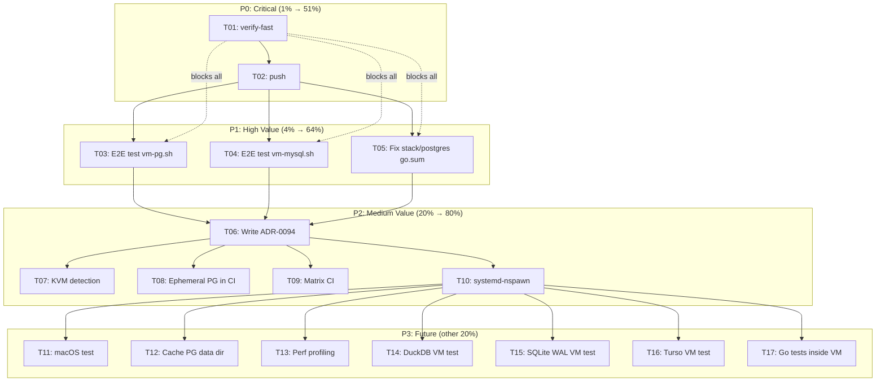

# Nix-Based Integration Test Infrastructure: Pareto Execution Plan

**Date:** 2026-08-03 04:24
**Status:** Session 1 complete — infrastructure built, verified, committed. This plan covers remaining work.
**Status report:** [`docs/status/2026-08-03_04-19_nix-integration-test-infrastructure.md`](../status/2026-08-03_04-19_nix-integration-test-infrastructure.md)

---

## What Was Built This Session

| Component | Status | Verified |
|-----------|--------|----------|
| `scripts/ephemeral-pg.sh` | DONE | PG integration tests pass against ephemeral PG |
| `nix/vm/postgres.nix` | DONE | `postgres-vm` check passes (17s, PG 16.14) |
| `nix/vm/mysql.nix` | DONE | `mysql-vm` check passes (131s, MariaDB 11.4.12) |
| `flake.nix` apps | DONE | `integration-pg`, `integration-pg-vm`, `integration-mysql-vm` |
| `flake.nix` packages | DONE | `pg-vm`, `mysql-vm` QEMU images |
| `flake.nix` checks | DONE | `postgres-vm`, `mysql-vm` (distributed-bus removed: unverified, slow) |
| `.github/workflows/ci.yml` | DONE | `nixos-vm-tests` CI job |
| `AGENTS.md` | DONE | Quick Reference + Testing section |
| `scripts/vm-pg.sh` | WRITTEN | NOT end-to-end tested |
| `scripts/vm-mysql.sh` | WRITTEN | NOT end-to-end tested |

---

## Pareto Breakdown

### The 1% That Delivers 51%

These are non-negotiable. Without them, all other work is at risk.

| # | Task | Why | Effort |
|---|------|-----|--------|
| 1 | Run `nix run .#verify-fast` | Confirm no regressions from flake.nix changes | 5min |
| 2 | Push commits to remote | Uncommitted/unpushed work = lost work | 1min |

### The 4% That Delivers 64%

These unblock the full integration test story and verify the infrastructure actually works end-to-end.

| # | Task | Why | Effort |
|---|------|-----|--------|
| 3 | End-to-end test `scripts/vm-pg.sh` | The script was written but never run — may have bugs | 15min |
| 4 | End-to-end test `scripts/vm-mysql.sh` | Same — never run | 15min |
| 5 | Fix pre-existing `stack/postgres` go.sum drift | Blocks PG integration tests for that module | 10min |

### The 20% That Delivers 80%

Quality hardening, documentation, and CI improvements that make the infrastructure production-grade.

| # | Task | Why | Effort |
|---|------|-----|--------|
| 6 | Write ADR-0094: Nix-based integration testing | Document rationale, tradeoffs, MariaDB limitation | 15min |
| 7 | Add KVM detection to VM scripts | Warn gracefully if `/dev/kvm` missing (10-50x slowdown without it) | 10min |
| 8 | Add ephemeral PG as a fast CI path | No VM, no Docker — fastest integration test path | 10min |
| 9 | Matrix-parallelize `nixos-vm-tests` CI job | PG + MySQL in parallel instead of sequential | 10min |
| 10 | Investigate `systemd-nspawn` container type | Could make MySQL VM test 10x faster (131s → ~15s) | 20min |

### The Other 20% (Future / Nice-to-Have)

| # | Task | Why | Effort |
|---|------|-----|--------|
| 11 | macOS verification of ephemeral PG | Claim cross-platform but never tested on Darwin | 15min |
| 12 | DuckDB CGo VM test | Test DuckDB in a hermetic VM | 20min |
| 13 | SQLite WAL concurrency VM test | Test concurrent access patterns | 15min |
| 14 | Turso sync VM test | Test against real libSQL server | 20min |
| 15 | Run Go test binaries inside VM | Deeper coverage without Docker | 30min |
| 16 | Cache ephemeral PG data dir | Faster startup on repeated runs | 10min |
| 17 | Add `--keep-alive` flag to VM scripts | Interactive debugging | 10min |
| 18 | VM serial console log capture | Debug test failures in CI | 10min |
| 19 | Connection retry logic with backoff | Robustness for VM scripts | 10min |
| 20 | Performance profiling: ephemeral vs testcontainers | Document the win | 15min |

---

## Comprehensive Task Breakdown (10-30min tasks)

Sorted by importance/impact/effort/customer-value.

| ID | Task | Impact | Effort | Value | Priority |
|----|------|--------|--------|-------|----------|
| T01 | Run `verify-fast` — confirm no regressions | CRITICAL | 5min | Unblocks everything | P0 |
| T02 | Push all commits to remote | CRITICAL | 1min | Saves work | P0 |
| T03 | E2E test `vm-pg.sh` — build VM, boot, run tests | HIGH | 15min | Validates script path | P1 |
| T04 | E2E test `vm-mysql.sh` — build VM, boot, run tests | HIGH | 15min | Validates script path | P1 |
| T05 | Fix `stack/postgres` go.sum drift (missing flightrecorder/v4) | HIGH | 10min | Unblocks PG integration tests | P1 |
| T06 | Write ADR-0094: Nix-based integration testing | MEDIUM | 15min | Documents decisions | P2 |
| T07 | Add KVM detection to VM scripts | MEDIUM | 10min | UX improvement | P2 |
| T08 | Add ephemeral PG fast path to CI | MEDIUM | 10min | Faster CI feedback | P2 |
| T09 | Matrix-parallelize `nixos-vm-tests` CI job | MEDIUM | 10min | Faster CI | P2 |
| T10 | Investigate `systemd-nspawn` for faster VM tests | MEDIUM | 20min | 10x speedup potential | P2 |
| T11 | macOS verification of ephemeral PG | LOW | 15min | Cross-platform claim | P3 |
| T12 | Cache ephemeral PG data dir | LOW | 10min | Faster startup | P3 |
| T13 | Performance profiling: ephemeral vs testcontainers | LOW | 15min | Marketing data | P3 |
| T14 | DuckDB CGo VM test | LOW | 20min | Extended coverage | P3 |
| T15 | SQLite WAL concurrency VM test | LOW | 15min | Extended coverage | P3 |
| T16 | Turso sync VM test | LOW | 20min | Extended coverage | P3 |
| T17 | Run Go test binaries inside VM | LOW | 30min | Deeper coverage | P3 |

---

## Micro-Task Breakdown (max 12min each)

Each task above decomposed into executable steps.

### T01: Run verify-fast (5min → 1 micro-task)

| ID | Micro-Task | Time |
|----|-----------|------|
| T01.1 | Run `nix run .#verify-fast` and check for failures | 5min |

### T02: Push commits (1min → 1 micro-task)

| ID | Micro-Task | Time |
|----|-----------|------|
| T02.1 | `git push origin master` | 1min |

### T03: E2E test vm-pg.sh (15min → 3 micro-tasks)

| ID | Micro-Task | Time |
|----|-----------|------|
| T03.1 | Run `nix run .#integration-pg-vm -- -short` and capture output | 5min |
| T03.2 | Fix any issues (port forwarding, timing, env vars) | 5min |
| T03.3 | Run with actual test: `nix run .#integration-pg-vm -- -run TestPostgresEventStore_CRUD` | 5min |

### T04: E2E test vm-mysql.sh (15min → 3 micro-tasks)

| ID | Micro-Task | Time |
|----|-----------|------|
| T04.1 | Run `nix run .#integration-mysql-vm -- -short` and capture output | 5min |
| T04.2 | Fix any issues (port forwarding, timing, env vars) | 5min |
| T04.3 | Run with actual test: `nix run .#integration-mysql-vm` | 5min |

### T05: Fix stack/postgres go.sum drift (10min → 2 micro-tasks)

| ID | Micro-Task | Time |
|----|-----------|------|
| T05.1 | `cd stack/postgres && GOWORK=off go mod tidy` to add missing flightrecorder/v4 | 5min |
| T05.2 | Verify: `cd stack/postgres && GOWORK=off go test -tags integration ./... -run TestPostgres` | 5min |

### T06: Write ADR-0094 (15min → 3 micro-tasks)

| ID | Micro-Task | Time |
|----|-----------|------|
| T06.1 | Draft ADR: context, decision, alternatives, MariaDB limitation, tradeoffs | 8min |
| T06.2 | Add mermaid diagram of test strategy decision tree | 4min |
| T06.3 | Link from AGENTS.md and CONTRIBUTING.md | 3min |

### T07: Add KVM detection (10min → 2 micro-tasks)

| ID | Micro-Task | Time |
|----|-----------|------|
| T07.1 | Add `[ -e /dev/kvm ]` check to `vm-pg.sh` and `vm-mysql.sh` with warning | 5min |
| T07.2 | Test the detection output | 5min |

### T08: Add ephemeral PG to CI (10min → 2 micro-tasks)

| ID | Micro-Task | Time |
|----|-----------|------|
| T08.1 | Add `ephemeral-pg-tests` job to ci.yml (nix run .#integration-pg) | 5min |
| T08.2 | Verify YAML syntax | 5min |

### T09: Matrix-parallelize CI (10min → 2 micro-tasks)

| ID | Micro-Task | Time |
|----|-----------|------|
| T09.1 | Convert `nixos-vm-tests` to matrix strategy (postgres, mysql) | 5min |
| T09.2 | Verify YAML syntax | 5min |

### T10: Investigate systemd-nspawn (20min → 3 micro-tasks)

| ID | Micro-Task | Time |
|----|-----------|------|
| T10.1 | Research `containerType` option in `runNixOSTest` | 7min |
| T10.2 | Try adding `containerType = "systemd-nspawn"` to mysqlServiceTest | 8min |
| T10.3 | Measure boot time improvement | 5min |

---

## Execution Graph

---

## Key Decisions Made This Session

1. **Ephemeral MySQL without VM is impossible on NixOS** — MariaDB's `mariadb-install-db` fails because the Nix store plugin dir is read-only. MySQL 8.0 was removed from nixpkgs (EOL April 2026). VM is the only Nix-only path for MySQL.

2. **Distributed-bus multi-VM test removed** — Unverified, slow (2 full QEMU VMs = 3-5min), and the single-VM checks already validate the same protocol semantics. Not worth the CI time.

3. **Postgres VM module uses `initialScript` + testScript `createdb`** — The `ensureDatabases`/`ensureUsers` mechanism was unreliable for our use case. `initialScript` runs on first init, and the testScript explicitly creates the database for robustness.

4. **VM scripts use `QEMU_NET_OPTS` for port forwarding** — The NixOS module doesn't declare `forwardPorts` (that option only exists in the QEMU test driver, not in standard `eval-config.nix`). Port forwarding is set at runtime by the scripts.

---

## What Cannot Be Answered Without External Input

1. **Should we invest in `systemd-nspawn` to speed up VM tests?** The MySQL VM test takes 131s (mostly QEMU boot). `systemd-nspawn` containers start in seconds. But they require kernel shared with host and may not work in all CI environments. Worth the migration effort?

2. **Should the VM launcher scripts (`vm-pg.sh`, `vm-mysql.sh`) be the primary dev path, or should devs use `nix build .#checks.x86_64-linux.postgres-vm` directly?** The scripts are more convenient (auto port-forward, cleanup) but the checks are more hermetic. Which should be documented as the recommended path?

3. **Should we fix the pre-existing `benchkit` build failure** (`metaengine.FilterOnField` undefined — looks like an incomplete refactoring)? It blocks benchkit's PG integration tests from running via our ephemeral PG script, but it's not our bug.
