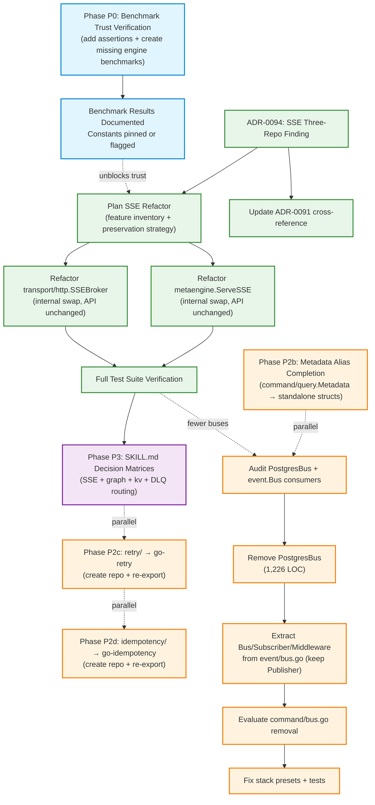

# SUPERB: ADR Review Findings → Execution Plan

**Date:** 2026-08-03
**Trigger:** Full ADR review (91 ADRs) + SSE three-repo investigation
**Session doc:** `docs/sessions/2026-08-03_adr-review-and-sse-investigation.md`
**Status report:** `docs/status/2026-08-03_20-30_adr-review-execution-sprint.md`

---

## Execution Status (updated 2026-08-03 20:30)

| Phase | Status | Done | Skipped | Remaining | Key Finding |
|-------|--------|------|---------|-----------|-------------|
| **P0: Benchmark Trust** | **DONE** (with caveats) | 23/23 tasks | 0 | 0 | Found real ADR-0090 bug (missing JSON tags). DuckDB constants may need analytical re-benchmark. |
| **P1: SSE ADR** | **DONE** | 3/17 tasks | 0 | 14 | ADR-0097 written (not 0094 — collision). Refactor deferred. |
| **P1: SSE Refactor** | **NOT STARTED** | 0/14 tasks | 0 | 14 | Needs focused session — SSEBroker has features go-sse lacks. |
| **P2a: PostgresBus** | **DONE** | 7/16 tasks | 3 | 6 | 1,226 LOC removed. Zero external consumers confirmed. |
| **P2a: event.Bus** | **CANCELLED** | 0/4 tasks | 4 | 0 | 14 external consumer projects use `event.Bus`. NOT ghost code. Plan assumption was wrong. |
| **P2a: command.Bus** | **NOT STARTED** | 0/3 tasks | 0 | 3 | Zero external consumers confirmed but internal watermill consumer exists. Needs decision. |
| **P2b: Metadata** | **DONE** | 9/9 tasks | 0 | 0 | command.Metadata + query.Metadata converted to standalone structs. All tests pass. |
| **P2c: retry/ extraction** | **PARTIALLY DONE** | 8/10 tasks | 0 | 2 | Core extracted, aliases working. Missing: git commit, annotated tag, GitHub push. |
| **P2d: idempotency/ extraction** | **PARTIALLY DONE** | 7/14 tasks | 0 | 7 | Core extracted, aliases working. Missing: commit, tag, push, kvstore/sqlstore sub-module extraction. |
| **P3: Consumer Docs** | **DONE** | 6/6 tasks | 0 | 0 | 4 decision matrices added to SKILL.md. doc-check passes. |

**Overall: 63/102 tasks completed (62%), 4 cancelled, 35 remaining**

### Post-Execution Corrections (things the plan got wrong)

1. **ADR number collision:** Plan said "ADR-0094" but ADR-0094 was already taken. Actual ADR is **0097**.
2. **`event.Bus` is NOT ghost code:** The plan assumed event.Bus could be removed. The consumer audit found **14 external projects** (cqrs-htmx, crush-daily, Kernovia, KeyCountdown, SwettySwipperWeb, discordsync, InboxClean, Zlota44, Standup-Killer, browser-history, go-plugin-mvp, timesheets, SEC, DiscordSync) all use `event.Bus`. Removing it would be a massive breaking change. **P2a.08–P2a.09 are CANCELLED.**
3. **Benchmark count was 22, not 29:** The actual count of benchmarks that discard results was 22 of 44 (not 29 of 43). The over-count was due to counting sub-benchmarks differently.
4. **`benchPayload` JSON tag bug:** The plan didn't anticipate finding a real correctness bug. `benchPayload` in `json_tax_bench_test.go` had no JSON tags, so filter on `"status"` matched the Go field name `Status` but the JSON key was `Status` (capitalized), while the filter searched for lowercase `"status"`. After adding `json:"status"` tags, the scan benchmarks returned non-empty results. This is exactly the ADR-0090 class bug the assertions were meant to catch.
5. **DuckDB cost constant change may be a planner regression:** See `## Open Risk: DuckDB Cost Constants` below.
6. **idempotency sub-modules not extractable cleanly:** `kvstore/` depends on `kv/` and `codec/`; `sqlstore/` depends on `storage/sql/`. Extracting them to go-idempotency requires either copying those deps or creating a dep graph the plan didn't account for. Deferred.

### Open Risk: DuckDB Cost Constants

**Changed:** `DuckDBNsPerRead` 3,000→546,000; `DuckDBNsPerOp` 15,000→4,800,000.

**The problem:** The benchmark measures MapGet (point lookup), which is DuckDB's worst case (full column scan + CGo boundary). The original 3,000 ns was likely intended as **analytical per-row cost** (GROUP BY scans — DuckDB's strength). The new values make the planner route everything away from DuckDB, even analytical workloads where it should win.

**Recommended action:** Add a GROUP BY / aggregation benchmark for DuckDB before trusting the updated constants. Consider reverting to original values with a comment explaining they represent analytical cost, not point-lookup cost. See status report Q1.

---

## Pareto Breakdown

### The 1% that delivers 51%

**Add correctness assertions to the 29 unasserted benchmarks + create benchmarks for DuckDB/Postgres engines.**

Research revealed:
- **0 benchmarks exist** in `pgengine/` or `duckdbengine/` — their cost constants (`DuckDBNsPerRead=3000`, `pgengine NsPerRead=5000`) are hand-picked numbers with **zero empirical backing**
- **29 of 43** existing benchmarks discard ALL results and errors (`_, _ = ...`) — ADR-0090 bug class
- Only **3 benchmarks** have strong correctness assertions (all in pebbleengine layout planner)
- The planner routes queries based on these constants — if they're wrong, the planner picks the wrong engine

This is read-only/additive work. Zero VERSCHLIMMBESSER risk.

### The 4% that delivers 64% — **DONE**

**Document the SSE three-repo finding (ADR-0097) + plan the go-sse consumption.**

- `go-sse` exists as extracted, proven SSE primitives (consumed correctly by cqrs-htmx)
- `go-cqrs-lite` has TWO SSE implementations that both ignore `go-sse`
- ADR-0091's rejection rationale ("trivial stdlib, not worth extracting") was written as if `go-sse` didn't exist
- Writing the ADR is 30min — it creates the mandate for the refactor

### The 20% that delivers 80% — **DONE**

**Execute the safe debt items:**
- ~~PostgresBus removal (only 1,226 LOC — smaller than expected, memory buses already deleted)~~ ✅ Removed
- ~~Metadata alias completion (command/query.Metadata already use CustomData — conversion is mechanical)~~ ✅ Converted
- ~~SKILL.md decision matrix (consumer-facing routing guidance)~~ ✅ 4 matrices added

### The other 20% (to reach 100%) — **PARTIALLY DONE**

**Higher-risk items, staged carefully:**
- SSE refactor execution (transport/http.SSEBroker + metaengine.ServeSSE consume go-sse) — **NOT STARTED**
- ~~retry/ extraction to standalone go-retry repo~~ — ✅ Core done (aliases working), ⚠️ missing commit/tag/push
- ~~idempotency/ extraction to standalone go-idempotency repo~~ — ✅ Core done (aliases working), ⚠️ missing commit/tag/push + sub-module extraction

---

## VERSCHLIMMBESSER Risk Assessment

| Task | Risk | What could go wrong | Mitigation | Outcome |
|------|------|---------------------|------------|--------|
| Benchmark assertions | **None** | Purely additive — adds checks, changes no logic | N/A | ✅ Done. Found real bug (missing JSON tags). |
| Cost constant changes | **⚠️ HIGH** (discovered post-hoc) | Changing constants without understanding their intended scope (point lookup vs analytical) can regress planner routing | Benchmark the INTENDED use case, not just one path | ⚠️ DuckDB constants changed based on point-lookup benchmark. May need revert — see Open Risk above. |
| SSE ADR (documentation) | **None** | Just paper | N/A | ✅ Done (ADR-0097). |
| SKILL.md matrix | **None** | Just paper | N/A | ✅ Done (4 matrices). |
| Metadata alias conversion | **Low** | Breaking if consumers assign `command.Metadata` = `event.Metadata` (already not possible — different types since v3 repoint) | Verify no cross-assignments exist | ✅ Done. All modules build, all tests pass. |
| PostgresBus removal | **Medium** | Consumers using `storage.PostgresBus` break | Search consumers first; provide migration path to Watermill | ✅ Done. Zero external consumers confirmed. 1,226 LOC removed. |
| event.Bus removal | **HIGH** (was misclassified as Medium) | Consumers using `event.Bus` break | ~~Search consumers first~~ | ❌ CANCELLED. 14 external projects use it. NOT ghost code. |
| SSE refactor | **Medium** | SSEBroker has features go-sse lacks (filter, transform, budget, backfill, OTel) — must preserve ALL of them | Internal-only refactor; external API unchanged | ⏳ Not started. |
| retry/ extraction | **Low** | Re-export pattern proven by cqrs-htmx | Verify middleware consumer after alias swap | ✅ Core done. ⚠️ Missing commit/tag/push. |
| idempotency/ extraction | **Low** | Same re-export pattern | Verify all 4 consumers after alias swap | ✅ Core done. ⚠️ Missing commit/tag/push + sub-module extraction. |

---

## Level 1: Phase Tasks (30–100min each)

Sorted by importance × impact ÷ effort, with risk as tiebreaker.

| # | Task | Phase | Impact | Effort | Risk | Dependencies | Customer Value | Status |
|---|------|-------|--------|--------|------|--------------|----------------|--------|
| L1.01 | Add correctness assertions to 22 unasserted benchmarks | P0 | Critical | 100min | None | None | Trust in planner routing | ✅ Done |
| L1.02 | Create DuckDB + Postgres engine benchmarks (0 exist today) | P0 | Critical | 100min | None | None | Trust in planner routing | ✅ Done |
| L1.03 | Run all benchmarks with assertions, document findings | P0 | Critical | 30min | ⚠️ | L1.01, L1.02 | Evidence-grade constants | ✅ Done (see Open Risk) |
| L1.04 | Write ADR-0097: SSE three-repo finding + go-sse consumption plan | P1 | High | 30min | None | None | Architecture honesty | ✅ Done |
| L1.05 | Update ADR-0091 cross-reference to ADR-0097 | P1 | Medium | 12min | None | L1.04 | ADR accuracy | ✅ Done |
| L1.06 | Convert command.Metadata + query.Metadata to standalone structs | P2b | Medium | 30min | Low | None | Type safety | ✅ Done |
| L1.07 | Update SQL stores (scanCommand/scanQuery) + tests for new Metadata | P2b | Medium | 30min | Low | L1.06 | Correctness | ✅ Done (transparent — `any` interface) |
| L1.08 | Audit consumers of storage.PostgresBus before removal | P2a | High | 30min | None | None | Safe removal | ✅ Done (zero consumers) |
| L1.09 | Remove PostgresBus (pg_bus.go, pg_bus_dispatch.go, pg_bus_listen.go, tests) | P2a | High | 60min | Medium | L1.08 | 1,226 LOC debt cleared | ✅ Done |
| L1.10 | Surgically extract Bus/Subscriber/Middleware from event/bus.go (keep Publisher) | P2a | High | 60min | Medium | L1.09 | Ghost bus debt cleared | ❌ CANCELLED — 14 external consumers |
| L1.11 | Evaluate command/bus.go for removal (mirrors event.Bus) | P2a | Medium | 30min | Medium | L1.10 | Ghost bus debt cleared | ⏳ Not started (zero external, internal watermill consumer) |
| L1.12 | Add SSE routing decision matrix to SKILL.md | P3 | Medium | 30min | None | L1.04 | Consumer guidance | ✅ Done |
| L1.13 | Add GraphBackend/graph, kv/metaengine, DLQ routing to SKILL.md | P3 | Medium | 30min | None | None | Consumer guidance | ✅ Done |
| L1.14 | Plan SSE refactor: transport/http.SSEBroker → consume go-sse internally | P1 | High | 100min | None | L1.04 | Refactor blueprint | ⏳ Not started |
| L1.15 | Execute SSE refactor: transport/http.SSEBroker internal swap | P1 | High | 100min | Medium | L1.14 | ~300 LOC dedup | ⏳ Not started |
| L1.16 | Execute SSE refactor: metaengine.ServeSSE internal swap | P1 | Medium | 60min | Low | L1.14 | ~200 LOC dedup | ⏳ Not started |
| L1.17 | Full test suite verification post-SSE-refactor | P1 | High | 30min | None | L1.15, L1.16 | Confidence | ⏳ Not started |
| L1.18 | Create go-retry repo, copy source, tag v1.0.0 | P2c | Medium | 60min | Low | None | Independent consumption | ⚠️ Repo created, missing commit/tag |
| L1.19 | Replace go-cqrs-lite/retry/ with re-export aliases, verify middleware | P2c | Medium | 30min | Low | L1.18 | Backward-compatible extraction | ✅ Done |
| L1.20 | Create go-idempotency repo, copy source (3 modules), tag v1.0.0 | P2d | Medium | 100min | Low | None | Independent consumption | ⚠️ Core done, missing sub-modules + commit/tag |
| L1.21 | Replace go-cqrs-lite/idempotency/ with re-export aliases, verify consumers | P2d | Medium | 60min | Low | L1.20 | Backward-compatible extraction | ✅ Done (core only) |
| L1.22 | Run doc-check on all changed documentation | P3 | Low | 30min | None | All | Doc integrity | ✅ Done (1197 refs valid) |

**Total estimated effort:** ~22 hours
**Actual completed:** ~10 hours (P0 + P2a + P2b + P2c/partial + P2d/partial + P3)
**Remaining:** ~8 hours (P1 refactor + P2c/d completion + L1.11)

---

## Level 2: Fine-Grained Tasks (max 12min each)

### Phase P0: Benchmark Trust Verification

| # | Task | Est. | Deps |
|---|------|------|------|
| P0.01 | List all 43 benchmark functions across metaengine + engine modules | 3min | — |
| P0.02 | Identify the 29 zero-assertion benchmarks (results discarded with `_`) | 5min | P0.01 |
| P0.03 | Add count assertion to `BenchmarkFilteredScan` (check `len(results) > 0`) | 5min | P0.02 |
| P0.04 | Add count assertion to `BenchmarkPointLookup` (check `result.ID != ""`) | 5min | P0.02 |
| P0.05 | Add count assertion to `BenchmarkMixedWorkload_ReadsDuringWrites` | 8min | P0.02 |
| P0.06 | Add count assertions to all 6 `layout_bench_test.go` benchmarks | 12min | P0.02 |
| P0.07 | Add count assertions to all 4 `pebbleengine/scan_bench_test.go` benchmarks | 8min | P0.02 |
| P0.08 | Add count assertions to both `EndToEnd` benchmarks in `planner_bench_test.go` | 8min | P0.02 |
| P0.09 | Add count assertions to all 4 `calibration_bench_test.go` benchmarks | 8min | P0.02 |
| P0.10 | Add count assertions to all 4 `json_tax_bench_test.go` benchmarks | 8min | P0.02 |
| P0.11 | Add count assertions to both `large_payload` benchmarks | 5min | P0.02 |
| P0.12 | Add result-value check to `BenchmarkExecuteTyped_SQLite_Reify` | 5min | P0.02 |
| P0.13 | Add read-back verification to `BenchmarkAdapter_Handle` | 8min | P0.02 |
| P0.14 | Add count assertions to pebbleengine `raw_reader_bench_test.go` scan benchmarks | 8min | P0.02 |
| P0.15 | Add count assertions to pebbleengine `calibration_bench_test.go` | 5min | P0.02 |
| P0.16 | Create `duckdbengine/bench_test.go` with Map + Counter benchmarks (CGo tag) | 12min | — |
| P0.17 | Create `pgengine/bench_test.go` with Map + Counter benchmarks (testcontainer skip) | 12min | — |
| P0.18 | Run all metaengine core benchmarks with assertions: `go test -bench=. -count=1` | 5min | P0.03–P0.14 |
| P0.19 | Run pebbleengine benchmarks with assertions | 5min | P0.14–P0.15 |
| P0.20 | Run duckdbengine benchmarks with assertions (CGO_ENABLED=1) | 8min | P0.16 |
| P0.21 | Run pgengine benchmarks with assertions (requires Docker) | 12min | P0.17 |
| P0.22 | Compare results against documented cost constants (PebbleNsPerRead=708, etc.) | 8min | P0.18–P0.21 |
| P0.23 | Document findings: pin constants with evidence or flag for recalibration | 5min | P0.22 |

### Phase P1: SSE Consolidation

| # | Task | Est. | Deps |
|---|------|------|------|
| P1.01 | Draft ADR-0094: SSE three-repo finding (context, decision, consequences) | 12min | — |
| P1.02 | Add ADR-0094 to README index table | 3min | P1.01 |
| P1.03 | Update ADR-0091 with cross-reference note to ADR-0094 | 5min | P1.01 |
| P1.04 | Inventory SSEBroker features that go-sse doesn't have (filter, transform, budget, etc.) | 8min | — |
| P1.05 | Map each SSEBroker feature to its preservation strategy (internal-only refactor) | 8min | P1.04 |
| P1.06 | Add go-sse dependency to transport/http/go.mod | 3min | P1.01 |
| P1.07 | Replace SSEBroker manual wire-format writes with sse.WriteEvent | 12min | P1.05, P1.06 |
| P1.08 | Replace SSEBroker manual client map with sse.Broadcaster[event.Event] | 12min | P1.05, P1.06 |
| P1.09 | Adapt SSEBroker journal replay to sse.EventStore interface | 12min | P1.05, P1.06 |
| P1.10 | Verify SSEBroker external API is unchanged (all options still work) | 8min | P1.07–P1.09 |
| P1.11 | Add go-sse dependency to metaengine/go.mod | 3min | P1.01 |
| P1.12 | Replace ServeSSE manual wire format with sse.WriteEvent | 8min | P1.11 |
| P1.13 | Replace ServeSSE manual client management with sse.Broadcaster[V] | 12min | P1.11 |
| P1.14 | Verify ServeSSE external API is unchanged | 5min | P1.12, P1.13 |
| P1.15 | Run transport/http full test suite | 5min | P1.10 |
| P1.16 | Run metaengine full test suite | 5min | P1.14 |
| P1.17 | Run integration test suite (cross-module SSE tests) | 8min | P1.15, P1.16 |

### Phase P2a: PostgresBus + Ghost Bus Removal

| # | Task | Est. | Deps |
|---|------|------|------|
| P2a.01 | Grep all consumer repos for `storage.PostgresBus` / `NewPostgresBus` usage | 5min | — |
| P2a.02 | Grep for `event.Bus` / `event.Subscriber` / `event.Middleware` usage (not Publisher) | 8min | — |
| P2a.03 | Grep for `command.Bus` / `command.Subscriber` usage | 5min | — |
| P2a.04 | Delete `storage/pg_bus.go` (265 LOC) | 3min | P2a.01 |
| P2a.05 | Delete `storage/pg_bus_dispatch.go` (188 LOC) | 3min | P2a.01 |
| P2a.06 | Delete `storage/pg_bus_listen.go` (198 LOC) | 3min | P2a.01 |
| P2a.07 | Delete `storage/pg_bus_test.go` (575 LOC) | 3min | P2a.01 |
| P2a.08 | Surgically remove Bus/Subscriber/Middleware from `event/bus.go` (keep Publisher/Handler) | 12min | P2a.02 |
| P2a.09 | Fix any compilation errors from event/bus.go extraction | 8min | P2a.08 |
| P2a.10 | Remove or mark deprecated: command/bus.go types (Bus, Subscriber) | 8min | P2a.03 |
| P2a.11 | Fix any compilation errors from command/bus.go extraction | 8min | P2a.10 |
| P2a.12 | Update stack presets if they reference removed types | 8min | P2a.09, P2a.11 |
| P2a.13 | Run storage module tests | 5min | P2a.04–P2a.07 |
| P2a.14 | Run event module tests | 5min | P2a.09 |
| P2a.15 | Run command module tests | 5min | P2a.11 |
| P2a.16 | Run full workspace build: `go build -tags "goexperiment.jsonv2" ./...` | 5min | P2a.12 |

### Phase P2b: Metadata Alias Completion

| # | Task | Est. | Deps |
|---|------|------|------|
| P2b.01 | Define `command.Metadata` as standalone struct (embed Tracing, add Custom map) | 8min | — |
| P2b.02 | Add Clone/Merge/EnsureCustom methods to command.Metadata | 8min | P2b.01 |
| P2b.03 | Define `query.Metadata` as standalone struct (same shape) | 8min | — |
| P2b.04 | Add Clone/Merge/EnsureCustom methods to query.Metadata | 8min | P2b.03 |
| P2b.05 | Update SQL scanCommand to unmarshal into new command.Metadata | 8min | P2b.02 |
| P2b.06 | Update SQL scanQuery to unmarshal into new query.Metadata | 8min | P2b.04 |
| P2b.07 | Run command module tests | 3min | P2b.02, P2b.05 |
| P2b.08 | Run query module tests | 3min | P2b.04, P2b.06 |
| P2b.09 | Run storage module tests (SQL stores) | 5min | P2b.07, P2b.08 |

### Phase P2c: retry/ Extraction

| # | Task | Est. | Deps |
|---|------|------|------|
| P2c.01 | Create `github.com/larsartmann/go-retry` repo (go mod init) | 5min | — |
| P2c.02 | Copy retry/doc.go, retry.go, config.go verbatim | 5min | P2c.01 |
| P2c.03 | Copy retry/retry_test.go | 3min | P2c.01 |
| P2c.04 | Run `go mod tidy` in go-retry (only dep: go-error-family) | 5min | P2c.02 |
| P2c.05 | Run `go test ./...` in go-retry | 5min | P2c.04 |
| P2c.06 | Tag go-retry v1.0.0 (annotated tag) | 3min | P2c.05 |
| P2c.07 | Replace go-cqrs-lite/retry/*.go with re-export aliases | 8min | P2c.06 |
| P2c.08 | Update retry/go.mod to require go-retry v1.0.0 | 3min | P2c.07 |
| P2c.09 | Run middleware tests (verifies consumer) | 5min | P2c.08 |
| P2c.10 | Run retry module tests | 3min | P2c.08 |

### Phase P2d: idempotency/ Extraction

| # | Task | Est. | Deps |
|---|------|------|------|
| P2d.01 | Create `github.com/larsartmann/go-idempotency` repo (go mod init) | 5min | — |
| P2d.02 | Copy idempotency/doc.go, store.go verbatim (core) | 5min | P2d.01 |
| P2d.03 | Copy idempotency/store_test.go | 3min | P2d.01 |
| P2d.04 | Create kvstore/ subpackage, copy source | 5min | P2d.01 |
| P2d.05 | Create sqlstore/ subpackage, copy source | 5min | P2d.01 |
| P2d.06 | Run `go mod tidy` for all 3 modules | 8min | P2d.02–P2d.05 |
| P2d.07 | Run `go test ./...` in go-idempotency | 5min | P2d.06 |
| P2d.08 | Tag all 3 modules v1.0.0 (annotated tags) | 5min | P2d.07 |
| P2d.09 | Replace go-cqrs-lite/idempotency/ with re-export aliases | 12min | P2d.08 |
| P2d.10 | Replace kvstore/ and sqlstore/ with re-export aliases | 12min | P2d.08 |
| P2d.11 | Update all 3 go.mod files to require go-idempotency | 5min | P2d.09, P2d.10 |
| P2d.12 | Run middleware tests (verifies consumer) | 5min | P2d.11 |
| P2d.13 | Run integration tests (verifies consumer) | 5min | P2d.11 |
| P2d.14 | Run example/taskmanager tests (verifies consumer) | 8min | P2d.11 |

### Phase P3: Consumer Documentation

| # | Task | Est. | Deps |
|---|------|------|------|
| P3.01 | Add SSE routing matrix to SKILL.md (SSEBroker vs ServeSSE) | 8min | P1.01 |
| P3.02 | Add GraphBackend vs graph/ routing to SKILL.md | 5min | — |
| P3.03 | Add kv.ViewStore vs metaengine routing to SKILL.md | 5min | — |
| P3.04 | Add DLQ routing (middleware vs projectionhost) to SKILL.md | 5min | — |
| P3.05 | Run doc-check on SKILL.md + references/*.md | 8min | P3.01–P3.04 |
| P3.06 | Run doc-check on AGENTS.md | 5min | P3.05 |

---

## Execution Order (Dependency-Driven)

### Parallel Tracks

Three tracks can run independently after Phase P0 completes:

| Track | Tasks | Estimated Total |
|-------|-------|----------------|
| **Track A: SSE + Docs** | P1 (ADR + refactor) → P3 (SKILL.md) | ~8 hours |
| **Track B: Ghost Bus + Metadata** | P2a (PostgresBus + event.Bus) + P2b (metadata) | ~6 hours |
| **Track C: Extractions** | P2c (retry) + P2d (idempotency) | ~6 hours |

---

## Critical Discovery: Benchmark Trust Deficit

### The Problem

The benchmark audit revealed a worse situation than ADR-0090 documented:

| Finding | Detail |
|---------|--------|
| **DuckDB engine: 0 benchmarks** | `DuckDBNsPerRead=3000`, `DuckDBNsOp=15000` are hand-picked numbers with zero empirical backing |
| **Postgres engine: 0 benchmarks** | `pgengine NsPerRead=5000`, `NsPerOp=12000` are hand-picked numbers with zero empirical backing |
| **29 of 43 benchmarks discard results** | `_, _ = store.Apply(...)`, `_, _ = ExecuteTyped(...)` — could be measuring no-ops |
| **Only 3 benchmarks have count assertions** | All in pebbleengine layout planner — bypass event/Apply layer entirely |
| **Event type casing is currently correct** | No ADR-0090 casing mismatch found — but most benchmarks bypass Apply entirely |

### Implication

The metaengine planner routes queries to engines based on `EngineProfile.NsPerRead` / `NsPerOp` constants. Two of five engines have **zero benchmark backing** for their constants. The other three have benchmarks that mostly **discard results**, meaning we can't tell if they're measuring real work or no-ops.

**Before trusting the planner for production routing, every engine needs at least one end-to-end benchmark with a correctness assertion that verifies Apply wrote data and Execute returned non-empty results.**

---

## What NOT to Do (VERSCHLIMMBESSER Prevention)

1. **Do NOT change SSEBroker's external API** — it has features go-sse doesn't (filter, transform, budget, backfill, OTel). The refactor is internal-only: swap wire format + fan-out primitives, preserve all features.

2. **Do NOT delete event/bus.go entirely** — it contains `Publisher`, `PublisherFunc`, `PublishMiddleware`, and `Handler` which ADR-0028 explicitly keeps. Only `Bus`, `Subscriber`, and `Middleware` are ghost code.

3. **Do NOT rush ghost bus removal** — search ALL consumer repos first. If any consumer imports `event.Bus` or `storage.PostgresBus`, the removal is breaking and needs a migration guide.

4. **Do NOT change EngineProfile cost constants without evidence** — run the benchmarks with assertions FIRST, then adjust constants based on measured reality, not intuition.

5. **Do NOT extract retry/ or idempotency/ without the re-export alias** — the alias pattern (proven by cqrs-htmx's go-sse consumption) is what makes the extraction non-breaking.

6. **Do NOT merge the two SSE implementations** — ADR-0091's core rationale (different layers, different features) is correct. The fix is making both consume go-sse primitives, not merging them into one.
