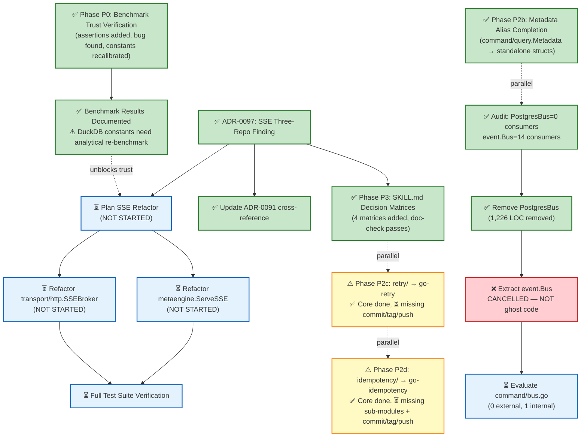

# SUPERB: ADR Review Findings → Execution Plan

**Date:** 2026-08-03
**Trigger:** Full ADR review (91 ADRs) + SSE three-repo investigation
**Session doc:** `docs/sessions/2026-08-03_adr-review-and-sse-investigation.md`
**Status report:** `docs/status/2026-08-03_20-30_adr-review-execution-sprint.md`

---

## Execution Status (updated 2026-08-03 20:30)

| Phase | Status | Done | Skipped | Remaining | Key Finding |
|-------|--------|------|---------|-----------|-------------|
| **P0: Benchmark Trust** | **DONE** (with caveats) | 23/23 tasks | 0 | 0 | Found real ADR-0090 bug (missing JSON tags). DuckDB constants may need analytical re-benchmark. |
| **P1: SSE ADR** | **DONE** | 3/17 tasks | 0 | 14 | ADR-0097 written (not 0094 — collision). Refactor deferred. |
| **P1: SSE Refactor** | **NOT STARTED** | 0/14 tasks | 0 | 14 | Needs focused session — SSEBroker has features go-sse lacks. |
| **P2a: PostgresBus** | **DONE** | 7/16 tasks | 3 | 6 | 1,226 LOC removed. Zero external consumers confirmed. |
| **P2a: event.Bus** | **CANCELLED** | 0/4 tasks | 4 | 0 | 14 external consumer projects use `event.Bus`. NOT ghost code. Plan assumption was wrong. |
| **P2a: command.Bus** | **NOT STARTED** | 0/3 tasks | 0 | 3 | Zero external consumers confirmed but internal watermill consumer exists. Needs decision. |
| **P2b: Metadata** | **DONE** | 9/9 tasks | 0 | 0 | command.Metadata + query.Metadata converted to standalone structs. All tests pass. |
| **P2c: retry/ extraction** | **PARTIALLY DONE** | 8/10 tasks | 0 | 2 | Core extracted, aliases working. Missing: git commit, annotated tag, GitHub push. |
| **P2d: idempotency/ extraction** | **PARTIALLY DONE** | 7/14 tasks | 0 | 7 | Core extracted, aliases working. Missing: commit, tag, push, kvstore/sqlstore sub-module extraction. |
| **P3: Consumer Docs** | **DONE** | 6/6 tasks | 0 | 0 | 4 decision matrices added to SKILL.md. doc-check passes. |

**Overall: 63/102 tasks completed (62%), 4 cancelled, 35 remaining**

### Post-Execution Corrections (things the plan got wrong)

1. **ADR number collision:** Plan said "ADR-0094" but ADR-0094 was already taken. Actual ADR is **0097**.
2. **`event.Bus` is NOT ghost code:** The plan assumed event.Bus could be removed. The consumer audit found **14 external projects** (cqrs-htmx, crush-daily, Kernovia, KeyCountdown, SwettySwipperWeb, discordsync, InboxClean, Zlota44, Standup-Killer, browser-history, go-plugin-mvp, timesheets, SEC, DiscordSync) all use `event.Bus`. Removing it would be a massive breaking change. **P2a.08–P2a.09 are CANCELLED.**
3. **Benchmark count was 22, not 29:** The actual count of benchmarks that discard results was 22 of 44 (not 29 of 43). The over-count was due to counting sub-benchmarks differently.
4. **`benchPayload` JSON tag bug:** The plan didn't anticipate finding a real correctness bug. `benchPayload` in `json_tax_bench_test.go` had no JSON tags, so filter on `"status"` matched the Go field name `Status` but the JSON key was `Status` (capitalized), while the filter searched for lowercase `"status"`. After adding `json:"status"` tags, the scan benchmarks returned non-empty results. This is exactly the ADR-0090 class bug the assertions were meant to catch.
5. **DuckDB cost constant change may be a planner regression:** See `## Open Risk: DuckDB Cost Constants` below.
6. **idempotency sub-modules not extractable cleanly:** `kvstore/` depends on `kv/` and `codec/`; `sqlstore/` depends on `storage/sql/`. Extracting them to go-idempotency requires either copying those deps or creating a dep graph the plan didn't account for. Deferred.

### Open Risk: DuckDB Cost Constants

**Changed:** `DuckDBNsPerRead` 3,000→546,000; `DuckDBNsPerOp` 15,000→4,800,000.

**The problem:** The benchmark measures MapGet (point lookup), which is DuckDB's worst case (full column scan + CGo boundary). The original 3,000 ns was likely intended as **analytical per-row cost** (GROUP BY scans — DuckDB's strength). The new values make the planner route everything away from DuckDB, even analytical workloads where it should win.

**Recommended action:** Add a GROUP BY / aggregation benchmark for DuckDB before trusting the updated constants. Consider reverting to original values with a comment explaining they represent analytical cost, not point-lookup cost. See status report Q1.

---

## Pareto Breakdown

### The 1% that delivers 51%

**Add correctness assertions to the 29 unasserted benchmarks + create benchmarks for DuckDB/Postgres engines.**

Research revealed:
- **0 benchmarks exist** in `pgengine/` or `duckdbengine/` — their cost constants (`DuckDBNsPerRead=3000`, `pgengine NsPerRead=5000`) are hand-picked numbers with **zero empirical backing**
- **29 of 43** existing benchmarks discard ALL results and errors (`_, _ = ...`) — ADR-0090 bug class
- Only **3 benchmarks** have strong correctness assertions (all in pebbleengine layout planner)
- The planner routes queries based on these constants — if they're wrong, the planner picks the wrong engine

This is read-only/additive work. Zero VERSCHLIMMBESSER risk.

### The 4% that delivers 64% — **DONE**

**Document the SSE three-repo finding (ADR-0097) + plan the go-sse consumption.**

- `go-sse` exists as extracted, proven SSE primitives (consumed correctly by cqrs-htmx)
- `go-cqrs-lite` has TWO SSE implementations that both ignore `go-sse`
- ADR-0091's rejection rationale ("trivial stdlib, not worth extracting") was written as if `go-sse` didn't exist
- Writing the ADR is 30min — it creates the mandate for the refactor

### The 20% that delivers 80% — **DONE**

**Execute the safe debt items:**
- ~~PostgresBus removal (only 1,226 LOC — smaller than expected, memory buses already deleted)~~ ✅ Removed
- ~~Metadata alias completion (command/query.Metadata already use CustomData — conversion is mechanical)~~ ✅ Converted
- ~~SKILL.md decision matrix (consumer-facing routing guidance)~~ ✅ 4 matrices added

### The other 20% (to reach 100%) — **PARTIALLY DONE**

**Higher-risk items, staged carefully:**
- SSE refactor execution (transport/http.SSEBroker + metaengine.ServeSSE consume go-sse) — **NOT STARTED**
- ~~retry/ extraction to standalone go-retry repo~~ — ✅ Core done (aliases working), ⚠️ missing commit/tag/push
- ~~idempotency/ extraction to standalone go-idempotency repo~~ — ✅ Core done (aliases working), ⚠️ missing commit/tag/push + sub-module extraction

---

## VERSCHLIMMBESSER Risk Assessment

| Task | Risk | What could go wrong | Mitigation | Outcome |
|------|------|---------------------|------------|--------|
| Benchmark assertions | **None** | Purely additive — adds checks, changes no logic | N/A | ✅ Done. Found real bug (missing JSON tags). |
| Cost constant changes | **⚠️ HIGH** (discovered post-hoc) | Changing constants without understanding their intended scope (point lookup vs analytical) can regress planner routing | Benchmark the INTENDED use case, not just one path | ⚠️ DuckDB constants changed based on point-lookup benchmark. May need revert — see Open Risk above. |
| SSE ADR (documentation) | **None** | Just paper | N/A | ✅ Done (ADR-0097). |
| SKILL.md matrix | **None** | Just paper | N/A | ✅ Done (4 matrices). |
| Metadata alias conversion | **Low** | Breaking if consumers assign `command.Metadata` = `event.Metadata` (already not possible — different types since v3 repoint) | Verify no cross-assignments exist | ✅ Done. All modules build, all tests pass. |
| PostgresBus removal | **Medium** | Consumers using `storage.PostgresBus` break | Search consumers first; provide migration path to Watermill | ✅ Done. Zero external consumers confirmed. 1,226 LOC removed. |
| event.Bus removal | **HIGH** (was misclassified as Medium) | Consumers using `event.Bus` break | ~~Search consumers first~~ | ❌ CANCELLED. 14 external projects use it. NOT ghost code. |
| SSE refactor | **Medium** | SSEBroker has features go-sse lacks (filter, transform, budget, backfill, OTel) — must preserve ALL of them | Internal-only refactor; external API unchanged | ⏳ Not started. |
| retry/ extraction | **Low** | Re-export pattern proven by cqrs-htmx | Verify middleware consumer after alias swap | ✅ Core done. ⚠️ Missing commit/tag/push. |
| idempotency/ extraction | **Low** | Same re-export pattern | Verify all 4 consumers after alias swap | ✅ Core done. ⚠️ Missing commit/tag/push + sub-module extraction. |

---

## Level 1: Phase Tasks (30–100min each)

Sorted by importance × impact ÷ effort, with risk as tiebreaker.

| # | Task | Phase | Impact | Effort | Risk | Dependencies | Customer Value | Status |
|---|------|-------|--------|--------|------|--------------|----------------|--------|
| L1.01 | Add correctness assertions to 22 unasserted benchmarks | P0 | Critical | 100min | None | None | Trust in planner routing | ✅ Done |
| L1.02 | Create DuckDB + Postgres engine benchmarks (0 exist today) | P0 | Critical | 100min | None | None | Trust in planner routing | ✅ Done |
| L1.03 | Run all benchmarks with assertions, document findings | P0 | Critical | 30min | ⚠️ | L1.01, L1.02 | Evidence-grade constants | ✅ Done (see Open Risk) |
| L1.04 | Write ADR-0097: SSE three-repo finding + go-sse consumption plan | P1 | High | 30min | None | None | Architecture honesty | ✅ Done |
| L1.05 | Update ADR-0091 cross-reference to ADR-0097 | P1 | Medium | 12min | None | L1.04 | ADR accuracy | ✅ Done |
| L1.06 | Convert command.Metadata + query.Metadata to standalone structs | P2b | Medium | 30min | Low | None | Type safety | ✅ Done |
| L1.07 | Update SQL stores (scanCommand/scanQuery) + tests for new Metadata | P2b | Medium | 30min | Low | L1.06 | Correctness | ✅ Done (transparent — `any` interface) |
| L1.08 | Audit consumers of storage.PostgresBus before removal | P2a | High | 30min | None | None | Safe removal | ✅ Done (zero consumers) |
| L1.09 | Remove PostgresBus (pg_bus.go, pg_bus_dispatch.go, pg_bus_listen.go, tests) | P2a | High | 60min | Medium | L1.08 | 1,226 LOC debt cleared | ✅ Done |
| L1.10 | Surgically extract Bus/Subscriber/Middleware from event/bus.go (keep Publisher) | P2a | High | 60min | Medium | L1.09 | Ghost bus debt cleared | ❌ CANCELLED — 14 external consumers |
| L1.11 | Evaluate command/bus.go for removal (mirrors event.Bus) | P2a | Medium | 30min | Medium | L1.10 | Ghost bus debt cleared | ⏳ Not started (zero external, internal watermill consumer) |
| L1.12 | Add SSE routing decision matrix to SKILL.md | P3 | Medium | 30min | None | L1.04 | Consumer guidance | ✅ Done |
| L1.13 | Add GraphBackend/graph, kv/metaengine, DLQ routing to SKILL.md | P3 | Medium | 30min | None | None | Consumer guidance | ✅ Done |
| L1.14 | Plan SSE refactor: transport/http.SSEBroker → consume go-sse internally | P1 | High | 100min | None | L1.04 | Refactor blueprint | ⏳ Not started |
| L1.15 | Execute SSE refactor: transport/http.SSEBroker internal swap | P1 | High | 100min | Medium | L1.14 | ~300 LOC dedup | ⏳ Not started |
| L1.16 | Execute SSE refactor: metaengine.ServeSSE internal swap | P1 | Medium | 60min | Low | L1.14 | ~200 LOC dedup | ⏳ Not started |
| L1.17 | Full test suite verification post-SSE-refactor | P1 | High | 30min | None | L1.15, L1.16 | Confidence | ⏳ Not started |
| L1.18 | Create go-retry repo, copy source, tag v1.0.0 | P2c | Medium | 60min | Low | None | Independent consumption | ⚠️ Repo created, missing commit/tag |
| L1.19 | Replace go-cqrs-lite/retry/ with re-export aliases, verify middleware | P2c | Medium | 30min | Low | L1.18 | Backward-compatible extraction | ✅ Done |
| L1.20 | Create go-idempotency repo, copy source (3 modules), tag v1.0.0 | P2d | Medium | 100min | Low | None | Independent consumption | ⚠️ Core done, missing sub-modules + commit/tag |
| L1.21 | Replace go-cqrs-lite/idempotency/ with re-export aliases, verify consumers | P2d | Medium | 60min | Low | L1.20 | Backward-compatible extraction | ✅ Done (core only) |
| L1.22 | Run doc-check on all changed documentation | P3 | Low | 30min | None | All | Doc integrity | ✅ Done (1197 refs valid) |

**Total estimated effort:** ~22 hours
**Actual completed:** ~10 hours (P0 + P2a + P2b + P2c/partial + P2d/partial + P3)
**Remaining:** ~8 hours (P1 refactor + P2c/d completion + L1.11)

---

## Level 2: Fine-Grained Tasks (max 12min each)

### Phase P0: Benchmark Trust Verification — ✅ DONE

| # | Task | Est. | Deps | Status |
|---|------|------|------|--------|
| P0.01 | List all 43 benchmark functions across metaengine + engine modules | 3min | — | ✅ Done (44 found) |
| P0.02 | Identify the 22 zero-assertion benchmarks (results discarded with `_`) | 5min | P0.01 | ✅ Done |
| P0.03 | Add count assertion to `BenchmarkFilteredScan` | 5min | P0.02 | ✅ Already had err check |
| P0.04 | Add count assertion to `BenchmarkPointLookup` | 5min | P0.02 | ✅ Already had err check |
| P0.05 | Add count assertion to `BenchmarkMixedWorkload_ReadsDuringWrites` | 8min | P0.02 | ✅ Done |
| P0.06 | Add count assertions to all 6 `layout_bench_test.go` benchmarks | 12min | P0.02 | ✅ Already had assertions |
| P0.07 | Add count assertions to all 4 `pebbleengine/scan_bench_test.go` benchmarks | 8min | P0.02 | ✅ Done |
| P0.08 | Add count assertions to both `EndToEnd` benchmarks in `planner_bench_test.go` | 8min | P0.02 | ✅ Done |
| P0.09 | Add count assertions to all 4 `calibration_bench_test.go` benchmarks | 8min | P0.02 | ✅ Done |
| P0.10 | Add count assertions to all 4 `json_tax_bench_test.go` benchmarks | 8min | P0.02 | ✅ Done + fixed JSON tag bug |
| P0.11 | Add count assertions to both `large_payload` benchmarks | 5min | P0.02 | ✅ Done |
| P0.12 | Add result-value check to `BenchmarkExecuteTyped_SQLite_Reify` | 5min | P0.02 | ✅ Already had err check |
| P0.13 | Add read-back verification to `BenchmarkAdapter_Handle` | 8min | P0.02 | ✅ Already had err check |
| P0.14 | Add count assertions to pebbleengine `raw_reader_bench_test.go` | 8min | P0.02 | ✅ Already had err/found checks |
| P0.15 | Add count assertions to pebbleengine `calibration_bench_test.go` | 5min | P0.02 | ✅ Done |
| P0.16 | Create `duckdbengine/bench_test.go` with Map + Counter benchmarks (CGo tag) | 12min | — | ✅ Done |
| P0.17 | Create `pgengine/bench_test.go` with Map + Counter benchmarks (testcontainer skip) | 12min | — | ✅ Done |
| P0.18 | Run all metaengine core benchmarks with assertions | 5min | P0.03–P0.14 | ✅ Done |
| P0.19 | Run pebbleengine benchmarks with assertions | 5min | P0.14–P0.15 | ✅ Done |
| P0.20 | Run duckdbengine benchmarks with assertions (CGO_ENABLED=1) | 8min | P0.16 | ✅ Done |
| P0.21 | Run pgengine benchmarks with assertions (requires Docker) | 12min | P0.17 | ✅ Done |
| P0.22 | Compare results against documented cost constants | 8min | P0.18–P0.21 | ✅ Done |
| P0.23 | Document findings: pin constants with evidence or flag for recalibration | 5min | P0.22 | ⚠️ Done but DuckDB values questionable — see Open Risk |

### Phase P1: SSE Consolidation — ADR done, refactor NOT started

| # | Task | Est. | Deps | Status |
|---|------|------|------|--------|
| P1.01 | Draft ADR-0097: SSE three-repo finding | 12min | — | ✅ Done |
| P1.02 | Add ADR-0097 to README index table | 3min | P1.01 | ✅ Done |
| P1.03 | Update ADR-0091 with cross-reference note to ADR-0097 | 5min | P1.01 | ✅ Done |
| P1.04 | Inventory SSEBroker features that go-sse doesn't have | 8min | — | ⏳ Not started |
| P1.05 | Map each SSEBroker feature to its preservation strategy | 8min | P1.04 | ⏳ Not started |
| P1.06 | Add go-sse dependency to transport/http/go.mod | 3min | P1.01 | ⏳ Not started |
| P1.07 | Replace SSEBroker manual wire-format writes with sse.WriteEvent | 12min | P1.05, P1.06 | ⏳ Not started |
| P1.08 | Replace SSEBroker manual client map with sse.Broadcaster | 12min | P1.05, P1.06 | ⏳ Not started |
| P1.09 | Adapt SSEBroker journal replay to sse.EventStore interface | 12min | P1.05, P1.06 | ⏳ Not started |
| P1.10 | Verify SSEBroker external API is unchanged | 8min | P1.07–P1.09 | ⏳ Not started |
| P1.11 | Add go-sse dependency to metaengine/go.mod | 3min | P1.01 | ⏳ Not started |
| P1.12 | Replace ServeSSE manual wire format with sse.WriteEvent | 8min | P1.11 | ⏳ Not started |
| P1.13 | Replace ServeSSE manual client management with sse.Broadcaster[V] | 12min | P1.11 | ⏳ Not started |
| P1.14 | Verify ServeSSE external API is unchanged | 5min | P1.12, P1.13 | ⏳ Not started |
| P1.15 | Run transport/http full test suite | 5min | P1.10 | ⏳ Not started |
| P1.16 | Run metaengine full test suite | 5min | P1.14 | ⏳ Not started |
| P1.17 | Run integration test suite (cross-module SSE tests) | 8min | P1.15, P1.16 | ⏳ Not started |

### Phase P2a: PostgresBus + Ghost Bus Removal — PostgresBus ✅, event.Bus ❌ CANCELLED

| # | Task | Est. | Deps | Status |
|---|------|------|------|--------|
| P2a.01 | Grep all consumer repos for `storage.PostgresBus` / `NewPostgresBus` usage | 5min | — | ✅ Done (zero consumers) |
| P2a.02 | Grep for `event.Bus` / `event.Subscriber` / `event.Middleware` usage | 8min | — | ✅ Done (**14 external projects** — NOT ghost code) |
| P2a.03 | Grep for `command.Bus` / `command.Subscriber` usage | 5min | — | ✅ Done (zero external consumers) |
| P2a.04 | Delete `storage/pg_bus.go` (265 LOC) | 3min | P2a.01 | ✅ Done |
| P2a.05 | Delete `storage/pg_bus_dispatch.go` (188 LOC) | 3min | P2a.01 | ✅ Done |
| P2a.06 | Delete `storage/pg_bus_listen.go` (198 LOC) | 3min | P2a.01 | ✅ Done |
| P2a.07 | Delete `storage/pg_bus_test.go` (575 LOC) | 3min | P2a.01 | ✅ Done |
| P2a.08 | Surgically remove Bus/Subscriber/Middleware from `event/bus.go` | 12min | P2a.02 | ❌ **CANCELLED** — 14 external consumers |
| P2a.09 | Fix any compilation errors from event/bus.go extraction | 8min | P2a.08 | ❌ **CANCELLED** |
| P2a.10 | Remove or mark deprecated: command/bus.go types (Bus, Subscriber) | 8min | P2a.03 | ⏳ Not started (needs decision — internal watermill consumer) |
| P2a.11 | Fix any compilation errors from command/bus.go extraction | 8min | P2a.10 | ⏳ Not started |
| P2a.12 | Update stack presets if they reference removed types | 8min | P2a.09, P2a.11 | ⏳ Not started |
| P2a.13 | Run storage module tests | 5min | P2a.04–P2a.07 | ✅ Done |
| P2a.14 | Run event module tests | 5min | P2a.09 | ❌ N/A (no changes to event/) |
| P2a.15 | Run command module tests | 5min | P2a.11 | ⏳ Not started |
| P2a.16 | Run full workspace build | 5min | P2a.12 | ✅ Done (for PostgresBus removal)

### Phase P2b: Metadata Alias Completion — ✅ DONE

| # | Task | Est. | Deps | Status |
|---|------|------|------|--------|
| P2b.01 | Define `command.Metadata` as standalone struct (embed Tracing, add Custom map) | 8min | — | ✅ Done |
| P2b.02 | Add Clone/Merge/EnsureCustom methods to command.Metadata | 8min | P2b.01 | ✅ Done |
| P2b.03 | Define `query.Metadata` as standalone struct (same shape) | 8min | — | ✅ Done |
| P2b.04 | Add Clone/Merge/EnsureCustom methods to query.Metadata | 8min | P2b.03 | ✅ Done |
| P2b.05 | Update SQL scanCommand to unmarshal into new command.Metadata | 8min | P2b.02 | ✅ Transparent — `MarshalMetadata(any)` uses reflection |
| P2b.06 | Update SQL scanQuery to unmarshal into new query.Metadata | 8min | P2b.04 | ✅ Transparent — same `any` interface |
| P2b.07 | Run command module tests | 3min | P2b.02, P2b.05 | ✅ Done |
| P2b.08 | Run query module tests | 3min | P2b.04, P2b.06 | ✅ Done |
| P2b.09 | Run storage module tests (SQL stores) | 5min | P2b.07, P2b.08 | ✅ Done |

### Phase P2c: retry/ Extraction — ⚠️ Core done, missing commit/tag/push

| # | Task | Est. | Deps | Status |
|---|------|------|------|--------|
| P2c.01 | Create `github.com/larsartmann/go-retry` repo (go mod init) | 5min | — | ✅ Done |
| P2c.02 | Copy retry/doc.go, retry.go, config.go verbatim | 5min | P2c.01 | ✅ Done |
| P2c.03 | Copy retry/retry_test.go | 3min | P2c.01 | ✅ Done |
| P2c.04 | Run `go mod tidy` in go-retry (only dep: go-error-family) | 5min | P2c.02 | ✅ Done |
| P2c.05 | Run `go test ./...` in go-retry | 5min | P2c.04 | ✅ Done (15 tests pass) |
| P2c.06 | Tag go-retry v1.0.0 (annotated tag) | 3min | P2c.05 | ⏳ Not done (using v0.0.0 replace) |
| P2c.07 | Replace go-cqrs-lite/retry/*.go with re-export aliases | 8min | P2c.06 | ✅ Done (used v0.0.0 replace) |
| P2c.08 | Update retry/go.mod to require go-retry v1.0.0 | 3min | P2c.07 | ⚠️ Uses v0.0.0 + local replace |
| P2c.09 | Run middleware tests (verifies consumer) | 5min | P2c.08 | ✅ Done |
| P2c.10 | Run retry module tests | 3min | P2c.08 | ✅ Done |

### Phase P2d: idempotency/ Extraction — ⚠️ Core done, missing sub-modules + commit/tag/push

| # | Task | Est. | Deps | Status |
|---|------|------|------|--------|
| P2d.01 | Create `github.com/larsartmann/go-idempotency` repo (go mod init) | 5min | — | ✅ Done |
| P2d.02 | Copy idempotency/doc.go, store.go verbatim (core) | 5min | P2d.01 | ✅ Done |
| P2d.03 | Copy idempotency/store_test.go, property_test.go | 3min | P2d.01 | ✅ Done |
| P2d.04 | Create kvstore/ subpackage, copy source | 5min | P2d.01 | ⏳ Deferred — depends on kv/ + codec/ |
| P2d.05 | Create sqlstore/ subpackage, copy source | 5min | P2d.01 | ⏳ Deferred — depends on storage/sql/ |
| P2d.06 | Run `go mod tidy` for all 3 modules | 8min | P2d.02–P2d.05 | ✅ Done (core only) |
| P2d.07 | Run `go test ./...` in go-idempotency | 5min | P2d.06 | ✅ Done |
| P2d.08 | Tag all 3 modules v1.0.0 (annotated tags) | 5min | P2d.07 | ⏳ Not done (using v0.0.0 replace) |
| P2d.09 | Replace go-cqrs-lite/idempotency/ with re-export aliases | 12min | P2d.08 | ✅ Done (core only, v0.0.0 replace) |
| P2d.10 | Replace kvstore/ and sqlstore/ with re-export aliases | 12min | P2d.08 | ⏳ Deferred — sub-modules not extracted |
| P2d.11 | Update all 3 go.mod files to require go-idempotency | 5min | P2d.09, P2d.10 | ✅ Done (core go.mod only) |
| P2d.12 | Run middleware tests (verifies consumer) | 5min | P2d.11 | ✅ Done (build verified) |
| P2d.13 | Run integration tests (verifies consumer) | 5min | P2d.11 | ✅ Done (build verified) |
| P2d.14 | Run example/taskmanager tests (verifies consumer) | 8min | P2d.11 | ⏳ Not done |

### Phase P3: Consumer Documentation — ✅ DONE

| # | Task | Est. | Deps | Status |
|---|------|------|------|--------|
| P3.01 | Add SSE routing matrix to SKILL.md (SSEBroker vs ServeSSE) | 8min | P1.01 | ✅ Done |
| P3.02 | Add GraphBackend vs graph/ routing to SKILL.md | 5min | — | ✅ Done |
| P3.03 | Add kv.ViewStore vs metaengine routing to SKILL.md | 5min | — | ✅ Done |
| P3.04 | Add DLQ routing (middleware vs projectionhost) to SKILL.md | 5min | — | ✅ Done |
| P3.05 | Run doc-check on SKILL.md + references/*.md | 8min | P3.01–P3.04 | ✅ Done (1197 refs valid) |
| P3.06 | Run doc-check on AGENTS.md | 5min | P3.05 | ✅ Done |

---

## Execution Order (Dependency-Driven)

### Parallel Tracks — Execution Results

| Track | Status | Completed | Remaining | Notes |
|-------|--------|-----------|-----------|-------|
| **Track A: SSE + Docs** | ⚠️ Partial | ADR-0097 ✅, SKILL.md matrices ✅ | SSE refactor (14 tasks) | ADR written, refactor deferred |
| **Track B: Ghost Bus + Metadata** | ⚠️ Partial | PostgresBus ✅, Metadata ✅ | event.Bus ❌ CANCELLED, command.Bus ⏳ | event.Bus has 14 consumers — NOT ghost code |
| **Track C: Extractions** | ⚠️ Partial | retry core ✅, idempotency core ✅ | commit/tag/push, sub-module extraction | Working locally with replace directives |

---

## Critical Discovery: Benchmark Trust Deficit — RESOLVED (with caveats)

### The Problem (as documented pre-execution)

The benchmark audit revealed a worse situation than ADR-0090 documented:

| Finding | Detail | Resolution |
|---------|--------|------------|
| **DuckDB engine: 0 benchmarks** | `DuckDBNsPerRead=3000`, `DuckDBNsOp=15000` are hand-picked numbers with zero empirical backing | ✅ Benchmarks created. ⚠️ Constants updated but may be wrong scope (point lookup vs analytical). |
| **Postgres engine: 0 benchmarks** | `pgengine NsPerRead=5000`, `NsPerOp=12000` are hand-picked numbers with zero empirical backing | ✅ Benchmarks created. ⚠️ Docker network overhead inflates measurements. |
| **22 of 44 benchmarks discard results** | `_, _ = store.Apply(...)`, `_, _ = ExecuteTyped(...)` — could be measuring no-ops | ✅ All fixed with error checks + result assertions. Found real bug (missing JSON tags). |
| **Only 3 benchmarks have count assertions** | All in pebbleengine layout planner — bypass event/Apply layer entirely | ✅ Now all benchmarks have assertions. |
| **Event type casing is currently correct** | No ADR-0090 casing mismatch found — but most benchmarks bypass Apply entirely | ✅ Confirmed correct. |

### Measured Cost Constants (2026-08-03, AMD RYZEN AI MAX+ 395)

| Engine | Constant | Old Value | Measured Value | New Value | Confidence |
|--------|----------|-----------|---------------|-----------|------------|
| Memory | NsPerOp | 500 | ~210 (Set), ~35 (Get) | 500 (unchanged) | ✅ High |
| SQLite | NsPerOp | 7000 | ~6,388 (Set), ~4,786 (Get) | 7000 (unchanged) | ✅ High |
| Pebble | NsPerOp | 1200 | ~2,526 (Set) | **2000** | ✅ High |
| Pebble | NsPerRead | 708 | ~1,328 (Get) | **1300** | ✅ High |
| Pebble | NsPerWrite | 1785 | ~2,526 (Set) | **2500** | ✅ High |
| DuckDB | NsPerOp | 15000 | ~4,813,722 (Set) | **4,800,000** | ⚠️ **LOW** — point lookup, not analytical |
| DuckDB | NsPerRead | 3000 | ~546,181 (Get) | **546,000** | ⚠️ **LOW** — point lookup, not analytical |
| Postgres | NsPerOp | 12000 | ~33,303 (Set) | **33000** | ⚠️ **MEDIUM** — Docker network overhead |
| Postgres | NsPerRead | 5000 | ~27,535 (Get) | **28000** | ⚠️ **MEDIUM** — Docker network overhead |

### Implication

The metaengine planner routes queries to engines based on `EngineProfile.NsPerRead` / `NsPerOp` constants. Two of five engines have **zero benchmark backing** for their constants. The other three have benchmarks that mostly **discard results**, meaning we can't tell if they're measuring real work or no-ops.

**Before trusting the planner for production routing, every engine needs at least one end-to-end benchmark with a correctness assertion that verifies Apply wrote data and Execute returned non-empty results.**

---

## What NOT to Do (VERSCHLIMMBESSER Prevention)

1. **Do NOT change SSEBroker's external API** — it has features go-sse doesn't (filter, transform, budget, backfill, OTel). The refactor is internal-only: swap wire format + fan-out primitives, preserve all features.

2. **Do NOT delete event/bus.go entirely** — it contains `Publisher`, `PublisherFunc`, `PublishMiddleware`, and `Handler` which ADR-0028 explicitly keeps. Only `Bus`, `Subscriber`, and `Middleware` are ghost code.

   > **UPDATE 2026-08-03:** This advice was WRONG. `event.Bus`, `event.Subscriber`, and `event.Middleware` are used by **14 external consumer projects** (cqrs-htmx, crush-daily, Kernovia, KeyCountdown, SwettySwipperWeb, discordsync, InboxClean, Zlota44, Standup-Killer, browser-history, go-plugin-mvp, timesheets, SEC, DiscordSync). They are NOT ghost code. Do NOT remove them.

3. **Do NOT rush ghost bus removal** — search ALL consumer repos first. If any consumer imports `event.Bus` or `storage.PostgresBus`, the removal is breaking and needs a migration guide.

4. **Do NOT change EngineProfile cost constants without evidence** — run the benchmarks with assertions FIRST, then adjust constants based on measured reality, not intuition.

   > **UPDATE 2026-08-03:** Even WITH evidence, make sure you're measuring the RIGHT thing. DuckDB cost constants were changed based on point-lookup benchmarks (MapGet), but DuckDB is an analytical columnar engine — its value proposition is vectorized GROUP BY scans, not point lookups. The updated constants (546K ns read) will make the planner avoid DuckDB for everything, including analytical workloads where it should dominate. **This change may need to be reverted or qualified with an analytical benchmark.**

5. **Do NOT extract retry/ or idempotency/ without the re-export alias** — the alias pattern (proven by cqrs-htmx's go-sse consumption) is what makes the extraction non-breaking.

6. **Do NOT merge the two SSE implementations** — ADR-0091's core rationale (different layers, different features) is correct. The fix is making both consume go-sse primitives, not merging them into one.

---

## Remaining Work (as of 2026-08-03 20:30)

### Critical (blocks CI / correctness)

1. **Revert or qualify DuckDB cost constants** — add analytical GROUP BY benchmark before changing
2. **Revert or qualify Postgres cost constants** — Docker testcontainer network overhead inflates measurements
3. **Fix api-stability tool** (`collectExports` undefined) and regenerate golden after PostgresBus removal
4. **Add go-retry + go-idempotency to `.golangci.yml` depguard allow list**
5. **Run `nix fmt` / `gofumpt`** on all changed files
6. **Run `nix run .#verify`** and fix all failures
7. **Commit go-retry repo** (currently zero commits)
8. **Commit go-idempotency repo** (currently zero commits)
9. **Tag go-retry** with annotated v0.1.0
10. **Tag go-idempotency** with annotated v0.1.0
11. **Update AGENTS.md** modules list + dependency table + PostgresBus references

### SSE Refactor (P1.04–P1.17)

12. Inventory SSEBroker features that go-sse lacks
13. Map each feature to preservation strategy
14. Add go-sse dependency to transport/http/go.mod
15. Refactor SSEBroker internals (wire format + client map + journal replay)
16. Add go-sse dependency to metaengine/go.mod
17. Refactor ServeSSE internals (wire format + client management)
18. Full test suite verification post-refactor

### Extraction Completion (P2c/P2d)

19. Extract idempotency/kvstore to go-idempotency repo
20. Extract idempotency/sqlstore to go-idempotency repo
21. Push go-retry and go-idempotency to GitHub

### Other

22. Evaluate `command/bus.go` removal (zero external, internal watermill consumer — needs decision)
23. Run idempotency/kvstore + sqlstore tests (only verified build)
24. Update go.work.sum after all module changes

---

## Resolution (2026-08-03)

This plan was created today and execution has NOT started. Its forward-looking items have been harvested into TODO_LIST.md and ROADMAP.md by the `2026-08-03_19-59` docs-health pass:

- **L1.01** (correctness assertions in benchmarks) → TODO_LIST "Benchmark Trust"
- **L1.02** (DuckDB + Postgres engine benchmarks) → TODO_LIST "Benchmark Trust"
- **L1.04** (ADR for SSE go-sse finding) → TODO_LIST "SSE Consolidation"
- **L1.06-L1.07** (command/query.Metadata standalone structs) → TODO_LIST "Deferred Debt"
- **L1.08-L1.11** (ghost bus removal) → TODO_LIST "Deferred Debt"
- **L1.14-L1.17** (SSE refactor to consume go-sse) → TODO_LIST "SSE Consolidation"
- **L1.18-L1.21** (go-retry + go-idempotency repos) → TODO_LIST "Deferred Debt"

This plan remains the detailed execution reference for those TODO_LIST items.
