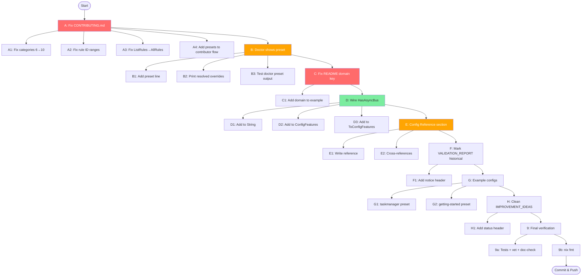

# .cqrs-lint.json Design Review — Polish & Complete

> **Date:** 2026-08-04 05:23
> **Status:** Planning → Execution
> **Risk level:** LOW — all changes are additive docs/UX fixes, zero config-format changes

---

## Context

The previous session unified the split-brain preset system (single `PresetDefinitions`
source of truth, programmatic `init`, preset/rule validation). This session polishes
the remaining gaps: stale developer docs, invisible preset resolution in `doctor`,
a dead feature flag (`HasAsyncBus`), and incomplete consumer-facing documentation.

**Verschlimmbessern guardrail:** every change is additive or documentation-only.
No config keys are renamed, removed, or change semantics. No backward compatibility breaks.

---

## Pareto Analysis

### The 1% that delivers 51%

| # | Task | Why it's #1 |
|---|------|-------------|
| A | **Fix CONTRIBUTING.md** — says 6 categories (actual 10), wrong rule ID ranges (C001-C012 actual C001-C039). Every new contributor reads this first and is misled. | Actively harmful right now |
| B | **Doctor shows active preset** — `{"preset":"library"}` is invisible in `cqrs-lint doctor`. Users can't see what the preset resolved to. | Core UX gap in the primary diagnostic command |
| C | **Fix README config example** — missing `domain` key in the override example, even though domain is a first-class configurable feature with severity escalation. | Consumer can't discover a real feature |

### The 4% that delivers 64% (cumulative with above)

| # | Task | Why it matters |
|---|------|----------------|
| D | **Wire HasAsyncBus** into `String()` + `ConfigFeatures` + `ToConfigFeatures()` — currently detected but invisible and non-configurable. | Dead code or missing feature — pick one |
| E | **Add "Configuration Reference" to README** — single section listing every config key with type, default, and example. Currently scattered across 4 source files. | Consumer discoverability |
| F | **Mark VALIDATION_REPORT.md as historical** — says 78 rules / 8 categories, actual is 185+ / 10. | Prevents confusion |

### The remaining ~20% to reach 100%

| # | Task | Why |
|---|------|-----|
| G | **Add example .cqrs-lint.json to example projects** — show consumers best practices for each project type | Consumer onboarding |
| H | **Clean up IMPROVEMENT_IDEAS.md** — mark done items, note which are config-related | Reduces noise for future work |

---

## Execution Plan — Level 1 (tasks 30-100min each)

| Order | Task | Impact | Effort | Risk | Est |
|-------|------|--------|--------|------|-----|
| 1 | A: Fix CONTRIBUTING.md (6→10 categories, rule ID ranges, architecture tree) | Critical | 20min | None | 20min |
| 2 | B: Doctor shows active preset + resolved overrides | High | 30min | None (additive) | 30min |
| 3 | C: Fix README config example (add `domain` key) | High | 5min | None | 5min |
| 4 | D: Wire HasAsyncBus into doctor output + ConfigFeatures | Medium | 20min | None (additive) | 20min |
| 5 | E: Add Configuration Reference section to README | High | 30min | None | 30min |
| 6 | F: Mark VALIDATION_REPORT.md as historical snapshot | Low | 5min | None | 5min |
| 7 | G: Add example .cqrs-lint.json to example/ projects | Medium | 15min | None | 15min |
| 8 | H: Clean IMPROVEMENT_IDEAS.md (mark done items) | Low | 15min | None | 15min |
| 9 | Final: Run tests, vet, doc-check, api-stability | Critical | 10min | — | 10min |

**Total estimated: ~2.5h**

---

## Execution Plan — Level 2 (tasks max 12min each)

### Task A: Fix CONTRIBUTING.md (4 subtasks)

| # | Subtask | Est |
|---|---------|-----|
| A1 | Fix categories table: 6→10 rows (add performance, version, testing, adoption) | 5min |
| A2 | Fix rule ID ranges in architecture tree (C001-C039, A001-A033, B001-B028, D001-D017, E001-E017, S001-S011, P001-P013, V001-V006, T001-T008, F001-F021) | 5min |
| A3 | Fix `ListRules()` reference → `AllRules()` (the actual function name) | 2min |
| A4 | Add presets + config validation to the CONTRIBUTING flow (mention `PresetDefinitions` map) | 5min |

### Task B: Doctor shows active preset (3 subtasks)

| # | Subtask | Est |
|---|---------|-----|
| B1 | Add "preset:" line to doctor output (show active preset name or "(none)") | 5min |
| B2 | When preset is active, print resolved features + disabled rules from `ResolvePresetDefinition` | 10min |
| B3 | Add test for doctor preset output | 10min |

### Task C: Fix README config example (1 subtask)

| # | Subtask | Est |
|---|---------|-----|
| C1 | Add `"domain": "financial"` to the features override example + mention domain escalation | 5min |

### Task D: Wire HasAsyncBus (3 subtasks)

| # | Subtask | Est |
|---|---------|-----|
| D1 | Add `HasAsyncBus` to `FeatureProfile.String()` output | 3min |
| D2 | Add `AsyncBus *bool` to `ConfigFeatures` + wire in `ResolveFeatureProfile` + `mergeConfigFeatures` | 8min |
| D3 | Add `HasAsyncBus` to `ToConfigFeatures()` when true | 3min |

### Task E: Configuration Reference section (2 subtasks)

| # | Subtask | Est |
|---|---------|-----|
| E1 | Write the Configuration Reference section (all top-level keys, all features keys, all rules keys, health key) | 20min |
| E2 | Add inline cross-references from the presets table and feature-profiles section | 10min |

### Task F: VALIDATION_REPORT.md (1 subtask)

| # | Subtask | Est |
|---|---------|-----|
| F1 | Add historical-notice header + link to CHANGELOG for current state | 5min |

### Task G: Example configs (2 subtasks)

| # | Subtask | Est |
|---|---------|-----|
| G1 | Add `.cqrs-lint.json` to `example/taskmanager/` with `{"preset":"production"}` | 5min |
| G2 | Add `.cqrs-lint.json` to `example/getting-started/` with `{"preset":"local-cli"}` | 5min |

### Task H: IMPROVEMENT_IDEAS.md (1 subtask)

| # | Subtask | Est |
|---|---------|-----|
| H1 | Add status header noting which items are done, link to CHANGELOG | 10min |

### Task 9: Final verification (2 subtasks)

| # | Subtask | Est |
|---|---------|-----|
| 9a | Run full test suite + go vet + doc-check + api-stability | 8min |
| 9b | Run `nix fmt` on changed files | 2min |

---

## Mermaid Execution Graph

---

## What This Plan Does NOT Do (Verschlimmbessern Prevention)

- ❌ Does NOT rename any config keys
- ❌ Does NOT change any default values
- ❌ Does NOT add new dependencies
- ❌ Does NOT restructure any packages
- ❌ Does NOT change the config file format
- ❌ Does NOT remove any exported symbols
- ❌ Does NOT add a JSON schema file (YAGNI — runtime validation already catches typos)
