# C038 Enhancement + C040: Event Type Mismatch Detection

> **Date:** 2026-08-04 05:54
> **Status:** COMPLETE
> **Scope:** Enhance existing C038 (event-type-typo) + create C040 (dead-fold-case)

---

## Problem Statement

Rule #135 from the lint backlog: "If a fold function handles `UserCreated` but the emit code uses `user.created`, the event is silently ignored. Cross-reference fold switch cases with `event.New` type strings."

**Discovery:** C038 (`event-type-typo`) already implements ~80% of this. It cross-references emitted event types against fold case strings using Levenshtein distance with lowercasing. The remaining 20% is split across two gaps:

1. **C038 misses multi-separator case-format mismatches** — `"user.profile.updated"` vs `"UserProfileUpdated"` has edit distance 3 (three dot deletions), exceeding C038's threshold of 2.
2. **No reverse-direction detection** — C038 only checks "emitted type not in fold cases." It doesn't detect dead fold cases that handle event types nobody ever emits.

---

## Pareto Breakdown

### The 1% that delivers 51%

**Add case/separator normalization to C038's matching algorithm.** A `normalizeEventType()` function that lowercases and strips `.`, `_`, `-` separators catches the entire class of case-format mismatches regardless of string length. This is the single highest-impact change — it transforms C038 from "catches typos within distance 2" to "catches all naming-convention mismatches."

Example it newly catches: `"user_profile_was_updated"` vs `"UserProfileWasUpdated"` (distance 4 without normalization, 0 with).

### The 4% that delivers 64%

**Create C040 for dead fold case detection (reverse direction).** C038 catches "emitted but not handled." C040 catches "handled but never emitted" — a completely different bug class. Dead fold cases are either leftover from a renamed event, or the fold case itself has a typo in the OTHER direction.

### The 20% for 80%

The above two changes + comprehensive tests for both rules.

### Remaining 20% (to reach 100%)

Catalog metadata, registration, meta-test count bump, build verification, planning documentation.

---

## Gap Analysis: C038 Current State

| Capability                                         | C038 Today       | After Enhancement | C040 (New) |
| -------------------------------------------------- | ---------------- | ----------------- | ---------- |
| Levenshtein typo detection (distance ≤ 2)          | Yes              | Yes               | —          |
| Case-insensitive comparison                        | Yes (lowercases) | Yes               | —          |
| Separator normalization (`.`, `_`, `-`)            | **No**           | **Yes**           | —          |
| Reports at emission site                           | Yes              | Yes               | —          |
| Reports at fold case site                          | No               | No                | **Yes**    |
| Dead fold case detection (reverse direction)       | No               | No                | **Yes**    |
| Suppresses when near-miss handled by other rule    | —                | —                 | **Yes**    |
| Suppresses when no emissions (cross-module safety) | Yes              | Yes               | **Yes**    |

---

## Design Decisions

### D1: Enhance C038 in-place (no new rule for normalization)

Normalization is a direct algorithm improvement to the existing typo detection. It doesn't change C038's semantics — it still detects "emitted type has a typo." It just catches more typos. Adding a separate rule would fragment the concern.

### D2: C040 is a separate rule (not a C038 mode)

C038's concern: "emitted type is a typo → fold doesn't handle it" (emit → fold direction, **data corruption**).

C040's concern: "fold handles a type that nobody emits" (fold → emit direction, **dead code**).

These are conceptually different bugs with different severities. C038 is `SeverityError` (silent data loss). C040 is `SeverityWarning` (dead code, lower urgency). Keeping them separate follows the single-responsibility pattern of all existing rules.

### D3: C040 defers to C038 for near-miss cases

If fold case `"UserCreated"` has a near-miss in the emit set (e.g., `"user.created"`), C038 already catches the mismatch from the emit side. C040 only fires when the fold case has NO near-miss — avoiding double-reporting.

### D4: No StrictApply suppression

Initially considered suppressing findings when the fold is wrapped in `decider.StrictApply`. Dropped because:

- C038 findings at the emission site are still bugs regardless of fold-side protection
- C040 detects dead code, which StrictApply doesn't address (StrictApply checks the knownTypes list, not the switch cases)
- Adding suppression adds complexity without clear value

### D5: Share helpers within the `correctness` package

C040 reuses C038's `nearestMatch`, `editDistance`, `normalizeEventType` (all package-private). No extraction to a shared file needed — both rules live in `package correctness`. C040 adds its own `collectFoldCasesWithPos` (needs position info for reporting at the case clause).

---

## Implementation Plan

### Files to Modify/Create

| File                                               | Action                                                   | Lines Changed |
| -------------------------------------------------- | -------------------------------------------------------- | ------------- |
| `cmd/cqrs-lint/pkg/rules/correctness/c038.go`      | Modify: add `normalizeEventType`, enhance `nearestMatch` | ~15           |
| `cmd/cqrs-lint/pkg/rules/correctness/c040.go`      | **Create**: dead fold case detector                      | ~120          |
| `cmd/cqrs-lint/pkg/rules/correctness/c040_test.go` | **Create**: test suite                                   | ~100          |
| `cmd/cqrs-lint/pkg/rules/correctness/c038_test.go` | Modify: add normalization test                           | ~25           |
| `cmd/cqrs-lint/pkg/rules/register.go`              | Modify: add C040 registration                            | 1             |
| `cmd/cqrs-lint/pkg/rules/catalog.go`               | Modify: add C040 RuleInfo                                | 8             |
| `cmd/cqrs-lint/pkg/rules/meta_test.go`             | Modify: bump 185 → 186                                   | 1             |

---

## Execution Graph

```mermaid
graph TD
    A[Phase 1: C038 Enhancement] --> B[Phase 2: C040 Implementation]
    B --> C[Phase 3: Wiring]
    C --> D[Phase 4: Tests]
    D --> E[Phase 5: Verification]
    E --> F[Phase 6: Commit & Push]

    subgraph "Phase 1: C038 Enhancement ~20min"
        A1[Add normalizeEventType function] --> A2[Enhance nearestMatch with normalization pre-check]
        A2 --> A3[Add C038 normalization test]
    end

    subgraph "Phase 2: C040 Implementation ~30min"
        B1[Create c040.go skeleton] --> B2[Implement collectFoldCasesWithPos]
        B2 --> B3[Implement dead-case detection logic]
        B3 --> B4[Build findings with positions]
    end

    subgraph "Phase 3: Wiring ~10min"
        C1[Register in register.go] --> C2[Add catalog entry]
        C2 --> C3[Bump meta_test count]
    end

    subgraph "Phase 4: Tests ~25min"
        D1[C040: dead case fires] --> D2[C040: no firing on match]
        D2 --> D3[C040: no firing on near-miss]
        D3 --> D4[C040: no firing without emissions]
        D4 --> D5[C038: normalization regression]
    end

    subgraph "Phase 5: Verification ~15min"
        E1[go build ./...] --> E2[go test ./correctness/...]
        E2 --> E3[go test ./... full suite]
        E3 --> E4[meta_test count check]
    end

    subgraph "Phase 6: Commit ~10min"
        F1[Update planning doc status] --> F2[git commit] --> F3[git push]
    end
```



---

## Task Breakdown — Level 1 (30-100min tasks)

| #   | Task                                 | Impact | Effort         | Customer Value                                            | Priority |
| --- | ------------------------------------ | ------ | -------------- | --------------------------------------------------------- | -------- |
| T1  | Enhance C038 with normalization      | HIGH   | LOW (20min)    | Catches all case-format mismatches, not just distance ≤ 2 | **P0**   |
| T2  | Implement C040 detector              | HIGH   | MEDIUM (30min) | New capability: dead fold case detection                  | **P0**   |
| T3  | Wire C040 into linter infrastructure | MEDIUM | LOW (10min)    | Makes C040 discoverable and active                        | **P1**   |
| T4  | C038 normalization tests             | MEDIUM | LOW (15min)    | Regression protection for normalization                   | **P1**   |
| T5  | C040 test suite                      | HIGH   | MEDIUM (25min) | Validates detection + false-positive suppression          | **P1**   |
| T6  | Build + test verification            | HIGH   | LOW (15min)    | Ensures no regressions                                    | **P0**   |
| T7  | Planning doc + commit                | LOW    | LOW (10min)    | Documentation + version control                           | **P2**   |

---

## Task Breakdown — Level 2 (max 12min tasks)

| #   | Task                                                | Parent | Time  | Details                                                |
| --- | --------------------------------------------------- | ------ | ----- | ------------------------------------------------------ |
| S1  | Add `normalizeEventType()` to c038.go               | T1     | 5min  | lowercase + strip `.`, `_`, `-`                        |
| S2  | Enhance `nearestMatch` with normalization pre-check | T1     | 7min  | Check `normalize(a)==normalize(b)` → distance 0        |
| S3  | Add C038 normalization test (multi-separator)       | T1/T4  | 5min  | `"user_profile.updated"` vs `"UserProfileUpdated"`     |
| S4  | Create c040.go: package, imports, constructor       | T2     | 5min  | Skeleton matching C038 structure                       |
| S5  | Implement `collectFoldCasesWithPos()`               | T2     | 10min | Walk folds, collect case strings + positions           |
| S6  | Implement dead-case detection logic                 | T2     | 10min | For each fold case: not emitted, no near-miss → report |
| S7  | Build findings with position + message              | T2     | 7min  | Warning severity, Medium confidence, at fold case      |
| S8  | Add C040 to register.go (after C039)                | T3     | 2min  | `correctness.NewC040Detector(ctx),`                    |
| S9  | Add C040 catalog entry (after C039)                 | T3     | 3min  | RuleInfo struct                                        |
| S10 | Bump meta_test.go count 185→186                     | T3     | 2min  | `if len(detectors) != 186`                             |
| S11 | C040 test: dead case fires                          | T5     | 8min  | Fold handles "x", nobody emits "x" or near-miss        |
| S12 | C040 test: no finding on exact match                | T5     | 5min  | Fold case matches an emission                          |
| S13 | C040 test: no finding on near-miss                  | T5     | 5min  | C038 handles the mismatch from emit side               |
| S14 | C040 test: no finding without emissions             | T5     | 5min  | Cross-module safety: no emit data → suppress           |
| S15 | `go build -tags "goexperiment.jsonv2" ./...`        | T6     | 3min  | Compile check                                          |
| S16 | `go test ./cmd/cqrs-lint/...`                       | T6     | 5min  | Full linter test suite                                 |
| S17 | Verify meta_test passes with new count              | T6     | 2min  | `go test -run TestAllDetectors`                        |
| S18 | Write planning doc to .md                           | T7     | 8min  | This file + mermaid graph                              |
| S19 | git commit + push                                   | T7     | 4min  | Detailed commit message                                |

---

## C038 Enhancement Details

### Current `nearestMatch` (c038.go:137-150)

```go
func nearestMatch(target string, candidates []string) (string, int) {
    best := ""
    bestDist := -1
    for _, c := range candidates {
        d := editDistance(target, c)
        if bestDist == -1 || d < bestDist {
            best = c
            bestDist = d
        }
    }
    return best, bestDist
}
```

### Enhanced `nearestMatch` (proposed)

```go
func nearestMatch(target string, candidates []string) (string, int) {
    // Tier 1: normalized match — same event, different naming convention
    normTarget := normalizeEventType(target)
    for _, c := range candidates {
        if normalizeEventType(c) == normTarget {
            return c, 0 // certain match (case/separator difference only)
        }
    }

    // Tier 2: Levenshtein near-miss — likely typo
    best := ""
    bestDist := -1
    for _, c := range candidates {
        d := editDistance(target, c)
        if bestDist == -1 || d < bestDist {
            best = c
            bestDist = d
        }
    }
    return best, bestDist
}

func normalizeEventType(s string) string {
    s = strings.ToLower(s)
    for _, sep := range []string{".", "_", "-"} {
        s = strings.ReplaceAll(s, sep, "")
    }
    return s
}
```

**Impact:** `"UserProfileUpdated"` vs `"user.profile.updated"` now returns distance 0 (normalized match) instead of distance 3 (Levenshtein, exceeds threshold). C038 reports it with full confidence.

---

## C040 Implementation Details

### Detection Logic

```
FOR each fold function:
    FOR each case clause string literal:
        IF case string IS in emitted set:
            SKIP (exact match, no problem)
        IF nearestMatch(caseString, emittedTypes) has distance ≤ 2 OR normalized match:
            SKIP (C038 handles this from the emit side)
        ELSE:
            REPORT dead fold case at case clause position
```

### Safety Guards

1. **No emissions → suppress all:** If `len(emitted) == 0`, the linter likely only sees the fold side (cross-module). Suppress to avoid false positives.
2. **Near-miss → suppress:** If a near-miss exists in the emit set, C038 already catches the mismatch. C040 only reports truly orphaned cases.
3. **No folds → return nil:** Nothing to check.

### Finding Shape

```
Rule:       C040
Severity:   Warning
Confidence: Medium
Category:   Correctness
Position:   fold case clause location
Message:    "Fold case %q in %s is never emitted via event.New — dead code or typo in the fold case string"
Fix:        Suggest removing the case or checking for a cross-module emission
```

---

## Risk Assessment

| Risk                                                             | Likelihood | Impact | Mitigation                                                                                        |
| ---------------------------------------------------------------- | ---------- | ------ | ------------------------------------------------------------------------------------------------- |
| C040 false positives from cross-module events                    | MEDIUM     | LOW    | Suppress when no emissions exist; Medium confidence                                               |
| Normalization over-matches (two different events normalize same) | LOW        | LOW    | Event types that normalize the same ARE likely the same event by convention                       |
| Breaking existing C038 tests                                     | LOW        | MEDIUM | Normalization only adds detections; existing exact-match tests still pass (distance 0 either way) |
| Meta-test count mismatch                                         | LOW        | LOW    | Bump 185→186 in same change                                                                       |
