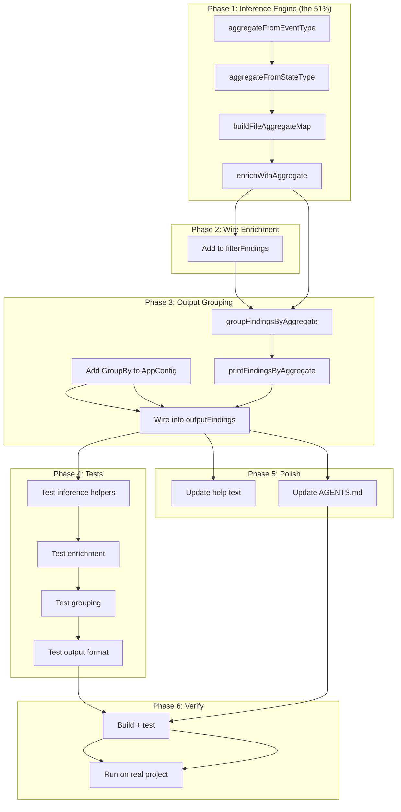

# cqrs-lint: Group Findings by Aggregate/Domain

**Date:** 2026-08-04
**Feedback Item:** #112 — "Group findings by aggregate/domain instead of a flat list"
**Status:** Implemented

---

## Problem

cqrs-lint outputs findings as a flat list (or grouped by module directory with
`--verbose`). When a project has 30+ findings across 5 aggregates, the consumer
sees 30 scattered lines with no structural context. "Your User aggregate has 5
issues" is far more actionable than 5 findings spread across the output.

## Root Cause

The `CQRSRegistry` already knows aggregate boundaries:

- `EventTypesEmitted["user.created"]` — the prefix before `.` IS the aggregate
- `DeciderInfo.StateType` = "UserState" — strip "State" suffix
- `FoldInfo.StateType` — same extraction
- `CommandInfo.Name` / `EventInfo.Name` — struct names encode the aggregate

But this information is **never connected to findings**. `Finding.Metadata` is
used by only 2 detectors (C001, C006) for fix data, plus `enrichWithDocURLs`
post-hoc. No enrichment step stamps aggregate/domain context.

## Solution: Two-Layer Design

### Layer 1: Enrichment (stamps `Finding.Metadata["aggregate"]`)

Post-hoc enrichment, same pattern as `enrichWithDocURLs`. Runs in
`filterFindings` after all detectors have produced findings. Uses a file-level
aggregate map built from registry data.

**Priority chain:**

1. Detector already stamped `Metadata["aggregate"]` → respect it
2. File-level map from registry (event type prefix → file) → use it
3. No match → leave unset (falls to "Uncategorized" bucket in output)

### Layer 2: Output Grouping (`--group-by` flag)

New `--group-by` CLI flag: `none` (default), `module` (replaces `--verbose`
grouping), `aggregate` (new). When `aggregate`, findings are printed under
headers like `User (5 findings)`, sorted by count descending.

**Backward compat:** `--verbose` still works → maps to `--group-by module`.
`--group-by` explicitly set takes precedence.

---

## Pareto Breakdown

### 1% that delivers 51% of the result

`buildFileAggregateMap` — the function that maps file paths to aggregate names
using `EventTypesEmitted` (already in the registry). This is the inference
engine. Everything else is plumbing on top of it.

### 4% that delivers 64% of the result

`enrichWithAggregate` — stamps `Finding.Metadata["aggregate"]` on every finding
using the file-level map. Once this runs, ALL output formats benefit: text gets
grouping, JSON/SARIF get the metadata field automatically. The data flows
everywhere.

### 20% that delivers 80% of the result

Enrichment + output grouping flag + output formatter. The consumer sees:

```
--- User (5 findings) ---
  ERROR  user/commands.go:42  Command type has no registered handler  [E005]
  ...
--- Order (3 findings) ---
  ...
```

### The other 20% (to reach 100%)

- Tests for every new function
- Edge cases: multiple aggregates per file, no aggregate found, non-CQRS files
- Documentation (AGENTS.md, help text)
- Build verification

---

## Comprehensive Plan (30-100min tasks)

| #   | Task                                                                                                                                                       | Impact                          | Effort | Priority |
| --- | ---------------------------------------------------------------------------------------------------------------------------------------------------------- | ------------------------------- | ------ | -------- |
| 1   | **Create aggregate inference engine** (`aggregate.go`): `aggregateFromEventType`, `aggregateFromStateType`, `buildFileAggregateMap`, `enrichWithAggregate` | CRITICAL — the core 51%         | 60min  | P0       |
| 2   | **Wire enrichment** into `filterFindings` (one line after `enrichWithDocURLs`)                                                                             | HIGH — activates Layer 1        | 10min  | P0       |
| 3   | **Add `--group-by` flag** + output grouping functions (`groupFindingsByAggregate`, `printFindingsByAggregate`, wire into `outputFindings`)                 | HIGH — the user-visible feature | 45min  | P1       |
| 4   | **Write tests** for inference, enrichment, and grouping                                                                                                    | HIGH — correctness guarantee    | 40min  | P1       |
| 5   | **Update docs** (AGENTS.md cqrs-lint description, help text)                                                                                               | MEDIUM — discoverability        | 15min  | P2       |
| 6   | **Build + verify** — compile, run tests, check no regressions                                                                                              | CRITICAL — quality gate         | 15min  | P0       |

## Detailed Breakdown (max 12min tasks)

| #   | Task                                                                            | Depends On | Est   |
| --- | ------------------------------------------------------------------------------- | ---------- | ----- |
| 1.1 | Create `aggregate.go` with `aggregateFromEventType(string) string`              | —          | 8min  |
| 1.2 | Add `aggregateFromStateType(string) string` to `aggregate.go`                   | 1.1        | 8min  |
| 1.3 | Add `buildFileAggregateMap(*CQRSRegistry) map[string][]string`                  | 1.1, 1.2   | 10min |
| 1.4 | Add `enrichWithAggregate([]Finding, *AnalysisContext) []Finding`                | 1.3        | 10min |
| 2.1 | Wire `enrichWithAggregate` call into `filterFindings`                           | 1.4        | 5min  |
| 3.1 | Add `GroupBy string` field to `AppConfig` struct                                | —          | 3min  |
| 3.2 | Add `groupFindingsByAggregate([]Finding) []findingGroup`                        | 1.4        | 10min |
| 3.3 | Add `printFindingsByAggregate` output formatter                                 | 3.2        | 10min |
| 3.4 | Wire `--group-by` into `outputFindings` dispatcher + resolve `--verbose` compat | 3.1, 3.3   | 8min  |
| 4.1 | Test: `aggregateFromEventType` table-driven                                     | 1.1        | 8min  |
| 4.2 | Test: `aggregateFromStateType` table-driven                                     | 1.2        | 8min  |
| 4.3 | Test: `buildFileAggregateMap` with mock registry                                | 1.3        | 10min |
| 4.4 | Test: `enrichWithAggregate` stamps correct metadata                             | 1.4        | 10min |
| 4.5 | Test: `groupFindingsByAggregate` groups correctly                               | 3.2        | 10min |
| 4.6 | Test: `printFindingsByAggregate` output format                                  | 3.3        | 10min |
| 5.1 | Update help text in `main.go`                                                   | 3.1        | 5min  |
| 5.2 | Update AGENTS.md cqrs-lint description                                          | —          | 5min  |
| 6.1 | Build + run cqrs-lint tests                                                     | All        | 10min |
| 6.2 | Run cqrs-lint on example/taskmanager to verify real output                      | 6.1        | 8min  |

---

## Execution Graph



---

## Key Design Decisions

### Why file-level mapping (not struct-level)?

Struct-level precision requires walking the AST to find the enclosing struct
for each finding position. This is complex and fragile. File-level mapping
covers the 80% case: well-structured CQRS projects put aggregates in separate
files (`user/commands.go`, `user/events.go`). The struct-level approach can be
added later by having detectors stamp `Metadata["aggregate"]` directly.

### Why not change the default output?

Changing the default from flat to grouped would break CI pipelines that parse
cqrs-lint text output. The `--group-by` flag is opt-in. JSON/SARIF consumers
get the metadata field automatically (no format change, just an extra field).

### Why title-case for display?

Aggregate names from event types are lowercase ("user.created" → "user").
Displaying "User" is cleaner and matches Go type naming conventions. The
metadata value stores the title-cased form for consistency.

### Aggregate name extraction rules

| Source     | Input                   | Output      | Rule                                       |
| ---------- | ----------------------- | ----------- | ------------------------------------------ |
| Event type | `"user.created"`        | `"User"`    | Prefix before `.`, capitalize first letter |
| Event type | `"order.shipped"`       | `"Order"`   | Same                                       |
| Event type | `"payment"` (no dot)    | `"Payment"` | Whole string, capitalize                   |
| StateType  | `"UserState"`           | `"User"`    | Strip `"State"` suffix                     |
| StateType  | `"OrderAggregateState"` | `"Order"`   | Strip `"State"` then `"Aggregate"`         |
| StateType  | `"CounterState"`        | `"Counter"` | Strip `"State"` suffix                     |

### Edge cases

- **Multiple aggregates per file**: A file emitting `user.created` and
  `order.placed` maps to `["User", "Order"]`. The finding joins the first
  group alphabetically, and the metadata stores both as `"User, Order"`.
- **No aggregate found**: Finding has no `Metadata["aggregate"]`. In
  `--group-by aggregate` mode, it goes to "Uncategorized".
- **Non-CQRS files**: Files with no event types, deciders, or folds get no
  aggregate. They land in "Uncategorized".
