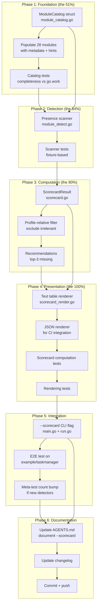

# Feature Adoption Scorecard — Comprehensive Execution Plan

> **Goal:** Transform `cqrs-lint --adoption` from a one-directional nag list ("you're missing X")
> into a **bilateral, context-aware scorecard** that shows used / missing / irrelevant modules
> with a profile-relative denominator: _"You use 8/15 relevant modules. Consider: scheduling, encryption, catalog."_

**Date:** 2026-08-04
**Module:** `cmd/cqrs-lint`
**Status:** Planning

---

## 1. Problem Statement

The current adoption system has three structural weaknesses:

1. **No denominator.** F-series rules (F001-F021) detect _absence_ only. There is no canonical
   "universe of modules" to divide by, so "8/15" is impossible to compute.
2. **No presence detection at module granularity.** `FeatureProfile` detects coarse signals
   (store kind, command-flow, server, tracing, snapshot) but not which of the ~30 adoptable
   modules a consumer actually imports.
3. **No profile-relative filtering.** A CLI tool is nagged about `transport/grpc` and
   `prometheus` even though those are irrelevant for its profile. The denominator should
   exclude irrelevant modules.

The `doctor` command prints the detected `FeatureProfile` as a text dump — the closest thing
to a scorecard — but it's a profile readout, not a used/missing breakdown.

---

## 2. Pareto Analysis

### 2.1 The 20% that delivers 80% of the result

| #   | Deliverable                                                                                                               | Why it matters                                                                      |
| --- | ------------------------------------------------------------------------------------------------------------------------- | ----------------------------------------------------------------------------------- |
| 1   | **ModuleCatalog** — canonical data structure defining all adoptable go-cqrs-lite modules with import-path detection hints | This IS the denominator. Without it, "X/Y" is impossible.                           |
| 2   | **Presence scanner** — scan consumer imports against the catalog, producing `map[ModuleKey]UsageStatus`                   | This IS the numerator. Turns "you're missing X" into "you use X, you're missing Y." |
| 3   | **`--scorecard` output** — text table: Module / Status / Category, with summary line                                      | The user-visible artifact. Everything else is invisible without this.               |

### 2.2 The 4% that delivers 64% of the result

| #   | Deliverable                                              | Why                                                                                                                                                                                                 |
| --- | -------------------------------------------------------- | --------------------------------------------------------------------------------------------------------------------------------------------------------------------------------------------------- |
| 1   | **ModuleCatalog struct + import-path scan + text table** | These three alone produce a working scorecard. The summary line "You use 8/15 modules" is just `len(used)/len(relevant)`. Profile filtering, JSON output, recommendations — all are layered polish. |

### 2.3 The 1% that delivers 51% of the result

| #   | Deliverable                                                                                                      | Why                                                                                                                                                                                                                               |
| --- | ---------------------------------------------------------------------------------------------------------------- | --------------------------------------------------------------------------------------------------------------------------------------------------------------------------------------------------------------------------------- |
| 1   | **ModuleCatalog with `ImportHints []string` + a scan function that checks `strings.Contains(importPath, hint)`** | The existing `feature_detect.go` already does import-path matching for 6 store backends. Extending that pattern to ~28 modules is mechanical. The data structure + scan function is 51% of the feature. The rest is presentation. |

### 2.4 The other 20% to get to 100%

| Area                  | Tasks                                                                                  |
| --------------------- | -------------------------------------------------------------------------------------- |
| **Profile-awareness** | Filter the denominator by detected profile (exclude `transport` for local-cli, etc.)   |
| **Output formats**    | JSON output for CI gate / dashboards                                                   |
| **Recommendations**   | "Consider: scheduling, encryption" — curated per-module suggestion text in the catalog |
| **Tests**             | Catalog completeness, presence detection, scorecard math, rendering, e2e on example/   |
| **Docs**              | AGENTS.md, changelog, meta-test count adjustment                                       |
| **Robustness**        | Multi-module workspace support (per-module scorecard), CI threshold flag               |

---

## 3. Architecture Design

### 3.1 New Files

```
cmd/cqrs-lint/
├── pkg/analyzer/
│   ├── module_catalog.go      # ModuleCatalog: the canonical module universe (data + methods)
│   ├── module_catalog_test.go # Completeness test vs go.work, no-duplicate-keys, profile-filter
│   ├── module_detect.go       # DetectUsedModules: import scan → map[ModuleKey]ModuleUsage
│   └── module_detect_test.go  # Fixture-based presence/absence detection tests
├── scorecard.go               # ComputeScorecard + ScorecardResult struct
├── scorecard_test.go          # Scorecard math, recommendations, profile-relative denominator
├── scorecard_render.go        # renderScorecard: text table + JSON marshal
└── scorecard_render_test.go   # Output shape assertions
```

### 3.2 Key Data Structures

```go
// ModuleCatalog entry — one per adoptable go-cqrs-lite module.
type ModuleEntry struct {
    Key          string       // e.g. "scheduling", "otel", "stack/sqlite"
    DisplayName  string       // e.g. "Scheduling", "OpenTelemetry"
    Category     ModuleCategory // Observability, Security, Persistence, etc.
    ImportHints  []string     // Substrings matched against import paths
    Description  string       // One-line: what this module gives you
    Suggestion   string       // "Consider: ..." text when missing
    Profiles     []ConfigPreset // Which profiles this is relevant for (empty = all)
}

// ModuleUsage — the detected status of one module.
type ModuleUsage struct {
    Key     ModuleKey
    Status  UsageStatus // Absent, Imported, Active
    Evidence string     // e.g. "import in cmd/main.go" or ""
}

type UsageStatus int
const (
    UsageAbsent   UsageStatus = iota // not imported
    UsageImported                     // import path found
    UsageActive                       // constructor call found (AST-level)
)

// ScorecardResult — the computed scorecard.
type ScorecardResult struct {
    Used          []ModuleEntry
    Missing       []ModuleEntry
    Irrelevant    []ModuleEntry // excluded by profile
    Summary       ScorecardSummary
    Recommendations []string    // top 3 "Consider:" suggestions
}

type ScorecardSummary struct {
    UsedCount      int
    RelevantTotal  int // denominator (catalog size minus irrelevant)
    CoveragePercent int // UsedCount / RelevantTotal * 100
}
```

### 3.3 Detection Strategy

Two-pass, mirroring the proven pattern in `feature_detect.go`:

1. **Pass 1 (import-based):** Scan `pkg.Imports` for each `ImportHint` substring → `UsageImported`.
2. **Pass 2 (AST call-based, optional depth):** Scan `*ast.CallExpr` for constructor names
   (`scheduling.New`, `otel.Setup`, etc.) → upgrade to `UsageActive`.

Pass 1 alone gives a working scorecard. Pass 2 adds the "imported but never called" signal
(stale imports) — valuable but not blocking for v1.

### 3.4 CLI Integration

```
cqrs-lint --scorecard              # Print scorecard table + exit 0
cqrs-lint --scorecard --format json # JSON output for CI
cqrs-lint scorecard                 # Subcommand equivalent (mirrors doctor pattern)
```

The `--scorecard` flag is orthogonal to `--health-score`. They can coexist:
`--health-score` shows deductions from findings; `--scorecard` shows module adoption.
Running both gives the full picture.

---

## 4. Execution Graph



---

## 5. Comprehensive Task Table (30-100 min tasks)

> Sorted by **impact × customer-value / effort** (highest first).
> Dependencies are sequential within phases, parallelizable across.

| #   | Phase | Task                                                                                                                                                                                | Impact | Effort | Customer Value                                                      | Depends On |
| --- | ----- | ----------------------------------------------------------------------------------------------------------------------------------------------------------------------------------- | ------ | ------ | ------------------------------------------------------------------- | ---------- |
| 1   | 1     | **Design + implement ModuleCatalog struct** — `ModuleEntry`, `ModuleCategory`, `ModuleKey`, `Catalog` type with `RelevantFor(profile)` method                                       | 10     | 45min  | The denominator. Without this nothing works.                        | —          |
| 2   | 1     | **Populate ModuleCatalog** — 28 modules with Key, DisplayName, Category, ImportHints, Description, Suggestion, Profiles                                                             | 10     | 60min  | The data IS the feature. Every module needs accurate import hints.  | 1          |
| 3   | 1     | **Catalog completeness test** — verify every go.work module is either in the catalog or explicitly excluded; no duplicate keys; no orphan hints                                     | 8      | 30min  | Prevents drift. Matches `TestEveryGoModDirIsInModulesList` pattern. | 2          |
| 4   | 2     | **Presence scanner** — `DetectUsedModules(packages, gofiles) map[ModuleKey]ModuleUsage`; import-path matching against catalog hints                                                 | 9      | 45min  | The numerator. Turns absence-only into bilateral detection.         | 2          |
| 5   | 2     | **Scanner unit tests** — fixture packages with known imports; verify used/absent/active classification                                                                              | 8      | 30min  | Correctness guarantee for the core detection.                       | 4          |
| 6   | 3     | **Scorecard computation** — `ComputeScorecard(catalog, usage, profile) ScorecardResult`; partition into used/missing/irrelevant; compute coverage %; generate top-3 recommendations | 9      | 45min  | The brain. Profile-relative denominator + recommendation logic.     | 4          |
| 7   | 3     | **Profile-relative filtering** — `ModuleEntry.RelevantFor(profile)` excludes irrelevant modules (transport for local-cli, etc.)                                                     | 7      | 30min  | Honesty. Stops nagging CLI tools about server modules.              | 1, 6       |
| 8   | 4     | **Text table renderer** — `renderScorecard(result, colorMode)`; two tables: Used (green) + Missing (yellow) + summary line; category subtotals                                      | 8      | 45min  | The user-visible artifact. Must be readable and motivating.         | 6          |
| 9   | 4     | **JSON renderer** — `ScorecardResult` JSON marshal for CI/dashboard consumption                                                                                                     | 6      | 20min  | Machine-readable output for `--format json` integration.            | 8          |
| 10  | 4     | **Scorecard computation tests** — coverage math, recommendation ordering, profile filtering, edge cases (all-used, none-used)                                                       | 7      | 30min  | Prevents off-by-one in the denominator/summary.                     | 6          |
| 11  | 4     | **Rendering tests** — text table shape assertions, JSON round-trip, color-mode handling                                                                                             | 6      | 30min  | Output format stability for CI consumers.                           | 8, 9       |
| 12  | 5     | **`--scorecard` CLI flag** — flag definition in `AppConfig`, run.go routing, output dispatch; subcommand variant                                                                    | 7      | 45min  | The entry point. Makes the feature accessible.                      | 8, 9       |
| 13  | 5     | **E2E integration test** — run scorecard on `example/taskmanager`, verify expected module set detected                                                                              | 8      | 30min  | Proves it works on a real project.                                  | 12         |
| 14  | 5     | **Meta-test count check** — verify `TestAllDetectorsInstantiate` count (scorecard adds no detectors, but flag changes may affect wiring)                                            | 3      | 15min  | Prevents the b3931503 class of failure.                             | 12         |
| 15  | 6     | **Update AGENTS.md** — document `--scorecard`, module catalog, new files in the cqrs-lint description                                                                               | 5      | 20min  | Discoverability for future sessions.                                | 12         |
| 16  | 6     | **Update changelog** — `cqrs-lint` changelog entry for scorecard feature                                                                                                            | 3      | 10min  | Release notes.                                                      | 12         |

**Total estimated effort:** ~9.5 hours

---

## 6. Detailed Task Breakdown (max 12 min each)

> Each task is independently committable. Sorted by dependency order, then impact.

| #    | Parent | Micro-Task                                                                                                                                                                                                                 | Est | Verify                                                  |
| ---- | ------ | -------------------------------------------------------------------------------------------------------------------------------------------------------------------------------------------------------------------------- | --- | ------------------------------------------------------- |
| 1.1  | T1     | Create `module_catalog.go`: package, imports, `ModuleCategory` string type with constants (Persistence, Observability, Security, Reliability, Schema, Projections, Messaging, Workflow, Documentation, Optimization, Core) | 10m | `go build`                                              |
| 1.2  | T1     | Add `ModuleKey` string type + `ModuleEntry` struct (Key, DisplayName, Category, ImportHints, Description, Suggestion, Profiles)                                                                                            | 8m  | `go build`                                              |
| 1.3  | T1     | Add `Catalog` struct wrapping `[]ModuleEntry` + `All()`, `Get(key)`, `Keys()` methods                                                                                                                                      | 8m  | `go build`                                              |
| 1.4  | T1     | Add `Catalog.RelevantFor(profile FeatureProfile) []ModuleEntry` — filters by Profiles field (empty = all profiles)                                                                                                         | 10m | unit test: filter excludes server modules for local-cli |
| 1.5  | T1     | Add `Catalog.ByCategory() map[ModuleCategory][]ModuleEntry` — groups entries for rendering                                                                                                                                 | 8m  | `go build`                                              |
| 2.1  | T2     | Populate Core category: event, command, query, decider, id, metadata (6 entries, always-used, not scored)                                                                                                                  | 10m | catalog test sees 6 core                                |
| 2.2  | T2     | Populate Persistence: stack/sqlite, stack/postgres, stack/mysql, stack/pebble, stack/turso, stack/duckdb (6 entries with import hints)                                                                                     | 10m | catalog test sees 6 persistence                         |
| 2.3  | T2     | Populate Observability: otel, prometheus, flightrecorder (3 entries)                                                                                                                                                       | 8m  | catalog test sees 3 obs                                 |
| 2.4  | T2     | Populate Security: signing, encryption (2 entries)                                                                                                                                                                         | 5m  | catalog test sees 2 sec                                 |
| 2.5  | T2     | Populate Reliability: idempotency, dedup, retry (3 entries)                                                                                                                                                                | 8m  | catalog test sees 3 rel                                 |
| 2.6  | T2     | Populate Schema + Projections: schema, kv, projectionhost, graph, listing, metaengine (6 entries)                                                                                                                          | 10m | catalog test sees 6                                     |
| 2.7  | T2     | Populate Messaging + Workflow: watermill, transport/http, transport/grpc, deriver, scheduling, snapshot (6 entries)                                                                                                        | 10m | catalog test sees 6                                     |
| 2.8  | T2     | Populate Documentation + Optimization: catalog, codec (2 entries)                                                                                                                                                          | 5m  | catalog test: 28 total scored + 6 core                  |
| 2.9  | T2     | Add `var DefaultCatalog = Catalog{...}` initialized from the entries above                                                                                                                                                 | 5m  | `go build`                                              |
| 3.1  | T3     | Write `module_catalog_test.go`: `TestCatalogNoDuplicateKeys`                                                                                                                                                               | 8m  | test passes                                             |
| 3.2  | T3     | `TestCatalogImportHintsUnique` — no hint is a substring of another hint (prevents ambiguous matches)                                                                                                                       | 10m | test passes                                             |
| 3.3  | T3     | `TestCatalogEveryGoWorkModuleCovered` — every library module in go.work is either in catalog or in an explicit exclusion list                                                                                              | 12m | test passes                                             |
| 3.4  | T3     | `TestCatalogRelevantForProfile` — local-cli excludes transport, library excludes transport + server infra                                                                                                                  | 10m | test passes                                             |
| 4.1  | T4     | Create `module_detect.go`: `UsageStatus` enum, `ModuleUsage` struct, `DetectUsedModules` signature                                                                                                                         | 8m  | `go build`                                              |
| 4.2  | T4     | Implement import-path scan: iterate `pkg.Imports`, match against `catalog.All()`, populate `map[ModuleKey]UsageImported`                                                                                                   | 10m | `go build`                                              |
| 4.3  | T4     | Add AST import fallback scan (mirror `feature_detect.go` Pass 1b) for test contexts where `pkg.Imports` is empty                                                                                                           | 10m | `go build`                                              |
| 4.4  | T4     | Mark unscanned modules as `UsageAbsent`; return full `map[ModuleKey]ModuleUsage` for every catalog entry                                                                                                                   | 8m  | `go build`                                              |
| 5.1  | T5     | Write `module_detect_test.go`: test fixture with imports for otel + scheduling + encryption → 3 UsageImported                                                                                                              | 10m | test passes                                             |
| 5.2  | T5     | Test: fixture with no go-cqrs-lite imports → all UsageAbsent                                                                                                                                                               | 8m  | test passes                                             |
| 5.3  | T5     | Test: fixture importing storage/pebble → detected as pebble not sqlite (hint priority)                                                                                                                                     | 8m  | test passes                                             |
| 5.4  | T5     | Test: multi-package fixture → union of imports across packages                                                                                                                                                             | 8m  | test passes                                             |
| 6.1  | T6     | Create `scorecard.go`: `ScorecardSummary` + `ScorecardResult` structs                                                                                                                                                      | 8m  | `go build`                                              |
| 6.2  | T6     | Implement `ComputeScorecard(catalog, usage, profile)`: partition into Used/Missing/Irrelevant                                                                                                                              | 10m | `go build`                                              |
| 6.3  | T6     | Compute `ScorecardSummary`: UsedCount, RelevantTotal, CoveragePercent                                                                                                                                                      | 8m  | `go build`                                              |
| 6.4  | T6     | Generate recommendations: top-3 missing modules by category priority (Security > Reliability > Observability > ...), excluding irrelevant                                                                                  | 10m | `go build`                                              |
| 6.5  | T6     | Handle edge case: all modules used → 100%, empty project → 0%                                                                                                                                                              | 8m  | `go build`                                              |
| 7.1  | T7     | Add profile annotations to catalog entries: transport modules → `[production]`, server infra → `[production]`, etc.                                                                                                        | 10m | catalog test verifies                                   |
| 7.2  | T7     | Test: `ComputeScorecard` with local-cli profile → transport in Irrelevant, not in Missing                                                                                                                                  | 10m | test passes                                             |
| 8.1  | T8     | Create `scorecard_render.go`: `renderScorecardText(result, colorMode)` — summary line + Used table + Missing table                                                                                                         | 12m | `go build`                                              |
| 8.2  | T8     | Add category subtotals row after each table group                                                                                                                                                                          | 8m  | `go build`                                              |
| 8.3  | T8     | Add color: green for Used, yellow for Missing, gray for Irrelevant                                                                                                                                                         | 8m  | `go build`                                              |
| 8.4  | T8     | Add summary banner: "Adoption: 8/15 relevant modules (53%) — Grade: Fair"                                                                                                                                                  | 10m | visual check                                            |
| 9.1  | T9     | Implement `renderScorecardJSON(result)` — marshal ScorecardResult with json tags                                                                                                                                           | 10m | `go build`                                              |
| 9.2  | T9     | Test: JSON round-trip — marshal → unmarshal → equal                                                                                                                                                                        | 8m  | test passes                                             |
| 10.1 | T10    | Write `scorecard_test.go`: `TestComputeScorecard_AllUsed` — 100% coverage                                                                                                                                                  | 8m  | test passes                                             |
| 10.2 | T10    | `TestComputeScorecard_NoneUsed` — 0% coverage, all in Missing                                                                                                                                                              | 8m  | test passes                                             |
| 10.3 | T10    | `TestComputeScorecard_ProfileFilter` — local-cli excludes transport from denominator                                                                                                                                       | 8m  | test passes                                             |
| 10.4 | T10    | `TestComputeScorecard_Recommendations` — top-3 sorted by category priority                                                                                                                                                 | 8m  | test passes                                             |
| 10.5 | T10    | `TestComputeScorecard_MixedUsage` — some used, some missing, some irrelevant                                                                                                                                               | 8m  | test passes                                             |
| 11.1 | T11    | Write `scorecard_render_test.go`: `TestRenderText_HasSummary` — contains "X/Y" and "%"                                                                                                                                     | 8m  | test passes                                             |
| 11.2 | T11    | `TestRenderText_HasTables` — contains "Used" and "Missing" headers                                                                                                                                                         | 8m  | test passes                                             |
| 11.3 | T11    | `TestRenderJSON_Valid` — valid JSON with expected top-level keys                                                                                                                                                           | 8m  | test passes                                             |
| 11.4 | T11    | `TestRender_ColorMode` — never color when never; always color when always                                                                                                                                                  | 8m  | test passes                                             |
| 12.1 | T12    | Add `Scorecard bool` flag to `AppConfig` in `main.go` with help text                                                                                                                                                       | 5m  | `go build`                                              |
| 12.2 | T12    | Wire scorecard in `run.go`: after detection, if `cfg.Scorecard`, compute + render + return nil (exit 0)                                                                                                                    | 10m | manual run works                                        |
| 12.3 | T12    | Add `scorecard` subcommand (mirrors `doctor.go` pattern) for standalone invocation                                                                                                                                         | 10m | `cqrs-lint scorecard` works                             |
| 12.4 | T12    | Route `--format json` to JSON renderer when `--scorecard` is active                                                                                                                                                        | 8m  | JSON output works                                       |
| 13.1 | T13    | Write E2E test: load `example/taskmanager` via `BuildContext`, run scorecard, assert expected Used set (event, command, decider, projectionhost, middleware, otel, signing, ...)                                           | 12m | test passes                                             |
| 13.2 | T13    | Assert scorecard summary math: UsedCount + len(Missing) + len(Irrelevant) == len(catalog)                                                                                                                                  | 8m  | test passes                                             |
| 14.1 | T14    | Run `TestAllDetectorsInstantiate` — verify count unchanged (scorecard adds no detectors)                                                                                                                                   | 5m  | test passes                                             |
| 14.2 | T14    | Run full cqrs-lint test suite: `cd cmd/cqrs-lint && GOWORK=off go test ./... -count=1`                                                                                                                                     | 8m  | all green                                               |
| 14.3 | T14    | Run linter self-lint: `cd cmd/cqrs-lint && GOWORK=off go vet ./...`                                                                                                                                                        | 5m  | no warnings                                             |
| 15.1 | T15    | Update AGENTS.md: add `--scorecard` to CLI description in cqrs-lint entry                                                                                                                                                  | 10m | doc-check passes                                        |
| 15.2 | T15    | Update AGENTS.md: add ModuleCatalog to module list description                                                                                                                                                             | 8m  | doc-check passes                                        |
| 16.1 | T16    | Add changelog entry for scorecard feature                                                                                                                                                                                  | 8m  | —                                                       |

**Total micro-tasks:** 55
**Total estimated effort:** ~9 hours (with parallelism: ~6 hours wall clock)

---

## 7. Key Design Decisions

### 7.1 Why a hand-curated catalog (not auto-generated from go.work)?

Auto-generation gives completeness but no metadata. The catalog needs human-authored fields:
`DisplayName`, `Description`, `Suggestion`, `Profiles`, `Category`. The CI test
(`TestCatalogEveryGoWorkModuleCovered`) provides the drift guarantee — same pattern as
`TestEveryGoModDirIsInModulesList` in api-stability.

### 7.2 Why three-tier usage status (Absent / Imported / Active)?

- **Absent:** not imported → the scorecard "Missing" column
- **Imported:** import path present → counted as "Used" (v1 threshold)
- **Active:** constructor call found (AST) → future enhancement for "stale import" detection

v1 counts `Imported` as `Used`. This is the right default — importing a module IS adoption.
The `Active` tier is infrastructure for a future "you imported scheduling but never call
`scheduling.New`" rule, but it's not needed for the scorecard to deliver value.

### 7.3 Why profile-relative denominator?

A `local-cli` project should NOT be penalized for missing `transport/grpc`. The denominator
excludes modules marked irrelevant for the detected profile. This makes the scorecard
_honest_ rather than a guilt trip. `ModuleEntry.Profiles` is empty for universally-relevant
modules (event, otel, encryption) and non-empty for profile-specific ones
(`transport` → `[production]`).

### 7.4 Why `--scorecard` is orthogonal to `--health-score`

`--health-score` answers "how many problems did the linter find?" (deduction-based).
`--scorecard` answers "how much of the library have you adopted?" (coverage-based).
They measure different things. Running both gives the full picture. Neither replaces the other.

### 7.5 No new F-rules needed

The ModuleCatalog is _metadata_. The F-rules are _behavioral detectors_. The scorecard is a
_separate output mode_ that reads the catalog + presence scan. F-rules continue to fire as
individual findings; the scorecard aggregates them into a coverage view. This separation keeps
the finding pipeline unchanged (no risk to the 186-detector count or existing rule behavior).

### 7.6 Anti-verschlimmbesserung safeguards

1. **No changes to existing F-rule behavior** — scorecard is additive, read-only.
2. **No changes to health-score computation** — scorecard is a separate code path.
3. **No changes to FeatureProfile struct** — scorecard reads it but doesn't modify it.
4. **Meta-test count stays at 186** — scorecard adds no detectors.
5. **`--adoption` flag behavior unchanged** — it still excludes F-series from health score.
   `--scorecard` is a NEW flag, not a modification of `--adoption`.

---

## 8. Risk Assessment

| Risk                                                          | Likelihood | Impact                          | Mitigation                                                                                  |
| ------------------------------------------------------------- | ---------- | ------------------------------- | ------------------------------------------------------------------------------------------- |
| Import hint ambiguity (one hint matches multiple modules)     | Medium     | False positives in Used/Missing | `TestCatalogImportHintsUnique` catches this at test time                                    |
| Catalog drift (new module added to go.work, not to catalog)   | Low        | Missing from denominator        | `TestCatalogEveryGoWorkModuleCovered` CI gate                                               |
| Multi-module workspace confusion (scorecard for wrong module) | Medium     | Misleading scorecard            | Reuse `ProfileForFile` pattern; scorecard uses primary profile by default                   |
| Performance (scanning all imports for 28 hints)               | Low        | Slow lint                       | Import scan is O(packages × hints) — trivial vs existing AST scans                          |
| Breaking existing tests                                       | Low        | Red CI                          | Scorecard code is in new files; no existing files modified except main.go/run.go (additive) |

---

## 9. Success Criteria

- [ ] `cqrs-lint --scorecard` prints a readable table with Used/Missing/Summary
- [ ] `cqrs-lint --scorecard --format json` produces valid JSON
- [ ] Running on `example/taskmanager` detects ≥8 used modules correctly
- [ ] A `local-cli` profile project's scorecard excludes transport/server modules from denominator
- [ ] Summary line shows "X/Y relevant modules (Z%)" with correct math
- [ ] All existing tests pass (186 detectors, health-score, F-rules unchanged)
- [ ] Catalog completeness test passes (every go.work module accounted for)
- [ ] No new lint warnings or vet issues

---

## 10. Module Catalog Reference (the 28+6 entries)

### Core (always used, not scored — denominator excludes these)

| Key      | Display     | Import Hint             |
| -------- | ----------- | ----------------------- |
| event    | Event       | `go-cqrs-lite/event`    |
| command  | Command     | `go-cqrs-lite/command`  |
| query    | Query       | `go-cqrs-lite/query`    |
| decider  | Decider     | `go-cqrs-lite/decider`  |
| id       | Branded IDs | `go-cqrs-lite/id`       |
| metadata | Metadata    | `go-cqrs-lite/metadata` |

### Scored Modules (28 entries)

| Key            | Category      | Import Hint                   | Suggestion                                   |
| -------------- | ------------- | ----------------------------- | -------------------------------------------- |
| stack/sqlite   | Persistence   | `go-cqrs-lite/stack/sqlite`   | SQLite backend for local/dev                 |
| stack/postgres | Persistence   | `go-cqrs-lite/stack/postgres` | Postgres backend for production              |
| stack/mysql    | Persistence   | `go-cqrs-lite/stack/mysql`    | MySQL backend                                |
| stack/pebble   | Persistence   | `go-cqrs-lite/stack/pebble`   | Pebble LSM backend for high-throughput       |
| stack/turso    | Persistence   | `go-cqrs-lite/stack/turso`    | Turso distributed SQLite                     |
| stack/duckdb   | Persistence   | `go-cqrs-lite/stack/duckdb`   | DuckDB columnar analytics                    |
| otel           | Observability | `go-cqrs-lite/otel`           | Distributed tracing for production           |
| prometheus     | Observability | `go-cqrs-lite/prometheus`     | Prometheus metrics endpoint                  |
| flightrecorder | Observability | `go-cqrs-lite/flightrecorder` | Capture execution traces on slow/error       |
| signing        | Security      | `go-cqrs-lite/signing`        | Tamper-proof event streams                   |
| encryption     | Security      | `go-cqrs-lite/encryption`     | Encrypt sensitive event payloads             |
| idempotency    | Reliability   | `go-cqrs-lite/idempotency`    | Dedup at-least-once delivery                 |
| dedup          | Reliability   | `go-cqrs-lite/dedup`          | Bounded ring dedup at stream boundaries      |
| retry          | Reliability   | `go-cqrs-lite/retry`          | Exponential backoff for transient errors     |
| schema         | Schema        | `go-cqrs-lite/schema`         | Schema evolution with upcasters              |
| kv             | Projections   | `go-cqrs-lite/kv`             | Typed KV store for read models               |
| projectionhost | Projections   | `go-cqrs-lite/projectionhost` | Managed projection lifecycle (crash-restart) |
| graph          | Projections   | `go-cqrs-lite/graph`          | Graph projections for traversal-heavy reads  |
| listing        | Projections   | `go-cqrs-lite/listing`        | Stream listing and tombstone detection       |
| metaengine     | Projections   | `go-cqrs-lite/metaengine`     | Cost-based storage planner                   |
| watermill      | Messaging     | `go-cqrs-lite/watermill`      | Distributed event/command bus                |
| transport/http | Messaging     | `go-cqrs-lite/transport/http` | SSE event delivery over HTTP                 |
| transport/grpc | Messaging     | `go-cqrs-lite/transport/grpc` | Remote command/query dispatch                |
| deriver        | Messaging     | `go-cqrs-lite/deriver`        | Event-to-command derivation (sagas)          |
| scheduling     | Workflow      | `go-cqrs-lite/scheduling`     | Durable deadline timers                      |
| snapshot       | Workflow      | `go-cqrs-lite/snapshot`       | Snapshot strategy for hot streams            |
| catalog        | Documentation | `go-cqrs-lite/catalog`        | Auto-generate event/command documentation    |
| codec          | Optimization  | `go-cqrs-lite/codec`          | CBOR codec for 35% smaller payloads          |
