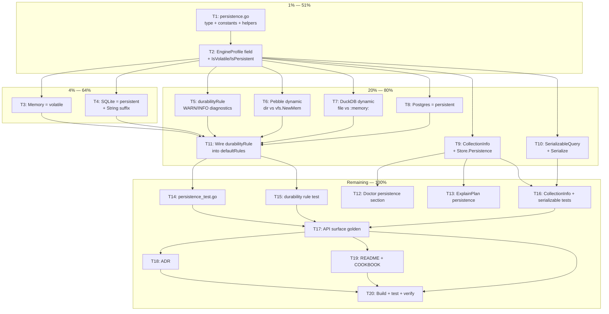

# Metaengine Persistence Enum

> **STATUS:** PLAN — not yet implemented.
> Created: 2026-08-04 07:15

## Problem

The metaengine `EngineProfile` declares cost (NsPerOp, ReadCosts), capability (Supports, Layouts),
topology (Replication, NetworkRTT), and degradation (DegradedADTs) — but **not durability**.
Whether an engine's data survives process exit is currently implicit in constructor names and
comments. The planner cannot reason about it, cannot warn when a query is routed to a volatile
engine, and cannot factor restart-rebuild cost into materialize-vs-replay decisions.

## Decision: Two levels, volatile as zero value

```go
type Persistence string

const (
    PersistenceVolatile   Persistence = ""            // zero value — safe default
    PersistencePersistent Persistence = "persistent"
)
```

**Why only two levels:**

| Considered | Rejected because |
|---|---|
| `PersistenceRemote` (client/server DB) | "Remote" is already modeled by `NetworkRTT` (latency) + `Replication` (topology). A third persistence level double-counts it. |
| `PersistenceDiskRelaxed` (no fsync) | The fsync tier is already modeled by `stack.Durability` (Strict/Normal/Relaxed). Orthogonal axis — that's "how durable is the write," not "is there a disk file at all." |
| `PersistenceReplicatedVolatile` (Redis cluster) | Collapses: Redis with AOF is persistent, without it is volatile. No engine in this codebase fits. |

**Why volatile is the zero value:** Mirrors the `Replication` pattern (`ReplicationNone = ""`).
If you forget to declare persistence, the planner assumes the worst and warns — it does NOT silently
assume durability. Safe default = loud warning, not false security.

**Why it must be dynamic (not a profile constant):** Three engines (SQLite, Pebble, DuckDB) are
volatile OR persistent depending on constructor arguments (`:memory:` vs file path). The persistence
value must be set at construction time, not hardcoded in a shared profile function.

---

## Pareto Breakdown

### 1% that delivers 51%

The `Persistence` type exists as a first-class concept in the type system.
Without this atom, nothing else can be built.

- `persistence.go`: type + 2 constants + helper methods
- `EngineProfile.Persistence` field
- `IsVolatile()` / `IsPersistent()` helper methods on EngineProfile

### 4% that delivers 64%

The two most common engines declare their persistence honestly.

- Memory engine: `PersistenceVolatile`
- SQLite engine: `PersistencePersistent`
- `String()` includes persistence suffix

### 20% that delivers 80%

The planner actively uses persistence, and ALL engines declare it.

- `durabilityRule`: WARN when query routes to volatile engine, INFO when persistent alternative exists
- Pebble engine: dynamic (dir → persistent, "" → volatile)
- DuckDB engine: dynamic (file → persistent, ":memory:" → volatile)
- Postgres engine: always persistent
- `CollectionInfo` exposes persistence + `Store.Persistence(queryName)` accessor
- `SerializableQuery` includes persistence (plan diff/pin/audit)

### Remaining 20% → 100%

- `Doctor()` shows persistence section
- `ExplainPlan()` shows persistence on engine lines
- Tests for every surface (type, rule, CollectionInfo, serializable, String)
- API surface golden regen
- ADR documenting the two-level decision
- README + COOKBOOK table update
- Build + test + verify gate

---

## Execution Graph



---

## Medium Granularity (30–100min tasks)

Sorted by impact (Pareto tier) then dependency order.

| # | Task | Files | Impact | Effort | Tier |
|---|------|-------|--------|--------|------|
| M1 | Create persistence.go: type, constants, doc comments | `persistence.go` (NEW) | Atomic foundation — nothing exists without it | 30min | 1% |
| M2 | Add Persistence to EngineProfile + helper methods + String() | `engine.go` | Carries the truth on every engine | 30min | 1% |
| M3 | Set Memory=volatile, SQLite=persistent in profiles | `memory_engine.go`, `sqlite_engine.go` | Two most common engines honest | 30min | 4% |
| M4 | Set Pebble persistence dynamically (dir vs vfs.NewMem) | `pebbleengine/engine.go` | Engine that blurs the line most | 45min | 20% |
| M5 | Set DuckDB persistence dynamically (file vs :memory:) | `duckdbengine/engine.go` | Same blur, different engine | 45min | 20% |
| M6 | Set Postgres=persistent in profile | `pgengine/engine.go` | Trivial but completes the matrix | 15min | 20% |
| M7 | Add Persistence to CollectionInfo + Store.Persistence() accessor | `store.go` | Makes durability queryable at runtime | 30min | 20% |
| M8 | Add Persistence to SerializableQuery + Serialize() | `serializable.go` | Plan diff/pin/audit includes durability | 30min | 20% |
| M9 | Create durabilityRule + wire into defaultRules() | `rule_durability.go` (NEW), `rules.go` | The killer feature — planner warnings | 45min | 20% |
| M10 | Show persistence in Doctor() + ExplainPlan() | `explain.go` | Operator visibility | 30min | 20% |
| M11 | Write all tests (type, rule, CollectionInfo, serializable, String) | `persistence_test.go` (NEW), `durability_rule_test.go` (NEW) | Correctness proof | 60min | remaining |
| M12 | API surface golden regen + ADR + docs | `cmd/api-stability`, `docs/adr/`, `README.md`, `COOKBOOK.md` | Completeness | 45min | remaining |
| M13 | Build + test + verify gate | — | Ship confidence | 30min | remaining |

**Total: ~7.5h**

---

## Fine Granularity (max 12min tasks)

Each medium task broken into atomic, independently-verifiable steps.
Sorted by impact then dependency.

| # | Task | Verifies | Est |
|---|------|----------|-----|
| **M1 — persistence.go** ||||
| F1 | Write `Persistence` type doc comment (domain rationale: DDIA Ch1, survivability axis) | compiles | 5min |
| F2 | Write `PersistenceVolatile` constant (= "") with doc comment | compiles | 3min |
| F3 | Write `PersistencePersistent` constant (= "persistent") with doc comment | compiles | 3min |
| **M2 — EngineProfile wiring** ||||
| F4 | Add `Persistence Persistence` field to EngineProfile struct with doc comment | `go build` | 5min |
| F5 | Add `IsVolatile() bool` method on EngineProfile | unit test inline | 5min |
| F6 | Add `IsPersistent() bool` method on EngineProfile | unit test inline | 5min |
| F7 | Update `String()` to append persistence suffix when volatile | eyeball output | 8min |
| **M3 — Memory + SQLite** ||||
| F8 | Set `Persistence: PersistenceVolatile` in memoryEngine.Profile() | build | 5min |
| F9 | Set `Persistence: PersistencePersistent` in SQLiteEngineProfile() | build | 5min |
| **M4 — Pebble dynamic** ||||
| F10 | Add `persistence Persistence` field to pebbleEngine struct | build | 5min |
| F11 | Set field in NewPebbleEngine: dir=="" → volatile, else persistent | build | 5min |
| F12 | Set field in NewPebbleEngineFromDB: assume persistent (caller owns disk DB) | build | 3min |
| F13 | Return field in pebbleEngine.Profile() | build | 5min |
| **M5 — DuckDB dynamic** ||||
| F14 | Add `persistence Persistence` field to duckdbEngine struct | build | 5min |
| F15 | Set field in New(): dsn=="" or ":memory:" → volatile, else persistent | build | 5min |
| F16 | Set field in NewFromDB(): assume persistent | build | 3min |
| F17 | Return field in duckdbEngine.Profile() | build | 5min |
| **M6 — Postgres** ||||
| F18 | Set `Persistence: PersistencePersistent` in pgEngine.Profile() | build | 5min |
| **M7 — CollectionInfo + accessor** ||||
| F19 | Add `Persistence Persistence` field to CollectionInfo struct | build | 5min |
| F20 | Populate field in Store.Collections() from engine profile | build | 5min |
| F21 | Add `Store.Persistence(queryName string) Persistence` accessor method | build | 5min |
| **M8 — SerializableQuery** ||||
| F22 | Add `Persistence Persistence` field to SerializableQuery (json tag) | build | 5min |
| F23 | Populate field in Serialize() from engine profile | build | 5min |
| **M9 — durabilityRule** ||||
| F24 | Create rule_durability.go: durabilityRule struct + Name() | build | 5min |
| F25 | Implement Apply(): volatile engine → WARN diagnostic | eyeball | 8min |
| F26 | Add INFO diagnostic when persistent alternative engine exists for same query | eyeball | 8min |
| F27 | Add RuleTraceEntry for durability warnings | build | 5min |
| F28 | Wire `&durabilityRule{}` into defaultRules() in rules.go | build | 3min |
| **M10 — Doctor + ExplainPlan** ||||
| F29 | Add "--- Persistence ---" section to Doctor() | eyeball | 8min |
| F30 | Append persistence suffix to engine lines in ExplainPlan() | eyeball | 5min |
| **M11 — Tests** ||||
| F31 | Test IsVolatile/IsPersistent on zero-value profile (should be volatile) | `go test` | 5min |
| F32 | Test String() includes "volatile" for volatile, omits for persistent | `go test` | 5min |
| F33 | Test Memory engine Profile().IsVolatile() == true | `go test` | 5min |
| F34 | Test SQLite engine Profile().IsPersistent() == true | `go test` | 5min |
| F35 | Test Pebble: NewPebbleEngine("") → volatile, NewPebbleEngine(dir) → persistent | `go test` | 8min |
| F36 | Test durabilityRule emits WARN for volatile-only plan | `go test` | 8min |
| F37 | Test durabilityRule emits INFO when persistent alternative exists | `go test` | 8min |
| F38 | Test durabilityRule silent when engine is persistent | `go test` | 5min |
| F39 | Test CollectionInfo.Persistence populated correctly | `go test` | 5min |
| F40 | Test SerializableQuery.Persistence in round-trip JSON | `go test` | 8min |
| F41 | Test Store.Persistence(queryName) accessor | `go test` | 5min |
| **M12 — Golden + ADR + docs** ||||
| F42 | Regen API surface golden: `cd cmd/api-stability && GOWORK=off go run main.go -update` | golden matches | 5min |
| F43 | Write ADR: `docs/adr/00XX-metaengine-persistence-enum.md` | reads well | 10min |
| F44 | Update README engine table: add Persistence column | reads well | 5min |
| F45 | Update COOKBOOK engine comparison table: add Persistence column | reads well | 5min |
| **M13 — Verify** ||||
| F46 | `go build -tags "goexperiment.jsonv2" ./metaengine/...` | compiles | 3min |
| F47 | `go test ./metaengine/... -count=1 -run Persistence` | green | 5min |
| F48 | `go test ./metaengine/... -count=1 -run Durability` | green | 5min |
| F49 | `go test ./metaengine/pebbleengine/... -count=1` | green | 5min |
| F50 | `go test ./metaengine/duckdbengine/... -count=1` (CGo) | green | 5min |
| F51 | `go test ./metaengine/pgengine/... -count=1` (testcontainer) | green | 8min |
| F52 | Full metaengine test suite: `go test ./... -count=1` | green | 8min |

---

## What This Unlocks (Future, NOT in scope)

| Capability | Why it needs Persistence | When |
|---|---|---|
| Materialize-vs-replay restart cost | Replay is "free" for volatile (data is gone anyway); materialize is "paid" for persistent (write amp) | Future enhancement to materializeRule |
| `WithPersistence(p)` plan option | "What-if" analysis: force volatile to see cost of losing durability | Future, mirrors WithReplication |
| Projection host restart-time estimate | Volatile engine → estimate replay time from event count | Future diagnostic |
