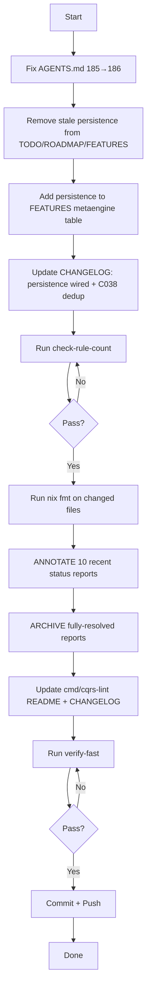

# SUPERB Docs-Health Fixup Plan — 2026-08-04 07:43

> **Trigger:** Self-review revealed 3 major misses: (1) AGENTS.md not updated
> (gate will fail), (2) ANNOTATE mode completely skipped, (3) no quality gates
> run. The auto-commit daemon also shipped persistence enum wiring, making
> several doc entries stale.

---

## Pareto Breakdown

### The 1% that delivers 51%
**Fix AGENTS.md rule count 185→186.** One edit. Unblocks `check-rule-count.sh`.

### The 4% that delivers 64%
1. Fix AGENTS.md rule count
2. Remove stale persistence items from TODO_LIST/ROADMAP/FEATURES (daemon shipped it)
3. Run `check-rule-count`

### The 20% that delivers 80%
1-3 above, plus:
4. Update CHANGELOG persistence entry (fully wired, not just type def)
5. Add persistence row to FEATURES.md metaengine table
6. Consolidate CHANGELOG C038 duplication
7. Run `nix fmt` on changed files
8. Commit

### The remaining 80% for the last 20%
9. ANNOTATE 10 most-recent status reports (2026-08-04)
10. ARCHIVE fully-resolved reports
11. Update cmd/cqrs-lint README + CHANGELOG
12. Run full verify gate
13. Push

---

## Execution Graph

---

## Phase 1: Fix Stale Docs (daemon shipped persistence, docs say "not done")

| # | Task | Impact | Effort | Deps |
|---|------|--------|--------|------|
| 1.1 | Remove persistence item from TODO_LIST (daemon wired it) | High | 5min | — |
| 1.2 | Update ROADMAP Theme 11 "not yet wired" → "shipped" | High | 5min | — |
| 1.3 | Update ROADMAP "Remaining short-term" (remove persistence) | Medium | 3min | — |
| 1.4 | Update FEATURES.md "Remaining" text (remove persistence) | Medium | 3min | — |
| 1.5 | Add persistence row to FEATURES.md metaengine table | Medium | 5min | — |
| 1.6 | Update CHANGELOG persistence entry ("fully wired" not "type exists") | Medium | 5min | — |

## Phase 2: Fix AGENTS.md (gate-breaking)

| # | Task | Impact | Effort | Deps |
|---|------|--------|--------|------|
| 2.1 | Update rule count 185→186 | Critical | 2min | — |
| 2.2 | Add scorecard/group-by/explain/C038-C040/persistence to description | Medium | 8min | — |

## Phase 3: Quality Gates

| # | Task | Impact | Effort | Deps |
|---|------|--------|--------|------|
| 3.1 | Run `check-rule-count.sh` | Critical | 2min | 1,2 |
| 3.2 | Run `nix fmt` (scoped to changed .md files) | Medium | 3min | 1,2 |
| 3.3 | Run `nix run .#verify-fast` | High | 5min | 3.1,3.2 |

## Phase 4: ANNOTATE (the skipped explicit request)

| # | Task | Impact | Effort | Deps |
|---|------|--------|--------|------|
| 4.1 | Classify 10 most-recent status reports (ANNOTATE/ARCHIVE/SKIP) | High | 10min | — |
| 4.2 | Annotate reports with inline `done at` markers | High | 40min | 4.1 |
| 4.3 | `git mv` fully-resolved reports to `archived/` | Medium | 5min | 4.2 |

## Phase 5: Secondary Docs

| # | Task | Impact | Effort | Deps |
|---|------|--------|--------|------|
| 5.1 | Update `cmd/cqrs-lint/README.md` rule count + features | Medium | 8min | — |
| 5.2 | Update `cmd/cqrs-lint/CHANGELOG.md` with post-v4.3.0 entries | Medium | 8min | — |

## Phase 6: Commit + Push

| # | Task | Impact | Effort | Deps |
|---|------|--------|--------|------|
| 6.1 | git status + commit all changes | Critical | 5min | All |
| 6.2 | git push | Critical | 2min | 6.1 |

---

## Micro-Task Breakdown (max 12min each)

### Phase 1: Fix Stale Docs

| ID | Task | Time |
|----|------|------|
| 1.1a | Read TODO_LIST persistence item, verify daemon shipped it | 3min |
| 1.1b | Delete persistence item from TODO_LIST | 2min |
| 1.2a | Read ROADMAP Theme 11 persistence section | 3min |
| 1.2b | Rewrite Theme 11 persistence as ✅ shipped | 5min |
| 1.3a | Read ROADMAP "Remaining short-term" line | 2min |
| 1.3b | Edit: remove "persistence enum wiring" | 2min |
| 1.4a | Read FEATURES.md "Remaining" text | 2min |
| 1.4b | Edit: remove "persistence enum wiring" | 2min |
| 1.5a | Read FEATURES.md metaengine table end | 3min |
| 1.5b | Add persistence row to table | 5min |
| 1.6a | Read CHANGELOG persistence entry | 3min |
| 1.6b | Rewrite: "type exists" → "fully wired + durabilityRule + tests" | 5min |
| 1.6c | Check C038 duplication in CHANGELOG, consolidate if needed | 5min |

### Phase 2: Fix AGENTS.md

| ID | Task | Time |
|----|------|------|
| 2.1a | Find "185 rules" in AGENTS.md | 2min |
| 2.1b | Replace 185→186 | 2min |
| 2.2a | Add scorecard, group-by, explain to AGENTS.md cqrs-lint description | 8min |

### Phase 3: Quality Gates

| ID | Task | Time |
|----|------|------|
| 3.1a | Run `bash scripts/check-rule-count.sh` | 3min |
| 3.2a | Run `gofumpt -w` on changed files (faster than nix fmt) | 3min |
| 3.3a | Run `nix run .#verify-fast` | 8min |

### Phase 4: ANNOTATE

| ID | Task | Time |
|----|------|------|
| 4.1a | List the 10 most-recent unarchived 2026-08-04 reports | 2min |
| 4.1b | For each: classify ANNOTATE vs ARCHIVE vs SKIP | 10min |
| 4.2a | Annotate 2026-08-04_07-18 SCORECARD review (inline markers) | 8min |
| 4.2b | Annotate 2026-08-04_07-02 cqrs-lint-config-ux-overhaul | 8min |
| 4.2c | Annotate 2026-08-04_07-02 readcosts-per-operation | 8min |
| 4.2d | Annotate 2026-08-04_06-49 benchmark-assertions-self-review | 8min |
| 4.2e | Annotate 2026-08-04_06-40 cqrs-lint-consumer-fixes | 8min |
| 4.2f | Annotate 2026-08-04_06-40 duckdb-pg-calibration | 8min |
| 4.2g | Annotate 2026-08-04_06-27 metaengine-inspect-extraction | 8min |
| 4.2h | Annotate 2026-08-04_06-19 c038-c040-event-type-mismatch | 8min |
| 4.2i | Annotate 2026-08-04_06-19 cqrs-lint-group-by-aggregate | 8min |
| 4.2j | Annotate 2026-08-04_06-18 cqrs-lint-round2-feedback | 8min |
| 4.3a | `git mv` fully-resolved reports to archived/ | 5min |

### Phase 5: Secondary Docs

| ID | Task | Time |
|----|------|------|
| 5.1a | Read cmd/cqrs-lint/README.md | 3min |
| 5.1b | Update rule count + add new features | 8min |
| 5.2a | Read cmd/cqrs-lint/CHANGELOG.md | 3min |
| 5.2b | Add post-v4.3.0 entries | 8min |

### Phase 6: Commit + Push

| ID | Task | Time |
|----|------|------|
| 6.1a | git status, review all changes | 3min |
| 6.1b | git commit with detailed message | 5min |
| 6.2a | git push | 2min |

**Total estimated time:** ~3.5 hours
