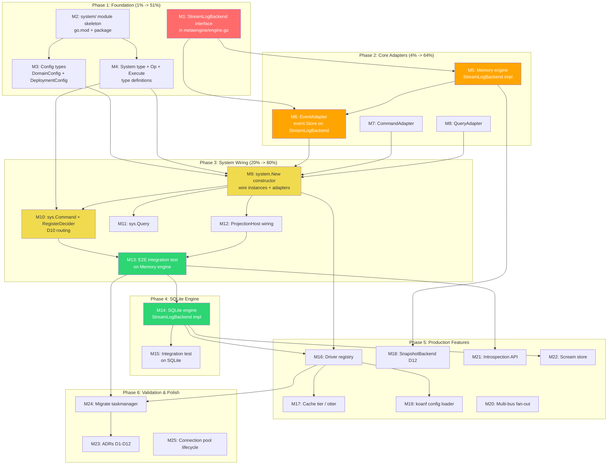

# Metaengine Implementation Plan: From Design Document to Working System

> **Date:** 2026-08-04 10:42
> **Status:** PLANNING — ready for implementation
> **Design doc:** [`docs/planning/metaengine-redesign.md`](metaengine-redesign.md) (1987 lines, 12 decisions, 0 open questions)
> **Goal:** Transform go-cqrs-lite from `stack.Bundle` (capability bag) to `system.System` (deployer-driven, multi-instance metaengine architecture)

---

## 1. Context Summary

The design document records 12 decisions (D1-D12) that define the target architecture:

- **D1:** Hybrid backend selection (compile-time drivers, runtime config) — the `database/sql` model
- **D2:** Parallel redesign (new `system/` module alongside existing `stack/`)
- **D3:** N-instance metaengine with operator-configured grouping
- **D4:** Introspection API only (no UI in go-cqrs-lite)
- **D5:** Tiered scream store (SCREAM / WARN+OVERRIDE / ADVISORY)
- **D6:** System owns ALL infrastructure (storage, bus, projectionhost, dispatchers)
- **D7:** Config via koanf (Go struct + YAML + env merge)
- **D8:** Gradual migration (new `system/` module, sqlite+memory first)
- **D9:** Multi-bus support (multiple simultaneous buses)
- **D10:** Declarative command->event->stream relationships as data
- **D11:** DomainConfig (consumer) + DeploymentConfig (operator) separation
- **D12:** New SnapshotBackend interface with LoadAtVersion

The three foundational concepts:

1. **StreamLogBackend** — ONE interface for events, commands, queries (all stream-keyed append-only logs)
2. **N-instance metaengine** — multiple `*metaengine.Store` instances across two layers (source-of-truth + projections)
3. **system.System** — the composition root that owns all infrastructure wiring

---

## 2. Pareto Analysis

### The 1% that delivers 51% of the result

| #      | What                                                | Why                                                                                                                                                                                                                                      |
| ------ | --------------------------------------------------- | ---------------------------------------------------------------------------------------------------------------------------------------------------------------------------------------------------------------------------------------- |
| **1A** | **StreamLogBackend interface definition**           | THE storage primitive. Every event, command, and query flows through it. If the interface is wrong, everything downstream breaks. This is `metaengine.StreamLogBackend` — a new ADT-level interface alongside the existing `LogBackend`. |
| **1B** | **`system.New(ctx, domain, deployment)` signature** | THE entry point for every consumer. The two-config split (D11) is the type-level enforcement of G1/G2 (consumer doesn't decide infrastructure, operator doesn't write domain code).                                                      |
| **1C** | **`system.Op[State]` + `system.Execute`**           | THE command routing primitive (D10). This is how the System captures command->stream-type->event-type as data. `sys.Command("task.create", func(ctx, cmd) system.Op[TaskState] { return system.Execute(ctx, ...) })`.                    |

### The 4% that delivers 64% of the result

| #      | What                                               | Why                                                                                                                                                                                                            |
| ------ | -------------------------------------------------- | -------------------------------------------------------------------------------------------------------------------------------------------------------------------------------------------------------------- |
| **4A** | **EventAdapter** (event.Store on StreamLogBackend) | The bridge between the new storage primitive and the existing `decider.Repository`. Implements optimistic concurrency (expectedVersion check via RunInTx). Without this, the System can't talk to the decider. |
| **4B** | **Memory engine StreamLogBackend impl**            | Simplest engine implementation. Validates the interface works end-to-end. Enables testing without SQLite/CGo.                                                                                                  |
| **4C** | **system.System core wiring**                      | The constructor that creates instances, wires adapters, constructs decider.Repository + projectionhost + dispatchers.                                                                                          |

### The 20% that delivers 80% of the result

| #       | What                                      | Why                                                                                    |
| ------- | ----------------------------------------- | -------------------------------------------------------------------------------------- |
| **20A** | **SQLite engine StreamLogBackend impl**   | Persistent storage. Required for any real deployment.                                  |
| **20B** | **CommandAdapter + QueryAdapter**         | Trivial but needed for command/query audit stores.                                     |
| **20C** | **sys.Command + sys.RegisterDecider**     | Consumer-facing API for D10 routing.                                                   |
| **20D** | **ProjectionHost wiring inside System**   | System owns projectionhost (D6), reads from event journal, feeds projection instances. |
| **20E** | **End-to-end integration test on Memory** | Proves the design works before adding SQLite complexity.                               |

### The other 20% (production features)

| #                                                               | What |
| --------------------------------------------------------------- | ---- |
| Driver registry (storage engines — the `database/sql` model)    |
| Bus driver registry (multi-bus, D9)                             |
| Cache tier (CachedEventStore / otter W-TinyLFU)                 |
| SnapshotBackend interface (D12)                                 |
| koanf config loader (YAML + env merge)                          |
| Introspection API (Topology type, Snapshot/Health/Plan/Explain) |
| Scream store (PlanDiff + fingerprint + manifest + safety rules) |
| Connection pool lifecycle (samber/do named services)            |
| ADRs for D1-D12                                                 |
| Migrate example/taskmanager                                     |

---

## 3. Execution Graph



**Legend:** Red = critical foundation (1%), Orange = core adapters (4%), Yellow = system wiring (20%), Green = validation milestone.

**Critical path:** M1 -> M5 -> M6 -> M9 -> M10 -> M13 -> M14 -> M24

---

## 4. Medium Tasks (30-100 min each)

Sorted by implementation dependency order (not by phase). Each task includes impact, effort, and customer-value assessment.

| ID      | Task                                                                                                                                                              | Phase | Impact (1-5) | Effort (1-5) | Value (1-5) | Est (min) | Depends on         |
| ------- | ----------------------------------------------------------------------------------------------------------------------------------------------------------------- | ----- | :----------: | :----------: | :---------: | :-------: | ------------------ |
| **M1**  | Define `StreamLogBackend` interface in `metaengine/engine.go`                                                                                                     | 1     |      5       |      1       |      5      |    30     | —                  |
| **M2**  | Create `system/` module skeleton (go.mod, package, go.work entry)                                                                                                 | 1     |      5       |      1       |      4      |    30     | —                  |
| **M3**  | Define config types: `DomainConfig`, `DeploymentConfig`, `InstanceConfig`, `EngineConfig`, `BusConfig`, `CacheConfig`                                             | 1     |      5       |      2       |      5      |    45     | M2                 |
| **M4**  | Define `System` type, `Op[State]`, `Execute()`, `InstanceRole` constants                                                                                          | 1     |      5       |      2       |      5      |    45     | M2                 |
| **M5**  | Implement `StreamLogBackend` on Memory engine (stream-keyed maps)                                                                                                 | 2     |      5       |      3       |      5      |    60     | M1                 |
| **M6**  | Implement `EventAdapter` (event.Store on StreamLogBackend, optimistic concurrency via RunInTx)                                                                    | 2     |      5       |      4       |      5      |    90     | M1, M5             |
| **M7**  | Implement `CommandAdapter` (command.Store on StreamLogBackend, direct mapping)                                                                                    | 2     |      3       |      1       |      3      |    30     | M1, M5             |
| **M8**  | Implement `QueryAdapter` (query.Store on StreamLogBackend, flat mode)                                                                                             | 2     |      3       |      1       |      3      |    30     | M1, M5             |
| **M9**  | Implement `system.New()` constructor: parse DeploymentConfig -> create engines -> create instances -> wire adapters -> construct decider.Repository + dispatchers | 3     |      5       |      4       |      5      |    90     | M3, M4, M6, M7, M8 |
| **M10** | Implement `sys.Command`, `sys.RegisterDecider`, `system.Execute`, `system.Op[State]` — D10 declarative routing                                                    | 3     |      5       |      4       |      5      |    90     | M4, M9             |
| **M11** | Implement `sys.Query` (typed query dispatch via MetaEngine ExecuteTyped)                                                                                          | 3     |      3       |      1       |      3      |    30     | M9                 |
| **M12** | Wire ProjectionHost inside System (reads event journal, feeds projection instances)                                                                               | 3     |      4       |      3       |      4      |    60     | M9                 |
| **M13** | End-to-end integration test: create command, decider, projection on Memory engine — verify full CQRS roundtrip                                                    | 3     |      5       |      3       |      5      |    60     | M9, M10, M12       |
| **M14** | Implement `StreamLogBackend` on SQLite engine (SQL tables for stream-keyed append-only logs)                                                                      | 4     |      4       |      4       |      4      |    90     | M1, M13            |
| **M15** | Integration test: end-to-end on SQLite (persistent, crash-safe)                                                                                                   | 4     |      3       |      2       |      4      |    45     | M14                |
| **M16** | Driver registry: `RegisterDriver()` + `init()`-based registration (the `database/sql` model)                                                                      | 5     |      4       |      3       |      4      |    60     | M14                |
| **M17** | Cache tier: `CachedEventStore` (otter W-TinyLFU read-through wrapper)                                                                                             | 5     |      3       |      3       |      3      |    60     | M6                 |
| **M18** | `SnapshotBackend` interface (D12) + adapter to `snapshot.SnapshotStore`                                                                                           | 5     |      3       |      3       |      3      |    45     | M5                 |
| **M19** | koanf config loader: `system.LoadConfig("config.yaml")` -> DeploymentConfig                                                                                       | 5     |      3       |      2       |      4      |    60     | M3                 |
| **M20** | Multi-bus fan-out: publish to N buses, per-bus sync/async mode                                                                                                    | 5     |      3       |      3       |      3      |    60     | M9                 |
| **M21** | Introspection API: `Topology`, `Snapshot()`, `Health()`, `Plan()`, `Explain()`                                                                                    | 5     |      3       |      3       |      4      |    60     | M13                |
| **M22** | Scream store: PlanDiff, fingerprint, manifest, safety rules                                                                                                       | 5     |      2       |      4       |      3      |    90     | M14                |
| **M23** | ADRs for D1-D12 (12 formal documents in `docs/adr/`)                                                                                                              | 6     |      2       |      2       |      3      |    60     | All                |
| **M24** | Migrate `example/taskmanager` to System (validation that design works on real code)                                                                               | 6     |      5       |      4       |      5      |    90     | M13, M16           |
| **M25** | Connection pool lifecycle: named services in samber/do, sizing, hot-reload                                                                                        | 6     |      2       |      3       |      2      |    45     | M16                |

**Total estimated time:** ~21 hours (25 tasks)

---

## 5. Fine-Grained Tasks (max 12 min each)

Each medium task is broken into atomic steps. Sorted by dependency order within each phase.

### Phase 1: Foundation (M1-M4)

| ID   | Task                                                                                                                                                                        | Parent | Est (min) | Depends |
| ---- | --------------------------------------------------------------------------------------------------------------------------------------------------------------------------- | ------ | :-------: | ------- |
| F1.1 | Add `ADTStreamLog` constant to `metaengine/types.go`                                                                                                                        | M1     |     3     | —       |
| F1.2 | Define `StreamLogBackend` interface in `metaengine/engine.go` (6 methods: StreamAppend, StreamRead, StreamReadAsOf, StreamReadAsOfVersion, JournalReadAll, JournalReadFrom) | M1     |     8     | F1.1    |
| F1.3 | Add `StreamVersion(ctx, collection, streamID) (int64, error)` to interface (needed by EventAdapter for optimistic concurrency)                                              | M1     |     5     | F1.2    |
| F1.4 | Write interface contract documentation (godoc on every method)                                                                                                              | M1     |     8     | F1.2    |
| F1.5 | Verify no circular dependency: metaengine must NOT import event/ (StreamLogBackend stores `[]any`, not `[]event.Event`)                                                     | M1     |     3     | F1.2    |
| F1.6 | Write table-driven test: verify interface satisfies Engine sub-interface pattern                                                                                            | M1     |     3     | F1.2    |

| ID   | Task                                                                                  | Parent | Est (min) | Depends |
| ---- | ------------------------------------------------------------------------------------- | ------ | :-------: | ------- |
| F2.1 | Create `system/go.mod` (module path: `github.com/larsartmann/go-cqrs-lite/system/v4`) | M2     |     5     | —       |
| F2.2 | Add `system/` to `go.work`                                                            | M2     |     2     | F2.1    |
| F2.3 | Create `system/system.go` with package declaration and package-level godoc            | M2     |     5     | F2.1    |
| F2.4 | Verify `cd system && GOWORK=off go build ./...` compiles                              | M2     |     3     | F2.3    |
| F2.5 | Add `system/` to `cmd/api-stability/main.go` modules list                             | M2     |     5     | F2.3    |

| ID   | Task                                                                                                                              | Parent | Est (min) | Depends          |
| ---- | --------------------------------------------------------------------------------------------------------------------------------- | ------ | :-------: | ---------------- |
| F3.1 | Define `InstanceRole` type + constants (RoleEvents, RoleCommands, RoleQueries, RoleSnapshots, RoleProjections, RoleSourceOfTruth) | M3     |     5     | M2               |
| F3.2 | Define `EngineConfig` struct (Driver, DSN, Pragmas, Codec)                                                                        | M3     |     5     | M2               |
| F3.3 | Define `BusConfig` struct (Driver, URL, Mode)                                                                                     | M3     |     3     | M2               |
| F3.4 | Define `CacheConfig` struct (Engine, Capacity)                                                                                    | M3     |     3     | M2               |
| F3.5 | Define `InstanceConfig` struct (Role, Collections, Engine/Engines, Durability, Publish, Subscribe, Cache, Codec)                  | M3     |     8     | F3.1, F3.2, F3.4 |
| F3.6 | Define `DeploymentConfig` struct (Engines map, Buses map, Instances slice, AcknowledgeWarnings)                                   | M3     |     5     | F3.2, F3.3, F3.5 |
| F3.7 | Define `DomainConfig` struct (Commands, Queries, Projections, Middleware)                                                         | M3     |     8     | M2               |
| F3.8 | Define `DurabilityTier` type + constants (Strict, Normal, Relaxed) — re-export from stack/ or define locally                      | M3     |     5     | M2               |

| ID   | Task                                                                                                    | Parent | Est (min) | Depends    |
| ---- | ------------------------------------------------------------------------------------------------------- | ------ | :-------: | ---------- |
| F4.1 | Define `System` struct (instances, buses, dispatchers, projectionHost, deciders map, metaEngine stores) | M4     |    10     | M3         |
| F4.2 | Define `Op[State any]` type (carries streamID, streamType, decide function)                             | M4     |    10     | M2         |
| F4.3 | Define `Execute(ctx, streamID, streamType, decideFn)` function returning `Op[State]`                    | M4     |    10     | F4.2       |
| F4.4 | Write godoc explaining D10 routing model: System captures command->stream-type->event-type as data      | M4     |     8     | F4.3       |
| F4.5 | Verify types compile: `cd system && GOWORK=off go build ./...`                                          | M4     |     2     | F4.1, F4.3 |

### Phase 2: Core Adapters (M5-M8)

| ID    | Task                                                                                                      | Parent | Est (min) | Depends   |
| ----- | --------------------------------------------------------------------------------------------------------- | ------ | :-------: | --------- |
| F5.1  | Add `streams` field to `memData` struct: `map[string]map[string][]any` (collection -> streamID -> values) | M5     |     8     | M1        |
| F5.2  | Implement `StreamAppend(ctx, collection, streamID, values)` — append to stream slice under mutex          | M5     |    10     | F5.1      |
| F5.3  | Implement `StreamRead(ctx, collection, streamID)` — return stream slice under RLock                       | M5     |     8     | F5.1      |
| F5.4  | Implement `StreamVersion(ctx, collection, streamID)` — return len(stream) as int64                        | M5     |     5     | F5.1      |
| F5.5  | Implement `JournalReadAll(ctx, collection)` — flatten all streams into one ordered slice                  | M5     |    10     | F5.1      |
| F5.6  | Implement `JournalReadFrom(ctx, collection, afterID, limit)` — ordered read from position                 | M5     |    12     | F5.1      |
| F5.7  | Implement `StreamReadAsOf(ctx, collection, streamID, asOf)` — filter by timestamp (version chain)         | M5     |    10     | F5.1      |
| F5.8  | Implement `StreamReadAsOfVersion(ctx, collection, streamID, maxVersion)` — filter by version              | M5     |     8     | F5.1      |
| F5.9  | Add compile-time assertion: `_ StreamLogBackend = (*memoryEngine)(nil)`                                   | M5     |     2     | F5.2      |
| F5.10 | Write roundtrip test: append -> read -> version check -> journal read                                     | M5     |    12     | F5.2-F5.6 |

| ID    | Task                                                                                                                                            | Parent | Est (min) | Depends    |
| ----- | ----------------------------------------------------------------------------------------------------------------------------------------------- | ------ | :-------: | ---------- |
| F6.1  | Define `EventAdapter` struct (backend StreamLogBackend, collection string, codec codec.Codec) in new `system/` or `metaengine/` package         | M6     |     8     | M5         |
| F6.2  | Implement `Load(ctx, ref)` — StreamRead -> decode each `[]any` entry to `event.Event`                                                           | M6     |    12     | M5         |
| F6.3  | Implement `Save(ctx, ref, events, expectedVersion)` — the critical optimistic concurrency path: RunInTx(StreamVersion -> check -> StreamAppend) | M6     |    12     | M5         |
| F6.4  | Implement `LoadFromVersion`, `LoadToVersion`, `LoadToTimestamp` (filter on decoded events)                                                      | M6     |    12     | F6.2       |
| F6.5  | Implement `AppendBatch(ctx, ref, events)` — StreamAppend without version check                                                                  | M6     |     5     | F6.3       |
| F6.6  | Implement `ReadAll(ctx)` — JournalReadAll -> decode                                                                                             | M6     |     8     | F6.2       |
| F6.7  | Implement `ReadFrom(ctx, afterEventID, limit)` — JournalReadFrom -> decode                                                                      | M6     |    10     | F6.2       |
| F6.8  | Write test: Save + Load roundtrip on Memory engine                                                                                              | M6     |    10     | F6.3       |
| F6.9  | Write test: optimistic concurrency conflict (version mismatch -> error)                                                                         | M6     |    10     | F6.3       |
| F6.10 | Write test: journal ReadAll + ReadFrom across multiple streams                                                                                  | M6     |    10     | F6.6, F6.7 |

| ID   | Task                                                                         | Parent | Est (min) | Depends |
| ---- | ---------------------------------------------------------------------------- | ------ | :-------: | ------- |
| F7.1 | Define `CommandAdapter` struct (backend StreamLogBackend, collection, codec) | M7     |     5     | M5      |
| F7.2 | Implement `Save(ctx, ref, cmd)` — StreamAppend (no version check)            | M7     |     5     | F7.1    |
| F7.3 | Implement `Load(ctx, ref)` — StreamRead -> decode                            | M7     |     8     | F7.1    |
| F7.4 | Implement `ReadAll(ctx)` + `ReadFrom(ctx, afterID, limit)` — journal reads   | M7     |    10     | F7.1    |
| F7.5 | Write test: Save + Load roundtrip                                            | M7     |     5     | F7.2    |

| ID   | Task                                                                        | Parent | Est (min) | Depends |
| ---- | --------------------------------------------------------------------------- | ------ | :-------: | ------- |
| F8.1 | Define `QueryAdapter` struct (backend StreamLogBackend, collection, codec)  | M8     |     5     | M5      |
| F8.2 | Implement `SaveQuery(ctx, q)` — StreamAppend with requestID as streamID     | M8     |     5     | F8.1    |
| F8.3 | Implement `LoadQueries(ctx, after)` — flat journal read                     | M8     |     8     | F8.1    |
| F8.4 | Implement `ReadAllQueries(ctx)` + `ReadQueriesFrom(ctx, afterReqID, limit)` | M8     |    10     | F8.1    |
| F8.5 | Write test: Save + Load roundtrip                                           | M8     |     5     | F8.2    |

### Phase 3: System Wiring (M9-M13)

| ID   | Task                                                                                                                                      | Parent | Est (min) | Depends      |
| ---- | ----------------------------------------------------------------------------------------------------------------------------------------- | ------ | :-------: | ------------ |
| F9.1 | Implement engine construction: iterate DeploymentConfig.Engines -> RegisterDriver lookup -> construct Engine                              | M9     |    12     | M3, M16      |
| F9.2 | Implement instance construction: iterate DeploymentConfig.Instances -> group by Role -> create StreamLogBackend-backed Store per instance | M9     |    12     | F9.1         |
| F9.3 | Wire EventAdapter: find RoleEvents/RoleSourceOfTruth instance -> wrap as event.Store                                                      | M9     |    10     | F9.2, M6     |
| F9.4 | Wire CommandAdapter + QueryAdapter on appropriate instances                                                                               | M9     |     8     | F9.2, M7, M8 |
| F9.5 | Construct decider.Repository using EventAdapter as store + bus as publisher                                                               | M9     |    10     | F9.3         |
| F9.6 | Construct command.Dispatcher + query.Dispatcher                                                                                           | M9     |     8     | F9.5         |
| F9.7 | Implement `System.MetaEngine()` accessor (returns projection-layer Store)                                                                 | M9     |     5     | F9.2         |
| F9.8 | Implement `System.Close()` (close all engines, buses, host)                                                                               | M9     |     8     | F9.2         |
| F9.9 | Write test: construct System with Memory engine + GoChannel bus -> verify no error                                                        | M9     |    10     | F9.5         |

| ID    | Task                                                                                                                           | Parent | Est (min) | Depends |
| ----- | ------------------------------------------------------------------------------------------------------------------------------ | ------ | :-------: | ------- |
| F10.1 | Implement `RegisterDecider(streamType, decider)` — stores in System.deciders map                                               | M10    |     8     | M4, M9  |
| F10.2 | Implement `Command(name, handler)` — registers typed command handler that returns Op[State]                                    | M10    |    12     | F10.1   |
| F10.3 | Implement `Execute(ctx, streamID, streamType, decideFn)` — the Op executor: load state via decider, call decideFn, save events | M10    |    12     | F10.1   |
| F10.4 | Extract event types from decideFn return value for routing graph (reflection or runtime capture)                               | M10    |    12     | F10.3   |
| F10.5 | Build routing graph: command type -> stream type -> event types (for auto-wiring projections)                                  | M10    |    12     | F10.4   |
| F10.6 | Implement `UseCommandMiddleware(mw...)` — consumer injects domain middleware                                                   | M10    |     5     | F10.2   |
| F10.7 | Write test: register decider + command -> execute -> verify events saved + state correct                                       | M10    |    12     | F10.3   |

| ID    | Task                                                                    | Parent | Est (min) | Depends |
| ----- | ----------------------------------------------------------------------- | ------ | :-------: | ------- |
| F11.1 | Implement `Query(name, handler)` — registers typed query handler        | M11    |     8     | M9      |
| F11.2 | Implement `DispatchQuery(ctx, q)` — routes to registered handler        | M11    |     8     | F11.1   |
| F11.3 | Write test: register query -> dispatch -> verify result from MetaEngine | M11    |     8     | F11.2   |

| ID    | Task                                                                                                                | Parent | Est (min) | Depends |
| ----- | ------------------------------------------------------------------------------------------------------------------- | ------ | :-------: | ------- |
| F12.1 | Create projection Store from projection-layer instance (metaengine.Plan with queries from DomainConfig.Projections) | M12    |    12     | M9      |
| F12.2 | Construct projectionhost.Host with event journal from EventAdapter (SeekableJournal)                                | M12    |    10     | F12.1   |
| F12.3 | Register projectionadapter for each DomainConfig.Projections query                                                  | M12    |    10     | F12.1   |
| F12.4 | Implement `System.Start(ctx)` — starts projection host                                                              | M12    |     5     | F12.2   |
| F12.5 | Implement `System.Stop()` — graceful drain                                                                          | M12    |     5     | F12.2   |
| F12.6 | Write test: create projection -> execute command -> verify projection updated                                       | M12    |    12     | F12.3   |

| ID    | Task                                                                                                       | Parent | Est (min) | Depends  |
| ----- | ---------------------------------------------------------------------------------------------------------- | ------ | :-------: | -------- |
| F13.1 | Write test: full CQRS roundtrip — command -> decider -> events -> projection -> query                      | M13    |    12     | M10, M12 |
| F13.2 | Write test: optimistic concurrency conflict on concurrent commands                                         | M13    |    10     | M10      |
| F13.3 | Write test: multiple deciders (different stream types) on same System                                      | M13    |    10     | M10      |
| F13.4 | Write test: system.Close() cleanly shuts down all components                                               | M13    |     8     | M9       |
| F13.5 | Write test: DomainConfig + DeploymentConfig separation (verify consumer code has zero infrastructure refs) | M13    |    10     | M10      |

### Phase 4: SQLite Engine (M14-M15)

| ID    | Task                                                                                                              | Parent | Est (min) | Depends |
| ----- | ----------------------------------------------------------------------------------------------------------------- | ------ | :-------: | ------- |
| F14.1 | Design SQL schema for stream-keyed append-only log (table: collection, stream_id, seq, value, version, timestamp) | M14    |    12     | M1      |
| F14.2 | Implement `StreamAppend` on SQLite (INSERT INTO stream_log ...)                                                   | M14    |    10     | F14.1   |
| F14.3 | Implement `StreamRead` on SQLite (SELECT value WHERE collection AND stream_id ORDER BY seq)                       | M14    |    10     | F14.1   |
| F14.4 | Implement `StreamVersion` on SQLite (SELECT COUNT or MAX(seq) WHERE collection AND stream_id)                     | M14    |     8     | F14.1   |
| F14.5 | Implement `JournalReadAll` on SQLite (SELECT across all stream_ids ORDER BY global seq)                           | M14    |    10     | F14.1   |
| F14.6 | Implement `JournalReadFrom` on SQLite (SELECT WHERE global_seq > after ORDER BY seq LIMIT)                        | M14    |    10     | F14.1   |
| F14.7 | Implement `StreamReadAsOf` + `StreamReadAsOfVersion` on SQLite (WHERE version <= maxVersion)                      | M14    |    10     | F14.1   |
| F14.8 | Add compile-time assertion: `_ StreamLogBackend = (*sqliteEngine)(nil)`                                           | M14    |     2     | F14.2   |
| F14.9 | Write test: roundtrip on SQLite (append -> read -> journal)                                                       | M14    |    12     | F14.5   |

| ID    | Task                                                                                 | Parent | Est (min) | Depends |
| ----- | ------------------------------------------------------------------------------------ | ------ | :-------: | ------- |
| F15.1 | Write integration test: full CQRS roundtrip on SQLite (same as F13.1 but persistent) | M15    |    12     | M14     |
| F15.2 | Write test: crash recovery (save events, close, reopen, verify events loaded)        | M15    |    10     | M14     |
| F15.3 | Write test: optimistic concurrency on SQLite (concurrent Save conflict)              | M15    |    10     | M14     |

### Phase 5: Production Features (M16-M22)

| ID    | Task                                                                  | Parent | Est (min) | Depends |
| ----- | --------------------------------------------------------------------- | ------ | :-------: | ------- |
| F16.1 | Define `Driver` interface (Open(config EngineConfig) (Engine, error)) | M16    |     8     | —       |
| F16.2 | Implement `RegisterDriver(name, factory)` + global registry map       | M16    |     8     | F16.1   |
| F16.3 | Create `drivers/memory/` package with init() registration             | M16    |     5     | F16.2   |
| F16.4 | Create `drivers/sqlite/` package with init() registration             | M16    |     8     | F16.2   |
| F16.5 | Define `BusDriver` interface + registry (same pattern)                | M16    |     8     | F16.2   |
| F16.6 | Create `busdrivers/gochannel/` package with init() registration       | M16    |     5     | F16.5   |
| F16.7 | Write test: driver registration + lookup by name                      | M16    |     8     | F16.3   |

| ID    | Task                                                                                | Parent | Est (min) | Depends |
| ----- | ----------------------------------------------------------------------------------- | ------ | :-------: | ------- |
| F17.1 | Define `CachedEventStore` struct (store event.Store, cache *otter.Cache)            | M17    |     5     | M6      |
| F17.2 | Implement `Load(ctx, ref)` with cache lookup + read-through                         | M17    |    10     | F17.1   |
| F17.3 | Implement `Save(ctx, ref, events, v)` — delegate to authoritative (cache untouched) | M17    |     5     | F17.1   |
| F17.4 | Implement `newCachedEventStore(store, capacity)` constructor (otter.Must)           | M17    |     8     | F17.1   |
| F17.5 | Write test: cache hit/miss/eviction behavior                                        | M17    |    10     | F17.2   |

| ID    | Task                                                                                                                 | Parent | Est (min) | Depends |
| ----- | -------------------------------------------------------------------------------------------------------------------- | ------ | :-------: | ------- |
| F18.1 | Define `SnapshotBackend` interface (SnapshotSave, SnapshotLoad, SnapshotLoadAtVersion, SnapshotDelete) in metaengine | M18    |     8     | M1      |
| F18.2 | Implement `SnapshotBackend` on Memory engine                                                                         | M18    |    10     | F18.1   |
| F18.3 | Define `SnapshotAdapter` (wraps SnapshotBackend as snapshot.SnapshotStore)                                           | M18    |    10     | F18.1   |
| F18.4 | Write test: save + load + loadAtVersion + delete roundtrip                                                           | M18    |    10     | F18.2   |

| ID    | Task                                                                                | Parent | Est (min) | Depends |
| ----- | ----------------------------------------------------------------------------------- | ------ | :-------: | ------- |
| F19.1 | Add koanf dependency to `system/go.mod`                                             | M19    |     3     | M3      |
| F19.2 | Implement `LoadConfig(path string) (DeploymentConfig, error)` using koanf           | M19    |    12     | F19.1   |
| F19.3 | Implement env var override mapping (CQRS_ENGINES__, CQRS_BUSES__, CQRS_INSTANCES_*) | M19    |    10     | F19.2   |
| F19.4 | Write test: load YAML -> verify struct populated                                    | M19    |     8     | F19.2   |
| F19.5 | Write test: env var override > YAML > defaults                                      | M19    |     8     | F19.3   |

| ID    | Task                                                                                                           | Parent | Est (min) | Depends |
| ----- | -------------------------------------------------------------------------------------------------------------- | ------ | :-------: | ------- |
| F20.1 | Define `MultiBus` struct (buses []event.Bus, modes []BusMode)                                                  | M20    |     8     | M9      |
| F20.2 | Implement `Publish(ctx, events...)` — fan-out to all buses (sync buses block, async fire-and-forget)           | M20    |    12     | F20.1   |
| F20.3 | Implement `Subscribe/SubscribeAll` — subscribe on local bus only (remote buses consumed via CatchUpSubscriber) | M20    |     8     | F20.1   |
| F20.4 | Write test: multi-bus publish, verify all buses receive events                                                 | M20    |    10     | F20.2   |

| ID    | Task                                                                         | Parent | Est (min) | Depends |
| ----- | ---------------------------------------------------------------------------- | ------ | :-------: | ------- |
| F21.1 | Define `Topology`, `InstanceTopology`, `BusTopology`, `CacheTierInfo` types  | M21    |    10     | M3      |
| F21.2 | Implement `System.Snapshot(ctx)` — walk instances + buses + host -> Topology | M21    |    12     | F21.1   |
| F21.3 | Implement `System.Health(ctx)` — aggregate health across all instances       | M21    |    10     | F21.1   |
| F21.4 | Implement `System.Plan()` — combined plan across all instances               | M21    |     8     | F21.1   |
| F21.5 | Implement `System.Explain(ctx)` — human-readable topology string             | M21    |     8     | F21.1   |
| F21.6 | Write test: Snapshot returns correct topology for minimal config             | M21    |    10     | F21.2   |

| ID    | Task                                                                                                                                   | Parent | Est (min) | Depends |
| ----- | -------------------------------------------------------------------------------------------------------------------------------------- | ------ | :-------: | ------- |
| F22.1 | Implement `PlanDiff(prev, current) (*DiffResult, error)` — compare two SerializablePlans                                               | M22    |    12     | M14     |
| F22.2 | Implement `PlanFingerprint(plan) string` — canonical hash                                                                              | M22    |     8     | F22.1   |
| F22.3 | Define `Manifest` type (pinned SerializablePlan + metadata + timestamp)                                                                | M22    |     8     | F22.2   |
| F22.4 | Define `ScreamReport` + `ScreamDiagnostic` types (Tier, Rule, Detail)                                                                  | M22    |     8     | F22.1   |
| F22.5 | Implement safety rules (SCREAM: persistent removed, key type changed, ADT changed; WARN: durability downgraded; ADVISORY: cache added) | M22    |    12     | F22.4   |
| F22.6 | Write test: SCREAM on persistent engine removal                                                                                        | M22    |    10     | F22.5   |
| F22.7 | Write test: WARN on durability downgrade without ACK                                                                                   | M22    |     8     | F22.5   |

### Phase 6: Validation & Polish (M23-M25)

| ID     | Task                                       | Parent | Est (min) | Depends |
| ------ | ------------------------------------------ | ------ | :-------: | ------- |
| F23.1  | Write ADR-0097 (D1: Backend selection)     | M23    |     5     | All     |
| F23.2  | Write ADR-0098 (D2: Redesign scope)        | M23    |     5     | All     |
| F23.3  | Write ADR-0099 (D3: N-instance metaengine) | M23    |     5     | All     |
| F23.4  | Write ADR-0100 (D4: Admin interface)       | M23    |     3     | All     |
| F23.5  | Write ADR-0101 (D5: Scream store)          | M23    |     5     | All     |
| F23.6  | Write ADR-0102 (D6: System scope)          | M23    |     5     | All     |
| F23.7  | Write ADR-0103 (D7: Config format)         | M23    |     5     | All     |
| F23.8  | Write ADR-0104 (D8: Migration path)        | M23    |     5     | All     |
| F23.9  | Write ADR-0105 (D9: Multi-bus)             | M23    |     5     | All     |
| F23.10 | Write ADR-0106 (D10: Decider routing)      | M23    |     5     | All     |
| F23.11 | Write ADR-0107 (D11: Config separation)    | M23    |     5     | All     |
| F23.12 | Write ADR-0108 (D12: Snapshot storage)     | M23    |     5     | All     |

| ID    | Task                                                                          | Parent | Est (min) | Depends |
| ----- | ----------------------------------------------------------------------------- | ------ | :-------: | ------- |
| F24.1 | Copy taskmanager domain types (events, commands, decider) — no changes needed | M24    |     5     | M13     |
| F24.2 | Replace setup.go: system.New() instead of manual Bundle wiring                | M24    |    12     | M16     |
| F24.3 | Replace metaengine.go: system-managed projections instead of manual setup     | M24    |    12     | F24.2   |
| F24.4 | Update handlers.go: use sys.Command/Query dispatch                            | M24    |    10     | F24.2   |
| F24.5 | Verify taskmanager compiles and all existing tests pass                       | M24    |    12     | F24.4   |
| F24.6 | Compare before/after: consumer code should have ZERO infrastructure refs      | M24    |     8     | F24.5   |

| ID    | Task                                                                                                 | Parent | Est (min) | Depends |
| ----- | ---------------------------------------------------------------------------------------------------- | ------ | :-------: | ------- |
| F25.1 | Define connection pool as samber/do named service (`do.ProvideNamed(injector, "conn:primary", ...)`) | M25    |    10     | M16     |
| F25.2 | Implement pool sharing: two instances referencing same engine name resolve same pool                 | M25    |    10     | F25.1   |
| F25.3 | Implement pool health check (PingContext)                                                            | M25    |     8     | F25.1   |
| F25.4 | Write test: shared pool between two instances                                                        | M25    |     8     | F25.2   |

---

## 6. Key Design Decisions for Implementation

### 6.1 StreamLogBackend must NOT import event/

The `metaengine` package has zero production dependencies on `event/`. This is a hard boundary. `StreamLogBackend` stores `[]any` — the adapters (EventAdapter, CommandAdapter, QueryAdapter) in the `system/` package handle encoding/decoding to/from typed events.

```
metaengine.StreamLogBackend (stores []any, no event/ dep)
    ↑ implemented by
memoryEngine, sqliteEngine, pebbleEngine, ...
    ↑ wrapped by (in system/ package)
EventAdapter (decodes []any -> event.Event, adds optimistic concurrency)
CommandAdapter (decodes []any -> command.PersistedCommand)
QueryAdapter (decodes []any -> query.PersistedQuery)
```

### 6.2 Where do the adapters live?

The adapters (EventAdapter, CommandAdapter, QueryAdapter) live in the `system/` package, NOT in `metaengine/`. This preserves the dependency boundary:

- `system/` imports both `metaengine/` and `event/` (it's the composition layer)
- `metaengine/` imports neither `event/` nor `system/`

### 6.3 How optimistic concurrency works on StreamLogBackend

```go
func (a *EventAdapter) Save(ctx, ref, events, expectedVersion) error {
    return a.backend.RunInTx(ctx, func(tx Tx) error {
        current := tx.StreamVersion(a.collection, ref.StreamID())
        if current != int64(expectedVersion) {
            return ErrConcurrencyConflict
        }
        return tx.StreamAppend(a.collection, ref.StreamID(), encode(events))
    })
}
```

This requires `StreamLogBackend` to support transactional access. The Memory engine already has `sync.RWMutex` (atomic within a Lock). The SQLite engine has `database/sql` transactions. The interface needs a `RunInTx` method OR the adapter uses engine-level locking.

**Decision for M1:** add `Transactional` as an optional interface (like the existing pattern in metaengine). Engines that support it implement `RunInTx`. EventAdapter type-asserts for it.

### 6.4 D10 routing: how event types are captured

The `system.Execute(ctx, streamID, streamType, decideFn)` returns `Op[State]`. The System calls `decideFn` inside the decider pipeline. The returned events' types are captured at registration time via reflection on the `Op[State]` return type — or more pragmatically, the routing graph is built when `sys.Command` is called (the handler closure references the stream type as a string literal).

**Simplified approach for M10:** the routing graph stores `commandName -> streamType` (from the `system.Execute` call). Event types are captured when events flow through the system (runtime, not registration time). This is sufficient for auto-wiring projections: the projection layer subscribes to event types emitted by commands targeting the same stream type.

### 6.5 system.System owns projectionhost (D6)

The System constructs the projectionhost internally:

1. EventAdapter implements `event.SeekableJournal` (via JournalReadAll + JournalReadFrom)
2. System creates a checkpoint store (from StreamLogBackend or Map ADT)
3. System constructs `projectionhost.New(eventJournal, checkpointStore, ...)`
4. System registers projectionadapter for each DomainConfig.Projections query
5. Consumer calls `sys.Start(ctx)` to begin processing

---

## 7. Risk Assessment

| Risk                                                    | Likelihood |  Impact  | Mitigation                                                                                              |
| ------------------------------------------------------- | :--------: | :------: | ------------------------------------------------------------------------------------------------------- |
| StreamLogBackend interface is wrong                     |   Medium   | Critical | M5 (Memory impl) validates interface before SQLite. M13 (integration test) proves end-to-end.           |
| D10 routing API is too complex                          |   Medium   |   High   | M10 prototyped early. Simplified approach: capture stream type at registration, event types at runtime. |
| Optimistic concurrency doesn't work on StreamLogBackend |    Low     | Critical | F6.3 + F6.9 tests pin the behavior. RunInTx pattern already exists in metaengine.                       |
| SQLite schema for stream logs is wrong                  |   Medium   |   High   | F14.1 design step before implementation. F15.2 crash recovery test validates.                           |
| Migration breaks existing taskmanager                   |    Low     |  Medium  | M24 runs existing tests. Bundle stays untouched in `stack/`.                                            |

---

## 8. What NOT to Do (Anti-VerschlIMMbesser List)

1. **Do NOT modify `stack/` or any existing module** — the System is parallel (D2). Existing code is untouched.
2. **Do NOT add a `Driver` interface that forces every engine to implement every method** — the ISP-segregated pattern stays. Engines implement what they support.
3. **Do NOT put adapters in `metaengine/`** — the dependency boundary (metaengine -> no event/) must hold.
4. **Do NOT make `system.New()` take a single `Config` struct** — D11 mandates two separate types (DomainConfig + DeploymentConfig).
5. **Do NOT skip the integration test (M13)** — it is the ONLY proof the design works before SQLite complexity.
6. **Do NOT implement the scream store before the core works** — M22 is Phase 5. The core (M1-M13) must be proven first.
7. **Do NOT use `any` as a value type in domain logic** — follow existing AGENTS.md rule. `[]any` in StreamLogBackend is the storage layer, not domain logic.

---

## 9. Validation Milestones

| Milestone          | What it proves                                                                 | Tasks   |
| ------------------ | ------------------------------------------------------------------------------ | ------- |
| **M1-M4 complete** | Types compile, interface is defined, module is wired                           | Phase 1 |
| **M5-M8 complete** | StreamLogBackend works on Memory, adapters bridge to event/command/query.Store | Phase 2 |
| **M13 complete**   | Full CQRS roundtrip works end-to-end on Memory engine                          | Phase 3 |
| **M15 complete**   | Full CQRS roundtrip works on SQLite (persistent, crash-safe)                   | Phase 4 |
| **M24 complete**   | Real application (taskmanager) runs on System — design validated               | Phase 6 |

---

## 10. Dependency Summary

```
metaengine/ (existing, unchanged)
  └── StreamLogBackend interface (NEW, M1)
        ├── implemented by memoryEngine (M5)
        ├── implemented by sqliteEngine (M14)
        └── ...

system/ (NEW module, M2)
  ├── config types (M3: DomainConfig, DeploymentConfig)
  ├── System type + Op + Execute (M4)
  ├── EventAdapter (M6: wraps StreamLogBackend as event.Store)
  ├── CommandAdapter (M7)
  ├── QueryAdapter (M8)
  ├── system.New constructor (M9: wires everything)
  ├── sys.Command + RegisterDecider (M10: D10 routing)
  ├── sys.Query (M11)
  ├── ProjectionHost wiring (M12)
  ├── CachedEventStore (M17)
  ├── MultiBus (M20)
  ├── Topology/Snapshot (M21)
  └── ScreamStore (M22)

drivers/ (NEW, M16)
  ├── memory/ (init() registration)
  ├── sqlite/ (init() registration)
  └── ...

busdrivers/ (NEW, M16)
  ├── gochannel/ (init() registration)
  └── ...
```

---

_End of plan. 25 medium tasks, 120+ fine-grained tasks. Implementation can begin._
