# Iroh Distributed Engine — Level 2 Replication Wrapper Prototype

> **Status:** PLANNING — Ready for execution
> **Date:** 2026-08-04
> **Related:** [ADR-0096](../adr/0096-iroh-distributed-engine-bridge-evaluation.md), [Design Doc](meta-engine-eventual-consistency-and-iroh.md)

---

## Executive Summary

Build `metaengine/irohengine/` — a **pure-Go Level 2 replication wrapper** that demonstrates
the Iroh distributed engine architecture from ADR-0096 **today**, without waiting for
`iroh-docs` C bindings to mature.

The prototype wraps any existing `metaengine.Engine` (Memory, SQLite, Pebble, DuckDB) and
adds a pluggable `Transport` layer that replicates CRDT-safe writes across nodes. An
in-process `Network` simulates P2P convergence for testing. When real Iroh bindings arrive,
a new `IrohTransport` implements the same `Transport` interface — zero wrapper changes.

**What this proves:**

1. The Level 2 architecture (`Replicated(localEngine, ...)`) from ADR-0096 works
2. CRDT-safe fold operations (MapSet, SetAdd, CounterIncrement, MultiAdd, LogAppend) converge without coordination
3. Non-CRDT operations (MapUpdate) stay local and are detected
4. The planner's `ReplicationLeaderless` profile produces correct diagnostics
5. Cross-engine parity holds (adttest.RunMatrix green)

**What this does NOT do:**

- Real QUIC networking (mock transport is in-process)
- Real Iroh `iroh-docs` CRDT sync (no Rust/CGo dependency)
- Actual NAT traversal / P2P discovery

These are deferred to the real Iroh FFI integration, blocked on upstream binding maturity.

---

## Pareto Breakdown

### 1% that delivers 51% of the result

The `Replicated()` function + `Transport` interface + `Network` mock + **Map convergence test**.
This single test proves: write on Node A, read on Node B, value converged. The entire
architecture is validated by this one demonstration.

### 4% that delivers 64% of the result

Add the remaining 4 CRDT-safe ADTs: Set, Counter, Multimap, Log. Each follows the same
intercept-local-write → publish → apply-remote pattern. Now all 5 monotonic folds replicate.

### 20% that delivers 80% of the result

- Non-CRDT backend delegation (Scan, Graph, Vector, Search, Spatial → local passthrough)
- `adttest.RunMatrix` parity (proves identical results to memory engine)
- LWW resolution test (concurrent writes, latest timestamp wins)
- PN-Counter test (concurrent increments from multiple authors, sum correct)
- EngineProfile with `ReplicationLeaderless` + diagnostic verification

### The other 20% (to reach 100%)

- Module scaffolding (go.mod, go.work, api-stability)
- Options API (WithNamespace, WithAuthor, WithNetworkDelay, WithTransport)
- `mapUpdateReplicationRule` integration test (WARN on non-CRDT operation)
- ADR-0096 status update (Research → Prototype Available)
- AGENTS.md module list update
- ROADMAP.md / TODO_LIST.md sync
- api-stability golden regeneration
- Verify gate pass (build + vet + test + lint)
- 3-node convergence test (beyond 2-node basic)

---

## Task Breakdown (30-100 min tasks)

| #   | Task                                                                                      | Impact   | Effort | Dependencies |
| --- | ----------------------------------------------------------------------------------------- | -------- | ------ | ------------ |
| T1  | Module scaffolding: go.mod, go.work entry, api-stability list                             | Medium   | 15min  | None         |
| T2  | Core types: WriteOp, Transport interface, Network mock, Options                           | High     | 45min  | T1           |
| T3  | Replicated engine: Profile() override + Map/Set/Counter/Multimap/Log backend interception | Critical | 60min  | T2           |
| T4  | Non-CRDT delegation: ScanBackend, MapUpdater, Graph/Vector/Search/Spatial passthrough     | Medium   | 30min  | T3           |
| T5  | Convergence tests: 2-node Map convergence, 3-node, LWW, PN-Counter                        | Critical | 45min  | T3           |
| T6  | adttest.RunMatrix parity test                                                             | High     | 20min  | T3, T4       |
| T7  | MapUpdate replication warning test                                                        | Medium   | 15min  | T3           |
| T8  | Docs: ADR-0096 update, AGENTS.md, ROADMAP, TODO_LIST                                      | Medium   | 30min  | T3-T6        |
| T9  | api-stability golden regen + verify gate                                                  | Medium   | 20min  | T1-T8        |

**Total: ~280 min (4.7 hours)**

---

## Detailed Task Breakdown (max 12 min each)

### T1: Module Scaffolding (4 subtasks)

| Subtask                                                                                    | Est  |
| ------------------------------------------------------------------------------------------ | ---- |
| T1.1 Create `metaengine/irohengine/go.mod` (copy pebbleengine pattern, replace deps)       | 5min |
| T1.2 Add `./metaengine/irohengine` to go.work                                              | 3min |
| T1.3 Add `"metaengine/irohengine"` to api-stability modules list                           | 3min |
| T1.4 Verify `cd metaengine/irohengine && GOWORK=off go build ./...` compiles empty package | 2min |

### T2: Core Types (8 subtasks)

| Subtask                                                                                 | Est   |
| --------------------------------------------------------------------------------------- | ----- |
| T2.1 Write `WriteOp` struct (Collection, ADT, Author, Timestamp, Op, Key, Value, Delta) | 10min |
| T2.2 Write `Transport` interface (Publish, Subscribe, Close)                            | 5min  |
| T2.3 Write `Network` struct (in-process P2P simulation, peer registry)                  | 12min |
| T2.4 Write `peerTransport` (per-node Transport impl backed by Network)                  | 10min |
| T2.5 Write `NetworkOption` funcs: WithNetworkDelay, WithNetworkDropRate                 | 8min  |
| T2.6 Write engine `Option` funcs: WithNamespace, WithAuthor, WithTransport              | 8min  |
| T2.7 Write `NewNetwork()` + `Network.Join(nodeID)` constructor                          | 5min  |
| T2.8 Compile + fix type errors                                                          | 5min  |

### T3: Replicated Engine Wrapper (7 subtasks)

| Subtask                                                                              | Est   |
| ------------------------------------------------------------------------------------ | ----- |
| T3.1 Write `replicatedEngine` struct + `Replicated()` constructor                    | 10min |
| T3.2 Write `Profile()` override (copy local profile, set ReplicationLeaderless)      | 8min  |
| T3.3 Write MapBackend interception (MapSet→publish, MapGet→local, MapDelete→publish) | 10min |
| T3.4 Write SetBackend interception (SetAdd→publish, SetContains→local)               | 8min  |
| T3.5 Write CounterBackend interception (CounterIncrement→publish, CounterGet→local)  | 10min |
| T3.6 Write MultimapBackend + LogBackend interception                                 | 10min |
| T3.7 Write `applyRemote(op)` handler (dispatches incoming WriteOps to local engine)  | 12min |

### T4: Non-CRDT Backend Delegation (5 subtasks)

| Subtask                                                             | Est  |
| ------------------------------------------------------------------- | ---- |
| T4.1 ScanBackend delegation (MapScan → local passthrough)           | 5min |
| T4.2 MapUpdater delegation (MapUpdate → local, log warning)         | 5min |
| T4.3 GraphBackend delegation (GraphAddEdge, GraphNeighbors → local) | 5min |
| T4.4 VectorBackend + SearchBackend + SpatialBackend delegation      | 8min |
| T4.5 Compile + verify all interface assertions pass                 | 5min |

### T5: Convergence Tests (6 subtasks)

| Subtask                                                                     | Est   |
| --------------------------------------------------------------------------- | ----- |
| T5.1 TestMapConvergence: write on A, read on B, value converged             | 10min |
| T5.2 Test3NodeConvergence: write on A, converges on B and C                 | 10min |
| T5.3 TestLWWResolution: concurrent MapSet, latest timestamp wins            | 10min |
| T5.4 TestPNCounter: concurrent CounterIncrement from 2 authors, sum correct | 10min |
| T5.5 TestSetConvergence: SetAdd on A, SetContains true on B                 | 8min  |
| T5.6 TestLogConvergence: LogAppend on A, LogTail returns on B               | 8min  |

### T6: adttest.RunMatrix (2 subtasks)

| Subtask                                                            | Est   |
| ------------------------------------------------------------------ | ----- |
| T6.1 Write `adt_matrix_test.go` with memory + replicated factories | 10min |
| T6.2 Run matrix, fix any parity divergences                        | 10min |

### T7: MapUpdate Warning Test (1 subtask)

| Subtask                                                                 | Est   |
| ----------------------------------------------------------------------- | ----- |
| T7.1 TestMapUpdateDoesNotReplicate: MapUpdate on A, value not seen on B | 10min |

### T8: Documentation (5 subtasks)

| Subtask                                                                                | Est  |
| -------------------------------------------------------------------------------------- | ---- |
| T8.1 Update ADR-0096 status to "Prototype Available (Level 2 wrapper, mock transport)" | 8min |
| T8.2 Add irohengine to AGENTS.md modules list + module description                     | 8min |
| T8.3 Update ROADMAP.md Theme 10 (prototype done)                                       | 5min |
| T8.4 Update TODO_LIST.md (mark Iroh prototype as done)                                 | 3min |
| T8.5 Add irohengine section to CHANGELOG.md                                            | 5min |

### T9: Verification (3 subtasks)

| Subtask                                                                        | Est   |
| ------------------------------------------------------------------------------ | ----- |
| T9.1 Run api-stability golden regen                                            | 5min  |
| T9.2 Run `cd metaengine/irohengine && GOWORK=off go test ./... -count=1 -race` | 5min  |
| T9.3 Run `nix run .#verify` or `nix run .#verify-fast`                         | 10min |

---

## Architecture

### Module Layout

```
metaengine/irohengine/
├── go.mod                  # module .../metaengine/irohengine/v4
├── engine.go               # Replicated() constructor + replicatedEngine struct
├── transport.go            # Transport interface + Network (in-process P2P mock)
├── options.go              # Option funcs (WithNamespace, WithAuthor, etc.)
├── writeop.go              # WriteOp struct (CRDT operation envelope)
├── engine_test.go          # Unit tests for engine wrapper
├── convergence_test.go     # Multi-node convergence tests (the money tests)
├── adt_matrix_test.go      # adttest.RunMatrix parity
└── replication_test.go     # CRDT-specific tests (LWW, PN-Counter, MapUpdate warning)
```

### Key Types

```go
// WriteOp is a CRDT-safe write operation envelope.
type WriteOp struct {
    Collection string
    ADT        metaengine.ADT
    Author     string
    Timestamp  time.Time    // LWW ordering
    Op         string       // "set" | "delete" | "add" | "increment" | "multiadd" | "append"
    Key        any
    Value      any
    Delta      metaengine.Delta
}

// Transport carries replication updates between nodes.
type Transport interface {
    Publish(ctx context.Context, op WriteOp) error
    Subscribe(handler func(op WriteOp)) error
    Close() error
}

// Network simulates a P2P network in-process.
// Multiple engines join the same Network to sync.
type Network struct { ... }
func NewNetwork(opts ...NetworkOption) *Network
func (n *Network) Join(nodeID string) Transport

// Replicated wraps a local engine with CRDT replication.
func Replicated(local metaengine.Engine, opts ...Option) metaengine.Engine
```

### Write/Read/Sync Flow

```
Write path:  Engine.MapSet() → local.MapSet() + transport.Publish(WriteOp{...})
Sync path:   transport delivers WriteOp → applyRemote() → local.MapSet()
Read path:   Engine.MapGet() → local.MapGet() (always local, always fast)
```

### CRDT Safety Matrix (implemented)

| Operation        | Replicated? | CRDT Type               |
| ---------------- | ----------- | ----------------------- |
| MapSet           | Yes         | LWW-Map (timestamp)     |
| MapDelete        | Yes         | Tombstone (LWW)         |
| SetAdd           | Yes         | OR-Set (add-only)       |
| CounterIncrement | Yes         | PN-Counter (per-author) |
| MultiAdd         | Yes         | OR-Set per key          |
| LogAppend        | Yes         | Per-author append-only  |
| MapUpdate (RMW)  | No          | Local only (warning)    |
| MapScan          | No          | Local passthrough       |
| Graph/Vector/etc | No          | Local passthrough       |

---

## Mermaid Execution Graph

```mermaid
graph TD
    subgraph "Phase 1: Scaffold"
        T1_1[T1.1 go.mod] --> T1_2[T1.2 go.work]
        T1_2 --> T1_3[T1.3 api-stability]
        T1_3 --> T1_4[T1.4 compile check]
    end

    subgraph "Phase 2: Core Types"
        T1_4 --> T2_1[T2.1 WriteOp struct]
        T2_1 --> T2_2[T2.2 Transport interface]
        T2_2 --> T2_3[T2.3 Network struct]
        T2_3 --> T2_4[T2.4 peerTransport]
        T2_4 --> T2_5[T2.5 NetworkOptions]
        T2_5 --> T2_6[T2.6 EngineOptions]
        T2_6 --> T2_7[T2.7 Constructors]
        T2_7 --> T2_8[T2.8 Compile]
    end

    subgraph "Phase 3: Engine Wrapper"
        T2_8 --> T3_1[T3.1 replicatedEngine + Replicated]
        T3_1 --> T3_2[T3.2 Profile override]
        T3_2 --> T3_3[T3.3 MapBackend intercept]
        T3_3 --> T3_4[T3.4 SetBackend intercept]
        T3_4 --> T3_5[T3.5 CounterBackend intercept]
        T3_5 --> T3_6[T3.6 Multimap + Log intercept]
        T3_6 --> T3_7[T3.7 applyRemote handler]
    end

    subgraph "Phase 4: Non-CRDT Delegation"
        T3_7 --> T4_1[T4.1 ScanBackend delegate]
        T4_1 --> T4_2[T4.2 MapUpdater delegate]
        T4_2 --> T4_3[T4.3 GraphBackend delegate]
        T4_3 --> T4_4[T4.4 Vector/Search/Spatial delegate]
        T4_4 --> T4_5[T4.5 Interface assertions]
    end

    subgraph "Phase 5: Convergence Tests"
        T4_5 --> T5_1[T5.1 Map convergence 2-node]
        T5_1 --> T5_2[T5.2 3-node convergence]
        T5_2 --> T5_3[T5.3 LWW resolution]
        T5_3 --> T5_4[T5.4 PN-Counter]
        T5_4 --> T5_5[T5.5 Set convergence]
        T5_5 --> T5_6[T5.6 Log convergence]
    end

    subgraph "Phase 6: Matrix + Edge Cases"
        T5_6 --> T6_1[T6.1 RunMatrix parity]
        T6_1 --> T6_2[T6.2 Fix divergences]
        T6_2 --> T7_1[T7.1 MapUpdate warning test]
    end

    subgraph "Phase 7: Docs + Verify"
        T7_1 --> T8_1[T8.1 ADR-0096 update]
        T8_1 --> T8_2[T8.2 AGENTS.md]
        T8_2 --> T8_3[T8.3 ROADMAP]
        T8_3 --> T8_4[T8.4 TODO_LIST]
        T8_4 --> T8_5[T8.5 CHANGELOG]
        T8_5 --> T9_1[T9.1 api-stability golden]
        T9_1 --> T9_2[T9.2 Module test -race]
        T9_2 --> T9_3[T9.3 Verify gate]
    end

    T9_3 --> DONE{{✅ Prototype Complete}}

    style DONE fill:#2d4,stroke:#1a2,stroke-width:3px,color:#fff
    style T3_3 fill:#fa0,stroke:#c80,stroke-width:2px
    style T5_1 fill:#fa0,stroke:#c80,stroke-width:2px
    style T6_1 fill:#fa0,stroke:#c80,stroke-width:2px
```



---

## Risk Assessment

| Risk                                                                             | Likelihood | Mitigation                                                               |
| -------------------------------------------------------------------------------- | ---------- | ------------------------------------------------------------------------ |
| Interface type assertions fail (replicatedEngine doesn't implement all backends) | Medium     | Compile-time `var _ MapBackend = (*replicatedEngine)(nil)` assertions    |
| adttest.RunMatrix parity diverges (canonical form mismatch)                      | Low        | Mock transport is synchronous for matrix tests (no async lag)            |
| LWW timestamp resolution race in tests                                           | Medium     | Use monotonic clock + deterministic test ordering                        |
| MapUpdate not detected as non-replicating                                        | Low        | Integration with existing `mapUpdateReplicationRule` — verify WARN fires |
| go.work / go.mod replace cycle breaks build                                      | Low        | Follow exact pebbleengine pattern                                        |

---

## Why This Approach (Not Another)

| Alternative                             | Why Not                                                                               |
| --------------------------------------- | ------------------------------------------------------------------------------------- |
| Rust sidecar binary                     | Heavy (Rust toolchain, process lifecycle, IPC protocol). Overkill for a prototype.    |
| CGo over iroh-c-ffi                     | `iroh-docs` NOT in C FFI. Only networking exposed. Can't implement the CRDT KV store. |
| Pure-Go Iroh reimplementation           | Insane effort. Would need QUIC + gossip + range reconciliation from scratch.          |
| **Level 2 wrapper + mock transport** ✅ | Validates architecture, tests API, zero external deps, swappable for real Iroh later. |
