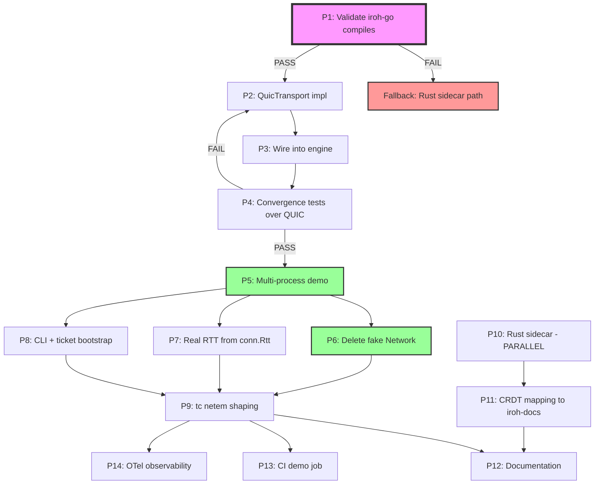

# SUPERB: Real Iroh QUIC Transport — Kill the Fake Network

> **Date:** 2026-08-04 22:16
> **Status:** PLANNING
> **Goal:** Replace the fake in-process Network with real Iroh QUIC transport via iroh-go, so every measurement is real network I/O between real OS processes.

---

## The Hard Truth (Current State)

The `metaengine/irohengine/` module contains:

- A `Network` struct that delivers messages via **goroutine function calls** (not a network)
- A `time.Sleep(rand)` that **pretends** to be network latency
- A `LatencyCollector` that measures **sleep accuracy** (not network behavior)
- Zero real Iroh code, zero real networking, zero real serialization

This is a CRDT logic validator, not a distributed engine demo. The user called BS. Correctly.

## The Solution: Real QUIC via iroh-go

`decentral1se/iroh-go` provides CGo bindings to Iroh's stable 1.0 QUIC networking:

- `EndpointBind(opts)` → create a real QUIC endpoint with NAT traversal
- `endpoint.Connect(addr, alpn)` → connect to a peer by NodeId
- `conn.OpenBi()` / `conn.AcceptBi()` → bidirectional streams (our message channel)
- **`conn.Rtt()`** → real RTT measured by QUIC's ACK timing (no fake sleeps!)
- `EndpointTicket` → share connection info between processes

This gives us real networking, real measurements, real NAT traversal — while keeping our Go CRDT logic.

---

## Pareto Breakdown

### Layer 1: The 1% that delivers 51%

| #   | Task                                          | Why                                                                                |
| --- | --------------------------------------------- | ---------------------------------------------------------------------------------- |
| P1  | **Validate iroh-go compiles on this machine** | If this fails, the entire plan pivots to Rust sidecar. Everything depends on this. |

### Layer 2: The 4% that delivers 64%

| #   | Task                                                  | Why                                          |
| --- | ----------------------------------------------------- | -------------------------------------------- |
| P2  | **QuicTransport: implement Transport over iroh-go**   | Replaces fake Network with real QUIC streams |
| P3  | **Replace fake Network with QuicTransport in engine** | All measurements become real network I/O     |
| P4  | **Run convergence tests over real QUIC**              | Prove CRDT convergence works on real network |

### Layer 3: The 20% that delivers 80%

| #   | Task                                           | Why                                                       |
| --- | ---------------------------------------------- | --------------------------------------------------------- |
| P5  | **Multi-process demo (separate OS processes)** | Proves it's real: separate processes, real IPC            |
| P6  | **Delete fake Network + time.Sleep**           | Stop the lies                                             |
| P7  | **Real latency from conn.Rtt()**               | Replace fake LatencyCollector with QUIC's own measurement |
| P8  | **CLI with ticket-based bootstrap**            | Node A creates ticket → node B joins via ticket           |
| P9  | **tc netem for real network shaping**          | Kernel-level delay/loss (not Go sleep)                    |

### Layer 4: The other 20% to reach 100%

| #   | Task                                    | Why                                              |
| --- | --------------------------------------- | ------------------------------------------------ |
| P10 | **Rust sidecar for iroh-docs CRDT**     | Full Iroh integration (separate track, optional) |
| P11 | **CRDT semantics mapping to iroh-docs** | Map our ADTs to real iroh-docs operations        |
| P12 | **Documentation & reproducibility**     | README, asciinema, nix flake demo                |
| P13 | **CI multi-process demo job**           | Automated proof it works                         |
| P14 | **Observability**                       | OTel tracing across real nodes                   |

---

## Mermaid Execution Graph



---

## Table 1: 30-100min Tasks (sorted by impact/effort)

| ID  | Phase | Task                                                                     | Impact   | Effort | Est    | Depends On |
| --- | ----- | ------------------------------------------------------------------------ | -------- | ------ | ------ | ---------- |
| T1  | 0     | Delete fake Network, custom itoa, hardcoded consts                       | High     | Low    | 30min  | —          |
| T2  | 1     | Clone iroh-go, build staticlib, prove CGo works                          | Critical | Medium | 60min  | —          |
| T3  | 1     | Write 2-process QUIC connectivity test (bind→connect→stream→echo)        | Critical | Medium | 60min  | T2         |
| T4  | 2     | Implement QuicTransport (Publish/Subscribe/Close over QUIC streams)      | Critical | High   | 100min | T3         |
| T5  | 2     | Serialize WriteOps as length-prefixed CBOR/JSON over QUIC streams        | High     | Medium | 45min  | T4         |
| T6  | 2     | Connection management: pool, reconnect, peer tracking                    | High     | High   | 90min  | T4         |
| T7  | 2     | Replace LatencyCollector with real conn.Rtt() measurements               | High     | Medium | 45min  | T4         |
| T8  | 2     | Wire QuicTransport into Replicated() engine, run convergence tests       | Critical | Medium | 60min  | T5,T6,T7   |
| T9  | 3     | Build multi-process demo: separate process per node, CLI flags           | High     | High   | 90min  | T8         |
| T10 | 3     | Implement ticket-based bootstrap (coordinator prints ticket, nodes join) | High     | Medium | 60min  | T9         |
| T11 | 3     | Real-time dashboard: per-node state, convergence status, live RTT        | Medium   | High   | 90min  | T10        |
| T12 | 4     | tc netem integration: real kernel-level delay/loss/jitter                | Medium   | Medium | 60min  | T9         |
| T13 | 4     | Offline/reconnect test: kill interface, write locally, restore, converge | Medium   | Medium | 45min  | T9         |
| T14 | 4     | Benchmark: real QUIC vs old in-process (ops/sec, latency)                | Medium   | Medium | 45min  | T9         |
| T15 | 5     | Rust sidecar: scaffold Cargo project with iroh + iroh-docs deps          | Medium   | High   | 90min  | —          |
| T16 | 5     | Sidecar gRPC: define proto, implement server, wire to iroh-docs          | Medium   | High   | 100min | T15        |
| T17 | 5     | Sidecar lifecycle: spawn, health check, crash recovery from Go           | Medium   | Medium | 60min  | T16        |
| T18 | 6     | README with real quickstart (build, run 2 processes, see convergence)    | Medium   | Low    | 30min  | T9         |
| T19 | 6     | Nix flake demo output: `nix run .#iroh-demo`                             | Medium   | Medium | 45min  | T9         |
| T20 | 6     | Update ADR-0096 with real QUIC architecture                              | Low      | Low    | 30min  | T8         |
| T21 | 6     | CI job: 2-container demo with real network between them                  | Low      | High   | 90min  | T9         |
| T22 | 6     | OTel distributed tracing across nodes                                    | Low      | Medium | 60min  | T9         |
| T23 | 0     | Run nix fmt + nix run .#verify and fix ALL failures                      | Critical | Medium | 60min  | T1         |

**Total: ~23 tasks, ~18 hours of work**

---

## Table 2: 12min Subtasks (sorted by impact/effort)

> Each subtask is max 12 minutes. Grouped by parent task.

| SubID | Parent | Subtask                                                                                        | Est   |
| ----- | ------ | ---------------------------------------------------------------------------------------------- | ----- |
| S1.1  | T1     | Delete `transport.go` Network/peerTransport/NetworkOption/WithNetworkDelay/WithNetworkDropRate | 10min |
| S1.2  | T1     | Delete `latency.go` LatencyCollector/LatencyStats/computeStats (will be replaced by conn.Rtt)  | 5min  |
| S1.3  | T1     | Replace custom `itoa()` in options.go with `strconv.Itoa`                                      | 2min  |
| S1.4  | T1     | Delete `defaultReplicationLag`/`defaultNetworkRTT` consts if still present                     | 2min  |
| S1.5  | T1     | Remove `WithReplicationLag`/`WithNetworkRTT` options (replaced by real RTT)                    | 5min  |
| S1.6  | T1     | Run `go build` to verify it compiles (will have import errors — fix)                           | 10min |
| S2.1  | T2     | `go get git.coopcloud.tech/decentral1se/iroh-go` in a scratch dir                              | 5min  |
| S2.2  | T2     | Verify CGo compiles: write 5-line main.go calling `iroh.PresetN0()`                            | 10min |
| S2.3  | T2     | Build with `CGO_ENABLED=1 go build` — check for linker errors                                  | 10min |
| S2.4  | T2     | If build fails: research musl/staticlib issues, document blocker                               | 12min |
| S2.5  | T2     | If build succeeds: note binary size, compile time, Rust dep chain                              | 5min  |
| S3.1  | T3     | Write `connectivity_test.go`: bind endpoint A, print ticket                                    | 12min |
| S3.2  | T3     | Write listener loop: AcceptNext → Accept → Connect → ready                                     | 10min |
| S3.3  | T3     | Connect from endpoint B using ticket string                                                    | 10min |
| S3.4  | T3     | Open BiStream A→B, send 4 bytes, verify B receives                                             | 10min |
| S3.5  | T3     | Open BiStream B→A, send 4 bytes, verify A receives                                             | 10min |
| S3.6  | T3     | Read `conn.Rtt()` on both sides, print real RTT                                                | 5min  |
| S3.7  | T3     | Close both endpoints, verify clean shutdown                                                    | 5min  |
| S4.1  | T4     | Create `quic_transport.go` with `QuicTransport` struct                                         | 10min |
| S4.2  | T4     | Implement `QuicTransport.Bind(alpn)` — bind endpoint, start accept loop                        | 12min |
| S4.3  | T4     | Implement `QuicTransport.Connect(ticket)` — connect to peer                                    | 10min |
| S4.4  | T4     | Implement `QuicTransport.Publish(ctx, op)` — open stream, send op                              | 12min |
| S4.5  | T4     | Implement accept loop: AcceptBi → read op → dispatch to subscribers                            | 12min |
| S4.6  | T4     | Implement `QuicTransport.Subscribe(handler)` — subscriber list                                 | 5min  |
| S4.7  | T4     | Implement `QuicTransport.Close()` — close all connections + endpoint                           | 8min  |
| S4.8  | T4     | Add `//go:build cgo` guard to quic_transport.go                                                | 2min  |
| S5.1  | T5     | Choose encoding: CBOR (compact, already in repo) or JSON (debuggable)                          | 5min  |
| S5.2  | T5     | Implement `encodeOp(op WriteOp) []byte` with length prefix                                     | 10min |
| S5.3  | T5     | Implement `decodeOp(data []byte) (WriteOp, error)`                                             | 10min |
| S5.4  | T5     | Wire encode/decode into Publish/accept loop                                                    | 10min |
| S5.5  | T5     | Test: round-trip a WriteOp through encode→decode                                               | 5min  |
| S6.1  | T6     | Track connected peers in `map[EndpointId]*Connection`                                          | 8min  |
| S6.2  | T6     | Implement `broadcast(op)` — send to all connected peers in parallel                            | 10min |
| S6.3  | T6     | Handle publish when no peers connected (queue or drop?)                                        | 10min |
| S6.4  | T6     | Implement connection loss detection (stream error → mark dead)                                 | 12min |
| S6.5  | T6     | Implement reconnect on connection loss                                                         | 12min |
| S6.6  | T6     | Add mutex for peer map (thread-safe add/remove/broadcast)                                      | 8min  |
| S7.1  | T7     | Call `conn.Rtt()` after each successful Publish                                                | 5min  |
| S7.2  | T7     | Store rolling window of RTT samples per peer                                                   | 10min |
| S7.3  | T7     | Implement `QuicTransport.LatencySnapshot()` returning real P50/P99                             | 10min |
| S7.4  | T7     | Wire LatencyProvider into engine Profile()                                                     | 5min  |
| S8.1  | T8     | Create `irohengine.ReplicatedWithQuic(local, opts)` constructor                                | 10min |
| S8.2  | T8     | Create separate `go.mod` for CGo module: `irohengine/quic`                                     | 10min |
| S8.3  | T8     | Run existing convergence tests against QuicTransport                                           | 12min |
| S8.4  | T8     | Fix any convergence failures (timing, ordering, encoding bugs)                                 | 12min |
| S8.5  | T8     | Run with `-race -count=3` to verify stability                                                  | 10min |
| S9.1  | T9     | Create `demo/coordinator.go` — bind, print ticket, wait for nodes                              | 12min |
| S9.2  | T9     | Create `demo/node.go` — parse ticket, connect, write data                                      | 12min |
| S9.3  | T9     | Implement CLI: `go run . coordinator` / `go run . node --ticket=...`                           | 10min |
| S9.4  | T9     | Coordinator writes 10 Map keys, nodes verify they see them                                     | 10min |
| S9.5  | T9     | Nodes write concurrently, coordinator verifies convergence                                     | 10min |
| S9.6  | T9     | Print real RTT measurements from conn.Rtt()                                                    | 5min  |
| S9.7  | T9     | Print convergence time (write → all nodes confirmed)                                           | 8min  |
| S10.1 | T10    | Coordinator generates `EndpointTicket` and prints as base32                                    | 8min  |
| S10.2 | T10    | Node CLI parses ticket string via `EndpointTicketFromString`                                   | 8min  |
| S10.3 | T10    | Node connects via ticket, coordinator detects new peer                                         | 10min |
| S10.4 | T10    | Late joiner: node C joins after A+B have written 20 keys                                       | 10min |
| S10.5 | T10    | Late joiner receives all historical writes (sync)                                              | 12min |
| S11.1 | T11    | Choose TUI library: tview (simpler) or bubbletea (fancier)                                     | 5min  |
| S11.2 | T11    | Layout: node table (name, status, RTT, ops received)                                           | 12min |
| S11.3 | T11    | Live update: refresh every 500ms                                                               | 8min  |
| S11.4 | T11    | Show convergence indicator: green when all nodes see all keys                                  | 10min |
| S11.5 | T11    | Show op log: scrolling list of recent operations                                               | 10min |
| S12.1 | T12    | Write shell script applying `tc netem delay 50ms` to loopback                                  | 8min  |
| S12.2 | T12    | Run demo under tc netem, capture latency, compare to baseline                                  | 10min |
| S12.3 | T12    | Add `tc netem loss 5%` — verify eventual convergence despite drops                             | 10min |
| S12.4 | T12    | Document tc netem cleanup (`tc qdisc del dev lo root`)                                         | 5min  |
| S13.1 | T13    | Write test: node B disconnects (close endpoint), A keeps writing                               | 10min |
| S13.2 | T13    | Node B reconnects, verify it catches up                                                        | 12min |
| S13.3 | T13    | Measure catch-up time as function of missed ops                                                | 10min |
| S14.1 | T14    | Write benchmark: 1000 MapSet ops, measure total time                                           | 10min |
| S14.2 | T14    | Compare: QuicTransport vs in-process function call                                             | 10min |
| S14.3 | T14    | Report: ops/sec, avg latency, P99 latency                                                      | 5min  |
| S15.1 | T15    | `cargo init sidecar` with iroh, iroh-docs, iroh-blobs, iroh-gossip deps                        | 10min |
| S15.2 | T15    | Implement sidecar main: bind endpoint, create Docs protocol, print ticket                      | 12min |
| S15.3 | T15    | Test sidecar standalone: create doc, set bytes, get bytes                                      | 12min |
| S16.1 | T16    | Define `proto/crdt.proto` with MapSet/SetAdd/CounterInc/etc RPCs                               | 10min |
| S16.2 | T16    | Generate Go + Rust code from proto                                                             | 8min  |
| S16.3 | T16    | Implement gRPC server in Rust sidecar                                                          | 12min |
| S16.4 | T16    | Implement gRPC client in Go (tonic equivalent)                                                 | 12min |
| S16.5 | T16    | Wire Go client to our Transport interface                                                      | 10min |
| S17.1 | T17    | Go sidecar manager: Spawn(path), Wait, Kill                                                    | 10min |
| S17.2 | T17    | Health check: ping sidecar gRPC every 1s, timeout = dead                                       | 8min  |
| S17.3 | T17    | Crash recovery: detect dead → respawn → reconnect → resync                                     | 12min |
| S18.1 | T18    | Write README.md: prerequisites (Rust toolchain, CGo), build steps                              | 10min |
| S18.2 | T18    | Write quickstart: 2-terminal demo (coordinator + node)                                         | 10min |
| S18.3 | T18    | Add "How to verify this is real" section (ss/netstat shows UDP port)                           | 8min  |
| S19.1 | T19    | Add `packages.iroh-demo` to flake.nix — builds Rust sidecar + Go demo                          | 12min |
| S19.2 | T19    | Add `apps.iroh-demo` to flake.nix — `nix run .#iroh-demo`                                      | 8min  |
| S20.1 | T20    | Rewrite ADR-0096: replace "mock prototype" with real architecture                              | 12min |
| S21.1 | T21    | CI: docker-compose with 2 containers, real network, convergence test                           | 12min |
| S22.1 | T22    | Add OTel span around Publish (trace ID flows with WriteOp)                                     | 10min |
| S22.2 | T22    | Add OTel span around applyRemote (child span, link parent)                                     | 10min |
| S23.1 | T23    | Run `nix fmt` on all irohengine files                                                          | 5min  |
| S23.2 | T23    | Run `nix run .#verify` — document every failure                                                | 12min |
| S23.3 | T23    | Fix gosec G404 nolint for math/rand (if any remain)                                            | 5min  |
| S23.4 | T23    | Regen api-stability golden                                                                     | 5min  |
| S23.5 | T23    | Re-run verify until green                                                                      | 12min |

**Total: ~100 subtasks**

---

## Risk Assessment

| Risk                                        | Probability | Impact                        | Mitigation                                                           |
| ------------------------------------------- | ----------- | ----------------------------- | -------------------------------------------------------------------- |
| iroh-go doesn't compile on this machine     | Medium      | Critical (blocks entire plan) | T2 is the first gate. If it fails, pivot to Rust sidecar path.       |
| iroh-go Linux-only (no macOS)               | High        | Medium                        | Document platform limitation. CI runs Linux. macOS devs use sidecar. |
| QUIC streams are too slow for our op volume | Low         | Medium                        | Benchmark (T14). QUIC datagrams as fallback for small ops.           |
| NAT traversal fails in demo environment     | Medium      | Low                           | Relay fallback is built into Iroh. Document both paths.              |
| CGo makes the build fragile                 | Medium      | Medium                        | Isolate in own module with `//go:build cgo`. Same pattern as duckdb. |

---

## Critical Path

```
T2 (iroh-go compiles) → T3 (2-process QUIC test) → T4 (QuicTransport) → T8 (convergence over QUIC) → T9 (demo)
```

If T2 fails, the plan pivots to the Rust sidecar path (T15-T17), which is more work but doesn't depend on iroh-go's CGo quality.

The cleanup tasks (T1, T23) can run in parallel with the critical path.

---

## What This Plan Does NOT Do (Intentionally)

- No authentication/authorization (QUIC TLS is enough for demo)
- No encryption-at-rest (iroh-docs handles blob storage)
- No SLO alerting (premature for a prototype)
- No schema migration (WriteOp format is stable for the demo)
- No custom Grafana dashboards (OTel + Prometheus is enough)
- No mobile network testing (nice-to-have, not core)
