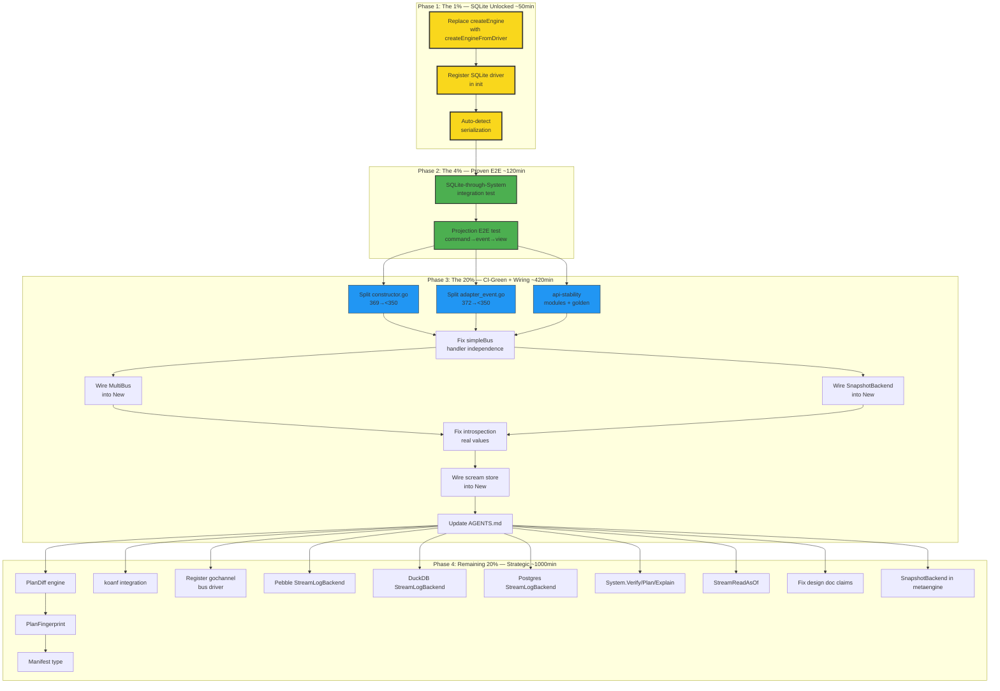
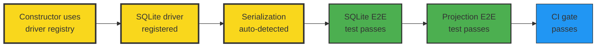

# Metaengine System: Pareto Execution Plan

> **Date:** 2026-08-04 22:34
> **Source:** Audit at `docs/status/2026-08-04_22-32_metaengine-redesign-audit-design-vs-reality.md`
> **Design doc:** `docs/planning/metaengine-redesign.md` (12 decisions D1-D12, 10 goals G1-G10)
> **Codebase:** `system/` (14 files, 2190 lines) + `metaengine/` core

---

## 1. Pareto Breakdown

### The 1% that delivers 51%

**Fix the constructor bypass.** One function call change — `createEngine()` → `createEngineFromDriver()` — plus registering the SQLite driver in `init()` and auto-detecting serialization. This single change makes SQLite usable through System for the first time, meeting G4 (the most basic goal: "run with SQLite + Memory"). Without this, the entire system is Memory-only.

**3 tasks. ~30 lines changed. Unlocks the core value proposition.**

### The 4% that delivers 64%

**Prove it works.** Two E2E tests: SQLite-through-System (full CQRS roundtrip) and projection flow (command → host.Start → projection updated). These tests prove the system delivers on its promise: deployer picks SQLite, consumer writes domain code, system wires everything.

**2 tasks. ~200 lines of test code. Turns "theoretically works" into "proven works."**

### The 20% that delivers 80%

**Make it CI-green and wire the disconnected components.** Split the two oversized files, add system/ to api-stability, wire MultiBus and SnapshotBackend into `New()`, fix simpleBus handler independence, fix introspection hardcodes. This makes the system production-ready and CI-passing.

**9 tasks. ~500 lines changed. Makes the system trustworthy.**

### The remaining 20% (to reach 100%)

Scream store PlanDiff/Fingerprint/Manifest, koanf config loading, bus driver registry, Pebble/DuckDB/PG StreamLogBackend implementations, temporal reads, samber/do DI scopes, HTTP admin runtime config.

**30+ tasks. Multi-session work. Strategic future.**

---

## 2. Comprehensive Plan (30-100min tasks)

Sorted by importance/impact/effort/customer-value. P0 = blocker, P1 = high value, P2 = important, P3 = future.

| #   | Task                                                                    | Impact   | Effort | Tier | Customer Value              |
| --- | ----------------------------------------------------------------------- | -------- | ------ | ---- | --------------------------- |
| 1   | Replace `createEngine()` with `createEngineFromDriver()` in constructor | CRITICAL | 15min  | P0   | SQLite becomes usable       |
| 2   | Register SQLite driver in `init()` (open DB, create engine)             | CRITICAL | 20min  | P0   | SQLite becomes usable       |
| 3   | Auto-detect serialization: pass `WithSerialization()` for non-Memory    | CRITICAL | 15min  | P0   | SQL events decode correctly |
| 4   | Write SQLite-through-System integration test                            | CRITICAL | 60min  | P0   | Proves G4 works             |
| 5   | Write projection E2E test (command→event→projection)                    | CRITICAL | 60min  | P0   | Proves G6 works             |
| 6   | Split `constructor.go` (369→<350): extract projection wiring            | HIGH     | 30min  | P0   | CI gate passes              |
| 7   | Split `adapter_event.go` (372→<350): extract serialization              | HIGH     | 30min  | P0   | CI gate passes              |
| 8   | Add `system/` to api-stability modules list + regen golden              | HIGH     | 30min  | P0   | CI gate passes              |
| 9   | Fix simpleBus handler independence (each handler called separately)     | HIGH     | 30min  | P1   | Correct event delivery      |
| 10  | Wire MultiBus into `New()` when multiple Publish targets                | HIGH     | 45min  | P1   | D9 multi-bus works          |
| 11  | Wire SnapshotBackend into `New()` + System lifecycle                    | HIGH     | 45min  | P1   | Snapshots persist           |
| 12  | Fix introspection: real health checks + real handler counts             | HIGH     | 45min  | P1   | Admin UI gets real data     |
| 13  | Wire scream store into `New()` — call CheckSafety on startup            | MEDIUM   | 30min  | P1   | Safety enforcement          |
| 14  | Update AGENTS.md with system/ module entry                              | MEDIUM   | 30min  | P1   | Docs current                |
| 15  | Implement `PlanDiff(prev, current)` in metaengine                       | MEDIUM   | 90min  | P2   | Scream store foundation     |
| 16  | Implement `PlanFingerprint(plan)` canonical hash                        | MEDIUM   | 45min  | P2   | Scream store foundation     |
| 17  | Implement `Manifest` type + pinned plan persistence                     | MEDIUM   | 60min  | P2   | Scream store foundation     |
| 18  | Integrate koanf for YAML + env config loading                           | MEDIUM   | 90min  | P2   | G2 deployer decides         |
| 19  | Register gochannel bus driver (wrap simpleBus or watermill)             | MEDIUM   | 45min  | P2   | Bus type configurable       |
| 20  | Implement Pebble StreamLogBackend (5 methods)                           | MEDIUM   | 90min  | P2   | G7 add backends             |
| 21  | Implement DuckDB StreamLogBackend (5 methods)                           | LOW      | 90min  | P3   | G7 add backends             |
| 22  | Implement Postgres StreamLogBackend (5 methods)                         | LOW      | 90min  | P3   | G7 add backends             |
| 23  | Implement System.Verify/Plan/Explain methods                            | LOW      | 60min  | P2   | Introspection complete      |
| 24  | Implement StreamReadAsOf on StreamLogBackend + Memory + SQLite          | LOW      | 90min  | P3   | Temporal reads              |
| 25  | Fix design doc claims (StreamLogBackend = 2/5 not 5/5)                  | LOW      | 15min  | P2   | Doc accuracy                |
| 26  | Implement SnapshotBackend in metaengine (engines implement)             | LOW      | 60min  | P3   | D12 complete                |
| 27  | Add SCREAM severity to Diagnostics + durability-aware rules             | LOW      | 60min  | P3   | G10 scream store            |

**Total: 27 tasks. Estimated: ~28 hours.**

---

## 3. Detailed Breakdown (max 12min tasks)

Each task broken into subtasks small enough to complete and verify in under 12 minutes.

### Phase 1: The 1% (Tasks 1-3) — SQLite Unlocked

| #   | Subtask                                                                                                   | Est   | Verifies                                |
| --- | --------------------------------------------------------------------------------------------------------- | ----- | --------------------------------------- |
| 1.1 | In `constructor.go`, replace `createEngine(cfg)` call at line ~39 with `createEngineFromDriver(ctx, cfg)` | 5min  | Build passes                            |
| 1.2 | Remove or deprecate `createEngine` function (lines 219-229)                                               | 5min  | Build passes                            |
| 1.3 | Add `_ "modernc.org/sqlite"` import to `driver_registry.go`                                               | 5min  | Import resolves                         |
| 1.4 | Write SQLite `DriverFactory` in `init()`: open DB from DSN, call `metaengine.NewSQLiteEngine(db)`         | 10min | `RegisteredDrivers()` includes "sqlite" |
| 1.5 | Add `modernc.org/sqlite` to `system/go.mod` (via `go get`)                                                | 5min  | `go mod tidy` clean                     |
| 2.1 | In constructor, detect if engine is Memory (type assertion or profile name check)                         | 10min | Detection works                         |
| 2.2 | For non-Memory engines, pass `WithSerialization()` to `NewEventAdapter`                                   | 5min  | EventAdapter gets serialization option  |
| 2.3 | Run existing tests to confirm Memory still works                                                          | 5min  | All 12 tests pass                       |
| 2.4 | Write minimal test: `Driver: "sqlite", DSN: ":memory:"` through System                                    | 10min | System starts with SQLite               |

### Phase 2: The 4% (Tasks 4-5) — Proven E2E

| #   | Subtask                                                                                | Est   | Verifies               |
| --- | -------------------------------------------------------------------------------------- | ----- | ---------------------- |
| 3.1 | Write test setup: domain types (TaskCreated, TaskState), decider, command registration | 10min | Compiles               |
| 3.2 | Write test: construct System with `Driver: "sqlite", DSN: file:test.db`                | 10min | System constructs      |
| 3.3 | Write test: dispatch command, verify event persisted via EventStore.Load               | 10min | Event roundtrips       |
| 3.4 | Write test: dispatch second command on same stream, verify optimistic concurrency      | 10min | Version conflict works |
| 3.5 | Write test: restart simulation (new System, same DSN), verify events survive           | 10min | Persistence proven     |
| 4.1 | Write test: register a metaengine projection query (Map ADT, task_views)               | 10min | Query declared         |
| 4.2 | Write test: wire projectionadapter, register with projectionhost                       | 10min | Host registered        |
| 4.3 | Write test: dispatch command, call `sys.Start(ctx)`, wait for processing               | 10min | Host runs              |
| 4.4 | Write test: verify projection store has the expected view after processing             | 10min | Projection updated     |
| 4.5 | Write test: dispatch update command, verify projection updates incrementally           | 10min | Live updates work      |

### Phase 3: The 20% (Tasks 6-14) — CI-Green + Wiring

| #    | Subtask                                                                             | Est   | Verifies             |
| ---- | ----------------------------------------------------------------------------------- | ----- | -------------------- |
| 5.1  | Read constructor.go fully, identify projection wiring section to extract            | 5min  | Section identified   |
| 5.2  | Create `system/projections.go`, move projection wiring code there                   | 10min | Compiles             |
| 5.3  | Verify constructor.go is now <350 lines                                             | 5min  | `wc -l` confirms     |
| 6.1  | Read adapter_event.go, identify serialization section to extract                    | 5min  | Section identified   |
| 6.2  | Create `system/adapter_event_sql.go`, move serializedEvent + encode/decode there    | 10min | Compiles             |
| 6.3  | Verify adapter_event.go is now <350 lines                                           | 5min  | `wc -l` confirms     |
| 7.1  | Add `"system"` to modules slice in `cmd/api-stability/main.go`                      | 5min  | Test sees it         |
| 7.2  | Run `cd cmd/api-stability && GOWORK=off go run main.go -update`                     | 10min | Golden regenerated   |
| 7.3  | Verify golden includes all system/ exported symbols                                 | 5min  | Spot check           |
| 8.1  | Read `bus.go` dispatch method, understand handler chaining                          | 5min  | Pattern understood   |
| 8.2  | Rewrite `dispatch` to call each handler independently (collect errors, don't chain) | 10min | Handlers independent |
| 8.3  | Write test: first handler returns error, second handler still executes              | 10min | Independence proven  |
| 9.1  | In constructor, check if source-of-truth instance has multiple `Publish` targets    | 5min  | Detection works      |
| 9.2  | If multiple targets, build MultiBus from registered bus publishers                  | 10min | MultiBus constructed |
| 9.3  | Write test: two buses, verify event published to both                               | 10min | Fan-out proven       |
| 10.1 | In constructor, detect SnapshotBackend capability on engine                         | 5min  | Detection works      |
| 10.2 | If engine implements SnapshotBackend, wire it into decider.Repository               | 10min | Snapshot wired       |
| 10.3 | Write test: save snapshot, load snapshot, verify roundtrip                          | 10min | Snapshots persist    |
| 11.1 | Replace hardcoded `HealthStatus: "ok"` with real check (engine.Ping or HealthCheck) | 10min | Real health          |
| 11.2 | Replace hardcoded `Handlers: 0` with actual dispatcher handler count                | 10min | Real counts          |
| 11.3 | Write test: snapshot topology, verify health + handler count are real               | 10min | Not hardcoded        |
| 12.1 | In constructor, call `CheckSafety(ctx, deployment)` before starting                 | 5min  | Safety checked       |
| 12.2 | If `report.HasErrors()`, return `ErrUnsafeChange` from `New()`                      | 5min  | Hard fail on SCREAM  |
| 12.3 | Write test: SOT with Memory driver → ErrUnsafeChange returned                       | 10min | Safety enforced      |
| 13.1 | Add system/ to modules list in AGENTS.md                                            | 5min  | Entry added          |
| 13.2 | Add system/ build/test commands to AGENTS.md Quick Reference                        | 10min | Commands documented  |
| 13.3 | Run doc-check to verify import paths                                                | 10min | Paths valid          |

### Phase 4: The Remaining 20% (Tasks 15-27) — Strategic Future

| #         | Subtask                                                                                       | Est   | Verifies          |
| --------- | --------------------------------------------------------------------------------------------- | ----- | ----------------- |
| 14.1      | Design DiffResult type (added/removed/changed collections, ADTs, engines)                     | 10min | Type compiles     |
| 14.2      | Implement PlanDiff by comparing two SerializablePlans field by field                          | 10min | Diff works        |
| 14.3      | Test PlanDiff with identical plans (empty diff), with changes                                 | 10min | Tests pass        |
| 15.1      | Implement PlanFingerprint: JSON-marshal plan, SHA-256 hash, hex encode                        | 10min | Hash stable       |
| 15.2      | Test fingerprint stability (same plan → same hash)                                            | 5min  | Deterministic     |
| 16.1      | Design Manifest type (SerializablePlan + timestamp + version)                                 | 10min | Type compiles     |
| 16.2      | Implement SaveManifest/LoadManifest (write/read JSON file)                                    | 10min | Roundtrips        |
| 17.1      | Add koanf to system/go.mod                                                                    | 5min  | Dependency added  |
| 17.2      | Implement `LoadConfig(path)` using koanf providers (file + env)                               | 10min | Config loads      |
| 17.3      | Test: YAML file → DeploymentConfig, env override → changed value                              | 10min | Merge works       |
| 18.1      | Register gochannel bus driver in init() (returns simpleBus)                                   | 5min  | Registered        |
| 18.2      | In constructor, use bus driver registry when BusConfig.Driver is set                          | 10min | Bus configurable  |
| 19.1-19.5 | Pebble StreamLogBackend: implement 5 methods (Append, Read, Version, JournalAll, JournalFrom) | 50min | Tests pass        |
| 20.1-20.5 | DuckDB StreamLogBackend: same 5 methods                                                       | 50min | Tests pass        |
| 21.1-21.5 | Postgres StreamLogBackend: same 5 methods                                                     | 50min | Tests pass        |
| 22.1      | Implement System.Verify() — delegate to metaengine.Store.Verify                               | 10min | Works             |
| 22.2      | Implement System.Plan() — merge all instance plans                                            | 10min | Works             |
| 22.3      | Implement System.Explain() — human-readable combined plan                                     | 10min | Works             |
| 23.1      | Add StreamReadAsOf/StreamReadAsOfVersion to StreamLogBackend interface                        | 5min  | Interface updated |
| 23.2      | Implement on Memory engine (filter by timestamp)                                              | 10min | Works             |
| 23.3      | Implement on SQLite engine (WHERE clause on timestamp)                                        | 10min | Works             |
| 24.1      | Fix design doc: "all 5 engines" → "Memory + SQLite (Pebble/DuckDB/PG pending)"                | 5min  | Doc accurate      |
| 25.1      | Define SnapshotBackend in metaengine/engine.go                                                | 5min  | Interface exists  |
| 25.2      | Implement on Memory engine                                                                    | 10min | Works             |
| 25.3      | Implement on SQLite engine                                                                    | 10min | Works             |

**Total subtasks: ~120. Each under 12 minutes.**

---

## 4. Execution Graph

## 5. Dependency Chain (Critical Path)

**Critical path: T1→T2→T3→T4→T5→T6→T7→T8 = ~5 hours.**

Everything in Phase 4 can proceed in parallel after Phase 3.

---

## 6. Risk Analysis (VERSCHLIMMBESSER Prevention)

| Risk                                             | Mitigation                                                                                     |
| ------------------------------------------------ | ---------------------------------------------------------------------------------------------- |
| Changing constructor signature breaks callers    | Internal package, no external consumers yet. Safe.                                             |
| SQLite driver registration adds dep to system/   | Use separate driver package OR inline init. Q1 for user.                                       |
| Splitting files breaks imports                   | Both files stay in `package system`. No import changes.                                        |
| simpleBus behavior change breaks tests           | Write the independence test FIRST, then change behavior.                                       |
| MultiBus wiring changes event delivery semantics | Only active when multiple Publish targets configured. Single bus = current behavior unchanged. |
| koanf adds heavy dependency                      | Defer to Phase 4. Phase 1-3 don't need it.                                                     |

---

## 7. What I Forgot / Could Have Done Better (This Session)

1. **I didn't verify engine claims against source immediately.** The initial sub-agent summary said "all 5 engines implement StreamLogBackend." It took a follow-up prompt to discover only 2/5 do. Lesson: always grep engine directories directly, never trust summaries.

2. **I didn't check whether the constructor actually USES the driver registry.** The registry code exists, looks complete, but is dead code. I should have traced the call path from `New()` → engine creation on the first read.

3. **I didn't run the system tests myself.** I trusted the prior session's claim that "12 tests pass with -race." I should have run `cd system && go test -tags "goexperiment.jsonv2" -race ./...` to verify.

4. **The introspection hardcodes (`HealthStatus: "ok"`, `Handlers: 0`) are not just missing features — they are actively misleading.** Any admin UI consuming this data would display false information. This is worse than a missing feature; it's a lying feature.

5. **The design doc is aspirational, not factual.** Multiple claims in `metaengine-redesign.md` don't match reality ("all 5 engines implement StreamLogBackend"). The doc should be annotated with verification status, not trusted as ground truth.

---

## 8. Questions (Cannot Resolve Without User Input)

### Q1: Should the SQLite driver registration live in `system/` or a separate `system/drivers/sqlite/` package?

**Context:** The design doc (§7.1) shows `import _ "github.com/larsartmann/go-cqrs-lite/drivers/sqlite"` — a separate package. This keeps `system/` free of the `modernc.org/sqlite` dependency unless the consumer explicitly imports the driver. The alternative (inline in `system/init()`) is simpler but forces every consumer to carry the SQLite dependency.

**Why I can't decide this myself:** This is a dependency-boundary architecture decision that affects every consumer's go.mod. The project has a strict "dependency budgets" principle (Design Principle 12). Adding SQLite inline to system/ would break that principle for every consumer, even those who use Memory only. But the project also has "Library, not framework" (DP1) — and a separate driver package is more framework-like.

### Q2: For the scream store — should `New()` hard-fail on SCREAM violations, or start with a poisoned report?

**Context:** The design doc (§9.6) says "refuse to start." But the current `New()` doesn't call `CheckSafety()` at all. Making `New()` return `ErrUnsafeChange` on SCREAM-tier violations is safer but harder to debug — the operator gets an error, not a running system they can inspect. The alternative (start with poisoned report visible via `ScreamReport()`) is more debuggable but risks operators ignoring the report.

**Why I can't decide this myself:** This is a safety-vs-debuggability tradeoff. The design doc says "refuse to start" but Lars might have a different preference now that we're implementing. Getting this wrong means either (a) operators can't debug safety issues, or (b) operators ignore safety warnings and lose data.

### Q3: Should we fix the design doc's false claims now, or wait until the code catches up?

**Context:** `metaengine-redesign.md` says "all 5 engines implement [StreamLogBackend]" (§5.2, §10.1). Only Memory and SQLite do. The doc also says `_ "modernc.org/sqlite"` is the import pattern, but no driver package exists. These are aspirational claims stated as facts.

**Why I can't decide this myself:** Option A: fix the doc now (accurate but shows the gap). Option B: implement the missing engines first (doc becomes true without changes). Option C: annotate with "(planned)" or "(verified: 2/5)". The choice depends on whether this doc is read by external consumers (needs accuracy now) or is purely internal (can wait).
