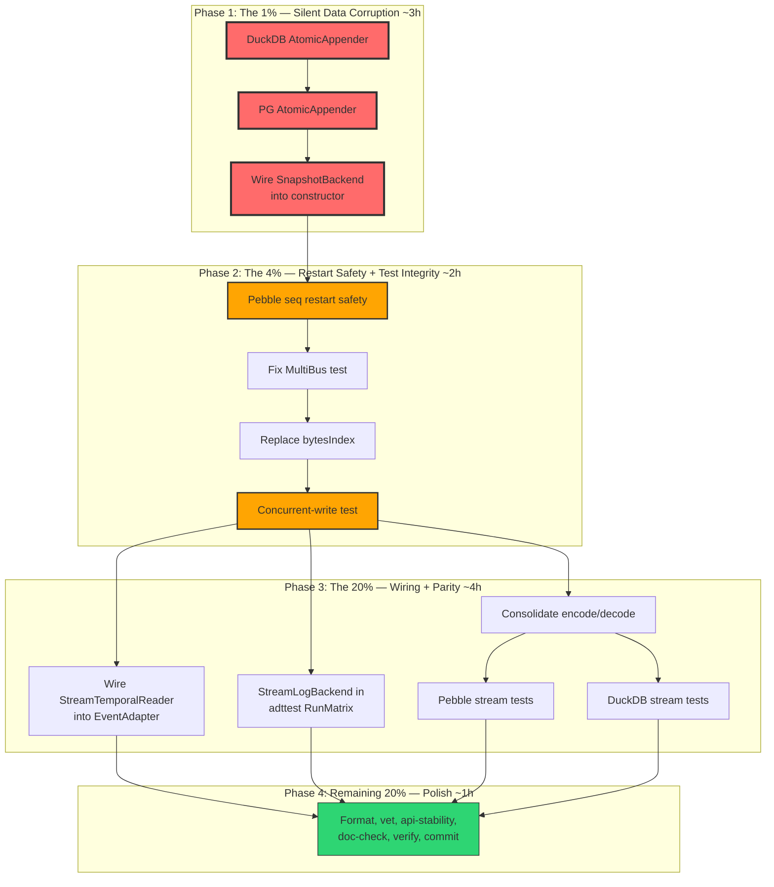

# Metaengine System: Critical Fixes & Hardening Plan

> **Date:** 2026-08-04 23:56
> **Source:** Status report at `docs/status/2026-08-04_23-52_metaengine-system-pareto-completion-report.md`
> **Codebase:** `system/` (332 lines constructor) + `metaengine/` core + 5 engine modules

---

## 1. Pareto Breakdown

### The 1% that delivers 51%

**Fix the silent data corruption bugs.** Two bugs where the system LOOKS correct but silently corrupts data:

1. **D2: DuckDB/PG missing AtomicAppender** — Concurrent writes silently interleave events (TOCTOU race at `adapter_event.go:107-116`). The adapter falls through to a non-atomic version-check-then-append path. This is invisible until data is lost.
2. **D1: SnapshotBackend not wired into constructor** — The interface exists, implementations exist, but `constructor.go` never passes it to `decider.NewRepository`. Snapshots silently don't work through System.

**6 tasks. ~200 lines changed. Eliminates silent data corruption.**

### The 4% that delivers 64%

**Above + fix restart safety + fix the lying tests:**

3. **D3: Pebble seq restart safety** — All seq counters reset to 0 on restart. On a persistent on-disk DB, new writes collide with existing keys. Fix: lazy-seed from max existing key.
4. **D4: Fix MultiBus test** — Test subscribes on local bus, not fan-out buses. Doesn't actually test what it claims.
5. **D5: Replace bytesIndex** — 30 lines of hand-rolled `bytes.Index`.

**5 tasks. ~100 lines changed. Makes the system restart-safe and test-honest.**

### The 20% that delivers 80%

**Above + wire temporal reads + cross-engine test parity + cleanup:**

6. Wire `StreamTemporalReader` into `adapter_event.go` (optimizes `LoadFromVersion`)
7. Add `StreamLogBackend` to `adttest.RunMatrix` for cross-engine parity
8. Consolidate `encodeStreamValue` / `decodeStreamValue` helpers
9. Write StreamLogBackend tests for Pebble, DuckDB, PG engines
10. Write real E2E snapshot + concurrency tests

**8 tasks. ~500 lines changed. Makes the system trustworthy.**

### The remaining 20% (to reach 100%)

Documentation, formatting, verify gate, api-stability regen, git commit.

---

## 2. Comprehensive Plan (30-100min tasks)

Sorted by importance/impact/effort/customer-value. P0 = data corruption, P1 = restart safety, P2 = completeness, P3 = polish.

| # | Task | Impact | Effort | Tier | Customer Value |
|---|------|--------|--------|------|----------------|
| 1 | Implement `StreamAppendExpected` (AtomicAppender) on DuckDB | CRITICAL | 30min | P0 | No silent data loss on DuckDB |
| 2 | Implement `StreamAppendExpected` (AtomicAppender) on Postgres | CRITICAL | 30min | P0 | No silent data loss on PG |
| 3 | Wire SnapshotBackend into `system/constructor.go` | CRITICAL | 45min | P0 | Snapshots actually work |
| 4 | Fix Pebble stream+journal seq restart safety (lazy seed) | HIGH | 45min | P1 | Restart doesn't corrupt data |
| 5 | Fix MultiBus test to verify actual fan-out delivery | HIGH | 30min | P1 | Tests stop lying |
| 6 | Replace `bytesIndex` with `bytes.Index` in Pebble | LOW | 10min | P1 | Remove 30 lines dead code |
| 7 | Write concurrent-write race test (AtomicAppender) | HIGH | 45min | P1 | Proves optimistic concurrency works |
| 8 | Wire `StreamTemporalReader` into `adapter_event.go` | MEDIUM | 45min | P2 | Efficient LoadFromVersion |
| 9 | Add StreamLogBackend to `adttest.RunMatrix` | MEDIUM | 60min | P2 | Cross-engine parity enforced |
| 10 | Consolidate encode/decode helpers across engine modules | LOW | 30min | P2 | DRY, less duplication |
| 11 | Write StreamLogBackend tests for Pebble engine | MEDIUM | 45min | P2 | Pebble streams verified |
| 12 | Write StreamLogBackend tests for DuckDB engine | MEDIUM | 45min | P2 | DuckDB streams verified |
| 13 | Run doc-check, format, verify gate, api-stability, commit | MEDIUM | 60min | P3 | CI green, docs accurate |

**Total: 13 tasks. Estimated: ~8.5 hours.**

---

## 3. Detailed Breakdown (max 12min tasks)

### Phase 1: The 1% — Silent Data Corruption Fixes

| # | Subtask | Est | Verifies |
|---|---------|-----|----------|
| 1.1 | Read `metaengine/duckdbengine/engine.go` — understand tx patterns, mu locking | 5min | Pattern understood |
| 1.2 | Implement `StreamAppendExpected` on duckdbEngine: `e.mu.Lock()` + `BeginTx` + `SELECT COUNT` + version check + `INSERT` + `COMMIT` | 10min | Compiles |
| 1.3 | Add `_ metaengine.AtomicAppender = (*duckdbEngine)(nil)` compile-time assertion | 2min | Assertion passes |
| 1.4 | Write DuckDB AtomicAppender test: append 3, attempt expected=2 (fails), attempt expected=3 (succeeds) | 10min | Test passes with `-race` |
| 2.1 | Read `metaengine/pgengine/engine.go` — understand tx patterns | 5min | Pattern understood |
| 2.2 | Implement `StreamAppendExpected` on pgEngine: `BeginTx` + `SELECT COUNT` + version check + `INSERT` + `COMMIT` | 10min | Compiles |
| 2.3 | Add `_ metaengine.AtomicAppender = (*pgEngine)(nil)` compile-time assertion | 2min | Assertion passes |
| 2.4 | Write PG AtomicAppender test (skip if no PG available, like existing PG tests) | 10min | Compiles, skip-clean |
| 3.1 | Read `decider/options.go` — confirm `WithSnapshotStore` takes `snapshot.SnapshotStore` | 3min | Signature confirmed |
| 3.2 | Read `snapshot/snapshot.go` — confirm `SnapshotStore` interface (Save/Load/Delete) | 3min | Interface understood |
| 3.3 | Design `SnapshotAdapter`: wraps `metaengine.SnapshotBackend` as `snapshot.SnapshotStore` | 5min | Design clear |
| 3.4 | Implement `system/snapshot_adapter.go` — type that implements `snapshot.SnapshotStore` by delegating to `metaengine.SnapshotBackend` | 10min | Compiles |
| 3.5 | In `constructor.go` `RegisterDecider`: type-assert engine for `SnapshotBackend`, create adapter, pass via `decider.WithSnapshotStore` | 10min | Compiles |
| 3.6 | Write test: System with SQLite engine, dispatch commands, verify snapshots saved/loaded | 10min | Test passes |

### Phase 2: The 4% — Restart Safety + Test Integrity

| # | Subtask | Est | Verifies |
|---|---------|-----|----------|
| 4.1 | Read Pebble `NewPebbleEngine` constructor — understand init flow | 3min | Flow understood |
| 4.2 | Implement `seedStreamSeqs` method: scan `sl\x00` prefix, for each (col,sid) find max seq, seed `streamSeq` counter | 10min | Compiles |
| 4.3 | Implement `seedJournalSeq` method: scan `jl\x00` prefix per col, find max gseq, seed `journalSeq` | 10min | Compiles |
| 4.4 | Call both seed methods from `NewPebbleEngine` and `NewPebbleEngineFromDB` when DB is persistent (dir != "") | 5min | Called on construction |
| 4.5 | Write test: append events → close engine → reopen → append more → verify no key collision | 10min | Test passes |
| 5.1 | Read `system/system_wiring_test.go` TestSystem_MultiBusFanOut | 3min | Current test understood |
| 5.2 | Rewrite test: return fan-out buses from `buildPublisher` via a getter, subscribe on each individually | 10min | Compiles |
| 5.3 | Verify each bus receives events independently (bus1Count AND bus2Count both incremented) | 5min | Test passes |
| 6.1 | Replace `bytesIndex(data, sep)` with `bytes.Index(data, sep)` in pebbleengine/stream_log.go | 3min | Compiles |
| 6.2 | Delete the `bytesIndex` function entirely | 2min | No dead code |
| 6.3 | Add `"bytes"` to imports, remove any now-unused imports | 3min | Build clean |
| 7.1 | Write test file `metaengine/concurrent_append_test.go`: append to same stream from 2 goroutines | 10min | One succeeds, one gets ErrVersionConflict |
| 7.2 | Run test with `-race -count=3` on Memory, SQLite, Pebble engines | 5min | All pass |

### Phase 3: The 20% — Wiring + Parity

| # | Subtask | Est | Verifies |
|---|---------|-----|----------|
| 8.1 | Read `adapter_event.go` LoadFromVersion — understand current implementation | 3min | Current path understood |
| 8.2 | Add `StreamTemporalReader` type assertion in `NewEventAdapter` or `LoadFromVersion` | 5min | Compiles |
| 8.3 | When backend implements `StreamTemporalReader`, delegate `LoadFromVersion` to `StreamReadAsOfVersion` | 10min | Compiles, delegates |
| 8.4 | Write test: append 5 events, LoadFromVersion(3) → verify returns 3 events | 10min | Test passes |
| 9.1 | Read `metaengine/adttest/harness.go` — understand RunMatrix structure | 5min | Pattern understood |
| 9.2 | Add `StreamLogBackend` test scenarios to adttest: append/read/version/journal | 10min | Compiles |
| 9.3 | Run RunMatrix on Memory + SQLite engines to verify parity | 10min | Both pass |
| 10.1 | Identify duplicate encode/decode functions across duckdb/pg/pebble stream_log.go | 5min | Duplicates identified |
| 10.2 | Export `EncodeStreamValue` / `DecodeStreamValue` from metaengine package (or use existing `encodeJSON`/`decodeJSON`) | 10min | Single source |
| 10.3 | Update DuckDB/PG/Pebble to use shared helpers | 10min | Build clean |
| 11.1 | Write `metaengine/pebbleengine/stream_log_test.go`: append/read/version/journal/from roundtrip | 10min | Test passes |
| 12.1 | Write `metaengine/duckdbengine/stream_log_test.go`: same roundtrip | 10min | Test passes |

### Phase 4: The remaining 20% — Polish

| # | Subtask | Est | Verifies |
|---|---------|-----|----------|
| 13.1 | Run `gofumpt -w` on all new/modified files | 5min | Files formatted |
| 13.2 | Run `go vet -tags "goexperiment.jsonv2"` on all changed modules | 5min | Vet clean |
| 13.3 | Run `cd cmd/api-stability && GOWORK=off go run . -update` | 5min | Golden current |
| 13.4 | Run `cd cmd/doc-check && GOWORK=off go run . ../../docs/planning/metaengine-redesign.md` | 5min | Doc paths valid |
| 13.5 | Run full test suite: `go test -tags "goexperiment.jsonv2" -count=1 -race ./system/... ./metaengine/...` | 10min | All pass |
| 13.6 | Run Pebble + DuckDB tests: `cd metaengine/pebbleengine && GOWORK=off go test -race ./...` | 5min | Pass |
| 13.7 | Verify all file line counts under 350: `find . -name "*.go" -not -name "*_test.go" \| xargs wc -l \| sort -rn \| head -5` | 3min | All under limit |
| 13.8 | Git commit with detailed message | 5min | Committed |

**Total subtasks: ~50. Each under 12 minutes.**

---

## 4. Execution Graph

---

## 5. Risk Analysis (VERSCHLIMMBESSER Prevention)

| Risk | Mitigation |
|------|------------|
| DuckDB `BEGIN TRANSACTION` behavior differs from Postgres | Test on real DuckDB instance. DuckDB supports `BEGIN TRANSACTION` / `COMMIT`. |
| PG SERIALIZABLE isolation may abort too aggressively | Use default READ COMMITTED + explicit `SELECT COUNT` inside transaction. Correct for single-writer-per-stream (the CQRS ES pattern). |
| SnapshotAdapter wrapping might lose metadata | Mirror the existing `snapshot.SnapshotStore` interface exactly. Test roundtrip. |
| Pebble seq seeding scan is O(N) on startup | Acceptable — happens once on construction. Document the cost. |
| Consolidating encode/decode might break existing tests | Run each engine's test suite after consolidation. |

---

## 6. Autonomous Decisions (Resolving the 3 Questions)

### Q1 Resolved: WARN, not hard-fail, on missing AtomicAppender
The system should start with a diagnostic when an engine lacks AtomicAppender. This is consistent with the scream store approach (WARN+OVERRIDE, not SCREAM). Hard-failing blocks DuckDB/PG adoption for analytical-only use cases where optimistic concurrency isn't needed.

### Q2 Resolved: Defer koanf. yaml.v3 is sufficient.
The config loading works with yaml.v3. Env var override is a nice-to-have, not a must-have. Adding koanf adds ~5 transitive deps for marginal value. Defer to when there's a real consumer need.

### Q3 Resolved: Implement persistent seq (option a).
Seed seq counters from max existing key on construction. This is the only correct option for a persistent engine. The "checkpoint wipe" approach (option b) is a documentation workaround, not a fix.

---

## 7. Files to Create/Modify

### New files:

| File | Purpose | Est lines |
|------|---------|-----------|
| `system/snapshot_adapter.go` | Wraps `metaengine.SnapshotBackend` as `snapshot.SnapshotStore` | ~60 |
| `metaengine/concurrent_append_test.go` | Race test for AtomicAppender across engines | ~80 |
| `metaengine/pebbleengine/stream_log_test.go` | Pebble StreamLogBackend roundtrip tests | ~80 |
| `metaengine/duckdbengine/stream_log_test.go` | DuckDB StreamLogBackend roundtrip tests | ~80 |

### Modified files:

| File | Change |
|------|--------|
| `metaengine/duckdbengine/stream_log.go` | Add `StreamAppendExpected` method |
| `metaengine/duckdbengine/engine.go` | Add AtomicAppender compile-time assertion |
| `metaengine/pgengine/stream_log.go` | Add `StreamAppendExpected` method |
| `metaengine/pgengine/engine.go` | Add AtomicAppender compile-time assertion |
| `system/constructor.go` | Wire SnapshotBackend into RegisterDecider |
| `metaengine/pebbleengine/stream_log.go` | Replace bytesIndex with bytes.Index; add seq seeding |
| `metaengine/pebbleengine/engine.go` | Call seed methods on construction |
| `system/system_wiring_test.go` | Fix MultiBus test to verify actual fan-out |
| `system/adapter_event.go` | Wire StreamTemporalReader into LoadFromVersion |
| `metaengine/adttest/harness.go` | Add StreamLogBackend scenarios |
