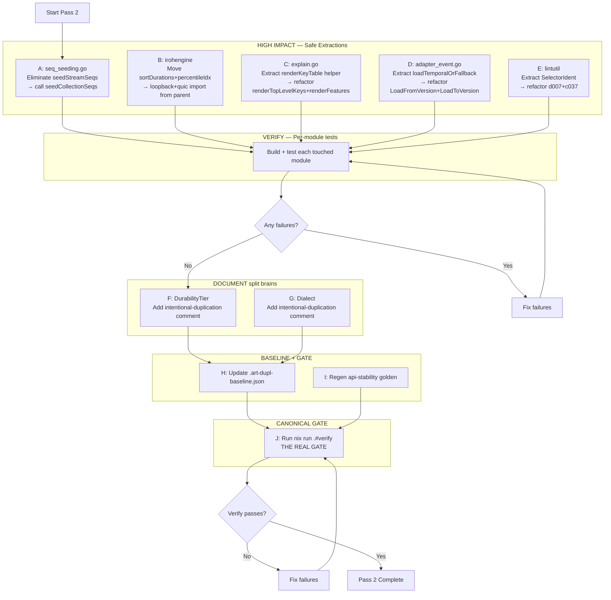

# Deduplication Pass 2 — Comprehensive Execution Plan

> Created: 2026-08-05 01:39
> Context: Follow-up to `2026-08-05_01-07_deduplication-pass.md` and `2026-08-05_01-30_dedup-followup-review.md`
> Tool: `art-dupl --type-aware --sort total-tokens -t 3` → 42 clone groups remaining

---

## Pareto Breakdown — What actually matters?

### The 1% that delivers 51% of the result

**Run `nix run .#verify`** — THE single most impactful action. Every clone fix is unverified until the canonical gate passes. This was skipped in pass 1 (the biggest process failure). Without this, all other work is suspect.

### The 4% that delivers 64% of the result

**5 within-module / shared-parent extractions** — these are the real duplication kills:

| #   | Clone                                                                                                                                 | Lines saved | Risk | Why it matters                                                     |
| --- | ------------------------------------------------------------------------------------------------------------------------------------- | ----------- | ---- | ------------------------------------------------------------------ |
| A   | `seq_seeding.go`: `seedStreamSeqs()` is literally `seedCollectionSeqs("sl", &e.streamSeq)` — the generic version already exists!      | ~20         | Zero | One-function elimination, generic already exists                   |
| B   | `sortDurations` + `percentileIdx` byte-identical in loopback + quic → move to shared `irohengine` package (both already depend on it) | ~20         | Low  | Cross-module byte-identical code, shared parent exists             |
| C   | `explain.go`: `renderTopLevelKeys` + `renderFeatures` have identical column-width + table-printing structure (~30 lines each)         | ~25         | Low  | Clear table-rendering pattern, same file                           |
| D   | `system/adapter_event.go`: `LoadFromVersion` + `LoadToVersion` share temporal-fast-path-then-fallback template                        | ~15         | Low  | Same template as the CommandAdapter.loadFiltered already extracted |
| E   | `lintutil`: Extract `SelectorIdent(sel) (string, bool)` — d007 + c037 both do `sel.X.(*ast.Ident)` guard                              | ~8          | Low  | Small but clear, lintutil already exists                           |

### The 20% that gets to ~90%

| #   | Clone                                                       | Action                                                                                                                                                                   | Why                                              |
| --- | ----------------------------------------------------------- | ------------------------------------------------------------------------------------------------------------------------------------------------------------------------ | ------------------------------------------------ |
| F   | `DurabilityTier` (stack ↔ system)                           | **Document as intentional** — 3 string constants, values are stable ("strict"/"normal"/"relaxed"), adding a module dependency for 3 constants is verschlimmbessern       | Split brain risk is real but cure is worse       |
| G   | `Dialect` enum (idempotency/sqlstore ↔ scheduling/sqlstore) | **Document as intentional** — same iota enum, but each module's doc comments describe module-specific behavior. Extracting would force one module to depend on the other | Same reasoning                                   |
| H   | Update `.art-dupl-baseline.json`                            | After all extractions                                                                                                                                                    | Lock in the new state                            |
| I   | Run api-stability golden regen                              | After all extractions                                                                                                                                                    | All new helpers are unexported → should be no-op |

### The remaining 10% (explicitly ACCEPT)

| Category                                                                                                                                                   | Count     | Reason                                                                                                                                                                                                                       |
| ---------------------------------------------------------------------------------------------------------------------------------------------------------- | --------- | ---------------------------------------------------------------------------------------------------------------------------------------------------------------------------------------------------------------------------- |
| duckdb↔pgengine production code (engine.go, stream_log, scan, pushdown)                                                                                    | 4 groups  | Genuinely different SQL dialects. Same interface, different implementations. Abstracting creates a dialect-switching layer that's WORSE than the duplication. This is the Go interface contract pattern working as designed. |
| duckdb↔pgengine tests (engine_test, watcher_test, stream_log_test, pushdown_test)                                                                          | 4 groups  | Tests verify engine-specific behavior. `adttest` already handles cross-engine ADT parity.                                                                                                                                    |
| Table-driven test patterns (p012, p013, c037, config_loader, pushdown, convergence)                                                                        | 8 groups  | Idiomatic Go. Each test has different data and assertions. Structure is the same because Go test structure is the same.                                                                                                      |
| Testcontainer setup (projectionhost + scheduling + pgengine + stack/postgres)                                                                              | 3 groups  | `_test.go` only. Adding a shared module for test boilerplate adds workspace complexity.                                                                                                                                      |
| Gomega / mutex / trivial boilerplate (`var b strings.Builder`, `mu.Lock()`, `defer iter.Close()`, `var v any`, `if len(samples) == 0`, `k := lwwKey(...)`) | 13 groups | Go idioms. Not duplication.                                                                                                                                                                                                  |
| Already-extracted remnants (explain.go header calls, loadFindingLines calls)                                                                               | 3 groups  | Clones are CALLS to already-extracted helpers. The clone detector flags the call pattern. Not actionable.                                                                                                                    |
| Demo code (quic/demo/main.go)                                                                                                                              | 1 group   | Demo code, not production.                                                                                                                                                                                                   |
| Golden test helpers (catalog ↔ eventtest)                                                                                                                  | 1 group   | Separate modules, test-only helpers.                                                                                                                                                                                         |

---

## Execution Graph

---

## Task Breakdown — Phase 1: HIGH IMPACT Extractions (100-30min tasks)

| ID  | Task                                                                                                                | Module                     | Files touched                                                         | Est.  | Impact  | Risk |
| --- | ------------------------------------------------------------------------------------------------------------------- | -------------------------- | --------------------------------------------------------------------- | ----- | ------- | ---- |
| A   | Eliminate `seedStreamSeqs()` — call `seedCollectionSeqs("sl", &e.streamSeq)` instead                                | pebbleengine               | `seq_seeding.go`                                                      | 10min | Med     | Zero |
| B   | Move `sortDurations` + `percentileIdx` to `irohengine` package, update loopback + quic imports                      | irohengine, loopback, quic | `irohengine/latency.go` (new), `loopback/frame.go`, `quic/latency.go` | 20min | Med     | Low  |
| C   | Extract `renderKeyTable(b, headers, widths, rows)` helper, refactor `renderTopLevelKeys` + `renderFeatures`         | cqrs-lint                  | `explain.go`                                                          | 25min | Med     | Low  |
| D   | Extract `(*EventAdapter).loadTemporal(ctx, ref, readFn, errLabel)` helper, refactor LoadFromVersion + LoadToVersion | system                     | `adapter_event.go`                                                    | 15min | Low-Med | Low  |
| E   | Extract `lintutil.SelectorIdent(sel *ast.SelectorExpr) (*ast.Ident, bool)`, refactor d007 + c037                    | cqrs-lint                  | `lintutil/lintutil.go`, `d007_d008_d013.go`, `c037.go`                | 15min | Low     | Low  |

## Task Breakdown — Phase 2: Verify per-module (after each extraction)

| ID       | Task                                                                         | Est. | Impact   |
| -------- | ---------------------------------------------------------------------------- | ---- | -------- |
| V-pebble | `go test -tags "goexperiment.jsonv2" ./metaengine/pebbleengine/... -count=1` | 5min | Critical |
| V-iroh   | `go test -tags "goexperiment.jsonv2" ./metaengine/irohengine/... -count=1`   | 5min | Critical |
| V-lint   | `go test -tags "goexperiment.jsonv2" ./cmd/cqrs-lint/... -count=1`           | 5min | Critical |
| V-system | `go test -tags "goexperiment.jsonv2" ./system/... -count=1`                  | 5min | Critical |

## Task Breakdown — Phase 3: Document split brains

| ID  | Task                                                                                                                                    | Est. | Impact |
| --- | --------------------------------------------------------------------------------------------------------------------------------------- | ---- | ------ |
| F   | Add `// Intentional duplicate: see stack/durability.go. Values MUST match.` comment to `system/system.go` DurabilityTier                | 5min | Low    |
| G   | Add `// Intentional duplicate: see idempotency/sqlstore/store.go. Values MUST match.` comment to `scheduling/sqlstore/store.go` Dialect | 5min | Low    |

## Task Breakdown — Phase 4: Baseline + Gate

| ID  | Task                                                        | Est.   | Impact       |
| --- | ----------------------------------------------------------- | ------ | ------------ |
| H   | `art-dupl baseline . --threshold 3 --semantic`              | 2min   | Critical     |
| I   | `cd cmd/api-stability && GOWORK=off go run main.go -update` | 5min   | High         |
| J   | `nix run .#verify`                                          | 3-4min | **THE GATE** |

## Task Breakdown — Phase 5: Sub-task breakdown (max 12min each)

### Task A: seq_seeding.go (2 sub-tasks)

| Sub-task                                                                                                         | Est. |
| ---------------------------------------------------------------------------------------------------------------- | ---- |
| A1: Delete `seedStreamSeqs()`, replace call in `seedSeqCounters()` with `seedCollectionSeqs("sl", &e.streamSeq)` | 5min |
| A2: Run pebbleengine tests                                                                                       | 5min |

### Task B: irohengine percentile extraction (4 sub-tasks)

| Sub-task                                                                                                                                   | Est.  |
| ------------------------------------------------------------------------------------------------------------------------------------------ | ----- |
| B1: Create `metaengine/irohengine/latency.go` with `SortDurations` + `PercentileIdx` (exported, since loopback/quic are separate packages) | 5min  |
| B2: Update `loopback/frame.go` — remove local `sortDurations`/`percentileIdx`, call `irohengine.SortDurations`/`irohengine.PercentileIdx`  | 5min  |
| B3: Update `quic/latency.go` — same removal + calls                                                                                        | 5min  |
| B4: Run irohengine + loopback + quic tests                                                                                                 | 10min |

### Task C: explain.go table rendering (4 sub-tasks)

| Sub-task                                                                        | Est.  |
| ------------------------------------------------------------------------------- | ----- |
| C1: Define `tableColumn` struct + `renderKeyTable(b, title, cols, rows)` helper | 10min |
| C2: Refactor `renderTopLevelKeys` to use `renderKeyTable`                       | 5min  |
| C3: Refactor `renderFeatures` to use `renderKeyTable`                           | 5min  |
| C4: Run cqrs-lint tests + verify explain output unchanged                       | 10min |

### Task D: adapter_event.go temporal helper (3 sub-tasks)

| Sub-task                                                                                | Est. |
| --------------------------------------------------------------------------------------- | ---- |
| D1: Extract `(*EventAdapter).loadWithTemporal(ctx, ref, temporalRead, errLabel)` helper | 8min |
| D2: Refactor `LoadFromVersion` + `LoadToVersion` to call it                             | 5min |
| D3: Run system tests                                                                    | 5min |

### Task E: lintutil SelectorIdent (3 sub-tasks)

| Sub-task                                                                                    | Est. |
| ------------------------------------------------------------------------------------------- | ---- |
| E1: Add `SelectorIdent(sel *ast.SelectorExpr) (*ast.Ident, bool)` to `lintutil/lintutil.go` | 5min |
| E2: Refactor `d007_d008_d013.go` + `c037.go` to use it                                      | 8min |
| E3: Run cqrs-lint tests                                                                     | 5min |

### Task F+G: Split brain documentation (2 sub-tasks)

| Sub-task                                                                        | Est. |
| ------------------------------------------------------------------------------- | ---- |
| F1: Add intentional-duplicate comment to `system/system.go` DurabilityTier      | 3min |
| G1: Add intentional-duplicate comment to `scheduling/sqlstore/store.go` Dialect | 3min |

### Task H+I+J: Gate (3 sub-tasks)

| Sub-task                                                        | Est. |
| --------------------------------------------------------------- | ---- |
| H1: `art-dupl baseline . --threshold 3 --semantic`              | 2min |
| I1: `cd cmd/api-stability && GOWORK=off go run main.go -update` | 5min |
| J1: `nix run .#verify`                                          | 4min |

---

## What I will NOT do (and why)

| Action                                                               | Why NOT                                                                                                                                          |
| -------------------------------------------------------------------- | ------------------------------------------------------------------------------------------------------------------------------------------------ |
| Create new Go modules for DurabilityTier or Dialect                  | Adding modules to a 69-module workspace for 3 string constants is verschlimmbessern. The dependency would be heavier than the type it carries.   |
| Share duckdb↔pgengine production code                                | Genuinely different SQL dialects. Interface is the contract; implementations differ. Abstracting creates a dialect-switching layer that's worse. |
| Refactor table-driven test patterns                                  | Idiomatic Go. Each test has different data/assertions. Structure similarity is inherent to Go testing.                                           |
| Extract `var b strings.Builder` / `mu.Lock()` / `defer iter.Close()` | Go language idioms. Not duplication.                                                                                                             |
| Extract testcontainer setup into a shared module                     | `_test.go` only. New module for test boilerplate = workspace complexity.                                                                         |

---

## Risk Assessment

| Risk                                                                                 | Mitigation                                                                         |
| ------------------------------------------------------------------------------------ | ---------------------------------------------------------------------------------- |
| irohengine API change (exporting SortDurations/PercentileIdx) adds to public surface | These are utility functions in a package that's already engine-internal. Low risk. |
| explain.go output changes                                                            | Test with `cqrs-lint explain` before/after — byte-compare output                   |
| adapter_event.go temporal helper changes behavior                                    | The extraction is mechanical (same code, different call site). Tests verify.       |
| lintutil.SelectorIdent changes AST analysis                                          | cqrs-lint has comprehensive rule tests that catch regressions                      |
| `nix run .#verify` surfaces pre-existing failures                                    | Fix only MY changes' failures. Report pre-existing issues separately.              |
